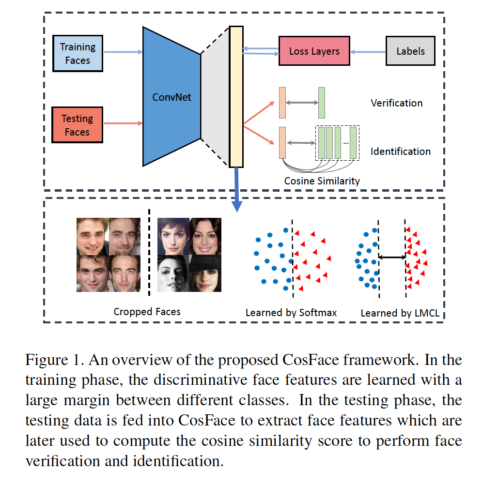
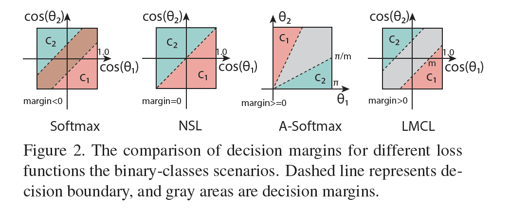
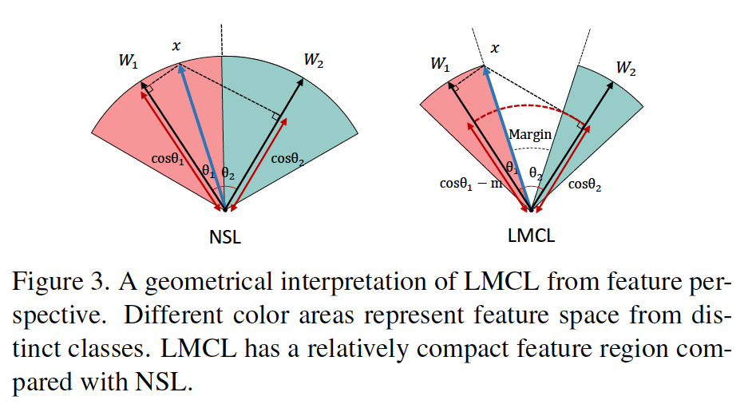
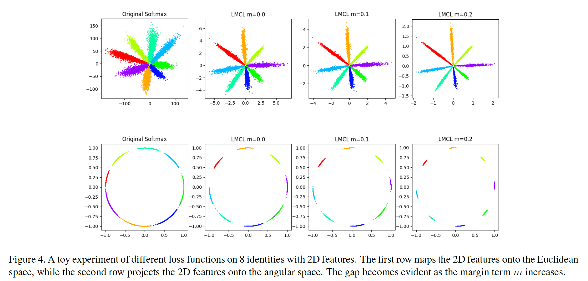
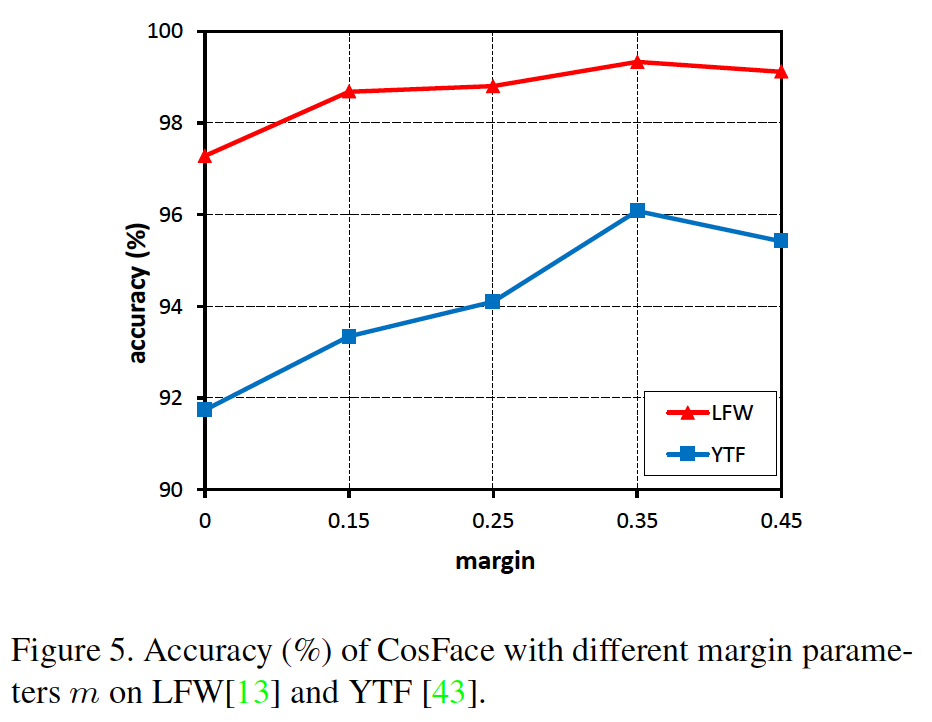
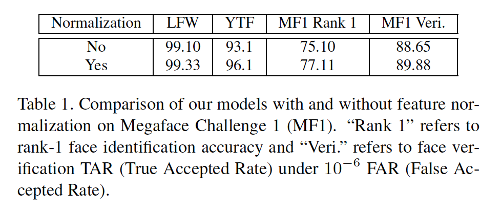
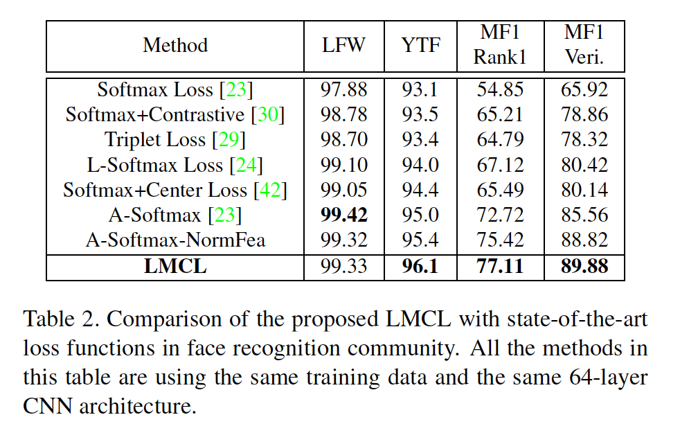
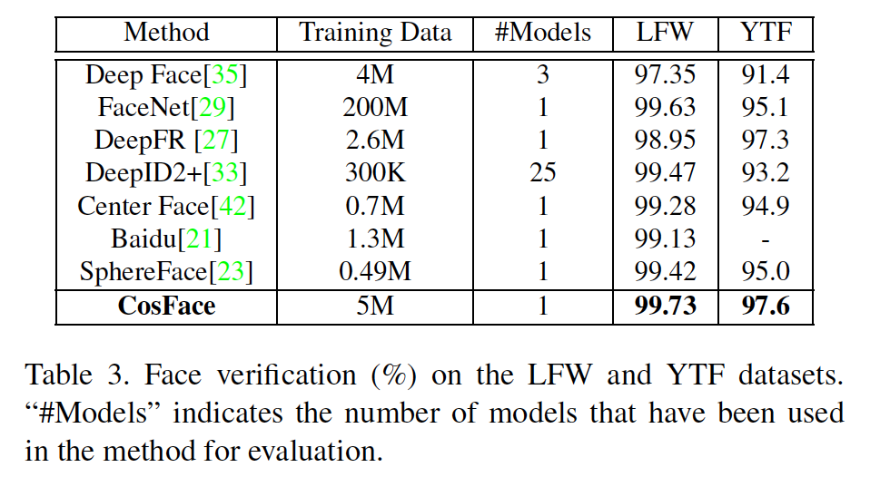
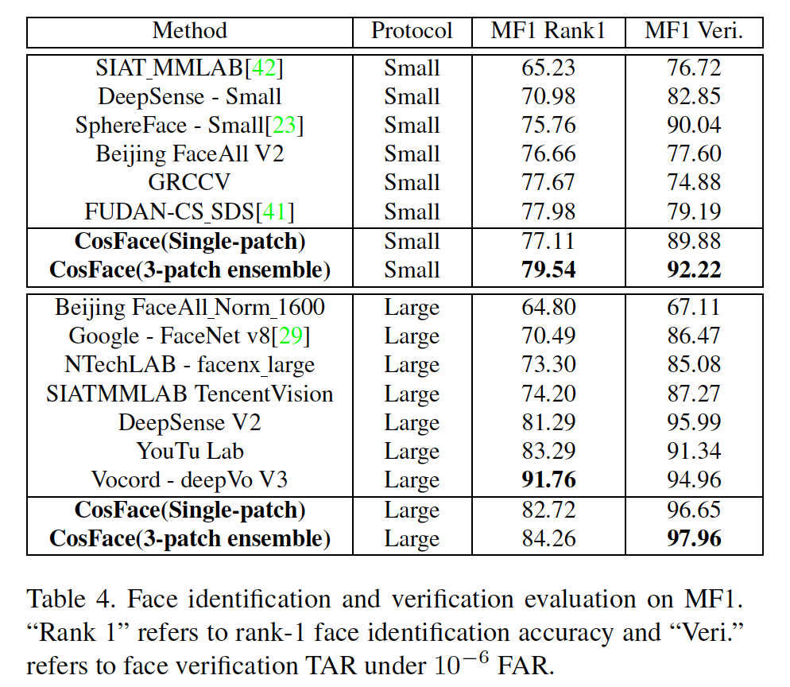
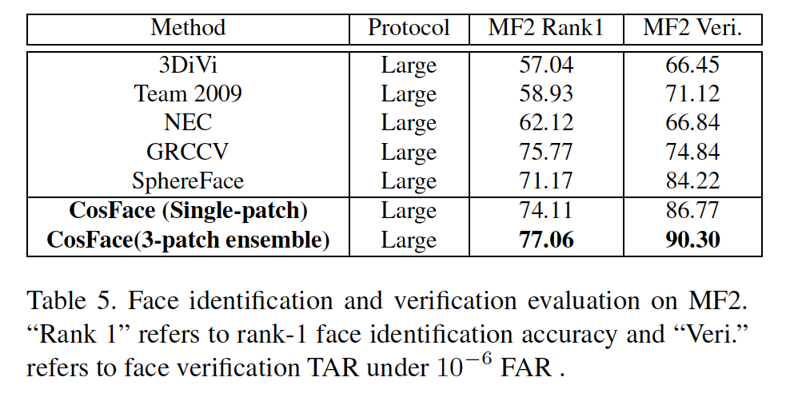

## CosFace: Large Margin Cosine Loss for Deep Face Recognition

### 摘要

​		归功于深度卷积神经网络（CNN）的进步，人脸识别作出巨大进步。人脸识别的中心任务（包括人脸验证和识别）设计人脸特征辨别性。但是，深度CNN的传统softmax损失缺乏辨别能力。为了处理这个问题，最近已提出诸如中心损失、大间隔softmax损失和角softmax损失。所有这些损失共享相同的思想：最大化类间差异和最小化类内变化。本文中，我们提出一种新颖的损失函数，即large margin cosine loss（LMCL），其从不同角度实现这种思想。更具体地说，我们将softmax损失重新公式化为余弦损失，其使用$L_2$归一化特征和权重向量以移除径向变化，在此基础之上引入余弦间隔以进一步最大化角空间中的决策间隔。结果，借助于归一化和余弦决策间隔最大化，实现了最小的类内变化和最大的类间差异。我们将利用LMCL训练的模型称为CosFace。在最流行的公开人脸识别数据集（例如MegaFace Challenge、Youtube Faces和Labled Face in the Wild）上的进行大量实验评估。我们在这些基准测试上获得最佳性能，其确认我们提出的方法的有效性。

### 1. 引言

​		在深度卷积神经网络（CNN）开发的最近进步[15、18、12、9、44]已明显提高大量计算机视觉任务上的最佳性能，其使得深度CNN成为计算机视觉的主流机器学习方法。人脸识别，作为最常用的计算机视觉任务之一，已广泛研究数十年[37、45、22、19、20、40、2]。早期研究构建具有低级人脸特征的浅层网络，而受深度CNN的驱动，现代人脸识别技术已取得极大的进步。人脸识别通常包含两个子任务：人脸验证和人脸识别。这两个任务都包含三个阶段：人脸检测、特征提取和分类。深度CNN能够提取清晰的高级特征，使其利用相对简单的分类架构即可获得卓越性能，该架构通常为多层感知机+softmax损失[35、32]。但是，最近研究[42、24、23]发现，传统的softmax损失不足以获得辨别能力。

​		为了鼓励更好的辨别性能，已提出许多研究工作[42、5、7、10、39、23]。所有这些研究共享最大化辨别能力的相同思想：最大化类间变化和最小化类内变化。虽然这些方法在传统softmax损失上提高分类性能，但是它们通常有一些额外的局限。对于[42]，它仅显式地最小化类内变化，而忽略类间变化，其可能产生次优的解决方案。[5、7、10、39]要求彻底设计成对或三元样本的挖掘方法，这是一个非常耗时的过程。最近，[23]提出从不同观点来处理这个问题。更具体地说，[23]（A-Softmax）将特征的原始欧式空间映射到角空间，并为更大的类间变化引入角间隔。

​		与[42、5、10]提出的欧式间隔相比，角间隔更好，因为角的余弦有与softmax具有的一致性。余弦的公式匹配相似性测量，其常用于人脸识别。根据这种观点，直接引入不同类之间的余弦间隔以提高余弦相关的辨别信息。

​		本文中，我们通过$L_2$归一化特征和权重向量以消除径向变化，将softmax损失重新表示为余弦损失，在此基础上引入余弦间隔项$m$以进一步最大化角度空间中的决策间隔。具体地说，我们提出新颖的算法，称为Large Margin Cosine Loss（LMCL），其将归一化特征作为输入，通过最大化类间余弦间隔学习来学习高度辨别性的特征。形式上，我们定义一个超参数$m$，使得决策边界由$\cos(\theta_1)-m=\cos(\theta_2)$给出，其中$\theta_i$类特征与类$i$的权重向量之间的夹角。

​		为了公平比较，A-Softmax的决策边界在角空间上定义为$\cos(m\theta_1)=\cos(\theta_2)$，由于余弦函数的非单调性，其很难优化。为了克服这样的难题，必须为A-Softmax使用带有临时分段函数的额外技巧。更重要的是，A-Softmax的决策间隔依赖$\theta$，其导致不同类的不同间隔。因此，在决策空间中，一些类间特征有更大的间隔，而其他特征有更小的间隔，这减小了辨别能力。与A-Softmax不同，我们的方法在余弦空间中定义决策间隔，因此避免前面提到的缺点。

​		基于LMCL，我们构建复杂的深度模型，称为CosFace，如图1所示。在训练期间，LMCL指导ConvNets来学习具有大余弦间隔的特征。在测试期间，从ConvNet上提取的人脸特征来进行人脸验证或人脸识别。我们总结这项工作的贡献如下：

​		（1）我们拥抱最大化类间变化、最小化类内变化的思想，并提出一种新颖的损失函数，称为LMCL，来学习高度辨别性的深度特征进行人脸识别。

​		（2）我们基于LMCL鼓励的超球形特征分布提供合理的理论分析。

​		（3）所提出的方法在包括LFW [13]、YTF [43]和Megaface [17、25]在内的流行人脸数据库的大多数基准上都提高了最新性能。

### 2. 相关工作

​		**Deep Face Recognition**	最近，由于深度CNN模型[18、15、34、9]的巨大成功，人脸识别已获得显著进步。在DeepFace[35]和DeepID[32]中，人脸识被视为多类别分类问题，并且首先引入深度CNN模型来在大型多身份数据集上学习特征。DeepID2[30]采用识别和验证信号来获得更好的特征嵌入。最近的工作DeepID2+[33]和DeepID3[31]进一步探索先进的网络结构来提升识别性能。FaceNet[29]使用三元损失来学习欧式空间嵌入，然后在200M人脸图像上训练深度CNN，产生SOTA性能。其他方法[41、11]也证明深度CNN在人脸识别上的有效性。

​		**损失函数**	损失函数在深度学习中起着重要作用。为了更好的特征嵌入，对比损失[5、7]和三元损失通常用于增加欧式间隔。Wen等[42]提出中心损失来学习每个身份的深度特征的中心，并使用这个特征来减小类内变化。Liu等[24]通过将角约束添加到每个身份而提出大间隔softmax（L-Softmax）[23]，从而提高特征辨别性。A-Softmax[23]通过归一化权重来改进L-Softmax，其在一系列开放集人脸识别基准测试[13、43、17]上获得更好的性能。基于对比损失或中心损失的其他损失函数[47、6、4、3]也证明了在增强辨别力方面的性能。

​		**归一化方法**	在最近的深度人脸识别中已研究归一化问题。[38]归一化权重，其利用余弦相似性替换softmax损失中的内积。[28]在特征使用$L_2$约束以在标准化空间中嵌入人脸。请注意，通过在训练过程中将更多的注意力集中在角度上，对特征向量或权重向量进行归一化可实现更低的类内角度可变性。因此，身份之间的夹角可以得到很好地优化。基于von Mises-Fisher（vMF）的方法和A-Softmax[23]也在特征学习中使用归一化。

### 3. 所提出的方法

#### 3.1. Large Margin Cosine Loss

​		我们从余弦角度重新思考softmax损失开始。softmax损失通过最大化ground-truth类的后验概率来从不同类中分离特征。给定与标签$y_i$对应的输入特征向量$x_i$，softmax损失可以表示为：

$$L_s = \frac{1}{N}\sum_{i=1}^N-\log p_i = \frac{1}{N}\sum_{i=1}^N -\log\frac{e^{f_{y_i}}}{\sum_{j=1}^C e^{f_j}},\tag{1}$$

其中$p_i$表示$x_i$被正确分类的后验概率。$N$为训练样本的数量，$C$为类的数量。$f_j$通常表示为具有权重向量$W_j$和偏置$B_j$的全连接层的激活。为了简明起见，我们将固定偏置$B_j=0$，产生的$f_j$为：

$$f_j = W_j^Tx=\|W_j\|\|x\|\cos\theta_j, \tag{2}$$

其中$\theta_j$为$W_j$和$x$之间的夹角。这个公式表明向量的范数和角度都对后验概率有影响。

​		为了开发有效的特征学习，$W$的范数一定是不变的。为此，我们通过$L_2$范数固定$\|W_j\|=1$。在测试阶段中，测试人脸对的人脸识别得分通常根据两个特征向量之间的余弦相似性计算。这表明特征向量$x$的范数对得分函数没有帮助。因此，在训练阶段，我们固定$\|x\|=s$。因此，后验概率仅依赖角的余弦。修改的损失可以表示为：

$$L_{ns} = \frac{1}{N}\sum_i-\log\frac{e^{s \cos(\theta_{y_i,i})}}{\sum_j e^{s\cos(\theta_{j,i})}}.\tag{3}$$

因为我们通过固定$\|x\|=s$而移除径向变化，产生的模型学习在角空间可分离的特征。本文中，我们称这种损失为Normalized version of Softmax Loss（NSL）。

​		但是，NSL学习的特征辨别性不足，因为NSL仅强调正确分类。为了处理这个问题，我们向分类边界引入余弦间隔，其自然而然地被纳入Softmax的余弦公式。

​		考虑二类场景为例，令$\theta_i$表示学习到的特征向量与类$C_i(i=1,2)$的权重向量之间的夹角。对于$C_1$，NSL迫使$\cos(\theta_1) > \cos(\theta_2)$，相似地，对于$C_2$，NSL迫使$\cos(\theta_1) < \cos(\theta_2)$，使得不同类的特征被正确分类。为了开发大间隔分类器，我们进一步要求$\cos(\theta_1)-m > \cos(\theta_2)$和$\cos(\theta_2) - m > \cos(\theta_1)$，其中$m\ge0$为引入控制余弦间隔幅度的固定参数。因为$\cos(\theta_i)-m$小于$\cos(\theta_i)$，约束对于分类更直接。上述分析可以推广到多类场景。因此，修改后的损失通过鼓励余弦空间中额外的间隔来加强对学习特征的区分。

​		形式上，我们将Large Margin Cosine Loss（LMCL）定义为：

$$L_{lmc}=\frac{1}{N}\sum_i -\log\frac{e^{(s(\cos(\theta_{y_i,i})-m)}}{e^{s(\cos(\theta_{y_i,i})-m)}+\sum_{j \ne y_i}e^{s\cos(\theta_{j,i})}}, \tag{4}$$

使得

$$\begin{align}W &= \frac{W^{\ast}}{\|W^{\ast}\|}, \\ x &= \frac{x^{\ast}}{\|x^{\ast}\|}, \\\cos(\theta_j, i)&=W_j^Tx_i,\end{align}\tag{5}$$

其中$N$为训练样本的数量，$x_i$为与ground-truth类$y_i$对应的第$i$个特征向量，$W_j$为第$j$个类的权重向量，$\theta_j$为$W_j$和$x_i$之间的夹角。

#### 3.2. 不同损失函数的比较

​		本节中，我们将方法（LMCL）的决策间隔与：Softmax、NSL和A-Softmax进行比较，如图2所示。为了分析的简单，我们考虑具有类$C_1$和$C_2$的二类场景。令$W_1$和$W_2$分别表示$C_1$和$C_2$的权重向量。

​		**Softmax**损失定义决策边界：

$$\|W_1\|\cos(\theta_1)=\|W_2\|\cos(\theta_2).$$

因此，它的边界依赖权重向量和角的余弦的幅度，其在余弦空间中产生重叠决策区域（margin < 0）。这如图2的第一个字图。如前面提到的，在测试阶段，仅考虑人脸测试特征向量之间的余弦相似性是常用策略。因此，利用Softmax损失训练的分类器不能完美分类余弦空间中的测试样本。

​		**NSL**归一化权重向量$W_1$和$W_2$使得它们有常量幅度1，其由下式产生决策边界：

$$\cos(\theta_1) = \cos(\theta_2).$$

NSL的决策边界如图2的第二子图所示。我们可以看出，通过移除径向变化，NSL可以完美分类余弦空间中的测试样本，margin=0。但是，由于没有决策间隔，因此对噪声的鲁棒性还不强：决策边界周围的任何微小扰动都会改变决策。

​		**A-Softmax**通过引入额外的间隔提高softmax损失，使得它的决策边界由下式给出：

$$\begin{align}C_1: \cos(m\theta_1) &\ge \cos(\theta_2),\\ C_2: \cos(m\theta_2) &\ge \cos(\theta_1).\end{align}$$

因此，对于$C_1$，它要求$\theta_1 \le \frac{\theta_2}{m}$，对于$C_2$也相似。图2的第3个子图描述这一决策区域，其中灰色区域表示决策间隔。但是，A-Softmax的间隔在所有$\theta$值上不是一致的：间隔随$\theta$的减小而减小，当$\theta=0$是，完全消失。这产生两个问题。第一，对于视觉上相似的困难类$C_1$和$C_2$，有$W_1$和$W_2$之间的夹角更小，间隔因此更小。第二，技术上讲，不得不采用一种特殊的分段函数来克服余弦函数的非单调性难题。

​		**LMCL**（我们的方法）在余弦空间定义决策边界，而不是在角空间（如A-Softmax）：

$$\begin{align}C_1: \cos(\theta_1) &\ge \cos(\theta_2) + m, \\ C_2: \cos(\theta_2) &\ge \cos(\theta_1) + m.\end{align}$$

因此，对于$C_1$（$C_2$也相似），$\cos(\theta_1)$被最大化，而$\cos(\theta_2)$被最小化，从而进行大间隔分类。图2的最后的子图给出余弦空间中的LMCL的决策边界，其中我们可以在产生的角度余弦分布中看到明显的间隔$\sqrt{2}m$。这表明LMCL比NSL更鲁棒，因为决策边界（虚线）小型扰动不太可能导致错误的决策。余弦间隔始终应用于所有样本，而不管其权重向量的角度如何。

#### 3.3. 特征归一化

​		在所提出的LMCL中，涉及归一化方案的目的是推导余弦损失的公式并消除径向方向上的变化。与仅归一化权重向量的[23]不同，我们的方法同时归一化权重向量和特征向量。因此，特征向量分布在一个超球面，其中缩放参数$s$控制半径的幅度。本子节中，我们讨论，在提出的LMCL方法中，为什么特征归一化是必要的，以及特征归一化是如何鼓励更好的特征学习。

​		从两个方面介绍了特征归一化的必要性：第一，没有特征归一化的原始softmax损失隐式学习特征向量的欧式范数（$L_2$范数）和角余弦值。$L_2$范数自适应地学习以最小整体损失，产生相对较弱的余弦约束。特别地，容易样本的自适应$L_2$范数要比困难样本大得多，以弥补余弦间隔的劣等性能。相反，我们的方法要求整个特征向量集具有相同的$L_2$范数，以便学习仅依赖余弦值来开发判别能力。来自相同类别的特征向量被聚在一起，而来自不同类别的特征向量在超球面上被拉开。此外，我们考虑模型最初开始最小化LMCL时的情况。给定特征向量$x$，令$\cos(\theta_i)$和$\cos(\theta_j)$分别表示两个类的余弦得分。没有特征上的归一化，LMCL迫使$\|x\|(\cos(\theta_i) - m) > \|x\|\cos(\theta_j)$。注意，$\cos(\theta_i)$和$\cos(\theta_j)$最初相当。因此，只要$(\cos(\theta_i) - m)$小于$\cos(\theta_j)$，$\|x\|$需要减小以最小化损失，这衰退优化。因此，在LMCL监督下，特征归一化至关重要，特别是当网络从头训练时。同样，固定缩放参数$s$而不是自适应学习更有利。

​		此外，缩放参数$s$应当设置为足够大的值，以产生具有更低训练损失的更好表现的特征。对于NSL，损失随着$s$的增加而连续下降，而$s$太小则导致收敛不足，甚至没有收敛。对于LMCL，我们还需要足够大的$s$，以确保具有足够大的空间用于特征学习，并具有较大的间隔。

​		接下来，我们证明参数$s$应当有下界（lower bound）以获得期望的分类性能。给定归一化的特征向量$x$和单位权重向量$W$，我们将类的总数表示为$C$。假设，学习的特征向量单独位于超球面，并以对应的权重向量为中心。令$P_W$表示类中心（即$W$）的期望最小后验概率，$s$的下界为：

$$s \ge \frac{C-1}{C}\log\frac{(C-1)P_W}{1 - P_W}.\tag{6}$$

​		基于这一边界，我们可以推断出，如果我们期望针对特定数量的类别进行分类的最优$P_w$，则$s$应该一致地扩大。此外，通过固定$P_W$，期望的$s$应当更大以处理更多的类，因为在相对紧凑的空间中，类的数量的增加也会增加分类难度。因此，大半径$s$的超球面需要具有小类内距离和大类间距离的嵌入特征。

#### 3.4. LMCL的理论分析

​		前面的小节主要从分类的角度讨论了LMCL。在学习超球面上的辨别特征方面，余弦间隔用作重要部分，可增强特征的辨别能力。关于余弦间隔（即超参数$m$的边界）的量化可行性的详细分析是必要的。$m$的最佳选择可能会导致更有前途的关于高度辨别性人脸特征的学习。接下来，我们深入特征空间的决策边界和角间隔来推导超参数$m$的理论边界。

​		首先，如前面一样，考虑类$C_1$和$C_2$的二类情况，假设给定归一化特征向量$x$。令$W_i$表示归一化权重向量，$\theta_i$表示$x$和$W$之间的夹角。对于NSL，决策边界定义为$\cos\theta_1 - \cos\theta_2=0$，其等价于$W_1$和$W_2$的角平分线，如图3左图所示。这解决了由NSL监督的模型将潜在特征空间划分为两个接近的区域，边界附近的特征非常不明确（即属于任一类都是可接受的）。相比之下，对于$C_1$，LMCL驱动由$\cos\theta_1 - \cos\theta_2=m$制定决策边界，其中$\theta_1$应当远小于$\theta_2$（对于$C_2$也相似）。因此，类间变化被扩大，而类内变化被缩小。

​		回到图3，人们可以看出最大间隔受$W_1$和$W_2$之间的夹角的影响。因此，当给定$W_1$和$W_2$时，余弦间隔应有有限的变量作用域。具体而言，假设一个场景，属于第$i$类的所有特征向量都与第$i$类的相应权重向量$W_i$完全重叠。换句话说，每个特征向量与类$i$的权重向量相同，并且显然，特征空间处于极端情况，其中所有特征向量都位于其类中心。在这种情况下，决策边界的间隔已被最大化（即余弦间隔的严格上界）。

​		总的来说，我们假设所有特征都被很好地分离，并且我们总共有$C$类。$m$的理论变量范围应为：$0 \le m \le (1 - \max(W_i^TW_j))$，其中$i,j\le n, i\ne j$。softmax损失尝试最大化来自两个不同类的任意两个权重向量之间的夹角，从而进行完美分类。因此，softmax损失的最优解决方案应当将权重向量均匀地分布在单位超球面上。基于这种假设，引入的余弦间隔$m$的变量域可以推导如下：

$$\begin{align}0 &\le m \le 1 - \cos\frac{2\pi}{C}, (K=2) \\0 &\le m \le \frac{C}{C-1}, (C\le K+1)\\0 &\le m \ll \frac{C}{C-1}, (C > K+1)\end{align}\tag{7}$$

其中$C$为训练类的数量，$K$为学习到的特征维度。不等式表示，随着类的数量增加，类之间的余弦间隔的下界也相应减小。特别是，如果类的数量远大约特征维度，余弦间隔的商界将更小。

​		更大的$m \in [0, \frac{C}{C-1}]$的合理选择应当有效提升高度辨别性特征的学习。然而，实践中，由于特征空间的消失，参数$m$通常不能达到理论上界。即，根据相应类的权重向量，所有特征被聚集到一起。事实上，当$m$过大时，模型不能收敛，因为余弦约束（即对于两个类，$\cos\theta_1 - m > \cos\theta_2$或$\cos\theta_2 -m > \cos\theta_1$）变得更严格，并且难以被满足。此外，将过大$m$的余弦间隔施加到训练过程以对噪声数据更敏感。由于无法收敛，因此不断增大的$m$会在某个时刻降低整体性能。

​		我们进行玩具实验进行更好的特征可视化，并验证我们的方法。我们从包含足够样本的8个不同身份中选择人脸图像，以清楚地显示图中的特征点。使用原始的softmax损失和具有不同$m$的LMCL训练几个模型。为了简明，我们提取2维人脸图像特征。如上讨论，$m$应当不大于$1 - \cos\frac{\pi}{4}$（大约为0.29），所以我们设置$m$的三个选项进行比较，其为$m=0$、$m=0.1$和$m=0.2$。如图4所示，第一行和第二行表示欧式空间和角空间的特征分布。我们可以观察到，原始的softmax损失在决策边界上产生模棱两可，而所提出的LMCL表现更好。随着$m$的增加，不同类之间的角间隔被放大。

### 4. 实验

#### 4.1. 实现细节

​		**预处理**	首先，使用MTCNN[16]检测整个训练集和测试图像上的人脸区域和标志点。然后，使用5个人脸标志点（两只眼睛、鼻子和两个嘴角）进行相似性变换。之后，我们获得被调整为$112 \times 96$的裁剪人脸。遵循[42、23]，RGB图像中的每个像素（在$[0,255]$之间）通过减去127.5、除以128归一化。

​		**训练**	为了使用小型训练数据集（少于0.5M图像和20K主体）的现有结果进行直接和公平的比较[17]，我们在小型训练数据集上训练了我们的模型，该训练数据集是公开可用的CASIA-WebFace[46]数据集，其中包含来自10,575名受试者的49万张面部图像。我们还使用大型训练数据集来评估我们的方法与基准人脸数据集上的最新结果（使用大型训练数据集）进行基准比较的性能。这项研究中使用的大型训练数据集包含几个公开数据集和一个私有人脸数据集，包含来自超过90K身份的大约5百万图像。水平翻转训练图像以进行数据增强。在我们的实验中，我们移除测试数据集中出现的身份的图像。

​		为了进行公平比较，本文使用的CNN架构与[23]相似，其有64个卷积层，并且基于残差单元[9]。式（4）中的缩放参数$s$设置为64。我们使用Caffe[14]实现损失层的修改，并运行模型。使用SGD算法训练CNN模型，8张GPU上的批大小为64。对于小型数据集上的训练情况，学习率最初为0.1，在16K、24K、28K迭代时分别除以10，并且我们在30K迭代时完成训练过程。而大型数据集上的训练在240K迭代时终止，初始学习率为0.05，并在80K、140K和200K迭代时分别除以10。

​		**测试**	在测试阶段，原始图像和翻转图像的特征被拼接到一起以组成最终的人脸表示。特征的余弦距离计算为相似性得分。最后，通过阈值和排序得分进行人脸验证和识别。

#### 4.2. 探索实验

​		**$m$的影响**	在LMCL中，间隔参数$m$起着关键作用。在这一部分中，我们进行实验来研究$m$的影响。$m$在0到0.45变化（如果$m$大于0.45，模型不能收敛），我们使用小型训练数据（CASIA-WebFace[46]）来训练CosFace模型，并在LFW[13]和YFT[43]数据集上评估其性能，如图5所示。我们可以看出，没有间隔的模型（这种情况下，$m=0$）导致最差的性能。随着$m$的增加，连个数据集上的准确率持续改进，并且$m=0.35$时达到饱和。这表明间隔$m$的有效性，通过增加间隔$m$，学习到的特征的辨别能力可以明显改善。在这项研究中，在后续实验中，$m$设置为固定的0.35。

​		**特征归一化的影响**	为了研究我们方法中特征归一化的影响，我们通过将$m$固定为0.35，在带有或不带有特征归一化方案的CASIA-WebFace上训练我们的CosFace模型，并比较它们在LFW [13]、YTF [43]和Megaface Challenge 1（MF1）[17]上的性能。注意，未经归一化训练的模型由softmax损失初始化，然后由提出的LMCL监督。比较结果见表1。使用特征归一化方案的模型始终比没有特征归一化方案的模型好。如上讨论的，特征归一化移除径向变化，并且学习特征可以在角空间更具辨别性。这个实验验证了这一点。

#### 4.3. 与最佳损失函数的比较

#### 4.4. 综合基准测试比较

#### 4.4.1 LFW和YTF上的评估

##### 4.4.2 MegaFace上的评估

**MegaFace Challenge 1（MF1）**

**MegaFace Challenge 2（MF2）**

