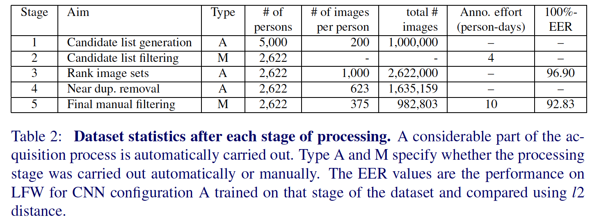
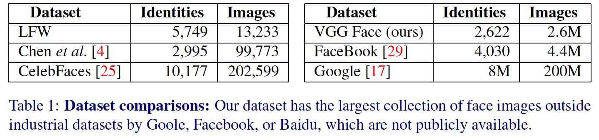
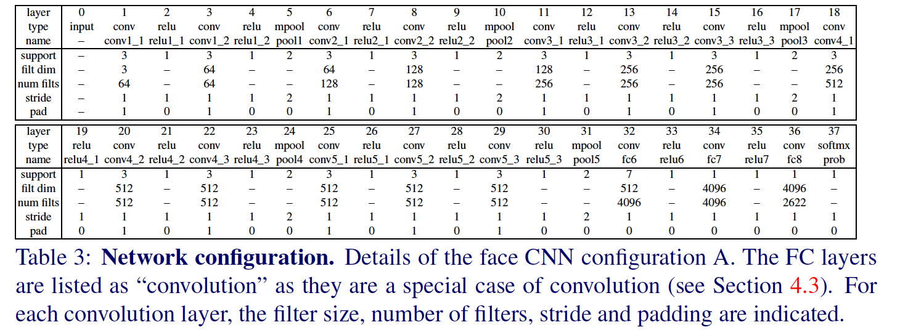
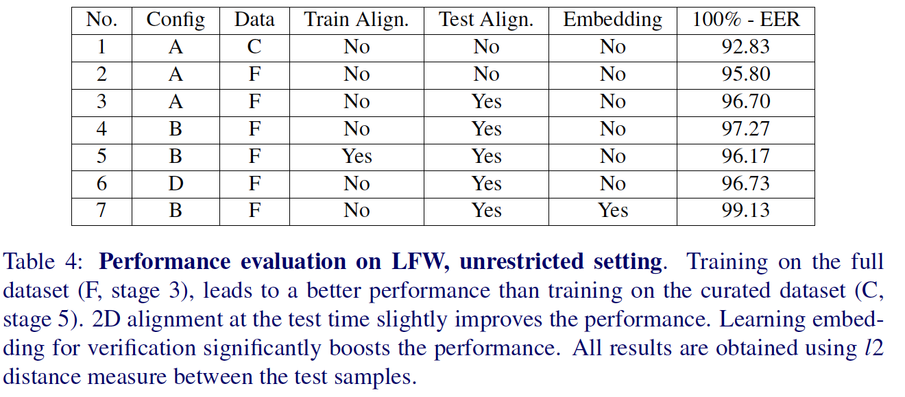
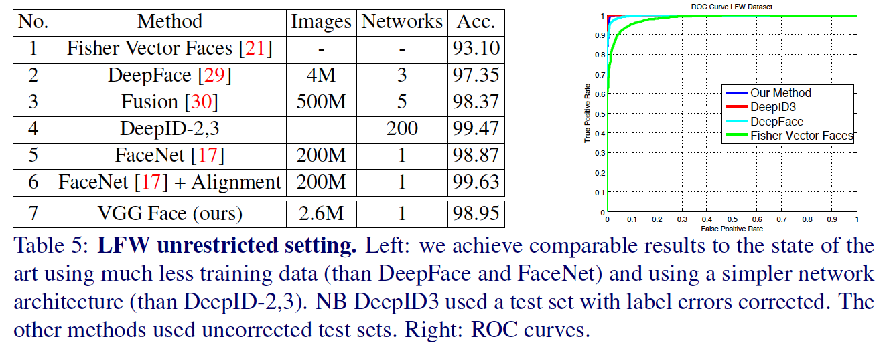
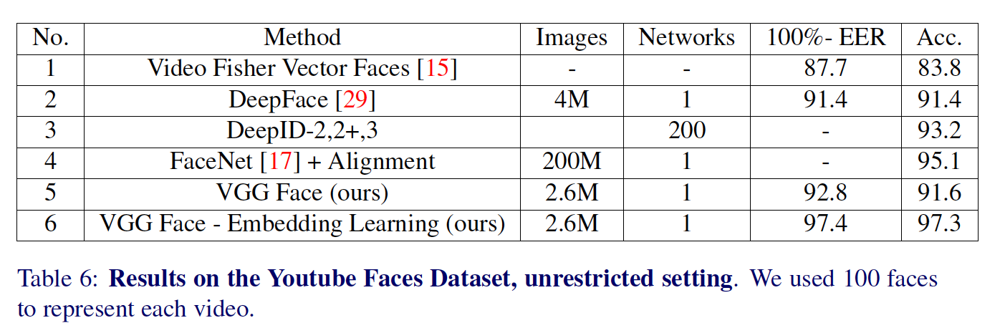

## Deep Face Recognition

### 摘要

​		本文的目标是从单张照片或视频中跟踪的一组面部中识别面部。这个领域的最近进步是由于两个方面的因素：（i）使用卷积神经网络（CNN）进行任务的端到端学习，以及（ii）超大规模训练数据集的可用性。

​		我们作出两个贡献：第一，我们证明如何通过自动化和人工结合在循环中组装非常大规模的数据集（260万张图像，超过2.6K人），并讨论了数据纯度和时间之间的权衡；第二，我们遍历深读网络训练和人脸识别的复杂性，以提供与标准LFW和YTF人脸基准相比可达到与现有技术水平相当的结果的方法和步骤。

### 1	引言

​		卷积神经网络（CNN）席卷了计算机视觉界，极大地改善了许多应用的技术水平。这种方法成功的最重要因素之一就是大量训练数据的可用性。ImageNet大规模视觉识别挑战赛（ILSVRC）[16]在为一般图像分类任务提供此数据时发挥了作用。 最近，研究人员已将数据集用于场景分类和图像分割[12、33]。

​		但是，在人脸识别世界，缺乏大尺度公开数据集，由于这个原因，社区中取得大多数进步仍局限于互联网巨头，如Facebook和Google等。例如，最近Google提出的人脸识别方法使用2亿张图像和8百万唯一身份来训练。这个数据集的大小几乎比任何公开可用人脸数据大了3个数量级（见表1）。不用说，建立如此庞大的数据集超出了大多数国际研究小组的能力，尤其是在学术界。

​		本文有两个目标。第一个是介绍创建合理的大规模人脸数据集的过程，同时仅需要有限的人力进行标注。为此，我们提出了一种使用网络上可用的知识源收集人脸数据的方法（第3节）。我们采用这一过程来构建超过两百万人脸的数据集，并免费向研究社区开放。第二个目标是研究用于人脸识别和验证的不同CNN架构，包括探索人脸对齐和度量学习，其使用新颖的数据集进行训练。关于人脸识别的许多最新工作为人脸提出了CNN架构的众多变体，并且我们评估了其中的一些建模选择，以便从无关的细节中过滤出重要的内容。结果是，在所有流行的图像和视频人脸识别基准（第5和第6节）上，实现了近乎最先进的结果的简单得多且有效的网络体系结构。 我们的发现总结在第7节中。

### 2	相关工作

​		本文关注图像和视频中的人脸识别，这个问题在最近已受到广泛关注。在文献中提出的许多方法中，我们将未使用深度学习的方法（称为“浅”）与那些未使用深度学习的方法（称为“深度”）区分开来。浅层方法从使用手工局部图像描述子（如SIFT、LBP、HOG）提取人脸图像表示开始。然后它们使用过池化机制将如此的局部描述子聚合到一个综合人脸描述子，例如Fisher Vector[15、20]。有很多这样的方法，在这里不能详细描述（例如，请参见[15]中的参考文献以进行概述）。

​		这项工作主要关注深度架构进行人脸识别。如此方定义的特征是CNN特征提取器的使用，通过组合几种线性和非线性算子获得可学习函数。这里方法的代表系统为DeepFace。该方法使用经过训练的深层CNN，使用涵盖4000个唯一身份的400万个示例数据集对人脸进行分类。它还使用孪生网络架构，其中将想相同CNN用于人脸对以获得描述子，然后使用欧式距离进行比较。训练目标是最小化共同人脸对（即相同身份的肖像）之间的距离，并最大化不同人脸对之间的距离。除了使用非常大量的训练数据外，DeepFace还使用CNN的集成，以及预处理阶段，其中使用3D模型将人脸图像对齐到标准姿态。在引入之后，在LFW和YFW上获得最佳性能。作者随后在[30]中通过将数据集的大小增加了两个数量级来扩展了这项工作，其中包括1000万个身份和每个身份50个图像。它们提出一种bootstrap策略来选身份以训练网络，并证明通过控制全连接层的维度提高网络的泛化。

​		Sun等人[24、25、26、27]的DeepId系列论文扩展了DeepFace的工作，每篇论文都逐渐但稳定地提高了LFW和YFW。在这一系列论文中纳入了许多新想法，包括：使用多个CNN、贝叶斯学习框架来训练一个度量、分类和验证上的多任务学习、每个卷积层后分支出一个全连接层的不同CNN架构以及受[19、28]启发的非常深的网络。与DeepFace相比，DeepID没有使用3D人脸对齐，但是使用更简单的2D仿射对齐（如本文所做的）和在CelebFaces和Chen等的组合。但是，[27]中的最终模型非常复杂，其涉及大约200个CNN。

​		最近，Google的研究人员使用2亿人脸身份和8亿图像人脸对的大型数据集来训练CNN，与[28]和[18]相似。他们使用“基于三元组”的损失的一个不同点是，比较了两个相同人脸$(a,b)$和第三个不相交的人脸$c$。目标是使$a$比$c$更接近$b$；换句话说，与其他度量学习方法不同，比较实用相对“pivot”人脸。这与在应用中使用度量标准的方式更加匹配，在该应用中，将查询人脸与其他人脸的数据库进行比较以找到匹配项。 在训练中，这种损失会应用到多个层，而不仅仅是最后一层。 该方法目前在LFW和YTF上达到最佳性能。

### 3	数据收集

​		本节中，我们提出多阶段策略来收集大规模人脸数据集，其包含成千上万个唯一身份的数百个示例图像（表1）。表2总结了该过程的不同阶段以及相应的统计信息。下面的段落详细讨论了各个阶段。

**Stage 1. Bootstrapping a list of candidate identity names**	构建数据集的第一个阶段是获得候选身份的名字列表。这个想法的重点是名人和公众人物，例如演员或政客，以便可以在网络上找到足够数量的不同图像，并避免在下载图像时出现任何隐私问题。通过从Internet电影数据库（IMDB）名人列表中提取按受欢迎程度排名的男性和女性，可以获得公众人物的初始列表。该列表主要包含演员，在Freebase知识图中[1]与所有人员相交，该图具有有关约50万种不同身份的信息，从而产生了2.5K男性和2.5K女性的排序列表。这形成了一个5K名称的候选列表，这些姓名众所周知（从IMDB）是受欢迎的，并且我们拥有其属性信息，例如种族，年龄，血统等（来自知识图）。 总共选择了5K图像，以使小型标注团队可以管理后续注释过程。然后，使用Google Image Search给候选列表中的每个姓名下载200张图像。

**Stage 2. Filtering a list of candidate identity names**	然后，过滤候选列表以删除不同图像不足的身份，以及删除与标准基准数据集有任何重叠的身份。然后将每位候选者200张图像提供给人类标注人员（顺序为50页的四页），以确定哪些身份可产生足够的图像纯度。具体而言，仅当相应的200组图像的纯度大约为90％时，标注人员才被要求保留身份。纯度不足可能是由于同名或图像缺乏。过滤步骤将候选列表减小到3250个身份。接下来，LFW和YTF数据集中出现的所有姓名都将被删除，以便可以在新的数据集上进行训练，并且仍然可以根据这些基准进行公平的评估。 以这种方式，获得了2,622个名人姓名的最终列表。

**Stage 3. Collecting more images for each identity and automatic filtering**	在Google和Bing Image Search中都会查询到2,622个名人姓名中的每个名字，然后在名称中加上关键字“ actor”之后再次查询。这给每个人产生4个查询，每个查询500个结果，每个分类器获得2000张图像。下一步是使用分类器自动删除每组中的错误人脸。为了给每个身份获得前50张图像（基于下载集中Google搜索排序）作为正类训练样本，所有其他身份的前50张图像用作负训练样本。使用Fisher Vector Face 描述子为每个身份训练one-vs-rest线性SVM。然后，将每个身份的线性SVM用于对该身份的2,000个下载图像进行排名，并保留前1,000个（选择阈值数1,000以有利于积极预测中的高精度）。

**Stage 4. Near duplicate removal**	删除了由两个不同的搜索引擎找到的同一图像或在两个不同的Internet位置找到的同一图像的副本产生的精确重复图像。几乎重复的图像（例如，仅在色彩平衡上有所不同或叠加了文字的图像）也将被删除。 这是通过为每个图像计算VLAD描述符[2、9]，使用非常严格的阈值将每个描述符的1,000个图像中的此类描述符聚类，并在每个聚类中保留单个元素来完成的。

**Stage 5. Final manual filtering**   此时，有2,622个身份，每个身份最多有1,000张图像。 此最后阶段的目的是使用人工注释来提高数据的纯度（精度）。但是，为了使注释任务的负担减轻，从而避免较高的标注成本，标注人员再次使用自动排序来进行辅助。然而，这次，使用[10]的AlexNet架构，对多路CNN进行了训练，以区分2,622个面部身份。 然后使用softmax分数通过降低成为常态的可能性来对每个身份集中的图像进行排名。为了加速注释器的工作，将每个标识的排名图像显示在200个块中，并要求标注人员对块进行整体验证。 尤其是，如果近似纯度大于95％，则说明该块为良品。 好的图像的最终数量为982,803，其中正脸大约95％，侧脸大约5％。

**讨论**	总体而言，这种结合使用Internet搜索引擎，使用现有的面部识别方法过滤数据以及有限的手动管理功能，可以生成一个准确的大规模人脸数据集，并标有其身份。人脸标注识别非常小——手工处理工作量仅需大约14人天，并且到stage 4仅需4人天。表1将我们的数据集与其他已有数据进行比较。

​		上面的过程中已经做出了许多设计选择。这里，我们建议一些替代方法和扩展。Freebase源可以由其他类似源代替，例如DBPedia（结构化WikiPedia）和Google知识图。事实上，Freebase很快就会关闭，并由Google Knowledge Graph替代。在图像收集方面，可以从诸如Wikimedia Commons、IMDB之类的源以及从百度和Yandex之类的搜索引擎中收集其他图像。阶段的顺序可以更改为在阶段3之前删除几乎重复的项目。在扩展方面，可以通过查看下载图像之间成对距离的分布来自动进行标注的第一阶段。 具有高纯度的图像类别应表现出相当单峰的分布。

### 4	网络架构和训练

​		本节描述用于我们实验的CNN和它们的训练。受[19]启发，网络“非常深”，其中它们包含长序列的卷积层。如此的CNN在ImageNet LSVRC2014挑战以及许多其他任务[7、19、28]中获得最佳性能。

#### 4.1. Learning a face classifier

​		初始时，通过构造$N$路分类问题，学习识别第3节数据集的$N = 2,622$个唯一身份，从而引导了深层架构$\phi$。CNN将每幅图像$l_t, t=1,\cdots,T$与一个得分向量$\mathbf{x}_t = W \phi(l_t) + b\in \mathbb{R}^N$，这通过包含$N$个线性预测器$W \in \mathbb{R}^{N \times D}, b \in \mathbb{R}^N$（每个身份对应一个预测器）的全连接层的均值完成。通过计算经验性softmax对数损失，将这些得分与ground-truth类身份$c_t \in \{1,\cdots, N\}$进行比较：

$$E(\phi) = -\sum_t \log\Big(e^{\lang \mathbf{e}_{c_t}, \mathbf{x}_t\rang}/\sum_{q=1,\cdots,N}e^{\lang \mathbf{e}_q, \mathbf{x}_t\rang}\Big)\tag{1}$$

其中$\mathbf{x}_t = \phi(l_t) \in \mathbb{R}^D$，$\mathbf{e}_t$表示类$c$的one-hot向量。

​		在学习之后，分类器层$(W,b)$可以被删除，向量$\phi(l_t)$用于表示人脸。然后，人脸身份验证可以使用欧式距离来比较相关向量。但是，使用“triplet loss”训练计划调整欧式空间的验证可以明显提高性能，这将在下一节中描述。虽然三元组损失训练对于获得良好的整体性能至关重要，但是如本节所述，引导网络作为分类器可以使三元组训练明显更容易、更快速。

#### 4.2	Learning a face embedding using a triplet loss

​		Triplet损失训练旨在学习得分向量，该向量在最终应用（即欧式空间中通过比较人脸描述符的身份验证）。这在本质上与“度量学习”相似，并且像许多度量学习方法一样，被用于学习既独特又紧凑的投影，同时实现降维。

​		我们的三重损失训练计划在精神上类似于[17]。CNN的输出$\phi(l_t) \in \mathbb{R}^D$（如4.1节解释的预训练）被$l^2$归一化，并使用线性投影$\mathbf{x}_t = W'\phi(l_t)/\|\phi(l_t)\|_2, W'\in\mathbb{R}^{L \times D}$映射到$l \ll D$维空间。虽然这个公式与上述学习的线性预测器类似，但是存在两个关键差异。第一个是，$L \ne D$不等于类身份的数量，但是它为（任意）描述符嵌入的大小（我们设置$L = 1024$）。第二个是，训练投影$W'$来最小化经验triplet loss：

$$E(W') = \sum_{(a,p,n)\in T}\max\{0, \alpha - \|\mathbf{x}_a - \mathbf{x}_m\|_2^2 + \|\mathbf{x}_a - \mathbf{x}_p\|_2^2\}\tag{2}$$

注意，与前一节不同，这里没有学习偏置项，因为（2）中的差异会抵消它。这里，$\alpha \ge 0$被固定为表示_learning margin_的标量，$T$为_training triplets_集合。triplet $(a,p,n)$包含_anchor_人脸$a$以及正类$p \ne a$，和anchor身份的负类$n$示例。在目标数据集（如LFW和YTF）上学习$W'$。第4.4节讨论了三元组训练$T$集的构造。

#### 4.3	架构

​		我们考虑基于[19]的A、B和D架构。表3给出CNN架构A详情。它包含11个块，每个包含一个线性算子和一个或多个非线性（例如ReLU和最大池化）。由于线性算子是一组线性滤波器（线性卷积），因此前八个此类块被称为卷积。后三个块称为全连接层（FC）；它们与卷积层一样，但是滤波器的大小匹配输入数据的大小，使得每个滤波器“感知”整个图像中的数据。所有卷积层跟一个ReLU，这与[10]相同，但是与[10]不同，而与[19]相似，它们没有包含Local Response Normalisation算子。前两个FC层输出4096维，最后一个FC层要么为$N = 2622$，要么为$L=1024$维，这与使用不同的优化损失函数相关，即要么为$N$路类预测，要么为$L$为嵌入。第一种情况中，产生的向量被传入softmax层计算类后验概率。网络B 和D与A相似，但是分别包含2和5个额外卷积层。

​		所有网络的输入都是大小为$224\times224$的人脸图像，这些图像减去了平均人脸图像（从训练集计算得出），这对于优化算法的稳定性至关重要。

#### 4.4	训练

​		学习$N$路人脸分类器遵循[10]的步骤，并进行[19]建议的修改。 目的是找到使softmax层之后的平均预测对数损失最小的网络参数。

​		我们首先描述CNN A的配置，然后是B和D的配置。通过SGD优化，mini-batch大小为64，momentum为0.9[11]。使用dropout和权重衰减正则化模型，权重衰减设置为$5 \times 10^{-4}$，而dropout用于两个FC层之后，drop率为0.5。学习率最初设置为$10^{-2}$，然后当验证集准确率停止增长时，学习率除以10。整体而言，使用三个递减的学习率训练模型。

​		CNN中滤波器的权重使用均值为0、标准差为$10^{-2}$的高斯分布初始化。偏置项初始化为0。缩放训练图像，使得其短边为256。训练期间，将随机裁剪的$224 \times 224$图像补丁馈入网络。数据增强为以概率0.5进行左右翻转；但是，我们没有进行任何颜色通道增强。

​		CNN配置A从头训练，而配置B和D从头训练好的A开始训练。通过附加额外的全脸机层到A获得B或D，附加的全连接层随机初始化，然后训练再次训练后者以及微调（利用更低学习率训练）。

​		对于使用triplet损失学习嵌入，固定除了最后全脸机层的所有层。然后，这一层使用0.25的固定学习率学习10个epoch。这里，一个epoch包含所有可能的正类对$(a,p)$，其中图像$a$被视为anchor，$p$为与$a$成对的正类样本。选择好的triplet至关重要，应该在选择内容丰富（即具有挑战性）的示例与训练过于困难的示例之间取得平衡。这通过随机采样图像$n$将每个对$(a,p)$扩展到一个triplet $(a,p,n)$而实现的，但仅限于违反三元组损失margin的图像之间。

​		后者是一种hard-negative mining，但是它不像选择最大违反margin的示例那样积极（而且便宜很多），就像结构化输出学习中经常这样做的那样。

​		在测试时，为了进行面部验证，在欧几里得距离中比较了嵌入的描述符$W'\phi(l_t)$。在验证中，目标是判断两幅人脸图像$l_1$和$l_2$是否为同一个身份，这通过测试嵌入描述子之间的两张人脸图像之间的距离$\|W'\phi(l_2) - W'\phi(l_2)\|_2$是否小于阈值$\mathbf{\tau}$。该阈值不是由上面概述的训练过程提供的，而是单独学习的，以在适当的验证数据上最大化验证准确性（正确分类的Acc或比率）。

### 5	数据集和评估协议

​		为了与以前的工作进行直接比较，对现有基准数据集（通过构造包含与我们的数据集不同的身份）进行评估。

​		第一个数据集LFW，它包含13233张图像和5749个身份，是自动认领验证的标准基准。 我们使用针对LFW进行训练的外部数据来遵循针对“无限制设置”定义的标准评估协议，在我们的案例中，这是新的人脸数据集。 除了验证准确性Acc之外，我们使用均等错误率（Equal Error Rate：EER）作为评估指标，定义为假阳性率和假阴性率相等的ROC工作点的错误率。 Acc的优点在于它与距离阈值$\tau$无关。

​		第二个数据集是YouTube Faces（YTF）数据集。它包含1595哥人脸的3425个视频，这些视频从YouTube上收集，平均每个身份由2个视频，并且是视频中人脸验证的标准基准。 同样，我们遵循为“无限制设置”定义的标准评估协议，并报告EER。

### 6	实验和结果

**实现细节**	使用Matlab工具箱MatConvNet，在6GB的NIVIDA Titan Bloack GPU上训练，共使用4张GPU。CNN $\phi(l_t)$包含除线性预测器和softmax层外的所有层，输出$D=4096$个描述子向量。给定一幅人脸图像$l$，从四个角裁剪4个$224 \times 224$像素补丁、中心，并进行水平翻转（即总共获得10个补丁），平均这些补丁上获得的特征向量。为了确保多尺度测试，人脸首先被缩放到3个不同的大小256、384和512像素，并从其中每幅图像上重复裁剪。人脸的最终描述符是所有这些特征向量的平均值。

​		使用[14]中描述的方法检测人脸。如果使用人脸对齐，那么使用[6]的方法计算人脸关键点，并使用2D相似性变换将人脸映射到标准位置。

​		对于YTF视频，通过按照人脸标志点得分对他们进行排序，然后选择前$K$个，可以为每个视频获得$K$个人脸描述符。正面人脸是2D对齐的，但侧脸不使用对齐。 最后，视频由$K$个人脸描述符的平均值表示。

#### 6.1	组件分析

#### 6.2	与最佳的比较

