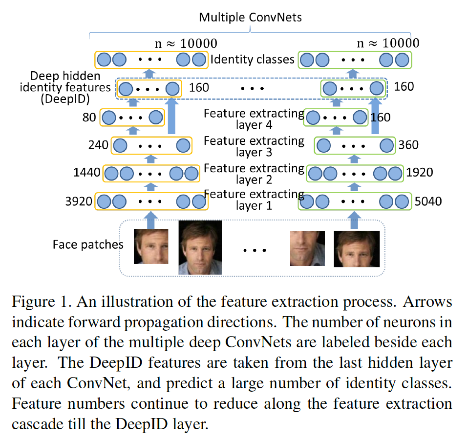
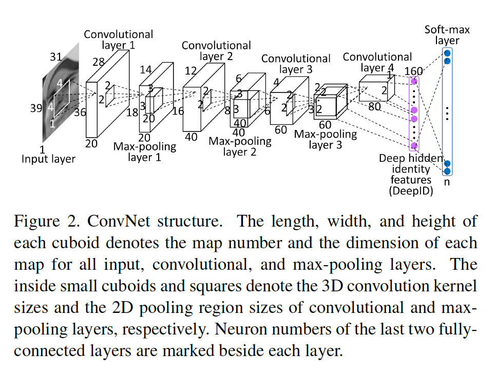
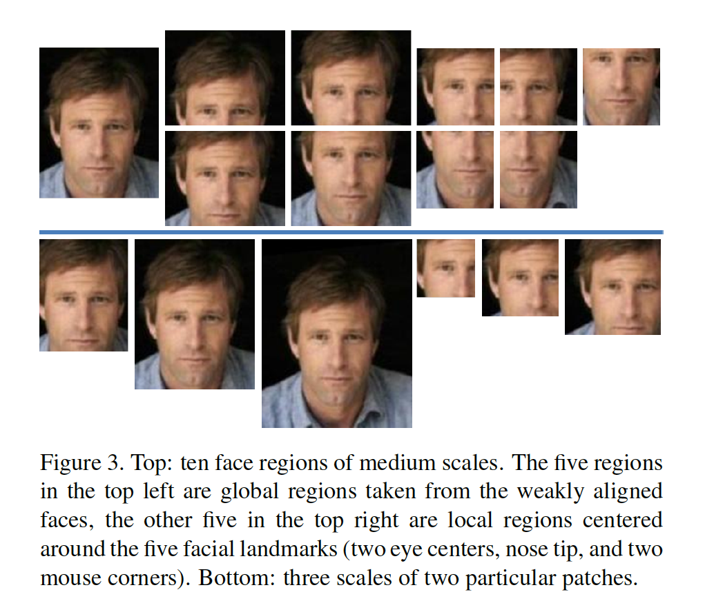
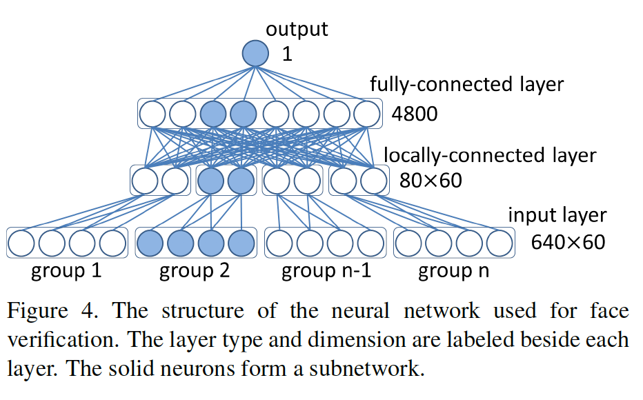

## Deep Learning Face Representation from Predicting 10,000 Classes

### 摘要

​		本文提出通过深度学习学习一组高级特征表示（称为_Deep hidden IDentity features（DeepID）_）进行人脸验证。我们认为可以通过挑战性的多类人脸识别任务有效地学习DeepID，同时它们可以泛化到其他任务（例如验证）和训练集中没有见过的新身份。此外，在训练时，DeepID的泛化能力随着训练中将要预测的更多人脸类别而增加。深度卷积网络（ConvNets）的最后隐藏层的神经激活作为DeepID特征。当作为分类器学习时，可以识别训练集中有10,000个人脸身份，并配置为沿特征提取层次结构不断减少神经元数量，这些深层的ConvNets逐渐在顶层形成了紧凑的身份相关特征，仅包含少量隐藏神经元。从不同人脸区域提取所提出的特征以构成相互补充和over-compete表示。基于这些用于面部验证的高级表示，可以学习任何最新的分类器。 仅通过弱对齐的人脸即可实现LFW的97.45％验证精度。

### 1. 引言

​		由于近年来的实际应用和LFW[19]（这是关于面部验证算法的广泛报道的数据集）的报告，在无约束条件下的人脸验证已得到了广泛的研究[21、15、7、34、17、26、18、8、2、9、3、29、6]。当前最佳表现的人脸验证算法通常表示具有over-complete低级特征的人脸，其遵循浅层模型[9、29、6]。最近，深度模型（例如ConvNets[24]）已证明在提取高级视觉特征方面的有效性，并用于人脸验证[18、5、31、32、36]。Huang等[18]学习没有监督的生成深度模型。Cai等[5]学习到深度非线性度量。在[31]中，通过二值人脸验证目标监督深度模型。不同的是，在本文中，我们提出通过人脸识别学习具有深度模型的高级人脸识别特征，即将一幅训练图像分类为$n$个身份中的一个（本文中$n \approx 10000$）。高维预测任务远比人脸验证具有挑战性，然而，它会使学习到的特征表示的良好泛化能力。尽管这些特征是通过识别学习的，但这些特征对于人脸验证和训练集中未见过的新人脸均有效。

​		我们提出利用深度ConvNets学习高级over-complete特征。我们的特征提取过程的高级展示如图1所示。通过学习ConvNet，可以根据其身份对可用于训练的所有人脸进行分类，最后隐藏层神经元激活作为特征（称为“Deep hidden IDentity features”或“ DeepID”）。每个ConvNet以人脸补丁作为输入，并在底部层提取局部低级特征。沿着特征提取级联，特征数量继续减少，而在顶层逐渐形成更多全局和高级特征。在级联的末端获得高度紧凑的160维DeepID，其包含丰富的身份信息，并直接预测更多（例如10000）的身份类。同时分类所有身份，而不是如[21、2、3]中的基于两种考量训练二值分类器。第一，将训练样本预测为多个类中一个远比进行二值分类更难。这种挑战性任务可以充分利用神经网络的超级学习能力来提取用于人脸识别的有效特征。第二，它向ConvNets中隐式地添加强力正则，其有助于形成很好分类所有身份的共享隐藏表示。因此，学习到的高级特征有很好的泛化能力，并且对训练人脸的小型子集不会过拟合。我们将DeepID限制为比他们预测的身份类别少得多，这对于学习高度紧凑和具有辨别性的特征至关重要。我们进一步拼接不同人脸区域的提取的DeepID以构成互补和over-compete表示。学习到的特征可以很好地泛化到测试集中的新身份，其在训练中未见过，并且可以容易与任意最佳人脸分类器（例如Joint Bayesian[8]）集成进行人脸验证。

​		仅使用弱对齐的人脸，我们的方法在LFW上获得97.5%的人脸验证准确率，其几乎与人类97.53%的性能一样好。我们还观察到，随着训练身份数量的增加，验证性能很容易得到改进。尽管在训练阶段预测任务变得更具挑战，学习到的特征的辨别性和泛化能力得到增加。它为将来提供更多训练数据而提高准确性打开了大门。

### 2. 相关工作

​		许多人脸验证方法通过高维over-complete人脸描述子表示人脸，其服从浅层模型。Cao等[7]将每个人脸图像编码到26K基于学习（LE）的描述子，然后在PCA之后计算LE描述子之间的$L_2$距离。Chen等[9]在多尺度密集人脸landmark上提取100K LBP描述子，并在PCA之后使用Joint Bayesian进行验证。Simonyan等[29]在尺度和空间上密集地计算1.7M SIFT描述子，并为辨别性维度规约学习线性映射。Huang等[17]组合1.2M CMD[33]和SLBP[1]描述子，并为人脸验证学习稀疏Mahalanobis度量。

​		一些先前研究基于低级特征进一步学习与身份相关的特征。Kumar等[21]训练属性和微笑分类器来检测人脸属性，并测量一组参考人的人脸相似性。Berg和Belhumeur[2、3]训练分类器以区分两个不同的人脸。特征为学习到的分类器的输出。它们使用SVM分类器，其为浅层结构，并且它们学习到的特征仍相对低级。相比之下，我们同时分类训练集中所有身份。此外，我们使用最后的隐藏层激活作为特征，而不是分类器输出。在我们的ConvNets中，最后隐藏层的神经元数量远小于输出的数量，其迫使最后隐藏层学习不同人脸的共享隐藏表示以很好地分类它们，产生具有良好泛化能力的高度可辨别和紧凑的特征。

​		少量深度模型用于人脸验证或识别。Chopra等[10]使用Siamese网络进行深度度量学习。Siamese网络从具有两个相同子网络的两个比较输入中分别提取特征，并将两个子网络的输出之间的距离视为不相似性。[10]使用深度ConvNets作为自网络。与将人脸验证目标与特征提取和识别共同学习的Siamese网络相反，我们分两步进行特征提取和识别，其中第一步是针对人脸识别的目标学习特征提取步骤，其监督信号远强于验证。Huang等[18]使用CDBN生成的学习特征[25]，然后使用ITML [13]和线性SVM进行人脸验证。Cai等[5]也在如[10]的Siamese网络框架下学习深度度量，但是使用两种级别的ISA网络作为子网络。Zhu等[35、36]学习了深度神经网络，将任意姿势和光照下的人脸转换为正常照明下的正面人脸，然后使用最后的隐藏层特征或变换后的人脸进行人脸识别。Sun等[31]使用多个深度ConvNets来学习高级人脸相似性特征，并训练分类RBM[22]进行人脸验证。从一对人脸（而不是单个人脸）联合提取特征。

### 3. Learning DeepID for face verification

#### 3.1. Deep ConvNets

​		我们的深度ConvNets包含四个卷积层（具有max-pooling）来层层提取特征，接着是全连接的DeepID层和表示身份类的softmax输出层。输入为$31 \times 31 \times k$的矩形补丁和$31 \times 31 \times k$的正方形布丁，其中$k=3$为彩色补丁，$k=1$为灰色补丁。图2展示ConvNet的详细结构，其采用$39 \times 31 \times 1$的输入并预测$n$（$n = 10000$）个身份类。当输入大小变化时，下一层特征图的高和宽相应变化。DeepID层的维度固定为160，同时输出层的维度根据它预测的类数量变化。特征量验证特征提取结构持续减少，直到最后的隐藏层（DeepID层），其中构成高度紧凑和预测特征，其仅利用少量特征预测更多数量的身份类。

​		卷积操作表示为

$$y^{j(r)}=\max\Big(0, b^{j(r)} + \sum_i k^{ij(r)} \ast x^{i(r)}\Big),\tag{1}$$

其中$x^i$和$x^j$分别为第$i$个输入特征图和第$j$个输入特征图。$k^{ij}$为第$i$个输入特征图和第$j$个输出特征图之间的卷积核。$\ast$表示卷积。$b^j$为第$j$个输出特征的偏置。我们使用ReLU非线性（$y = \max(0, x)$），其适应能力比sigmoid更好。ConvNet中更高卷积层的权重局部共享以在不同区域[18]学习不同中高级特征。式1中的$r$表示局部区域，其中共享权重。在第3个卷积层中，在每$2 \times 2$区域内局部共享权重，同时第3个卷积层中的权重完全不同。最大池化为：

$$y_{j,k}^i = \max_{0 \le m,n<s} \{x_{j\cdot s + m, k \cdot s + n}^i\},\tag{2}$$

其中第$i$个输出特征图中的每个神经元$y^i$在第$i$个输入特征图$x^i$上的$s \times s$的非重叠局部区域上池化。

​		DeepID的最后隐藏层全连接到第3和第4个卷积层（max-pooling后），使得它看见多尺度特征[28]（第四个卷积层中的特征比第3个卷积层更全局）。这是特征学习的关键，因为在沿着级联的连续下采样之后，第4个卷积层包含少量的神经元，并成为信息传播的瓶颈。在第3个卷积册和最后隐藏层之间添加跳过连接减少第4个卷积层中的可能信息损失。最后隐藏层的函数为：

$$y_j = \max\Big(0, \sum_i x_i^1 \cdot w_{i,j}^1 + \sum_i x_i^2 \cdot w_{i,j}^w + b_j \Big),\tag{3}$$

其中$x^1$、$w^1$、$x^2$和$w^2$分别表示第3和第4个卷积层中神经元和权重。它线性组合掐年两个卷积层的特征，接着是ReLU。

​		ConvNet的输出为$n$路softmax，其预测$n$个不同身份上的概率分布：

$$y_i = \frac{\exp(y_i')}{\sum_{j=1}^n \exp(y_j')},\tag{4}$$

其中$y_j' = \sum_{i=1}^160 x \cdot w_{i,j} + b_j$将160个DeepID特征$x_i$线性组合为神经元$j$的输入，$y_j$为其输出。ConvNet通过最小化$-\log y_t$学习。使用随机梯度下降学习。

#### 3.2. 特征提取

​		我们检测五个人脸关键点，包含两只眼的中心、鼻尖和两个嘴角，利用Sun等[30]提出的人脸关键点检测方法。通过根据两个眼睛中心和两个嘴角的中点的相似度转换，全局对齐脸部。从具有十个区域，三个尺度和RGB或灰色通道的60个人脸补丁中提取特征。图3给出十个人脸区域，和两个特定人脸区域的三个尺度。我们训练60个ConvNets，其中每个同特定补丁及其水平翻转副本上提取160位DeepID向量。特例是两个眼中心和两个嘴角周围的补丁，它们本身不会翻转，而是与它们对称的补丁（例如，以左眼为中心的补丁的翻转副本是通过以右眼为中心的补丁翻转而得到的）。DeepID的总长度为19200（$160 \times 2 \times 60$），其准备用于最终的人脸验证。

#### 3.3. 人脸验证

​		我们使用Joint Bayesian[8]技术进行基于DeepID的人脸验证。Joint Bayesian在人脸识别中高度成功。它通过两个独立的高斯变量的总和表示提取的面部特征$x$（减去平均值后）:

$$x = \mu + \epsilon, \tag{5}$$

其中$\mu \sim N(0, S_{\mu})$表示人脸身份，$\epsilon \sim N(0, S_{\epsilon})$为类内变化。Joint Bayesian模型根据给定的个体内部和个体间变异假设 $P(x_1, x_2 | H_I)$和$P(x_1, x_2 | H_E)$来模拟两个面孔的联合概率。从等式5可以很容易地看出，这两个概率也是具有变化的高斯:

$$\sum_I = \begin{bmatrix} S_\mu + S_\epsilon & S_\mu \\ S_{\mu} & S_\mu + S_\epsilon \end{bmatrix}, \tag{6}$$

以及

$$\sum_E = \begin{bmatrix} S_\mu + S_\epsilon & 0 \\0 & S_\mu + S_\epsilon \end{bmatrix}, \tag{7}$$

可以利用EM算法从数据中学习$S_\mu$和$S_\epsilon$。在测试中，它计算似然比：

$$r(x_1, x_2) = \log \frac{P(x_1,x_2|H_I)}{P(x_1,x_2|H_E)},\tag{8}$$

其具有封闭形式的解决方案，并且效率很高。

​		我们还训练了一个神经网络进行验证，并将其与联合贝叶斯算法进行比较，以查看其他模型是否也可以从提取的特征中学习，以及特征和良好的人脸验证模型分别对性能有贡献。神经网络包含一个带DeepID的输入层、一个局部连接层、一个全连接层以及一个指示面部相似性的单个输出神经元。输入特征被分为60组，每组都包含从具有特定ConvNet的特定补丁对中提取的640个特征。相同组的特征高度相关。局部连接层中的神经元仅连接到单组特征以学习它们的局部关系，并同时减小特征维度。第二个隐藏层为全连接到第一个隐藏层以学习全局关系。单个输出神经元全连接到第二个隐藏层。隐藏神经元为ReLU，并输出神经元为sigmoid。神经网络结构如图4所示。它具有来自每个补丁的38400个输入神经元和19200个DeepID特征，以及以下两个隐藏层中的4800个神经元，第一个隐藏层中的每80个神经元都局部连接到60组输入神经元中的一个。

​		Dropout学习[16]用于所有隐藏神经元。输入神经元不能丢弃，因为学习到的特征是紧凑且分散的表示形式（使用很少的神经元表示大量身份），并且必须相互协作才能很好地表示身份。另一方面，由于梯度消失，没有dropout，学习到的高维特征很困难。为了解决这个问题，我们首先训练60个子网，每个子网以一组为特征。图4中显示了一个特定的子网。然后，我们使用子网的第一层权重来初始化原始网络的权重，并在第一层权重被裁剪的情况下调整原始网络的第二层和第三层。

### 4. 实验

​		我们在LFW上评估了我们的算法，该算法揭示了自然人脸验证的最新技术。虽然LFW包含5749个人，但仅85个人有超过15张图像，4069个人仅包含一张图像。用每人很少的图像来训练身份分类器是不够的。 相反，我们在CelebFaces [31]上训练了模型，并在LFW上进行了测试（4.1-4.3节）。CelebFaces包含来自互联网的5436名名人的87628张脸部图像，平均每人平均约16张图像。LFW和CelebFaces中的人相互独立。

​		我们从CelebFaces中随机选择80%（4349）的人脸来学习DeepID，并使用余下20%的人学习人脸验证模型（Joint Bayesian或神经网络）。为了进行特征学习，对ConvNets进行了监督，以从一种特殊的人脸补丁及其翻转的副本中同时对4349个人进行分类。我们随机选择每个训练人员的10％图像来生成验证数据。 在每个训练epoch之后，我们观察前1个验证集的错误率，并选择提供最低错误率的模型。

​		在人脸验证中，在学习Joint Bayesian模型前，通过PCA将特征维度减小到150。性能几乎可以在各种尺寸范围内保持。 在测试中，通过将联合贝叶斯似然比与训练数据中优化的阈值进行比较，对每个人脸对进行分类。

​		为了在第4.4节中以更大的训练尺度评估我们的方法的性能，我们将CelebFaces扩展到CelebFace+数据集，该数据集包含10177个名人的202599张人脸图像。同样，LFW和CelebFaces+中的人是互斥的。 上一节中描述的ConvNet结构和特征提取过程保持不变。