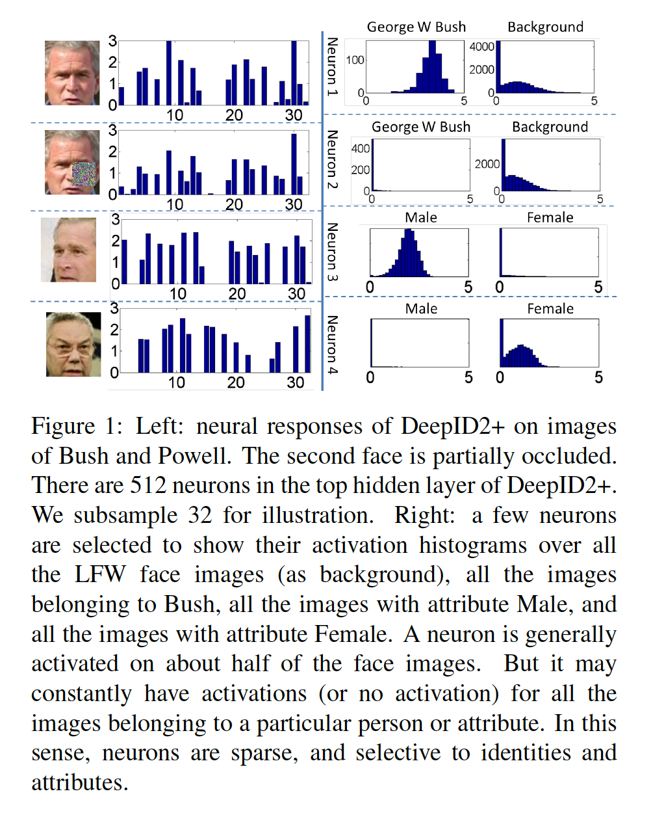
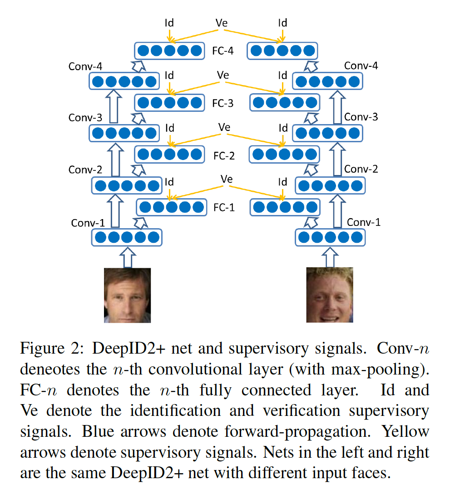
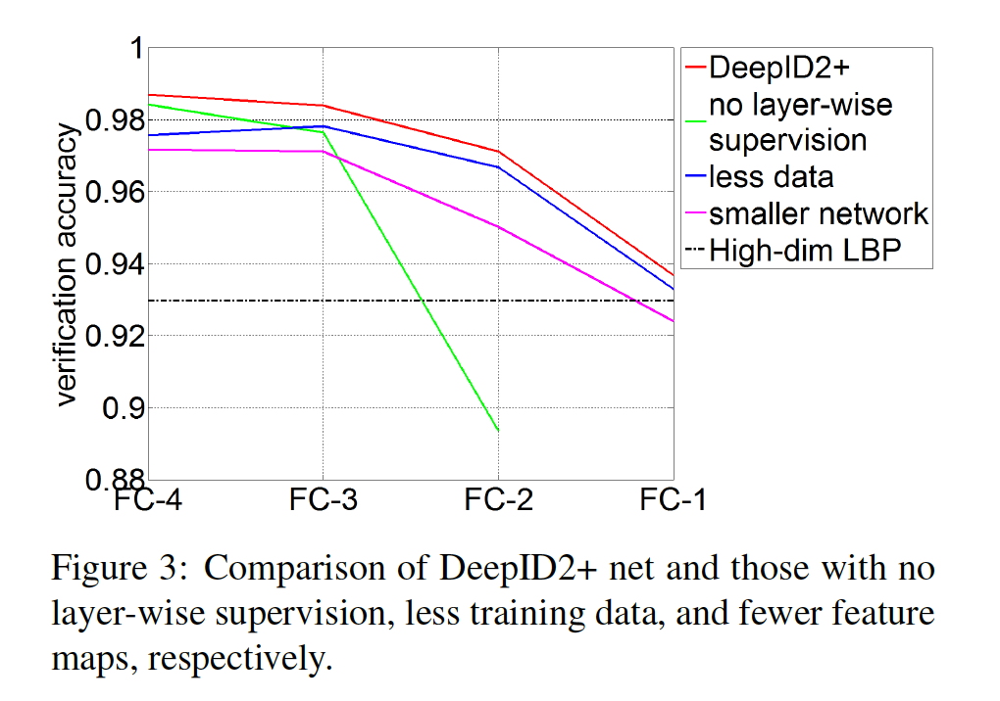
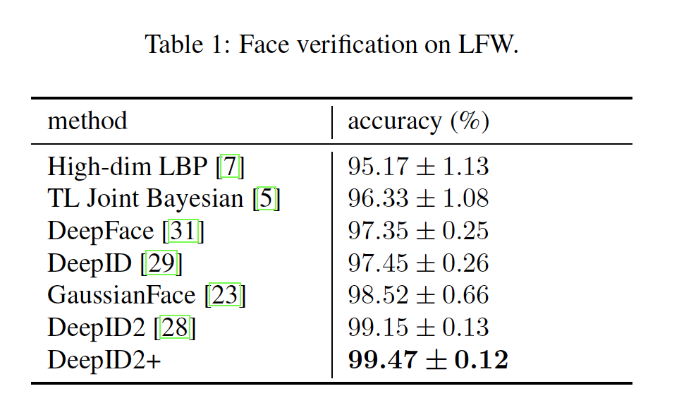
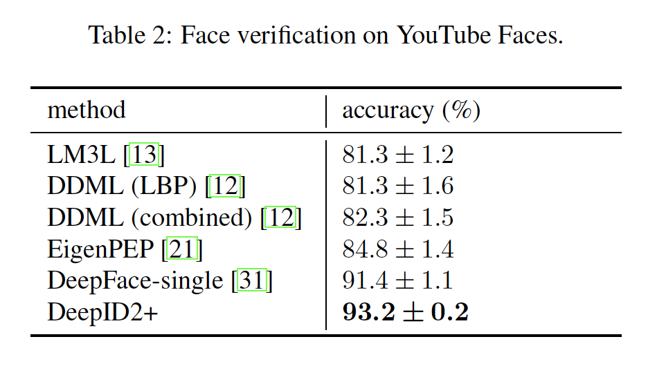
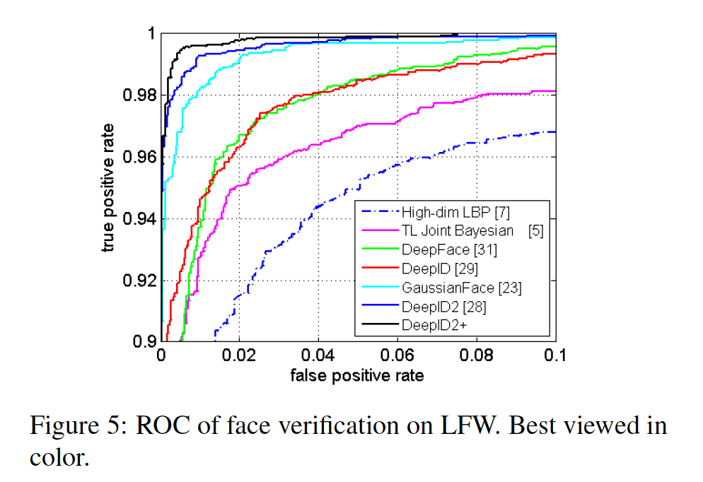
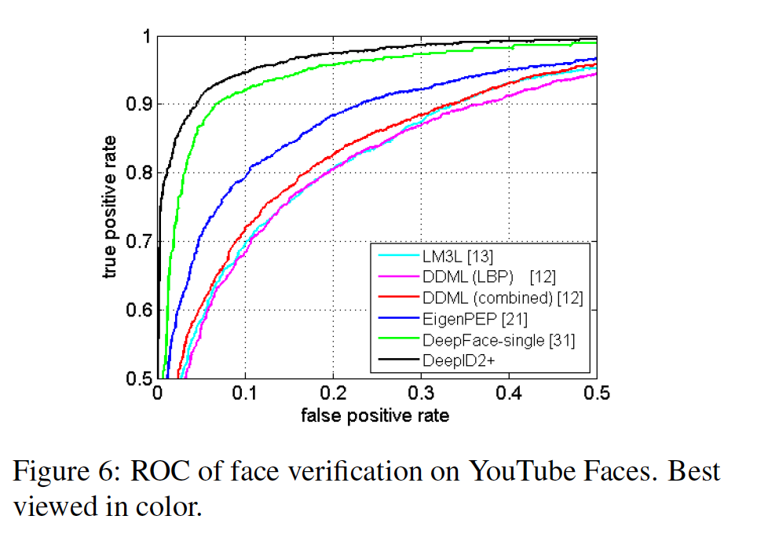
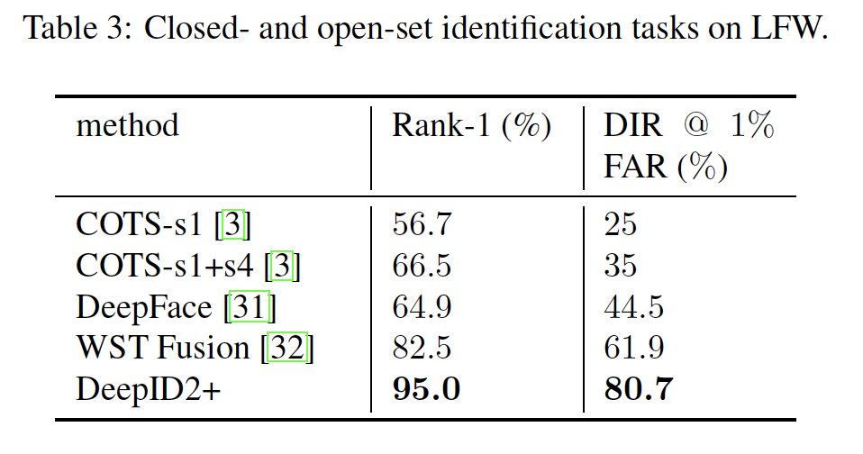

## Deeply learned face representations are sparse, selective, and robust

### 摘要

​		本文设计一种高性能深度卷积网络（DeepID2+）进行人脸识别。它利用识别-验证监督信号学习。通过增加隐藏表示的维度，并将监督添加到早期卷积层，DeepID2+早LFW和YouTub Faces基准测试上获得最佳。

​		通过经验研究，我们发现了其深层神经激活对高性能至关重要的三个特性：稀疏性、选择性和鲁棒性。（1）观察到神经激活是适度稀疏的。适度稀疏性最大化深度网络的辨别能力以及图像之间的距离。令人吃惊的是，即使神经元响应二值化后，DeepID2+仍可以获得高识别准确率。（2）更高层的神经元对于身份和身份相关的属性具有高度选择性。当存在不同的身份或属性时，我们可以识别出神经元的不同子集，这些子集会不断被激发或被抑制。尽管未教DeepID2 +在训练过程中区分属性，但它已隐式学习了此类高级概念。（3）尽管遮挡模式未包含在训练集中，但它对于遮挡的鲁棒性要强得多。

### 1. 引言

​		人脸识别取得了长足的进步，这要归功于该领域的广泛研究[36，30，18，14,1，6，15，26，7，5，27，31，29，32，28]。虽然追求更高性能是中心主题，但是理解它背后的机制同等重要。当深度神经网络在挑战性基准测试（例如LFW）上达到人类水平时，人们期望知道这些神经元学习到什么，以及如何获得如此的高性能。在认知科学中，关于分析视觉皮层神经元的人脸处理机制的研究很多[34]。受这些工作的启发，我们分析了人工神经网络中神经元的行为，试图解释深层网络中的人脸识别过程，神经元中编码了哪些信息以及它们对崩溃的抵抗力。

​		我们的研究基于高性能深度卷积神经网络（deep ConvNet[19、20]），称之为DeepID+2。它通过增加隐藏表示的维度和将监督添加到早期卷积层改进最佳的DeepID2网络。最佳的单DeepID2+网络（采用原始和水平翻转的人脸图像作为输入）在LFW上获得98.7%的验证正确率（vs. DeepID2的96.72%）。结合使用25个DeepID2 +网络，可在多个基准上设置最新的技术水平：用于人脸验证的LFW为99.47％（vs DeepID2 [28]的99.15％），对于封闭式和开放式LFW为95.0％和80.7％ 人脸识别（vs Web-Scale Training（WST）的82.5％和61.9％[32]）和YouTubeFaces [35]上的93.2％的人脸验证（vs DeepFace [31]的91.4％）。

​		借助最先进的深层ConvNet，并通过广泛的经验评估，我们研究了神经激活对高性能至关重要的三个特性：稀疏性，选择性和鲁棒性。在对人脸数据进行大规模训练之后，deepID2 +自然拥有它们，并且我们没有对模型和训练过程进行任何额外的正则化以实现它们。 因此，这些结果对于理解深度网络的内在属性非常有价值。

​		观察到DeepID2+的神经激活是适度稀疏的。如图1所展示的例子，对于一幅输入人脸图像，顶层中大约一半的神经元被激活。另一方面，每个神经元在大致一半的人脸图像上被激活。如此稀疏的分布可以最大化深度网络的辨别能力以及图像之间的距离。不同身份由不同神经元子集被激活。两幅相同身份的图像由相似的激活模式。这启发我们二值化顶部隐藏层的神经响应，并使用二值码进行识别。它的结果惊奇的好。LFW上的验证准确率仅略为下降1%或更少。由于节省了大量的存储和计算时间，因此它对大规模人脸搜索具有重大影响。这也意味着在深度神经网络中，二进制激活模式比激活幅度更为重要。

​		与稀疏有关，还可以观察到较高层的神经元对身份和与身份相关的属性具有高度选择性。当一个身份（可能不在训练数据中）或属性被表示时，我们可以识别出一个持续激活的神经元子集，也可以找到另一个不断被抑制的神经元子集。来自这两个子集中任何一个的神经元在此身份或属性的存在/不存在上都有强烈的指示性，并且我们的实验表明，单个神经元对特定身份或属性具有较高的识别准确率。换句话说，在身份和属性上神经激活有稀疏性，如图1的示例所示。尽管DeepID2+在训练期间没有学习变形性属性，但是它隐式学习如此高级的概念。直接采用由DeepID2+学习的人脸表示在身份相关的属性上比使用如高位LBP的手工特征更高的分类准确率。

​		我们的经验研究表明，与诸如高维LBP或较低层神经元之类的手工特征相比，较高层的神经元在人脸识别中对图像破坏的鲁棒性更高。如图1所示，当人脸图像被部分遮挡时，尽管幅度发生变化，它的二值激活模式仍然稳定。我们推测其原因可能是较高层的神经元捕获了全局特征并且对局部变化较不敏感。通过自然的网络人脸图像训练DeepID2+，并没有向训练集中添加人工遮挡模式。

### 2. 相关工作

​		直到最近，深度学习在人脸识别[41、31、29、28、32]上取得了巨大的成功，并且性能大大优于使用低级特征[18、30、11、38、14、6、1、26、7、5]的系统。有两个值得注意的突破。第一个是利用深度神经网络的大尺度人脸识别。通过将人脸图像分类为上千甚至百万个身份，最后的隐藏层构成用于身份的高度辨别性的特征。第二是利用人脸识别和验证任务的监督深度神经网络。验证任务最小化相同身份特征之间的距离，并减小个体内的变化[28]。通过结合多个人脸区域的特征，[28]在LFW上获得当前最佳（99.15%）的人脸验证准确率。

​		属性学习是一个活跃主题[10、2、25、4、24、40]。已经有一些关于首次学习属性分类器和使用属性预测进行人脸识别的工作[18、8]。我们在本文中尝试的是逆运算，方法是先预测身份，然后使用学习到的身份相关特征预测属性。

​		基于稀疏表示的分类[36、37、22、39、9、17]被广泛研究用于遮挡人脸识别。Tang等[33]提出Robust Boltzmann Machine来区别破坏像素，并学习潜在表示。这些方法银饰设计处理遮挡的组件，同时，我们证明了DeepID2 +所学习的特征对遮挡具有隐式编码不变性。这自然是可以实现的，而无需在训练数据上增加对模型的调节或人工遮挡模式。

### 3. DeepID2+ nets

​		我们的DeepID2+网络继承自DeepID2网络[28]，DeepID2具有20、40、60和80个特征图的四个卷积层，接着是全连接到第3和第4个卷积层的160维特征层。通过人脸识别和验证任务监督160维特征层（DeepID2特征层）。给定一对训练图像，它通过将两幅图像传入DeepID2获得两个DeepID2特征向量（$f_i$和$f_j$）。然后，每个DeepID2特征向量被分类为训练集中8192个身份之一，并生成分类（识别）误差。如果$f_i$和$f_j$来自相同的身份，验证误差为$\frac{1}{2}\|f_i - f_j\|_2^2$，否则$\frac{1}{2}\max(0, m - \|f_i -f_j\|_2)^2$。结果表明，结合识别和验证监督信号有助于更有效地学习特征[28]。

​		与DeepID2相比，DeepID2+作出三种改进。第一，它在四个卷积层的每一层中都有128个特征图，因此更大。最终的特征表示从160增加到512维。第二，通过融合CelebFaces+数据集和WDRef数据集，我们的训练数据被扩大，LFW之外的一些新收集的身份。与使用来自8000个身份的160000张图像训练DeepID2网络相比，我们利用来自12000个身份的290000张人脸图像训练更大的DeepID2+网络。第三，在DeepID2网络中，仅将监督信号添加到一个连接到第3和第4卷积层的全连接层，而更低的卷积层仅能获得更高层的反向传播梯度。我们通过将512维全连接层连接到四个卷积层中的每一个（max-pooling之后）强化监督，表示为$\mbox{FC}-n$，$n = 1,2,3,4$，并利用识别-验证监督信号监督这四个全连接层，如图2所示。以这种方式，监督信号变得“更接近”早期卷积层，并且更有效。

### 4. High-performance of DeepID2+ nets

​		为了验证改进，我们基于DeepID2+网络中的四个412维特征向量（神经激活）$\mbox{FC}-n,n=1,2,3,4$学习用于人脸验证的Joint Bayesian模型[6]。我们训练集的2000个人（排除LFW中的人）来训练Joint Bayesian，这些人没有用于训练DeepID2+网络，并在LFW上的6000个给定人脸对上测试人脸验证。当训练DeepID2+网络来确定学习率和训练迭代次数时，这2000个身份也作为一个验证集。如图3所示，将DeepID2 +网络（建议的）与三个移除了三个改进之一的网络进行比较。对于没有逐层监督的网络，仅FC-4的梯度被反向传播到卷积层。对于具有更少训练数据的网络，仅使用来自CelebFaces+的训练数据。对于更小的网络，卷积层的特征图数量与DeepID2中卷积层的特征图像数量相同，并且160维特征用于$FC-n,n=1,2,3,4$。比较的所有网络在覆盖整个人脸的固定区域上学习。我们可以清楚地看到来自图3的三个方面的改进。

​		为了与DeepID2网络[28]相比，我们训练了25个DeepID2 +网络，它们采用DeepID2选择的相同的25个人脸区域，如图[28]中的图2所示。在LFW人脸验证任务上的25个深度ConvNets之间的比较如图4所示。DeepID2+网络比DeepID2平均提高大约2%的准确率。当结合利用DeepID2+网络从所有25个人脸区域以及它们的水平翻转副本提取的FC-4层特征时，我们在LFW和YouTube Faces数据集上分别获得99.47%和93.2%的人脸验证正确率。表1和表2是在两个数据集上具有先前最佳结果的精度比较。 图5和图6是ROC比较。我们的DeepID2+网络在两个数据集上比所有前面的结果好。LFW和YouTubeFaces中有一些错误标记的测试人脸对。 校正后，我们的人脸验证准确性在LFW上提高到99.52％，在YouTubeFaces上提高到93.8％。

​		人脸识别是评估高性能人脸识别系统的一项更具挑战性的任务[32]。 因此，根据[3]中的协议，我们在LFW的封闭和开放式人脸识别任务上进一步评估了25个DeepID2 +网络。封闭式识别报告Rank-1识别准确率，而开放式识别报告1％错误警报率（False Alarm Rate：FAR）的Rank-1检测和识别率（DIR）。 比较结果示于表3。 我们的结果分别以95.0％和80.7％的封闭和开放式识别准确率明显优于以前的最佳[32]。

.......