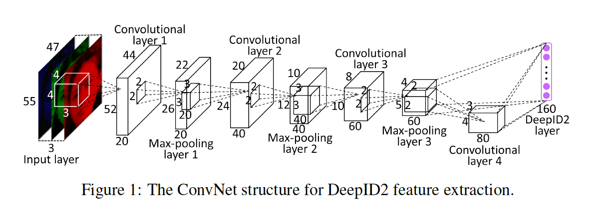
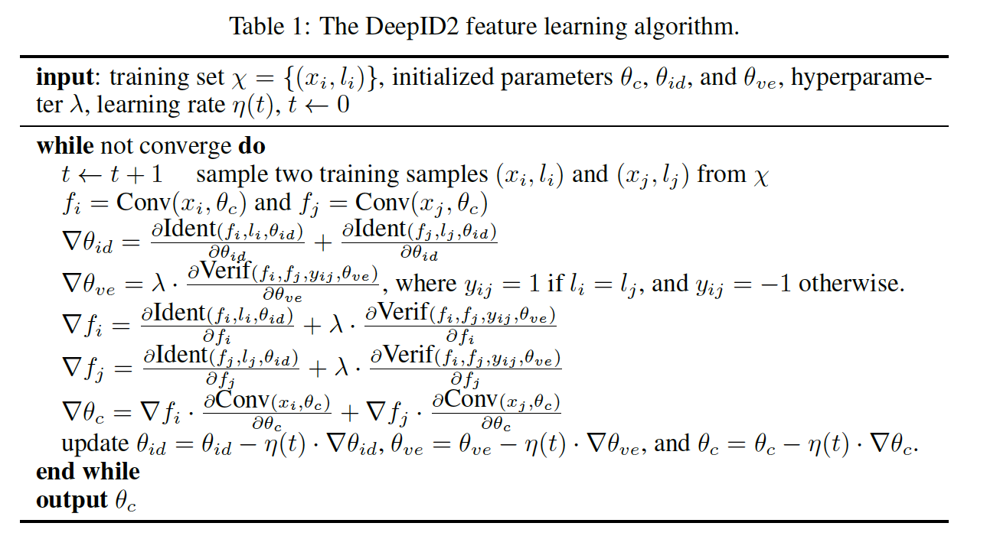
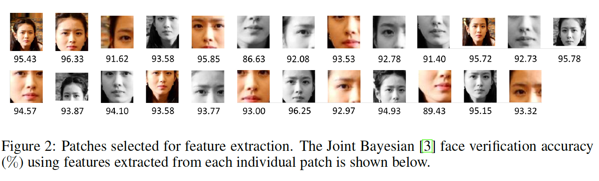
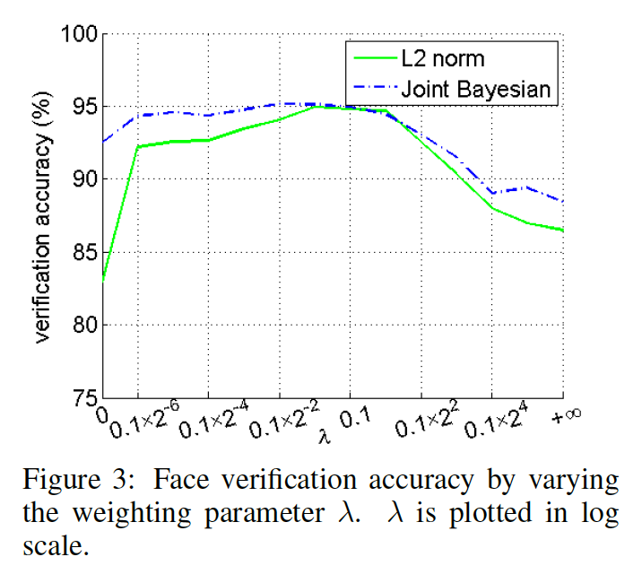
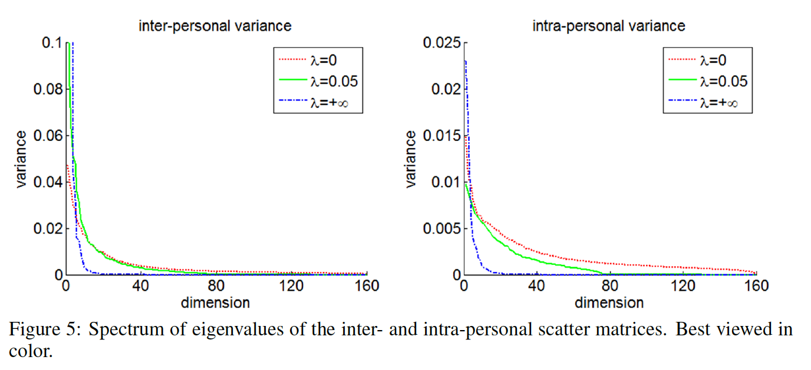
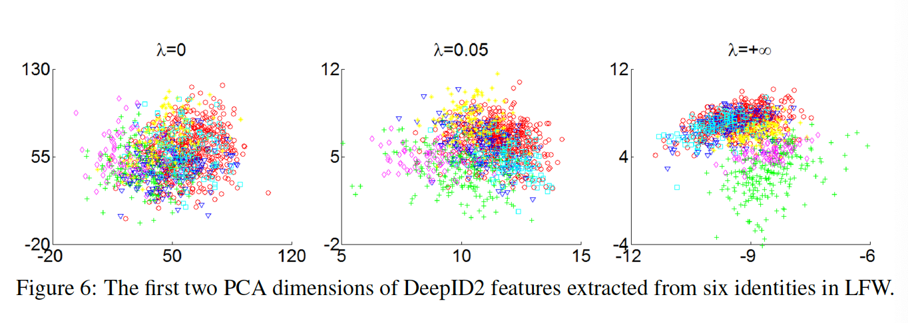
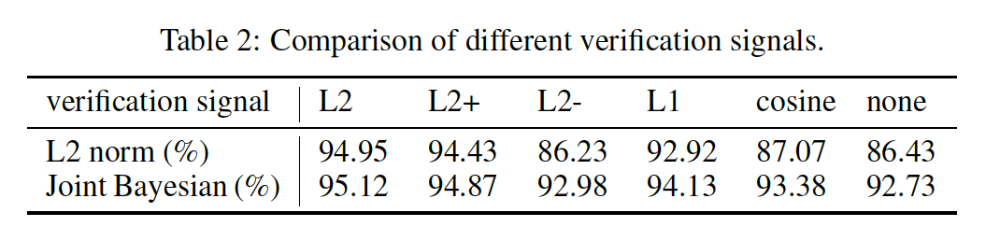
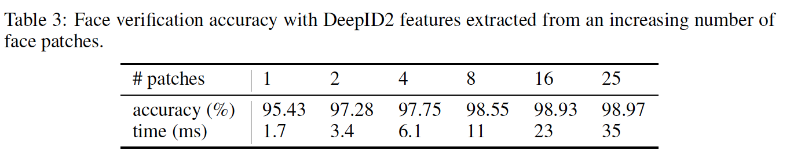
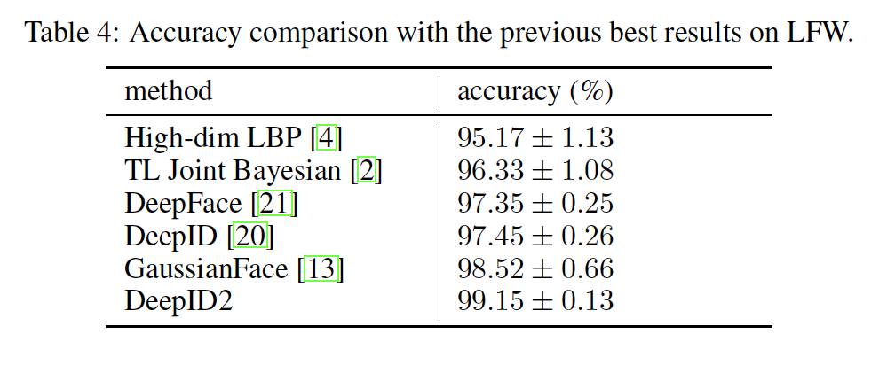
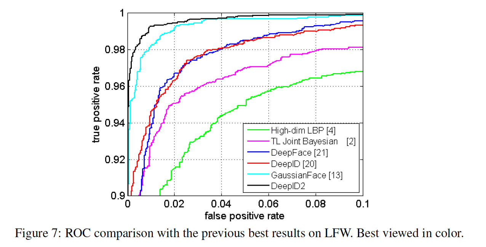

## Deep Learning Face Representation by Joint Identification-Verification

### 摘要

​		人脸识别的关键挑战是开发有效的特征表示以减少个体内的变化，同时扩大个体间的差异。本文中，我们证明这个问题可以利用深度学习解决，并使用人脸识别信号和验证信号作为监督。利用仔细设计的深度卷积网络学习Deep IDentification-verification feature（DeepID2）。人脸识别任务通过从不同身份提取的DeepID2特征增加个体间侧差异，而人脸验证任务通过将相同身份提取的DeepID2特征拉到一起来减少个体内的变化，二值都是人脸识别的关键。学习到的DeepID2特征可以很好地泛化到训练数据中未见过的新人脸。在挑战性的LFW数据集上，获得99.15%的人脸验证准确率。与先前LFW上最好的深度学习结果相比，错误率明显减少67%。

### 1. 引言

​		当相同的人脸呈现出不同的姿态、光照、表情、年龄和遮挡时，它们看起来可能大不相同。同一身份内的此类变化可能会淹没由于身份差异而引起的变化，并使人脸识别具有挑战性，尤其是在不受约束的条件下。因此，减少个体内变化，同时扩大个体间的差异是人脸识别的中心主题。可以追溯回人脸识别方法（例如LDA、Bayesian face和统一子空间）早期子空间。例如，LDA使用两个离散矩阵近似个体间和个体内的人脸变化，并找出投影方向来最大化它们之间的比例。最近的研究要么显式、要么隐式地瞄准相同的目标。例如，度量学习[6、9、14]将人脸映射到一些特征表示，使得相同身份的人脸相互接近，而不同身份的人脸保持远离。但是，这些模型受其线性本质或浅层结构的限制很大，而个体间和个体内的变化则很复杂、高度非线性，并在高维图像空间中观察到。

​		在这项工作中，我们证明深度学习提供远远更强的工具来处理两类变化。由于其深度架构和大型学习能力，可以通过层层的非线性映射学习人脸识别的有效特征。我们认为它是使用两种监督信号同时学习如此特征的关键，即人脸识别和验证信号，学习的特征被称之为Deep IDentification-verification features（DeepID2）。识别是为了将输入图像分类为大量身份类，而验证是为了分类一对图像是否属于相同的身份（即二值分类）。在训练阶段，给定具有识别信号的人脸图像，在学习的层次非线性特征表示上提取该图像的DeepID2特征，然后通过另一个函数$g(\mbox{DeepID})$映射到大量身份之一。才测试阶段，学习到的DeepID2特征可以泛化到其他任务（例如人脸验证）和训练数据中未见过的新身份。身份监督信号倾向于将不同身份的DeepID2特征拉远，因为它们不得不被分类为不同类。因此，学习到的特征会有丰富的身份相关或个体间差异。然而，由于可以通过函数$g(\cdot)$将不同的DeepID2特征映射到相同的身份，因此识别信号对从相同的身份提取的DeepID2特征具有相对较弱的约束。当DeepID2特征泛化到新任务和测试中的新身份时，这会产生问题，其中$g$不再合适。我们使用额外的人脸验证信号解决这个问题，其要求相同身份提取的每两个DeepID2特征向量相互接近，而不同身份提取的DeepID2特征保持远离。DeepID2特征上的强壮每元素约束可以有效减小个体内变化。另一方面，单独使用验证信号（即一次仅区分一对DeepID2特征向量）在提取与身份相关的特征方面不如使用识别信号有效（即一次区分成千上万身份）。因此，两种监督信号强调特征学习的不同方面，应当一起使用。

​		为了从不同方面表征人脸，从各种人脸区域和分辨率中提取了互补的DeepID2特征，并在PCA尺寸减小后进行级联以形成最终的特征表示。由于学习到的DeepID2特征在不同身份之间是多样的，同时相同身份内是一致的，它使人脸识别更容易。使用学习到的特征表示和最近提出的人脸验证模型[2]，我们在挑战而广泛研究的LFW数据集上获得最高的99.15%的人脸验证准确率。这是首次仅提供人脸区域的机器达到与人类99.20％的准确度相当的准确率，其中向人提供了包括人脸区域和大背景区域在内的整个LFW人脸像。

​		近年来，通过深度学习为面部识别做出了很多努力[5、10、18、26、8、21、20、27]。在深度学习工作之中，[5、18、8]学习具有验证信号的特征或深度度量，而DeepFace[21]和我们前面的工作DeepID[20]学习识别信号，并在LFW上获得大约97.45%的准确率。我们的方法明显提高最佳性能。联合解决分类和验证任务的思想用于一般目标识别[15]，重点是提高固定目标类的分类精度，而不是隐藏的特征表示。我们的工作目标是学习可以很好泛化到新类（身份）和验证任务的特征。

### 2	Identification-verification guided deep feature learning

​		我们利用深度卷积神经网络学习特征。Deep ConvNets中的卷和池化操作专门设计来层层提取视觉特征，从局部低级特征到全局高级特征。我们的Deep ConvNets才采用与[20]中相似的结构。它包含4个卷积层，以及在第3和第4个卷积中使用共享局部权重。ConvNet在特征提取级联的最后一层（DeepID2层）提取160维DeepID2特征向量。要学习的DeepID2层全连接到第三和第四卷积层。对于卷积层和DeepID2层中的神经元，我们使用整流线性单位（ReLU）[17]。用于提取DeepID2特征的ConvNet的结构如图1所示，给定的RGB输入大小为$55 \times 47$。当输入区域的大小变化时，下一层的特征图大小相应改变。DeepID2特征提取过程表示为$f = \mbox{Conv}(x, \theta_c)$，其中$\mbox{Conv}(\cdot)$为由ConvNet定义的特征提取函数，$x$为输入人脸补丁，$f$为提取的DeepID2特征向量，$\theta_c$表示需要学习的ConvNet参数。

​		利用两种监督信号学习DeepID2特征。第一个时人脸识别信号，其将每幅人脸图像分类为$n$（例如$n=8192$）个不同身份之一。通过在DeepID2层之后跟随一个$n$路softmax层来实现识别，该方法输出$n$个类的概率分布。训练网络来最小化交叉熵损失，其我们成为识别损失。它表示为：

$$\mbox{Ident}(f,t,\theta_{id}) = -\sum_{i=1}^n p_i \log \hat{p}_i = -\log \hat{p}_t, \tag{1}$$

其中$f$为DeepID2特征向量，$t$为目标类，$\theta_{id}$表示softmax层参数。$p_i$为目标概率分布，其中对于目标类$t$，$p_t = 1$；其他类$i$，$p_i = 0$。$\hat{p}_i$为预测的概率分布。为了同时准确地分类所有类，DeepID2层必须形成辨别性的与身份相关的特征（即具有较大个体间变化的特征）。第二个是人脸验证信号，其鼓励从相同身份提取的DeepID2特征相似。验证信号直接正则化DeepID2特征，并可以有效地减小个体内的变化。通常使用的约束包含L1/L2范数和余弦相似性。我们采用如下的基于L2范数的损失函数，其最初由Hadsell等[8]用于维度规约：

$$\mbox{Verif}(f_i, f_j,y_{ij},\theta_{ve})=\begin{cases}\frac{1}{2}\|f_i - f_j\|_2^2 &\mbox{ if } y_{ij}=1, \\\frac{1}{2}\max(0, m - \|m f_i - f_j\|_2^2)&\mbox{ if }y_{ij}=-1,\end{cases} \tag{2}$$

其中$f_i$和$f_j$为比较重两幅人脸图像提取的DeepID2特征向量。$y_{ij}=1$表示来自相同身份的$f_i$和$f_j$。在这种情况下，它最小化两个DeepID2特征向量之间的L2距离。$y_{ij}=-1$表示不同的身份，式（2）需要比margin $m$更大的距离。$\theta_{ve} = \{m\}$为验证损失函数中学习的参数。基于L1范数的损失函数可以有相似的公式。[17]中使用的余弦相似为：

$$\mbox{Verif}(f_i, f_j, y_{ij}, \theta_{ve}) = \frac{1}{2}(y_{ij - \sigma(wd + b)})^2, \tag{3}$$

其中$d = \frac{f_i \cdot f_j}{\|f_i\|_2 \|f_j\|_2}$为DeepID2特征向量之间的余弦相似性，$\theta_{ve} = \{w,b\}$为可学习的缩放和平移参数，$\sigma$为sigmoid函数，$y_{ij}$为两张比较的人脸图像是否属于同一身份的二值目标。在我们的实验中，评估和比较这三个损失函数。

​		我们的目标是在特征提取函数$\mbox{Conv}(\cdot)$中学习参数$\theta_c$，而$\theta_{id}$和$\theta_{ve}$为训练期间引入传播识别和验证信号的参数。通过随机梯度下降更新参数。身份和验证梯度通过超参数$\lambda$加权。我们的学习算法如表1。式（2）中的margin $是m$一种特殊情况，无法通过梯度下降来更新，因为这会将其衰退为零。相反，$m$为固定的，并且每$N$个训练对（我们的实验中$N\approx 200000$）进行更新，使得它是特征距离$\|f_i-f_j\|$的阈值，用于最小化前$N$个训练对的验证误差。 为了简便起见，表1中未包含更新$m$的信息。

### 3	人脸验证

​		为了评估第2节中描述的特征学习算法，DeepID2特征被嵌入到具有人脸对齐、特征提取和人脸验证的传统人脸验证流水线。我们首先使用最近提出的SDM算法来检测21个人脸关键点。然后，根据检测到的关键点，通过相似性变换全局对齐人脸图像。我们裁剪400个人脸补丁，其根据全局对齐的人脸和人脸关键点位置，在位置、尺度、彩色通道和水平翻转上变化。相应地，通过总共200个deep ConvNets提取400个DeepID2特征向量，每个深度向量都经过训练，分别在一个特定的人脸补丁及其水平翻转的每张人脸上提取两个160维DeepID2特征向量。

​		为了减小大量DeepID2特征之间的冗余，并实践我们的系统，我们使用前向-反向贪婪算法来选择少量有效而互补的DeepID2特征向量（我们的实验中为25），其在测试时，节约大量特征提取时间。图2显示了所有选择的25个补丁，从中提取了25个160维的DeepID2特征向量并将其连接到4000维的DeepID2特征向量。这4000维向量由PCA进一步压缩到180维以进行人脸验证。基于提取到的DeepID2特征，我们学习Joint Bayesian模型进行人脸验证。联合贝叶斯已被成功地用来模拟两个人相同或不同的人的联合概率[3、4]。

### 4	实验

​		我们报告LFW数据集上的人脸验证结果，其是无约束条件下的用于人脸验证的标准测试集。它包含从互联网上收集的5233个身份的13233张人脸图像。出于公平目的，算法通常报告平均人脸验证准确率，和LFW中600个给定人脸对上的ROC曲线。尽管作为测试集听起来不错，但它不足以进行训练，因为LFW中的大多数身份仅具有一张人脸图像。因此，我们依赖更大的外部数据集进行训练，与最近的高性能人脸验证算法相同。特别地，我们使用CelebFaces+数据集进行训练，其包含从互联网收集10177个身份的202599张人脸图像。CelebFace+和LFW中的人互不包含。DeepID2特征是从CelebFaces+中随机采样的8192个身份的人脸图像（称为CelebFaces + A）中学习的，而1985年身份的其余人脸图像（称为CelebFaces + B）则用于以下特征选择和学习 人脸验证模型（联合贝叶斯模型）。当在CelebFaces+A上训练DeepID2特征时，CelebFaces+b用作验证集来决定学习率、训练epoch和超参数$\lambda$。之后，CelebFaces+B划分为1485个身份的训练集和500个身份的验证集进行特征提取。最后，我们在整个CelebFaces+B数据上训练联合贝叶斯模型，并使用选定的DeepID2功能在LFW上进行测试。从4.1节到4.3节的，我们首先通过使用单个深度ConvNet从整个面部区域提取DeepID2特征来评估特征学习的各个方面。在4.4节中， 然后构建最终系统，并将其与中现有的最佳性能方法进行比较。

#### 4.1	Balancing the identification and verification signals

​		我们在特征学习中，通过从$0$到$+\infin$改变$\lambda$，研究识别和验证信号的交互。当$\lambda=0$时，验证信号消失，仅识别信号起作用。当$\lambda$增加时，验证信号逐渐主导训练过程。在$\lambda \rarr +\infin$的极端情况下，仅验证留下验证信号。式（2）中的L2范数验证损失用于训练。图3通过将学习的DeepID2特征分别与L2规范和联合贝叶斯模型进行比较，显示了测试集上人脸验证的准确性。 它清楚地表明，识别和验证信号都不是学习特征的最佳方法。 相反，有效特征来自两者的适当组合。

​		这种可以从个体间和个体内变化的视角解释，其可以由LDA近似。根据LDA，个体间的离散矩阵为$S_{inter} = \sum_{i=1}^c n_i \cdot (\bar{x}_i - \bar{x})(\bar{x}_i - \bar{x})^\top$，其中$D_i$为第$i$个身份平均特征，$\bar{x}$为真个数据集的均值，$n_i$为第$i$个身份的人脸图像数量。个体内的离散矩阵为$S_{intra} = \sum_{i=1}^c \sum_{x\in D_i}(x - \bar{x}_i)(x - \bar{x}_i)^\top$，其中$D_i$为第$i$个身份的特征集，$\bar{x}_i$为相应的均值，$c$为不同身份的数量。个体间和个体内的变化为相应离散矩阵的特征值，如图5所示。相应的特征向量表示不同变化模式。特征方差的大小和多样性都与识别有关。 如果所有特征方差都集中在少量特征向量上，则表明个体间或个体内变化的多样性较低。分别利用$\lambda = 0, 0.05, +\infin$学习特征。每个给定$\lambda$的特征方差由相应的平均特征方差归一化。

#### 4.3 研究验证信号

#### 4.4 最终的系统和与其他方法的表

