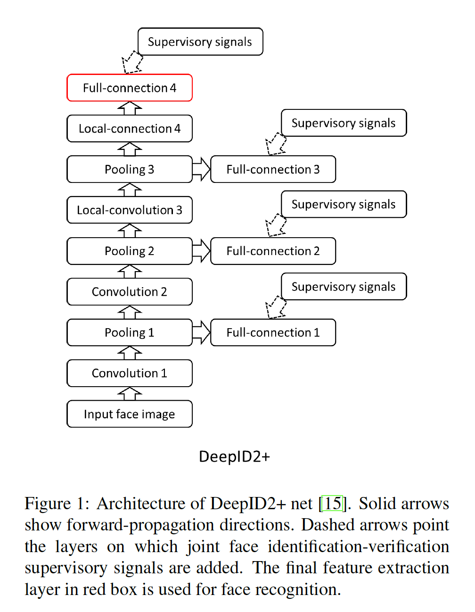
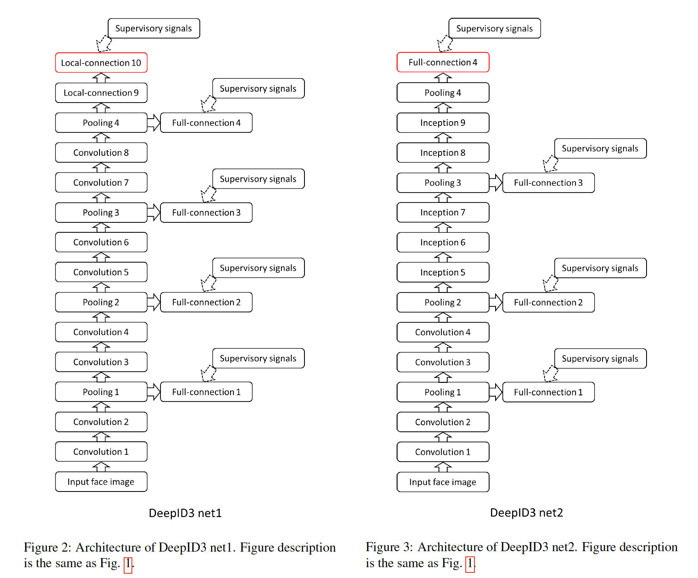
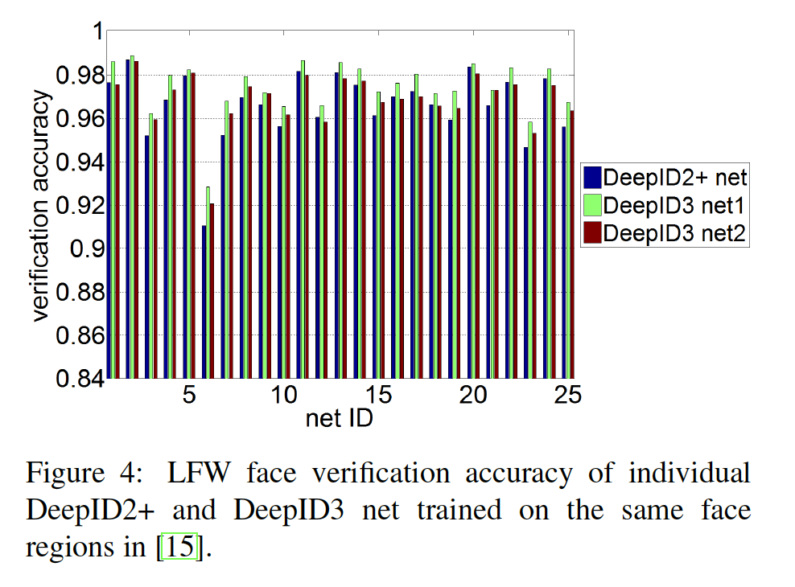
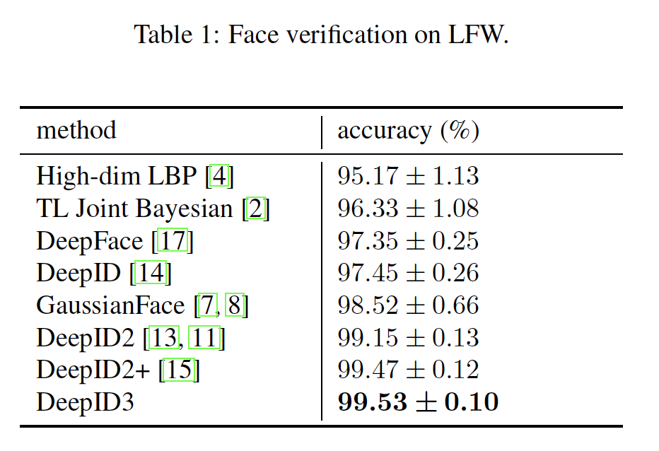
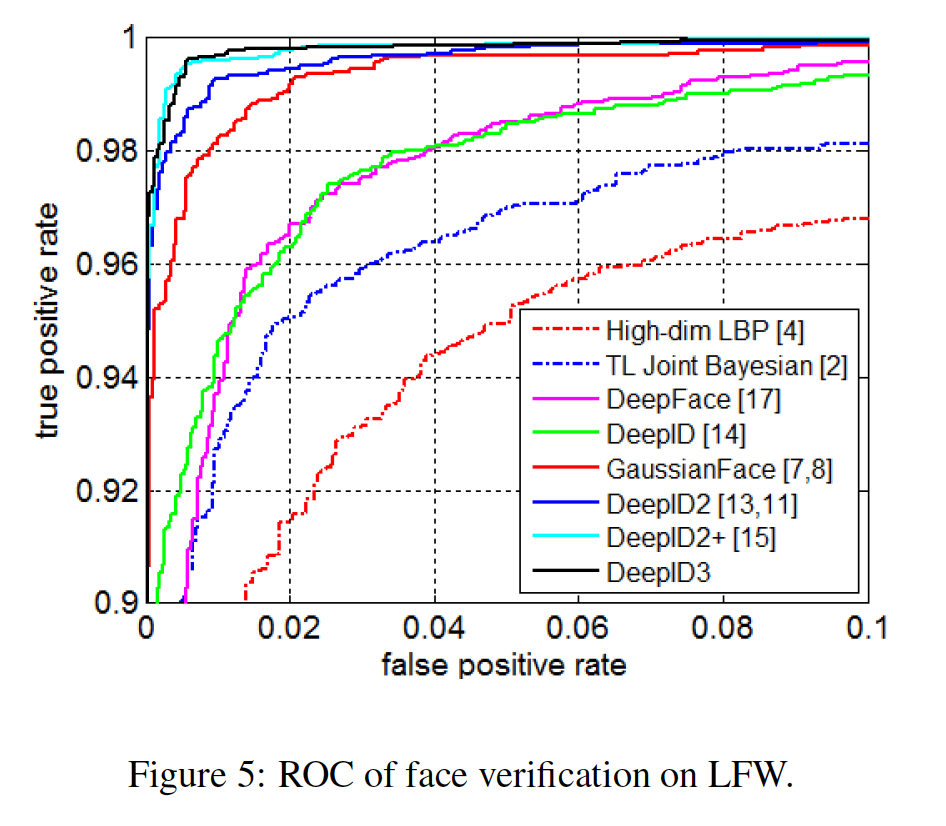
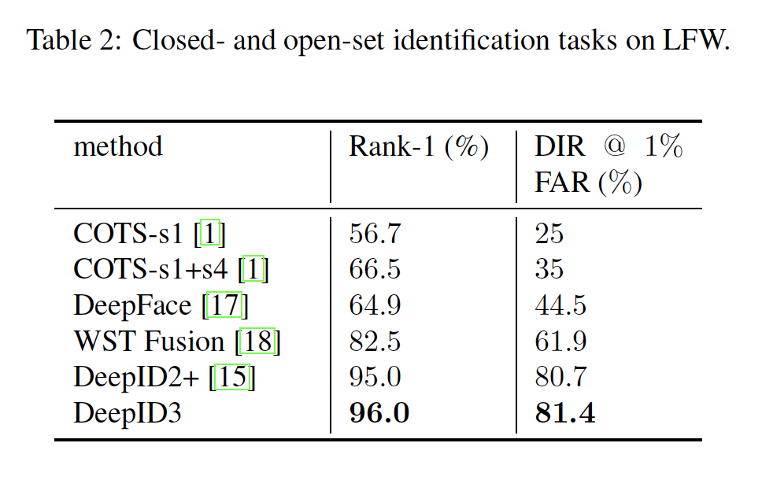

## DeepID3: Face Recognition with Very Deep Neural Networks

### 摘要

​		深度学习的出现极大地促进了人脸识别技术的发展。最近，由于深度神经网络具有卓越的学习能力，因此在通用目标识别方面取得了巨大成功。这启发我们研究它们在人脸识别上的有效性。本文提出两种非常深的神经网络架构（称之为DeepID3）进行人脸识别。这两种架构是从VGG net [10]和GoogLeNet [16]中提出的堆叠卷积和Inception层重建而来的，以使其适合人脸识别。训练期间，将联合人脸识别-验证监督信号添加到中间和最终的特征提取层。所提出的两种架构的集成分别获得99.53% LFW人脸验证准确率和96.0%的LFW rank-1人脸识别准确率。最后对LFW人脸验证结果进行了进一步的讨论。

### 1. 引言

​		使用深度神经网络来学习有效的特征表示在人脸识别中越来越流行。利用更好的深度网络架构和监督方法，最近几年逐渐提高人脸识别准确率。特别地，最近，进化出一些令人瞩目的人脸表示。以有监督的方式学习深层脸部表情的早期工作是采用人脸验证作为监督信号[12]，这需要将一对训练图像分类为同一个人或不同个人。它极大减小个体内人脸表示的变化。然后，通过DeepID和DeepFace提出的大尺度人脸身份分类（人脸识别）学习辨别性深度人脸表示。通过将训练图像分类为大量身份，深度神经网络最后隐藏层将形成丰富的身份相关特征。利用这项技术，深度学习首次在经过广泛评估的LFW人脸验证数据集的紧密裁剪的人脸图像上接近于人类的表现[6]。但是，学习到的人脸表示也可以包含显著的个体内变化。受[12]和[14]的启发，在DeepID2 [13]中提出了一种通过联合人脸识别-验证来学习深度人脸表示的方法，在DeepID2 + [15]中得到了进一步改进。添加人脸监督信号明显减少个体内的变化，导致人脸识别性能的显著提高。LFW的整幅人脸的验证准确最终被[13、15]抑制。GoogLeNet[16]和VGG[10]排在ILSVRC2014通用图像分类的前列。这促使我们研究非常深的网络结构所带来的卓越学习能力是否也能使人脸识别受益。

​		尽管受先进监督信号监督。DeepID2和DeepID2+的网络架构远比最近提出的用于通用目标识别高性能深度神经网络（例如VGG和GoogLeNet）浅。VGG网络将多个卷积层堆叠到一起构成复杂的特征。GoogLeNet通过将多尺度卷积合并到单个特征提取层中而变得更加先进[16]。为了高效学习，它还引入$1\times1$卷积进行特征维度规约。

​		本文中，我们提出两种深度神经网络架构，称为DeepID3，其比先前最佳的用于人脸识别的DeepID2+架构深得多。DeepID3网络是根据VGG net [10]和GoogLeNet [16]的基本元素（即堆叠的卷积或起始层）重建的。 在训练期间，将联合的人脸识别验证监督信号[13]添加到最终特征提取层以及每个网络的一些中间层。此外，为了学习更丰富的人脸人脸特征，一些DeepID3网络中更高层的权重没有共享。与DeepID2 +相比，在与DeepID2 +相同的数据集上进行训练，DeepID3将LFW上的人脸验证准确率从99.47％提高到99.53％，将rank-1人脸识别准确率从95.0％提高到96.0％。当错误地标注的人脸对被校正的“真实”人脸验证准确率和一些硬的测试样品将文末进一步讨论。

### 2. DeepID3 net

​		出于公平的目的，我们简要回顾前面提出的DeepID2+网络架构[15]。如图1所示，DeepID2+网络有三个后跟最大池化的卷积层（第3个卷积层中的神经元进在局部区域共享权重），接着是一个局部连接层和一个全连接层。联合识别验证监督信号[13]被添加到最后一个完全连接的层（从中提取最终特征以用于人脸识别），以及从中间池化层分支出来的几个全连接层，以更好地监督早期特征提取过程。

​		所提出的DeepID3网络继承少量DeepID2+网络的特点，包括最近几个特征提取层中未共享的神经权重以及向早期层添加监督信号的方式。然而，与DeepID2+中的五层相比，DeepID3网络明显更深，具有10到15个非线性特征提取层。特别地，我们提出两个DeepID3网络架构，称为DeepID3 net1和DeepID3 net2，如图2和图3所示。DeepID3网络的深度是由于在每个池化层之前堆叠了多个卷积/inception层。连续的卷积/inception有助于构成更大感受野的特征，以及更复杂的非线性，同时限制参数量。

​		所提出的DeepID3 net1在每个池化层前使用两个连续的卷积层。与前面文献中提出的VGG网络相比，我们在从中间层分支出来的多个全连接层中添加了其他监督信号，这有助于学习更好的中级特征，并使深度神经网络的优化变得更加容易。使用局部连接层替换前两个卷积层。利用非共享参数，顶层可以构成具有规约特征维度的更具表达性的特征。我们的DeepID3 net1的最后的局部连接层用于提取最终特征，而没有额外的全连接层。

​		DeepID3 net2从每两个连续的卷积层开始，接着是一个池化层，就像DeepID3 net1一样，而在随后的特征提取阶段中采用inception层[16]：在第三池化层之前有三个连续inception层，在第四个池化层之前有两个inception层。将联合识别-验证监督信号添加到每个池化层后的全连接层。

​		在所提出的两个网络架构中，使用整流线型单元，但池化层除外。尽管具有显著的深度，但是，由于每层中限制的特征图数量，我们的DeepID3网络比VGG网络或GoogLeNet】更小。

​		所提出的DeepID3网络在与DeepID2+网络相同的25哥人脸区域上训练，其中每个网络采取一个特定的人脸区域作为输入。通过前面工作[13]中的特征选择来选去人脸区域，其在位置、尺度和颜色通道变化使得不同网络可以补偿信息。训练之后，这些网络用语从相关人脸区域提取特征。然后，在这些特征上学习Joint Bayesian模型进行人脸验证或识别。在大约300000张训练样本学习DeepID3网络和Joint Bayesian模型，这与DeepID2+相同，这些训练样本为CelebFaces+和WDRef数据集的组合，并在LFW上测试。这两个训练数据集和LFW的人互不干涉。分别在25个人脸区域（水平翻转）上，将单个DeepID3网络的LFW上的人脸验证性能与DeepID2+网络进行了比较，如图4。平均而言，与DeepID2+网络相比，DeepID3 net1和DeepID3 net分别将错误率减小0.81%和0.26%。

#### 3. 实验

​		为了减少冗余，DeepID3 net1和net2用于提取原始或水平翻转的人脸区域上的特征，但不能同时提取这两者。在测试中，特征提取需要50倍的正向传播，其中一半来自DeepID3 net1，另一半来自net2。这些特征被串联成大约30000个维的长特征向量。利用PCA，它被缩减为300个维度，在该维度上学习了联合贝叶斯模型以进行人脸识别。

​		我们在LFW人脸验证和LFW人脸识别协议下评估DeepID3网络。对于人脸验证，验证6000个给定的人脸对来告知它们是否来自相同人。我们在这个协议下获得99.53%的平均准确率。与前面工作的平均准确率和ROC曲线的比较分别见表1和图5。

​		对于人脸识别，我们采用closed-set和open-set识别协议。为了进行封闭集识别，图库集包含4249个主体，每个主体有一个人脸图像，而probe集包含来自图库中同一主体集的3143个脸部图像。为了进行开放集识别，图库集包含596个对象，每个主体具有一张人脸图像，而probe集则包含596个genuine probes和9494个imposter顶替者。表2比较开放集识别和开放集识别的1%False Alarm Rate（FAR）上的Rank-1 Detection and Identification rate（DIR）。我们分别获得96.0%的封闭集和81.4%的开放集人脸识别准确率。

