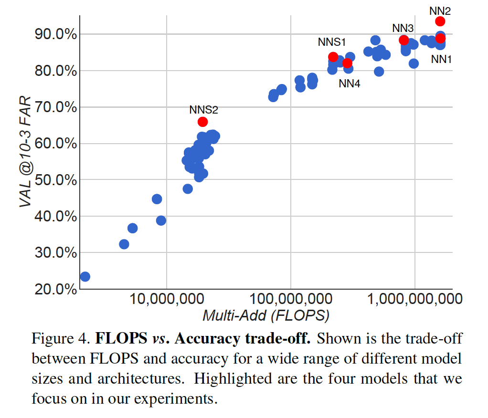

## FaceNet: A Unified Embedding for Face Recognition and Clustering

### 摘要

​		尽管最近在人脸识别领域取得了重大进展[10、14、15、17]，但有效地大规模实施人脸验证和识别对当前方法提出了严峻挑战。本文中，我们提出一个系统（称为FaceNet），该系统直接学习从人脸图像到紧凑的欧几里得空间的映射，其中距离直接对应于人脸相似性的度量。一旦生成这个空间，诸如人脸识别、验证和聚类的任务可以使用具有FaceNet嵌入作为特征向量的标准技术轻松实现。

​		我们的方法使用经过深度训练的深度卷积网络来直接直接优化嵌入本身，而不是像以前的深度学习方法那样使用中间的瓶颈层。为了进行训练，我们使用通过新颖的在线三元挖掘方法生成的大致对齐的匹配/不匹配人脸补丁的三元组。我们的方法的好处是更高的表示效率：每张脸仅使用128字节就可以达到最佳的人脸识别性能。

​		在广泛使用的Labeled Faces in the Wild（LFW）数据集，我们的系统获得99.63%的新纪录。在YouTube Face DB上，它获得95.12%的准确率。与两个数据集上的最佳发布结果[15]相比，我们的系统将错误率降低了30％。

​		我们还介绍了harmonic嵌入和harmonic三元组损失的概念，它们描述了彼此兼容且允许彼此直接比较的人脸嵌入（由不同网络生成）的不同版本。

### 1. 引言

​		本文中，我们提出一种统一的系统进行人脸验证（这是否是相同的人）、识别（这个人是谁）和聚类（在这些人脸中找出普遍的人）。我们的方法基于使用深度卷积网络学习的每幅图像的欧式嵌入。对网络进行训练，使嵌入空间中的平方L2距离直接对应于人脸相似度：相同人脸有较小的距离，不同人脸有较大距离。

​		一旦产生这种嵌入，那么前面提到的任务变得直接：人脸验证简仅简单涉及两种嵌入之间的阈值、识别成为一个kNN分类问题、聚类可以使用诸如k-means或聚类的即插即用技术获得。

​		基于深度网络的先前的人脸识别方法使用在一组已知人脸身份上训练的分类层[15、17]，然后采用中间瓶颈层作为表示，用于概括超出训练中使用的一组身份的识别。这种方法的缺点是它的间接性和效率低下：人们必须希望瓶颈表示能很好地推广到新人脸，并且使用瓶颈层，每张人脸的表示通常非常大（1000维）。一些最近工作使用PCA减小维度，但是这是非线性的，其可以在网络的一层中轻松学习。

​		与这些方法相比，FaceNet使用基于LMNN的基于三元损失函数直接将其输出训练为紧凑的128-D嵌入[19]。我们的三元包含两个匹配的人脸缩略图和一个非匹配人脸缩略图，并且损失旨在通过距离margin从负类中分离正类对。这些缩略图是面部区域的紧凑裁剪，除了缩放和平移之外，没有2D或3D对齐方式。

​		选择要使用的三元对于取得良好的性能非常重要，并且受课程学习的启发[1]，我们提出了一种新颖的在线负样本挖掘策略，该策略可确保随着网络训练，三元的难度不断增加。为了提高聚类准确率，我们还探索难正样本挖掘技术，该技术鼓励将球形簇用于单个人的嵌入。

​		为了说明我们的方法可以处理的令人难以置信的可变性，请参见图1。显示的是来自PIE [13]的图像对，以前认为这对人脸验证系统非常困难。

### 2. 相关工作

​		与其他最近使用深层网络的工作[15，17]相似，我们的方法是一种纯粹的数据驱动方法，可以直接从脸部像素学习其表示。与其使用工程特征，我们使用带有标签的面部的大型数据集来获得姿势、光照和其他变化条件的适当不变性。

​		本文中，我们探索两种不同的深度网络架构，这些架构已成勇用于计算机视觉社区。二者都是深度卷积网络[8、11]。第一个架构师基于Zeiler&Fergus[22]模型，其包含多个卷积层、非线性激活、局部响应归一化和最大池化层。我们额外添加几个$1 \times 1 \times d$卷积层。第二个架构基于Inception模型，其为最近用于ImageNet2014的优胜方法。这些网络使用混合层，其并行运行几个不同卷积和池化层，并拼接它们的响应。我们发现，这些模型可以将参数量减少到20倍以上，并有潜力减少需要达到相当性能的FLOPs数量。

​		存在大量人脸验证和识别工作。回顾它超出本文的范围，因此我们仅简要讨论最相关的最近工作。

​		[15、17、23]的工作都采用多阶段复杂系统，其将深度卷积网络的输出和用于维度规约的PCA和用于分类的SVM结合。

​		Zhenyao等[23]采用深度网络来“warp”人脸到标准的前景视角，然后学习将每个人脸分类为属于已知身份。对于人脸验证，网络输出上的PCA注入到集成的SVM。

​		Taigman等[17]提出多阶段方法，其将人脸对齐到一般的3D形状模型。训练一个多类网络以在4千个身份进行人脸识别任务。作者也实验了所谓的Siamese网络，其中它们直接优化两个人脸特征之间的$L_1$距离。它们在LFW上的最佳性能（97.35%）来自使用不同对齐和颜色通道的3个网络的集成。使用一个非线性SVM结合这希望预测的距离。

​		Sun等人[14，15]提出了一种紧凑的计算网络，因此相对便宜。它们使用25个这些网络的集成，每个在不同的人脸补丁上运行。对于LFW上的最终性能（99.47%），作者结合了50个响应（常规和翻转）。PCA和Joint Bayesian模型[2]都有效地对应于嵌入空间中的线性变换。它们的方法不需要显式的2D/3D对齐。使用分类和验证损失组合训练网络。验证损失与我们采用的三元损失，其中它最小化相同人脸之间的$L_2$距离，同时在不同身份人脸距离之间施加一个margin。主要区别在于仅比较了成对的图像，而三元损失则鼓励了相对的距离约束。Wang等[18]探索了一种与本文所用相似的损失，用于通过语义和视觉相似性对图像进行排名。

### 3. 方法

​		FaceNet使用深度卷积网络。我们讨论两种核心架构：Zeiler&Fergus[22]风格网络和Inception风格网络。这些网络的细节在3.3节描述。

​		给定模型的细节，并将它们视为一个黑盒（见图2），我们的方法的最重要部分位于整个系统的端到端学习中。为此，我们采用三元损失，其直接反映什么是我们想要在人脸验证、识别和聚类中获得的。即，我们努力将$f(x)$从图像$x$嵌入到特征空间$\mathbb{R}$d$中，以使具有相同身份的所有人脸之间的平方距离（与成像条件独立）很小，而一对来自不同身份的图像的人脸之间的平方距离很大。

​		尽管我们没有直接与其他损失比较，例如使用正负对，如[14]中使用的式（2）。我们相信三元损失更适合人脸验证。动机是[14]中的损失鼓励将一个身份的所有人脸投射到嵌入空间中的单个点上。然而，三元损失尝试在一个人的人脸与其他人脸对之间施加一个margin。这允许一个身份的人脸位于一个流形，同时仍然加强了距离，因此可以区分其他身份。

​		接下来章节描述这种三元损失，以及如何有效地大规模学习它。

#### 3.1. Triplet Loss

​		将嵌入表示为$f(x) \in \mathbb{R}^d$。它将一幅图像$x$嵌入到$d$维欧氏空间。此外，我们将这种嵌入限制到$d$维超球面，即$\|f(x)\|_2 = 1$。这种损失是在最近邻分类的背景下[19]。我们要确保特定人的图像$x^a_i(anchor)$与同一人的所有其他图像$x^p_i(positive)$相比，与任何其他人的任何图像$x^n_i(negative)$距离都更近。这如图3所示。

​		因此，我们想要：

$$\|f(x_i^a) - f(x_i^p)\|_2^2 + \alpha < \|f(x_i^a) - f(x_i^n)\|_2^2, \\ \forall (f(x_i^a),f(x_i^p),f(x_i^n)) \in \mathcal{T}. \tag{1}$$

其中$\alpha$为施加在正负对之间的margin。$\mathcal{T}$为训练集中所有可能三元组集合，并且有基$N$。

​		损失被最小化，然后:

$$L = \sum_i^N\Big[\|f(x_i^a) - f(x_i^p)\|_2^2 - \|f(x_i^a) - f(x_i^n)\|_2^2 + \alpha\Big]_+.\tag{3}$$

​		生成所有可能的三元组将导致容易满足许多三元组（即满足等式（1）中的约束）。这些三胞胎将不会有助于训练，并且会导致收敛速度变慢，因为它们仍将通过网络传递。选择活跃的硬三元至关重要，因此可以帮助改进模型。 下一节讨论用于三元组选择的不同方法。

#### 3.2. Triplet Selection

​		为了确保快速收敛，选择违反等式（1）中的三元约束的三元组至关重要。这意味着，给定$x_i^a$，我们想要选择$x_i^p$（hard positive）使得$\arg\max_{x_i^p}\|f(x_i^a) - f(x_i^p)\|_2^2$，以及相似地，选择$x_i^n$（hard negative）使得$\arg\min_{x_i^n}\|f(x_i^a) - f(x_i^n)\|_2^2$。

​		在整个训练集上计算$\arg\min$和$\arg\max$很灵活。此外，它可能导致较差的训练，因为错误标签和糟糕的人脸会主导hard positives和negatives。有两个避免这个问题的显然选项：

- 每$n$步离线生成三元组，使用最近的网络检查点并计算数据子集的$\arg\min$和$\arg\max$。
- 在线生成三元组。这通过mini-batch中选择的hard positive/negative示例完成。

​        我们专注于在线生成，并使用数千个示例的大mini-batch，并且仅在mini-batch内计算argmin和argmax。

​		为了有意义地表示锚的正类距离，需要确保在每个mini-batch处理中存在最少数量的任一身份的示例。在我们的实验中，我们采样训练数据使得每个mini-batch的每个身份选择大约40个人脸。此外，随机采样的负类人脸被添加到每个mini-batch中。

​		我们使用mini-batch中的所有anchor-positive对，而不是选择最难的正类，同时仍选择最难的负类。我们没有将mini-batch内的hard anchor-positive对与所有anchor-positive对进行逐一比较，但是我们在实践中发现，在训练开始时，所有anchor-positive方法都更稳定并且收敛速度更快。

​		我们还探索将在线生成三元组和离线生成三元组结合，它可能允许使用较小的批大小，但是实验尚无定论。

​		在实践中，选择最困难的负类可能会导致训练初期的局部最小值过低（bad local minima），特别是会导致模型崩溃（即$f(x)= 0$）。为了缓解这个问题，选择$x_i^n$使得

$$\|f(x_i^a) - f(x_i^p)\|_2^2 < \|f(x_i^a) - f(x_i^n)\|_2^2. \tag{4}$$

我们称这些负示例为_semi-hard_，因为它们比正类示例更远离，但是仍困难，因为平方距离接近anchor-positive距离。这些负类位于margin $\alpha$中。

​		如上所述，正确的三元组选择对于快速收敛至关重要。一方面，我们想要使用小型mini-batch，因为这些小型mini-batch会在随机梯度下降（SGD）期间提高收敛性[20]。另一方面，实施细节使数十到数百个示例的批次效率更高。但是，关于批大小的主要限制是我们从mini-batch中选择硬相关三元组的方式。 在大多数实验中，我们使用的批大小约为1800个示例。

#### 3.3. Deep Convolutional Networks

​		在我们的所有实验中，我们使用SGD和AdaGrad训练CNN。在大多数实验中，我们从0.05的学习率开始，我们将其降低以最终确定模型。随机初始化模型，与[16]相似，并在CPU集群上训练1000到2000小时。损失的减小（准确率的增加）在第500小时训练后会急剧放慢，但是额外的训练仍可以提高性能。margin $\alpha$设置为0.2。

​		网络结构如表1所示。

### 4. 数据集和评估

​		我们在四个数据集上评估我们的方法，除了LFW和YouTube Faces之外，我们在人脸验证任务上评估了我们的方法。 即给定一对两张人脸图像，平方$L_2$距离阈值$D(x_i,x_j)$用于确定相同和不同的分类。相同身份的所有人脸对表示为$\mathcal{P}_{\mathbb{same}}$，而不同身份的所有人脸对表示为$\mathcal{P}_{\mathbb{diff}}$。

​		我们将所有_true accepts_集定义为

$$\mathbf{TA}(D)=\{(i,j) \in \mathcal{P}_{\mathbb{same}}, \mbox{ with } D(x_i, x_j) \le d\}.\tag{5}$$

这些是在阈值$d$上正确分类为_same_的人脸对$(i,j)$。相似地，

$$\mathbf{FA}(d) = \{(i,j)\in\mathcal{P}_{\mathbb{diff}}, \mbox{ with } D(x_i,x_j) \le d\} \tag{6}$$

为未能正确分类为_same（false accept）_的所有对集。

​		给定人脸距离$d$的验证率$\mathbf{VAL}(d)$和false accept rate $\mathbf{FAR}(d)$定义为：

$$\mathbf{VAL}(d) = \frac{|\mathbf{TA}(d)|}{|\mathcal{P}_{\mathbb{same}}|}, \mathbf{FAR}(d) = \frac{|\mathbf{FA}(d)|}{|\mathcal{P}_{\mathbf{diff}}|}.\tag{7}$$

### 5. 实验

​		除非另有说明，否则我们将使用100M-200M个训练人脸缩略图，其中包含大约8M个不同的身份。在每幅图像上运行人脸检测器，生成每幅人脸周围的紧密边界框。这些人脸缩略图被调整到相应网络的输入大小。我们的实验中，输入大小从$96 \times 96$到$224 \times 224$。

#### 5.1. Computation Accuracy Trade-off

