## $L_2$-constrained Softmax Loss for Discriminative Face Verification

### 摘要

​		最近几年，使用深度卷积网络（DCNNs）显著提升人脸验证系统的性能。人脸验证的常用流水线包括训练具有softmax损失的主题分类的深层网络，使用倒数第二层输出作为特征描述符，并在给定一对人脸图像的情况下生成余弦相似度评分。softmax损失函数未优化特征以使正类对具有更高的相似性评分，而负类对具有更低的相似性评分，从而导致性能差距。本文中，我们将$L_2$约束添加到特征描述子，其将这些特征限制到固定半径的超球面。这个模块可以使用已有的深度学习框架轻松实现。我们证明，在训练流水线中集成这种简单的步骤显著提升人脸验证的性能。具体而言，我们在挑战性的IJB-A数据集上会的最佳结果，即在人脸验证协议中的0.0001Face Accept Rate上获得0.909 的True Accept Rate。此外，我们在LFW数据集上获得最佳性能，即99.78%，并在YFT数据集上获得96.08%的准确率。

### 1. 引言

​		无约束设置下的人脸验证是一个挑战性问题。尽管最近的人脸验证系统在精选的数据集（如“Labeled Face in the Wild”（LFW）[14]）上表现出色，但在视角、分辨率、遮挡和图像质量上具有极端变化的人脸上获得相似的准确率。这从公开可用的IJB-A [16]数据集上传统算法的性能中可以明显看出。训练集中数据质量的不平衡是这种性能差距的原因之一。已有的人脸识别训练数据集包含大量高质量和正脸，然而很少有无约束和困难人脸。大多数基于利用softmax损失训练的DCNN进行分类的方法倾向于对于高质量数据过拟合，并不能正确分类困难条件下获取的人脸。

​		使用softmax损失函数训练人脸验证系统尤其自身的优势和缺点。一方面，使用诸如Caffe、Torch和Tensorflow内部构建的函数可以轻松实现。与triplet损失[28]不同，在输入批大小和快速收敛方面没有任何限制。所学习的特征具有足够的判别力，无需任何度量学习即可进行有效的人脸验证。

​		另一方面，softmax损失偏向于样本分布。与对比损失[29]和triplet损失[28]不同，它们专门关注困难样本，softmax损失最大化给定mini-batch中的所有样本的条件概率。因此，它非常适合高品质的人脸，而忽略了训练性min-batch处理中罕见的困难人脸。我们观察到使用softmax损失学习到的特征的$L_2$范数可以说明人脸的质量[23]。高质量正脸的特征有高$L_2$范数，同时具有极端姿态的模糊人脸有很低的$L_2$范数（见图1（b））。此外，softmax损失没有优化保持正类对更近、负类对彼此远离的验证要求。由于这个理由，许多方法要么在softmax特征之上使用度量学习[27、3、24]，要么训练辅助损失[33、29、32]以及softmax损失来获得更好的验证性能。

​		本文中，我们对与softmax损失的相关问题进行对症治疗。我们提出$L_2$-softmax损失，其在训练期间在特征上添加约束使得它们的$L_2$范数仍为常量。换句话说，我们将特征限制到固定半径的超球面。所提出的$L_2$-softmax损失有两个优势。第一，它可以为优质和劣质人脸提供类似的关注，因为现在所有特征都有相同的$L_2$范数，这对于在不受限制的环境中获得更好的性能至关重要。其次，在规范化空间中，它通过强迫相同主体的特征更近、不同主体的特征彼此远离来强化验证信号。因此，它最大化正负对之间的规范化$L_2$距离或余弦相似性。因此，它克服角softmax损失的劣势。

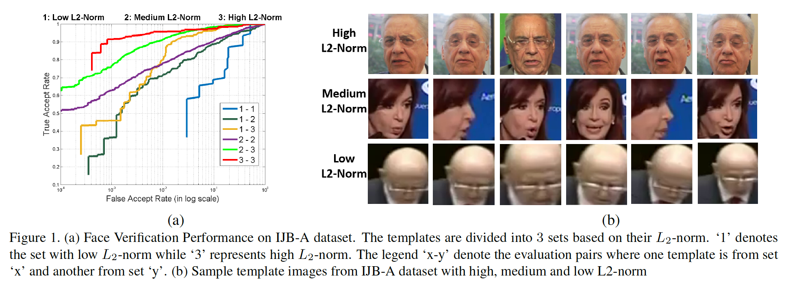

​		$L_2$-softmax损失也保留角softmax损失的优势。与softmax损失相似，它是一个网络，一种损失系统。它并不需要像许多最近的方法[33、24、32、29]所使用的那样受到任何联合监督。使用Caffe、Torch和Tensorflow内部构建的函数可以轻松实现它，并且收敛非常快。与角softmax损失相比，$L_2$-softmax损失在性能上获得显著提升。它在IJB-A数据集上获得新的SOTA，以及LFW和YouTube Face数据集上相当的结果。它超越了使用多个网络或多个损失函数或同时使用这二者的几个最新系统的性能。总之，本文的贡献为如下几个方面：

1. 我们提出简单、新颖和高效的$L_2$-softmax损失进行人脸验证，其将特征描述子的$L_2$范数限制到一个常量$\alpha$。
2. 我们研究了与缩放参数$\alpha$有关的性能变化，并为其值提供了适当的界限，以实现一致的高性能。
3. 所提出的方法产生在三种挑战性人脸验证数据集（即LFW[14]、YouTube Face[19]和IJB-A）上产生一致而显著的提升。

​        此外，来自$L_2$-softmax损失的增益是度量学习（例如TPE[27]、joint-Bayes[3]）或辅助损失函数（例如中心损失[33]、对比损失[29]）的补充。我们证明在$L_2$-softmax损失上应用这些技术可以进一步提高验证性能。与TPE结合，在具有挑战性的IJB-A [16]数据集上，$L_2$-softmax损失在0.0001的False Accept Rate（FAR）下，达到创纪录的0.909的True Accept Rate（TAR）。

### 2. 相关工作

​		近年来，使用深度学习方法[28、30、24、27、29、33]的人脸验证的准确率已取得显著进步。在LFW数据集上，这些方法中的大多数😔人类性能。尽管这些方法使用DCNNs，但是它们的区别在于用于训练的不同类型的损失函数。对于人脸验证，正类主体对特征更接近、负类主体对特征彼此远离是关键。为了解决这个问题，研究人员采用两种主要方法。

​		在第一个方法中，将人脸图像对放入训练算法来学习特征嵌入，该特征嵌入中，正类对更接近、负类对彼此远离。在这种方向中，Chopra等[5]提出具有对比损失的Siamese网络进行训练。Hu等[13]设计了一个辨别性深度指标，在正负两对人脸之间施加间隔。FaceNet[28]引入triplet损失以使用困难的三元人脸样本学习度量。

​		第二种方法中，人脸图像及其主体标签可用于学习分类框架中的辨别识别特征。大多数最近方法[29、30、24、37]训练具有softmax损失的DCNN来学习这些特征，这些特征随后可用于直接计算一对人脸的相似性得分或训练辨别性度量嵌入[27，、3]。另一种策略是训练用于联合识别-验证任务的网络[29、32、33]。Xiong等[36]提出transferred deep features fusion（TDFF），其可以将经过不同网络和数据集训练的特征进行两阶段融合。Template adaptation[8]用于进一步提升性能。

​		最近的方法[33]引入中心损失来学习更好的辨别性特征。相比中心损失，我们提出的方法有如下几个不同之处。第一，我们使用一个损失函数（即$L_2$-softmax损失），而[33]在训练期间使用中心损失与softmax损失的联合损失。第二，训练期间，中心损失引入$C \times D$个额外参数，其中$C$为类的数量，$D$为特征维度。另一方面，$L_2$-softmax损失仅引入单个参数，其定义为特征的固定$L_2$范数。此外，中心损失也可以用于$L_2$-softmax损失结合，其性能要比经过常规softmax损失训练的中心损失更好（请参阅第5.1.4节）。

​		最近，一些算法已在训练期间使用特征规范化来提高性能。SphereFace[20]引入角softmax（A-softmax）损失，该损失使DCNN能够学习角度辨别性特征。另一称为DeepVisage[20]使用批归一化技术的特例以在使用softmax损失之前归一化特征描述子。我们所提出的方法不同之处为，它在特征描述子上使用$L_2$约束，其迫使特征位于给定半径的超球面。

![fig1]

### 3. 动机

​		我们首先总结使用DCNN训练人脸验证系统的一般流程，如图2所示。戈给定具有人脸图像的训练数据集和相应的身份标签，将DCNN训练为分类任务，其中网络学习将给定人脸图像分类为其正确身份的标签。softmax损失函数用于训练网络，损失由式（1）给出：

$$L_S = -\frac{1}{M}\sum_{i=1}^M\log\frac{e^{W_{y_i}^Tf(\mathbf{x}_i) + b_{y_i}}}{\sum_{j=1}^Ce^{W_j^Tf(\mathbf{x}_i)+b_j}},\tag{1}$$

其中$M$为训练的批大小，$\mathbf{x}_i$为批中第$i$个输入人脸图像，$f(\mathbf{x}_i)$为DCNN中倒数第二层中对应的输出，$y_i$为对应的类标签，$W$和$b$为网络最后一层的权重和偏置，其作为一个分类器。

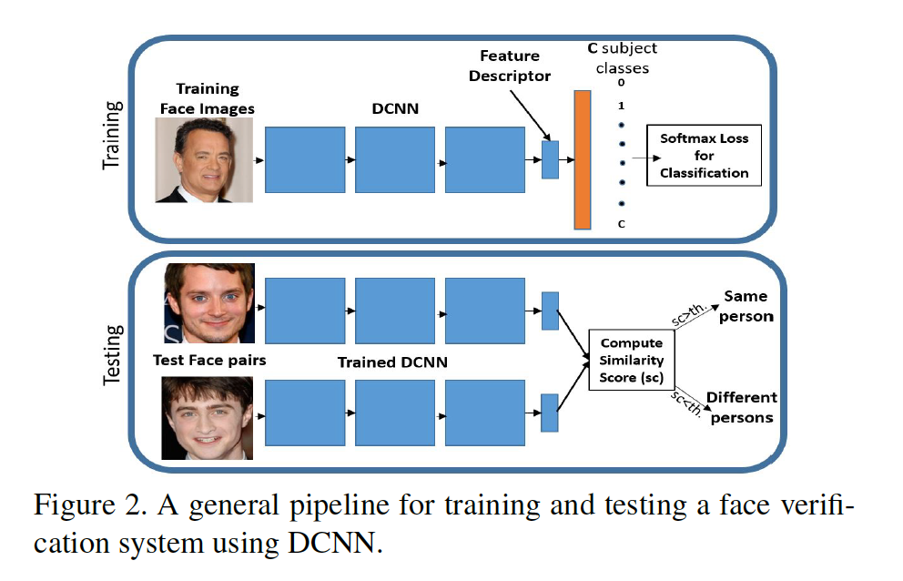

​		在测试时，使用训练后的DCNN分别为一对测试面部图像$\mathbf{x}_g$和$\mathbf{x}_p$提取特征描述符$f(\mathbf{x}_g)$和$f(\mathbf{x}_p)$，并将其标准化为单位长度。然后，在特征向量上计算相似性得分，其提供一种距离测量或者说嵌入空间中的特征有多近。如果相似性得分大于给定的阈值，人脸对被确定为相同的人脸。通常，计算归一化特征[28、24]之间的$L_2$距离，或使用余弦相似性[33、3、25、27]$s$作为相似性得分，如式（2）。这些相似性测量都是等价的，并产生相同的结果。

$$s=\frac{f(\mathbf{x}_g)^Tf(\mathbf{x}_p)}{\|f(\mathbf{x}_g\|_2\|f(\mathbf{x}_p)\|_2}\tag{2}$$

​		这中流程中有两个主要问题。第一，人脸验证任务的训练和测试步骤是不耦合的（decoupled）。带有softmax损失的训练并不一定确保在归一化空间或角度空间中，正类对靠近而负类对相互远离。

​		第二，softmax分类器在建模难度或极端样本方面是弱的。在数据质量不平衡的训练批次中，通过增加简单样本特征的$L_2$范数，而忽略困难样本，使softmax损失最小化。网络因此学会通过其特征描述子的$L_2$范数来响应人脸的质量。为了验证这种理论，我们在IJB-A数据集上进行简单的实验，其中我们基于人脸图像的$L_2$范数将模板（相同主体的图像/帧的组）分为三种不同的集合。使用利用常规softmax损失训练的Face-Resnet[33]计算特征。描述子的$L_2-\mbox{norm}<90$的模板为set1，$L_2-\mbox{norm}>90$但$<150$的模板为set2，而$L_2-\mbox{norm}>150$的模板为set3。总之，它们形成六组评估对。图1（a）显示了针对IJB-A人脸验证协议的这六个不同集合的性能。可以清楚地看出，低$L_2-\mbox{norm}$的人脸对表现非常差，而高$L_2-\mbox{norm}$人脸对表现最好。每组之间的性能差异非常明显。图1（b）展示来自set1、set2和set3的一些样本模板，这些模板确认了特征描述子的$L_2$范数说明了其质量。

​		为了解决这些问题，针对每张人脸图像，我们固定特征的$L_2-\mbox{norm}$。具体而言，我们将$L_2$约束添加到特征描述子，使得它位于固定半径的超球面。这种方法有两个优势。第一，在超球面上，最小softmax损失等价于最大化正类对的余弦相似性以及最小化负类对的余弦相似性，其增强特征的验证信号。第二，softmax损失能够更好的建模极端和困难人脸，因为所有的人脸特征有相同的$L_2$范数。

### 4. 所提出的方法

​		所提出的$L_2$-softmax损失由式（3）给出：

$$\begin{align}\mbox{minimize } &-\frac{1}{M}\sum_{i=1}^M\log\frac{e^{W_{y_i}^Tf(\mathbf{x}_i)+b_{y_i}}}{\sum_{j=1}^Ce^{W_j^Tf(\mathbf{x}_i)+b_j}} \\ \mbox{subject to }&\|f(\mathbf{x}_i)\|_2=\alpha, \forall i=1,2,\cdots,M,\end{align}\tag{3}$$

其中$\mathbf{x}_i$为大小为$M$的mini-batch中的输入图像，$y_i$为对应的类标签，$f(\mathbf{x}_i)$为DCNN倒数第二层获得的特征描述子，$C$为主体类的数量，$W$和$b$为网络最后一层的权重和偏置，其作为分类器。这个等式将额外的$L_2$约束添加到常规的softmax损失。我们使用MNIST数据证明这种约束的有效性。

#### 4.1. MNIST Example

​		我们研究$L_2$-softmax损失在MNIST数据集[17]上的影响。我们使用[33]中提到的更深和更宽版的LeNet，其中最后的隐藏层输出被限制到2维以进行简单可视化。对于第一种设置，我们使用常规softmax损失端到端的训练网络，以进行类数量为10的数字分类。对于第二种设置，我们将$L_2$归一化层和缩放层添加到2维特征，其施加式（3）描述的$L_2$约束（详情见4.2节）。图3描述MNIST测试集上不同类的2D特征，该测试集包含10000个数字图像。图中所示的每个波瓣代表唯一数字类别的二维特征。第二个设置的特征是在$L_2$归一化层之前获得的。

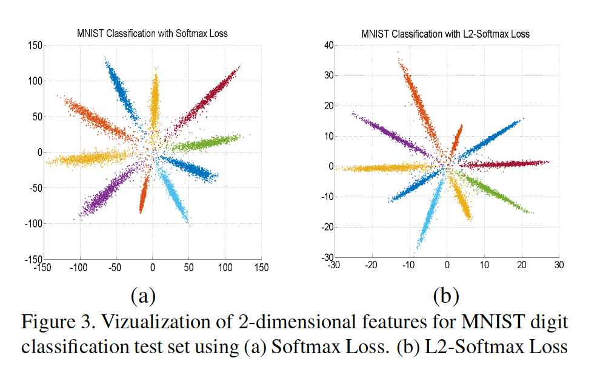

​		我们发现使用上述两种设置学习到的特征之间的明显差异。首先，当使用常规softmax损失，类内角度变化很大，其可以由每个类的花瓣的平均宽度估计。另一方面，利用$L_2$-softmax损失获得的特征有更低的类内角度变化，并且它们由更薄的花瓣表示。第二，对于softmax损失，特征的大小要高得多（范围最大为150），因为较大的特征范数导致正确分类的类别的可能性更高。相比之下，特征范数载$L_2$-softmax损失上有最小的影响，因为每个特征计算损失之前都被归一化到固定半径的圆上。因此，在归一化或角度空间中，网络专注于使来自同一类别的要素彼此靠近，而不同类的特征彼此分离。表1列出MNIST测试集上两个设置获得的准确率。$L_2$-softmax损失获得更好的性能，其将误差减小超过15%。注意，相比典型的DCNN，这些准确率的数量更低，因为我们仅使用2维特征进行分类。

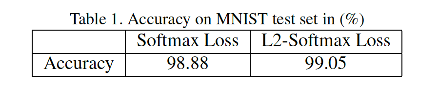

#### 4.2. 实现细节

​		这里，我们提供了在DCNNs框架中实现公式3中所述的$L_2$约束的详细信息。通过添加一个$L_2$归一化层和一个缩放层来实施约束，如图4所示。

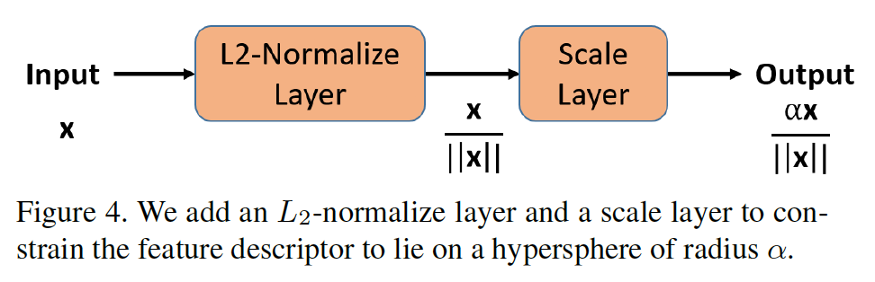

​		在DCNN的倒数第二层之后添加该模块，该特征用作特征描述子。通过式（4），$L_2$归一化层将输入特征$\mathbf{x}$归一化到单位向量。缩放层将输入单位向量缩放到由参数$\alpha$给定的固定半径（式（5））。总之，我们仅引入一个标量参数$\alpha$，其可以约网络的其他参数一起训练。

$$\begin{align}\mathbf{y} &=\frac{\mathbf{x}}{\|\mathbf{x}\|_2} \tag{4}\\ \mathbf{z}&=\alpha \cdot \mathbf{y} \tag{5}\\ p&=\frac{e^{W_i^TX_i}}{\sum_{j=1}^4e^{W_j^TX_i}} \\&=\frac{e^{\alpha}}{e^\alpha + 2 + e^{-\alpha}} \tag{7}\end{align}$$

​		忽略项$e^{-\alpha}$，并将它推广到$C$个类，平均概率变为：

$$p=\frac{e^{\alpha}}{e^{\alpha} + C - 2}\tag{8}$$

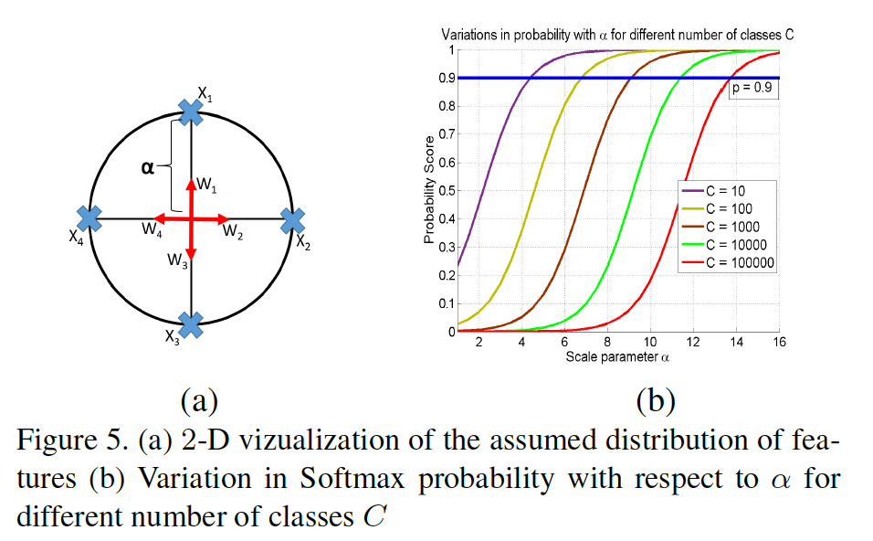

​		图5（b）绘制了概率得分为各种类数量$C$的参数$\alpha$的函数。我们可以推断，要实现给定的分类概率（例如$p = 0.9$），对于较大的$C$，我们需要具有较高的$\alpha$。给定一个数据集的类数量$C$，我们可以通过使用公式9获得$\alpha$的下限以达到$p$的概率得分。

$$\alpha_{low}=\log\frac{p(C-2)}{1-p}\tag{9}$$

### 5. 结果

​		针对我们的实验，我们使用公开可用的Face-Resnet[33] DCNN。图6给出网络的架构。它包含27个卷积层和2个全连接层。特征描述子的维度为512。它利用广泛使用的残差跳过连接[12]。我们在全连接层后添加$L_2$归一化和缩放层以在描述子上施加$L_2$约束。我们所有的实验都是在Caffe中进行的[15]。

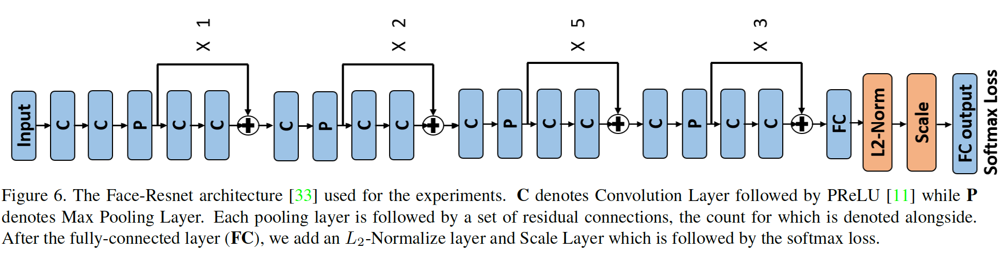

#### 5.1. 基线实验

​		本节中，我们实验验证$L_2$-softmax损失进行人脸验证的用处。我们从MS-Celeb-1M数据集构成训练集的两个子集：1）MS-small包含13403个主体的0.5M人脸图像，2）MS-large包含58207个主体的3.7M图像。使用[18]提到的聚类算法清晰数据集。我们利用softmax损失以及不同$\alpha$的$L_2$-softmax损失训练Face-Resnet网络。当利用MS-small训练时，我们以0.1的学习率开始，并在16K和24K迭代后乘以$1/10$，直到28K迭代结束。对于MS-large上的训练，我们使用相同的学习率，但是在50K和80K迭代后减小学习，最大迭代次数为100K迭代。在两个TITAN X GPU上，softmax和$L_2$-softmax损失函数消耗的训练时间相同，分别为MS-small训练集约9小时和MS-large训练集约32小时。在网络训练期间，我们将缩放层的学习乘子和衰减乘子设置为1（可训练的$\alpha$）和0（固定的$\alpha$）。我们在广泛使用的LFW数据集[14]上评估我们的基线，用于无限制设置，在$1:1$人脸验证协议上评估具有挑战性的IJB-A数据集[16]。通过实现[25]中提到的人脸检测和对齐算法，在训练和测试阶段裁剪并对齐了人脸，使其大小达到$128 \times128$。

##### 5.1.1  小型数据集上的实验

​		这里，我们将使用提出的L2-softmax损失在MS-small数据集上训练的网络与使用常规softmax损失训练的网络进行比较。图7表明常规softmax损失获得98.1%的准确率，而所提出的$L_2$-softmax损失获得99.28%的最佳准确率，从而将误差减小超过62%。它还显示了scale参数$\alpha$的性能变化。当$\alpha$小于某个阈值时，性能很差，当$\alpha$大于阈值时，性能趋于稳定。这种行为与4.3节的理论分析一致。根据此图，对于$\alpha>12$，$L_2$-softmax的性能更好，接近于使用等式9计算的下限（对于$C = 13403$，概率得分为0.9）。

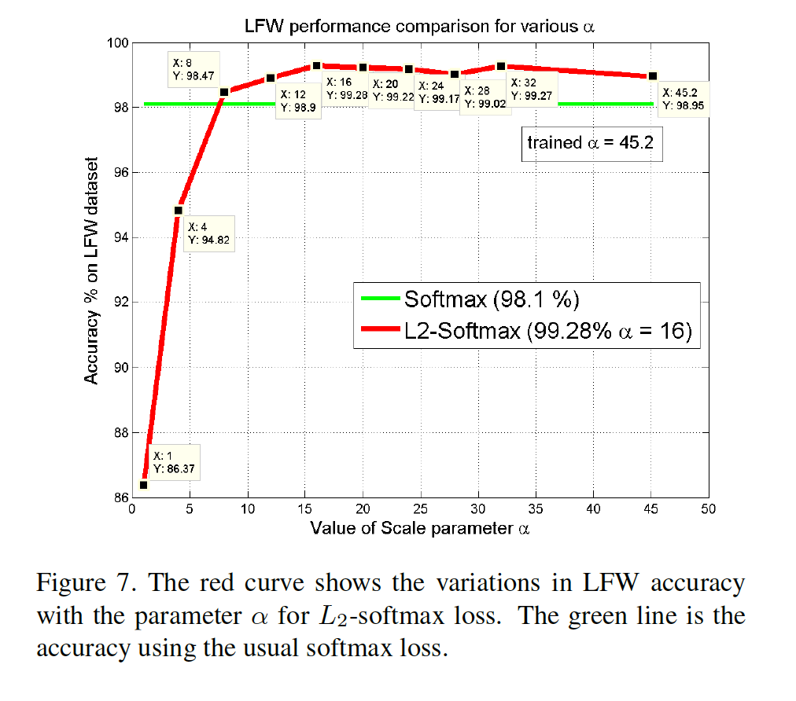

​		在IJB-A[16]的$1:1$验证协议上也有相似的倾向，如表2所示，其中值表示在0.0001、0.001、0.01和0.1的False Accept Rates（FAR：将其他人误识别为指定人的比例）上的True Accept Rate（TAR）。相比基线softmax损失，我们提出的方法将$\mbox{TAR}@\mbox{FAR}=0.0001$提高19%。$\alpha$在16到32之间的性能是一致的。另一点需要注意的是，网络学习缩放参数$\alpha$将导致略为的性能下降，这表明更紧凑的约束是更好的选择。

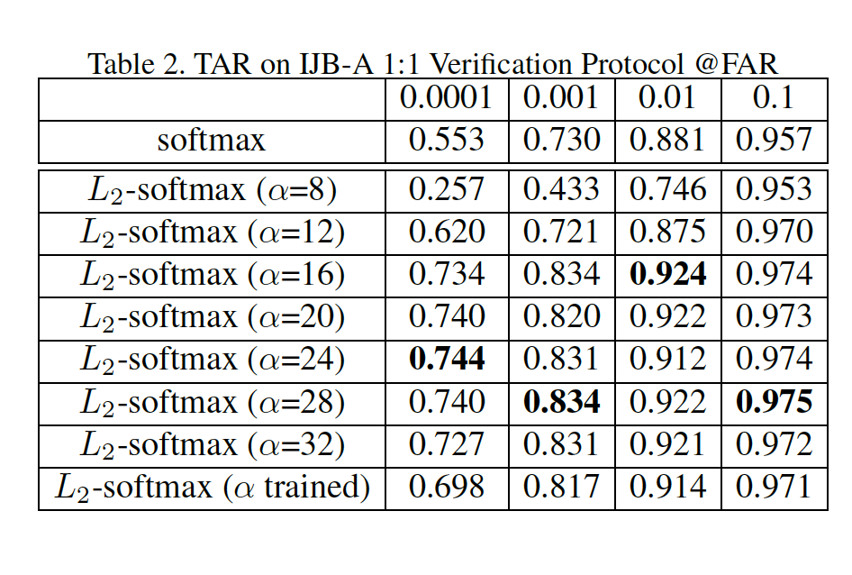

##### 5.1.2	大型训练集的实验

​		对于这个实验，我们在MS-large数据集上训练网络。表8展示LFW数据集上的性能。与小型数据集上的实验相似，$L_2$-softmax损失明显改进基线，将误差减小60%，并获得99.6%的准确率。相似地，它将IJB-A上的$\mbox{TAR}@\mbox{FAR}=0.0001$提高超过10%（表3）。$L_2$-softmax的性能与40或更高范围内的$\alpha$一致。与小型集训练不同的是，与40和50的固定$\alpha$相比，自训练的$\alpha$表现同样好。在这种情况下，$\alpha$的理论下限没有太大用处，因为在$\alpha> 30$的情况下可以获得改进的性能。我们可以推断，随着主体数量的增加，$\alpha$的下界越不可信，并且自训练的$\alpha$越不可信。该实验清楚地表明，建议的$L_2$-softmax损失在训练和测试数据集中是一致的。

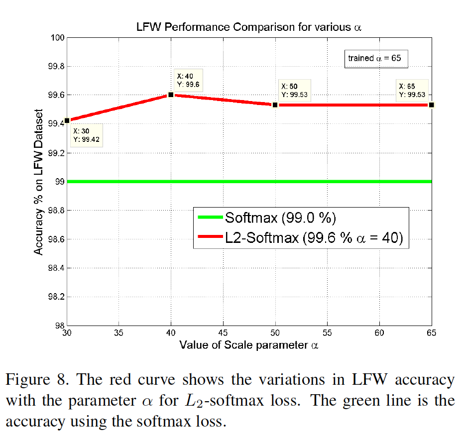

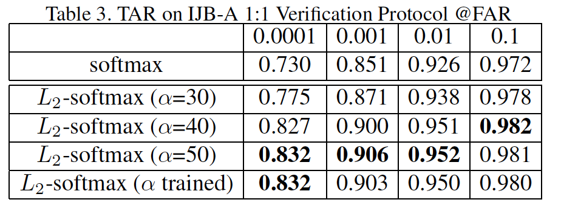

##### 5.1.3	不同DCNN的实验

​		为了检查所提出的$L_2$-softmax损失的一致性，我们在All-In-One Face[25]上使用该损失，而不是Face-Resnet上。我们使用All-In-One Face的识别分支在MS-small训练集上微调。All-In-One Face的识别分支包含7个卷积层、3个全连接层和一个softmax损失。我在512维的特征描述子后添加$L_2$归一化和缩放层。图9展示$L_2$-softmax损失和基softmax损失在LFW数据集上的性能比较。

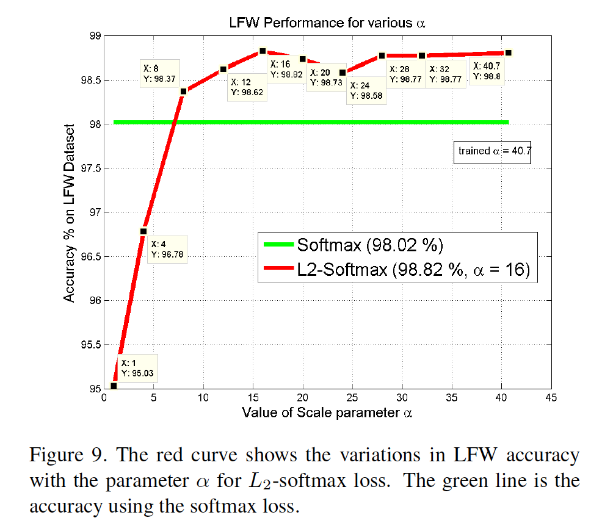

##### 5.1.4	辅助损失的实验

​		与softmax损失相似，$L_2$-softmax损失可以与诸如中心损失、对比损失、三元损失等的辅助损失结合，从而进一步提高性能。这里，我们研究当与中心损失耦合时$L_2$-softmax损失的性能变化。表4列出不同损失函数在LFW数据集上的性能。

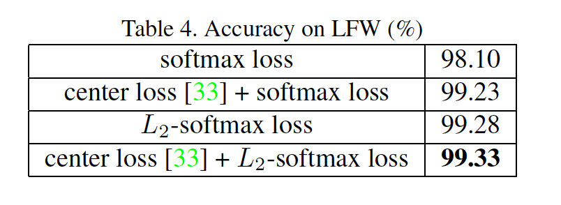

#### 5.2. 与最新方法的比较

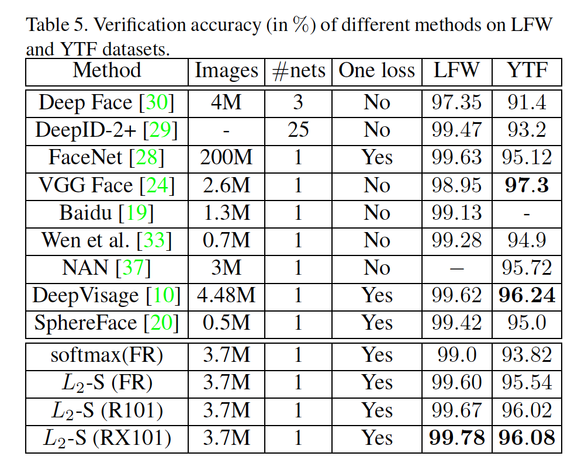

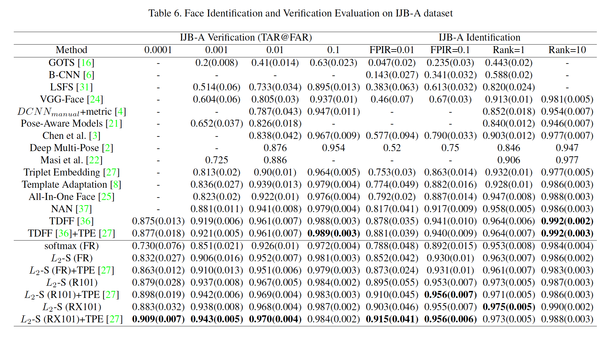

