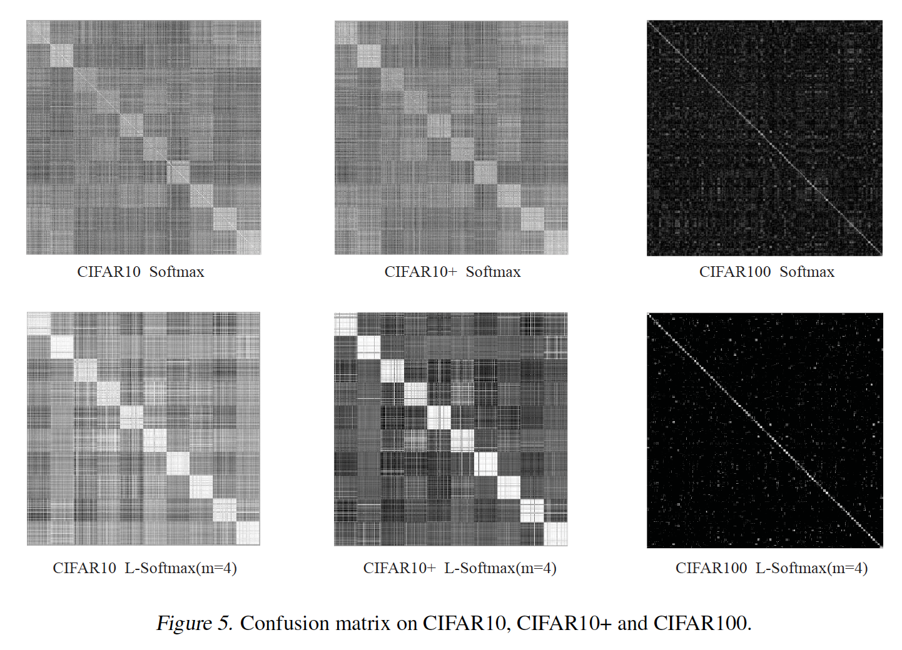

## Large-Margin Softmax Loss for Convolutional Neural Networks

### 摘要

​		具有Softmax的交叉熵是卷积神经网络中常用的监督组件。尽管它具有简单性，受欢迎程度和出色的性能，但该组件并未明确鼓励对特征的辨别性学习。本文中，我们提出一种通用的large-margin softmax（L-Softmax）损失，其显示地鼓励学习到特征之间的类内紧凑性和类间可分离性。此外，L-Softmax不仅可以调整期望的margin，还能避免过拟合。我们还证明L-Softmax损失可以通过常用的SGD优化。四个基准测试上的大量实验证明具有L-Softmax损失的深度学习特征变得更具辨别性，因此明显提升多个视觉分类和验证任务上的性能。

### 1. 引言

​		过去几年，卷积神经网络在多个视觉分类任务（如目标识别、人脸验证和手写数字识别）上获得提升最佳性能。分层的学习体架构，以及从局部到全局仔细提取特征的卷积和池化，提供了CNN强大的视觉表示能力以及它们在大规模视觉识别任务中的当前重要地位。面对日益复杂的数据，CNN利用更深的结构、更小的步长和新的非线性激活得到持续提高。尽管受益于强壮的学习能力，但CNN也不得不面对过拟合的关键问题。提出诸如大规模训练数据、dropout、数据增强、正则化和随机池化的大量工作来处理这个问题。

​		更强特征学习的最新趋势是，通过更具辨别性的信息来强化CNN。直观上，如果同时最大化学习到的特征的类内紧凑性和类间可分离性，那么该特征很好。尽管由于许多任务中固有的类内差异较大，这可能并不容易，但CNN的强大表示能力使我们有可能学习朝着这个方向的不变特征。 受这种想法的启发，提出了对比损失（Hadsell等，2006）和三重损失（Schroff等，2015），以增强类内紧凑性和类间可分离性。但是，随之而来的问题是，训练对和三元组的数量理论上可以达到$\mathcal{O}N^2$，其中$N$是训练样本的总数。考虑到CNN通常处理大规模训练集，对于这些损失，需要仔细选择选择训练样本的子集。由于softmax的简单性和概率解释，许多CNN中广泛使用softmax函数。与交叉熵损失一起，它们构成了CNN架构中最常用的组件。本文中，**我们将softmax损失定义为交叉熵、softmax函数和最后全连接层的组合**（见图1）。在如此的定义下，许多流行的CNN模型可以视为卷积特征学习组件和softmax损失组件的组合，如图1所示。尽管其流行性，当前的softmax损失没有显式地鼓励类内紧凑性和类间可分离性。我们的关键直觉是样本和参数之间的可分离性可以分解为具有余弦相似性的幅度（amplitude）和角度（angular）：$\mathbf{W}_c\mathbf{x} = \|\mathbf{W}_c\|_2\|\mathbf{x}\|_2\cos(\theta_c)$，其中$c$为类索引，以及对应的最后全连接层的参数$\mathbf{W}_c$可以视为类$c$的线性分类器。在softmax损失下，标签预测决策规则很大程度上取决于与每个类别的角度相似性，因为softmax损失使用余弦距离作为分类得分。因此，本文的目标是在角相似方面，将softmax损失推广到更通用的large-margin softmax（L-Softmax）损失，产生在学习特征之间潜在的更大角可分离性。这是通过将预设常数$m$乘以样本与ground-truth类的分类器之间的夹角来完成的。$m$确定了接近ground-truth类的强度，并产生角margin。人们应当可以看出，在我们提出的框架下，传统softmax损失称为L-Softmax损失的特例。图2验证了我们的想法，其中L-Softmax的学习特征变得更加紧凑和得到很好分离。

​		L-Softmax损失为具有可调整类内角margin约束的灵活学习目标。提出一种可调整难度的学习任务，其中随着需要的margin变大，难度逐渐增加。L-Softmax由几项期望的优势。首先，它鼓励类与类之间的角决策margin，生成更具辨别性的特征。它的几何解释非常清楚和直观，如3.2节中描述。第二，它通过定义更困难的学习目标部分避免了过拟合，其从不同的观点来解决过拟合。第三，L-Softmax不仅得益于分类问题，还得益于验证问题，其中理想的学习特征应当是最小的类间距离大于最大的类内距离。在这种情况下，学习好的分离特征可以明显提高性能。

​		我们的实验验证L-Softmax可以有效提高分类和验证任务的性能。更直观地说，学习到的特征的可视化见图2，图5给出了L-Softmax损失的极大辨别性。作为softmax损失的直接概括，L-Softmax损失不仅继承了softmax损失的所有优点，而且学习了不同类别之间具有大角度margin的特征。除此之外，L-Softmax损失的动机也很明确，如第3.3节所述。

### 2. 相关工作和预备

​		当前CNN广泛使用的数据损失包括Euclidean损失、（平方）hinge损失、信息增益损失、对比损失、三元损失、softmax损失等。为了增强类内紧凑性和类间可分离性，Sun等（2014）训练具有softmax损失和对比损失组合的CNN。对比损失将CNN与训练样本对一起输入。如果输入对属于同一类，那么对比损失要求它们的特征尽可能的相似。否则，对比损失将要求它们的距离比margin远。Schroff等（2015）使用triplet损失来鼓励距离约束，这与三元损失相似。不同的是，三元损失需要3（或多个3）训练样本作为一次的输入。三元损失最小化锚样本和正类样本（与锚有相同的身份）之间的距离，并最大化锚样本和负类样本之间的距离。三元损失和对比损失需要仔细设计对选择过程。Sun等（2014）和Schroff等（2015）建议施加如此的距离约束，其鼓励类内紧凑性和类间可分离性，可以极大地提高特征辨别性，其启发我们在原始的softmax损失中使用margin约束。

​		与任何先前工作不同，我们的工作推广原始的softmax损失上提出新颖的观点。我们定义标签$y_i$的第$i$个输入特征$\mathbf{x}_i$。那么原始的softmax损失可以写为

$$L = \frac{1}{N}\sum_iL_i = \frac{1}{N}\sum_i -\log\Big(\frac{e^{f_{y_i}}}{\sum_je^{f_j}}\Big) \tag{1}$$

其中$f_j$表示类得分向量$\mathbf{f}$的第$j$个元素（$j \in [1, K]$，$K$为类的数量），$N$为训练数据的数量。在softmax损失中，$\mathbf{f}$通常为全连接层$\mathbf{W}$的激活，所以$f_{y_i}$可以写为$f_{y_i} = \mathbf{W}_{y_i}^T\mathbf{x}_i$，其中$\mathbf{W}_{y_i}$为$\mathbf{W}$的第$y_i$列。值得注意的是，我们省略$f_j$中的常量$b$，以简化分析，但是我们的L-Softmax损失仍可轻易修改为具有$b$的工作。（事实上，性能几乎没有差异，因此，这里没有使它变得复杂。）因为$f_j$为$\mathbf{W}_j$和$\mathbf{x}_i$之间的内积，它可以公式化为$f_j = \|\mathbf{W}_j\|\|\mathbf{x}_i\|\cos(\theta_j)$，其中$\theta_j(0 \le \theta_j \le \pi)$为向量$\mathbf{W}_j$和$\mathbf{x}_i$之间的夹角。因此，损失变为：

$$L_i = -\log\Big(\frac{e^{\|\mathbf{W}_{y_i}\|\|\mathbf{x}_i\|\cos(\theta_{y_i})}}{\sum_j e^{\|\mathbf{W}_j\|\mathbf{x}_i|\|\cos(\theta_j)}}\Big)\tag{2}$$

### 3. Large-Margin Softmax Loss

#### 3.1. Intuition

​		我们给出一种简单的示例来描述我们的直觉。考虑二值分类，又一个来自类1的样本$\mathbf{x}$。原始的softmax迫使$\mathbf{W}_1^T\mathbf{x} > \mathbf{W}_2^T\mathbf{x}$（即$\|\mathbf{W}_1\|\|\mathbf{x}\|\cos(\theta_1) > \|\mathbf{W}_2\|\|\mathbf{x}\|\cos(\theta_2)$）以正确分类$\mathbf{x}$。但是，我们希望使分类更严格，以产生决策margin。所以我们要求$\|\mathbf{W}_1\|\|\mathbf{x}\|\cos(m\theta_1) > \|\mathbf{W}_2\|\|\mathbf{x}\|\cos(\theta_2)(0 \le \theta_1 \le \frac{\pi}{m})$，其中$m$为正整数。因为如下不等式成立：

$$\begin{align}\|\mathbf{W}_1\|\|\mathbf{x}\|\cos(m\theta_1) &\ge \|\mathbf{W}_1\|\|\mathbf{x}\|\cos(m\theta_1)\\&>\|\mathbf{W}_2\|\|\mathbf{x}\|\cos(\theta_2).\end{align}\tag{3}$$

因此，$\|\mathbf{W}_1\|\|\mathbf{x}\|\cos(\theta_1) > \|\mathbf{W}_2\|\|\mathbf{x}\|\cos(\theta_2)$一定成立。所以，新的分类标准对于准确分类$\mathbf{x}$使更强的要求，其为类1产生更严格的决策边界。

#### 3.2. 定义

​		遵循预备中的符号，L-Softmax损失定义为：

$$L_i = -\log\Big(\frac{e^{\|\mathbf{W}_{y_i}\|\|\mathbf{x})i\|\psi(\theta_{y_i})}}{e^{\|\mathbf{W}_{y_i}\|\|\mathbf{x}_i\|\psi(\theta_{y_i})} + \sum_{j\ne y_i}e^{\|\mathbf{W}_j\|\|\mathbf{x}_i\|\cos(\theta_j)}}\Big)\tag{4}$$

其中我们通常要求：

$$\psi(\theta) = \begin{cases}\cos(m\theta), & 0 \le \theta \le \frac{\pi}{m} \\ \mathcal{D}(\theta), &\frac{\pi}{m} < \theta \le \pi\end{cases}\tag{5}$$

其中$m$为整数，其与分类margin紧密关联。利用更大的$m$，分类margin变得更大，学习目标也变得更难。同时，$\mathcal{D}(\theta)$被要求是单调递减函数，$\mathcal{D}(\frac{\pi}{m})$应当等于$\cos(\frac{\pi}{m})$。

​		为了简化前向和反向传播，我们构建一个特定的$\psi(\theta_i)$：

$$\psi(\theta) = (-1)^k\cos(m\theta)-2k, \theta \in [\frac{k\pi}{m}, \frac{(k+1)\pi}{m}]\tag{6}$$

其中$k \in [0, m-1]$，$k$为整数。结合式（1）、式（4）和式（6），我们得到L-Softmax损失。对于前向和反向传播，我们需要用$\frac{\mathbf{W}_j^T\mathbf{x}_i}{\|\mathbf{W}_j\|\|\mathbf{x}_i\|}$替换$\cos(\theta_j)$，利用下式替换$\cos(m\theta_{y_i})$：

$$\begin{align}\cos(m\theta_{y_i}) &= C_m^0\cos^m(\theta_{y_i}) - C_m^2\cos^{m-2}(\theta_{y_i})(1-\cos^2(\theta_{y_i})) \\& + C_m^4\cos^{m-4}(\theta_{y_i})(1-\cos^2(\theta_{y_i}))^2 + \cdots \\ &(-1)^mC_m^{2n}\cos^{m-2n}(\theta_{y_i})(1-\cos^2(\theta_{y_i}))^n + \cdots\end{align}\tag{7}$$

其中$n$为整数，$2n \le m$。摆脱$\theta$之后，我们可以对$\mathbf{x}$和$\mathbf{W}$进行推导。用小批量输入进行微分也是微不足道的。

#### 3.3. 几何解释

​		我们旨在通过L-Softmax损失鼓励角margin。为了简化几何解释，我们分析二值分类的情况，其中仅有$\mathbf{W}_1$和$\mathbf{W}_2$。

​		首先，我们考虑如图4所示的$\|\mathbf{W}_1\|=\|\mathbf{W}_2\|$的场景。利用$\|\mathbf{W}_1\|=\|\mathbf{W}_2\|$，分类结果完全依赖$\mathbf{x}$和$\mathbf{W}_1(\mathbf{W}_2)$之间的夹角。在训练阶段，原始的softmax损失要求$\theta_1 < \theta_2$来将样本$\mathbf{x}$分类为1，而L-Softmax损失要求$m\theta_1 < \theta_2$以作出相同的决策。我们可以看出L-Softmax损失相对于分类标准更加严格，其产生类1和类2之间的分类margin。如果我们假设softmax损失和L-Softmax损失都被优化为相同的值，并且所有训练特征都可以完美分类，那么类1和类2之间的角margin由$\frac{m-1}{m+1}\theta_{1,2}$给出，其中$\theta_{1,2}$为分类向量$\mathbf{W}_1$和$\mathbf{W}_2$之间的夹角。L-Softmax损失也使1类和2类的决策边界不同，如图4所示，而原始的决策边界是相同的。根据另一种观点，我们令$\theta_1'=m\theta_1$，并假设原始的softmax损失和L-Softmax损失可以优化到相同的值。然后，我们可以知道原始的softmax损失的$\theta_1'$是L-Softmax损失中的$\theta_1$的$m-1$倍。因此，学习到的特征和$\mathbf{W}_1$之间的夹角变得更小。对每个类，相同的结论仍成立。本质上，L-Softmax损失会缩小每个类别的可行角度，并在这些类别之间产生角margin。

​		对于$\|\mathbf{W}_1\|>\|\mathbf{W}_2\|$和$\|\mathbf{W}_1\|<\|\mathbf{W}_2\|$的场景，几何解释有点复杂。因为$\mathbf{W}_1$和$\mathbf{W}_2$的长度不同，类1和类2的可行角度也不同（见图像中原始softmax损失的决策边界）。正常情况下，$\mathbf{W}_j$越大，其相应类的可行角也越大。因此，L-Softmax损失也为不同类产生不同的可行角度。与$\|\mathbf{W}_1\|=\|\mathbf{W}_2\|$的场景的分析相似，所提出的损失也将生成类1和类2之间的决策margin。

#### 3.4. 讨论

​		L-Softmax损失利用原始softmax损失上的简单修改，其获得类之间的分类角margin。通过将不同的值分配给$m$，我们为CNN定义了灵活且难度可调的学习任务。L-Softmax损失具有一些不错的特性，例如

- L-Softmax损失有清晰的几何解释。$m$控制类之间的margin。利用更大的$m$（相同训练损失下），类之间理想的margin变得更大，学习难度也增加。利用$m=1$，L-Softmax损失与原始的softmax损失相同。
- L-Softmax损失定义定义一个可调整margin（难度）的相对困难的学习目标。困难的学习目标可以有效避免过拟合，并充分利用深度和宽度架构的强学习能力。
- L-Softmax损失可以很容易地用作标准损失的替代品，也可以与其他性能提升方法和模块（包括学习激活函数、数据增强、池化函数或其他修改的网络架构）串联使用。

### 4. 优化

​		计算L-Softmax损失的前向和反向传播非常轻松，所以使用典型的随机梯度下降来优化L-Softmax损失也很简单。对于$L_i$，原始softmax损失和L-Softmax损失之间的仅有差异为$f_{y_i}$。因此，我们仅需要计算前向和反向传播中的$f_{y_i}$，同时$f_j,j\ne y_i$与原始的softmax损失相同。放入式（6）和式（7），$f_{y_i}$写为：

$$\begin{align}f_{y_i} = &(-1)^k \cdot \|\mathbf{W}_{y_i}\|\|\mathbf{x}_i\|\cos(m\theta_i) - 2k \cdot\|\mathbf{W}_{y_i}\|\|\mathbf{x}_i\| \\ =&(-1)^k \cdot\|\mathbf{W}_{y_i}\|\|\mathbf{x}_i\|\Big(C_m^0(\frac{\mathbf{W}_{y_i}^T\mathbf{x}_i}{\|\mathbf{W}_{y_i}\|\|\mathbf{x}_i\|})^m -\\& C_m^2(\frac{\mathbf{W}_{y_i}^T\mathbf{x}_i}{\|\mathbf{W}_{y_i}\|\|\mathbf{x}_i\|})^{m-2}(1-(\frac{\mathbf{W}_{y_i}^T\mathbf{x}_i}{\|\mathbf{W}_{y_i}\|\|\mathbf{x}_i\|})^2) + \cdots\Big)\\&-2k\cdot\|\mathbf{W}_{y_i}\|\|\mathbf{x}_i\|\end{align}\tag{8}$$

其中$\frac{\mathbf{W}_{y_i}^T}{\|\mathbf{W}_{y_i}\|\|x\|}\in[\cos(\frac{k\pi}{m}), \cos(\frac{(k+1)\pi}{m})]$，$k$为属于$[0,m-1]$的整数。对于反向传播，我们使用链式法则来计算偏微分：$\frac{\part L_i}{\part \mathbf{x}_i}=\sum_j \frac{\part L_i}{\part f_j}\frac{\part f_j}{\part \mathbf{x}_i}$和$\frac{\part L_i}{\part \mathbf{W}_{y_i}}=\sum_j\frac{\part L_i}{\part f_j}\frac{\part f_j}{\part \mathbf{W}_{y_i}}$。因为$\frac{\part L_i}{\part f_j}$和$\frac{\part f_j}{\part \mathbf{x}_i},\frac{\part f_j}{\part \mathbf{W}_{y_i}},\forall j \ne y_i$对于原始softmax损失和L-Softmax损失都是相同的，为了简单起见，我们将其省略。$\frac{\part f_{y_i}}{\part \mathbf{x}_i}$和$\frac{\part f_{y_i}}{\part \mathbf{W}_{y_i}}$可以如下计算：

$$\begin{align}\frac{\part f_{y_i}}{\part \mathbf{x}_i}=&(-1)^k\cdot\Big(C_m^0\frac{m(\mathbf{W}_{y_i}^T\mathbf{x}_i)^{m-1}\mathbf{W}_{y_i}}{(\|\mathbf{W}_{y_i}\|\|\mathbf{x}_i\|)^{m-1}}-\\&C_m^0\frac{(m-1)(\mathbf{W}_{y_i}^T\mathbf{x}_i)^m\mathbf{x}_i}{\|\mathbf{W}_{y_i}\|^{m-1}\|\mathbf{x}_i\|^{m+1}} - C_m^2\frac{(m-2)(\mathbf{W}_{y_i}^T\mathbf{x}_i)^{m-3}\mathbf{W}_{y_i}}{(\|\mathbf{W}_{y_i}\|\|\mathbf{x}_i\|)^{m-3}} \\&+C_m^2\frac{(m-3)(\mathbf{W}_{y_i}^T\mathbf{x}_i)^{m-2}\mathbf{x}_i}{\|\mathbf{W}_{y_i}\|^{m-3}\|\mathbf{x}_i\|^{m-1}} + C_m^2\frac{m(\mathbf{W}_{y_i}^T\mathbf{x}_i)^{m-1}\mathbf{W}_{y_i}}{(\|\mathbf{W}_{y_i}\|\|\mathbf{x}_i\|)^{m-1}}\\& -C_m^2\frac{(m-1)(\mathbf{W}_{y_i}^T\mathbf{x}_i)^m\mathbf{x}_i}{\|\mathbf{W}_{y_i}\|^{m-1}\|\mathbf{x}_i\|^{m+1}} + \cdots\Big) - 2k \cdot \frac{\|\mathbf{W}_{y_i}\|\mathbf{x}_i}{\|\mathbf{x}_i\|},\tag{9}\end{align}$$

$$\begin{align}\frac{\part f_{y_i}}{\part\mathbf{W}_{y_i}}=&(-1)^k\cdot\Big(C_m^0 \frac{m(\mathbf{W}_{y_i}^T\mathbf{x}_i)^{m-1}\mathbf{x}_i}{(\|\mathbf{W}_{y_i}\|\|\mathbf{x}_i\|)^{m-1}}-\\&C_m^0\frac{(m-1)(\mathbf{W}_{y_i}^T\mathbf{x}_i)^m\mathbf{W}_{y_i}}{\|\mathbf{W}_{y_i}\|^{m+1}\|\mathbf{x}_i\|^{m-1}} - C_m^2\frac{m(\mathbf{W}_{y_i}^T\mathbf{x}_i)^{m-3}\mathbf{x}_i}{(\|\mathbf{W}_{y_i}\|\|\mathbf{x}_i\|)^{m-3}} \\&+C_m^2\frac{(m-3)(\mathbf{X}_{y_i}^T\mathbf{x}_i)^{m-2}\mathbf{W}_{y_i}}{\|\mathbf{W}_{y_i}\|^{m-1}\|\mathbf{x}_i\|^{m-3}} + C_m^2\frac{m(\mathbf{W}_{y_i}^T\mathbf{x}_i)^{m-1}\mathbf{x}_i}{(\|\mathbf{W}_{y_i}\|\|\mathbf{x}_i\|)^{m-1}} \\&-C_m^2\frac{(m-1)(\mathbf{W}_{y_i}^T\mathbf{x}_i)^m\mathbf{W}_{y_i}}{\|\mathbf{W}_{y_i}\|^{m+1}\|\mathbf{x}_i\|^{m-1}} + \cdots\Big)-2k\cdot\frac{\|\mathbf{x}_i\|\mathbf{W}_{y_i}}{\|\mathbf{W}_{y_i}\|}\end{align}\tag{10}$$

在实现中，通过构建$\frac{\mathbf{W}_{y_i}^T\mathbf{x}_i}{\|\mathbf{W}_{y_i}\|\|\mathbf{x}_i\|}$（即$\cos(\theta_{y_i})$）的查询表，可以有效地计算$k$。具体来说，我们给出一个当$m = 2$时向前和向后传播的示例。因此，$f_i$写为

$$f_i = (-1)^k\frac{2(\mathbf{W}_{y_i}^T\mathbf{x}_i)^2}{\|\mathbf{W}_{y_i}\|\|\mathbf{x}_i\|}-(2k + (-1)^k)\|\mathbf{W}_{y_i}\|\|\mathbf{x}_i\|\tag{11}$$

其中$k = \begin{cases}1, &\frac{\mathbf{W}_{y_i}^T\mathbf{x}_i}{\|\mathbf{W}_{y_i}\|\|\mathbf{x}_i\|}\le \cos(\frac{\pi}{2}) \\ 0, &\frac{\mathbf{W}_{y_i}^T\mathbf{x}_i}{\|\mathbf{W}_{y_i}\|\|\mathbf{x}_i\|}>\cos(\frac{\pi}{2})\end{cases}$。

​		在反向传播中，$\frac{\part f_{y_i}}{\part \mathbf{x}_i}$和$\frac{\part f_{y_i}}{\part \mathbf{W}_{y_i}}$可以计算为：

$$\begin{align}\frac{\part f_{y_i}}{\part \mathbf{x}_i}=&(-1)^k\Big(\frac{4\mathbf{W}_{y_i}^T\mathbf{x}_i\mathbf{W}_{y_i}}{\|\mathbf{W}_{y_i}\|\|\mathbf{x}_i\|} - \frac{2(\mathbf{\mathbf{W}_{y_i}^T\mathbf{x}_i})^2\mathbf{x}_i}{\|\mathbf{W}_i\|\mathbf{x}_i\|^3}\Big) \\&-(2k + (-1)^k)\frac{\|\mathbf{W}_{y_i}\|\mathbf{x}_i}{\|\mathbf{x}_i\|}\end{align}\tag{12}$$

$$\begin{align}\frac{\part f_{y_i}}{\part \mathbf{W}_{y_i}} =&(-1)^k\Big(\frac{4 \mathbf{W}_{y_i}^T\mathbf{x}_i\mathbf{x}_i}{\|\mathbf{W}_{y_i}\|\|\mathbf{x}_i\|} - \frac{2(\mathbf{W}_{y_i}^T\mathbf{x}_i)^2\mathbf{W}_i}{\|\mathbf{x}_i\|\|\mathbf{W}_{y_i}\|^3}\Big)\\&-(2k + (-1)^k)\frac{\|\mathbf{x}_i\|\mathbf{W}_{y_i}}{\|\mathbf{W}_{y_i}\|}\end{align}\tag{12}$$

当$m \ge 3$时，我们仍可以使用式（8）、式（9）和式（10）来计算前向和反向传播。

### 5. 实验和结果

#### 5.1. 实验设置

​		我们在两种典型视觉应用上评估推广的softmax损失：视觉分类和人脸验证。在视觉分类中，我们使用三种标准的基准测试数据集：MNIST、CIFAR10和CIFAR100。在人脸验证中，我们在广泛使用的LFW数据集上评估我们的方法。在所有基线CNN中，我们仅使用单模型来比较我们的性能。为了方便，我们使用L-Softmax表示L-Softmax损失。实验中的Softmax和L-Softmax使用表1中的相同CNN。

**通用设置：**我们遵循VGG-net的设计哲学：（1）对于卷积层，使用$3 \times 3$的核大小核1padding（如果没有特别指出）来保持特征图大小不变，（2）对于池化层，如果特征图的大小减半，滤波器的数量加倍以保持每层的时间复杂度。我们的CNN架构如表1所示。在卷积层中，我们使用具有修改的Caffe库实现CNN。对于所有实验，我们采用PReLU作为激活函数，并且batchsize为256。我们使用0.0005的权重衰减，动量为0.9。在我们的网络中使用He等（2015b）中的权重初始化和batchnormalization，而没有dropout。值得注意的是，我们仅对训练和测试数据执行mean substraction过程。但是，当训练数据有过多主体（例如CASIA-WebFace数据集），L-Softmax收敛比softmax损失更难。对于L-Softmax难以收敛的情况，我们使用一种学习策略，即让$f_{y_i}=\frac{\lambda\|\mathbf{W}_{y_i}\|\|\mathbf{x}_i\|\cos(\theta_{y_i})+\|\mathbf{W}_{y_i}\|\|\mathbf{x}_i\|\psi(\theta_{y_i})}{1+\lambda}$，然后开始一个非常大的梯度下降（与优化原始softmax相似）。然后，迭代期间，我们逐渐减小$\lambda$。理想情况下，$\lambda$可以逐渐减小到零，但实际上，一个较小的值通常就足够了。

**MNIST, CIFAR10, CIFAR100：**我们以0.1的学习率开始，在12k和15k迭代时，除以10，并且在18K迭代时终止，这是在45k/5k train/val划分上确定的。

**人脸验证：** 学习率设置为0.1、0.01、0.001，并在训练损失变平坦时切换学习率。epoch中速大约为30。

**测试：**我们使用softmax来分类MNIST、CIFAR10和CIFAR100数据集中的测试样本。在LFW中，我们使用简单的cosines距离和最近邻规则进行人脸识别。

#### 5.2. 视觉分类

**MNIST：**网络架构如表1所示。表2给出先前的最佳结果，以及我们所提出的L-Softmax损失的结果。

**CIFAR10：**

**CIFAR：**

**混淆矩阵可视化：**

**Error Rate  vs. Iteration：**

#### 5.3. 人脸验证

