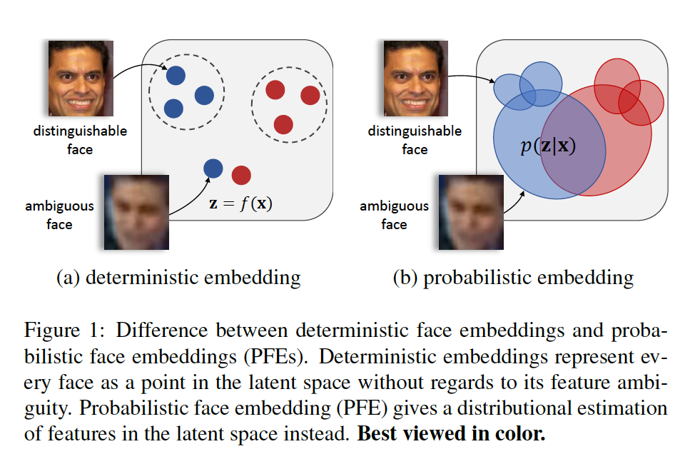
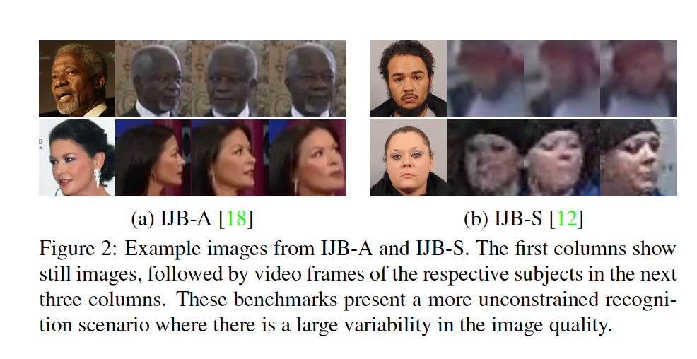
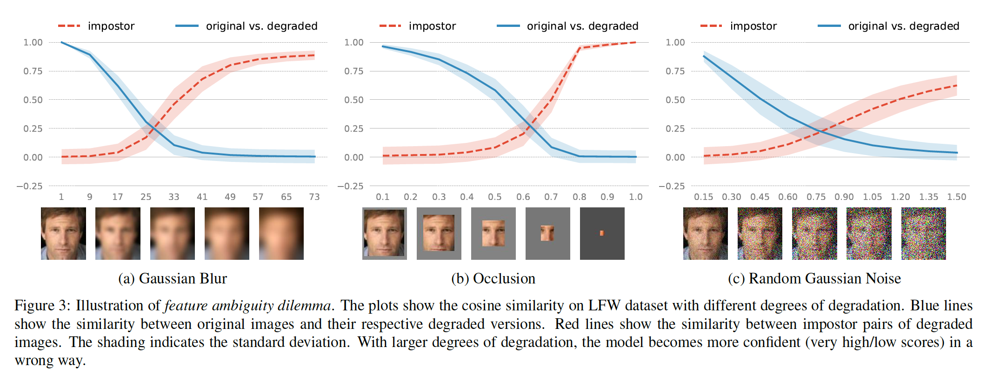
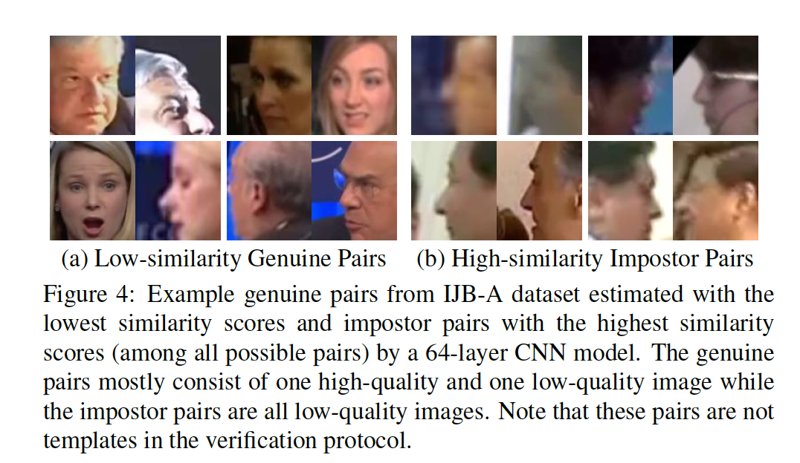
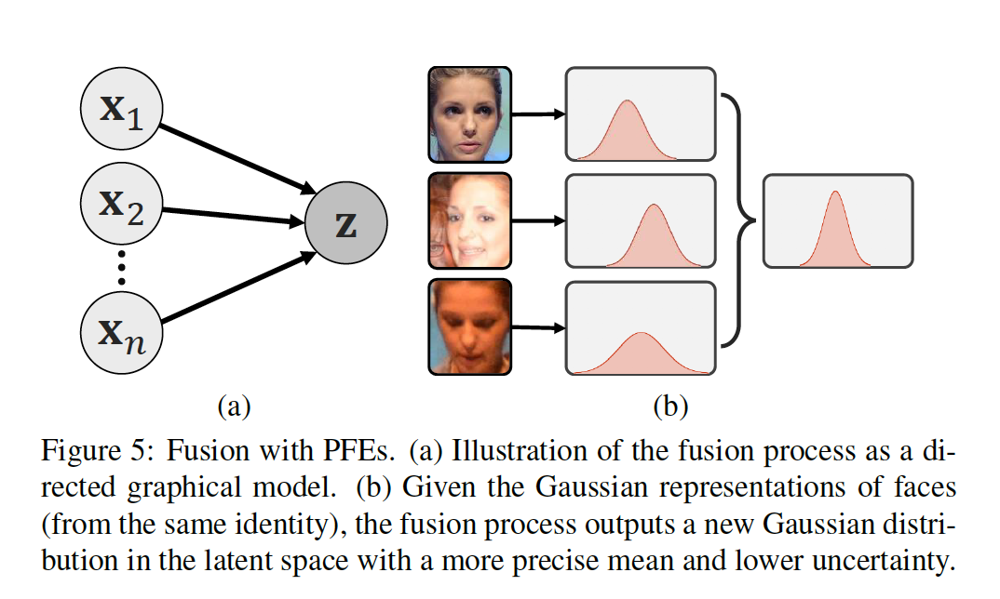

## Probabilistic Face Embeddings

### 摘要

​		嵌入方法通过在隐语义空间（latent semantic space）比较人脸特征 ，在人脸识别方面取得了成功。但是，在完全无约束的人脸设置中，由嵌入模型学习的人脸特征可能是模棱两可的，甚至可能不存在于输入人脸中，从而产生了噪声表示。我们提出Probabilistic Face Embeddings（PFEs），其将每张人脸图像表示为隐空间中的高斯分布。分布的均值估计最可能相似的特征值，而方差表示特征值的不确定性。然后可以使用不确定性信息自然地推导出概率解，以匹配和融合PFE。不同基线模型、训练数据集和基准测试上的经验评估表明所提出的方法可以提高通过将确定性嵌入转换为PEF来提高识别能力。PFE估计的不确定性也可以作为潜在匹配准确性的良好指标，这对于风险控制的识别系统很重要。

### 1. 引言

​		当人类被要求描述人脸图像时，它们不仅给出人脸属性的描述，还给出与它们关联的置信度。例如，如果图像中眼睛是蓝色的，那么人们可能保留眼睛大小的不确定信息，并关注其他特征。此外，如果图像完全损坏并且无法辨别任何属性，则主体可能会回答说他/她无法识别此脸。这种不确定性（或置信度）估计在人类作出决策中是常见和重要的。

​		另一方面，SOTA人脸识别系统中使用的表示通常是置信度无关的。这些方法依赖嵌入模型（例如DNN）给出隐特征空间中每张人脸图像的确定性点表示。在给定图像中，隐特征空间中的点表示人脸特征的模型估计。如果估计中的误差受到某种程度的限制，则两点之间的距离可以有效地测量相应人脸图像之间的语义相似性。但是给定低质量输入，其中图像中期望的人脸特征是模棱两可的，或者不存在，那么嵌入点中的大型漂移是不可避免的，大致错误识别（图1a）。

​		鉴于人脸识别系统已经在相对受限的人脸识别基准（例如，LFW [10]和YTF [37]，其中可以清楚地观察到大多数人脸属性）上实现了较高的识别精度，因此最近的人脸识别挑战已经转移到更加不受限制的场景中， 包括监视视频[18、23、12]（请参见图2）。在这些任务中，人脸图像中可能存在任何类型和程度的变化，其中通过表示模型学习到的大多数期望的人脸特征可能不存在。因此，在LFW上获得超过99%的准确率的SOTA人脸识别系统在IAPRA Janus基准测试上遭遇性能衰减。

​		为了处理上述问题，我们提出_Probabilistic Face Embeddings_（PEFs），对于每个输入人脸图像，它们在潜在空间中给出了分布估计而不是点估计（图1b）。分布的均值可以解释为最可能的隐特征值，而分布的范围表示这些估计的不确定性。PFE可以以两种方式处理无约束人脸识别问题：（1）匹配（人脸比较）期间，PFE惩罚不确定的特征（维度），并会更加关注更自信的特征。（2）对于低质量输入，由PFE估计的置信度可以用于拒绝输入或主动寻求人类帮助来避免错误识别。此外，可以得出自然的解决方案，以将一组人脸图像的PFE表示聚合为具有较低不确定性的新分布，以提高识别性能。PFE的实现是开源的（https://github.com/seasonSH/Probabilistic-Face-Embeddings）。本文的贡献总结如下：

1. 一种不确定感知的概率人脸嵌入（PFE），其将人脸图像表示为分布，而不是点。
2. 一个概率框架，可以自然而然地使用PFE进行人脸匹配和特征融合。
3. 一种将已有确定性的嵌入转换为PFEs（而没有额外训练数据）的的简单方法。
4. 综合实验表明，提出的PFE可以提高确定性嵌入的人脸识别性能，并可以有效滤除低质量的输入，以增强人脸识别系统的鲁棒性。

### 2. 相关工作

**Uncertainty Learning in DNNs**	为了提高辨别性DNN的鲁棒性和可解释性，深度不确定学习取得越来越多的关注。有两种不确定性：_model uncertainty_和_data uncertainty_。模型不确定性是指给定训练数据的模型参数的不确定性，可以通过收集其他训练数据来减少[22、24、14、5]。数据不确定性是指输出的不确定性，其主要来源是输入数据中的固有噪声，因此无法通过更多的训练数据来消除[15]。我们的工作研究的不确定性可以分类为数据不确定性。尽管已有开发技术来估计不同任务（包括分类和回归）中的数据不确定性，但由于我们的目标空间没有由给定标签完善的定义，所以它们不适合我们任务。变分自编码器[17]也可以视为估计数据不确定性的方法，但是它主要用于生成目的。特定于人脸识别，一些研究[6、16、45]利用模型不确定性来分析和学习人脸表示，但是据我们所知，我们是第一项利用数据不确定性进行识别任务的工作。

**Probabilistic Face Representation**	将人脸建模为概率分布不是一个新想法。在人脸模板/视频匹配中，在将人脸建模为特征空间中的概率分布[29、1]、子空间[3]或流形[1、11]方面已有大量文献。但是，如此方法的输入是一组人脸图像，而不是单张人脸图像，并且他们使用分布之间的相似性或距离度量（例如KL散度）进行比较，这不会影响不确定性。同时，一些研究[19、9]尝试使用人脸部分的特征建立给定人脸的模糊模型。相比之下，所提出的PFE将每张人脸图像表示为由DNN编码的隐空间中的分布，并且我们使用不确定感知的对数似然得分来比较分布。

**Quality-aware Pooling**	与上述方法相比，人脸模板/视频匹配中的最近工作旨在利用通过将所有面孔的深度特征聚集到单个紧凑向量中，从而利用深度CNN嵌入的显着性[41，21，39，7]。一组这些方法，一个单独的模块学习以预测图像集中每张人脸的质量，然后将其标准化以用于特征向量的加权池化。我们证明在我们的框架下可以自然而言地推导解，其不仅给出质量感知池化方法的概率化解释，还学习更一般的解，其中图像集可以建模为PFE表示。

### 3. 确定性嵌入的局限

​		本节中，我们同理论和实验角度解释确定性人脸嵌入问题。令$\mathcal{X}$表示图像空间，$\mathcal{Z}$表示$D$维隐特征空间。一种理想的隐空间$\mathcal{Z}$应当仅编码_identity-salient_特征，并且从身份无关特征中_解藕_。这样，每个身份都应具有一个最能代表此人的唯一固有代码$\mathbf{z}\in\mathcal{Z}$，并且每张人脸图像$\mathbf{x}\in\mathcal{X}$是从$p(\mathbf{x} |\mathbf{z})$采样的观察值。训练人脸嵌入的过程可以视为搜索如此隐空间$\mathcal{Z}$和学习逆映射$p(\mathbf{z}|\mathbf{x})$的联合过程。对于确定性嵌入，逆映射是一个Dirac函数$p(\mathbf{z|x}) = \delta(\mathbf{z} - f(\mathbf{x}))$，其中$f$嵌入函数。显然，对于任意空间$\mathcal{Z}$，给定$\mathbf{x}$中噪声的概率，恢复精确的$\mathbf{x}$是不现实的，低质量输入的嵌入点将不可避免地偏离其固有$\mathbf{z}$（无论我们拥有多少训练数据）。

​		问题是，是否可以限制此偏移，以使我们仍然比类间距离具有更小的类内距离。但是，对于完全无约束的人脸识别是不现实的，并且我们进行实验来验证这一点。从一个简单的例子开始：给定一对相同图像，确定性嵌入始终将它们映射到相同点，因此它们之间的距离始终为0，即使这些图像不包含人脸。这暗示“一对图像相似，甚至相同不一定意味着它们属于相同人的概率很高”。

​		为了验证这个问题，我们通过手动衰减高质量图像进行实验，并可视化它们的相似性得分。我们从LFW数据集中随机选择每个主体的高质量图像，并手动将高斯模糊、遮挡和随机高斯噪声加入人脸图像。特别地，我们线性增加高斯核、遮挡比例和噪声的标准差来控制退化程度。在每个退化级别，我们利用64层CNN提取特征向量，其为与SOTA人脸识别系统相当。将特征归一化到超球嵌入空间。然后，报告两种类型的余弦相似性：（1）原始图像和它对应退化图像对之间的相似性，（2）不同身份的退化图像之间的相似性。如图3所示，对于所有三种退化类型，真实相似性分数降低为0，而冒名顶替者相似性分数收敛为1.0！这些指明两种错误，即使模型非常有信心（非常高/低相似性评分），也可以在完全不受约束的情况下预期出现两种错误：

（1）冒名顶替的低质量对的false accept

（2）真确的跨质量对的false reject。

为了证实这一点，我们通过找到得分最高/最低的冒名顶替者/真实图像对，在IJB-A数据集上测试了该模型。这种场景确实如我们假设的（见图4）。我们称这为_Feature Ambiguity Dilemma_，当迫使确定性嵌入来估计模棱两可人脸的特征时，能够观察到这一点。实验还暗示着存在一个模糊的输入映射到并且距离度量失真的黑暗空间。

### 4. Probabilistic Face Embeddings

​		为了处理由数据不确定性引起的前面的问题，我们提出将不确定性编码到人脸表示，并在匹配期间考虑它。具体而言，与其在隐空间中构建给出点估计的模型，我们估计隐空间中的分布$p(\mathbf{z}|\mathbf{x})$来表示人脸的潜在外观。特别地，我们使用多变量高斯分布：

$$p(\mathbf{z}|\mathbf{x}_i) = \mathcal{N}(\mathbf{z};\mathbf{\mu}_i,\mathbf{\sigma}_i^2\mathbf{I})\tag{1}$$

其中$\mathbf{\mu}_i$和$\mathbf{\sigma}_i$都为由网络预测的第$i$张输入图像$\mathbf{x}_i$的D维向量。这里，我们仅考虑对角协方差矩阵以减少人脸表示的复杂性。这种表示应当由如下特性：

1. 中心$\mu$应当编码输入图像的最可能的人脸特征。
2. 不确定性$\sigma$应当沿特征维度编码模型的置信度。

​    此外，我们希望使用单个网络来预测分布。考虑到仍在开发用于训练面部嵌入的新方法，我们旨在开发一种可以轻松地将现有确定性人脸嵌入网络转换为PFE的方法。接下来，我们首先展示如何比较和融合PFE表示以证明其优势，然后提出学习PFE的方法。

**注意1**	由于空间有限，我们提供在补充材料中提供所有引理的证明。

#### 4.1. Matching with PFEs

​		给定图像对$(\mathbf{x}_i, \mathbf{x}_j)$的PFE表示，我们可以直接测量它们属于同一人（共享相同的隐码）的“似然”：$p(\mathbf{z}_i =\mathbf{z}_j)$，其中$\mathbf{z}_i \sim p(\mathbf{z}|\mathbf{x}_i)$和$\mathbf{z}_j \sim p(\mathbf{z}|\mathbf{x}_j)$。具体而言，

$$p(\mathbf{z}_i = \mathbf{z}_j) = \int p(\mathbf{z}_i|\mathbf{x_i})p(\mathbf{z}_j|\mathbf{x_j})\delta(\mathbf{z}_i - \mathbf{z}_j)d\mathbf{z}_id\mathbf{z}_j.\tag{2}$$

实践中，我们希望使用对数似然，它的解为：

$$\begin{align}s(\mathbf{x}_i,\mathbf{x}_j)&=\log p(\mathbf{z}_i = \mathbf{z}_j) \\ &=-\frac{1}{2}\sum_{l=1}^D(\frac{(\mu_i^{(l)}-\mu_j^{(l)})^2}{\sigma_i^{2(l)} + \sigma_j^{2(l)}} + \log(\sigma_i^{2(l)} + \sigma_j^{2(l)})) - const\end{align},\tag{3}$$

其中$const = \frac{D}{2}\log2\pi$，$\mu_i^{(l)}$为$\mu_i$的第$l$为，$\sigma_i^{(l)}$相似。

​		请注意，这种对称测度可以看作是一个输入的潜在代码以另一个为条件的可能性的期望，即

$$\begin{align}s(\mathbf{x}_i,\mathbf{x}_j)&=\log\int p(\mathbf{z}|\mathbf{x}_i)p(\mathbf{z}|\mathbf{x}_jd\mathbf{z})\\&=\log \mathbb{E}_{\mathbf{z}\sim p(\mathbf{z}|\mathbf{x}_i)}[p(\mathbf{z}|\mathbf{x}_j)]\\&=\log \mathbb{E}_{\mathbf{z}\sim p(\mathbf{z}|\mathbf{x}_j)}[p(\mathbf{z}|\mathbf{x}_i)] \end{align}.\tag{4}$$

​		例如，我们称其为_mutual likelihood score_（MLS）。与KL散度不同，这个得分是无界的，并且不能看作距离度量。可以证明，当所有不确定性都相同时，平方欧氏距离等于MLS的一种特殊情况：

**属性1**	如果对于所有数据$\mathbf{x}_i$和维度$l$，$\sigma_i^{(l)}$是一个固定数，则MLS等效于缩放和移位的负平方欧几里德距离。

​		此外，当不确定性允许不同时，我们注意到MLS具有一些有趣的属性，这些属性使其与距离度量有所不同：

1. _注意力机制_：式（3）中括号中的第一项可以视为加权距离，其将更大的权重分配给更不确定的维度。
2. _惩罚机制_：式（3）中括号的第二项可以视为惩罚项，其惩罚有高不确定性的维度。
3. 如果输入$\mathbf{x}_i$或$\mathbf{x}_j$有高不确定性，无论其均值之间的距离如何，MLS都会很低（由于惩罚）。
4. 只有当两个输入的不确定性都很小并且它们的均值彼此接近时，MLS才会很高。

​        最后两个属性表明，如果网络可以有效地估计$\sigma_i$，则PFE可以解决特征歧义难题。

#### 4.2. Fusion with PFEs

​		在很多情况下，我们都有一个人脸图像模板（集合），为此我们需要构建一个紧凑的表示形式以进行匹配。利用PFEs，可以导出共轭公式用于表示融合（图5）。令$\{\mathbf{x}_1, \mathbf{x}_2, \cdots, \mathbf{x}_n\}$为来自相同身份的一系列观察（人脸图像），$p(\mathbf{z}|\mathbf{x}_1, \mathbf{x}_2,\cdots,\mathbf{x}_n)$为第$n$个观察后的后验分布。然后，假设所有观测值在条件上都是独立的（给定隐码$\mathbf{z}$）。 可以证明：

$$p(\mathbf{z}|\mathbf{x}_1, \mathbf{x}_2,\cdots,\mathbf{x}_{n+1})=\alpha\frac{p(\mathbf{z}|\mathbf{x}_{n+1})}{p(\mathbf{z})}p(\mathbf{z}|\mathbf{x}_i, \mathbf{x}_2,\cdots,\mathbf{x}_n),\tag{5}$$

其中$\alpha$为归一化因子。为了简化符号，我们仅考虑如下的一维情况，这种解可以轻松扩展到多变量情况。

​		如果假设$p(\mathbf{z})$为非信息先验，即$p(\mathbf{z})$为高斯分布，它方差接近$\infin$，式（5）中的后验分布为具有更低不确定性的后验分布（见补充材料）。此外，给定一组人脸图像$\{\mathbf{x}_1,\mathbf{x}_2,\cdots,\mathbf{x}_n\}$，融合表示的参数可以直接给出：

$$\hat{\mu}_n =\sum_{i=1}^n \frac{\hat{\sigma}_n^2}{\sigma_i^2}\mu_i,\tag{6}$$

$$\frac{1}{\hat{\sigma}_n^2}=\sum_{i=1}\frac{1}{\sigma_i^2}.\tag{7}$$

​		实际上，因为条件独立假设通常不成立，例如包含大量荣誉的视频帧，式（7）将受到集合中图像数量的影响。因此，我们采用量纲最小值来获得新的不确定性。

**Relationship to Quality-aware Pooling**	如果我们考虑一种情况，其中所有维度共享第$i$个输入的相同不确定性$\sigma_i$，令质量值$q_i = \frac{1}{\sigma_i^2}$为网络的输出。然后，式（6）可以写为：

$$\hat{\mu}_n = \frac{\sum_{i=1}^n q_i\mu_i}{\sum_j^nq_j}.\tag{8}$$

如果我们在融合之后没有使用不确定性，该算法将与用于集对集人脸识别的最新质量感知聚合方法相同[41、21、39]。

#### 4.3. 学习

​		注意，如果恰当地优化，任意确定的嵌入$f$可以确切满足PFEs的特性：（1）嵌入空间是一个未解藕的身份显着性潜在空间，并且（2）$f(\mathbf{x})$表示潜在空间中给定输入的最可能特征。因此，在这项工作中，我们考虑了分阶段的训练策略：给定预训练的嵌入模型$f$，我们固定其参数，考虑$\mu(\mathbf{x})=f(\mathbf{x})$，并优化额外的不确定模块来估计$\sigma(\mathbf{x})$。当在相同于嵌入模型相同的数据集上训练不确定模块时，与端到端学习策略相比，这种分阶段的训练策略使我们能够在PFE和原始嵌入$f(\mathbf{x})$之间进行更公平的比较。

​		不确定模块是具有两个全连接层的网络，其与瓶颈层共享相同的输入。优化标准是最大化所有真对$(\mathbf{x}_i,\mathbf{x}_j)$的互似然。形式上，最小化的损失函数为

$$\mathcal{L} = \frac{1}{|\mathcal{P}|}\sum_{(i,j)\in\mathcal{P}}-s(\mathbf{x}_i,\mathbf{x}_j)\tag{9}$$

其中$\mathcal{P}$为所有真对集，$s$在式（3）中定义。事实上，损失函数在每个mini-batch中优化。直觉上，这种损失函数可以理解为最大化$p(\mathbf{z}|\mathbf{x})$的替代：如果所有可能真对的隐分布有大重叠，那么对于任何对应的$\mathbf{x}$，潜在目标$\mathbf{z}$都应具有较大的似然性$p(\mathbf{z} | \mathbf{x})$。注意，因为$\mu(\mathbf{x})$被固定，优化不会导致所有$\mu(x)$折叠到单一点。