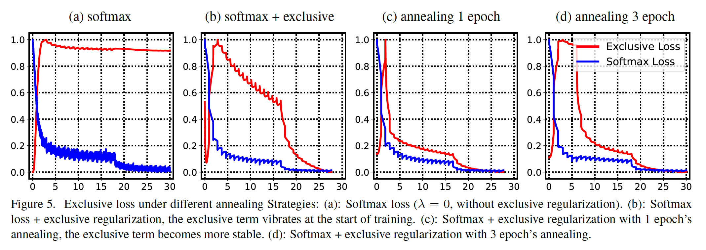

## RegularFace: Deep Face Recognition via Exclusive Regularization

### 摘要

​		我们考虑人脸识别任务，其中相同身份（人）的面部图像在表示空间中预期更近，而不同身份则相距较远。近期的一些研究通过开发损失函数来惩罚相同身份的表示的变化，从而鼓励了类内部的紧凑性。本文中，我们提出了“排他性正则化（exclusive regularization）”，其重点是可分辨性的另一个方面——类间可分离性，这在许多最近的方法中都被忽略。所提出的名为RegularFace的方法通过惩罚身份与其最近邻之间的角度来显式地隔离身份，从而产生可辨别的人脸表示。我们的方法有直观的几何解释，并提供了以前工作中所没有的独特优势。在几种开放基准测试上与先前方法的量化比较表明我们的方法的优越性。此外，我们的方法易于实现，在现代的深度学习框架中，仅需要几行python代码。

### 1. 引言

​		人脸识别是计算机视觉中广泛研究的主题之一，并且，最近，随着卷积神经网络（CNN）成为主力军，已经取得了显着的进步。通常，人脸识别中有两个子任务：1）人脸识别，即将给定人脸图像归属于已知身份，2）人脸验证，即确定一对人脸图像是否属于相同身份。人脸识别还有两种测试协议：open-set协议和closed-set协议。在open-set情况下，训练集中可能不存在测试身份。 在closed-set设置中，训练图像和测试图像来自相同的身份。open-set人脸识别更具挑战，并且更接近真实世界应用，因为收集所有身份的人脸进行训练是不可行的。

​		学习辨别性特征表示是准确的open-set人脸识别的关键被广泛接受。类内紧凑性和类间可分离性是特征辨别性的两个重要因素：期望属于相同身份的表示在表示空间更接近；同时，期望不同身份的表示被分散开。许多最近的工作都坚持设计新颖的损失函数来提高深度特征的类内紧凑性。Center Loss[28]通过插入额外的损失项来提高类内紧凑性，该损失项惩罚样本与其表示中心之间的欧式距离。然后，在SphereFace中，Liu等提出A-Softmax损失[14]，其利用角间隔来聚焦超球流行中的样本。这里，“Softmax loss”表示表示softmax归一化和交叉熵损失。与SphereFace相似，CosFace[27]和ArcFace[4]也将角间隔用于原始的softmax损失的决策边界，产生进一步的性能改进。这些方法通过在欧几里得空间（中心损失）或超球空间（SphereFace、CosFace、ArcFace）中收紧相同身份的表示，以关注内紧凑性。

​		本文中， 我们考虑辨别性的另一面：类间可分离性。除了缩短相同身份的表示之间距离的类内紧凑性外，另一方面，类间可分离性旨在使不同身份类的样本相互远离。具体而言，我们将称为_exclusive regularization_的正则项用于分类层的参数。正则化项显示扩大不同身份的参数化向量之间的夹角，产生“排他性（exclusive）”分类向量。因此，相反，这些正则化的分类向量将分散表示空间中不同身份的样本。我们的贡献总结如下：

- 第一，我们建议以身份中心之间的角距离来定量评估类间可分离性。
- 第二，我们提出一种新颖的_排他性正则化（exclusive regularization）_项，其显式扩大不同身份之间的距离。据我们所知，本文是第一个提出通过促进人脸识别的类间可分离性来增强特征辨别性。
- 第三，我们的方法与现有方法正交，因此可以无缝地插入到现有方法中，从而以更少的努力来提高性能。
- 最后，我们在LFW、YouTube Face（YTF）和MegaFace挑战上测试所提出的方法，并获得可喜的性能。

### 2. 相关工作

​		由于CNN的使用，人脸识别中已有显著的改进。基于使用中的损失函数，有两种主要类型的方法：无softmax损失方法和基于softmax损失的方法。

​		**Softmax-free methods**	在无softmax方法中，将人脸对馈入模型以训练具有逐对标注（例如一对人脸是否来自相同的身份）的特征嵌入。因为训练期间，身份标签不可见，模型不能利用分类损失（例如softmax损失）作为监督。Chopra等提出具有对比损失的Siamese网络[3]来学习对比表示。在Siamese网络中，两张人脸依次馈入两个相同的网络来获得它们对应的嵌入，并且当输入图像成对时，_对比损失_惩罚两个嵌入之间的距离。Hu等[7]设计一种辨别性的深度度量，其在正负人脸对之间添加间隔。Florian等提出_Triplet loss_，其一次接受三张图像作为输入，其中俩张图像成对（anchor和positive），另一个为异常（negative）。Triplet损失最小化成对图像之间的嵌入距离，同时最大化负样本和其他样本之间的距离。注意，_对比损失_和_三元损失_需要仔细设计对选择和过程[5、17]。

​		**基于softmax的方法**	基于Softmax的方法通常接受身份标签作为监督。因此，将分类损失（通常为softmax损失）作为监督。[24]通过在每个卷积层增加全连接层和损失函数来增加额外的损失项，从而增强了监督。最近，Wen等[28]提出中心损失来惩罚嵌入与其对应中心之间的欧式距离。然后，通过中心损失和softmax损失的联合监督来强调嵌入流行中的类内紧凑性。SphereFace[14]引入另一种softmax损失变体，_angular margin sofmtax loss_（A-Softmax）将角间隔引入原始softmax损失的决策边界。具体而言，SphereFace使用一个乘子来对原始的决策边界施加乘法间隔。另一种研究ArcFace[4]使用加法角间隔，其产生进一步的性能改进。CosFace中提出相似的思想，其在余弦流行中缩小决策间隔。

​		还有许多研究人员尝试将上述两种方法的原理结合起来。例如，[23]提出利用识别信号（softmax损失）和验证信号（triplet损失）来联合监督深度模型。

### 3. Observation and Motivation

​		我们的方法主要受center-loss[28]和SphereFace[14]的启发。我们从分析[28、12]开始，然后展示我们如何提出排他性正则化的动机。

#### 3.1. Softmax Loss and Variants

**Center-Loss**	它惩罚特征嵌入与其对应中心之间的欧式距离，目的是在表示空间中施加类内紧凑性。中心惩罚定义为

$$\mathcal{L}_{center} = \frac{1}{2} \sum_{i=1}^N \|x_i - c_{y_i}\|_2^2 , \tag{1}$$

其中$x_i \in \mathbb{R}^K$为样本$i$的特征嵌入，$c_{y_i}$为身份标签为$y_i(y_i\in \{1, \cdots, C\})$的样本的中心。

**Softmax Loss & Angular Softmax Loss**	我们从原始的softmax损失开始，然后引入其角变体。给定嵌入向量$x_i$，$x_i$属于身份$c$的后验概率为：

$$p_c(x_i) = \frac{e^{W_c^Tx_i + b_c}}{\sum_{j=1}^Ce^{W_j^Tx_i + b_j}}, \tag{2}$$

其中$W$为$K \times C$矩阵，并将$x$映射到后验概率，$b$为偏置项。$K$和$C$分别为特征嵌入的维度和身份数量。显然，我们有$\sum_{c=1}^C p_c = 1$。给定身份标签$y_i$，softmax损失为：

$$l(x_i, y_i) = -\sum_{c=1}^C 1(y_i = c) \cdot \log p_c(x_i).\tag{3}$$

$1(\cdot)$为指示函数，当条件为真实，该函数的值为1，否则为0。然后，我们将偏置项置为0，并归一化$W$的每列以推导角softmax损失，其中后验概率为：

$$p_c(x_i) = \frac{e^{\|x_i\|\cos(\phi_{i, c})}}{\sum_{j=1}^C e^{\|x_i\|\cos(\phi_{i,j})}}.\tag{4}$$

在式（4）中，$\phi_{i,j}$为特征嵌入$x_i$和权重向量$W_j$之间的夹角。角softmax损失的决策边界如图1（b）所示。显然，最小softmax损失等价于最小化$\phi_{i,y_i}$。因此，权重向量$W_j$可以视为具有$y_i = j$的所有$x_i$的聚类中心。

**A-Softmax Loss**	SphereFace[14]将角间隔引入式（4）的_angular softmax loss_的决策边界，以及在超球空间中压缩相同身份类的嵌入。后验概率$p_c$新颖地定义为：

$$p_c(x_i) = \frac{e^{\|x_i\|\cos(m \cdot \phi_{i,y_i})}}{e^{\|x_i\|\cos(m \cdot \phi_{i,y_i})} + \sum_{j\ne y_i}e^{\|x_i\| \cos(\phi_{i,h})}},\tag{5}$$

其中$m \in \mathbb{Z}_{+} = \{1,2,\cdots\}$为用于控制间隔的因子。当$m=1$时，式（5）变为式（4）。如图1（d）描述的，A-Softmax损失可以在超球流行中学习角度上紧凑的类内表示。

#### 3.2. 类间可分离性

​		类间可分离性和类内紧凑性是辨别性的两个关键因素。许多经典方法[5、23]同时考虑这两个因素。但是，当前基于softmax的人脸识别方法（诸如center loss[28]和SphereFace[14]）主要关心欧式流形（中心损失）或超球流形（SphereFace[14]）中的类内紧凑性。最近的基于softmax的人脸识别方法并未特别注意类间的可分离性。

​		最近的工作首先在微型数据集（即MNIST）上进行实验以在几何上证明学习到的表示的辨别性。通常，这些演示性实验将表示限制在低维空间（2D或3D）中，以简化可视化过程。在存在比表示维度相对冗余的聚类（身份）的情况下，聚类趋向于拉伸以减小分类误差。在[28]的演示性实验中，作者在MNIST上训练具有2D表示的模型。表示的聚类中心几乎是均匀分布的，并且在2D平面维持最大的聚类见距离（如[28]的图3所示）。

​		这些演示性实验部分地误导了我们，可能会错误地假设聚类中心（$W_j$）至少在某种程度上均匀地分布在表示空间中，因此聚类中心通常表现出较大的类间可分离性。一个值得注意的事实是，相对身份的数量，我们通常有更冗余的维度以保证更好的性能。例如，最近的工作[27、14、28]通常使用512维表示，并且利用10K身份训练模型。在这种情况下，聚类中心可能分布得不太好。

​		我们基于将表示映射到身份置信度的分类矩阵$W\in\mathbb{R}^{K \times C}$来定量评估类间可分离性。$W_i$是$W$的第$i$列，代表第$i$个身份类的权重向量。我们通过下式测量聚类中心的类间可分离性：

$$\begin{align}Sep_i &= \max_{j \ne i}\cos(\varphi_{i,j}) \\ &=\max_{j\ne i}\frac{W_i \cdot W_j}{\|W_i\|\cdot \|W_j\|}\end{align} \tag{6}$$

其中$\varphi_{i,j}$为$W_i$和$W_j$之间的夹角。理想上，期望聚类中心均匀分布，并且聚类中心相互远离（较小的$\cos$值）。换句话说，期望$mean(Seq)$和$std(Seq)$尽可能小。不同损失函数训练的模型的定量比较见表1。在CASIA-WebFace数据集上训练所有模型，并且使用ResNet20作为骨干架构。

#### 3.3. 排他性正则化的动机

​		表1中的统计量反映已有方法的聚类中心分布不好。因此，通过增强类间可分离性，有可能提高特征辨别性。

​		受“不同身份的聚类中心应该相互远离”这一想法的启发，我们提出了“排他性正则化”以显式迫使聚类中心$W_j$在训练过程中彼此远离。因此，正则化项将导致角度上分离的权重向量，并且表示也分离。

​		如式（4）指出，最小化角softmax损失等价于最小化表示与其对应聚类中心$W_j$之间的夹角。因此，角度上分离的权重向量$W_j$将推动不同身份的表示相互远离，其通过扩大“类间可分离性”来使表示更具辨别性，如图1（e）所示。

### 4. 排他性正则化

#### 4.1. 排他性正则化的公式

​		令$G_\theta(\cdot)$为模型除FC2外的所有层，其由$\theta$参数化。矩阵$W\in\mathbb{R}^{K \times C}$表示FC2的参数（图2中的FC2），其将表示映射到身份预测。给定输入图像$I_i$，通过下式获得它的特征表示$x_i$：

$$x_i = G_\theta(I_i). \tag{7}$$

根据式（4），角softmax损失为：

$$\mathcal{L}_s(\theta, W) = \frac{1}{N}\sum_{i=1}^N-\log\frac{e^{\|x_i\|_2\cos(\phi_{i,y_i})}}{\sum_j e^{\|x_i\|_2\cos(\phi_{i,j})}},\tag{8}$$

其中$y_i$为身份标签，$\phi_{i,y_i}$为特征嵌入$x_i$与分离向量$W_{y_i}$之间的夹角。

​		如上所述，身份类$j$的参数$W_j$可以视为具有$y_i=j$的所有$x_i$的_cluster center_。出于扩大不同身份之间的角距离的目的，我们直接引入_排他性正则化_，其扩大身份的聚类中心之间的夹角。遵循式（6），正则化项定义为：

$$\mathcal{L}_r(W) = \frac{1}{C}\sum_i \max_{j\ne i}\frac{W_i \cdot W_j}{\|W_i\| \cdot \|W_j\|}.\tag{9}$$

请哦吗利用角间隔和排他性正则化联合监督模型，整体损失函数为

$$\mathcal{L}(\theta, W) = \mathcal{L}_s(\theta, W) + \lambda\mathcal{L}_r(W), \tag{10}$$

其中$\lambda$为两个项之间的平衡因子。注意，可以用其他先进损失函数（例如A-Softmax loss或center loss）替换角softmax损失$\mathcal{L}_s$，以进行联合优化。

​		如3.2节所述，角softmax损失将样本表示$x_i$推向它们的聚类中心$W_{y_i}$。同时，_排他性正则化_项把不同的聚类中心$W_j$和$W_i$（$i \ne j$）推开。因此，利用**inter-class push force**和**intra-class pull force**的联合监督，模型学习辨别性表示，该表示特别强调类间可分离性。

#### 4.2. Optimize with Projected Gradient Descent

​		式（10）中优化的损失函数可以表示为：

$$(\theta^\ast, W^\ast) = \arg\min_{(\theta, W)}\mathcal{L}(\theta, W).\tag{11}$$

对于$\theta$，我们使用标准的随机梯度下降更新它：

$$\theta^{t+1} = \theta^{t} - \alpha\frac{\part \mathcal{L}_s(\theta^t, W)}{\part \theta^t},\tag{12}$$

其中$\alpha$为学习率。

​		如3.1节所述，$W$在超球面中被归一化，从而得出基于角度的损失。标准SGD迭代会推导超球面之外的$W$。因此，我们使用投影梯度下降[1]来更新$W$：

$$\begin{cases}\hat{W}^{(t+1)} = W^t - \alpha\frac{\part \mathcal{L}}{\part W^t} \\ W^{(t+1)} = Normalize(\hat{W}^{(t+1)}).\end{cases}\tag{13}$$

式（13）的第2步称为“projec step”，其将更新的参数映射回约束的最近邻边界。因为$W$被限制到超球面，我们简单地在$W$的列上进行$L2$归一化。

#### 4.3. The Gradient of Exclusive Regularization

​		令$W_j$为$W$的第$j$列，其被$|W_j|_2^2=1$约束。$\mathcal{L}_r$相对于$W_j$的梯度为：

$$\frac{\part \mathcal{L}_r(W)}{\part W_j} = W_{j'} + \sum_{W_i \in \mathbb{C}}W_i \tag{14}$$

其中$W_{j'}$为$W_j$的最近邻：

$$j' = \arg\max_{i \in \{i,\cdots, C\}, i\ne j} W_j \cdot W_i.$$

$\mathbb{C}$为最近邻为$W_j$的列的集合：

$$\forall W_i \in \mathbb{C}, \arg\max_{k \in \{1,\cdots, C\}, k \ne i}W_i \cdot W_k = j.$$

### 5. 实验

#### 5.1. 实现细节

​		这里，我们给出复现这个方法和性能的关键细节。

**网络设置**	越来越多的CNN架构设计研究[25、6、11]清楚地表明，更深的网络始终表现出更好的性能。在_SphereFace_中，作者测试不同深度（4、10、20、36和64）的5个残差网络。当网络更深时，性能始终得到提高。但是，更深的网络需要更多的GPU内存，并且计算成本高昂，因此需要更多的训练时间。为了在性能和时间效率之间取得平衡，我们基于ResNet20架构实现所提出的方法，[28、4]中也使用相同的架构。我们的网络（如图2所示）接受$112 \times 96$的RGB图像作为输入。在4个残差块（共计包含20个卷积层）后，输出特征的形状为$7 \times 6 \times 512$。然后，第一个全连接层（FC1）将特征图映射到512D向量，其用于在测试阶段计算相似性得分。训练期间，另一个全连接层（FC2）附加到FC1之后，从而进行分类。

**训练数据**	我们使用公开可用的CASIA-WebFace[30]和VGGFace2[2]数据集（在排除测试集中出现的身份的图像之后）来训练我们的CNN模型。CASIA-WebFace由属于10575个不同身份的494414张人脸图像，VGGFace2[2]有属于8631个身份的3.1M图像。两个数据集的一些示例图像见图3。如图3所示，WebFace数据集中存在低分辨率和侧脸图像。

**预处理**	人脸对齐是人脸识别常用的预处理操作。遵循这些先前的工作[26、22、24、28、14]，我们进行人脸对齐，其保证所有眼球位于图像中的相同位置。利用MTCNN检测人脸标志点，并且根据检测的标志点将图像裁剪为$112 \times 96$。如果检测到多张人脸，我们保留最接近图像中心的人脸，并丢弃所有其他人脸。如果没检测到人脸，如果该图像是训练样本，我们删除该图像；如果该图像是测试样本，那么进行中心裁剪。

**评估协议**	在三种常用的人脸识别基准上测试了该方法以及其他竞争对手的性能：LFW [9]、YTF [29]和MegaFace挑战[10]。我们从FC2的输出提取512维深度特征（图2）。对于所有实验，测试人脸的最终表示通过组合其原始人脸特征及其水平翻转特征获得。因此，每张人脸图像获得1024维向量。对于LFW和YTF数据集，我们计算两个特征之间的余弦距离以作为相似性得分，然后进行标准的10折交叉验证。将测试集等分维10折。10折中的9折用作验证集以调整最佳阈值，并在其他折上测试准确率。对于MegaFace数据集，我们使用官方的评估工具[10]。

**不同损失形式**	如4.1提到的，式（10）中的softmax损失$\mathcal{L}_s$可以被其他先进损失函数（如center loss[28]或angular margin softmax loss）替换。因此，将所提出的正则化项$\mathcal{L}_r$和其他损失函数组合以及学习类间可分离和类内紧凑表示是合理的。

​		在实验中，我们比较三种不同损失形式：Softmax Loss + $\mathcal{L}_r$ （RegularFace + SM）、Softmax Loss + Center Loss +$\mathcal{L}_r$（RegularFace + [28]）、Softmax Loss + angular margin + $\mathcal{L}_r$（RegularFace + [14]）。LFW、YTF数据集上的定量结果（表2）和MegaFace挑战上的结果（表3）反映所提出的_RegularFace_方法可以一致提高性能。

#### 5.2. MNIST上的演示实验

​		我们在MNIST数据集上进行实验以表明所提出方法的集合特点。如3.2节讨论，在真实人脸识别系统[15、14、8]中，与身份数量相比，表示维度是冗余的。为了使我们的情况类似于人脸识别，我们在MNIST数据集子集上训练LeNet，该子集仅包含3个数字，为了可视化的简单，将表示限制到2D空间。我们使用所提出的排他性正则化训练具有三种不同损失函数的LeNet：中心损失[28]、角间隔softmax损失[14]和softmax。然后，我们可视化所有测试样本的表示，见图4。

​		如图4（a）所示，当模型通过softmax损失进行训练时，表示会分成可分离的簇，并且不同数字类别的表示之间会有明显的间隔。通过惩罚表示与其类特定中心之间的欧式距离，_center loss_迫使相同类的表示更接近和紧凑（图4（b））。与在欧式流形中压缩表示的_center loss_不同，_angular margin softmax loss_通过将角间隔施加在决策边界上而在超球面流形中钳制了相同类别的表示（图4（c））。

​		中心损失和角间隔softmax损失尝试通过类内紧凑性改善模型的辨别性。而，另一方面，我们所提出的_exclusive regularization_方法通过扩大类间可分离性增强辨别性。如图4（d）所示，当利用排他性正则化训练模型时，不同类的表示倾向于角度上相互远离。

#### 5.3. LFW和YTF上的实验

​		

#### 5.4. MegaFace Challenge1 on FaceScrub

#### 5.5. 参数讨论

​		我们的方法仅带来的超参数为式（10）中的权重因子$\lambda$。给定更大的$\lambda$，排他性正则化在训练中起着更重要的作用。但是，如果$\lambda$变小，softmax损失将主导学习过程。我们利用不同的$\lambda$训练所提出的方法，并记录LFW的准确率以及聚合专有项和排他性损失项。

#### 5.6. 退火策略

​		为了进一步研究softmax损失和拍他性损失之间的交互，我们记录训练过程的训练损失。结果见图5。在图5（a）中，模型受softmax损失（$\lambda = 0$）的监督，在图5（b）中，$\lambda = 1$。

​		有趣的是，有趣的是，我们发现，在训练的一开始，softmax损失和排他性损失可能会相互“战斗”，如图5（b）所示，排他性损失的不稳定振动证明了这一点。它在一开始就迅速降低到局部最小值，然后反弹到较高水平。 此后，排他性损失稳定下降直至收敛。

​		为了稳定训练过程，使损失平滑减小，我们利用退火策略（也见[16、14]）以在训练开始时平衡两种竞争损失项。退火策略时一种“warm up”，其逐渐强化了训练开始时排他性正则化的重要性。

​		假设$\lambda$为排他性正则化的权重，$t$为时间步（epoch），$N$为退火的epoch数量。线性热启动排他性权重$\lambda^\ast$：

$$\lambda^\ast(t) = \begin{cases}\frac{t}{N}\cdot \lambda, &t \le N \\ \lambda, &\mbox{otherwise}.\end{cases}\tag{15}$$

