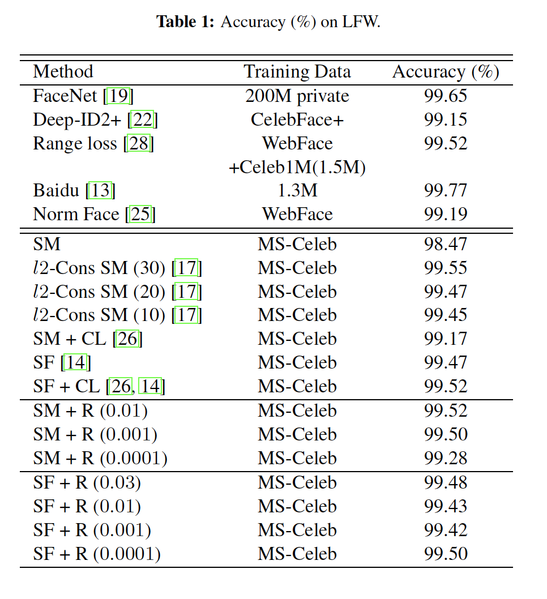

## Ring loss: Convex Feature Normalization for Face Recognition

### 摘要

​		我们提出并介绍了Ring Loss，这是一种用于深度网络的简单而优雅的特征归一化方法，旨在增强标准损失函数（如Softmax）。我们认为，深度特征归一化是有监督分类问题的重要方面，在这种情况下，我们需要模型在多类问题中很好地表示每个类。通过硬归一化操作进行特征归一化的直接方法产生非凸公式（non-convex formulation）。相反，RingLoss使用soft normalization，其中它渐近地学习约束范数以缩放单位元，同时维持产生更具鲁棒性特征的convexity。我们将RingLoss用于大尺度人脸识别问题，并提交LFW、IJB-A Janus挑战协议、Janus CS3（IJB-A Janus的超集）、Celebrity Frontal-Profile（CFP）和具有1M干扰项的MegaFace上的新结果。Ring Loss优于强基线，匹配IJB-A Janus上的最佳性能，并比Janus CS3上的所有其他结果好，因此获得SOTA。在处理极低分辨率的人脸匹配方面，我们也优于强基准。

### 1. 引言

​		在多种任务上，深度学习已表现出令人影响深刻的性能。可以说，最重要的任务是监督分类，它带来了许多进步。值得注意的是，使用更深的结构[21、23、7]和更强大的损失函数[6、19、26、24、15]导致了更强大的特征表示。通过批或权重的归一化获得更好的行为梯度也得到了更多关注[9、1、18]。

​		人脸识别是具有监督分类的深度网络最重要的实际应用之一。鲁棒的面部识别以大量类的形式提出了巨大的挑战，每个类的样本数量相对较少，难以进行明显的扰动变换训练。很好地理解此任务中的挑战，可以更好地理解监督分类和一般表示学习中的核心问题。但是，尽管过去几年人脸识别任务给予极大的关注，但在实现这种理解方面仍有许多差距。值得注意的是，特征归一化的需要和实践。最近发现特征归一化显著提高性能，从而隐式地产生余弦嵌入[17、25]。但是，在这些工作中探索的深度网络中的直接归一化导致了非凸公式化，从而导致损失函数本身生成了局部最小值。考虑到网络优化本身是非凸的，重要的是要保持损失函数的凸性，以便更有效地最小化损失。在另一项工作中，最近也探索了余弦相似度用于监督分类[16、4]。尽管如此，对于归一化特征本身的需求也缺乏具体的理由和原则上的动机。

​		**贡献** 本文中，我们提出Ring loss，一种简单而优雅的方法来通过原始损失函数（例如Softmax）的凸增强归一化所有样本特征。训练期间，也学习目标范数的值。因此，Ring loss中的仅有的超参数为与原始损失函数对应的损失权重。我们提供了一个分析论证，说明了特征归一化以及由此产生的余弦特征嵌入的好处。测试期间，人脸识别中的特征匹配通常通过余弦距离完成，从而在测试和训练协议之间产生了差距，而这些协议没有利用归一化。训练期间纳入Ring loss消除这种差距。Ring loss是可微的，其允许无缝地集成到使用基于梯度训练的深度架构中。与归一化中其他基线相比，Ring loss在其超参数较大的范围内提供一致的改进，事实上，与所提出的其他用于人脸识别的一般归一化相比，Ring loss也得到改善。有趣的是，我们还发现通过范数约束，Rong loss对更低分辨率也有帮助。

### 2. Ring loss: Convex Feature Normalization

#### 2.1. Intuition and Motivation

​		在softmax损失之前，最近，也有惯用语范数约束使用的研究。但是，所研究的公式在特征表示中是非凸的，从而导致优化困难。此外，需要更好的理解归一化自身的好处。Wang等[25]认为softmax特征的“radial”本质不是有用的特性，因此余弦相似性应当倾向于产生归一化特征。但是，没有提供具体原因。Ranjan等[17]证明Softmax损失将数据（图像）质量编码到范数，从而偏离了纯粹学习用于分类的良好表示的最终目标。因此，为了更好的分类，归一化迫使网络对这样的细节不变。当然，这还不是全部，实际上忽略了特征归一化的一些关键属性。 现在，我们用三个论点来激发“Ring loss”。1）我们证明范数约束对于维持多类角分类间隔之间的平衡有好处。2）它避免训练和测试度量之间的不相关。3）由于低范数特征，它们最小化由夹角变化引起的测试误差。

​		**夹角分类间隔不平衡**	考虑具有两个特征向量$x_1$和$x_2$的二分类任务，其中特征向量分别来自类1和类2，并使用同一模型（可能是深度网络）提取。令类1和类2的分类权重向量分别为$w_1$和$w_2$。在图2（a）中示出了示例布置。然后，一般而言，为了让类1的向量$w_1$选择$x_1$（而不是$x_2$）以进行正确分类，我们要求$w_1^T x_1 > w_1^Tx_2 \Rightarrow \|x_1\|_2 \cos\theta_1 > \|x_2\|_2\cos\theta_2$。这里，$\theta_1$和$\theta_2$分别为权重向量$w_1$（仅类1的向量）与$x_1$和$x_2$之间的夹角。我们称该不等式的可行集（feasible set）（范围为$\theta_1$）作为角分类间隔。注意，也有$\theta_2$的函数。设置$$\frac{\|x_2\|_2}{\|x_1\|_2}=r$$，我们观察到$r > 0$，对于正确分类，因为，对于$\theta \in [0, \pi]$，$\cos\theta$为$[-1,1]$之间的递减函数，所以$\cos\theta_1 > r \cos\theta_2 \Rightarrow \theta_1 < \cos^{-1}(r\cos\theta_2)$。对于任意$\theta_2$，不等式成立。固定$\cos\theta_2=\delta$，我们有$\theta_1 < \cos^{-1}(r\delta)$。根据$\cos^{-1}$的定义域约束，有$-1 \le r\delta \le 1 \Rightarrow \frac{-1}{\delta} \le r \le \frac{1}{\delta}$。将不等式与$r>0$结合，有$0 < r \le \frac{1}{|\delta|} \Rightarrow \|x\|_2 \le \frac{1}{\delta}\|x_1\|_2, \forall \delta \in (0, 1]$。就我们的目的而言，只看 $\delta > 0$的情况就足够了，因为$\delta<0$不会改变不等式$-1 \le \delta \le 1$，并且更有趣。

​		**角分类间隔的讨论**	我们在$\delta([0.1,1])$的范围和$r$的相应范围上绘制$\theta_1$的上限（即$\cos^{-1}(r\cos\theta_2)$），如图2（b）所示。考虑$\delta = 0.1$，其暗示样本$x_2$与$w_1$有较大的角距离（大约$85^\circ$）。这种情况通常是有利的，因为人们期望将$x_2$归为1类的可能性更低。但是，我们看出，随着$r$增加（$x_1$、$x_2$范数中的差异），$x_1$的分类间隔最终从$90^{\circ}$减小到$0^{\circ}$。换句话说，随着与$x_1$对应的$x_2$范数的增加，通过$w_1$将$x_1$正确分类同时拒绝$x_2$的角间隔递减。因此，范数（$r > 1$）之差在训练过程中将通过有效地对范数样本较小的类施加更小的角分类间隔，从而产生不利影响。如图1（a）所示，由于类范数的差异，这也导致了多个类的侧面分类间隔。这种影响仅随$\delta$的增加而放大（或者样本$x_2$更接近$w_1$）。图2（b）表明角分类间隔的减小远快于$\delta$的增加。但是，$r<1$导致更大的间隔，并且似乎对于分类类1好处（与$r > 1$相比）。有人可能会认为这表明$r <1$应该被实施以获得更好的性能。但是，请注意，相同的推理相应地适用于类别2，在该类中，我们希望将$x_2$归类为$w_2$，而拒绝$x_1$。这会在基于$r$的类1性能与类2性能之间做出折衷，这也直接扩展到多类问题。在诸如人脸识别的典型识别应用中，这是不可取的。理想情况下，我们希望能够很好地表示所有类。设置$r=1$，或者约束两个类的样本范数相同保证了这一点。

​		**MNIST特征范数上Softmax的影响**	我们量化观察普通Softmax在MNIST特征范数上的影响（以及分类间隔），如图1（a）。我们看出数字3、6和8较大的特征范数，这些特征通常是较难区分的类。因此，对于这三个“difficult”类（相对于其他“更容易”的类），我们观察到$r < 1$，从而给这三个类提供更大的角分类间隔。另一方面，数字1、9和7相对于其他类有相对$r>1$的更小范数，因为该模型可以作为折衷方案来降低这些“简单”类间隔。我们还观察到，可以说最容易区分的一类数字1具有最低的范数，从而具有最高的$r$。另一方面，图1（b）给出使用我们提出的Ring loss增强的Softmax所学习的特征，这迫使网络通过凸公式来学习特征归一化，从而减轻了角度分类边界的这种不平衡。

​		**利用范数约束正则化Softmax损失**	在余弦度量下进行系统测试的理想训练场景是，指向同一方向的所有特征都具有相同的损失。但是，对于大多数常用的损失函数（softmax及其变体（与softmax函数和交叉熵损失结合的FC层））来说，这不成立。假设权重被归一化，即$\|w_k\|=1$，特征向量$\mathcal{F}(\mathbf{x}_i)$的Softmax损失可以表示为（对于正确类$y_i$）：

$$\begin{align}L_{SM} &=-\log\frac{\exp w_k \mathcal{F}(\mathbf{x}_i)}{\sum_{k'=1}^K \exp w_{k'} \mathcal{F}(\mathbf{x}_i)}F \tag{1}\\&=-\log\frac{\exp\|\mathcal{F}(\mathbf{x}_i)\|\cos\theta_{ki}}{\sum_{k'=1}^K \exp \|\mathcal{F}(\mathbf{x}_i)\|\cos\theta_{k'i}}\tag{2}\end{align}$$

​		显然，尽管有相同的方向，不同范数的两个特征有不同损失。从这个角度出发，对损失进行正则化并消除归一化影响的直接解决方案是对在Softmax之前的特征进行归一化，如$l_2$约束的Softmax [17]中所探讨的。但是，这种方法实际上是一种投影方法，即它计算损失的方式就好像特征被归一化到相同的尺度，而实际的网络却没有学会归一化特征。

​		**特征空间中特征归一化的必要**	作为说明，请考虑图4中MNIST的通过原始Softmax训练的数字8的训练集和测试集特征。图4（a）给出训练结束时，特征表现良好，特征的范数变化较大，少数样本范数较低。但是，图4（b）表明测试样本的特征更加不稳定。范数中也有相似的变化，但是，现在，大多数低范数特征在_夹角_上有巨大变化。的确，与较高范数样本特征相比，较低范数特征的样本变化会导致更大的角度变化。这转化为在余弦度量下的分类中较高的错误（这在人脸识别中很常见）。这也是训练期间归一化特征的另一种动机。强制网络学习对特征进行归一化有助于减轻测试过程中的问题，在该测试中，网络学习在归一化的特征空间中工作。Ranjan等人[17]提出了一种有关特征归一化的动机，其中认为图像的低分辨率会导致低范数的特征，从而导致测试错误。他们将特征投影（而不是隐式学习）到缩放的单位超球面的解决方案也旨在解决低分辨率问题。我们发现，在我们的低分辨率图像的大规模试验中（间实验6图8），通过Ring loss的soft normalization获得更好的结果。实际上，在64倍采样因子下，受$l_2$约束的Softmax [17]的硬投影方法比Softmax表现差。

​		**将规范约束纳入凸问题。**确定需要从网络中标归一化样本特征后，我们现在提出问题。我们将$L_S$定义为主要损失函数（例如Softmax损失）。假设，$\mathcal{F}$提供样本$x$的深度特征作为$\mathcal{F}(x)$，我们想要最小化损失，使得归一化约束如下：

$$\min L_S(\mathcal{F}(x)) s.t. \|\mathcal{F}(x)\|_2=R\tag{3}$$

这里，$R$为尺度常量，其为我们想要归一化的特征。这是[17、25]最近研究和实施的精确公式。注意，这个问题在$\mathcal{F}(x)$为非凸的，因为由于范数相等性约束，可行解的集合本身是非凸的。在忽略该临界点的同时使用标准SGD的方法将无法为该问题提供可行解，因此，网络$\mathcal{F}$将不会学习输出归一化的特征。实际上，与我们的方法相比（图1（b）），使用这种直接方法获得的特征没有被归一化，如[17]中图3b的发现。解决这个问题的一种朴素方法是将范数等价约束放宽到不等价。现在，这个目标是凸的，但是它并不一定要强制执行相同的范数特征。为了纳入公式作为凸约束，如下所示，下面的公式直接有用。

#### 2.2. Ring loss

​		**Ring loss Definition**	Ring loss $L_R$定义为：

$$L_R = \frac{\lambda}{2m}\sum_{i=1}^m(\|\mathcal{F}(\mathbf{x}_i)\|_2 - R)^2 \tag{4}$$

其中$\mathcal{F}(\mathbf{x}_i)$为样本$\mathbf{x}_i$的深度网络特征。这里，$R$为目标范数值，其也是学习到的，$\lambda$为迫使主要损失函数之间平衡的损失权重。$m$为批量大小。当样本的范数离$R$太远时，范数之差的平方有助于网络采取更大的步骤，从而加快收敛速度。对应的梯度如下：

$$\begin{align}\frac{\part L_R}{\part R} &= -\frac{\lambda}{m}\sum_{i=1}^m(\|\mathcal{F}(\mathbf{x}_i)\|_2 - R) \tag{5}\\ \frac{\part L_R}{\part \mathcal{F}(\mathbf{x}_i)}&=\frac{\lambda}{m}\Big(1 - \frac{R}{\|\mathcal{F}(\mathbf{x}_i)\|_2}\Big)\mathcal{F}(\mathbf{x}_i)\tag{6}\end{align}$$

​		Ring loss （$L_R$）可以与诸如Softmax或large-margin Softmax[14]的任何其他损失一起使用。损失鼓励样本的范数为值$R$（学习到的参数），而不是显式通过硬归一化操作施加。该方法向更好的最小值提供了已知的梯度，这有助于网络满足归一化约束。因此，网络使用模型权重本身（而不需要如[17]的显示非凸归一化，或批归一化）学习归一化特征。相比之下，与此相关的是，批归一化[9]为特征中的每个元素独立地施加缩放后的正态分布。这并不限制该特征的整体范数在所有样本中均相等，也不能解决类不平衡问题。如图5所示，Ring损失未定所有类的特征范数，并且，相反，纠正了Softmax的分类不平衡问题，从而使整体效果更好。

​		**Ring loss Convergence Visualization**	为了展示施加soft-normalization增强的softmax损失的影响，我们进行一些分析模拟。我们在x、y轴上生成从$(-1.5,1.5)$点的2D网格。然后，我们以Dottef蓝色垂直线（参见图3）为目标类别，计算出Ring损失（$R = 1$）的梯度，并以20步的固定步长更新每个点。我们运行$\lambda = \{0,1,10\}$的模拟。注意，$\lambda=0$表示单纯的Softmax。图3描述这些模拟的结果。图3的子图（a）、（b）和（c）展示网格上的初始点（浅绿色）和最终更新点（红色）。对于单纯的Softmax（$\lambda=0$），我们看出更新增加样本的范数，此外它们没有收敛。对于合理的损失权重$\lambda=1$，Ring损失梯度可以帮助更新的点在相同的迭代次数中收敛得更快。对于$\lambda = 10$的重加权Ring损失，我们看出梯度迫使样本为单位范数，因为$R$被设置为1，同时压倒Softmax梯度。这些图表明，在Softmax损失$L_S$和归一化损失之间的$\lambda$存在折衷的关系。 我们在实验中观察到类似的权衡。

### 3. 实验验证

​		我们在大型人脸识别任务上对环丢失进行了基准测试，同时增加了两个损失函数。第一个损失函数为Softmax，第二个损失为Large-margin Softmax[15]的成功变体，称为SphereFace[14]。我们给出五个大规模基准测试（LFW、IAPRA Janus Benchmark IJB-A、Janus Challenge Set3（CS3）数据集（其为IJB-A Janus数据集的超集）、Celebrities Fontal-Profile（CFP）和MegaFace数据集）上的结果。我们还展示了Janus CS3的低分辨率图像上的Ring损失增强Softmax特征的结果，以展示低分辨率上鲁棒的人脸匹配。

​		**实现细节**	对于本文的所有实验，我们使用来自Liu等[14]的ResNet 64（Res6）层架构。对于Center损失，我们在线使用了代码存储库，并使用了报告的最佳超参数设置。通过在全连接层前集成归一化和缩放层实现[17]的$l_2$-约束的Softmax损失。对于L-Softmax和SphereFace的实验，我们使用Caffe实现。Resnet64产生512维特征（fc5层），其用于使用余弦距离匹配。Ring损失和Center损失都用于这个特征，即fc5层的输出。所有模型在MS-Celeb 1M数据集上训练。在训练之前，清理数据集以除去每个类以及噪声类中的潜在异常值。为了清洗数据集，我们使用预训练模型来从MS-Celeb 1M数据集上提取特征。然后，然将样本特征和该类别的均值特征之间MSE的变化超过特定阈值的类别丢弃。此后，从已过滤的类别中，丢弃其特征向量与类别平均特征向量之间的MSE误差高于阈值的图像。这一步骤之后，我们留下大约31000个身份和大约2.5M图像。学习率初始化为0.1，并在80K和150K迭代时除以10，并在165K迭代后终止训练。所有评估模型为165K迭代的模型。

​		**预处理**	使用[27]检测和对齐人脸，[27]提供两只眼睛、鼻子和嘴角（5个点）的标志点。因为MS-Celeb1M、IJB-A Janus和Janus CS3有更困难的人脸，所以我们使用鲁棒性的检测器（即CMS-RCNN[29]）来检测人脸，以及一个快速的landmarker来检测标志点。然后，使用相似性变换来对齐人脸，并将其裁剪为$112\times 96$（RGB格式）。像素通过减去127.5、除以128归一化。对于失败的检测，忽略训练集中的这类图像。在测试时，使用对应数据集的ground-truth标志点。

​		**Exp 1. Testing Benchmark：LFW**	LFW数据库包含大约1680个主体的大约13000张图像，总共6000个匹配。主要的变化时光照、姿态、颜色扰动和年龄。随着该领域的发展，由于该协议的规模小，LFW被认为是饱和的，并且在性能上（在精度的最后百分比中）容易出现虚假的微小差异。该协议在精度上的细微差异无法准确反映出高性能模型的泛化能力。

​		**Results：LFW**	表1展示了LFW协议的结果。

​		**Exp 2. Testing Benchmark：IJB-A Janus**	IJB-A包含具有极端姿态、表情和光照的500个主体的25813张图像。每个主体由一个模板描述，而不是单幅图像。这允许开发分数融合技术。该设置适用于具有多个图像/视频帧源的应用。我们报告了$1:1$模板匹配协议的结果，该协议包含10个拆分，其中约有12,000个成对模板匹配，每个匹配导致总共117,420个模板匹配。两个模板$T_i$、$T_j$的模板匹配得分使用如下公式计算：$S(T_i,T_j)=\sum_{\gamma=1}^K\frac{\sum_{t_a\in T_i,t_b\in T_j}s(t_a,t_b)\exp\gamma s(t_a,t_b)}{\sum_{t_a\in T_i,t_b\in T_j}\exp\gamma s(t_a,t_b)}$，其中$s(t_a,t_b)$为图像$t_a$、$t_b$之间的余弦相似性得分，$K=8$。

​		**Results：IJB-A Janus**	表3和图7（a）给出了这些结果。

​		**Exp 3. Testing Benchmark: Janus CS3**

​		**Exp 4. Testing Benchmark: MegaFace**

​		**Exp 5. Testing Benchmark: CFP Frontal vs. Profile**

​		结果见图6和表2。

​		**Exp 6. Low Resolution Experiments on Janus CS3**

​		