## SphereFace: Deep Hypersphere Embedding for Face Recognition

### 摘要

​		本文在开放集协议下处理深度人脸识别（face recognition：FR）问题，其中期望，在合适的度量空间中，理想的人脸特征的最大类内距离小于最小类间距离。但是，很少有算法能够高效地获得如此标准。为此，我们提出angular softmax（A-Softmax）来学习角辨别性特征。几何上，A-Softmax损失可以视为将辨别性约束注入到一个超球流形（hypersphere manifold），其本质上匹配人脸也位于流形的先验。此外，angular margin的大小可以通过参数$m$量化调整。我们进一步推导特定的$m$来近似理想的特征标准。在LFW、YTF和MegaFace Chanlleng上的大量分析和实验证明A-Softmax损失在FR任务中的优越性。

### 1. 引言

​		最近几年，已见证卷积神经网络（CNN）在人脸识别中的极大成功。归功于先进的网络架构和辨别性学习方法，深度CNN已将FR的性能提升到前无古人的水平。通常，人脸识别可以分为人脸识别（identification）和人脸验证。前者将人脸分类为一个特定的身份，而后者确定是否一对人脸属于相同身份。

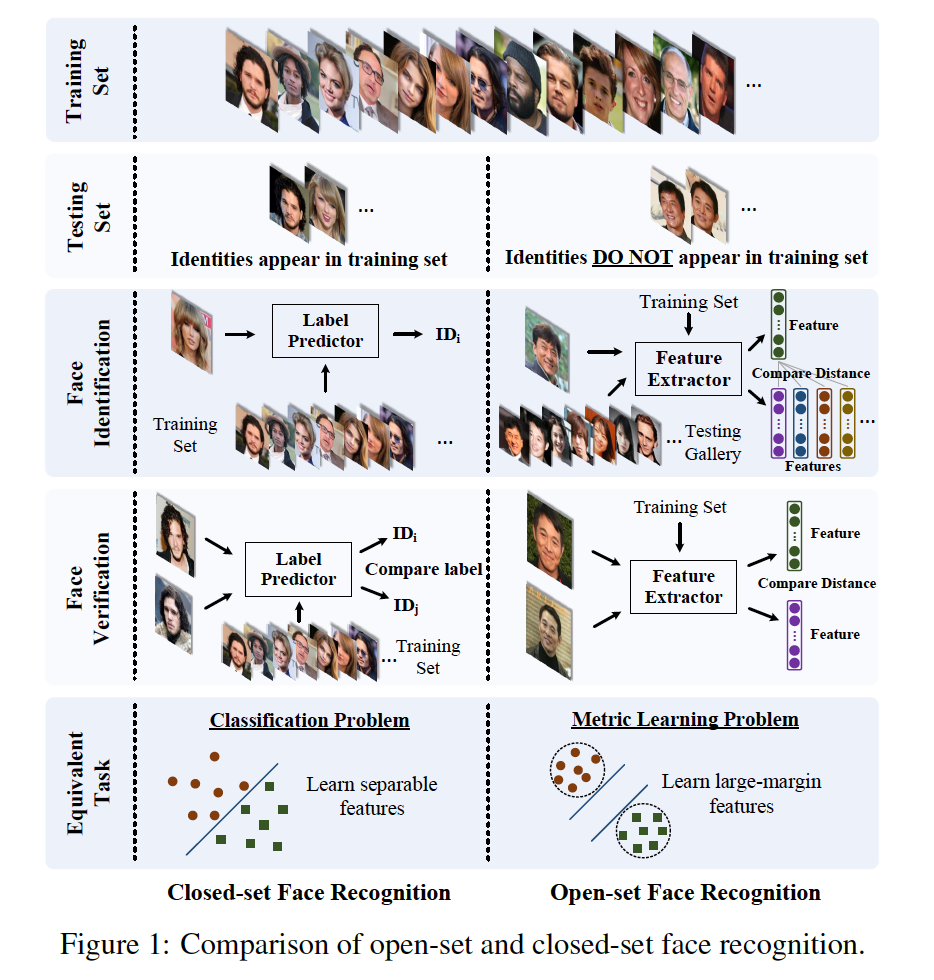

​		在测试协议中，人脸识别可以在封闭集（closed-set）或开放集（open-set）设置上得到评估，如图1所示。因此，封闭集的FR可以很好地处理为分类问题，其中期望特征可以分离。对于开放集协议，测试身份通常与训练集没有交集，其使FR更具挑战性，也更接近实践。由于将人脸分类为训练集中的已知人脸是不可能的，所以我们需要将人脸映射到辨别性的特征空间。在这种场景下，人脸识别可以视为进行probe人脸和图库中每个身份之间的人脸验证（见图1右）。开放集FR是关键的度量学习问题，其中关键是学习辨别性的大margin特征。

​		开放集FR期望的特征应当满足，在某个度量空间下，最大类内距离小于最小类间距离的标准。如果我们希望使用最近邻获得完美的性能，这种标准是必须的。但是，具有这种标准的学习特征通常是困难的，因为人脸表现出的类内变化和类间相似性本质上很大。

​		少有基于CNN的方法能够在损失函数中有效形式化上述标准。先驱工作[30、26]通过softmax损失学习人脸特征，但是softmax损失仅学习可分离的特征，该特征辨别性不足。为了处理这个问题，一些方法将softmax损失和对比损失[25、26]或中心损失结合已增强特征的辨别能力。[22]采用三元损失来监督嵌入学习，产生最佳的人脸识别结果。但是，中心损失仅显式地鼓励类内紧凑性。对比损失和三元损失都不能约束在每个个体样本中，因此需要仔细谁pair/triplet的挖掘过程，它们都是耗时和性能敏感的。

​		将欧式margin施加到学习到的特征看起来是一个普遍的识别选项，但是引起一个问题：_欧式间隔（margin）是否始终适合学习辨别性人脸特征？_为了回答这个问题，我们首先基于欧式间隔的损失是如何用于FR。

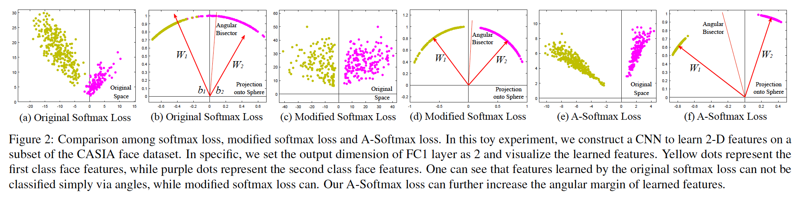

​		最近的方法[25、28、34]将基于欧式间隔的损失和softmax损失结合来构建一个联合监督。但是，如图2观察到的，softmax损失学习到的特征有固有的角度分布（[34]已验证）。在一些情况下，基于欧式间隔的损失与softmax损失不兼容，因此不能很好地启发以组合这两类损失。

​		本文中，我们提出处理角间隔（angular margin）。我们以二类情况开始分析softmax损失。softmax损失的决策边界为$(\mathbf{W}_1 - \mathbf{W}_2)\mathbf{x} +b_1 - b_2 = 0$，其中$\mathbf{W}_i$和$b_i$分别为softmax损失中权重和偏置。如果我们将$\mathbf{x}$定义为一个特征向量，约束$\|\mathbf{W}_1\| =\|\mathbf{W}_2\|=1$以及$b_1=b_2=0$，决策边界变为$\|\mathbf{x}\|(\cos(\theta_1)-\cos(\theta_2))=0$，其中$\theta_i$为$\mathbf{W}_i$和$\mathbf{x}_i$之间的夹角。新的决策边界仅依赖$\theta_1$和$\theta_2$。修改后的softmax损失能够直接优化夹角，确保CNN学习角分布特征（图2）。

​		与原始的softmax损失相比，由修改的softmax损失学习到的特征为角分布，但是不一定更具辨别性。为此，我们将修改的softmax损失推广到angular softmax（A-Softmax）损失。具体而言，我们引入整数$m(m\ge1)$来量化控制决策边界。在二类情况下，类1和类2的决策边界分别变为$\|\mathbf{x}\|(\cos(m\theta_1)-\cos(tehta_2))=0$和$\|\mathbf{x}\|(\cos(\theta_1) - \cos(m\theta_2))=0$。$m$量化控制角间隔的大小。此外，A-Softmax损失可以轻松地推广到多类，与softmax损失相似。通过优化A-Softmax损失，决策区域变得更分离，同时扩大类间间隔，并压缩类内角分布。

​		A-Softmax损失有清晰的几何解释。通过A-Softmax损失监督，学习到的特征构建辨别性角距离度量，其等价于超球流形中的测地线（geodesic）距离。A-Softmax损失可以解释为约束学习到的特征以在超球流形中被辨别，其本质上匹配人脸图像位于流形的先验。A-Softmax损失和超球流形之间的紧密联系使学习到的特征对于人脸识别更有效。为此，我们称学习到的特征为SphereFace。

​		此外，A-Softmax损失可以通过参数$m$量化调整角间隔，保证我们进行量化分析。据此，我们为参数$m$推导更低的边界以近似期望的开放集FR标准，该标准最大的类内距离应当小于最小的类间距离。

​		我们的主要贡献总结如下：

​		（1）我们为CNN提出A-Softmax损失来学习具有清晰和新颖几何解释的辨别性人脸特征。学习到的特征辨别性地跨越超球流形，其本质上匹配人脸也位于流形的先验。

​		（2）我们为$m$推导更低的边界，使得A-Softmax损失可以近似最小类间距离大于最大类内距离的学习任务。

​		（3）我们的工作首次在FR中证明角间隔有效。在公开可用的CASIA数据集上训练，SphereFace在几项基准测试上获得竞争性结果，包括LFW、YTF和MegaFace Challenge 1。

### 2. 相关工作

​		**度量学习**	度量学习旨在学习相似性（距离）函数。传统度量学习[36、33、12、38]通常根据给定的特征$\mathbf{x}_1,\mathbf{x}_2$学习距离度量$\|\mathbf{x}_1 - \mathbf{x}_2\|=\sqrt{(\mathbf{x}_1-\mathbf{x}_2)^T\mathbf{A}(\mathbf{x}_1 - \mathbf{x}_2)}$的矩阵$\mathbf{A}$。最近，先前的深度度量学习[7、17、24、30、25、22、34]通常使用神经网络来自动学习辨别性特征$\mathbf{x}_1,\mathbf{x}_2$，接着是简单的距离度量，例如欧式距离$\|\mathbf{x}_1-\mathbf{x}_2\|_2$。大多数广泛用于深度度量学习的损失函数为对比损失[1、3]和三元损失[32、22、6]，并且二者都对特征施加欧式间隔。

​		**深度人脸识别**	深度人脸识别可以说是过去几年来最活跃的研究领域之一。[30、26]使用受softmax损失监督的CNN处理开放集上的FR，其实际上将开放集FR视为多类分类问题。[25]结合对比损失和softmax损失以联合监督CNN训练，极大地提升性能。通过在将近200M人脸图像上训练，它们获得当前最佳的FR准确率。受线性判别分析的启发，[34]提出用于CNN的中心损失，也获得很好的性能。一般而言，当前表现良好的用于FR的CNN大多构建在对比损失或三元损失之上。可以注意到，最佳的FR方法通常采用度量学习的思想（例如对比损失、三元损失），证明开放集FR可以通过辨别性度量学习得到很好地处理。

​		L-Softmax损失[16]也隐式地涉及夹角的概念。作为一种正则化方法，它在封闭集分类问题上展现出极大的改进。不同的是，A-Softmax损失被开发来学习辨别性人脸嵌入。实验证明，与超球面流形的显式连接使我们学到的特征特别适合于开放式FR问题。此外，在A-Softmax中显式施加角间隔，并且可以量化控制（例如估计期望特征标准的下界），而[16]仅进行了量化分析。

### 3. Deep Hypersphere Embedding

#### 3.1. 回顾Softmax损失

​		我们通过研究softmax损失的决策标准来重新审视softmax损失。在二类情况下，通过softmax损失获得后验概率：

$$\begin{align}p_1 &= \frac{\exp(\mathbf{W}_1^T\mathbf{x} + b_1)}{\exp(\mathbf{W}_1^T\mathbf{x} + b_1) + \exp(\mathbf{W}_2^T\mathbf{x}+b_2)}\tag{1}\\p_2&=\frac{\exp(\mathbf{W}_2^T\mathbf{x} + b_2)}{\exp(\mathbf{W}_1^T\mathbf{x}+b_1) + \exp(\mathbf{W}_2^T\mathbf{x}+b_2)}\tag{2}\end{align}$$

其中$\mathbf{x}$为学习到的特征向量。$\mathbf{W}_i$和$b_i$为最后的全连接层中与类$i$对应的权重和偏置。如果$p_1>p_2$，预测的标签被分配为类1，如果$p_1 < p_2$，则分配为类2。通过比较$p_1$和$p_2$，显然，$\mathbf{W}^T_1\mathbf{x} + b_1$和$\mathbf{W}^T_2\mathbf{x} + b_2$确定了分类结果。决策边界为$(\mathbf{W}_1 -\mathbf{W}_2)\mathbf{x} + b_1 - b_2 = 0$。那么，我们将$\mathbf{W}_i^T\mathbf{x} + b_i$重写为$\|\mathbf{W}_i^T\|\|\mathbf{x}\|\cos(\theta_i) + b_i$，其中$\theta_i$为$\mathbf{W}_i$和$\mathbf{x}$之间的夹角。注意，如果我们归一化权重，并将偏置设为0（即$\|\mathbf{W}_i\|=1, b_i=0$），那么后验概率变为$p_1 = \|\mathbf{x}\|\cos(\theta_1)$和$p_2=\|\mathbf{x}\|\cos(\theta_2)$。注意，$p_1$和$p_2$有相同的$\mathbf{x}$，最终结果仅依赖角$\theta_1$和$\theta_2$。决策边界也变为$\cos(\theta_1)-\cos(\theta_2)=0$（即向量$\mathbf{W}_1$和$\mathbf{W}_2$的角平分向量）。尽管上述分析基于二类情况，将其推广到多类情况是微不足道的。训练期间，修改的softmax损失（$\|\mathbf{W}_i\|=1,b_i=0$）鼓励第$i$个类的特征比其他类有更小的夹角$\theta_i$（更大的余弦距离），其使$\mathbf{W}_i$和特征之间的夹角为分类的可信赖度量。

​		为了给出修正后的softmax损失的正式表达式，我们首先定义输入特征$\mathbf{x}_i$及其标签$y_i$。原始的softmax损失可以写为：

$$L = \frac{1}{N}\sum_iL_i=\frac{1}{N}\sum_i - \log\big(\frac{e^{f_{y_i}}}{\sum_j e^{f_j}}\big)\tag{3}$$

其中$f_j$表示类得分向量$\mathbf{f}$的第$j$个元素（$j \in [1, K]$，$K$为类数量），$N$为训练样本的数量。在CNN中，$\mathbf{f}$通常为全连接层$\mathbf{W}$的输出，因此$f_j = \mathbf{W}_j^T\mathbf{x}_i + b_j$和$f_{y_i} = \mathbf{W}_{y_i}^T + b_{y_i}$，其中$\mathbf{x}_i$、$\mathbf{W}_j$、$\mathbf{W}_{y_i}$分别为第$i$个训练样本、$\mathbf{W}$的第$j$和$y_i$列。我们进一步公式化式（3）中的$L_i$为：

$$\begin{align}L_i &=-\log(\frac{e^{\mathbf{W}_{y_i}^T\mathbf{x}_i +b_{y_i}}}{\sum_j e^{\mathbf{W}_j^T\mathbf{x}_i + b_j}})\\&=-\log(\frac{e^{\|\mathbf{W}_{y_i}\|\|\mathbf{x}_i\|\cos(\theta_{y_i,i}) +b_{y_i}}}{\sum_j e^{\|\mathbf{W}_j\|\|\mathbf{x}_i\|\cos(\theta_{j,i}) +b_j}})\end{align}\tag{4}$$

其中$\theta_{j,i}(0 \le \theta_{j,i}\le\pi)$为向量$\mathbf{W}_j$和$\mathbf{x}_i$之间的夹角。如上分析，我们首先在每次迭代中归一化$\|\mathbf{W}_j\|=1, \forall j$，并将偏置归零。那么，我们有修改后的softmax损失：

$$L_{\mbox{modified}}=\frac{1}{N}\sum_i-\log(\frac{e^{\|\mathbf{x}_i\|\cos(\theta_{y_i,i})}}{\sum_je^{\|\mathbf{x}_i\|\cos(\theta_j,i)}})\tag{5}$$

尽管我们可以利用修改的softmax损失学习具有角边界的特征，但是这些特征仍没有必要的辨别性。因为我们使用角作为距离度量，所以它自然地将角间隔纳入学习到的特征以增强辨别能力。为此，我们提出结合角间隔的新颖方式。

#### 3.2. Introducing Angular Margin to Softmax Loss

​		我们提出一种更自然的方式来学习角间隔，而不是设计新的损失函数以及与softmax损失的加权组合。根据上述softmax损失的分析，我们学习可以极大影响特征分布的决策边界，所以我们的基本思想是操作决策边界以产生角间隔。我们首先给出一个激励性的二类示例来说明我们的想法如何工作。

​		假设给定类1学习到的特征$\mathbf{x}$以及$\mathbf{x}$与$\mathbf{W}_i$之间的夹角$\theta_i$，已知修改的softmax损失要求$\cos(\theta_1) > \cos(\theta_2)$以正确地分类$\mathbf{x}$。但是，如果我们要求$\cos(m\theta_1)>\cos(\theta_2)$（$m\ge2$为正整数）以正确分类$\mathbf{x}$？从本质上讲，它使该决策比先前的更直接，因为我们要求$\cos(\theta_1)$的下界比$\cos(\theta_2)$高。类1的决策边界为$\cos(m\theta_1)=\cos(\theta_2)$。相似地，如果我们要求$\cos(m\theta_2)<\cos(\theta_1)$以正确分类类2的特征，类2的决策边界为$\cos(m\theta_2)=\cos(\theta_1)$。假设所有训练样本都被正确分类，如此的决策边界将产生$\frac{m-1}{m+1}\theta_2^1$的角间隔，其中$\theta_2^1$为$\mathbf{W}_1$和$\mathbf{W}_2$之间的夹角。根据夹角的观点，正确分类身份1的$\mathbf{x}$要求$\theta_1 < \frac{\theta_2}{m}$，而正确分类身份2的$\mathbf{x}$要求$\theta_2 < \frac{\theta_1}{m}$。二者都比原始的$\theta_1 < \theta_2$和$\theta_2 < \theta_1$困难。通过直接将这种思想公式化为修改的softmax损失式（5），我们有：

$$L_{\mbox{ang}} = \frac{1}{N}\sum_i -\log(\frac{e^{\|\mathbf{x}_i\|\cos(m\theta_{y_i},i)}}{e^{\|\mathbf{x}_i\|\cos(m\theta_{y_i},i)}+\sum_{j\ne y_ie^{\|\mathbf{x}_i\|\cos(\theta_j,i)}}})\tag{6}$$

其中$\theta_{y_i,i}$在$[0,\frac{\pi}{m}]$之内。为了摆脱此限制并使其在CNN中可优化，我们通过将$\cos(y_i, i)$的定义范围泛化为单调递减的角度函数$\psi(y_i,i)$来扩大它的定义范围，在$[0, \frac{\pi}{m}]$中该函数应等于$\cos(\theta_{y_i},i)$。因此，我们提出的A-Softmax损失公式化为：

$$L_{\mbox{ang}} = \frac{1}{N}\sum_i -\log(\frac{e^{\|\mathbf{x}_i\|\psi(\theta_{y_i},i)}}{e^{\|\mathbf{x}_i\|\psi(\theta_{y_i},i)}+\sum_{j\ne y_ie^{\|\mathbf{x}_i\|\cos(\theta_j,i)}}})\tag{6}$$

其中我们定义$\psi(\theta_{y_i},i)=(-1)^k\cos(m\theta_{y_i},i)-2k$，$\theta_{y_i,i}\in[\frac{k\pi}{m},\frac{(k+1)\pi}{m}]$和$k \in [0, m-1]$。$m\ge1$为整数，其控制角间隔的大小。当$m=1$时，它变为修改的softmax损失。

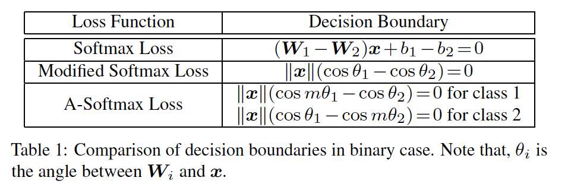

​		A-Softmax损失的理由也可以从决策边界的角度进行。A-Softmax损失为不同的类使用不同的决策边界（每个边界都比原始的更直接），因此产生角间隔。决策边界的比较在表1中给出。从原始的softmax损失到修改的softmax损失，它变为从优化内积到优化夹角。从修改的softmax损失到A-Softmax损失，它使决策边界更加直接和分离。角间隔随更大的$m$增长，如果$m=1$，则角间隔变为0。

​		受A-Softmax损失的监督，CNN学习具有几何上可解释的角间隔的人脸特征。因为A-Softmax损失要求$\mathbf{W}_i=1,b_i=0$，它使预测仅依赖样本$\mathbf{x}$和$\mathbf{W}_i$之间的夹角。所以$\mathbf{x}$可以被分类为具有最小夹角的身份。为了学习不同身份之间的角间隔而添加参数$m$。

​		为了促进梯度计算和反向传播，我们利用仅包含$\mathbf{W}$和$\mathbf{x}_i$的表达式替换$\cos(\theta_{j,i})$和$\cos(m\theta_{y_i,i})$，这很容易通过定义余弦和多角度公式来完成（也是为什么我们需要$m$为整数）。没有$\theta$，我们可以计算相对$\mathbf{x}$和$\mathbf{W}$的梯度，与softmax损失相似。

#### 3.3. Hypersphere Interpretation of A-Softmax Loss

​		当$m > 2$时，A-Softmax损失对正确分类的要求更高，这会在不同类别的学习特征之间产生角度分类间隔。A-Softmax损失不仅通过角间隔将辨别能力施加到学习的特征，还提供了新颖的超球面解释。如图3所示，A-Softmax损失等价于在超球面流形中学习具有辨别性的特征，而欧式间隔损失在欧式空间学习特征。

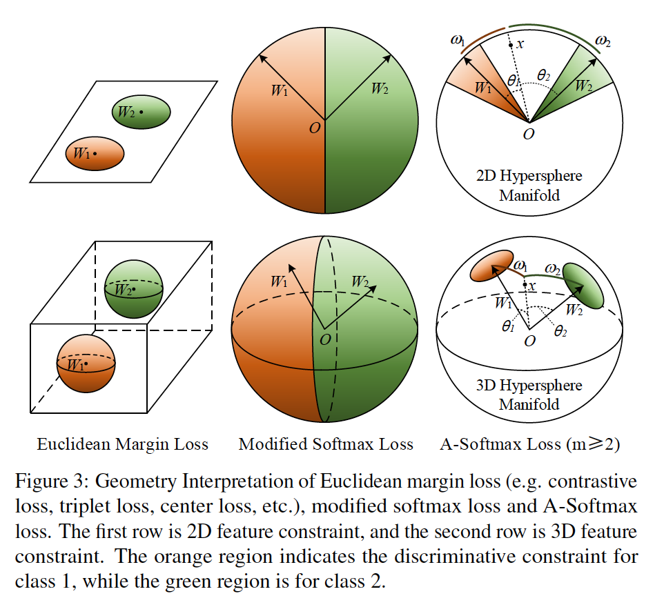

​		为了简化，我们利用二分类情况来分析超球面解释。考虑来自类1的样本$\mathbf{x}$和两列权重$\mathbf{W}_1$、$\mathbf{W}_2$，A-Softmax损失的分类规则为$\cos(m\theta_1)>\cos(\theta_2)$，等价$m\theta_1<\theta_2$。注意，$\theta_1$、$\theta_2$等于它们在单位超球面$\{v_j, \forall j|\sum_j v_j^2=1,v\ge0\}$对应的arc长度$\omega_1$、$\omega_2$。因为$\|\mathbf{W}\|_1=\|\mathbf{W}_2\|=1$，决策依赖arc长度$\omega_1$和$\omega_2$。据测边界等价于$m\omega_1=\omega_2$，并且正确将$\mathbf{x}$分类为1的约束区域为$m\omega_1 < \omega_2$。几何上讲，这是一个位于超球面流形上的超圆状区域。例如，在3D情况下，它是单位球面的一个类圆形区域，如图3所示。注意，对于每个类，更大的$m$导致更小的类超圆区域，其为流形上的显式辨别性约束。为了更好理解，图3提供2D和3D可视化。可以看出，在2D情况下，A-Softmax损失在在单位圆上施加arc长度约束。我们的分析表明优化具有A-Softmax损失的角本质上使学习到的特征在超球面更具辨别性。

#### 3.4. Properties of A-Softmax Loss

**Property 1.**	_A-Softmax损失定义具有可调整难度的大型角间隔学习任务。随着$m$的增大，角间隔变得更大，流形上的约束区域变得更小，并且相应的学习任务也变得更难。_

​		我们知道，$m$越大，角间隔A-Softmax损失约束就越大。存在一个最小的$m$，它将最大的类内角距离限制为小于最小的类间角距离，这也可以在我们的实验中观察到。

**Definition 1**	（期望特征分布的最小$m$）。$m_{\mbox{min}}$为使得当$m>m_{\mbox{min}}$的最小值，A-Softmax损失定义一个学校任务，其中被约束的最大类内角特征距离小于最小类间角特征距离。

**Property 2**	（二类情况下$m_{\mbox{min}}$的下界）。在二类情况下，我们有$m_{\mbox{min}}\ge 2+\sqrt{3}$。

_Proof：_ 我们考虑$\mathbf{W}_1$和$\mathbf{W}_2$跨越的空间。因为$m\ge2$，容易获得类1跨越的最大角为$\frac{\theta_{12}}{m-1} + \frac{\theta_{12}}{m+1}$，其中$\theta_{12}$为$\mathbf{W}_1$和$\mathbf{W}_2$之间的夹角。为了要求最大类内特征角距离小于最小类间特征角距离，我们需要约束：

$$\underbrace{\frac{\theta_{12}}{m-1} + \frac{\theta_{12}}{m+1}}_{\mbox{max intra-class angle}} \le \underbrace{\frac{(m-1)\theta_{12}}{m+1}}_{\mbox{min inter-class angle}}, \theta_{12} \le \frac{m-1}{m}\pi\tag{8}$$

$$\underbrace{\frac{2\pi - \theta_{12}}{m+1} + \frac{\theta_{12}}{m+1}}_{\mbox{max intra-class angle}} \le \underbrace{\frac{(m-1)\theta_{12}}{m+1}}_{\mbox{min inter-class angle}}, \theta_{12} > \frac{m-1}{m}\pi\tag{9}$$

​		解这两个不等式之后，我们有$m_{\mbox{min}}\ge 2 + \sqrt{3}$，其为二类情况下的下界。

**Property 3**	（二类情况下$m_{\mbox{min}}$的下界）。在$\mathbf{W}_i,\forall i$为欧式空间均匀分布的假设下，我们有$m_{\mbox{min}} \ge 3$。

_Proof：_ 我们考虑下界的2D $k$类（$k\ge3$）的场景。因为$\mathbf{W}_i,\forall i$为2D欧式空间的均匀分布，我们有$\theta_i^{i+1}=\frac{2\pi}{k}$，其中$\theta_i^{i+1}$为$\mathbf{W}_i$和$\mathbf{W}_{i+1}$之间的夹角。因为$\mathbf{W}_i,\forall i$是对称的，我们仅需要分析它们之一。对于第$i$个类（$\mathbf{W}_i$），我们需要约束：

$$\underbrace{\frac{\theta_i^{i+1}}{m+1} + \frac{\theta_{i-1}^i}{m+1}}_{\mbox{max intra-class angle}} \le \underbrace{\min\Big\{\frac{(m-1)\theta_i^{i+1}}{m+1}, \frac{(m-1)\theta_{i-1}^i}{m+1}\Big\}}_{\mbox{min inter-class angle}}\tag{10}$$

在解这个不等式之后，我们获得$m_{\mbox{min}}\ge3$，其为多类情况的下界。

​		基于此，我们使用$m=4$来估计期望的特征分布标准。因为下界不需要一定紧凑，所以更紧凑的下界和商界在某个条件下也是可能的，其我们留作未来的工作。实验也证明更大的$m$一致上表现更好，而$m=4$也通常足够。

#### 3.5. 讨论

​		**为什么是角间隔？**首先，也是最重要的一点，角间隔与流形上的辨别性直接相关，其本质上匹配人脸也位于流形的先验。其次，将角间隔纳入softmax损失实际上是更自然的选择。如图2所示，原始softmax损失学习到的特征有天生的角分布。所以，直接将欧式间隔约束与softmax损失组合是不合理的。

​		**与已有损失的比较？**在深度FR任务中，最流行和表现最好的损失函数包括对比损失、三元损失和中心损失。首先，它们仅将欧式间隔施加到学习到的特征（而没有归一化），而我们的损失直接考虑自然产生角间隔。其次，当从训练集中构成对/三元组是，对比损失和三元损失遭遇数据爆炸的问题，而我们的方法没有要求样本挖掘，并将辨别性约束施加到整个mini-batch（与仅影响少量对/三元的对比和三元损失相比）。

### 4. 实验（更多见附录）

#### 4.1. 实验设置

​		**预处理**	我们仅使用标准预处理。由MTCNN[39]检测所有图像中的人脸标志点。通过相似性变换获得裁剪的图像。RGB中的每个像素（$[0,255]$）通过减去127.5，然后除以128归一化。

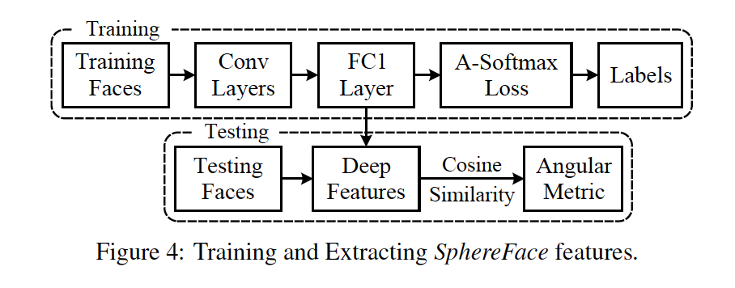

​		**CNN的设置**	使用Caffe[10]实现A-Softmax损失和CNN。使用常用框架来训练和提取_SphereFace_特征，如图4所示。我们在CNN架构中使用残差单元[4]。为了公平性，所有比较的方法使用与_SphereFace_相同的CNN架构（包括残差单元）。不同深度（4、10、20、36、64）的CNN用于更好的评估我们的方法。我们使用的不同CNN的特定设置见表2。根据3.4节的分析，除非特别提到，A-Softmax损失中的$m$通常设置为4。利用128的batchsize训练在4张GPU上训练这些模型。学习率从0.1开始，在16K、24K次迭代时除以10。在28K迭代时，结束训练。

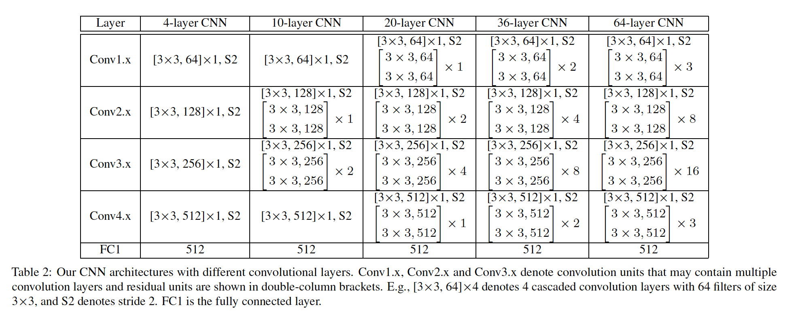

​		**训练数据**	我们使用公开可用的网络收集数据集CASIA-WebFace（在排除测试集中出现的身份之后）来训练我们的CNN模型。CASIA-WebFace有494414张人脸图像，它们属于10575个不同的个体。这些人脸图像被水平翻转以进行数据增强。值得注意的是，我们的训练数据的规模（0.49M）相对较小，特别是与DeepFace（4M）、VGGFace[20]（2M）和FaceNet[22]（200M）中使用的私有数据集相比。

​		**测试**	我们从FC1层的输出提取深度特征（SphereFace）。对于所有实验，测试人脸的最终表示通过拼接其原始人脸特征和水平翻转特征而获得。通过两个特征的余弦距离计算得分（度量）。最近邻分类器和阈值化分别用于人脸识别和验证。

#### 4.2. 探索实验

​		**$m$的影响**	为了证明更大的$m$产生更大的角间隔（即流形上更具辨别性的特征分布），我们进行不同$m$的toy示例。我们在CASIA-WebFace中与6个样本最多的人一起训练A-Softmax损失。我们将输出特征的维度（FC1）设置为4，并在图5中可视化训练样本。人们可以观察到，如期望的，更大的$m$导致超球面上更具辨别性的分布，并且也有更大的角间隔。我们也使用类1（蓝色）和类2（黑绿色）来构建正负对来评估相同类和不同类特征的角分布。正负对的角分布（图5的第二行）量化表明，随着$m$的增加，角间隔变得越来越小，并且每个类之间也变得更独特。

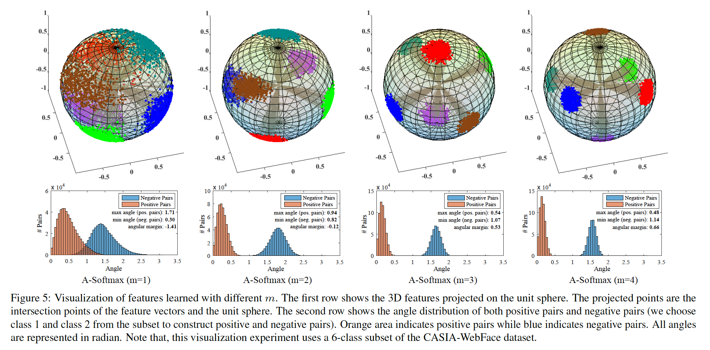

​		除了可视化比较，我们还在LFW和YTF上进行人脸识别以评估$m$的影响。为了公平比较，对于所有损失，我们使用64层CNN（表2）。结果见表3。可以观察到，随着$m$的变大，A-Softmax损失的准确率也变得更好，其表明更大的角间隔可以带来更强的辨别能力。

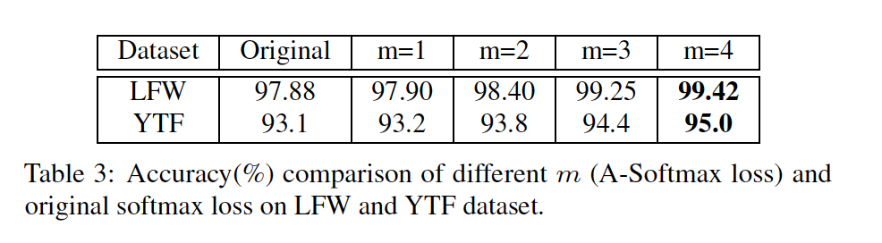

​		**CNN架构的影响**	我们利用不同的卷积层数训练A-Softmax损失（$m=3$）和原始的softmax损失。特定的CNN架构见表2。根据图6，可以观察到A-Softmax损失始终优于具有Softmax损失的CNN（1.54％ vs. 1.91％），这表明A-Softmax损失更适合于开放式FR。此外，A-Softmax损失定义的不同学习任务充分利用更深架构的更优越的学习能力。A-Softmax损失将LFW上的验证准确率从98.20%提高到99.42%，将YTF上的验证准确率从93.4%提高95.0%。相反，更深的标准CNN的改进不能令人满意，并且也容易饱和（在LFW上从96.60%提高到97.75%，YTF上从91.1%提高到93.1%）。

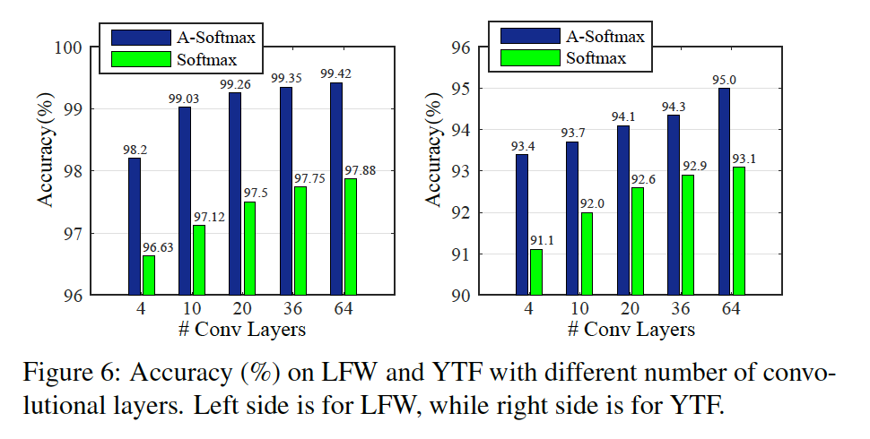

#### 4.3. LFW和YTF上的实验

​		LFW数据集包含13233张人脸图像，其来自5749个不同的身份，YTF数据集包含3434个视频，这些视频来自1595个不同的个体。两个数据集在姿态、表情和光照上都有较大的变化。在6000个LFW人脸对和YTF的5000个视频对上评估_SphereFace_的性能。结果见表4。对于对比损失和中心损失，我们遵循FR的约定以形成具有softmax损失的加权和。通过训练集上的交叉验证选择权重。对于L-Softmax[6]，我们也使用$m=4$。所有比较的损失函数都有64层CNN架构。

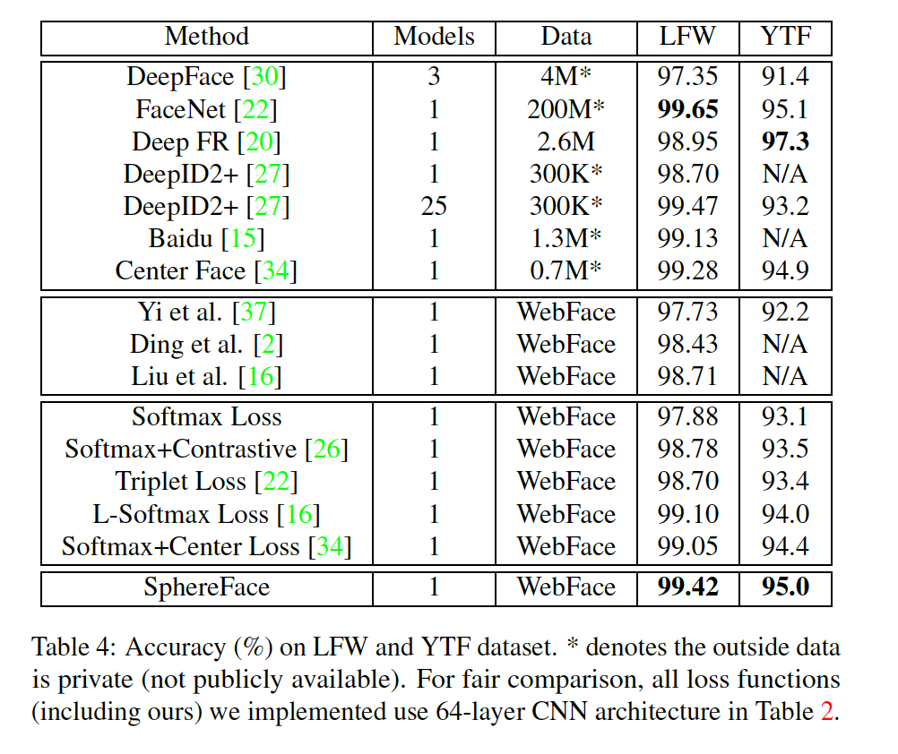

​		大多数已有的人脸验证系统利用大型训练数据或模型集成获得高性能。而使用在公开可用的数据集（CAISA-WebFace相对较小，且具有噪声标准）上训练的单模型，_SphereFace_在LFW和YTF数据集上获得99.42%和95.0%的准确率。这是当前在WebFace上训练的最佳性能，并且比在同一数据集上训练的其他模型要好得多。与在高质量私有数据集上训练的模型相比，_SphereFace_仍具竞争力，比大多数已有的结果好，见表4。应当注意到，我们的单模型性能仅比超过200M数据上训练的Google FaceNet差。

​		为了公平比较，我们还实现softmax损失、对比损失、中心损失、L-Softmax损失[16]，并利用与A-Softmax损失相同的64层CNN架构训练它们。如表4观察所示，_SphereFace_始终优于所有这些经过比较的损失所学习的特征，显示了其在FR任务中的优越性。

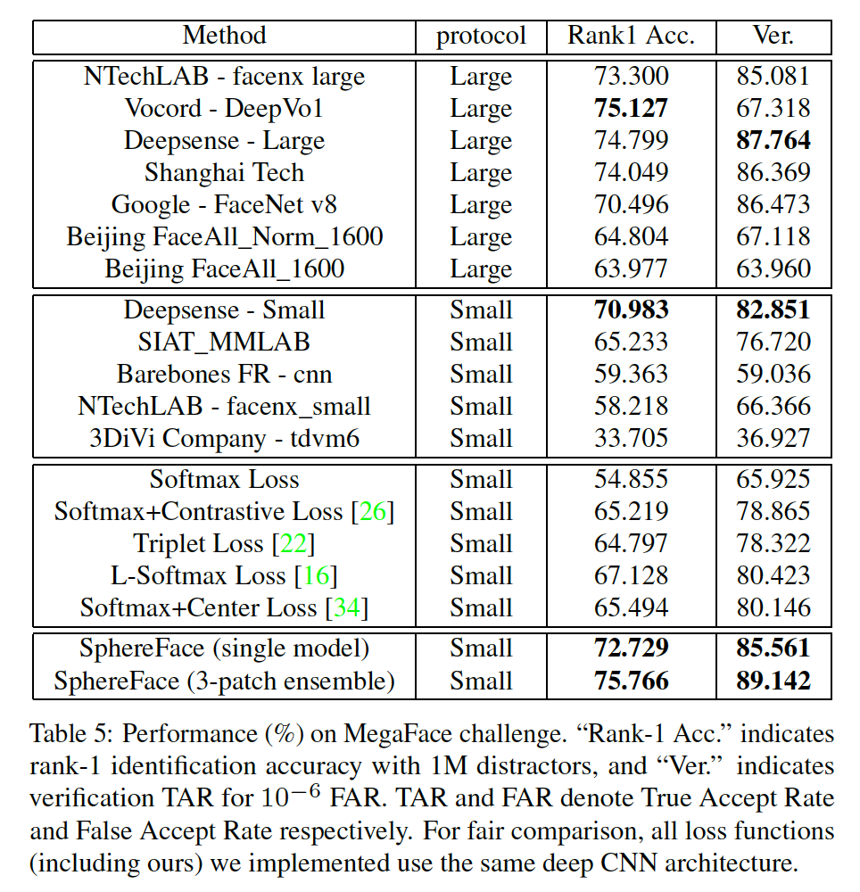

#### 4.4. MegaFace Challenge上的实验

​		MegaFace数据集[18]是最近发布的测试基准，具有极富挑战性的任务，需要以百万规模评估人脸识别方法的性能。MegaFace数据集包含gallery set和probe set。gallery集包含来自690K不同个体的超过1百万张人脸图像。probe集包含两个已有数据集：Facescrub[19]和FGNet。MegaFace有几个测试场景，包括识别、验证和两个协议（大型或小型训练集）下的姿态不变性。如果训练集小于0.5M，那么它被视为小型。我们在小型训练集协议下评估_SphereFace_。我们采用两个测试协议：人脸识别和验证。结果见图7和表5。注意，我们使用简单的3补丁特征拼接集成作为_SphereFace_的最终性能。

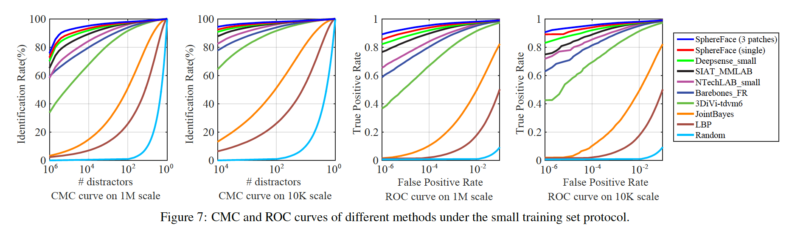

​		图7和表5表明，在MegaFace基准测试上，在小型训练数据集协议下，_SphereFace_（3个补丁的集成）大幅领先第二好的结果（4.8% 的 rank-1 identification rate和6.3%的verification rate）。与大型数据集上训练的模型相比（Google的500M和NTechLAB上的6.3%），我们的方法仍更好（0.65%的id. rate，1.4%的veri. rate）。此外，与它们的复杂网络设计相比，我们仅采用由A-Softmax损失监督的常用CNN架构来获得如此优雅的性能。对于单模型_SphereFace_，人脸识别和验证的准确率分别为72.3%和85.56%，其已经比大多数SOTA方法好。为了更好的评估，我们还使用softmax损失、对比损失、中心损失、三元损失和L-Softmax损失[16]。与这些利用相同CNN架构和数据集训练的损失函数相比，_SphereFace_也表现出明显而持续的改进。这些结果令人信服地表明，提出的SphereFace是针对开放式面部识别而精心设计的。也可以看出具有大型类间角间隔的学习特征可以明显提高开放式FR性能。

### 附录

#### A. 删除最后的ReLU的直觉

​		标准的CNN通常将ReLU连接到FC1之后，所以学习到的特征仅分布在非负范围$[0, +\infin)$，其限制CNN的灵活学习空间（夹角）。为了解决这个短板，SphereFace和[16]首先提出消除SphereFace网络中连接到FC1底部的ReLU非线性。直觉上，删除ReLU可以受益于特征学习，因为它提供了更大的可行学习空间（从角度角度而言）。

​		**MNIST上的可视化**	图8给出MNIST上的有和没有最后ReLU的特征分布的2D可视化。可以用ReLU观察到二维特征只能分布在第一象限中。 没有最后的ReLU，学习到的特征分布将更加合理。

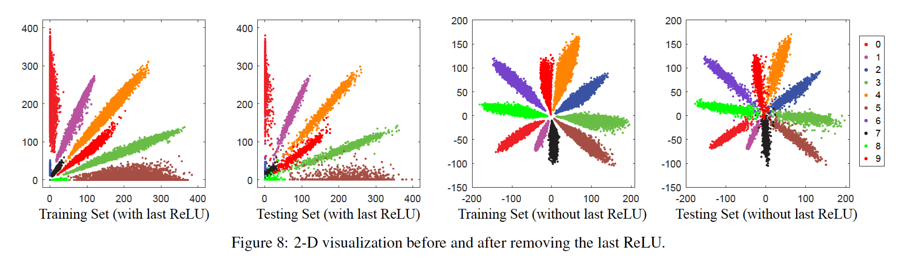

#### B. 归一化权重可以减小由训练数据不平衡引起的先验

​		我们在主论文中强调归一化权重可以得到更好的几何解释。此外，我们还从不同角度归一化权重。我们发现归一化权重可以隐式减小由数据不平衡问题（例如训练数据的长尾分布）引起的先验。换句话说，我们认为归一化权重可以部分处理训练数据不平衡问题。

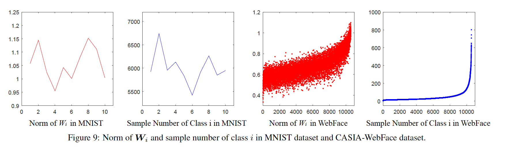

​		我们对每个类别的样本数与对应于同一类别的权重的2范数之间的关系进行了实证研究（$\mathbf{W}$的第$i$列与第$i$个类别相关联）。通过计算与每个类对应的$\mathbf{W}_i$的范数和类$i$的样本量（见图9），我们发现一个类有越多的样本数，与权重相关的范数也越大。我们认为与类$i$对应的的权重$\mathbf{W}_i$的范数也由其样本分布和样本量确定。因此，权重$\mathbf{W}_i,\forall i$的范数可以视为训练数据集中隐藏的学习先验。消除如此的先验通常对于人脸验证有好处。这是因为人脸验证要求没有在训练集上出现的测试集中测试。这种先验可能对人脸验证性能有害。为了消除如此先验，我们归一化FC2的权重范数。

#### C. 零偏差的实证实验

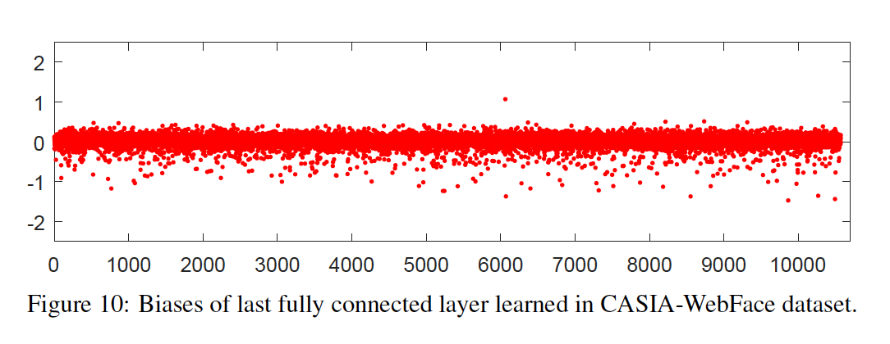

​		标准的CNN通常保留全连接层中偏置项，但是这些偏置项使其难以分析所提出的A-Softmax损失。这是因为，SphereFace值在优化夹角，并产生角间隔。借助FC2的偏置，角几何解释将变得更加难以分析。为了促进分析，遵循[16]，我们将FC的偏置项置为零。通过将FC2的偏置设置为零，A-Softmax损失有清楚的几何解释，因此变得更易分析。我们在图10中显示了来自CASIA预训练模型的FC2的所有偏置。 可以观察到大多数偏差接近于零，这表明这些偏置项对于人脸验证不一定有用。

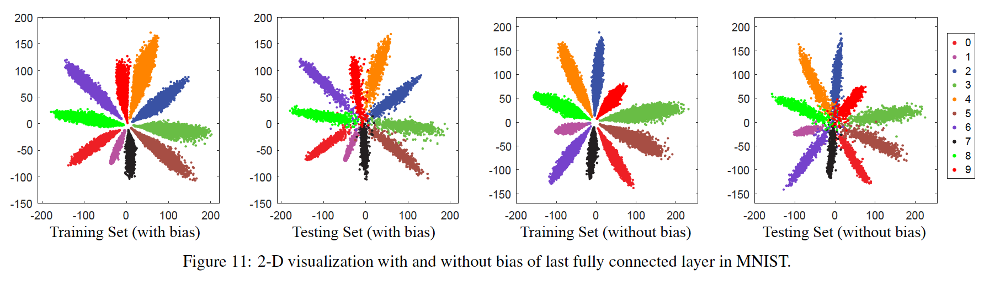

​		**MNIST上的可视化**	我们在图11中可视化了MNIST数据集中带有或不带有偏置项的二维特征分布。 可以看到，将偏置项归零对特征分布没有直接影响。 在有偏置项和无偏置项的情况下学习的特征都可以充分利用学习空间。

#### D. 2D visualization of A-Softmax loss on MNIST

​		在图12中，我们可视化MNIS上的2D特征分布。很明显，随着$m$的增加，由于更大的类间角间隔，学习到的特征变得更具辨别性。 最重要的是，学习到的辨别性特征在测试集中也能很好地推广。

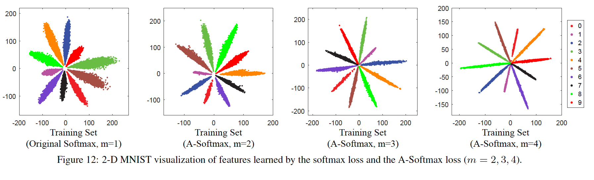

#### E. 费舍尔角评分，用于评估我们提出的修改的特征判别性和消融研究

​		在角间隔特征学习中，我们首先提出角Fisher平分来评估特征的辨别性。Angular Fisher Score（AFS）定义为：

$$AFS=\frac{S_\omega}{S_b} \tag{11}$$

其中类内离散值定义为$S_\omega =\sum_i\sum_{x_j \in X_i}(1-\cos\langle x_j,m_i \rangle)$，类间离散值定义为$S_b = \sum_i n_i(1-\cos\langle m_i, m \rangle)$。$X_i$为第$i$个类的样本，$m_i$为类$i$的特征的均值向量，$m$为整个数据集的均值向量，$n_i$为类$i$的样本数。一般而言，Fisher值越低，特征就更具辨别性。

​		接着，我们在所提出的修改上进行全面的消融研究：移除最后的ReLU、移除Biases、归一化权重和应用A-Softmax损失。使用表2中描述的4层CNN进行实验。在CASIA上训练模型，在LFW数据集上测试模型。设置与主论文中LFW实验完全相同。如表6所示，我们可以观察到所有修改都产生性能改进，并且我们的A-Softmax损失可以极大地提高角特征的辨别性。

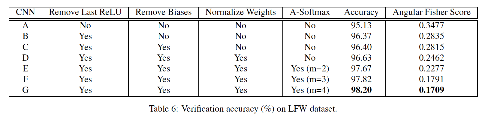

#### F. Experiments on MegaFace with different convolutional layers

​		我们还对具有不同卷积层的CNN在MegaFace数据集上进行了实验。表7中的结果表明，A-Softmax损失可以充分利用网络容量。利用更多卷积层，A-Softmax损失（即SphereFace）表现更好。最值得注意的是，仅4个卷积层的SphereFace可以比64个卷积层的Softmax损失好，其验证了A-Softmax损失的优越性。

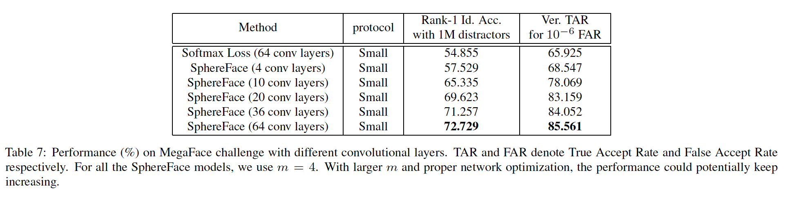

#### G. The annealing optimization strategy for A-Softmax loss

​		A-Softmax损失的优化与L-Softmax损失[16]相似。我们使用退火优化策略来训练具有A-Softmax损失的网络。简而言之，退火策略本质上是监督从一个简单的任务（即大$\lambda$）到一个困难的任务（即小$\lambda$）的网络。具体而言，我们令$f_{y_i} = \frac{\lambda\|\mathbf{x}_i\|\cos(\theta_{y_i})+\|\mathbf{x}_i\|\psi(\theta_{y_i})}{1+\lambda}$，并利用非常大的$\lambda$初始化随机梯度下降（它等价月优化原始的softmax）。然后，训练期间，我们逐渐减小$\lambda$。理想上，$\lambda$逐渐减小到0，但实践中，较小的值通常足够。在大多数人脸实验中，$\lambda$衰减到5已产生令人影响深刻的结果。更小的$\lambda$可能产生更好的性能，但是也更难训练。

#### H. Details of the 3-patch ensemble strategy in MegaFace challenge

​		我们还采用常用策略来执行3个补丁集成，如图13所示。尽管使用更多补丁可以保持增长的性能，但是考虑到效率和准确率的平衡，我们使用3补丁简单拼接（没有使用PCA）。可以通过交叉验证选择3个补丁。本文使用的3个补丁与图13完全相同。

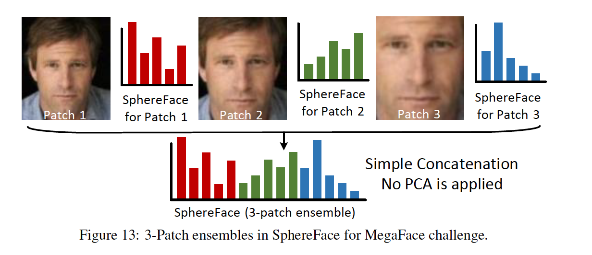s