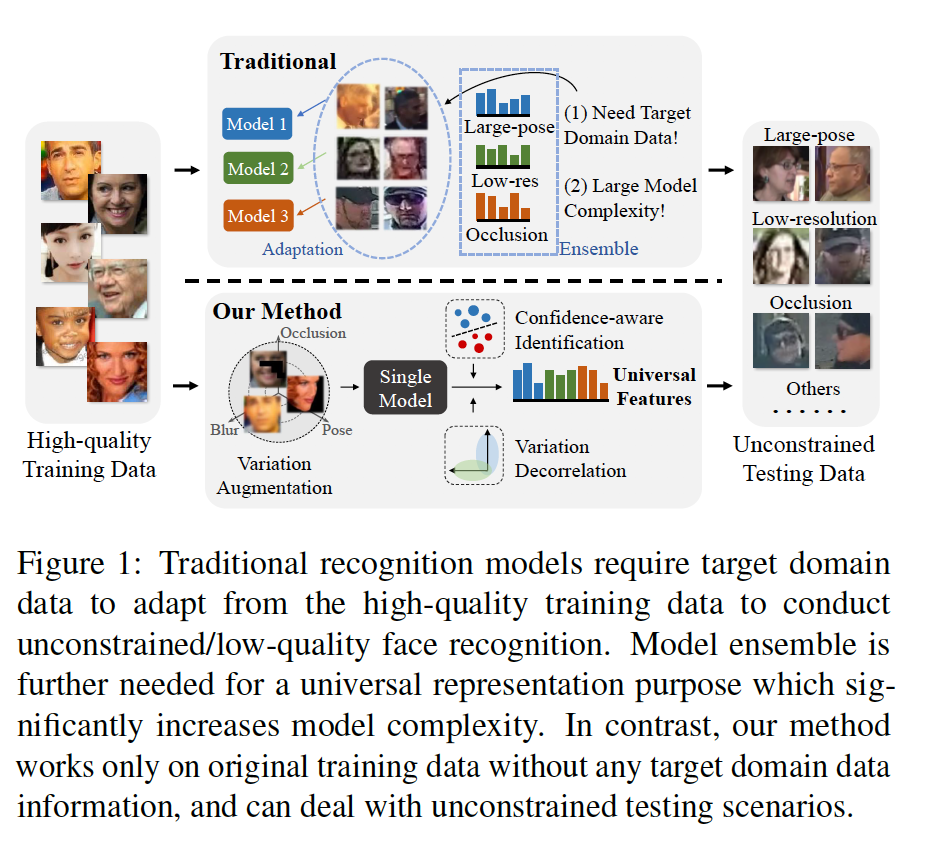

## Towards Universal Representation Learning for Deep Face Recognition

### 摘要

​		识别野外人脸非常困难，因为它们会出现各种变化。传统方法要么使用来自目标域的经过特殊标注的变化数据进行训练，要么通过引入未标注的目标变化数据以适应训练数据进行训练。相反，我们提出一种通用的表示学习框架，该该框架可以处理给定训练数据中未见过的较大变化，而无需利用目标域知识。我们首先将训练数据与一些有意义的语义变化（例如低分辨率、遮挡和头部姿势）一起合成。然而，直接将增强的数据用于训练不会很好地收敛，因为新引入的样本主要是难样本。我们提出将特征嵌入划分为多个子嵌入，并且为每个子嵌入关联不同的置信度值，以简化训练过程。通过正则化变化的分类损失和变化的对抗损失，可以进一步对子嵌入进行解相关。实验表明，我们的方法在通用人脸识别数据集（如LFW和MegaFace）上获得顶级性能，同时在诸如TinyFace和IJB-S的极端基准测试上也明显更好。

### 1. 引言

​		深度人脸识别探索将输入图像映射到具有小身份内距离和大身份间距离的特征空间，这是通过先前的工作通过损失设计和具有丰富的类内差异的数据集来实现的[29、40、17、38、4]。但是，即使是非常大型的公共数据集（例如MS-Celeb-1M）也表现出强烈的偏见，例如种族[33]或头部姿势[20、24]。这种差异的缺乏会导致具有挑战性的测试数据集上的性能显着下降，例如现有技术[31]在IJB-S或TinyFace [11、3]上报告的准确率比IJB-A[14]或LFW [10]低约30％。

​		最近的工作试图通过识别变化的相关因素并增强数据集以通过域适应方法将它们合并来减轻这个问题[33]。有时，这样的变化很难识别，因此使用领域自适应方法在训练域和测试域之间对齐特征[28]。或者，可以在各种数据集上训练单个模型，然后对每个模型进行集成以获得良好的性能[19]。所以这些方法要么仅处理特定的变化，要么需要访问测试数据的分布，或者增加了额外的运行时复杂度以处理更大的变化。相比之下，我们提出学习当个“统一”的深度特征表示，其处理人脸识别中的变化，而不需要评估测试数据的分布，并保持运行时效率，同时获得多种场景（特别是低质量图像）上的强壮性能（见图1）。

​		本文在第3节中介绍了一些新颖的贡献，以学习这种通用表示形式。第一，我们注意到非正脸姿态、低分辨率和严重遮挡的输入是关键的可命名因素（nameable factor），这些因素对“in-the-wild”应用提出了挑战，对于这些应用，训练数据可能会得到综合增强。但是直接将困难增强样本添加到训练会导致更难的优化问题。我们通过提出一种识别损失来缓解这种情况，该损失要考虑每个样本的置信度以学习概率特征嵌入。第二，我们寻求通过将嵌入分解为子嵌入来最大化嵌入的表示能力，每个子嵌入在训练过程中都具有独立的置信度值。第三，通过在子嵌入的不同分区上的两个相反的正则化（即变化分类损失和变化对抗损失），鼓励所有子嵌入进一步去相关（decorrelated）。第四，我们通过在训练数据中挖掘附加的变化来扩展进一步的去相关正则化，而对于这些变化而言，合成增强并不容易。最后，我们通过概率聚合来解释子嵌入对于各种因素的不同辨别力，该概率归纳了它们的不确定性。

​		在第五节中，我们在公开数据集上广泛评估所提出的方法。与我们的基线模型相比，所提出的方法在通用人脸识别基准测试（诸如LFW和YTF）上维持高准确率，同时显著提高挑战性数据集（诸如IJB-C、IJB-S）上的性能，其中获得新的SOTA。详细的消融研究表明，以上每种贡献对实现这些出色性能的影响。

​		总之，本文的主要贡献为：

- 一种人脸表示学习框架，通过将通用特征与不同的变体相关联来学习通用特征，从而提高了对各种测试数据集的泛化能力。
- 一种置信度感知的识别损失，训练期间，其利用样本置信度来从困难样本中学习特征。
- 一种特征解相关（decorrelation）正则化，其在子嵌入的不同分区上使用变化分类损失和变化对抗损失，产生改进的性能。
- 一种训练策略，可以有效地组合合成数据来训练适用于原始训练分布之外的图像的人脸表示。
- 几种基准测试（如IJB-A、IJB-C、TinyFace和IJB-S）上的SOTA结果。

### 2. 相关工作

**深度人脸识别：**	在正在进行的人脸识别研究中，深度神经网络被广泛采用[35、34、29、20、17、8、25、37、4]。Taigman等[35]提出用于人脸识别的第一种深度卷积神经网络。接下来的工作已探索不同损失函数来提高特征表示的辨别能力。Wen等[40]提出中心损失来减小类内变化。一系列工作已提出使用度量学习方法进行人脸识别[29、32]。最近的工作一直在尝试使用单个识别损失函数来实现辨别性嵌入，其中使用代理/原型向量来表示嵌入空间中的每个类[17、37、38、25、4]。

**通用表示**	通用表示是指可以应用于各种视觉域（通常是不同任务）的单个模型，例如目标、字符、道路标志，同时保持使用一组特定于域的模型的性能[1、26、27、39 ]。通过如此的单模型学习的特征被认为比域特定的模型更通用。与域泛化[13、22、15、16、36]不同，领域泛化是通过从各种可见域中学习来针对未见域的适应性，而通用表示则不涉及对未见域的重新训练。这些方法大多数都集中在通过使用条件化BatchNorm [1]和残差适配器[26、27]等技术来减少域偏移来提高参数效率。Wang等人[39]基于SE模块[9]，为通用目标检测网络的中间（隐藏）特征提出了一种域注意模块。我们的工作与这些方法有两个方面的不同：（1）它是一项相似性度量学习，而不是检测或分类任务，（2）它是模型无关的。然后，通过计算看不见的类的样本之间的成对相似度，可以将我们的模型学习到的特征直接应用于不同的领域。

### 3. 所提出的方法

​		在本节中，我们首先介绍三个可扩展的变体，即模糊、遮挡和头部姿势，以增强训练数据。 可视化的增强数据示例如图2所示，详细信息可以在第4节中找到。然后在3.1节中，我们引入了一个置信度感知的识别损失，以从困难的示例中学习，在第3.2节中将特征向量划分为具有独立置信度的子嵌入来进一步扩展。 在第3.3节中，我们应用了引入的可增强变体，以进一步对特征嵌入进行解相关。 提出了一种不可增强的变化发现，以探索更多的变化以实现更好的去相关性（decorrelation）。 最后，提出了不确定性指导的成对度量进行推理。

#### 3.1. Confidence-aware Identification Loss

​		给定输入样本$\mathbf{x}_i$，我们研究样本被分类为身份$j \in \{1,2,\cdots,N\}$的概率后验。将样本$i$的嵌入特征表示为$\mathbf{f}_i$，第$j$个身份的原型（prototype）向量表示为$\mathbf{w}_j$，这个原型向量为身份模板特征。概率化嵌入网络$\theta$将每个样本$\mathbf{x}_i$表示为特征空间中的高斯分布$\mathcal{N}(\mathbf{f}_i, \sigma^2_i\mathbf{I})$。$\mathbf{x}_i$为第$j$个类的样本的似然为：

$$\begin{align}p(\mathbf{x}_i | y=j) &\propto p_\theta(\mathbf{w}_j | \mathbf{x}_i) \tag{1} \\&=\frac{1}{(2\pi\sigma_i^2)^{\frac{D}{2}}}\exp(-\frac{\|\mathbf{f}_i -\mathbf{w}_j\|^2}{2\sigma_i^2}), \tag{2}\end{align}$$

其中$D$为特征维度。进一步假设将样本分配给任何同一性的先验相等，则$\mathbf{x}_i$属于第$j$类的后验推导为：

$$\begin{align}p(y = j|\mathbf{x}_i)&=\frac{p(\mathbf{x}_i | y = j)p(y=j)}{\sum_{c=1}^N p(\mathbf{x}_i|y=c)p(y=c)} \tag{3}\\&=\frac{\exp(-\frac{\|\mathbf{f}_i - \mathbf{w}_j\|^2}{2\sigma_i^2})}{\sum_{c=1}^N\exp(-\frac{\|\mathbf{f}_i -\mathbf{w}_c\|^2}{2\sigma_i^2})},\tag{4}\end{align}$$

为了简化，令我们定义置信度值$s_i = \frac{1}{\sigma_i^2}$。将$\mathbf{f}_i$和$\mathbf{w}_j$约束在$l_2$归一化的单位球面，我们有$\frac{\|\mathbf{f}_i - \mathbf{w}_j\|^2}{2\sigma_i^2}) = s_i(1-\mathbf{w}_j^T\mathbf{f}_i)$和

$$p(y=j|\mathbf{x}_i)=\frac{\exp(s_i\mathbf{w}_j^T\mathbf{f}_i)}{\sum_{c=1}^N\exp(s_i\mathbf{w}_c^T\mathbf{f}_i)}.\tag{5}$$

式（5）中的置信度感知的后验如图4所示。在对各种质量的样本进行训练时，如果我们对所有样本都假设相同的置信度，则学习到的原型将位于所有样本的中心。 这是不理想的，因为低质量的样本会传达更多的身份信息。相比之下，如果我们设置样本特定的置信度$s_i$，其中高质量样本表现出更高置信度，它推动原型$\mathbf{w}_j$与高质量样本更加相似，以使后验最大化。同时，在嵌入$\mathbf{f}_i$更新期间，它为低质量的$\mathbf{f}_i$更接近原型提供了强大的推动力。

​		事实证明，在指数logit上添加损失间隔（loss margin）[38]可以有效缩小身份内部分布。我们还将它纳入我们的损失：

$$\mathcal{L}_{idt}' = -\log(\frac{\exp(s_i\mathbf{w}_{y_i}^T\mathbf{f}_i - m)}{\exp(s_i\mathbf{w}_{y_i}^T\mathbf{f}_i - m) + \sum_{j\ne y_i}\exp(s_i\mathbf{w}_j^T\mathbf{f}_i)}),\tag{6}$$

其中$y_i$为$\mathbf{x}_i$的ground-truth标签。我们的置信度感知识别损失（C-Softmax）与Cosine Loss的主要差异如下：（1）每幅图像有独立和动态的$s_i$，而不是常共享的标量，（2）间隔参数没有乘以$s_i$。$s_i$的独立性使其可以在网络训练过程中以特定于样本的方式门限（gate）$\mathbf{w}_j$和$\mathbf{f}_i$的梯度信号，因为训练样本的置信度（变化程度）可能有较大差异。尽管样本是特定的，我们的目标是追求同质的特征空间，以使跨不同身份的度量标准保持一致。因此，允许$s_i$补偿样本的置信度差异，我们期望$m$在所有身份中得到一致的共享。

#### 3.2. Confidence-aware Sub-Embeddings

​		尽管通过样本特定的门$s_i$学习的嵌入$\mathbf{f}_i$可以处理样本级变化，但是我们认为$\mathbf{f}_i$本身的条目（entries）之间的相关性仍然很高。为了最大化表示能力，并获得紧凑的特征尺寸，解相关嵌入的条目是必须的。这鼓励我们进一步将嵌入$\mathbf{f}_i$分解为分区的子嵌入，其中每个嵌入进一步分配一个标量置信度值。

​		如图3所示，我们将整个特征嵌入$\mathbf{f}_i$分区为$K$个相等长度的子嵌入，如式（7）。相应地，原型向量$\mathbf{w}_j$和置信度标量$s_i$也被分区为相同大小的$K$组。

$$\begin{align}\mathbf{w}_j &= [\mathbf{w}_j^{(1)T},\mathbf{w}_j^{(2)T}, \cdots,\mathbf{w}_j^{(K)T}], \\ \mathbf{f}_i &=[\mathbf{f}_i^{(1)T}, \mathbf{f}_i^{(2)T},\cdots,\mathbf{f}_i^{(K)T}], \\ \mathbf{s}_i &= [s_i^{(1)}, s_i^{(2)},\cdots,s_i^{(K)}],\end{align}\tag{7}$$

子嵌入$\mathbf{f}_i^{(k)}$的每个组被$l_2$归一化到单位球面。最终的识别损失为：

$$\begin{align}\mathcal{L}_{idt} =-\log&\frac{\exp(\mathbf{a}_{i,y_i}-m)}{\exp(\mathbf{a}_{i,y_i}-m) + \sum_{j\ne y_i}\exp(\mathbf{a}_{i,j})}, \tag{8} \\ &\mathbf{a}_{i,j} =\frac{1}{K}\sum_{k=1}^K s_i^{(k)} \mathbf{w}_j^{(k)T}\mathbf{f}_i^{(k)}.\tag{9}\end{align}$$

神经网络的常见问题是，它们在预测上倾向于“over-confident”。我们添加额外的$l_2$正则化以约束任意变大：

$$\mathcal{L}_{reg} = \frac{1}{K}\sum_{k=1}^K s_i^{(k)2}.\tag{10}$$

#### 3.3. Sub-Embeddings Decorrelation

​		单独设置多个子嵌入并不能保证不同组中的特征正在学习补充信息。图5中的实证研究表明，我们发现子嵌入仍然是高度相关的，即将$\mathbf{f}_i$划分为16组，所有子嵌入的平均相关系数仍为0.57。如果我们利用不同的正则化惩罚子嵌入，它们之间的相关系数会减小。通过将不同的子嵌入与不同的变化关联，我们在所有嵌入的子集上执行变化分类损失，同时在其他变化类型上执行变化对抗损失。给定多个变化，如此的两种正则化项被施加到不同的子集，导致更好的子嵌入解相关。

​		对于每种可增强的变化$t\in\{1,2,\cdots,M\}$，我们生成一个二值掩膜$V_t$，其选择所有子嵌入的随机$\frac{K}{2}$子集，同时将另一半设置为零。在训练开始时生成掩膜，并且在训练期间保持固定。我们确保，对于不同的变化，掩膜是不同的。我们期望$V_t(\mathbf{f}_i)$反应第$t$中变化，同时对于其他变化是不变的。相应地，通过学习预测每个被掩膜子集的所有变化，我们构建了一个多标签二进制判别器$C$：

$$\begin{align}\min_C \mathcal{L}_C &= -\sum_{t=1}^M\log p_C(\mathbf{u}_i = \hat{\mathbf{u}_i}|V_t(\mathbf{f}_i)) \\ &=-\sum_{t=1}^M\sum_{t'=1}^M\log p_C(u_i^{(t')}=\hat{u}_i^{(t')} | V_t(\mathbf{f}_i))\end{align}\tag{11}$$

其中$\mathbf{u}_i = [u_i^{(1)}, u_i^{(2)}, \cdots, u_i^{(M)}]$为已知变化的二值标签（0/1），$\hat{\mathbf{u}}_i$为ground-truth标签。例如，如果$t=1$对应分辨率，那么对于高/低分辨图像，$\hat{u}_i^{(1)}$分别为1和0。注意，式（11）仅用于训练判别器$C$。然后，嵌入网络相应的分类和对抗损失为：

$$\mathcal{L}_{cls} = -\sum_{t=1}^M\log p_C(u^{(t)}|V_t(\mathbf{f}_i))\tag{12}$$

$$\begin{align}\mathcal{L}_{adv} = -\sum_{t=1}^M\sum_{t'\ne t}(\frac{1}{2}\log p_C(u^{(t')}&=0 | V_t(\mathbf{f}_i)) + \\\frac{1}{2}\log p_C(u^{(t')}&=1 | V_t(\mathbf{f}_i)))\end{align}\tag{13}$$

分类损失$\mathcal{L}_{cls}$鼓励$V_t$为变化特定的，而$\mathcal{L}_{adv}$是对抗性损失，鼓励对其他变化不变。只要没有两个掩膜是相同的，就可以保证所选子集$V_t$在功能上与其他$V_{t'}$不同。因此，我们获得$V_t$和$V_{t'}$之间解相关（decorrelation）。每个样本的整体损失函数为：

$$\min_{\theta} \mathcal{L} = \mathcal{L}_{idt} + \lambda_{reg}\mathcal{L}_{reg} +\lambda_{cls}\mathcal{L}_{cls} + \lambda_{adv}\mathcal{L}_{adv}.\tag{14}$$

优化期间，式（14）为mini-batch中样本上的平均。

#### 3.4. Mining More Variations

​		由于$V_t$的数量太小，数量有限（在我们的方法中为3）导致可增强的解相关效果有限。为了进一步增强解相关，以及为了更好的泛化引入更多变化，我们旨在探索具有语义意义的更多变化。注意，不是所有变化都易于进行数据增强，例如是否微笑就难以增强。对于这样的变化，我们尝试从原是训练数据中挖掘出变化标签。特别地，特别是，我们利用现成的属性数据集CelebA [18]来训练具有身份对抗性损失的属性分类模型$\theta_{A}$：