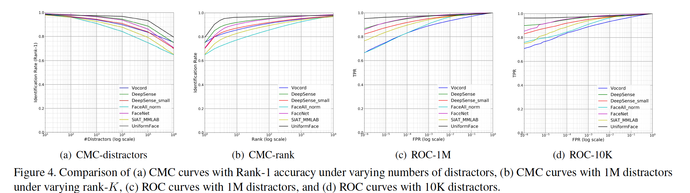

## UniformFace: Learning Deep Equidistributed Representation for Face Recognition

### 摘要

​		本文中，我们提出一种新的监督模板（称为unifrom loss）以学习深度均匀分布的表示以进行人脸识别。大多数已有的方法只在学习辨别性人脸特征，其鼓励大类间距离和小类内变化。但是，它们忽略整体特征空间中人脸的分布，其可能导致严重的局部性和不平衡。利用人脸位于超球流形的先验，我们通过在流形上均匀分布类中心来施加等分约束，以便可以通过充分利用特征空间来最大化类中心之间的最小距离。为此，我们将类中心视为类间排斥的超球表面上的电荷，并将总势能最小化为均匀损失（uniform loss）。MegaFace Challenge I、IAPRA Janus Benchmar A（IJB-A）、Youtube Faces（YTF）和Labeled Faces in the Wild（LFW）数据上的广泛实验结果表明所提出的uniform loss的有效性。

### 1. 引言

​		人脸识别在过去三十年受到越来越多的关注，文献[2、1、20、25、10、9]中提出大量人脸识别方法。一般而言，实际的人脸识别系统有四个主要过程：人脸检测、人脸对齐和人脸表示和人脸匹配。由于野外条件下的人脸通常会遭受较大的变化，从而降低了类别间的可分离性和类别内的紧凑性，因此，人脸表情在提取辨别性特征以将人脸与不同人分开的过程中起着关键作用[25]。

​		随着深度学习的快速发展，近年来见证了基于卷积神经网络（CNN）的人脸表示的显着改进[37、34、33、35、32、30、42、24、45、23、46、41]。确定学习到的CNN特征有三个关键贡献：训练数据、网络架构和损失函数。所使用的数据量在很大程度上影响着CNN的训练过程，近年来已经出现了大规模的人脸数据集，例如VGGFace [30]、VGGFace2 [3]、MSCeleb-1M [11]、IJB-A [18] 和MegaFace [17、28]。此外，开发了数据增强方法来提高性能，并避免过拟合[27]。深度学习特征也得益于网络架构的开发，其中代表性的CNN模型，包括AlexNet、VGG和GoogLeNet。面对急剧增长的训练数据量和复杂度，设计了更深的结构（如ResNet和DenseNet）来强化学习能力。最后的贡献是设计高度有效的损失函数，其为学习判别性CNN特征提供了有效的梯度[12、34、33、32、42、24、8、45、23、7]。本文中，我们主要关注如何设计高效损失函数的三个方面。

​		Softmax损失广泛用于训练CNN特征[37、34]，其定义为最后的全连接层、softmax函数和交叉熵损失的组合。但是，我们仅通过具有有限辨别性能力的softmax损失学习可分离的特征。为了处理这种局限，提出多种监督目标来增强学习到的特征的辨别性，目标函数包括对比损失[33]、三元损失[32]、中心损失、large-margin softmax（L-Softmax）损失[24]和Rang损失[45]。虽然大多数已有损失函数施加欧式间隔约束，但是SphereFace [23]通过在超球面流形上映射具有angular softmax（A-Softmax）损失的人脸来表明angular margin的有效性。但是，所有这些方法旨在增强学习到的特征的辨别能力，其没有考虑整体特征空间的人脸分布，并且可能遭遇高度局部性和不平衡。

​		本文中，我们认为特征的分布应当被视为一种关键特性。一方面，所学习的特征可能位于流形上的非常局部的位置，无法充分利用特征空间。另一方面，由于不平衡的分布，每个类的最小平均类间距离，即一个类与其最近邻居类之间的距离可能有更大的变化，其中一些类尤其会面临被误分的风险。图1（a）和（c）展示了LFW数据集上的可视化结果，其中类中心为非均匀分布。尽管人脸可能是多模态的，但高度非均匀分布（例如来自相同模态的不同身份被聚合到一起）仍导致缺乏辨别性，因为不同模态之间的巨大差距是特征空间的“浪费”。为此，我们提出一种新的目标函数（称为uniform loss）来学习用于人脸识别的等分表示，其是充分利用特征空间的理想目的。由于这样的事实，即当球体表面上的相似电荷均匀分布时，它们的势能最小，因此，我们将类中心视为具有排斥力的相似电荷，并将势能最小化的目标制定为uniform loss。通过A-Softmax损失恶化uniform损失的联合监督，学习到的特征的类中心均匀分布在超球流形上，使得利用均匀分布最大化最小平均类间距离，我们称学习到的特征为_UnifromFace_。我们观察到，在图1（b）和（d）的超球面流形上，利用均匀损失的附加监督信号，这些类更均匀地分布。MegaFace Challenge I、IJB-A、YTF和LFW数据上的实验结果验证了所提出的unifrom loss有效提高人脸识别的性能。

### 2. 相关工作

​		人脸识别是一个长期存在的计算机视觉问题，其中方法可被分为两类：手工设计表示和基于学习的表示。手工设计的方法要求研究人员具备丰富的先验知识，才能手工设计特征提取器。例如，Gabor wavelets[21]和LBP[1]首先在局部区域计算纹理信息或梯度，然后生成人脸识别的整体特征。虽然手工设计的方法是启发式的和数据依赖的，基于学习的方法以数据驱动的形式学习人脸表示。例如，Cao等[4]通过以无监督形式学习编码器来提出基于学习的描述子（learning-based descriptor：LE）。Lei等[20] 通过LDA准则学习了类似LBP的称为判别人脸描述子（discriminant face descriptor：DFD）的特征。Duan等[10]提出一种基于上下文的局部二值特征学习（context-aware local binary feature learning：CA-LBFL）方法来获取按位交互的二进制代码以进行人脸识别。

​		近年来，基于深度人脸表示的学习方法已获得一系列突破[37、34、33、35、32、30、42、24、45、23、46、41]。先驱工作有DeepFace和DeepID，其采用softmax损失训练深度学习特征。Parkhi等[30]提出“非常深”的VGG网络，并创建一种合理的大型人脸数据集。而softmax损失仅保证特征的可分离性，已经提出几种新的监督目标来增强辨别能力[33、32、42、24、8、23、7]。例如，Sun等[33]提出一种联合识别-验证的信号。Schroff等[32]证明三元损失的有效性。Wen等[42]提出中心损失来提高类内紧凑性。Zhang等[45]提出一种rang损失来处理训练数据的长尾分布。Liu等[24]通过大间隔softmax（L-Softmax）损失来扩大特征可分离性。它们还通过约束超球流形中学习到的特征而提出角softmax（A-Softmax）损失[23]。但是，这些损失函数旨在增强学习到的特征的辨别能力，其忽略整体特征空间上的特征分布，其可能导致特征分布的高度局部性和不平衡。

### 3. 所提出的方法

​		本节中，我们首先回顾A-Softmax损失[23]，其将人脸映射到超球流形。然后，我们详细描述所提出的uniform loss，并介绍深度可分的表示UniformFace。最后，我们突出uniform loss和两个相关目标之间的差异，并证明同时监督的必要性。

#### 3.1. 回顾A-Softmax损失

​		softmax损失已广泛用于多种视觉识别任务，并且它的形式表示如下：

$$L_s = -\frac{1}{N}\sum_{i=1}^N \log\frac{e^{\mathbf{W}_{y_i}^T \mathbf{x}_i + b_{y_i}}}{\sum_{j=1}^M e^{\mathbf{W}_j^T\mathbf{x}_i + b_j}}.\tag{1}$$

在式（1）中，$\mathbf{W}_j \in \mathbb{R}^d$为第$j$哥类的最后全连接层中的权重，$d$为特征维度。$b \in \mathbb{R}$为偏置项，为简明起见，将其省略。$\mathbf{x}_i \in \mathbb{R}^d$为样本$i$学习到的深度特征，$y_i$为ground-truth类标签。$N$和$M$分别为样本和类的数量。通过softmax损失学习到的特征有固有的角分布，其建议将余弦距离作为度量，而不是欧式距离[23]。为此，通过将$\|\mathbf{W}_i\|$约束到1将修改的softmax损失形式化为：

$$L_m = -\frac{1}{N}\sum_{i=1}^N\log\frac{e^{\|\mathbf{x}_i\|\cos(\theta_{y_i,i})}}{\sum_{j=1}^Me^{\|\mathbf{x}_i\|\cos(\theta_{j,i})}},\tag{2}$$

其中决策边界依赖夹角。给定查询点，我们将角度与每个类别的权重进行比较，然后选择最小的一个作为结果，使得在超球流形上评估特征。SphereFace[23]通过A-Softmax损失来操作决策边界以产生角间隔，其中样本点和目标类之间的夹角乘以间隔参数$m$：

$$L_{a-s} = -\frac{1}{N}\sum_{i=1}^N\log\frac{e^{\|\mathbf{x}_i\|\psi(\theta_{y_i,i})}}{e^{\|\mathbf{x}_i\|\psi(\theta_{y_i,i}) + \sum_{j\ne y_i}e^{\|\mathbf{x}_i\|\cos(\theta_{j,i})}}}.\tag{3}$$

​		在式（3）中，$\psi(\theta_{y_i,i})$被定义为$(-1)^k\cos(m\theta_{y_i,i}) - 2k, \theta_{y_i,i}\in[\frac{k\pi}{m}, \frac{(k+1)\pi}{m}],k\in[0, m-1]$，而不是$\cos(m\theta_{y_i,i})$，来处理$\theta_{y_i,i}$被限制在$[0,\frac{\pi}{m}]$的局限。虽然A-Softmax损失旨在扩大类之间的角距离，并将相同类的特征限制到一个较小的超球区域，它没有考虑整体超球流形中的特征分布。如图1所示，A-Softmax不能完整利用整体特征空间，其导致不平衡的分布。

#### 3.2. UniformFace

​		因为不同类的人脸应当是分离的，我们将类中心视为具有相等数量的电荷，其中每个中心相互排斥。为了在超球流形中学习均匀分布的类中心，我们定义unifrm loss定义为所有中心的势能，并且通过最小化势能来均匀分配类中心。图2给出所提出uniform loss的示例。受库伦定理的启发，我们将两个类中心$\mathbf{c}_{j_1}$和$\mathbf{c}_{j_2}$之间的排斥力设置为距离平方的反比：

$$F = \lambda \frac{1}{d(\mathbf{c}_{j_1}, \mathbf{c}_{j_2})^2},\tag{4}$$

其中$d(\mathbf{c}_{j_1},\mathbf{c}_{j_2})$为中心$\mathbf{c}_{j_1}$和$\mathbf{c}_{j_2}$之间的距离。本文中，我们通过使用欧几里得距离而不是角距离来遵守传统的库仑定律。此外，我们向每个距离加1以阻止过大的排斥力，即$d(\mathbf{c}_{j_1},\mathbf{c}_{j2})=\|\mathbf{c}_{j_1} - \mathbf{c}_{j_2}\|_2 + 1$。

​		根据式（4）的定义，我们获得受$\mathbf{c}_{j_2}$影响的中心$\mathbf{c}_{j_1}$的势能：

$$E = \int_{d(\mathbf{c}_{j_1},\mathbf{c}_{j2})}^\infin \lambda \frac{1}{x^2} dx = \lambda \frac{1}{d(\mathbf{c}_{j_1},\mathbf{c}_{j2})},\tag{5}$$

其中$\mathbf{c}_{j_2}$的势能与$\mathbf{c}_{j_1}$的势能相同。为了学习等分表示，我们最小化所有类中心的总势能，作为我们的uniform loss。因为势能是标量，我们用所有成对势能的平均值来表示uniform loss，其表示如下：

$$L_u = \frac{\lambda}{M(M-1)}\sum_{j_1=1}^M\sum_{j_2\ne j_1}\frac{1}{d(\mathbf{c}_{j_1},\mathbf{c}_{j2})}.\tag{6}$$

​		因为训练过程中类中心$\mathbf{c}_j$连续变化，在每次迭代中，我们要求利用整个训练集来更新$\mathbf{c}_j$，其在实践中是不适用的。因此，我们通过在每个mini-batch中更新中心以采用修改的方法：

$$\Delta \mathbf{c}_j = \frac{\sum_{i=1}^n\delta(y_i = j)\cdot (\mathbf{c}_j - \mathbf{x}_i)}{1 + \sum_{i=1}^n\delta(y_i = j)},\tag{7}$$

其中$n$为mini-batch中的样本量，如果条件成立，$\delta(\cdot)=1$，否则$\delta(\cdot) = 0$。

​		我们采用A-Softmax损失和unifrom损失的同时监督以学习辨别性和等分的特征：

$$L = L_{a-s} + L_u, \tag{8}$$

其中$L_u$中的参数$\lambda$为平衡不同项的权重，SphereFace可以视为$\lambda=0$的特例。我们通过标准的SGD优化CNN。算法1详细描述所提出的UniformFace。

#### 3.3. 讨论

​		本小节中，我们首先比较所提出的方法与两种监督目标：A-Softmax损失和中心损失，然后讨论同时监督的必要性。

​		**A-Softmax损失和Center损失的比较：**今年来，提出几种监督信号来学习更具辨别性的深度人脸表示，其中最相关的目标为A-Softmax损失[23]和Center损失[42]。A-Softmax旨在在超球流形上学习辨别特征。但是，它没有显式约束整体特征空间上的分布，其中人脸可能位于局部和不平衡的位置。Center损失简单地最小化类内人脸和相应类中心之间的距离，其忽略类中心的类间关系。所提出的uniform损失在超球流形上考虑类间排斥力，并鼓励等分类中心，使得特征得到完整利用，并最大化类中心之间的最小距离。

​		**同时监督的必要性：**在UniformFace中，我们同事采用A-Softmax损失和Uniform损失作为训练目标。一方面，如果仅通过A-Softmax损失监督CNN，人脸将遭遇超球流形上的非均匀分布。另一方面，如果我们简单地利用uniform损失，类内变化将不受限制，其仅保证类中心的均匀分布。因此，对于辨别性和均匀分布的深度表示，必须同时进行监督。

### 4. 实验

​		本节中，我们在四种广泛使用的人脸识别数据集上进行大量实验来证明所提出的UniformFace的有效性，四个数据集为MegaFace Challenge I、IJB-A、YTF和LFW数据集。

#### 4.1. 实现细节

​		**CNN的详细设置：**对于所有数据集，我们使用MxNet，并采用ResNet作为CNN架构。图3详细描述了采用的CNN架构。整个实验过程中，对于[23]中建议的$L_{a-s}$，我们将$m$设置为4。我们通过YTF和LFW数据集上的交叉验证将参数$\lambda$固定为1。该模型在四个GTX 1080Ti GPU上以128的批量大小进行了训练，以实现加速。我们将学习率初始化为0.1，其在16K和24K迭代时除以10。

​		**预处理：**我们在人脸图像上进行标准的预处理。我们使用MTCNN检测五个标志点（两只眼睛、两个嘴角位置和鼻子）来检测和对齐训练集和测试集中的每张人脸，并将图像裁剪到$112 \times 112$。我们还通过减去127.5、除以128来归一化RGB图像中的每个像素。

​		**训练：**我们在精炼的MS-Celeb-1M[11]和VGGFace2[3]数据集上训练模型。MS-Celeb-1M最初包含来自100K个身份的10M图像。我们删除远离类中心的图像以提高训练数据的质量，并清楚少于3张图像的身份以缓解长尾分布[8、7]。精炼的MS-Celeb-1M数据集包含85K神父、3.84M图像。VGGFace2包含9131个主体、3.31M图像。我们采用训练划分来优化帷幕的UniformFace，其包含具有8631个身份、2.21M人脸。

​		**测试：**我们从全连接层的输出提取UniformFace，并且我们拼接原始图像和水平翻转人脸的特征作为最终表示。因此，每张人脸的最终表示的维度为1024。我们采用具有余弦距离的最近邻分类器进行人脸识别和验证。

#### 4.2. 数据集

......

#### 4.3 MegaFace上的实验

​		我们在MegaFace Challenge 1的FaceScrub上评估所提出的UniformFace，包括人脸识别和人脸验证任务。我们遵循大型训练集的协议，因为训练数据集包含超过50万张图像，其中FaceScrub中出现的身份已从训练集中删除。我们采用MegaFace的原始测试集进行公平比较。

​		**与SOTA的比较**

**均匀性评估**

**Adaptation to More Baseline：**

#### 4.4. IJB-A上的实验

#### 4.5. YFT和LFW上的实验

#### 4.6. 消融研究

