## PointRend: Image Segmentation as Rendering

### 摘要

​		我们提出一种新的用于搞笑高质量目标和场景分割的方法。通过将经典的计算机图形学方法与像素标记任务中遇到的过采样和欠采样问题进行类比，我们开发了一个独特的视角，将图像分割作为一个渲染问题。从这个优势，我们提出了 PointRend（Point-based Rendering）神经网络模块：一个模块在基于迭代分区（subdivision）算法的自适应选择位置上，执行基于点的分割预测。通过在现有的最佳模型的顶部构建 PointRend ，它可以灵活地用于实例和语义分割。许多具体实现的一般想法是可能的，我们证明，一个简单的设计就能取得良好的效果。在定性上，PointRend在先前方法过度平滑的区域中输出清晰的对象边界。对于实例和语义分割，在 COCO 和 Cityscapes上，PointRend 都能产生显著性能提高。PointRend的效率可以实现与现有方法相比在内存或计算方面不可行的输出分辨率。

### 1. Introduction

​		图像分割任务涉及将在常规网格上采样的像素映射到同一网格上的标签图或一组标签图。对于语义分割，标签图表示每个像素的预测类别。在实例分割中，预测坚持到的每个目标的二值前景 vs. 背景图。选择用于这些任务的现代工具是基于卷积神经网络（CNN）的[27、26]。

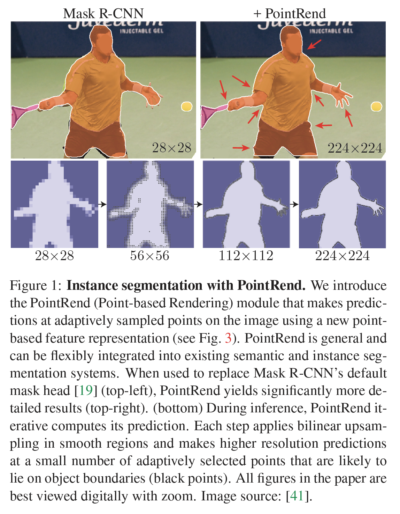

​		图像分割的 CNN 通常在规则网格上运算：输入图像是像素的规则网格，它们的隐藏表示是规则网格上的特征向量，它们的输出是规则网格上的标签图。规则网格很方便，但不一定在计算上适合图像分割。这些网络预测的标签图应该基本上是平滑的，即相邻像素经常采用相同的标签，因为高频区域仅限于目标之间的稀疏边界。规则网格将不必要地对平滑区域进行过度采样，同时对目标边界进行欠采样。结果是在平滑区域和轮廓模糊的区域进行了过多的计算（图1，左上方）。图像分割方法通常在低分辨率的规则网格（对于语义分割为输入的 $1/8$，实例分割为 $28 \times 28$）上预测标签，作为欠采样和过采样的折衷。

​		在计算机图形学中，类似采样问题已经研究了数十年。当输出在常规网格上时，计算不会在网格上均匀分配。相反，常见的图形策略是在图像平面中的自适应选择点上的不规则子集中计算像素值。举例来说，[48]的经典subdivision技术可产生类似四叉树的采样模式，该模式可有效渲染抗锯齿的高分辨率图像。

​		本文的中心思想是，将图像分割视为渲染问题，并采用计算机图形学中的经典思想来有效地“渲染”高质量的标签图（见图 1 左下）。我们将这种计算思想封装到一个新的神经网络模块中（称为 **PointRend**），它使用 subdivision 策略来自适应地选择要在其上计算标签的一组非均匀点。对于实例分割（例如Mask R-CNN [19]）和语义分割（例如FCN [35]），可以将PointRend合并到流行的元架构中。它的subdivision策略使用的浮点运算比直接的密集计算要少一个数量级，从而可以有效地计算高分辨率分割图。

​		PointRend 是一个通用模块，其接受许多可能的实现。从抽象的角度来讲，PointRend 模块接受在规则网络上定义的一个或多个典型的 CNN 特征图 $f(x_i, y_i)$ ，并输出更精细网格上的高分辨率预测 $p(x_i', y_i')$。PointRend 仅在仔细选择的点上作出预测，而不是在输出网格的所有点上作出过多的预测。为了作出这些预测，它通过插值 $f$ 来提取选择点的逐点的特征表示，并使用一个小型的 *point head* 子网络来预测逐点特征上的输出标签。我们将介绍简单而搞笑的 PointRend 实现。

​		我们使用 COCO 和 Cityscapes 基准测试评估 PointRend 在实例分割和语义分割上的表现。PointRend 有效地计算了目标之间的尖锐边界，如图 2 和图 8 所示。即使这些任务（mask AP 和 mIoU）的基于标准交并比的度量标准偏向目标内部像素，并且对边界改进相对不敏感，我们也观察到了定量的改进。PointRend大大改进了强大的Mask RCNN和DeepLabV3 [5]模型。

### 2. Related Work

**Rendering** 计算机图形学中渲染算法输出像素的规则网格。然而，它们通常在非均匀的点集上计算这些像素值。如 subdivision 的高效过程和自适应采样细化具有更大方差像素值的区域上的粗糙栅格。Ray-tracing 渲染器通常使用过采样 [50]，它是一种比输出网格更密集地采样某些点以避免混叠效应的技术。这里，我们将经典的 subdivision 用于图像分割。

**Non-uniform grid representations**  在规则网格上计算是 2D 图像分析上的主流范式，但是其他视觉任务不是这种情况。在 3D 形状识别中，由于三次缩放，大型的 3D 网格是不可行的。大多数基于 CNN 的方法都没有超过醋炒的 $64 \times 64 \times 64$ 的网格。相反，最近的研究考虑更有效的非均匀表示，例如meshes[47、14]、signed distance function [37] 和 octrees [46] 。与 signed distance function 相似，PointRend 可以计算任意点处的分割值。

​		最近，Marin 等 [36] 提出了一种在使用标准语义分割网络处理基于输入图像先验的非均匀子采样的有效语义分割网络。相反，PointRend关注在输出上进行非均匀采样。尽管目前尚无关于实例分割的证明[36]，但可以将两种方法结合起来使用。

**Instance segmentation**  基于 Mask RCNN 元架构 [19] 的方法在最近的挑战 [32、3]中排名第一。这些基于区域的架构通常在 $28 \times 28$ 的网格上预测掩膜，而不管目标的大小。这对于小型目标是足够的，但是，对于大型目标，它会产生令人讨厌的“ blobby” 输出，从而使大型目标的精细细节变得不平滑（请参见图1，左上方）。 相反，自下而上的方法分组像素以构成目标掩膜[31、1、25]。这些方法可以产生更详细的输出，然而，在大多数实例分割基准测试[29、9、40]上滞后基于区域的方法。TensorMask[7]（一种替代滑动窗口的方法）使用复杂的网络设计来预测大型目标的清晰的高分辨率掩膜，但是它的准确还是略微落后。在本文中，我们证明了配备PointRend的基于区域的分割模型可以生成具有精细级别（fine-level）的详细掩膜，同时提高了基于区域的方法的准确性。

**Semantic segmentation.**  全卷积网络（FCNs）[35]是现代语义分割方法的基础。它们通常预测比输入更低分辨率的输出，并使用双线性上采样恢复剩余的 $8-16\times$ 的分辨率。使用 dilated/atrous 卷积替换一些上采样层可能会改善结果，这花费更多的内存和计算。

​		替代方法包含编码器-解码器架构，该结构对编码器中的网格表示进行二次采样，然后在解码器中，使用跳过连接[44]恢复已过滤的细节以对表示进行上采样。在应用双线性插值之前，当前方法将膨胀卷积与编码器-解码器结构[6、30]结合以产生比输入网格稀疏4倍的输出。在我们的工作中，我们提出一种可以在网格上高效预测与输入网格一样密集的精细细节。

### 3. Method

​		我们将计算机视觉中（目标和/或场景的）图像分割模拟为计算机图形学中的图像渲染。渲染是关于将模型（例如3D网格（mesh））显示为像素的规则网格，即图像。尽管输出表示形式是规则网格，但基础物理实体（例如3D模型）是连续的，并且可以使用物理和几何推理在图像平面上的任何实值点查询其物理占用率（occupancy）和其他属性，例如光线追踪。

​		类似地，在计算机视觉中，我们可以将图像分割认为是基础连续实体的占用率图，并从中“渲染出”分割输出（预测标签的规则网格）。在网络的特征图中编码实体，并且可以通过插值访问任意点。经过训练可从这些插值的点状特征表示预测占用率的参数函数能与物理和几何推理相对应。

​		基于这种类比，我们提出了PointRend（基于点的渲染）作为使用点表示进行图像分割的方法。PointRend模块接受一个或多个 $C$ 个通道的典型CNN特征图 $f\in \mathbb{R}^{C\times H\times W}$ ，每个特征图定义在一个规则的网格（其通常比图像网格粗糙4到16倍），并在不同（以及可能更高）分辨率的规则网格上输出$K$个类标签的预测$p \in \mathbb{R}^{K \times H' \times W'}$ 。PointRend模块包含三个主要部分：（i）*point selection strategy* 选择选择少量实数点作出预测，避免高分辨率输出网格上所有像素的过多计算。（ii）对于每个选择的点，提取 *point-wise feature representation*。通过$f$的双线性插值来计算实值点的特征，这使用的是$f$的规则网格上该点的4最近邻。因此，它可以利用$f$的通道维度中编码的子像素信息来预测比$f$更高分辨率的分割。（iii）*point head*：训练一个小型的神经网络从这个逐点特征表示中独立地预测每个点的标签。

​		PointRend架构可以用于实例分割（例如Mask R-CNN）和语义分割（例如FCNs）任务。对于实例分割，PointRend用于每个区域。它通过对一组选定点进行预测，从而以粗到精的方式计算掩膜（见图3）。

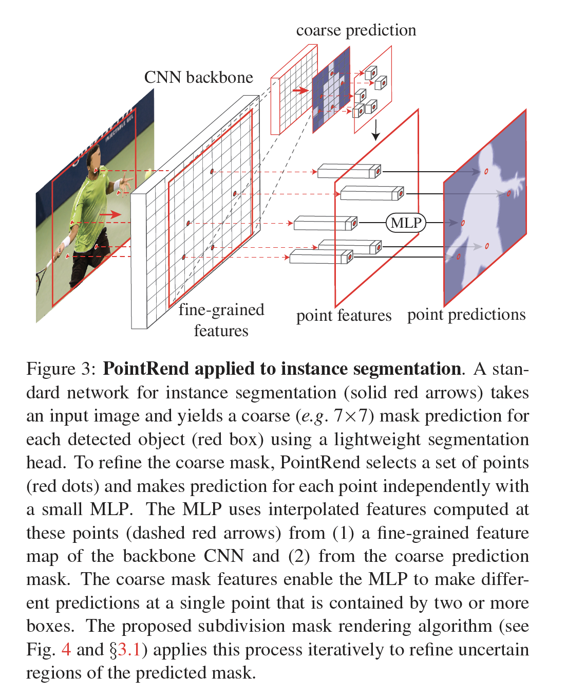

#### 3.1. Points Selection for Inference and Training

​		我们方法的核心思想是在图像平面中灵活、自适应地选择预测分割标签的点。直观地讲，这些点应更密集地位于高频区域（例如对象边界）附近，类似于光线跟踪中的抗锯齿问题。我们开发这种思想进行推理和训练。

**Inference**	我们的推理选择策略受到计算机图形学中自适应细分（*adaptive subdivision*）[48]的经典技术的启发。通过在极可能与邻居明显不同的位置进行计算，该技术可用于有效渲染高分辨率图像（例如，通过光线跟踪）。对于所有其他位置，该值通过插值已经计算的输出值（从粗糙的网格开始）来获得所有其他位置的值。

​		对于每个区域，我们以由粗到精的方式迭代地“渲染”输出掩膜。最粗糙级的预测在规则网格的点上预测（例如通过使用标准的粗糙分割预测头部）。在每次迭代中，PointRend使用双线性插值上采样其前面预测的分割，然后选择$N$个最不确定的点（例如为二值掩膜选择概率最接近0.5的那些点）。然后，PointRend为这$N$个点中的每一个计算逐点特征表示，并预测它们的标签。重复这一过程直至上采样分割到期望的分辨率。在图4的一个玩具示例中说明了此过程的一个步骤。

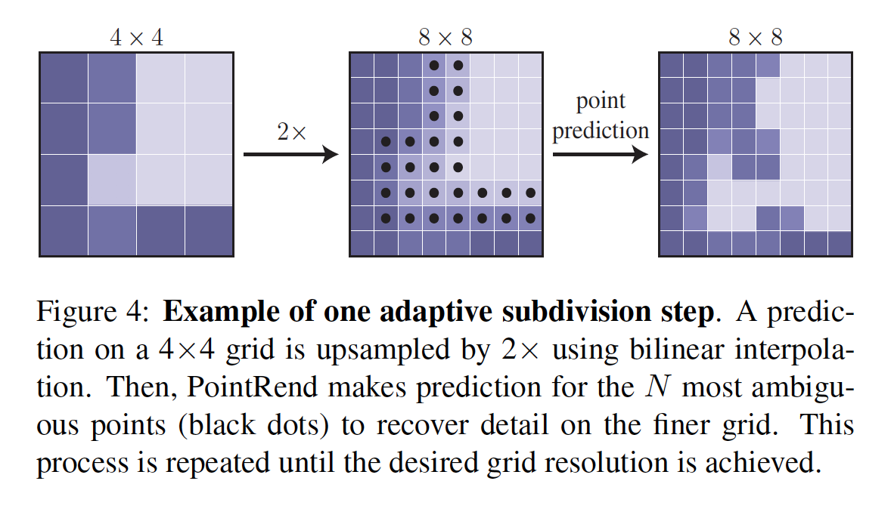

​		利用所需的 $M \times M$ 像素的输出分辨率以及$M_0 \times M_0$ 的起始分辨率，PointRend需要不超过 $N\log_2\frac{M}{M_0}$个点的预测。这远远小于$M \times M$，其允许PointRend来作出远远更高效的高分辨率预测。例如，如果$M_0$为7，所需的分辨率为$M=224$，然后执行五个细分步骤。如果我们在每个步骤中选择$N=28^2$个点，PointRend仅为$28^2\cdot4.25$个点作出预测，这比$224^2$小15倍。注意，总体上选择少于$N \log_2 \frac{M}{M_0}$个点，因为在第一个细分步骤中只有$14^2$个点可用。

**Training**	在训练期间，PointRend还需要选择要在其上构建逐点特征的点，以训练点头部。原则上，点选择策略与推理中使用的戏份策略相似。然而，细分引入的序列步骤对利用反向传播训练神经网络是不友好的。相反，对于训练，我们使用基于随机采样的非迭代策略。

​		采样策略在特征图上选择$N$个点进行训练（训练和推理中选择的$N$可以不同）。它旨在使用三个原理将选择偏向不确定区域，同时还保留一定程度的均匀覆盖。（i）*over generation*：我们通过从均匀分布中随机采样$kN$个点$(k> 1)$来过度生成候选点。（ii）*importance sampling*：通过对所有$kN$个点的粗糙预测值进行插值并计算特定于任务的不确定性估计值（在第4节和第5节中定义），我们将重点放在不确定的粗糙预测的点上。从$kN$个候选中选择最不确定的$\beta N$个点（$\beta\in[0,1]$）。（iii）*coverage*：从均匀分布中选择采样余下的$(1-\beta)N$个点。我们以不同的设置来说明此过程，并将其与常规的网格选择进行比较，如图5所示。

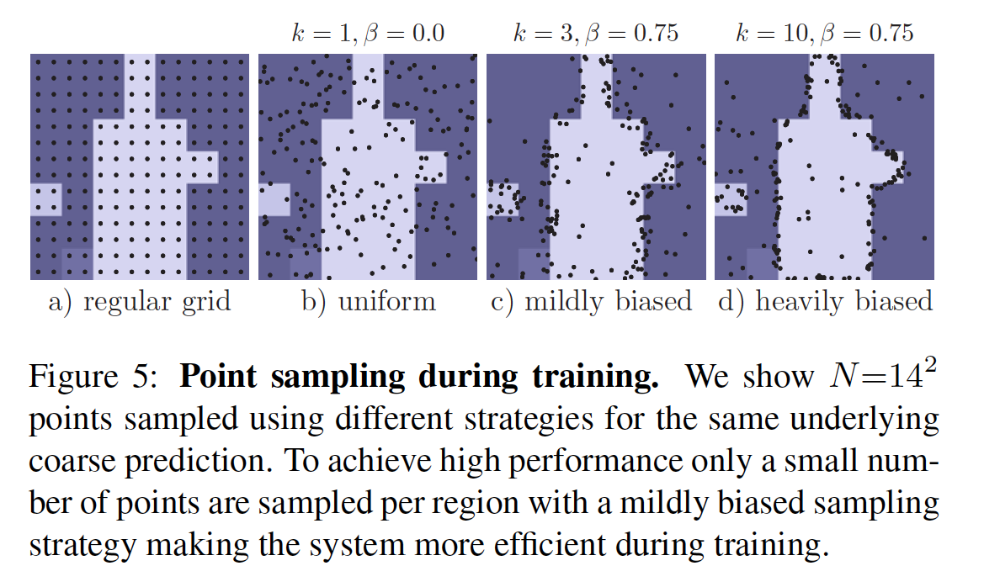

​		在训练时，仅在$N$个采样点（除粗糙分割外）上计算预测和损失函数，这比通过细分步骤进行反向传播更简单，更有效。这种设计与Faster R-CNN系统中的RPN+Fast R-CNN并行训练相似，它的推理是依次的。

#### 3.2. Point-wise Representation and Point Head

​		PointRend通过结合（例如concatenating）两个特征类型（细粒度和粗糙预测特征）在所选的点上构建*point-wise features*，如下所述。

**Fine-grained features**	为了允许PointRend渲染精细的分割细节，我们在CNN特征图的每个采样点上提取特征向量。因为一个点是一个实值2D坐标，我们在特征图上执行双线性插值来计算特征向量，这遵循[22、19、10]中的标准实践。可以从单个特征图上提取特征（例如ResNet中的$res_2$）；还可以从不同特征图上提取特征（例如$res_2$到$res_5$，或者它们的特征金字塔），并拼接它们，这遵循Hypercolumn方法[17]。

**Coarse prediction features**	细粒度的特征可以解析细节，但在两个方面也有不足。首先，它们不包含特定于区域的信息，因此被两个实例的边界框重叠的同一点将具有相同的细粒度特征。但是，该点只能位于一个实例的前景。因此，对于实例分割任务，其中不同区域可能为同一点预测不同的标签，需要额外的区域特定的信息。

​		其次，取决于用于细粒度特征的特征图，这些特征可能只包含相对较低级别的信息（例如，我们将对$res_2$与DeepLabV3一起使用）。在这种情况下，具有更多上下文和语义信息的特征源可能会有所帮助。这个问题影响实例和语义分割。

​		基于这些考量，第二特征类型是来自网络的粗糙分割预测，即表示$K$类预测的区域（方框）中的每个点处的$K$维向量。通过设计，粗糙分辨率提供更全局的上下文，而通道传播语义类。这些粗略的预测与现有架构的输出相似，并且在训练过程中以与现有模型相同的方式进行监督。对于实例分割，粗略预测可以是如Mask R-CNN中轻量级$7\times7$分辨率掩膜头部的输出。对于语义分割，它可以是如步长为16的特征图的预测。

**Point head**	给定每个选择点的逐点特征表示，PointRend使用简单的多层感知机（MLP）作出逐点分割预测。这个MLP在所有点（以及所有区域）共享权重，与图卷积[23]或PointNet[43]类似。由于MLP预测每个点的分割标签，所以它可以通过标准的任务特定的损失训练。

### 4. Experiments:  Instance Segmentation

**Dataset**	我们使用两个标准的实例分割数据集：COCO和Cityscapes。我们报告了标准掩膜AP度量[29]，其中COCO使用3次运行，Cityscapes使用5次运行（中位数较高）。

​		COCO有实例级标注的80个类。我们在$\mbox{train2017}$（大约118k图像）上训练模型，并报告$\mbox{val2017}$（5k图像）上的结果。如[16]提到的，COCO的ground-truth通常是粗糙的，数据集的AP通常不能完整反映掩膜质量的改进。因此，我们用LVIS [16]的80个COCO类别子集测量的AP来补充COCO结果（用$\mbox{AP}^\star$表示）。LVIS标注的质量明显更高。注意，对于$\mbox{AP}^\star$，我们使用COCO上训练的相同模型，并使用LVIS评估API对更高质量的LVIS注释重新评估其预测。

​		Cityscapes是一个以自我为中心的街道场景数据集，具有8个类别，2975个训练图像和500个验证图像。Cityscapes的图像（$1024 \times 2048$）有比COCO更高的分辨率以及更精细、更准确的ground-truth实例分割。

**Architecture**	我们的实验使用具有ResNet-50+FPN骨干的Mask R-CNN。Mask R-CNN中默认的掩膜头部是逐区域的FCN，我们表示为“4x conv”（四层256个输出通道的$3\times3$卷积用于$14 \times 14$的输入特征图。$2 \times 2$的反卷积将其转换为$28\times28$。最后，使用$1\times1$卷积预测掩膜loggits）。特别地，对于每个边界框，我们使用双线性插值从FPN的$P_2$层提取$14\times14$的特征图。在边界框内部的规则网格上计算特征（该操作看起来是RoIAlign的简单版本）。接着，我们使用256个输出通道的步长为2的$2\times2$卷积层，接着是ReLU，这将空间大小减小到$7\times7$。最后，与Mask R-CNN边界框头部相似，对于$K$个类中的每一个，使用两个1024个隐藏单元的MLP来产生$7\times7$的掩膜预测。将ReLU用于MLP的隐藏单元，sigmoid激活函数用于其输出。

**PointRend**	在每个选择的点，使用双线性插值从粗糙的预测头部的输出上提取$K$维的特征向量。PointRend还从FPN的$P_2$层插值一个256维的特征向量。相对于输入图像，该层的步长为4。拼接这些粗糙的预测和细粒度的特征。我们使用3层具有256的通道的MLP来在所选择的点上作出$K$类预测。在MLP的每层中，我们用$K$个粗糙预测特征补充256个输出通道，以形成下一层的输入向量。我们在MLP内部使用ReLU，并将sigmoid用于其输出。

**Training**	默认情况下，我们使用Detectron2的标准的1倍训练计划和数据增强。对于PointRend，我们使用有偏采样策略（3.1节中$k=3$和$\beta=0.75$）采样$14^2$个点。我们将0.5与距离粗略预测插值的ground-truth类别的概率之间的距离用作点不确定性度量。对于ground-truth类$c$的预测边界框，我们将$14^2$个点上第$c$个MLP输出的二进制交叉熵损失相加。轻量级的粗糙预测头不使用针对类$c$预测的掩膜的平均交叉熵损失，即与基线“4x conv”具有相同的损失。

​		训练期间，并行地将Mask R-CNN用于边界框和掩膜头部，而推理期间级联地运行它们。我们发现，作为级联进行的训练不会改善基线Mask R-CNN，但是PointRend可以通过在更准确边界框内对点进行采样而从中受益，从而略微提高了综合性能（0.2％AP，绝对值）。

**Inference**	对于预测类$c$的边界框中的推理，除非其他说明，我们使用自适应的细分技术在5个步骤中将类$c$的粗糙的$7\times7$预测精炼到$224 \times 224$。在每个步骤中，我们基于预测和0.5之间的绝对差值，选择并更新（最多）$N=28^2$个最不确定的点。

#### 4.1. Main Results

​		在表1中，我们比较了PointRend和Mask R-CNN的“$4 \times$ conv”头部。

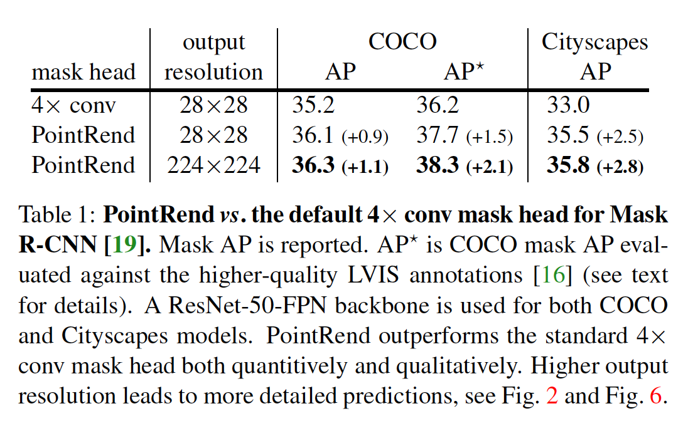

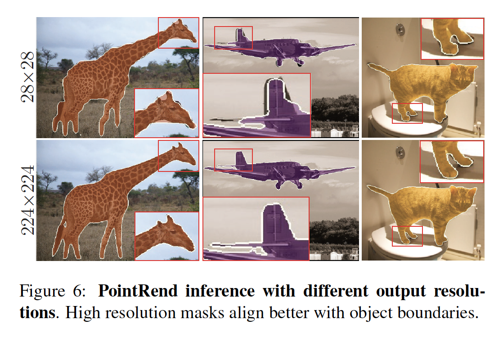

**Subdivision inference** 允许PointRend使用比默认的4x conv头不输出相同分辨率（基于$112\times112$ 的RoIAlign输入）所需的默认4x conv头不少超过30倍的计算（FLOPs）和内存，从而产生高分辨率$224\times224$预测， 参见表2。通过忽略目标的粗糙预测充足的区域（例如，远离对象边界的区域），PointRend使在Mask R-CNN框架中实现高分辨率输出成为可能。就运行时间而言，我们未优化的实现以13 fps的速度输出$224\times 224$掩膜，这与修改为输出$56\times56$掩膜的4x conv的帧率大致相同（通过将默认RoIAlign大小加倍） ，与$28\times28$的4x conv头部相比，该设计实际上具有较低的COCO AP（34.5％对35.2％）。

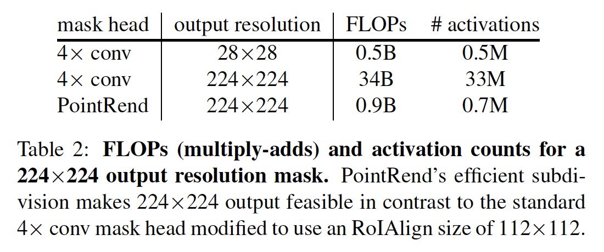

​		表3展示了不同输出分辨率和每个细分步中选择的点数的PointRend细分推理。更高分辨率上预测掩膜可以改善结果。尽管AP饱和，但从较低（例如$56\times56$）分辨率移到较高（例如$224\times224$）分辨率输出时，视觉效果仍然明显可见，见图7。AP也将在每个细分步骤中采样的点数饱和，因为首先要在最模糊的区域中选择点。附加点可以在粗糙预测已经足够的区域中进行预测。 但是，对于具有复杂边界的目标，使用更多点可能是有益的。

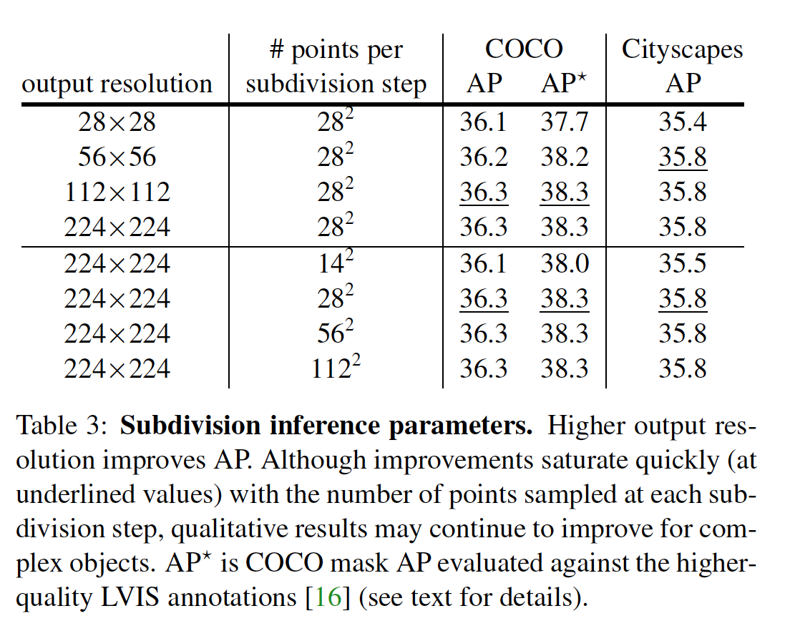

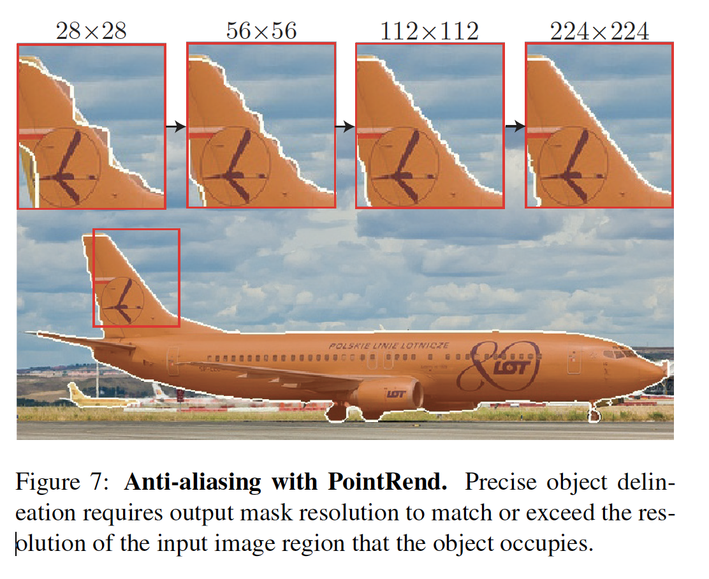

#### 4.2. Ablation Experiments

**Point selection during training**	训练期间，我们为每个目标选择$14^2$个点，遵循3.1节的有偏采样策略。仅采样$14^2$个点可以提高训练的计算效率和内存效率，我们发现使用更多的点不会改善结果。令人惊讶的是，尽管我们观察到AP的方差有所增加，但每个边界框仅采样49个点仍然可以维持AP。

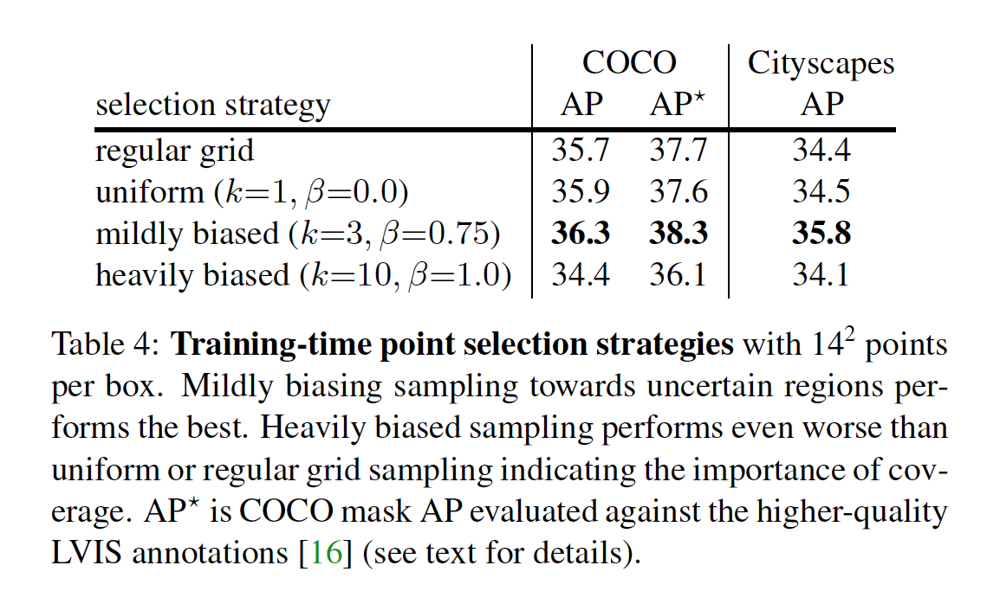

​		表4显示了在训练过程中使用不同选择策略的PointRend性能。规则网格选择获得与均匀采样相似的结果。而倾向于模糊区域的有偏采样干山了AP。然而，偏向粗略预测的边界（$k> 10$且$\beta$ 接近1.0）的采样策略会降低AP。总体而言，我们发现各种各样的参数$2 <k <5$和$0.75 <\beta<1.0$都能产生相似的结果。

**Larger models, longer training.**	用COCO的1个进度训练ResNet-50 + FPN（表示为R50-FPN）。在表5中，我们显示了PointRend在基线上的改进，包括更长的训练时间表和更大的模型（有关详细信息，请参见附录）。

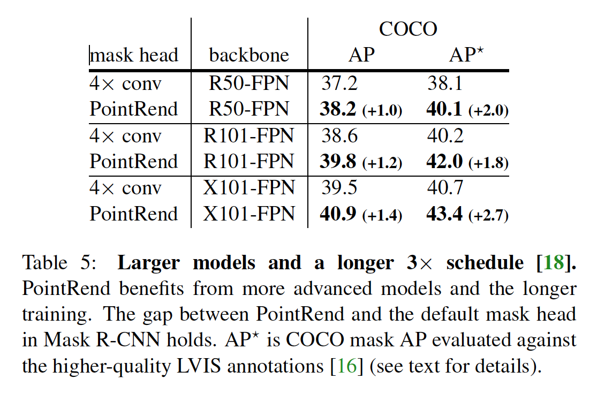

### 5. Experiments: Semantic Segmentation

​		PointRend不限于实例分割，还可以扩展到其他像素级识别任务。 在这里，我们证明PointRend可以受益于两个语义分割模型：DeeplabV3 [5]（它使用膨胀卷积在更密集的网格上进行预测），以及SemanticFPN [24]（一种简单的编码器-解码器体系结构）。

**Dataset**	我们使用具有19个类别、2975个训练图像和500个验证图像Cityscapes [9]语义分割集。 我们报告了5次试验的中位数mIoU。

**Implementation details**	我们重新实现了DeeplabV3和SemanticFPN。SemanticFPN使用标准的ResNet-101，而DeeplabV3使用ResNet-103[5]（$res_1$中的$7\times7$卷积替换为三个$3\times3$卷积，因此为“ResNet-103”）。我们遵循原始论文的训练安排和数据增强（细节见附录）。

​		我们使用相同的PointRend架构用于实例分割。粗糙的预测特征来自语义分割模型的（已经是粗糙的）输出。从DeeplabV3的$res_2$和SemanticFPN的$P_2$插值细粒度特征。在训练期间，我们对输入的步幅16特征图上的点进行采样（对于deeplabV3为2304，对于SemanticFPN为2048）。我使用相同的$k=3$、$\beta=0.75$的点选择策略。推理期间，细分使用$N=8096$（即$1024 \times 2048$的图像的步长为$16$的特征图中的点数）知道达到输入图像的分辨率。为了测量预测的不确定性，我们在训练和推理期间使用相同的测量：最可信和第二可信的类概率之差。

**DeeplabV3**	在表6中，我们比较了DeeplabV3和具有PointRend的DeeplabV3。通过在$res_4$阶段使用膨胀卷积，推理期间的输出分辨率也可以增加2倍，如[5]所述。二者间的比较，PointRend有更高的mIoU。量化改进也很明显，请参见图8。

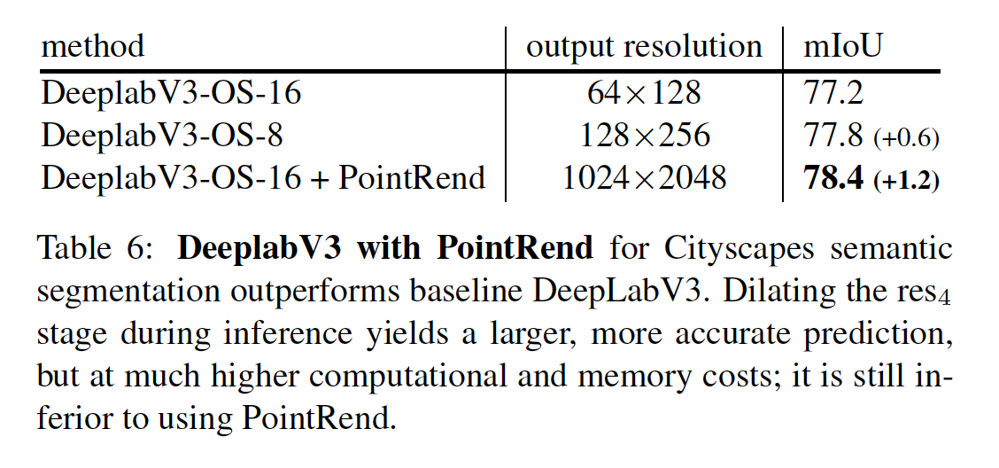

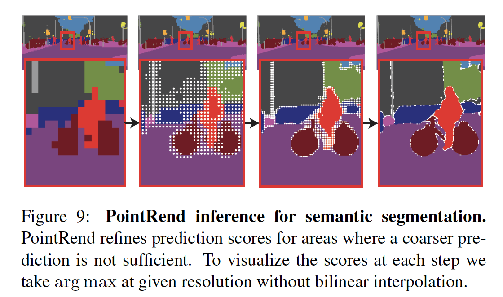

**SemanticFPN**	表7显示，具有PointRend的SemanticFPN相对于不具有PointRend的8倍和4倍输出步长变体均有所改善。

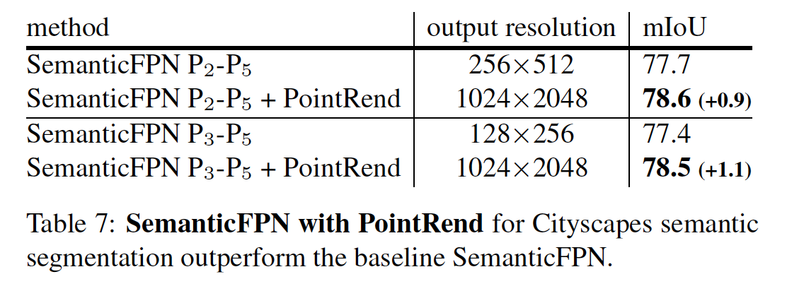

### Appendix A.  Instance Segmentation Details

​		我们使用0.9 momentum的SGD；应用从0.001的学习率开始的1000多个更新的线性学习率预热[15]； 施加权重衰减0.0001； 水平翻转和缩放训练时数据增强； ImageNet预训练模型的批次归一化（BN）[21]层被冻结（即不使用BN）； 不使用测试时间扩充。

**COCO：**每个mini-batch包含16张图像；训练安排为60k / 20k / 10k更新学习率分别为0.02 / 0.002 / 0.0002；训练图像随机调整到短边为640到800像素（步长为32个像素），推理图像调整到短边为800像素。

**Cityscapes：**每个mini-batch包含8张图像，训练调度为18k/6k分别更新学习率为0.01/0.001；训练图像的短边调整为800到1024个像素（步长为32个像素），推理图像调整为短边为1024个像素。

**Longer schedule：**对于COCO，$2\times$的调度为学习率在210k/40k/20k后分别调整为0.02/0.002/0.0002；其他细节如上。

### Appendix B.  Semantic Segmentation Details

**DeeplabV3：**我们使用0.9 momentum的SGD，mini-batch大小为16，图像裁剪到$768\times768$的固定大小；训练时间表是90k更新，采用poly学习率[34]更新策略，从0.01开始；使用从0.001开始的线性1000次学习率预热；ASPP和预测卷积的学习率乘以10；权重衰减为0.0001；使用随机水平翻转，$0.5\times$和$2.0\times$（32个像素步长）的缩放；使用BN，没有使用测试时数据增强。

**SemanticFPN：**我们使用0.9 momentum的SGD，mini-batch大小为32，图像裁剪到$512\times1024$的固定大小；训练安排为40k / 15k / 10k更新学习率分别为0.01 / 0.001/ 0.0001；使用从0.001开始的线性1000次学习率预热；权重衰减为0.0001；使用随机水平翻转、颜色增强和裁剪；训练时缩放将图像以步长32调整为$0.5\times$到$2.0\times$；冻结BN层（即不使用BN）；不使用测试时增强。