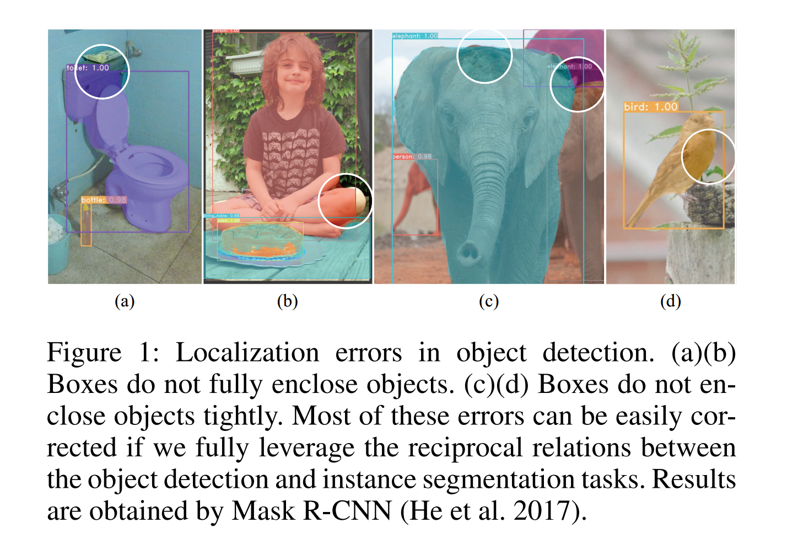
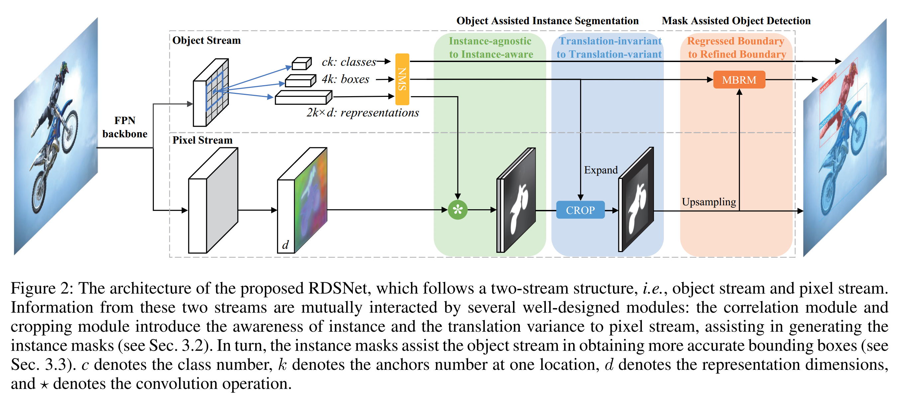
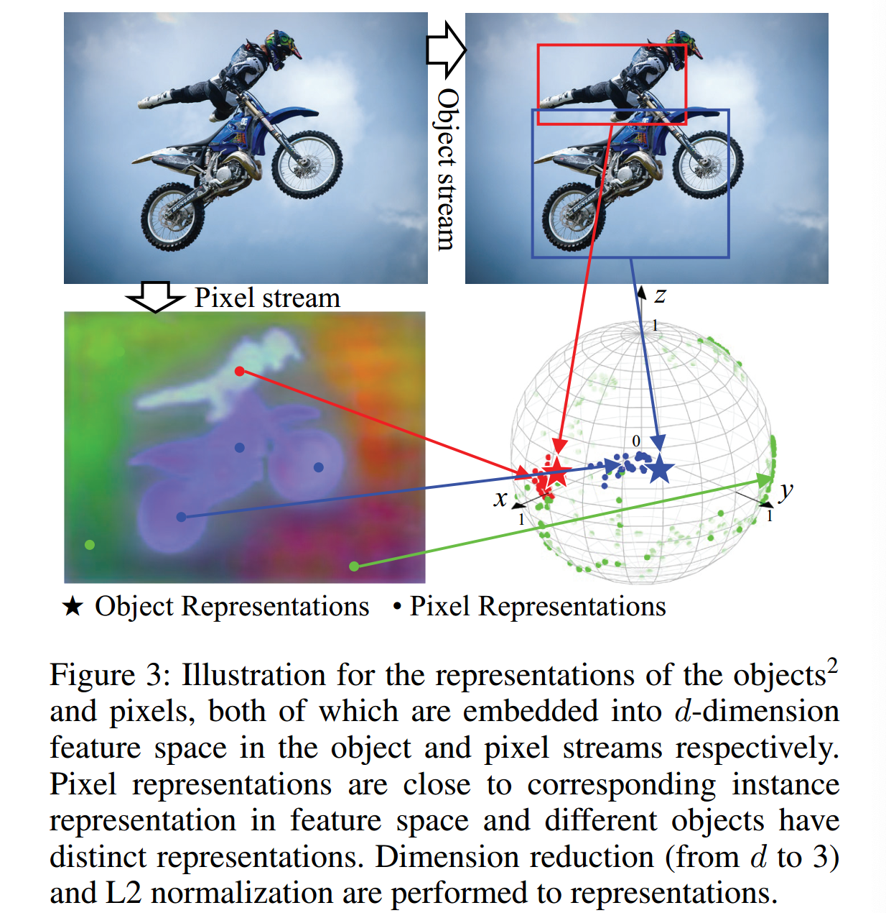
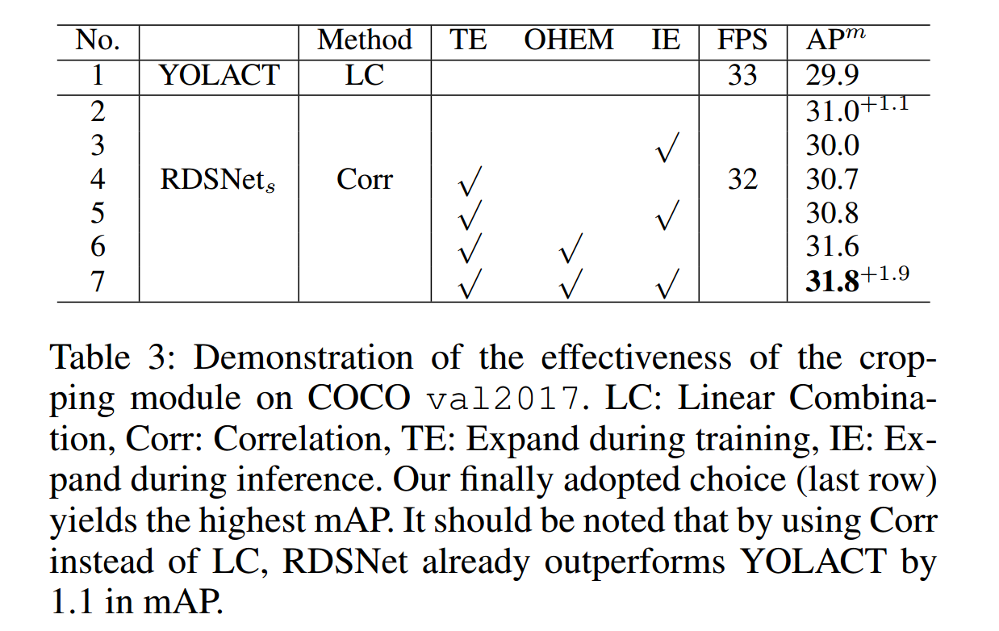
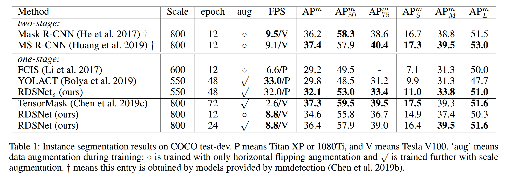
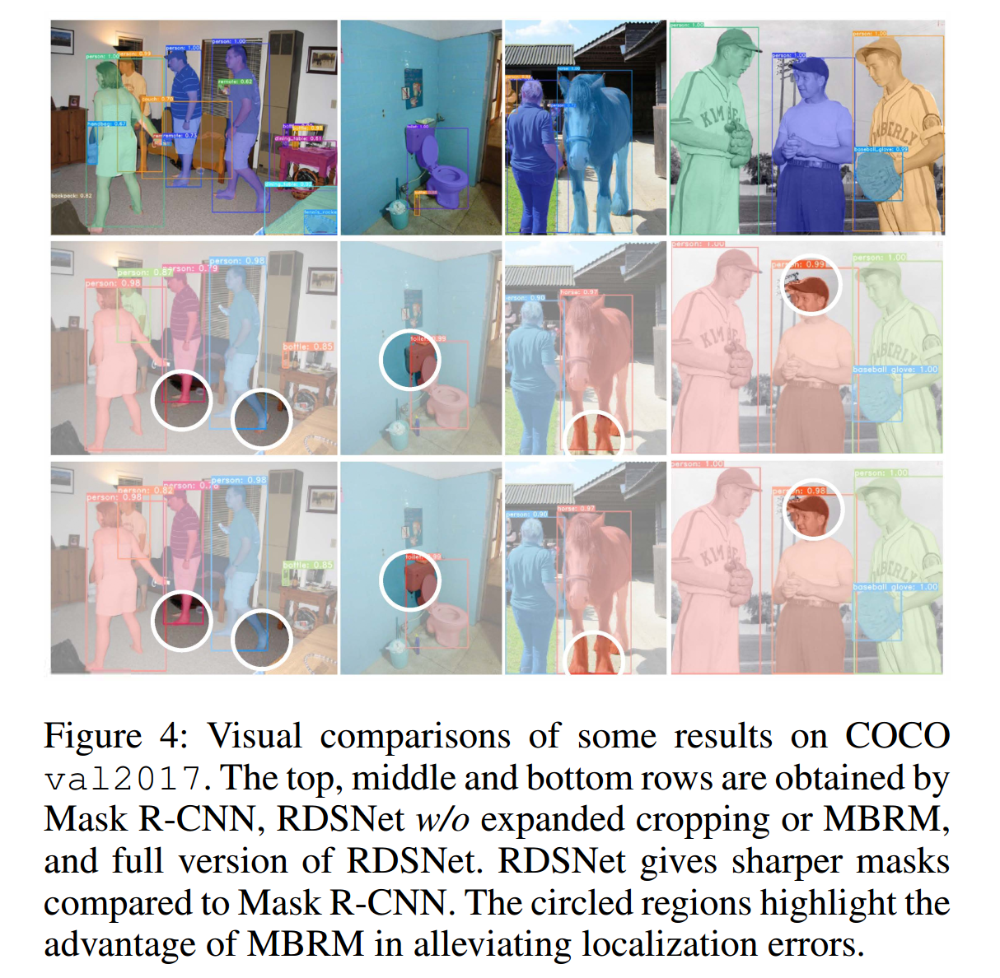
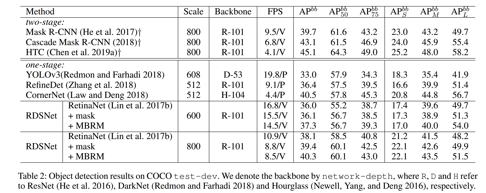
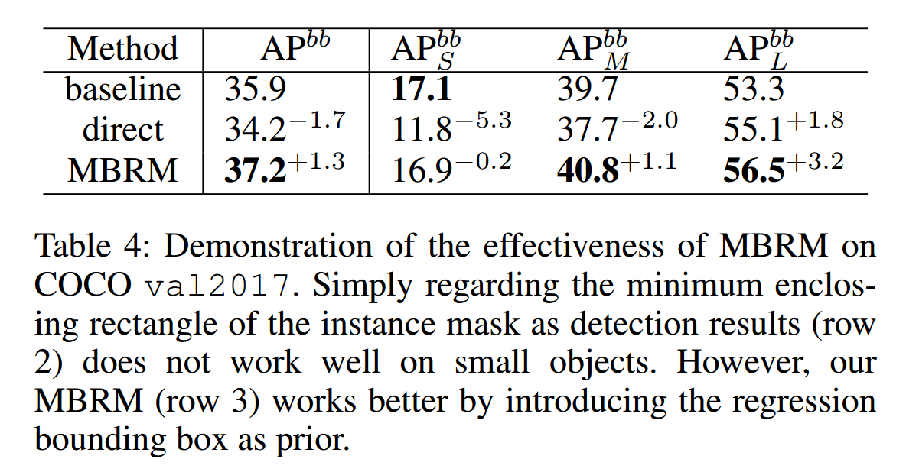
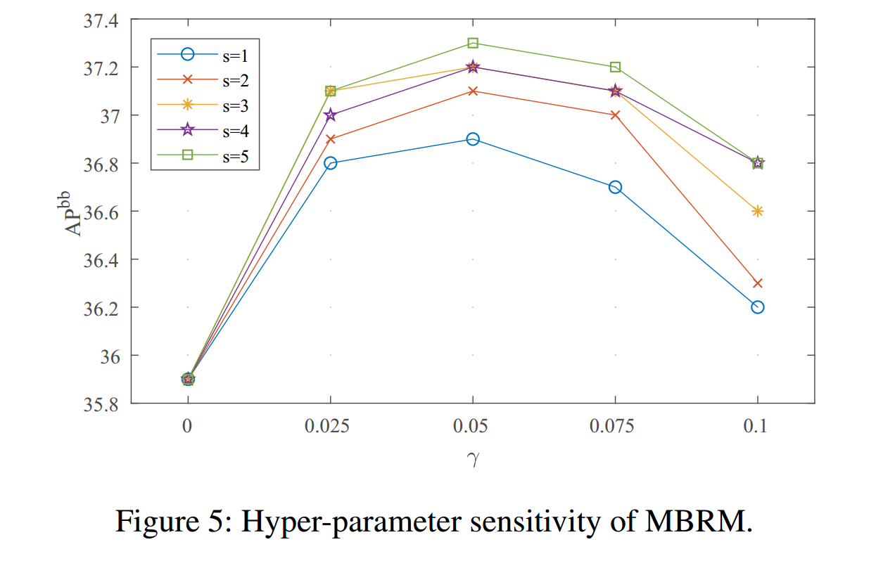

### RDSNet: A New Deep Architecture for Reciprocal Object Detection and Instance Segmentation

#### 摘要

目标检测和实例分割是两个基本的计算机视觉任务。它们紧密相关，但是，在大多数先前工作中，它们的关系还未被完全探索。本文提出RDSNet，它是互惠目标检测和实例分割的新颖深度架构。为了完成这两项任务，本文设计了一种双流结构，以共同学习对象级别（即边界框）和像素级别（即实例掩膜）的特征。在这一结构中，来自双流的信息交替融合，即目标级别上的信息引入实例感知和平移不变性到像素级，并且像素级信息相反精炼目标的定位准确率。具体而言，提出了相关模块和裁剪模块以生成实例蒙版，以及用于更精确边界框的基于蒙版的边界细化模块。在COCO数据集上的广泛分析和比较论证了RDSNet的有效性和效率。

#### 1 引言

​		目标检测和实例分割是计算机视觉中两个基本和紧密相关的任务，分别专注目标级和像素级上的渐进图像理解。目标检测的目标是定位具有矩形边界框的每个目标，并将其分类到特定的类别。在此项任务中，最关键的挑战之一是目标定位，即包含性和紧密边界框的规范。如图1所示，在许多最先进的方法中通常都可以看到，定位误差很容易降低其性能。定位误差主要产生于使用回归方法来获取边界框的机制，如逐点回归是没有直接的完整目标的感知。为此，将目标定位转换为像素级任务更加合理，其与边界框（即目标掩膜的最小包围矩形）的定义一致。因此，如果提供目标掩膜，根据掩膜会更加直接和准确地获得边界框。

​		实例分割旨在进一步预测每个目标（除类别外）的每像素的二值掩膜。实例分割的核心思想是引入实例感知像素类别。当前，大多数已有的方法遵循两阶段范例（例如Mask R-CNN），即每个检测提议单独生成掩膜。以这种方式，掩膜自然感知单个目标实例。然而，这种逐步的过程使得掩膜严重依赖于检测器获得的边界框，并且容易受到其定位误差的影响。此外，如RoI池化的操作的使用极大地限制了大型目标的掩膜的分辨率。FCIS模型为实例感知分割引入位置敏感图，但是产生的掩膜仍然受检测结果的限制。其他一些方法摆脱了检测器的限制，但准确性较差。这些缺点的根源主要在于目标级信息的利用不足和不合适。

​		根据上述分析，目标检测和实例分割具有彼此受益的不可忽略的潜力。不幸的是，鲜有工作关注它们之间的关系。HTC是一种代表性工作，其采用两个任务的渐进式精炼，并获得有前途的结果。然而，如此多阶段的设计带来相对较高的计算成本。

​		这项工作中，作者提出**R**eciprocal Object **D**etection and **S**egmentation **Net**work（RDSNet）来利用这两项任务之间的关系。RDSNet采用双流架构，即目标流和像素流。从这两个流中同时提取特征，然后彼此交替融合。具体而言，目标流关注目标级特征，并基于回归的检测器组成，而像素流专注像素级特征，并遵循FCN架构以确保高分辨率输出。为了利用目标流的目标级线索，提出了相关模块和裁剪模块，它们给像素流引入实例感知和平移不变属性，并产生实例感知分割掩膜。接着，提出了一种基于掩膜的边界细化模块，以在像素流的帮助下缓解定位误差，即基于实例掩膜产生更准确的边界框。

​		RDSNet充分考虑目标检测和实例分割之间的互惠互利关系。与前面的方法相比，有如下三个优势：1）由RDSNet生成的掩膜对于不同尺度的目标具有一致的高分辨率；2）得益于巧妙的裁剪模块，掩膜对检测结果的依赖性降低；3）通过目标级边界框位置的新颖像素级表示，可以获得更准确、更严格的边界框。

​		本文的主要贡献是探索目标检测任务和实例分割任务之间的相互作用，并提出了一种端到端的统一架构RDSNet，以相互利用这些目标级任务和像素级任务，从而证明了多任务融合概念的潜力。

#### 3 RDSNet

##### 3.1 Two-stream structure

​		RDSNet的核心是双流结构，即目标流和像素流。这双流共享FPN骨干，然后单独执行相应任务。这种并行结构可以实现对象级和像素级信息的解耦，以及针对不同任务的可变分辨率。

**Object Stream.** 目标流关注目标级信息，包括目标类别、位置等。它可由各种基于回归的的检测器组成。此外，作者添加了与分类和回归分支并行添加一个新分支，以提取每个锚点（或位置）的对象特征。该流负责产生检测结果，随后将通过像素级信息对其进行完善（请参见第3.3节）。

**Pixel Stream.** 像素流感住像素级信息，并遵循FCN（2015）设计的高分辨率输出。具体来说，在此流中提取每个像素的特征，然后通过利用目标级信息将其用于生成实例掩膜（请参见第3.2节）。

##### 3.2 Object Assisted Instance Segmentation

**From Instance-agnostic to Instance-aware.** 实例分割的目的是将实例感知的类别分配给每个像素，但是，由于2D图像平面中目标的数量和位置的不确定性，经常会出现模棱两可的情况，即无法使用像素的预定义类别。适当的解决方案是利用目标级信息来引入实例感知。为此，**相关模块（correlation module）被设计为根据像素表示之间的相似性将每个像素链接到其对应的实例，分别从对象流和像素流中学习**。

​		给定目标$o$，使用$\phi(v_o)\in \Bbb{R}^{2\times d \times 1 \times 1}$表示其表征，其中$v_o$表示来自目标流的目标的特征，而$d$为表示的维度。$\phi(v_o)$的维度2表示目标同时考虑前景和背景。相似地，将整幅图像的像素表征表示为$\Psi(U)\in\Bbb{R}^{1\times d \times h_f \times w_f}$，其中$U$表示来自像素流的特征，$h_f$和 $w_f$为$\Psi(U)$的空间维度。

​		相关模块（correlation module）主要是衡量$\phi(v_o)$和$\Psi(U)$之间的相似性。相关运算（correlation operation）定义为

$$M_o=softmax(\Psi(U) \star \phi(v_o)),\tag{1}$$

其中$\star$表示卷积算子。相似度图$M_o\in\Bbb{R}^{2 \times 1 \times h_f \times w_f}$可视为与目标$o$对应的每个像素的前景和背景的概率。在训练阶段，将逐点的交叉墒损失附加到$M_o$之上。对于图像中的所有像素，分别并同步地重复相关运算。相关模块确保掩膜生成器可以端到端的训练。从某种意义上讲，**本文的具有相关性的方法的训练过程类似于度量学习（Fathi et al.2017），即将前景像素的表示拉向特征空间中其对应的目标的表示，并将背景像素的表示推开 **，如图3所示。

**From Translation-invariant to Translation-variant.** 与主要的两阶段实例分割方法不同，由上述相关模块为覆盖整幅图像的每个目标生成掩膜，而与目标的大小和位置无关。这样的特性保证了高分辨率的结果，但是**容易产生噪声**。这一个缺点极大的归因于卷积的平移不变性：**尽管任意两个具有相似外观的像素属于不同的实例或背景，但是它们倾向具有相似的表示**。由于像素表示中缺乏空间信息，该特性使得难以直接排除噪声。幸运的是，仅仅通过使用目标流产生的边界框可以克服这一缺点，这是因为它们可以提供恰当的空间限制（spatial restrictions）。具体而言，对于每个目标，边界框外的像素直接设置为背景，并在训练期间将其忽略。如此裁剪策略将实例掩膜限制到边界框的内部区域，并且尽管远离边界框的像素有相似的外观，但它们不会包含在边界框内。 但是，**仅用这种边界框进行裁剪会使实例掩膜遭受检测结果的定位误差（如图1（a）（b）所示）的影响，并且出乎意料地导致检测结果与分割结果之间的强耦合关系。**

​		为了处理这个问题，通过用扩展的边界框裁剪掩膜来做出折衷。在推理期间，这种策略保证了掩膜对边界框的依赖性相对较低，并且足够远的像素包含在掩膜中。此外，**使用扩展的边界框进行裁剪可以在训练过程中合理分配负像素**。两种极端情况（即不进行裁剪和不进行扩展就裁剪）均对我们的任务有害，因为过多的多样性分别导致收敛困难，而多样性不足则导致特征空间不足。

​		应当注意，使用扩展的边界框进行裁剪会使训练期间每个目标涉及更多的背景像素，从而使背景像素很容易在训练过程中占主导地位。为了在前景和背景之间保持可管理的平衡（在我们的实验中为 $1:1$ ），采用了针对背景像素的在线难样本挖掘（OHEM）（Shrivastava，Gupta和Girshick 2016）。

##### 3.3 Mask Assisted Object Detction

本节介绍如何利用像素级信息来增强检测结果。根据前面的分析，像素级信息有潜力让检测任务受益，特别是目标边界的定位。为此，作者基于贝叶斯理论开发了一种新的边界定位公式。这种公式中，作者全面利用了从目标流和像素流获得的边界框和实例掩膜，以获取每个目标的更准确的边界框。基于这种公式，提出基于掩膜的边界精炼模块（mask based boundary refinement module：MBRM）。

**Mask Based Boundary Refinement Module.** **边界框最初定义为目标的最小包围矩阵，其表示边界绝对取决于实例掩膜覆盖的区域。** 从这个意义上讲，已有的目标检测方法中，通过回归方法获取边界框似乎不是直接的。相反，如果提供实例掩膜，那么一种非常直接的解决方法是使用掩膜的最小包围矩形作为检测结果。这实际上是本文称为_direct_的基线。这种情况下，回归边界框仅用于像素流中的掩膜生成。

​		尽管回归边界框可能包含定位误差，但是某种程度上来所它们仍为目标边界位置提供合理的先验。因此，本文的公式联合利用检测和分割结果。**具体而言，作者讲一个边界的坐标视为离散随机变量。从概率的角度来讲，目标边界位置该边界定位的坐标概率的_argmax_，即**

$$x = \arg\max_i{P(X=i|M')},\tag{2}$$

其中$X$是左边界的水平坐标的离散随机变量，$M'\in \Bbb{R}^{h\times w}$为公式（1）的$M$的前景通道，其上采样至输入图像大小$h \times w$，而size 1的所有维度都被移除，$P(X=i|M')$表示给定相应实例掩膜$M'$的后验概率。

​		接下来，作者仅以左边界的推导为例，并且很容易扩展到其他边界。根据贝叶斯原理，有

$$P(X=i|M')=\frac{P(X=i)P(M'|X=i)}{\sum_{t=1}^wP(X=t)P(M'|X=t)},\tag{3}$$

其中$P(X=i)$和$P(M'|X=i)$为相应的先验和似然概率。

​		假设边界仅与$M'$中每行的最大值相关，并且它仅影响其相邻像素，似然概率定义为

$$\begin{align}P(M'|X=i)&=P(m^x|X=i) \tag{4}\\&=P(m_{i-s,\cdots,i+s}|X=i), \tag{5}\end{align} $$

其中$m_i^x=\max_{1\le j\le h}M_{ij}'$，而$s$是一个超参数，它描述边界对相邻像素的影响范围。理想上，边界中的一个像素仅影响其两个相邻像素，即边界框外的像素的概率为0，而边界内的像素概率为1。这种情况下，$s=1$。然而，实例掩膜并不那么尖锐，因此很难为$P(m_{i-s,\cdots,i+s}^x|X=i)$提供合适的公式。因此，作者利用核大小为$2s+1$的一维卷积估计这个公式，接着是一个sigmoid函数进行归一化，并且参数通过反向传播学习。

​		对于$P(X=i)$，简单地采用离散高斯分布

$$P(X=i)=\alpha e^{-(i-u)^2/2\sigma_x^2}, \tag{6}$$

其中$\alpha$是归一化系数。显然，边界位置的分布与实例尺度相关，因此设置

$$u=x_r,\sigma_x=\gamma w_b, \tag{7}$$

其中，$w_b$表示边界框的我宽度，$x_r$表示回归的左边界的水平坐标，而$\gamma$指定回归边界的权重。可以看出，更小的$\gamma$表明回归的边界有更高的权重，反之亦然。

​		训练期间，ground-truth边界沿着图像的宽度或高度方向转换为one-hot形式，并使用交叉熵损失训练上述的坐标分类任务。

##### 3.4 Training and Inference

​		利用如下的多任务损失训练模型：

$$L=L_{cls} + \lambda_xL_{reg} + \lambda_mL_{massk},\tag{8}$$

其中$L_{cls}$和$L_{reg}$是检测任务中常用的分类和回归损失（Ren等2015；Lin等2017b），并且$L_{mask}$是3.2节中描述的逐点交叉熵损失。**仅正类锚（与ground-truth框匹配的）的表征被馈入相关模块以生成实例掩膜，其然后根据扩展的ground-truth框进行裁剪，并用于计算$L_{mask}$。换句话说，扩展边界框外的像素在$L_{mask}$中忽略**。$L_{refine}$为3.3节中定义的交叉熵损失。$\lambda_r$和$\lambda_m$为损失重新加权的超参数。在使用$L$将所有其他参数训练收敛之后，使用$L_{refine}$单独地训练MBRN中的参数。理由是MBRM仅需要相对良好的回归边界框和实例掩膜。

​		**推理期间，首先通过目标流中的检测器获得目标类别和边界框，以及每个实例的表征。然而，像素表征在像素流中生成。接着，仅NMS之后的提议在相关模块中处理，从而生成实例掩膜，然后将其与检测器获得的扩展框一起裁剪。为了获得确切的坐标，这样的实例掩膜被上采样值输入图像大小，然后馈入MBRM。最后，掩膜通过阈值0.4二值化。**

#### 4 Experiments

​		本节中，进行实验分析和比较以论证目标检测和实例分割任务之间的互利关系。作者报告了COCO数据集上的结果，并使用常用的目标检测度量（$AP^{bb}$）和实例分割度量（$AP^m$）。在train2017上训练，并在val2017和test-dev上评估。

##### 4.1 Implementation Details

​		基于mmdetection实现RDSNet。使用具有FPN的ResNet-101作为骨干。除非另有说明，否则选择一个强大的一级检测器RetinaNet（Lin等人2017b）作为本文的检测器以及本文的基线，以验证本文方法的有效性。

​		对于像素流，作者采用PanopticFPN（Kirillov et al.2019）中语义分割分支的架构，将FPN金字塔合并为单个输出，即像素表示形式，不同之处在于将通道数修改为256以获取更丰富的表示形式。

​		实例和像素表征的维度为32。训练和推理期间，作者使用不同的边界框扩展比例裁剪掩膜。训练期间，作者使用ground-truth边界框，并在保留中心的情况下将它们的高和宽扩大1.5倍。推理期间，扩展比例设置为1.2。所有的$\lambda$设置为1。

​		在4个GPU上训练模型（每个GPU两张图像），并采用$1\times$的训练策略，其他设置与RetinaNet相同，然后MBRM中的参数单独训练1k次迭代。

##### 4.2 Object Assisted Instance Segmentation

​	本节中，作者首先验证相关和裁剪模块的有效性。作者将RDSNet与YOLACT（另一种一阶段实例分割方法）进行比较。与YOLACT中简单裁剪的线性组合方法相比，作者采用了YOLACT的主干和检测头，并将相关模块应用于扩展的裁剪策略（表示为$\mbox{RDSNet}_s$）。如表3所示。

​		然后，将RDSNet与实例分割的当前最佳方法进行比较。如表1所示，在所有的一阶段方法中，本文的方法在速度和准确率之间有更好的平衡。与两阶段方法相比，值得注意的是RDSNet很大程度上克服了Mask R-CNN固有的缺点，例如掩膜的低分辨率、边界框与掩膜的强依赖性等，如图1和图2所示。此外，作者认为RDSNet的速度受检测器速度的限制（RetinaNet为10.9fps）。如表2所示，RDSNet中的原始检测器只有很小的延迟。结果，通过切换到其他更快的检测器可以实现进一步的加速。

##### 4.3 Mask Assisted Object Detection

​		对于检测任务，RDSNet的关键之处是利用一阶段过程中的实例掩膜来精炼边界框。如表2所示，作者发现使用额外的掩膜生成器进行多任务训练确实可以在基线上带来一定程度的改善（RetinaNet（Lin et al.2017b）），但是MBRM可以以可忽略的计算成本实现进一步的持续改进。注意，增益全部来自边界的更准确的定位，而不是所有其他方面。为了公平比较，表格中仅显示没有测试时间增加的单个模型结果。

​		作者进一步在COCO val2017上分析MBRM中超参数的敏感性，即$s$和$\gamma$，如图5所示。当$\gamma=0$时，精炼模块不会被激活。作者观察到不同的$\gamma$产生不同的改进。当$\gamma$大约为0.05时变得稳定，因此本文实验中选择$\gamma=0.05$。$s$表示多远的像素仍会受边界的影响。较大的$s$可以在一定范围内获得更准确的结果，而进一步增大$s$不会带来太大的改善。

		然后，作者将MBRM与_direct_方法进行比较，如表