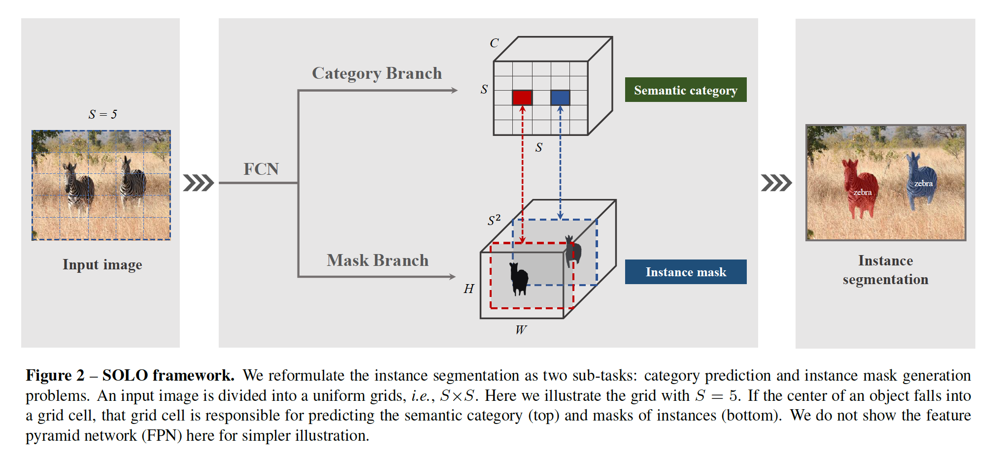
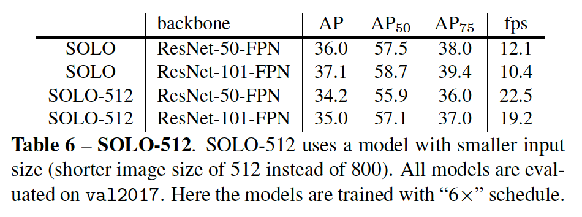

## SOLO: Segmenting Objects by Locations

### 摘要

​		我们提出一种新的、令人尴尬的简单方法来对图像中的实例进行分割。与许多其他密集预测任务（例如语义分割）相比，任意数量的实例使实例分割更具挑战性。为了预测每个实例的掩膜，主流方法要么遵循“先检测后分割”的策略（例如Mask R-CNN使用的），要么首先预测嵌入向量，然后使用聚类技术将像素分到单独的实例。通过引入“实例类别（instance categories）”的概念，我们从一个全新的角度看待实例分割的任务，其根据实例位置和大小将类别分配实例中的每个像素，因此很好的将实例掩膜分割转换为分类可解决的问题。现在，实例分割被分解为两个分类任务。我们展示了一个简单且灵活的实例细分框架，具有强大的性能，可通过Mask R-CNN达到同等的准确性，并且在准确性方面优于最近的单发实例分割器。我们希望这个非常简单而强大的框架可以作为实例分割以外的许多实例级识别任务的基准。

### 1. 引言

​		实例分割具有挑战性，因为它需要正确分离图像中的所有对象，同时还要在像素级别对每个实例进行语义分割。图像中的目标属于一组固定的语义类别，但是实例的数量不同。因此，语义分割可以轻松地公式化为密集的每像素分类问题，而直接按照相同的范式预测实例标签是具有挑战性的。

​		为了克服这个障碍，最近的实例分割方法可以分为两组，即top-down和bottom-up范式。前一个方法（称为“先检测后分割（detect-then-segment）”）首先检测边界框，然后分割每个边界框中的实例掩膜。后一种方法通过推开属于不同实例的像素并拉近同一实例中的像素来学习亲和关系，将嵌入向量分配给每个像素。然后，需要一种分组后处理来分离实例。这两种范式都是逐步的（step-wise）和不直接的（indirect），其要么严重依赖准确的边界框检测，要么依赖每像素的嵌入学习和分组处理。

​		相比之下，我们旨在直接分割实例掩膜，这在全部实例掩膜标注下的监督，而不是边界框中掩膜或额外的像素对关系。我们首先重新思考一个问题：_图像中的目标实例的基本差异？_以挑战性的MS COCO数据集为例。验证集中共有36780个目标，98.3%的目标对的中心距离大于30像素。至于剩下的1.7%的目标对，它们中的40.5%的尺寸之比大于1.5.这里，我们没有考虑少量如"x"形的两个目标。总之，在大多数情况下，图像中的两个实例具有不同的中心位置或具有不同的目标大小。这一发现使我们怀疑是否可以通过中心位置和目标大小直接区分实例？

​		在语义分割密切相关的领域，现在的统治范式利用一个全卷积网络（FCN）来输出具有$N$个通道的密集预测。每个输出通道式语义类别（包括背景）之一的响应。语义分割旨在区分不同的意义类别。类似地，在这项工作中，我们提出通过引入“instance categories”（即量化的中心位置和目标大小）的概念来区分图像中的目标实例，这保证通过位置分割目标（segment object by location），因此我们的方法称为SOLO。

​		我们所提出的SOLO的核心思想是通过位置和大小分离目标实例。

​		**Locations**	一幅图像可以划分为$S \times S$个单元的网格，因此产生$S^2$个中心位置类。根据目标中心的坐标，一个目标实例被分配到网格单元之一，作为其中心位置类别。与将掩膜打包到通道轴的DeepMask和TensorMask不同，我们将中心位置类别编码为通道轴，与语义分割中的语义类别相似。每个输出通道是中心位置类之一的响应，并且响应通道图应当预测属于那个类别的目标的实例掩膜。因此，在高度乘以宽度维的空间矩阵中自然而言地维持结构化几何信息。

​		本质上，实例类近似实例目标中心的位置。因此，通过将每个像素分类到其实例类别中，等效于使用回归从每个像素预测目标中心。在这里，将位置预测任务转换为分类而不是回归的重要性在于，通过分类，使用固定数量的通道对不同数量的实例进行建模更加简单明了，同时又不依赖于诸如分组或学习嵌入之类的后处理。

​		**Sizes**	为了区分不同目标大小的实例，我们采用FPN，以及将不同大小的目标分配给不同级别的特征图，作为目标大小类。因此，所有目标实例都会有规律地分开，从而可以通过“实例类别”对目标进行分类。注意，FPN旨在检测图像中不同大小的目标。

​		在后面，我们实验证明，FPN是该方法的核心组件之一，并且对分割性能（尤其是呈现的大小不同的目标）产生了深远的影响。

​		利用所提出的SOLO框架，我们能够仅使用掩膜标注以端到端的方式针对实例分割任务优化网络，并在定位框检测和像素分组的限制范围内执行像素级实例分割。注意，迄今为止，大多数实例分割方法都需要使用框标注作为监视信号之一。首次，我们展示了一种非常简单的实例分割方法，该方法在具有挑战性的具有各种场景和语义类的COCO数据集[12]上，与占主导地位的“先检测后分割”的Mask R-CNN [7]取得了同等的效果。 此外，我们通过实例轮廓检测的任务展示了我们框架的一般性，通过将实例边缘轮廓视为一个one-hot二进制掩膜，几乎不做任何修改，SOLO便可以生成合理的实例轮廓。所提出的SOLO仅需要解决两个像素级分类任务，类似语义分割。因此，有可能可以借用语义分割方面的一些最新进展来改善SOLO。本质上，SOLO通过离散量化将坐标回归转换为分类。这样做的一项壮举是避免了通常在诸如YOLO [22]之类的检测器中使用的启发式coordination normalization和对数变换。 所提出的SOLO方法的尴尬的简单性和强大的性能可以预测其在各种实例级识别任务中的应用。

### 2. 相关工作

​		我们回顾一些最接近我们方法的一些实例分割工作。

**Top-down Instance Segmentation**	在先验边界框中分割目标实例的方法属于典型的自上而下的范式。FCIS[10]在有RPN生成的RoI中集成位置敏感得分图以预测实例掩膜。Mask R-CNN通过添加一个在检测边界框中分割目标实例的分支来扩展Faster R-CNN检测器。基于Mask R-CNN，PANet进一步增强特征表示来提高准确率，Mask Scoring R-CNN添加mask-IoU分支来预测预测到的掩膜的质量，并对掩膜评分以提高性能。TensorMask[2]采用密集滑动窗口范式，以在局部窗口中，为具有预定数量的窗口和尺度的每个像素分割实例。与上述top-down方法相比，我们的SOLO是完全box-free，TensorMask [2]采用密集滑动窗口范例，以具有预定数量的窗口和比例的每个像素在本地窗口中分割实例。 与上述自上而下的方法相比，我们的SOLO完全没有盒装，因此不受（锚）边界框位置和尺度的限制，并且自然受益于FCN的固有优势。

**Bottom-up Instance Segmentation**	这类方法通过将像素分组为图像中呈现的任意数量的目标实例来生成实例掩膜。我们简要回顾最近的几种方法。[19]使用学习到的关联嵌入将像素分组为实例。判别式损失函数[5]友好地学习像素级实例嵌入，这通过推开属于不同实例的像素，拉近相同实例中的像素来完成。SGN[15]将实例分割问题分解为子分组问题序列。SSAP[6]学习pixel-pair affinity pyramid，并且通过级联图分区顺序生成实例。相比top-down方法，传统的bottom-up方法在准确率方面明显滞后。SOLO并没有利用像素对关系和像素分组，而是仅在训练过程中直接使用实例掩膜标注学习，并端对端预测实例掩膜和语义类别，而无需对后处理进行分组。 从这个意义上讲，我们提出的SOLO是一种直接的端到端实例分割方法。

**Direct Instance Segmentation**	据我们所知，之前没有仅使用掩膜标注直接训练的方法，并且在单发中预测实例掩膜和语义分类，而不需要分组后处理。最近几种提出的方法可以被视为“半直接（semi-direct）”范式。AdaptIS[24]首先预测点提议，然后依次为位于检测到的点提议处的目标生成掩膜。PolarMask[27]提出使用polar表示编码掩膜，并将每像素掩膜预测转换为距离回归。它们都不需要边界框来进行训练，但是要么是逐步的，要么是基于折衷的，例如，掩膜的粗略参数表示。我们的SOLO以全卷积、无边界框（box-free）和无分组（grouping-free）的范式，以图像作为输入，直接输出实例掩膜和对应的类概率。我们的简单网络可以端到端优化，而无需边界框监督。为了预测，网络直接将输入图像映射到每个单独实例的掩膜，这既不依赖如RoI特征裁剪的中间算子，也不需要分组后处理。

### 3. 我们的方法：SOLO

#### 3.1. Problem Formulation

​		给定任意图像，实例分割系统需要确定是否存在语义目标的实例；如果存在，则系统返回分割掩码。SOLO框架的中心思想是将实例分割重新表述为两个同时的类别感知预测和实例感知掩膜生成问题。具体来说，我们的系统将输入图像划分为均匀网格（即$S \times S$）。如果目标中心位于网格单元，则该网格单元负责1）预测语义类别以及2）对该目标实例进行分割。

##### 3.1.1	语义类别

​		对于每个网格，我们的SOLO预测$C$维输出来表明语义类的概率，其中$C$为类的数量。这些概率以网格单元为条件。如果我们将输入图像划分为$S \times S$网格，输出空间为$S \times S \times C$，如图2（top）。这种设计基于$S \times S$网格中的每个单元一定属于一个单独实例的假设，因此该单元仅输入一个语义类别。推理期间，$C$维输出表示每个目标实例的类概率。

##### 3.1.2	实例掩膜

​		与语义类别预测并行，每个正网格单元还将生成相应的实例掩膜。对于输入图像$I$，如果我们将它分为$S \times S$网格，总共有最多$S^2$的预测掩膜。我们在3D输出张量的第三维（通道）上显式编码这些掩膜。具体而言，实例掩膜会输出为$H_I \times W_I \times S^2$维。第$k$个通道负责分割网格$(i,j)$处的实例，其中$k = i\cdot S + j$（$i$和$j$是基于零的）。为此，在语义类别和与类无关的掩膜之间建立了一对一的对应关系（图2）。

​		一种直接预测实例掩膜的方法是采用全卷积网络，如语义分割中FCN。然而，一般的卷积操作一定程度上空间不变的。空间不变形是诸如图像分类的任务所需的，因为它引入了鲁棒性。但是，相反，这里，这里我们需要一个空间变化的模型，或者更精确地说，是位置敏感的模型，因为我们的分割掩膜以网格为条件，并且必须由不同的特征通道分开。

​		我们的解决方案非常简单，在网络开始时，我们直接将归一化的像素坐标馈入网络，这受“CoordConv”操作的启发。具体而言，我们创建于输入仙宫图空间大小的张量，其中包含像素坐标，并将其标准化为$[-1,1]$。然后，将这个张量串联到输入特征，并传入下一层。通过简单地给卷积访问其自己的输入坐标，我们将空间特征添加到常规FCN模型中。应当注意的是CoordConv不是仅有的选项。例如，半卷积运算[20]可能胜任，但是我们使用CoordConv是因为它简单易行。如果原始的特征张量的大小为$H \times W \times D$，新张量的大小变为$H \times W \times (D + 2)$，其中最后两个通道为$x-y$像素坐标。对于CoordConv的更多信息，请参考[14]。

**Forming Instance Segmentation**	在SOLO中，类预测和对应的掩膜通过它们的参考网格单元（即$k = i \cdot S + j$）自然而然地关联。基于此，我们可以为每个网格直接构成最终的实例分割结果。原始实例分割结果是通过聚集（gather）所有网格结果生成的。最后，使用NMS来获得最终的实例分割结果。不需要其他后处理操作。

#### 3.2. 网络架构

​		现在，我们SOLO框架中使用的网络。SOLO依附于卷积主干。我们使用FPN，其为每个级别生成具有固定通道数（通常为256-d）	的不同大小的特征图金字塔。这种特征图用作每个预测头的输入：语义类别和实例掩膜。头部在不同特征金字塔层上共享权重。不同金字塔的网格数量不同。在这个场景中，仅最后的$1 \times 1$卷积不是共享的。

​		为了证明我们的方法的通用性和有效性，我们利用多种架构实例化SOLO。这种差异包括：（a）用于特征提取的主干架构，（b）用于计算实例分割结果的网络头部，以及（c）用于优化模型的损失函数。大多数实验基于图3所示的头部架构。我们还利用不同的变体来进一步研究通用性。我们注意到，我们的实例分割头部有直接的结构。更复杂的设计有潜力提高性能，但是不是这项工作的重点。

#### 3.3. SOLO Learning

##### 3.3.1	Label Assignment

​		对于类别预测分支，网络需要给出$S \times S$网格的每一个的目标类别概率。具体而言，如果网格$(i,j)$位于任何ground-truth掩膜的中心区域，那么它被视为正样本，否则它为负样本。在最近的目标检测[26、9]中，中心采样是有效的，这里，我们还利用相似的技术进行掩膜类别分类。给定ground-truth掩膜的质心（mass center）$(c_x, c_y)$、宽度$w$和高度$h$，由常量尺度因子$\epsilon: (c_x, c_y, \epsilon w, \epsilon h)$控制中心区域。我们设置$\epsilon = 0.2$，每个ground-truth掩膜平均有3个正样本。

​		除了实例类别的标签外，对于每个正样本，我们都有一个二进制分割掩膜。因为有$S^2$个网格，对于每张图像，我们也有$S^2$个输出掩膜。对于每个正类样本，相应的目标二进制掩码将被注释。可能有人担心掩膜的顺序会影响掩膜预测分支，但是，我们表明，最简单的行优先（row-major）顺序对我们的方法很有效。

##### 3.3.2	Loss Function

​		我们将训练损失定义如下：

$$L = L_{cate} + \lambda L_{mask}, \tag{1}$$

其中$L_{cate}$为用于语义类别分类的Focal Loss。$L_{mask}$为用于掩膜预测的损失：

$$L_{mask} = \frac{1}{N_{pos}} \sum_k \mathbf{1}_{\{p_{i,j}^\ast > 0\}}d_{mask}(\mathbf{m}_k, \mathbf{m}_k^\ast),\tag{2}$$

这里，如果我们从左至右、从上至下索引网格单元（实例类别标签），那么索引$i = \lfloor k/S\rfloor$，$j = k \mbox{ mod } S$。$N_{pos}$表示正样本数，$\mathbf{p}^\ast$和$\mathbf{m}^\ast$分别表示类别和掩膜目标。$\mathbf{1}$为指示器函数，如果$p_{i,j}^\ast > 0$，指示函数为1，否则为0。

​		在我们的实现中，我们已比较$d_{mask}(\cdot,\cdot)$的不同实现：Binary Cross Entropy (BCE)、Focal Loss [13]和Dice Loss [18]。最后，我们使用Dice Loss来提高训练的有效性和稳定性。式（1）中的$\lambda$设置为3。Dice Loss定义为：

$$L_{Dice} = 1 - D(\mathbf{p}, \mathbf{q}),\tag{3}$$

其中$D$为dice系数，其定义为：

$$D(\mathbf{p},\mathbf{q})=\frac{2 \sum_{x,y}(\mathbf{p}_{x,y} \cdot \mathbf{q}_{x,y})}{\sum_{x,y}\mathbf{p}_{x,y}^2 + \sum_{x,y}\mathbf{q}_{x,y}^2}.\tag{4}$$

这里$\mathbf{p}_{x,y}$和$\mathbf{q}_{x,y}$表示预测的soft mask $\mathbf{p}$和ground-truth掩膜 $\mathbf{q}$中位于$(x, y)$的像素值。我们在实验章节中进一步给出关于损失函数的比较。

#### 3.4. 推理

​		SOLO的推理非常直接。给定输入图像，我们将它传入主干网络和FPN，并获得网格$(i,j)$处的类别得分和对应的掩膜$\mathbf{m}_k$，其中$k = i \cdot S + j$，因为我们通常保持行优先的顺序。我们首先使用0.1的置信度阈值来过滤低置信度的输出预测。然后，我们选择前500个得分的掩膜，并将它们送入NMS操作。为了将预测的soft mask转换为二值掩膜，我们使用0.5的阈值来二值化预测soft mask。我们保留前100个实例掩膜进行评估。

### 4. 实验

​		我们介绍MS COCO实例分割赛道上的实验结果，并通过评估5k val2017分割来报告病变和敏感性研究。对于我们的主要结果，我们报告test-dev上的COCO mask AP，test-dev没有公开的标签，并且在评估服务上评估。

**训练细节**	利用SGD训练SOLO。我们在8个GPU上使用同步SGD，每个mini-batch处理总共16张图像（每个GPU 2张图像）。除非其他说明，所有模型利用0.01的初始学习率训练36个epoch，然后在第27epoch和33 epoch时分别除以10。使用0.0001的权重衰减和0.9的momentum。所有模型利用ImageNet预训练的模型初始化。我们使用scale jitter，其中从640到800像素中随机采样更短边。

#### 4.1. 主要结果

​		在表1中，我们将SOLO与MS COCO test-dev上的实例分割中的最佳方法进行比较。ResNet-101主干的SOLO获得37.8%的mask AP，这是现有的两阶段实例分割方法（例如Mask R-CNN）中的最新技术。SOLO比以往的所有一阶段方法好，包括TensorMask。利用DCN-101主干，SOLO进一步获得40.4AP，这比当前COCO实例分割任务中的主要方法要好得多。SOLO的输出如图8所示。我们证明，即使在充满挑战的条件下，SOLO也能取得良好的结果。

#### 4.2. How SOLO Works？

​		我们展示由$S=12$的网格生成网络输出（图4）。子图$(i,j)$表示有对应的掩膜通道生成的soft mask预测结果。这里，我们可以看出不同的实例子啊不同掩膜预测通道激活。通过在不同位置显式地分割实例，SOLO将实例分割问题转换为位置感知的分类任务。

​		在每个网格处将仅激活一个实例，并且可以通过多个相邻的掩膜通道来预测一个实例。 在推论过程中，我们使用NMS来抑制这些冗余掩膜。

#### 4.3. 消融实验

**Grid number**	我们使用单个输出特征图比较了网格数对性能的影响，如表2所示。该特征是通过在ResNet（步长为8）融合并C3、C4和C5输出生成的。令我们吃惊的是，在MS COCO数据集上，$S=12$可以获得27.2 AP。当将网格数量增加到24时，SOLO获得29.0 AP。这种结果表明，我们的单尺度SOLO可适用于目标尺度变化不大的某些场景。但是，单尺度远远滞后金字塔模型，这表明FPN在处理多尺度预测中的重要性。

**Multi-level Prediction**	根据表2，我们可以看出，我们的单尺度SOLO难以分割多尺度目标。在这个消融研究中，我们证明这个问题可以利用FPN的多级预测解决。从表2的笑容满面开始，我们使用五种FPN金字塔来分割不同尺度的目标（表3）。显式使用真实掩膜的尺度将其分配给金字塔层。基于多级预测，我们进一步获得35.8 AP。正如期望的，分割的性能在多有度量上都得到极大提高。

**CoordConv**	另一种促进我们的SOLO范式的重要组件是空间变化（spatially variant）卷积（CoordConv）。如表4所示，标准卷积已经一定程度上有了空间变化属性，这与[14]中的观察一致当。通过串联额外的坐标通道使卷积访问其自身的输入坐标时，我们的方法获得3.6的绝对AP增益。两个或更多的CoordConv没有带来明显的提高。这表明单个CoordConv已经使预测有很好的空间变化/位置敏感。

**Loss function**	表5比较用于掩膜分支优化的不同损失函数。这些方法包括Binary Cross Entropy (BCE)、Focal Loss (FL)和Dice Loss (DL)。为了获得改进的性能，对于Binary Cross Entropy，我们将正样本的掩膜损失权重设置为10，像素权重设置为2。Focal Loss的掩膜损失权重设置为20。正如所示的，Focal Loss远好于普通的Binary Cross Entropy损失。这是因为实例掩膜的大多数像素都在背景中，Focal Loss通过减小很好分类样本的损失来缓解样本不平衡问题。但是，Dice Loss获得最佳结果，而不需要手工调整超参数。Dice Loss将像素视为一个整体目标，并且可以自动确立前景和背景像素的正确平衡。注意，利用仔细调整的超参数，并引入其他训练技巧，Binary Cross Entropy和Focal Loss的结果可以明显提高。但是，这里的要点是“Dice Loss”，训练通常变得更加稳定，并且在不使用大量启发式方法的情况下更有可能取得良好的效果。

**Alignment in the category branch**	在分类预测分支中，我们必须将空间大小为$H\times W$的卷积特征匹配到$S \times S$。这里，我们比较三种常用的实现：插值、自适应池化和区域网格插值（region-grid-interpolation）。

- Interpolation：直接双线性插值到目标网格大小。
- Adaptive-pool：在$H \times W$上使用2D adaptive pool以获得$S \times S$。
- Region-grid-interpolation：对于每个网格单元，我们使用以密集采样点为条件的双线性插值，并利用平均聚合结果。

​        根据我们的观察，这些变体之间没有显著的性能差距（$\pm 0.1 AP$），这表明对齐过程非常灵活。

**Different head depth**	在SOLO中，实例分割被公式化为一个像素到像素的任务，并且我们通过使用FCN来利用掩膜的空间布局。在图5中，我们比较不同的头部深度。将头部深度从4增加到7，获得1.2的AP增益。图5的结果展示，当深度超过7时，性能变得饱和。本文中，在其他实验中，我们使用的深度为7。

​		先前的工作（例如Mask R-CNN）通常采用四个卷积层进行掩膜预测。在SOLO中，掩膜以空间位置为条件，我们只需将坐标附加到头部的起点即可。掩膜头部必须有足够的表示能力来学习如此的变换。对于语义类别分支，计算开销可以忽略，因为$S^2 \ll H \times W$。

#### 4.4. SOLO-512

​		我们还训练了一个较小的SOLO版本，旨在加快推理速度。 我们使用输入分辨率较小的模型（较短的图像尺寸为512，而不是800）。 其他训练和测试参数在SOLO-512和SOLO之间是相同的。

​		SOLO-512的模型推理速度达到了22.5 FPS，并获得34.2 mask AP，这表明SOLO具有用于实时实例分割应用的潜力。 在单个V100 GPU上通过平均5次运行来报告速度。

### 5. Decoupled SOLO		

​		给定预定义的网格数量（例如$S=20$），我们的SOLO头部输出$S^2 = 400$个通道图。但是，该预测有些多余，因为在大多数情况下，目标稀疏地位于图像中，因为不太可能在图像中出现这么多实例。在本节中，我们进一步介绍了vanilla SOLO的等效且显着有效的变体，称为Decoupled SOLO，如图7所示。

​		在Decoupled SOLO中，利用两个输出张量$X \in \mathbb{R}^{H \times W \times S}$和$Y \in \mathbb{R}^{H \times W \times S}$（分别对应两个轴）替换$M \in \mathbb{R}^{H \times W \times S}$。因此，输出空间从$\H \times W \times S^2$减小到$H \times W \times 2S$。对于网格位置$(i, j)$处的目标，vanilla SOLO在输出张量$M$的第$k$个通道处分割它的掩膜，其中$k = i \cdot S + j$。在Decoupled SOLO中，那个目标的掩膜预测被定义为两个通道图的逐元素乘法：

$$\mathbf{m}_k = \mathbf{x}_j \otimes \mathbf{y}_i, \tag{5}$$

其中$\mathbf{x}_i$和$\mathbf{y}_i$为sigmoid操作之后的$X$和$Y$的第$i$和$j$个通道图。

​		我们使用与vanilla SOLO相同的超参数进行实验。如表7所示，Decoupled SOLO获得与vanilla SOLO相同的性能。这表明解耦后的SOLO在SOLO精度方面可作为高效和等价的变体。 请注意，由于输出空间大大减少，因此在训练和测试期间，Decoupled SOLO需要的GPU内存要少得多。

### 6. 误差分析

​		为了定量理解SOLO进行掩膜预测，我们通过将预测的掩膜替换为真实值来执行错误分析。对于每个预测的二值掩膜，我们计算与ground-truth掩膜的IoU，并将其替换为重叠最多的ground-truth掩膜。如表8报告的，如果利用ground-truth掩膜替换预测的掩膜，AP增加到68.1。该实验表明，仍有足够的空间来改善掩膜分支。 我们希望可以应用更多在语义分割中开发的技术来提高性能。

### 7. SOLO for Instance Contour Detection

​		通过更改mask分支的优化目标，我们的框架可以轻松扩展到实例轮廓检测。我们首先使用OpenCV的findContours函数将MS COCO中的ground-truth掩膜转换为轮廓，然后使用二值轮廓来优化与语义分割分支并行的掩膜分支。这里，使用Focal Loss来优化轮廓检测，其他设置与实例分割基线相同。图6展示了我们的模型的一些轮廓检测示例。我们提供这些结果作为SOLO可用于轮廓检测的概念证明。

