## SOLOv2: Dynamic, Faster and Stronger

### 摘要

​		在这项工作中，我们旨在构建简单、直接和快速实例分割框架，并且具有强壮的性能。我们遵循Wang等“SOLO：segmentation objects by location”[33]的原则。重要的是，我们通过动态学习目标分割器的掩膜头部，使掩膜头部以位置为条件，进一步迈出了一步。具体而言，将掩膜分支解藕为掩膜核分支和掩膜特征分支，它们分别负责学习卷积核和卷积特征。

​		此外，我们提出Matrix NMS以显著减少由于掩膜的NMS造成的推理时间开销。我们的Matrix NMS可以一次完成并行矩阵运算的NMS，并产生更好的结果。我们展示了一个简单的直接实例分割系统，该系统在速度和准确性方面均优于一些最新方法。SOLOv2的轻量化版本以31.3FPS的速度执行，并产生37.1%的AP。此外，我们最新的目标检测结果（从我们的掩膜结果中获取）和全景分割表现出潜力，除了实例分割外，还可以作为许多实例级识别任务的新的强基准。 代码位于：https://github.com/aim-uofa/AdelaiDet。

### 1. 引言

​		通用模板检测需要定位单个目标和识别它们类别的功能。为了表示目标位置，边框以其简单性而引人注目。已经广泛探索了使用边界框对目标进行定位的方法，包括问题表述、网络架构、后处理以及所有专注于优化和处理边界框的问题。量身定制的解决方案极大地提高了性能和效率，从而使最近的下游应用成为可能。但是，边界框是粗糙和不自然的。人类的视觉可以毫不费力地通过其边界来定位目标。实例分割（即使用掩膜定位目标）将目标定位推向像素级的极限，并为更多实例级感知和应用打开了机会之门。迄今为止，大多数现有方法都在边界框中处理实例分割，即在（锚）边界框内分割目标。与边界框检测和基于其构建的实例分割方法相比，如何开发包括配套设施（例如后处理）在内的纯实例分割方法尚未得到广泛探索。

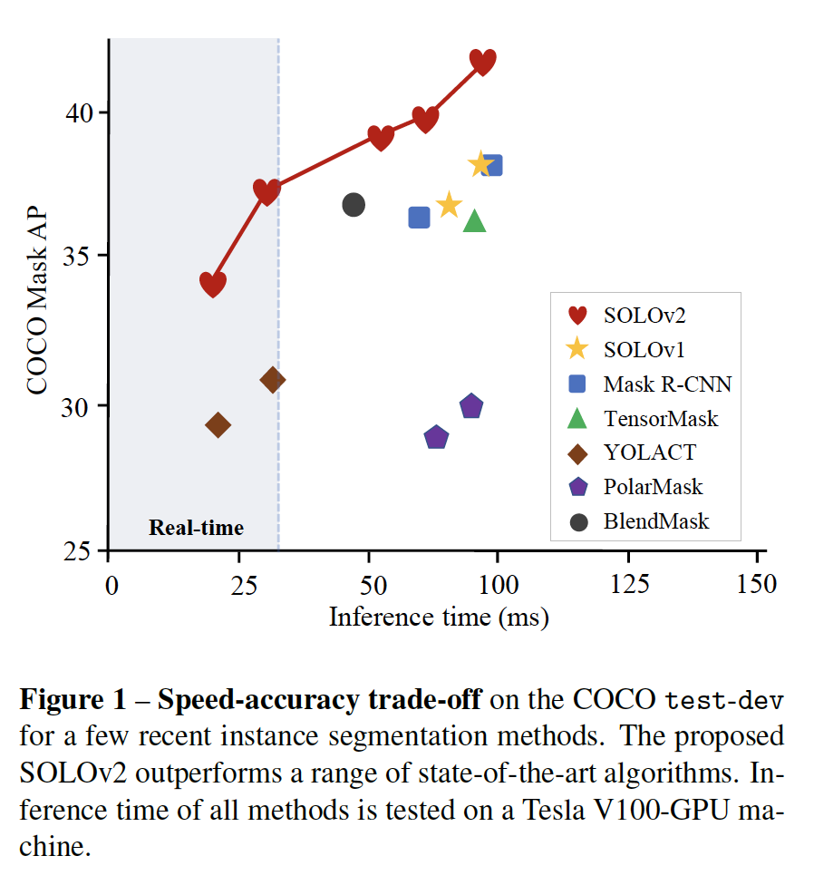

​		在最近提出的SOLO中，将实例分割任务形式还为像素级分类的两个子任务，可使用标准的FCN解决，因此极大地简化实例分割的形式。SOLO以图像最为输入，直接输出实例掩膜和相应的类概率，这以全卷积、无边界框和无分组的范式完成。因此，研究的重点转移到如何生成更好的目标掩膜。我们需要开发管制掩膜而不是边界框的技术来提升性能以及加速推理。在这项工作中，我们从两个方面改进SOLO：掩膜学习和掩膜NMS。

​		我们首先引入一种动态方案，其确保由位置动态分割目标。具体而言，掩膜学习下可以分为两个部分：卷积核学习和特征学习。当将像素分类到不同的位置类别时，分类器由网络预测，并以输入为条件。关于特征学习，如SOLO所设想的那样，可以应用在语义分割中开发的更多技术来提高性能。受[17]中的语义分割FPN的启发，我们为实例分割构建统一和高分辨率的掩膜特征表示。第3节显示了从SOLOv1到SOLOv2的掩膜学习的逐步推导。

​		我们进一步提出一种高效的矩阵NMS算法。作为抑制重复预测的后处理步骤，非极大值抑制用作SOTA目标检测系统的集成部分。以广泛采用的多类NMS为例。对于每个类，根据置信度降序排列预测。然后，对于每个预测，移除所有其他高度重叠的预测。这种串型和递归的操作将产生不可忽略的延迟。对于掩膜NMS，这个缺点将会被放大。与边界框相比，掩膜NMS需要花费更多时间来计算每个掩膜对的IoU，因此产生很大的开销。我们通过引入Matrix NMS来处理这个问题，其一键执行带有并行矩阵运算的NMS。我们的Matrix NMS在准确率和速度上均胜过现有的NMS及其同类产品。结果，在简单的PyTorch实现中，Matrix NMS在不到1ms的时间内处理了500个掩膜，并且比最近提出的Fast NMS [2]高出0.4％。

​		利用这些改进，SOLOv2比SOLOv1好1.9%AP，同时快了33%。Res-50-FPN SOLOv2在挑战性的MS COCO数据集上以18FPS的速度获得38.8%的mask AP，这在单张V100 GPU上评估。轻量化的SOLOv2以31.3FPS的速度执行，并产生37.1%的mask AP。有趣的是，在我们的工作中，尽管边界框的概念被完全消除，我们的边界框副产品，即通过将预测的蒙版直接转换为其边界框，可产生42.4％的AP用于边界框目标检测，甚至超过了许多最新的、高度工程化的目标检测方法。

​		我相信，利用简单、快速和足够强的解决方案，实例分割应该是广泛使用的目标边界框检测的高级替代方法，并且SOLOv2可能会发挥重要作用并预测其广泛的应用。

### 2. 相关工作

​		这里我们回顾与我们的工作最接近的最新工作。

#### 2.1. 实例分割

​		实例分割是一项挑战性任务，因为它同时要求实例级和像素级预测。已有的方法可以分为三类。Top-down方法从目标检测的角度解决这个问题，即首先检测，然后分割边界框中的目标。特别是，[3、38、35]的最新方法在无锚目标检测器FCOS [32]上构建了他们的方法，显示了有希望的性能。Bottom-up方法将这个任务视为label-then-cluster问题，例如学习每像素的嵌入，然后将它们聚类为组。最新的直接方法[33]旨在直接处理实例分割，而不依赖于框检测或嵌入学习。在这项工作中，我们继承SOLO的核心设计，并进一步探索直接的实例分割解决方案。

​		我们专门将我们的方法与最新的YOLACT [2]进行比较。YOLACT为每个边界学习一组归一化到$[-1,1]$的系数。在推理期间，它首先进行边界检测，然后使用预测到的边界框来裁剪集成的掩膜。BlendMask改进YOLACT，在准确率和速度[3]之间获得更好的平衡。

​		虽然我们的方法是从SOLO [33]演变为通过将原始的掩码预测直接解耦到核学习和特征学习来实现的。不需要锚框。不需要归一化、不需要边界框检测。我们直接将输入图像映射到期望的目标类和目标掩膜。训练和推理都更加简单。因此，我们提出的框架更加简单，也禅城明显更好的性能（在相当的速度下获得6%的AP增益），并且的我们最佳模型获得41.7% AP，而YOLACT的最佳性能为31.2%AP。

#### 2.2. 动态卷积

​		在传统的卷积层中，学习到的卷积核仍是固定的，并且与输入是独立的，例如对于每幅图像和图像中的每个位置，权重是相同的。先前的一些工作探讨了为传统卷积带来更多灵活性的想法。Spatial Transform Network[15]预测全局参数化变换以warp特征图，其允许网络自适应地以输入为条件变换特征图。提出Dynamic filter[16]来主动预测卷积滤波器的参数。它以特定于样本的方式将动态生成的滤镜应用于图像。Deformable Convolutional Networks[8]通过预测每个图像位置的偏移来学习采样位置。我们将动态方案引入实例分割，并确保通过位置学习实例分割。

#### 2.3. 非极大值抑制

​		在计算机视觉任务中广泛使用NMS，并且NMS成为目标检测系统的关键组件。提出一些最新的工作来改进传统NMS。它们可以分为两组，要么提高准确率，要么加速。Soft-NMS[1]根据与更高的分预测的重叠来降低相邻预测的置信度，而不是根据阈值移除重复预测。它的检测准确率比传统NM略高，但是由于串型操作，它的推理速度较慢。Adaptive NMS[25]将动态抑制阈值用于每个实例，其专为人群中的行人检测量身定制。为了加速推理，[2]中提出Fast NMS确保以并行的方式决定预测是否被保留还是丢弃。值得注意的是，它以性能下降为代价加快了速度。与先前的方法不同，我们的Matrix NMS同时处理硬删除和串型操作问题。因此，在简单的PyTorch实现中，_所提出的Matrix NMS能够在小于1ms的时间中处理500个掩膜_，与网络评估相比，这个时间是可以忽略的，并且比Fast NMS好0.4% AP。

### 3. 回顾SOLOv1

​		SOLOv1框架的核心思想是通过位置分割目标。输入图像概念上被分为$S \times S$网格。如果目标的中心位于一个网格单元中，那么那个网格负责预测语义类别以及分配每像素位置类别。有两个分支：类别分支和掩膜分支。类别分支预测语义类别，而掩膜分支分割目标实例。具体来说，类别分支输出$S \times S \times C$形状的张量，其中$C$是目标类数量。掩膜分支生成输出张量$M \in \mathbb{R}^{H \times W \times S^2}$。$S^2$中的第$k$个通道负责分割网格$(i,j)$处的实例，其中$k = i \cdot S + j$。

​		我们放大以展示掩膜分支的最后一层会发生什么。最后一层是$1 \times 1$卷积层，其以特征$F \in \mathbb{R}^{H \times W \times E}$为输入，并产生$S^2$个输出通道，即张量$M$。卷积核为$G \in \mathbb{R}^{1 \times 1 \times E \times S^2}$。这个操作可以写为：

$$M = F \ast G.\tag{1}$$

这一层可以视为$S^2$个分类器。每个分类器负责分类像素是否输入该位置的类别。

​		如[33]中讨论的，预测$M$在某种程度上是多余的，因为在大多数情况下，目标稀疏地位于图像中。它意味着仅$S^2$个分类器中的一小部分在推理中起作用。Decoupled SOLO[33]通过将$S^2$个分类器解藕为两组分别为$S$个分类器来解决这个问题，这两组分别对应$S$哥水平和$S$个垂直位置类别。因此，输出空间从$H\times W \times S^2$减小为$H \times W \times 2S$。

​		从另一个角度，因为输出$M$是冗余的，并且特征$F$是固定的，为什么不直接学习卷积核$G$呢？以这种方式，我们可以简单地从预测的$S^2$个分类器中选择有效的分类器，并且进行动态卷积。而且，由于预测的核是根据输入动态生成的，因此它具有灵活性和自适应性，因此受益匪浅。此外，$S^2$个分类器中的每一个是以位置为条件的。它符合按位置分割对象的核心思想，并且通过按位置预测分割器进一步向前迈了一步。 我们将在4.1节中说明详细的方法。

### 4. SOLOv2

​		在本节中，我们介绍提出的SOLOv2设计的详情。

#### 4.1. 动态实例分割

​		我们继承了SOLOv1的大多数设置，例如网格单元、多级预测、CoordConv和损失函数。基于此，我们引入动态方案，其中原始的掩膜分支被解藕为掩膜核分支和掩膜特征分支，分别用于预测卷积核和卷积特征。我们在图2展示了与SOLOv1的比较。

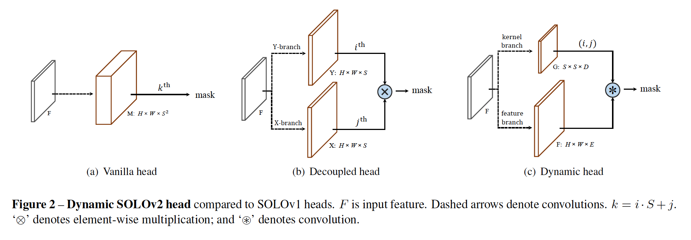

##### 4.1.1	掩膜核分支

​		掩膜核分支与语义类别分支一起位于预测头部。头部在由FPN生成的特征图金字塔上工作。头部的分支都包含4个卷积，用于特征提取，最后一个卷积用于预测。头部的权重在不同特征图层上共享。我们通过给第一个卷积访问归一化的坐标以将空间信息添加到核分支中，即连接两个附加的输入通道，。

​		对于每个网格，核分支预测$D$维输出以表示预测的卷积核权重，其中$D$为参数量。为了生成具有$E$个输入通道的$1 \times 1$卷积的权重，设置$D$等于$E$。对于$3 \times 3$卷积，设置$D$等于$9E$。这些生成的权重以位置（即网格单元）为条件。如果我们将输入划分为$S \times S$个网格，那么输出空间将为$S \times S \times D$。输出上没有激活函数。

##### 4.1.2	掩膜特征分支

​		掩膜特征分支需要预测实例感知的特征图$F \in \mathbb{R}^{H \times W \times E}$，其中$E$为掩膜分支的维度。$F$将由掩膜核分支的输出卷积。如果使用预测的权重，即$S^2$个分类器，最后卷积后的输出实例掩膜位于$H \times W \times S^2$中，其与SOLOv1的输出空间相同。

​		由于掩膜特征和掩膜核被解藕，并单独地预测，有两种方式构建掩膜特征分支。我们可以将它与核分支一起放入头部。它意味着，我们为每个FPN层预测掩膜特征。或者，为所有FPN层预测统一的掩膜特征。在5.1.3节中，我们通过实验比较两种实现。最后，为了有效性和效率，我们才有后一种方式。

​		为了学习统一的和高分辨率的掩膜特征表示，受[17]中语义分割的启发，我们使用特征金字塔融合。在重复的$3 \times 3$卷积、GroupNorm、ReLU和2倍双线性上采样的阶段后，将P2到P5的FPN特征融合到$1/4$尺度的单个输出中。逐元素加法之后的最后层包含$1 \times 1$卷积、GroupNorm和ReLU。细节见图3。应当注意的是，在卷积和双线性上采样之前，我们将归一化的像素坐标馈入最深的FPN层（在1/32尺度）。提供的准确位置信息对于启用位置敏感度和预测实例感知特征非常重要。

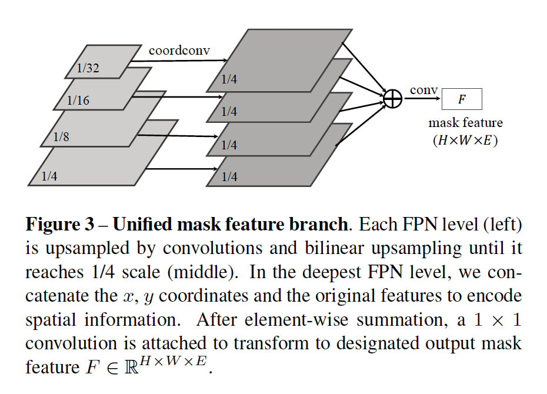

##### 4.1.3	Forming Instance Mask

​		对于$(i,j)$处的每个网格单元，我们首先获得掩膜核$G_{i,j,:} \in \mathbb{R}^D$。然后$G_{i,j,:}$卷积$F$以获得实例掩膜。总之，每个预测层最多有$S^2$个掩膜。最后，我们使用提出的Matrix NMS获得最终的实例分割结果。

##### 4.1.4	学习和推理

​		标签分配和损失函数与SOLOv1相同。训练损失函数定义如下：

$$L = L_{cate} + \lambda L_{mask}, \tag{2}$$

其中$L_{cate}$为用于语义类别分类的传统Focal Loss[23]，$L_{mask}$为用于掩膜预测Dice Loss。对于更多细节，请参考[33]。

​		推理期间，我们将输入图像传过骨干网络和FPN，并获得网格$(i,j)$处的类别得分$\mathbf{p}_{i,j}$。我们首先使用0.1的置信度阈值来过滤低置信度的预测。然后，将相应的预测掩膜核用于执行掩膜特征上的卷积。在sigmoid操作之后，我们使用0.5的阈值将预测的软掩膜转换为二值掩膜。最后的步骤是Matrix NMS。

#### 4.2. Matrix NMS

**动机**	我们的Matrix NMS受Soft-NMS的启发。Soft-NMS衰减其他检测分数作为其重叠的单调递减函数$f(\mbox{iou})$。通过根据IoU，递归地衰减得分，利用最小得分阈值消除更高IoU的检测。然而，这样的处理与传统的贪心NMS一样是串型的，并且不可能并行实现。

​		Matrix NMS通过考虑如何抑制预测的掩膜$m_j$以从另一个角度看待此过程。对于$m_j$，它的衰减因子手如下因素影响：（a）每个预测$m_i$在$m_j$（$s_i > s_j$）上的惩罚；（b）$m_i$被抑制的概率。对于（a），每个预测$m_i$在$m_j$生的惩罚可以由$f(\mbox{iou}_{i,j})$轻松计算。对于（b），$m_i$被抑制的概率不能如此优雅的计算。但是，概率通常与IoU正相关。所以，这里，我们通过$m_i$上的最大重叠预测直接估计这个概率：

$$f(\mbox{iou}_{\cdot,i}) = \min_{\forall s_k > s_i}f(\mbox{iou}_{k,i}).\tag{3}$$

为此，最终的衰减因子变为：

$$\mbox{decay}_j = \min_{\forall s_i > s_j}\frac{f(\mbox{iou}_{i,j})}{f(\mbox{iou}_{\cdot, i})},\tag{4}$$

并且通过$s_j = s_j \cdot \mbox{decay}_j$计算更新后的得分。

​		我们考虑两种最简单的递减函数，表示为$\mathbf{linear}$:

$$f(\mbox{iou}_{i,j}) = 1 - \mbox{iou}_{i,j},\tag{5}$$

和$\mathbf{Gaussian}$:

$$f(\mbox{iou}_{i,j}) =\exp\Big(-\frac{\mbox{iou}_{i,j}^2}{\sigma}\Big).\tag{6}$$

**实现**	Matrix NMS中的所有操作都可以一次性完成，而不会重复。我们首先为按分数降序排列的前$N$个预测计算一个$N\times N$对的IoU矩阵。对于二值掩膜，IoU矩阵可以通过矩阵操作高效实现。然后，我们通过在IoU矩阵上逐列取最大获得重叠最大的IoU。接着，计算所有更高得分预测的衰减因子，每个预测的衰减因子按列最小（式（4））选择为最大影响的一个。最后，通过衰减因子更新得分。对于使用，我们仅需要阈值化和选择前$k$个得分的掩膜作为最终预测。

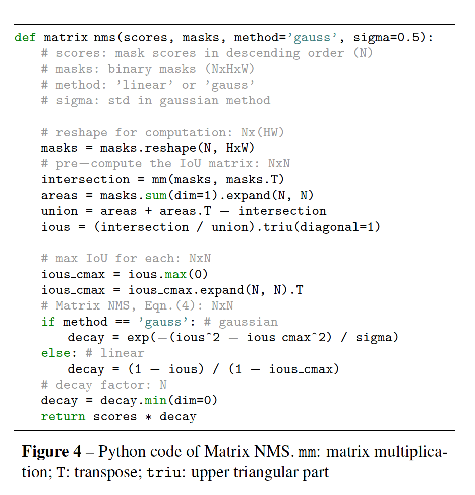

​		图4展示Pytorch风格的Matrix NMS。在我们的代码库中，Matrix NMS比传统NMS快9倍，并且更加准确（表7）。我们证明，Matrix NMS在准确性和速度上都可以作为传统NMS的出色替代，并且可以轻松地集成到最新的检测/分割系统中。

### 5. 实现

​		为了评估所提出的SOLOv2，我们在三个基本任务上进行实验，包括MS COCO上的实例分割、目标检测和全景分割。我们还介绍在最近提出的LVIS数据集上的实验结果，这个数据集有超过1K个类别，并因此具有相当大的挑战。

#### 5.1. 实例分割

​		对于实例分割，我们通过评估COCO 5K val2017拆分报告了病灶和敏感性研究。我们还报告test-dev划分上的COCO掩膜AP，其在评估服务器上评估。

**训练细节**	利用SGD训练SOLOv2。我们在8个GPU上使用同步SGD，每个微型批处理总共16张图像。除非其他说明，所有模型以0.01的初始学习率训练36个epoch（即3倍），然后在第27和33epoch时除以10。使用0.0001的权重衰减，和0.9的momentum。所有模型利用ImageNet预训练的权重初始化。我们使用尺度扰动，其中更短的图像边在640到800像素中随机采样。

##### 5.1.1	主要结果

​		我们比较SOLOv2与MS COCO test-dev上的实例分割中SOTA方法，见表1。具有ResNet-101的SOLOv2获得39.7%的mask AP，其远比SOLOv1和其他SOTA实例分割方法好。我们的方法展示其优越性，特别是大型谋变上（例如比Mask R-CNN上好5.0 $AP_L$）。

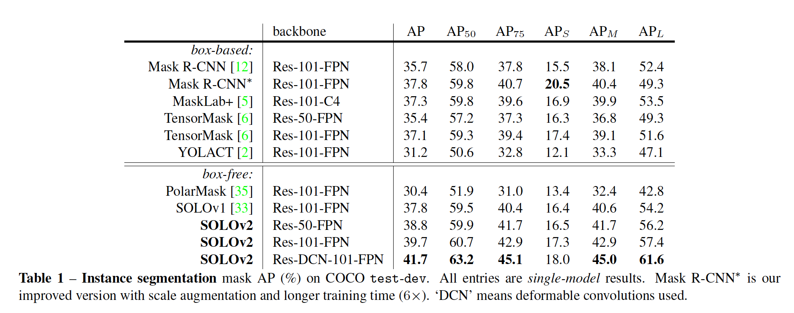

​		我们还提供了COCO的速度准确性权衡，以与一些主要实例分割器进行比较（图1）。我们将使用ResNet-50、ResNet-101、ResNet-DCN-101以及第5.1.3节中介绍的两个轻量级版本展示我们的模型。在准确率和速度方面，提出的SOLOv2比许多SOTA算法好。在我们的具有单张V100GPU、Pytorch 1.2和CUDA 10.0上测试运行时。我们下载代码和预先训练的模型，以测试同一台机器上每种模型的推理时间。

##### 5.1.2	SOLOv2 Visualization

​		我们从两个方面可视化SOLOv2学习到什么：掩膜特征行为和动态学习的卷积核卷积后的最终输出。

​		我们可视化掩膜分支的输出。我们使用的模型具有64个输出通道（即对于掩膜预测之前的最后一个特征图，$E = 64$）以便于可视化。 在这里，我们绘制了64个通道中的每个通道（调用通道的空间分辨率为$H \times W$），如图5所示。

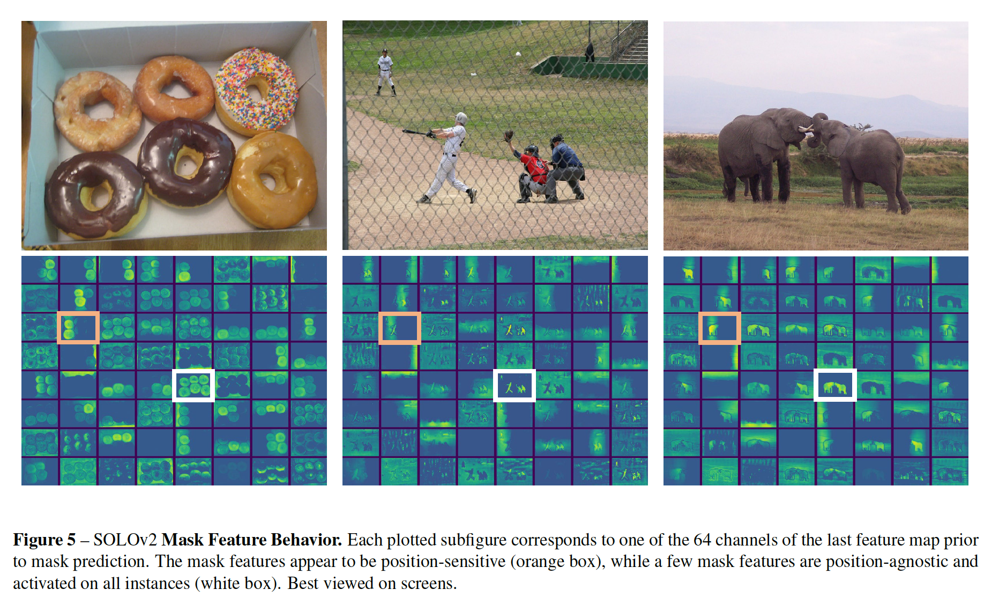

​		存在两种主要模式。首先，面具特征是位置感知的。它展示了水平和垂直扫描图像中目标的明显行为。有趣的是，实符合解藕SOLO中的目标：通过独立的水平和垂直位置类别分割目标。另一种明显模式是一些特征图负责激活所有前景目标，例如白色框中的特征图。

​		最终的输出如图8所示。不同目标为不同颜色。我们的展示了不同场景的结果。值得指出的是，边界的细节被很好地分割，特别是针对大型目标。在图6中，我们将目标细节与Mask R-CNN进行了比较。我们的方法表现出出很大的优势。

##### 5.1.3	消融实验

​		我们研究和比较我们的方法的如下四个方面：（a）用于在掩膜特征中进行卷积的核形状；（b）掩膜核分支和掩膜特征分支中使用的CoordConv；（c）统一的掩膜特征表示和（d）Matrix NMS的有效性。

**核形状**	我们从两个方面考虑核形状：输入通道的数量和核的大小。比较见表3。$1 \times 1$卷积的性能与$3 \times 3$卷积相当。将输入通道数从128增加到256获得0.4%的AP增益。当通达增加到超过256时，性能变得饱和。在这项工作中，对于所有其他实验，我们将输入通道数设置为256。

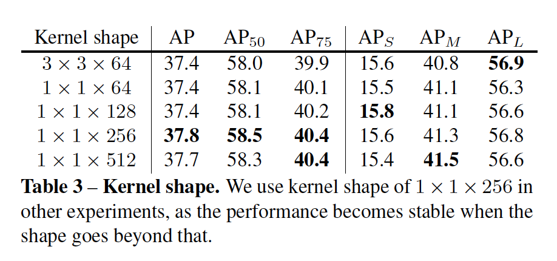

**Effectiveness of coordinates**	

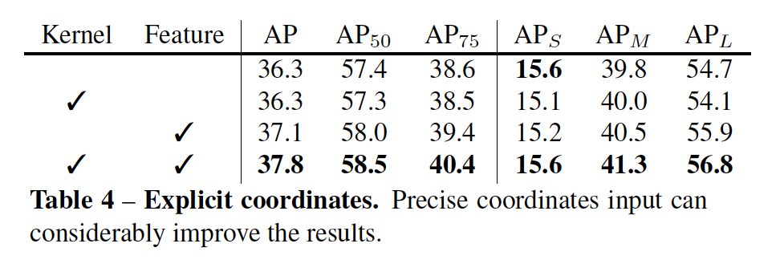

**统一掩膜特征表示**

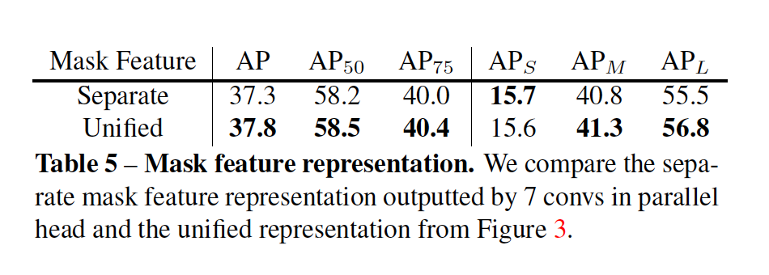

**Dynamic vs. Decoupled**	

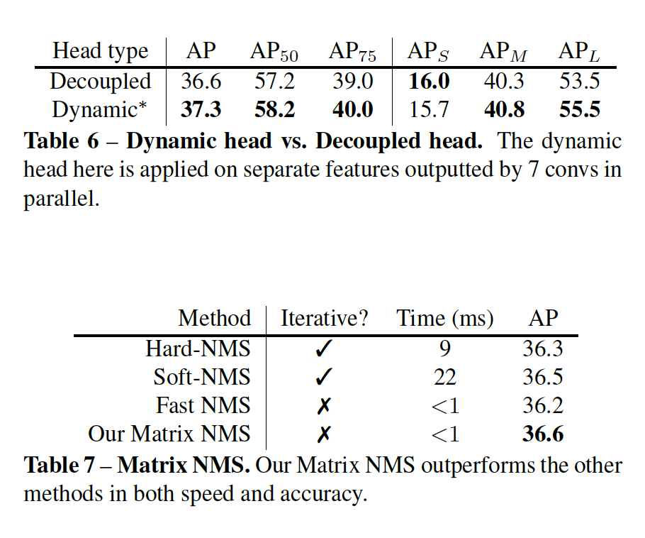

**Matrix NMS**

**Real-time setting**

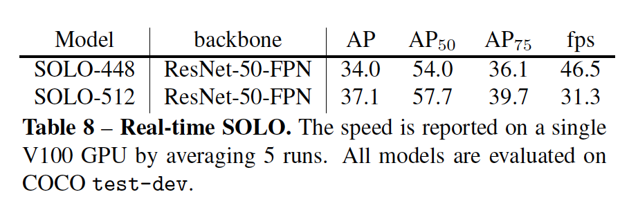

#### 5.2. Bounding-box Object Detection

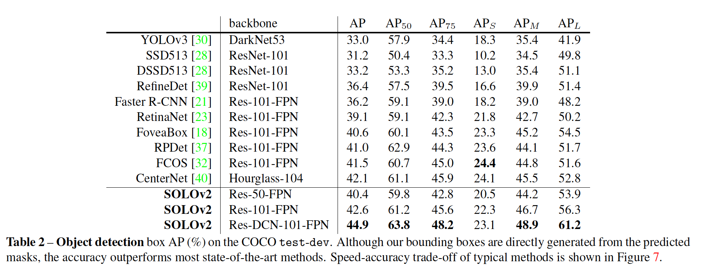

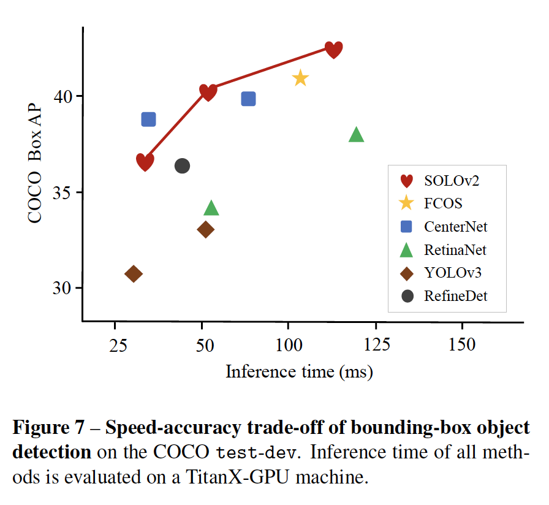

#### 5.3. 全景分割

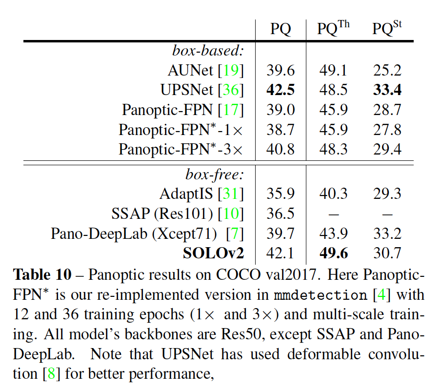

#### 5.4. LVIS数据集上的结果

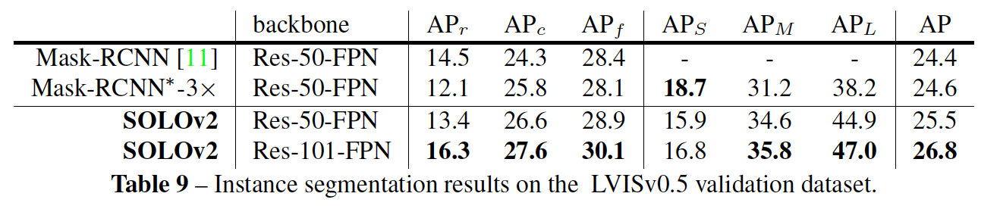