## YOLACT++:  Better Real-time Instance Segmentation

**Abstract**	我们为实时（> 30 fps）实例分割提供了一个简单的全卷积模型，该模型在单个Titan Xp上评估的MS COCO上获得了竞争性结果，这比以前的任何最新技术都快得多。此外，我们是在一个GPU上训练后获得的结果。我们通过将实例分割分解为两个并行的子任务来完成：（1）生成一组原型（prototype）掩膜和（2）预测每个实例的掩膜系数（coefficient）。然后，我们通过线性组合原型和掩膜系数来产生实例掩膜。我们发现，因为这一过程不依赖repooling，这种方法产生非常高质量的掩膜，并显示出时间稳定性。此外，我们分析了原型的emergent行为，并显示了，尽管是全卷积的，但它们仍学会了以平移变体的方式自行定位实例。我们还提出Fast NMS，这是对标准NMS快12毫秒替代的方法，仅会轻微影响性能。最后，通过将可变形卷积纳入骨干网络、利用更好的锚尺度和纵横比优化预测头部以及添加新颖的快速掩膜重评分分支，在MS COCO上，以33.5fps的速度，我们的YOLACT++模型可以获得34.1的mAP，这与最先进的方法相当接近，同时仍可以实时运行。

### 1 Introduction

​		"Boxes are stupid anyway though, I'm probably a true believer in masks except I can't get YOLO to learn them."

​																		-- Joseph Redmon, YOLOv3

​		创建实时实例分割算法需要什么？在过去的几年中，视觉社区在实例分割方面取得了长足的进步，在某种程度上，它利用了行之有效的目标检测领域的强大优势。最近的最佳实例分割（如Mask R-CNN和FCIS）直接构建在目标检测（如Faster R-CNN和R-FCN）之上。然而，这些方法主要侧重于性能而不是速度，从而使实例分割的场景缺乏如SSD [6]和YOLO [1、7]等实时目标检测器的并行能力。本文中，我们的目标是以一种快速的一级实例分割模型填补这一空白，就像SSD和YOLO填补目标检测的空白一样。

​		然而，实例分割是困难的——远难于目标检测。诸如SSD和YOLO之类的一阶段目标检测器能够通过简单地移除第二阶段并以其他方式弥补性能损失来加快诸如Faster RCNN之类的现有两阶段检测器。然而，相同的方法是不能轻易扩展到实例分割的。最佳的两阶段实例分割方法严重依赖*特征定位*来产生掩膜。即，这些方法“re-pool”（例如通过RoIpool/align）某些边界框区域中的特征，然后将这些定位到的特征馈入掩膜预测器。这种方法本质上依次完成的，并因此难以加速。确实存在像FCIS一样并行执行这些步骤的一阶段方法，但是它们在定位之后需要大量的后处理，因此仍然远远不够实时。

​		为了处理这些问题，我们提出YOLACT（$\bold{Y}\mbox{ou}$ $\bold{O}\mbox{nly}$ $\bold{L}\mbox{ook}$ $\bold{A}\mbox{t}$ $\bold{C}\mbox{oefficien}\bold{T}\mbox{s}$），一个实时的实例细分框架，它无需进行明确的定位步骤。相反，YOLACT将实例分割分解为两个并行的任务：（1）在整个图像上生成非局部原型掩膜（non-local prototype masks over the entire image）的字典，和（2）预测一组每个实例的线性组合系数（linear combination coefficients per instance）。然后，从这两个组件生成整幅图像的实例分割是简单的：对于每个实例，使用相应的预测系数线性组合原型，然后利用预测边界框裁剪它们。我们证明，通过以这种方式分割，*网络学会了如何自行定位实例掩膜*，其中在视觉、空间和语义上相似的实例在原型（prototype）中表现不同。

​		此外，因为原型掩膜的数量以来类别的数量（例如类别的数量可以多于原型的数量），所以YOLACT学习distributed 表征，其中每个实例利用类上共享的原型组合分割。这种分布式表示导致原型空间中有趣的行为：一些原型在空间上划分图像、一些定位实例、一些检测实例轮廓、一些编码位置敏感方向图（position-sensitive directional maps）（类似于通过在FCIS [3]中对位置敏感模块进行硬编码而获得的敏感得分图），以及大多数完成这些任务的组合（见表5）。

​		该方法还有几个实际优势。首先，它很快：由于其并行结构和极其轻量的集成处理，YOLACT仅增加了很少的计算开销到一阶段检测器，使其轻松达到30fps，即使使用ResNet-101；事实上，*整个掩膜分支仅花费大约5ms来进行评估*。其次，掩膜是高质量的：由于掩膜使用图像空间的完整内容，而没有repooling的质量损失，对于大型目标，我们的掩膜质量明显高于其他方法的掩膜质量（见图9）。最后，它是通用的：生成原型和掩膜系数的思想可以添加到几乎任意的目标检测器。

​		有趣的事，以这种方式分解实例分割与假想在人类视觉中起重要作用的腹侧（ventral）（“ what”）和背侧（）dorsal（“ where”）流大致相关[9]。线性系数及其对应检测分支可以认为是识别单个实例（“what”），而原型掩膜可以看作定位空间中的实例（“where”）。这比两阶段“定位然后分割”的方法更接近人类视觉，尽管距离人类的视觉还很远。

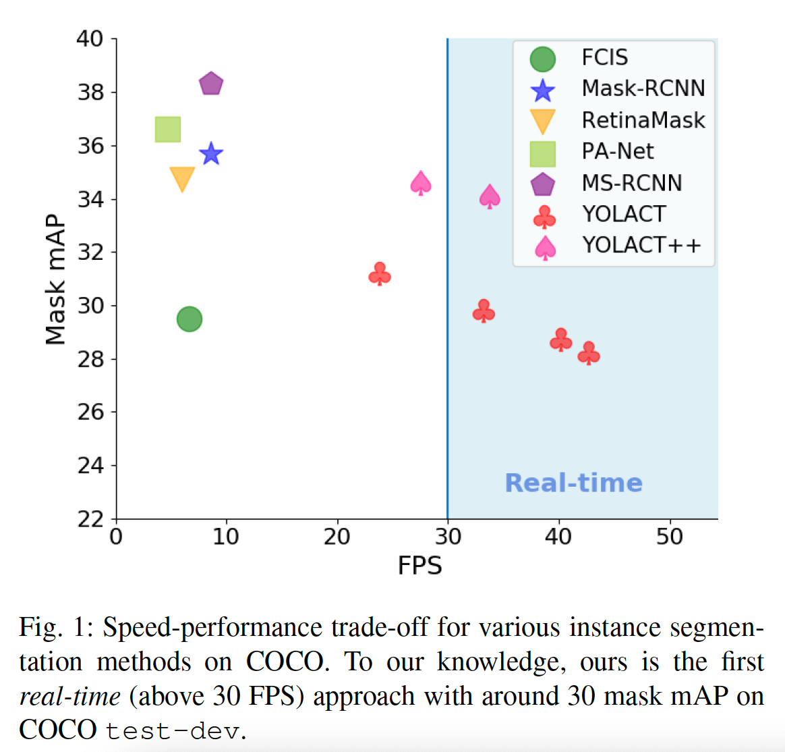

​		我们的主要贡献是在MS COCO数据集上第一个具有竞争性结果的实时（> 30 fps）的实例分割算法（见表1）。此外，我们分析了YOLACT原型的新兴行为，并提供了实验来研究在不同主干架构、原型数量和图像分辨率下获得的速度与性能之间的权衡。我们还提供了一种新颖的Fast NMS方法，其比传统的NMS快12ms，而仅有可忽略的性能惩罚。为了在我们的会议论文版本[11]上进一步改善我们模型的性能，我们在第6节中提出了YOLACT ++。具体而言，我们将可变形卷积引入到主干网络，其提供更灵活的特征采样，并强化其处理不同尺度、纵横比和旋转实例的能力。此外，我们利用更好的锚尺度和纵横比选择以召回更大的目标。最后，我们还引入一种新颖的快速掩膜重评分分支（fast mask re-scoring branch），从而仅以很小的速度开销就能获得不错的性能提升。这些改进见表5、6和7。除了对会议论文[11]的这些算法改进之外，我们还提供了更多的定性结果（图8）和实时边界框检测结果（表4）。YOLACY/YOLACT++的代码见https://github.com/dbolya/yolact。

### 2	Related Work

**Instance Segmentation**	鉴于其重要性，已进行了大量研究工作以提高实例分割的准确性。Mask RCNN是一种代表性的两阶段实例分割方法，其首先生成候选ROI，然后在第二阶段中，分类和分割这些ROI。接下来的工作尝试通过例如丰富的FPN特征或处理掩膜置信度得分及其定位准确率之间的不兼容来提高其准确率。这些两阶段方法需要重新池化每个ROI的特征，并通过后续计算对其进行处理，这使得即使减小图像大小，它们也无法获得实时速度（30 fps）（见表2c）。

​		一阶段实例分割方法生成位置敏感图，这些位置敏感图通过位置敏感池化[3]、[16]或者组合语义分割对logits和方向预测logits[17]集成到最终的掩码中。尽管概念上比两阶段方法快，但是它们仍需要重新池化或其他非普通计算（如掩膜投票）。这严重限制了它们的速度，使它们远远落后于实时。相比之下，我们的集成步骤要轻得多（仅是线性组合），并且可以实现为GPU加速的矩阵-矩阵乘法，从而使我们的方法非常快速。

​		最后，一些方法首先执行语义分割，然后执行边界检测[18]、像素聚类[19、20]或学习嵌入以形成实例掩膜[21、22、23、24]。还有，这些方法包含多个阶段和/或包含昂贵的聚类过程，其限制它们进行实时应用的可行性。

**Real-time Instance Segmentation**	虽然已存在实时目标检测[1、6、7、26]和语义分割[27、28、29、30、31]方法，但是少有工作关注实时实例分割。Straight to Shapes [32]和Box2Pix [33]可以实时执行实例分割（Straight to Shapes在Pascal SBD 2012 [34、35]上为30 fps，对于Box2Pix，在Cityscapes [36]上为10.9 fps，在KITTI [37]上为35fps），但其精度落后于现代基线。实际上，Mask R-CNN[2]仍然是如COCO的语义调整数据集上最快的实例分割方法之一（在$550^2$的图像上为13.5fps，见表2c）。

**Prototypes**	学习原型（又名词汇/密码本）已在计算机视觉中得到了广泛探索。经典的代表包括文本[39]和视觉单词[40]，并通过稀疏性和局部性先验[41、42、43]取得了进步。其他人则设计了用于物体检测的原型[44、45、46]。尽管相关，但这些工作使用原型来表示特征，而我们使用它们来集成掩膜以进行实例分割。此外，我们学习特定于每个图像的原型，而不是在整个数据集中共享的全局原型。

### 3	YOLACT

​		我们的目标是按照与Mask R-CNN [2]和Faster R-CNN [4]相同的方式，向现有的一阶段对象检测模型添加mask分支，但没有明确的特征定位步骤（如特征重池化）。为此，我们将复杂的实例分割任务分解为两个更简单、并行的任务，可以将它们组合起来以形成最终的掩膜。第一分支使用FCN [47]来生成一组图像大小（image-sized）的“原型掩膜”，这些掩膜不依赖任何实例。第二是，在目标检测分支上增加了一个额外的头部，以预测每个锚的“掩码系数”向量，这些锚编码原型空间中实例的表示形式。最后，对于在NMS中幸存的每个实例，我们通过线性组合这两个分支的工作从而为该实例构造一个掩膜。

**Rationale**	我们以这种方式执行实例分割主要是因为掩膜在空间上是一致的， 即彼此靠近的像素可能是同一实例的一部分。虽然卷积（$conv$）层本质上利用这种连贯性，全连接（$fc$）层却没有。这就带来了一个问题，因为一阶段目标检测器会为每个锚产生类和边界框系数作为$fc$层的输出（为了证明这一个是一个问题，我们开发了一个“ fc-mask”模型，该模型会为每个锚点生成掩膜，作为$fc$层的重塑（reshaped）输出。如表2c所示，简单地将掩膜添加到一阶段模型作为$fc$的输出，仅获得20.7mAP，并且是远远不够的）。两阶段方法（Mask R-CNN）通过使用定位步骤（例如RoI-Align）解决了这个问题，该步骤保留了特征的空间一致性，同时还允许掩膜成为卷积层的输出。但是，这样做需要模型的很大一部分等待第一阶段的RPN提出定位候选对象，从而导致明显的速度损失。

​		因此，我们将这个问题分解为两个不行的部分利用擅长产生语义向量的$fc$层和擅长产生空间一致性掩膜的卷积层分别产生“mask coefficients”和“prototype masks”。然后，因为prototype和mask coefficients可以独立计算，所以主干检测器的计算开销主要来自集成步骤，其可以实现为单个矩阵乘法。以这种方式，我们可以维持特征空间的空间一致性，同时仍是一阶段和快速。

#### 3.1	Prototype Generation

​		原型生成分支（protonet）为整幅图像预测$k$哥原型掩膜的集合。我们protonet实现为一个FCN，其最后一层有$k$个通道（每个原型对应一个通道），将其附加到一个主干特征层之后（见图3）。虽然这种形式于标准的语义分割相似，但是不同之处在于我们在原型上没有明显的损失函数。相反，**这些原型的所有监督来自集成后的最终掩膜损失**。

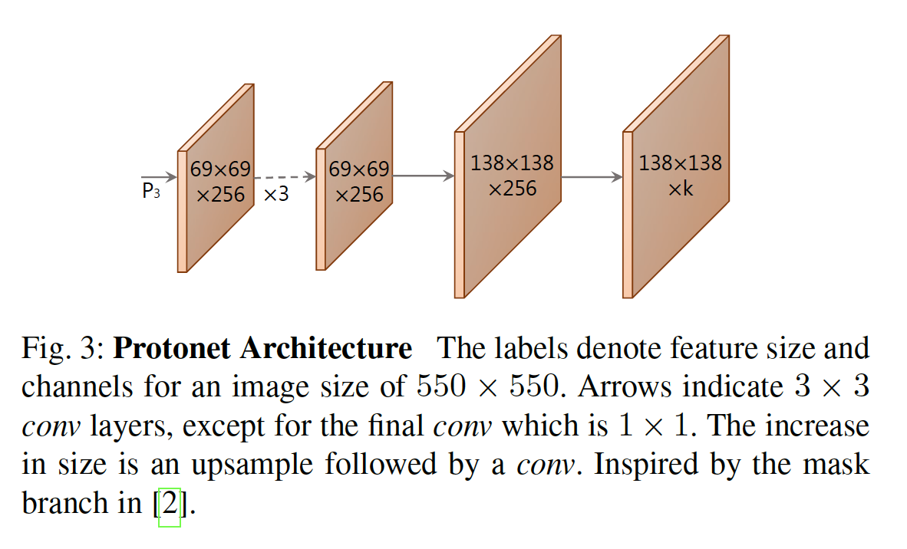

​		我们注意到两个重要的设计选项：**从更深的主干特征中获取protonet会产生更强大的掩膜，而更高分辨率的原型则可以带来更高质量的掩膜以及在较小物体上的更好性能**。因此，我们使用FPN，因为最大的特征层（我们的案例中为$P_3$，见图2）是最深的。然后，我们将其上采样到输入图像尺寸的四分之一，以提高在小物体上的性能。

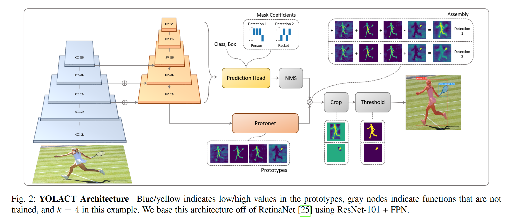

​		最后，我们发现无限制的protonet输出非常重要，因为这可以使网络产生大型的、强大的激活，这种原型是非常可信（例如明显的背景）。因此，我们可以在原型之后选择ReLU或不具有非线性的单元。 我们选择ReLU以获得更多可解释的原型。

#### 3.2	Mask Coefficients

​		典型的基于锚的检测器的预测头部有两个分支：一个分支用来预测$c$个类置信度，而另一个预测4个边界框的偏移。对于掩膜系数预测，我们简单地添加并行的第三个分支，其预测$k$个掩膜系数，每个原型对应一个系数。因此，每个锚产生$4+c+k$个系数，而不是$4+c$个系数。

​		然后，对于非线性，我们发现能够从最终的掩膜中减去输出原型是很重要的。因此，我们将$\mbox{tanh}$用于$k$个掩膜系数，这比非线性产生更稳定的输出。这种设计选择的相关性在图2中显而易见，因为在不允许相减的情况下，两种掩模都无法构建。

#### 3.3	Mask Assembly

​		为了产生实例蒙版，我们将原型分支和蒙版系数分支的工作结合起来，使用前者和后者作为系数的线性组合。然后，我们在其之后跟一个sigmoid以产生最终的掩膜。这些操作可以使用单个矩阵乘法和sigmoid高效地实现：

$$M=\sigma(PC^T) \tag{1}$$

其中$P$是$h \times w \times h$的原型掩膜矩阵，$C$是NMS和得分阈值（score thresholding）后存活的$n$个实例的$n \times k$的掩膜系数矩阵。另外，更复杂组合步骤是可能的；然而，我们利用基本的线性组合保持其简单（以及快速）。

**Losses**	我们使用三个损失来训练我们的模型：分类损失$L_{cls}$、边界框回归损失$L_{box}$和掩膜损失$L_{mask}$，其中权重分别为1、1.5和6.125。$L_{cls}$和$L_{box}$都与[6]中相同方式定义。然后，为了计算掩膜损失，我们采用集成掩膜$M$和ground-truth掩膜$M_{gt}$之间的逐像素二值交叉熵：$L_{mask}=\mbox{BCE}(M,M_{gt})$。

**Cropping Masks**	评估期间，我们利用预测到的边界框裁剪最终的掩膜。具体而言，我们将0分配给边界框区域外的像素。训练期间，我们改用ground-truth边界框裁剪，并使用ground-truth边界框区域去除以$L_{mask}$以保留原型中的小型目标。

#### 3.4	Emergent Behavior

​		我们的方法似乎令人惊讶，因为围绕实例分割的普遍共识是，由于FCN是平移不变的，因此该任务需要在[3]中添加平移变化。因此，如FCIS和Mask R-CNN的方法尝试显示地添加平移变化，无论是通过方向图和位置敏感的重池化（directional maps and position-sensitive repooling），还是通过将mask分支置于第二阶段，都不可避免地处定位实例。在我们的方法中，我们仅添加的平移变化是利用预测到的边界框来裁剪最终掩膜。但是，我们发现我们的方法也无需裁剪就可以处理大中型目标，因此这不是裁剪的结果。相反，YOLACT通过其原型中的不同激活*学习如何定位它自身的实例*。

​		要了解如何做到这一点，首先请注意，在没有填充的FCN中，实际上不可能激活图5中的红色实心图像（图像a）的原型。因为卷积输出到单个像素，所以如果在图像中各处的卷积输入相同，则在conv输出中各处的结果都将相同。另一方面，在像ResNet这样的现代FCN中，填充边缘始终如一，使网络能够分辨像素距图像边缘的距离。从概念上讲，可以完成此操作的一种方法是使多层填充的0从边缘到中心依次展开（例如，使用$[1,0]$这样的核）。对于实例，这意味着ResNet*本质上是平移变化的*，而我们的方法大量使用了该属性（图像b和c表现出明显的平移差异）。

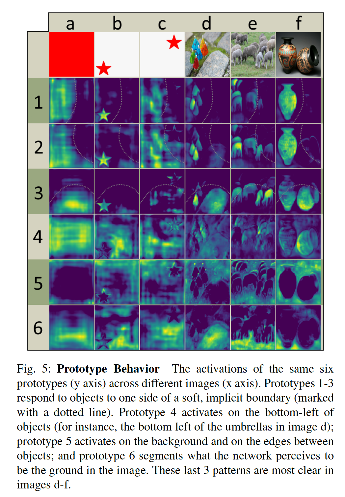

​		我们观察到许多原型可以在图像的某些“分区”上激活。也就是说，它们仅在隐式学习的边界一侧的目标上激活。图5中，原型1-3便是如此的例子。通过组合这些分区图，网络可以区分同一语义类的不同（甚至重叠）实例，例如，在图像d中，可以通过从原型2中减去原型3来将绿色伞与红色伞分开。

​		此外，作为学习对象，原型是可压缩的。也就是说，如果原型将多个原型的功能组合为一个，则掩码系数分支可以了解哪种情况需要哪种功能。例如，在图5中，原型2是一个分区原型，但也会在左下角的实例上最强烈地触发。原型3相似，但是针对右侧的实例。这解释了为什么在实践中，即使$k = 32$个原型，该模型的性能也不会降低（请参见表2b）。

​		另一方面，增加$k$最有可能是无效的，因为预测系数很困难。由于线性组合的性质，如果网络即使在一个系数上都产生很大的误差，则所产生的掩膜可能会消失或包括其他物体的泄漏。因此，网络必须发挥平衡作用以产生正确的系数，而增加更多的原型会使这一点变得更加困难。实际上，我们发现，对于较高的$k$值，网络仅添加了具有少量边沿变化的冗余原型，从而略微增加了$AP_{95}$，但其他方面不多。

### 4	Backbone Detector

​		对于我们的骨干检测器，我们优先考虑速度和特征丰富性，因为预测这些原型和系数是一项艰巨的任务，需要良好的特征才能做好。因此，我们的骨干检测器的设计紧随RetinaNet [25]，并着重于速度。

**YOLACT Detector**	我们使用具有FPN的ResNet-101作为默认的特征骨干，并且基本的图像大小是$550\times550$。我们不保留纵横比以使每个图像获得一致的评估时间。与RetinaNet相似，我们修改FPN，不产生$P_2$，通过从$P_5$（而不是$C_5$）开始添加两个步长为2的$3\times3$卷积层来产生$P_6$和$P_7$，并在每个位置放置3个纵横比为$[1, 1/2, 2]$的锚。$P_3$的锚的面积为$24^2$个像素，并且每个后续层的面积是前一层的两倍（产生尺度为$[24,48,96,192,384]$）。对于附加到每个$P_i$后的预测头部，然后每个分支得到与其自身并行的$3\times3$卷积层。与RetinaNet相比，我们的预测头部的设计（见图4）更加轻量，并且更加快速。我们使用$\mbox{smooth}-L_1$来训练边界回归器，并且与SSD相同的方式编码边界框坐标。为了训练分类预测，我们使用$c$个正类标签和1个背景标签的softmax交叉熵，使用OHEM选择训练样本，正负样本之比为$1:3$。因此，与RetinaNet不同，我们不使用focal loss，我们发现在这种情况下不可行。

​		通过这些设计选择，我们发现该主干网比具有相同图像大小的修改为使用ResNet-101 [8]的SSD [6]更好、更快。

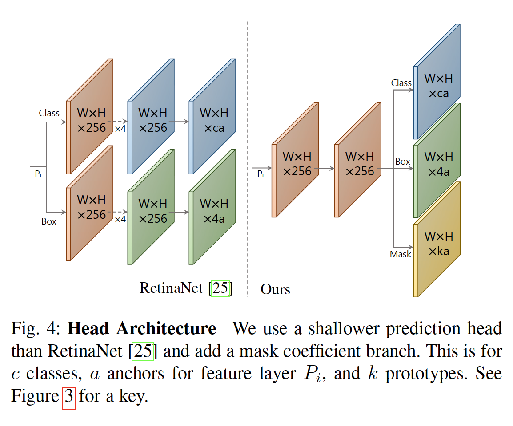

### 5	Other Improvements

​		我们还将讨论其他改进，这些改进要么增加速度，而对性能的影响很小，要么增加性能，而没有速度损失。

#### 5.1	Fast NMS

​		在为每个锚产生边界框回归系数和类置信度后，如大多数目标检测器一样，我们使用NMS来抑制重复检测。在许多先前的工作[1、2、4、6、7、25]中，NMS是依次进行的。也就是说，对于数据集中$c$个类中的每一个，根据置信度对检测边界框以降序的形式排序，然后，对于每个检测，删除所有IoU重叠大于某个阈值的置信度比其低的检测。尽管这种依次的方法在大约5 fps的速度下足够快，但它却成为获取30 fps的一大障碍（例如，以5 fps的速度提高10毫秒可提高0.26 fps，而以30 fps的速度提高10毫秒时， 有12.9 fps的速度提升）。

​		为了修复传统NMS的顺序本质，我们引入Fast NMS，它是一种每个实例都可以并行地决定是否保留或丢弃。为此，我们简单地允许已移除的检测来抑制其他检测，这在传统的NMS是不可能的。这种松弛条件使我们能够完全在标准GPU加速矩阵操作中实现Fast NMS。

​		为了执行Fast NMS，我们首先计算$c \times n \times n$个成对的IoU矩阵$X$，用于对$c$个类中的每一个类别按得分按降序排序的前$n$个检测。GPU上的批量排序很容易获得，计算IoU可以很容易地向量化。然后，如果存在更高得分的检测，且对应的IoU大于某个阈值$t$，则我们将其删除。我们首先通过将$X$的下三角形和对角线设置为$0$来有效地实现这一点：$X_{kij} = 0, \forall X_{kij}$ ，可以在一个批处理的$\mbox{triu}$调用中执行，然后采用按列的最大值：

$$K_{ij} = \max_i(X_{kij}) \forall k, j \tag{2}$$

来为每个检测计算最大IoU的矩阵$K$。最后，用$t(K<t)$来阈值化矩阵将指示为每个类别保留哪些检测。

​		由于这种松弛，Fast NMS略微有删除过多边界框的影响。但是，与速度的急剧提高相比，由此造成的性能下降可以忽略不计（参见表2a）。在我们的代码中，Fast NMS比Cython实现的传统NMS快11.8ms，然而仅减小了0.1的mAP。在Mask R-CNN基准套件[2]中，Fast NMS比其传统NMS的CUDA实施快15.0 ms，而性能损失仅为0.3 mAP。

#### 5.2	Semantic Segmentation Loss

​		尽管Fast NMS牺牲了少量的性能以提高速度，但仍有许多方法可以提高性能而不会降低速度。其中一种方法是在训练期间使用在测试时不执行的模块对模型施加额外的损失。这有效地增加了特征丰富性，而没有速度上的惩罚。

​		因此，我们在我们的特征空间上应用语义分割，其使用仅在训练期间评估的层。注意，因为我们从实例分割上为这个损失构建ground-truth，这不会严格地捕获语义分割（即我们不对每个像素强制执行标准的一类）。为了创建训练期间的预测，我们简单地将$c$个输出通道的$1\times1$卷积层附加到骨干网络最大特征图（$P_3$）之后。由于每个像素可以分配超过一个的类，所以我们使用sigmoid和$c$个通道，而不是$c+1$个通道的softmax。该损失的权重为1，并产生$+0.4$的mAP提升。

### 6 YOLACT++

​		到目前为止，YOLACT适用于实时应用程序，即使使用ResNet-101主干网，也仅消耗1500 MB的VRAM。我们相信，这些特性使其成为一种有吸引力的模型，可以在低容量嵌入式系统中部署。

​		我们接下来探索针对原始框架的几种性能改进，同时保持实时性要求。具体而言，我们首先介绍一种高效而快速的掩膜评分网络，其根据其掩膜质量重新排列掩膜预测。然后，我们确定使用可变形卷积来改善骨干网络的方法，以使我们的特征采样与实例更好地对齐，从而获得更好的骨干检测器和更精确的掩膜原型。最后，我们讨论增加召回率的检测锚的更好选择。

#### 6.1 Fast Mask Re-Scoring Network

​		如Mask Scoring R-CNN[15]指出的，模型的分类置信度和预测掩膜的质量存在差异（即，较高质量的掩膜分割不一定具有较高的分类置信度）。因此，为了更好的关联类置信度和掩膜质量，Mask Scoring R-CNN将一个新模块添加到Mask R-CNN，该模块学习回归预测的掩膜与ground-truth的mask IoU。

​		受[15]的启发，我们引入一个快速的掩膜重评分分支，其基于预测掩膜与ground-truth掩膜之间IoU来重新评分预测掩膜。具体而言，我们的Fast Mask Re-Scoring Nework是每个卷积后都有ReLU的6层FCN以及一个全局池化层。它采用YOLACT的裁剪掩膜（阈值之前）作为输入，并输出每个类的掩膜IoU。我们采取由分类头预测的类别的预测掩膜IoU与相应的分类置信度之间的乘积，来对每个蒙版进行重新评分（参见图6）。

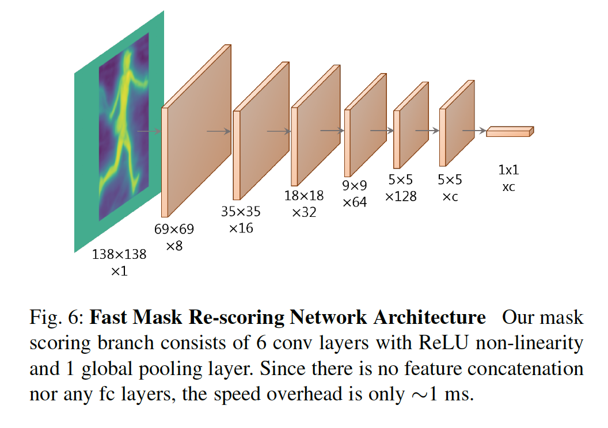

​			我们的方法与Mask Scoring R-CNN[15]不同之处：（1）我们的输入仅是全图像尺寸的掩膜（在预测的框区域之外为零），而它们的输入是与来自掩膜预测分支的特征拼接的ROI池化掩膜，（2）我们没有任何的$fc$层。这些方面使我们的方法明显更快。具体而言，添加Fast Mask Re-Scoring分支的YOLACT的速度开销是1.2ms，对于ResNet-101模型，其将fps从34.4改变到33，而包含Mask Scoring R-CNN模型的YOLACT的速度开销是28ms，这将fps从34.4变为17.5。速度差异主要来自MS R-CNN的输入中的ROIAlign操作、$fc$层和特征拼接。

#### 6.2	Deformable Convolution with Intervals

​		Deformable Convolution Network（DCNs）[12、13]已被证明对于目标检测、语义分割和实例分割是有效的，因为它用自由形式采样代替了传统卷积网络中使用的刚性网格采样。我们遵从DCNv2[13]做出的设计选择，并将$C_3$到$C_5$中每个ResNet块中的$3 \times 3$卷积层替换为$3 \times 3$ 的可变形卷积层。请注意，我们不使用调制的可变形模块，因为我们无法承受它们引入的推理时间开销。

​		将可变形卷积添加到YOLACT的骨干，在8ms的速度开销下产生+1.8的掩膜AP增益。我们认为提升是由于：（1）DCN可以通过对齐目标实例增强网络处理不同尺度、旋转和纵横比的实例的能力，（2）作为单发方法的YOLACT没有重采样过程。因此，对于YOLACT而言，更好的方法和更灵活的采样策略比诸如Mask RCNN的两阶段方法更为关键，因为在我们的网络中无法恢复次优采样。相比之下，Mask R-CNN的ROIAlign操作通过将所有目标对齐到标准的参考区域一定程度上解决了这个问题。

​		即使在按照[13]中的设计选择直接插入可变形卷积层时，性能提升相当不错，但速度开销也相当可观（参见表7）。这是因为，当使用ResNet-101时，网络有30层可变形卷积。为了加速ResNet-101模型，同时维持其性能提升，我们探索使用更少的可变形卷积。具体而言，我们尝试使用四种不同配置的可变形卷积：（1）在最后10个ResNet块中，（2）在最后13个ResNet块中，（3）在最后三个ResNet阶段中，以间隔为3使用（即每三个ResNet块使用一个可变形卷积，共计11个可变形层）以及（4）在最后三个ResNet阶段中，以间隔4使用（共计8个可变形层）。根据结果，将DCN（间隔为3）设置选择为YOLACT ++中的最终配置，其将速度开销从5.2ms减少到2.8ms，与没有间隔的方法相比仅下降0.2mAP。

#### 6.3 Optimized Prediction Head

​		最后，由于YOLACT基于锚的检测器，因此为锚选择正确的超参数（例如尺度和纵横比）非常重要。因此，我们回顾我们的锚选择，并比较RentinaNet[25]和RetinaMask[5]的锚设计。我们尝试两种变体：（1）保持尺度不变，同时将锚的纵横比从$[1,1/2,2]$增加到$[1,1/2,2,1/3,3]$，（2）保持纵横比不变，同时将每个FPN层的尺度增加三倍（$[1\mathbb{x}，2^{\frac{1}{3}}\mathbb{x}，2^{\frac{2}{3}}\mathbb{x}]$）。与原始的YOLACT的配置相比，前者和后者的锚数量分别增加$\frac{5}{3}\mathbb{x}$和$3\mathbb{x}$。如表6所示，在每个FPN层（配置2）使用多尺度锚会产生最佳的速度与性能的平衡。

### 7 Results

​		我们使用标准的度量报告MS COCO和Pascal 2012 SBD上实例分割结果。对于MS COCO，我们在$\mbox{train2017}$上训练，在$\mbox{val2017}$和$\mbox{test-dev}$上评估。我们还报告MS COCO上边界框检测结果。

#### 7.1	Implementation Details

​		我们使用ImageNet预训练的权重在一个GPU上以批量大小8训练所有模型。我们发现这是足以使用batch norm的批大小，因此我们不冻结预训练的bn，但是不添加任何额外的bn层。我们利用SGD训练800k次迭代，学习率从$10^{-3}$开始，在280k、600k、700k和750k时除以10，使用权重衰减为$5\times10^{-4}$，momentum为0.9，并使用SSD的所有数据增强。对于Pascal，我们训练120k迭代，并在60k和100k迭代时除以10。我们还将锚的尺度乘以$4/3$，因为目标倾向于更大。对于COCO，在Titan Xp上训练4-6天（以来配置），而Pascal少于1天。

#### 7.2 Mask Results

​		首先，我们比较YOLACT与COCO $\mbox{test-dev}$集上的最佳方法，见表1。因为我们的主要目标是速度，所以我们在没有测试时增强的情况下与其他单个模型的结果进行比较。 我们报告所有在单个Titan Xp上计算出的速度，因此列出的某些速度可能比原始论文中的速度更快。

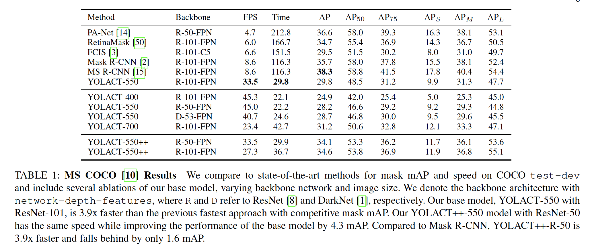

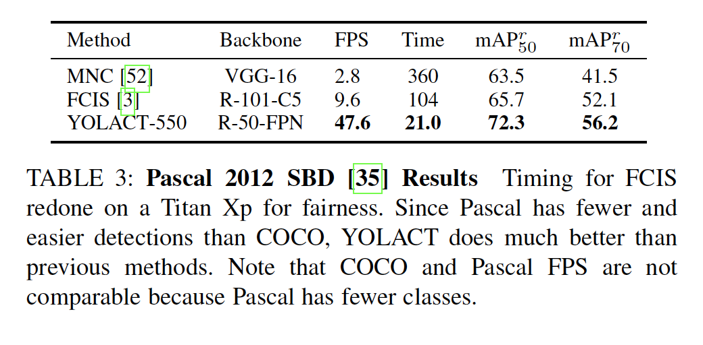

#### 7.3	Mask Quality

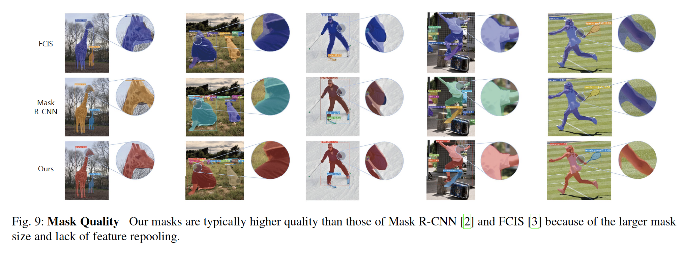

#### 7.5	More Qualitative Results

#### 7.6	Box Results

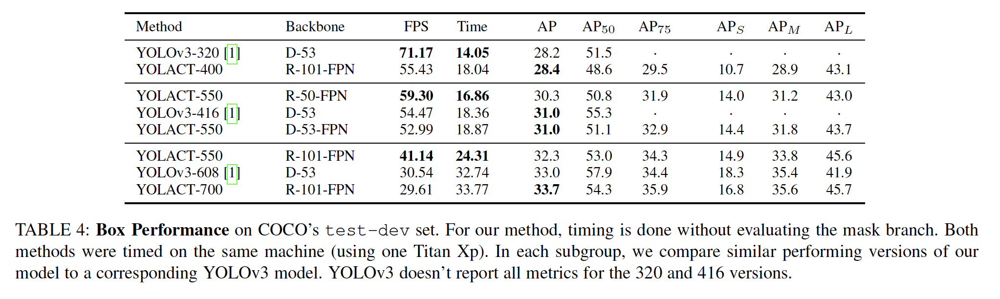

#### 7.7	YOLACT++ Improvements

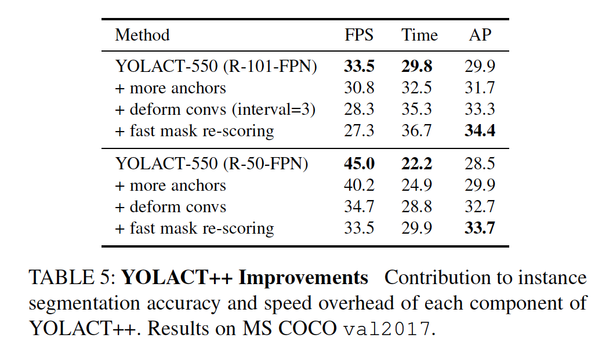

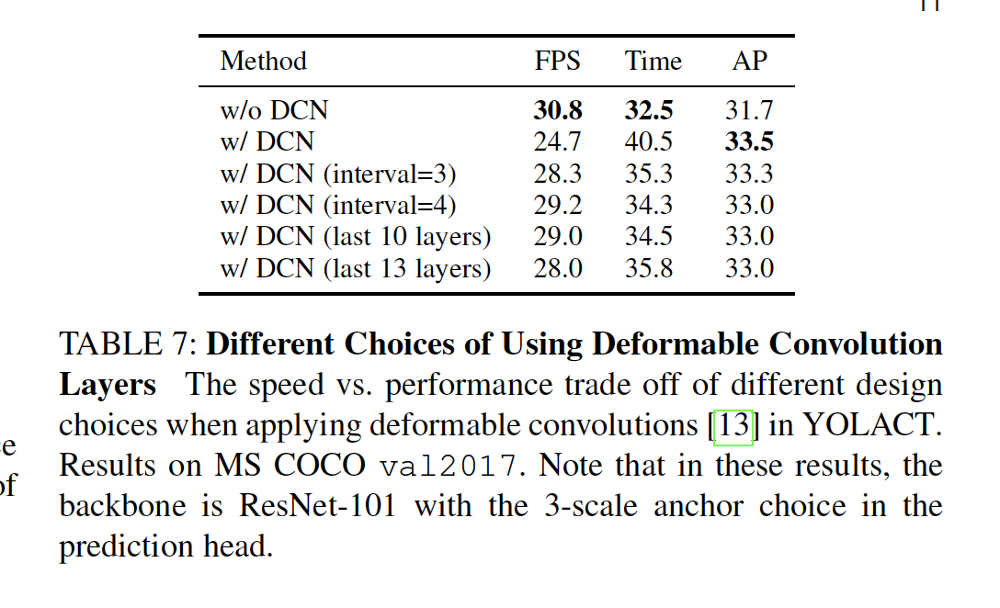

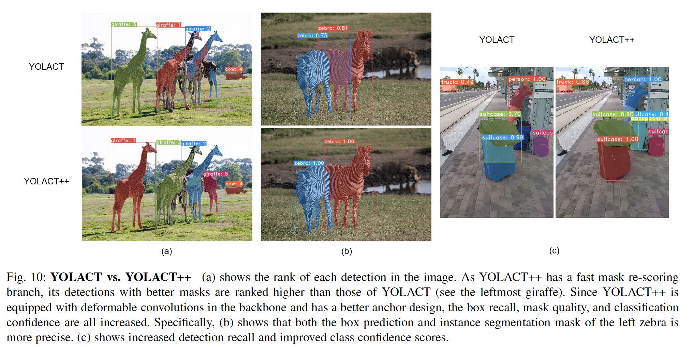

### 8	Discussion

