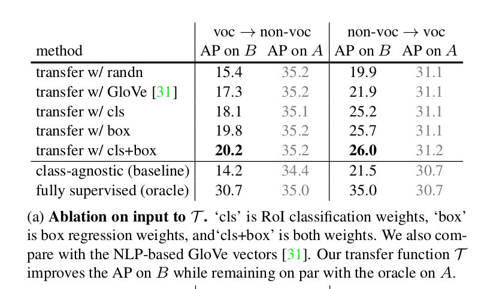
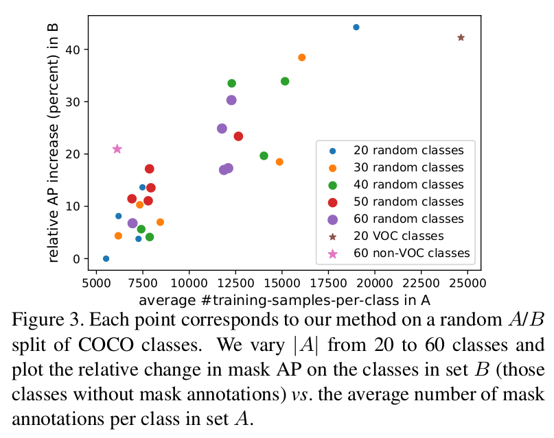
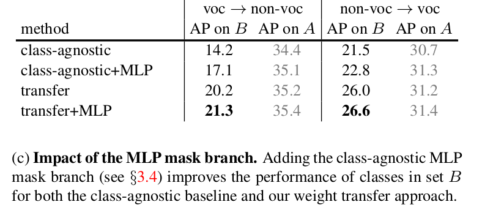
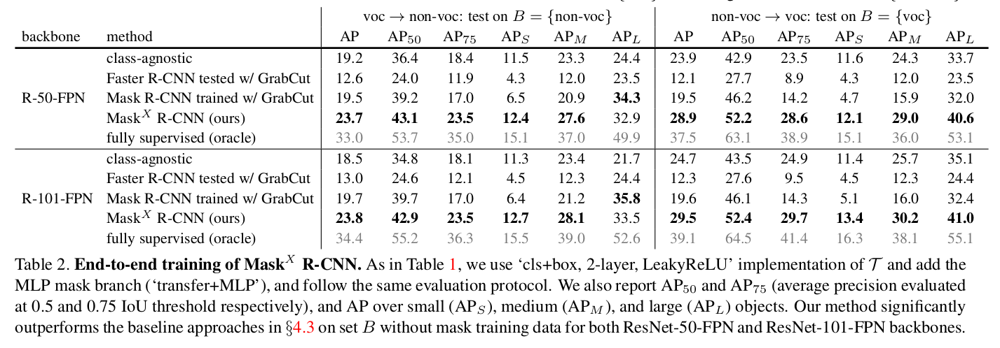

Learning to Segment Every Thing
=

# 1 Introduction
在实践中，典型的实例分割系统被限制在仅包括大约100个对象类别的广阔视觉世界的狭窄片段中。本质原因是最优的实例分割算法要求强壮的监督，并且这些监督可能有限以及收集起来很昂贵。相比之下，边界框注释更丰富且更便宜。这个事实引出一个问题： 在没有所有类别的完整实例分割标注的情况下，是否可能训练高质量的实例分割模型？由于这种动机，本文介绍一种新的部分监督（partially supervised）实例分割任务和提出一种新颖的迁移学习方法处理这个问题。

本文形式化半监督实例分割任务如下：（1）给定一组感兴趣类别，即一个有实例掩模标注的小子集（subset），而其他类别只有边界框标注；（2）实例分割算法应利用该数据来拟合可以分割感兴趣组中的所有对象类别的实例的模型。因为训练数据是强标注样本（带有掩模）和弱标注样本（仅有边界框）的混合，因此称该任务为半监督（partially supervised）。

半监督和弱监督训练的好处是允许通过利用已存在的两种类型数据（标注于大量类别的边界框和少量类别的掩模标准）来构建大尺度实例分割模型。本文的方法能够将最先进的实例分割方法扩展到数千个类别，这对于在现实世界中的部署使用至关重要。

为了处理半监督实例分割，作者提出一种建立在Mask R-CNN上的新颖的迁移学习方法。Mask R-CNN 非常适合我们的任务，因为它将实例分割问题分解成边界框对象检测和掩模预测两个子任务。这些子任务由专门的网络 “头” 联合训练。我们这种方法的直觉是，一旦经过训练，边界框头部的参数编码每个对象类别的嵌入，使该类别的视觉信息能够迁移到部分监督的掩码头部。

我们通过设计一个参数化的权重传递函数来实现这种直觉，该转移函数被训练来预测类别实例分割参数以作为其边界框检测参数的函数。权值转移函数可以在 Mask R-CNN 中使用带有 Mask注释的类作为监督进行端到端的训练。最推理期间，权重迁移函数用于为每个类预测实例分割参数，因此确保模型可以分割所有对象类别，包括在训练期间没有掩模注释的类。

我们在两个设置中探索我们的方法。第一，我们使用COCO数据集[23]来模拟部分监督的实例分割任务，作为一种在具有高质量注释和评估指标的数据集上建立定量结果的方法。具体地说，我们将COCO类别的完整集合划分为一个带有掩码注释的子集和一个补充子集，系统只能访问补充子集的边框注释。因为COCO数据集只涉及少量(80)语义分离良好的类，所以定量评估是精确和可靠的。实验结果表明，我们的方法在较强的基线上改进了结果，在不使用训练掩码的类别上，掩码AP的相对增幅高达40%。

在我们的第二个设置中，我们使用Visual Genome (VG)数据集[20]在3000个类别上训练了一个大型实例分割模型。VG 包含大量对象类的边界框注释，然而，由于许多类别在语义上是重叠的(例如，接近同义词)，而且注释也不是详尽的，因此，定量评估是具有挑战性的，这使得很难测量准确率和召回率。而且，VG没有使用实例掩码进行注释。相反，我们使用VG来提供大规模实例分割模型的定性输出。我们模型的输出如图1和图5所示。

# 2. Related Work
**Instance segmentation.** 实例分割是一个高度活跃的研究领域，Mask R-CNN 代表这当前最优结果。这些方法假设了一个完全监督训练场景，其中训练期间所有类都有实例掩模。然而，完全监督学习使得这些系统难以扩展到数千个类别。我们工作的重点是放松这种假设，即使只有一小部分类别可以使用掩模，也可以训练模型。为此，我们开发了一种构建在Mask R-CNN 上的新颖的迁移学习方法。

**Weight prediction and task transfer learning.** 之前的模型探索从其他源预测模型参数（例如hypernetwork），而不是直接学习参数。在 《Write a classifier: Zero-shot learning using purely textual descriptions》中，图像分类器是根据零次（zero-shot）分类的自然语言描述进行预测的。《Learning robust visual-semantic embeddings》中，一个模型回归网络用于由 few-shot 样本构建分类器权重，而相似地，《From red wine to red tomato: Composition with contex》中，利用一个小的神经网络从每个概念的分类器权重预测两个概念组成的分类器权重。这里，我们设计一种模型，其用于在 Mask R-CNN 中预测类特定（class-specific）的实例分割权重，而不是直接训练它们，而且直接训练在我们的半监督训练场景是不可能的。

我们的方法也是迁移学习的一种类型，其中由一个任务帮助另一个任务而会的知识增益。与我们的工作最相关的是，LSDA[17]通过域自适应过程将全图像分类参数转换为目标检测参数。LSDA 可以认为是从图像分类任务到对象检测任务的迁移知识学习过程，而我们考虑从边界框检测到实例分割的迁移知识学习。

**Weakly supervised semantic segmentation.** 之前的工作是从弱监督中训练语义分割模型。在《Constrained convolutional neural networks for weakly supervised segmentation》中，限制图像级标签和对象大小，而其他方法使用边界作为监督以进行期望最大化（expectation-maximization）《Weakly-and semi-supervised learning of a DCNN for semantic image segmentation》或者在提议生成和训练之间迭代《Boxsup》。在[3]中使用点监督和对象性潜力。在这个领域的多数工作仅处理语义分割（而不是实例分割），独立地对待每个类，并依赖手工设计的自下而上的提议，其泛化能力较差。

在[18]中，通过训练一个基于自下向上 GrabCut[35] 前景分割结果的实例分割模型，解决了弱监督实例分割问题。不用于[18]，我们旨在探索所有已有的标签数据，而不是人工限制它。我们的工作在某种意义上也是互补的，自下向上的分割方法可以用来推断我们的弱标记例子的训练掩码。我们把这个扩展留给将来的工作。

**Visual embedding.** 对象类别可以通过将向量连续地“嵌入”到一个视觉语义空间中来建模，在这个空间中，相邻的向量在外观或语义本体上通常是接近的。类嵌入向量可以通过自然语言处理技术(如word2vec[26]和GloVe[31])、视觉外观信息(如[7])或两者(如[37])获得。我们的工作中，Mask R-CNN 的边界框头部的参数包含类特定的外观信息，并可以看作是通过训练学习到的用于边界框对象检测任务的嵌入向量。在我们的模型中，类嵌入向量通过在视觉相关的类之间共享外观信息来实现迁移学习。在实验中，我们还与基于 NLP 的 GloVe 嵌入[31]进行了比较。

# 3. Learning to Segment Every Thing
设 $C$ 为对象类别（即“thing”）的集合，其为我们想为之训练一个实例分割模型。多数已有的方法假设 $C$ 中的所有训练样本使用实例掩模标注。我们放松这个要求，并相反，假设 $C = A \cup B$ ，其中来自 $A$ 的类的样本有掩模，而 $B$ 中的样本仅有边界框。由于 $B$ 类中的样本对应目标任务（实例分割）是弱标注的，我们训练强弱标签的组合为 _部分监督_ 学习问题。注意到可以很容易地将实例掩码转换为边界框，我们假设边框框注释也可用于 $A$ 中的类。

给定如 Mask R-CNN 具有边界框检测部分和掩模预测部分的实例分割模型，我们提出 **$Mask^X R-CNN$** 方法，其将类别特定的信息从模型的边界框检测器迁移到其实例掩模预测器。

## 3.1 Mask Prediction Using Weight Transfer
我们的方法建立在Mask R-CNN[15]的基础上，因为它是一个简单的实例分割模型，也可以得到最先进的结果。简而言之，Mask R-CNN可以看作是对一个 Faster R-CNN[34] 边界框检测模型进行了扩充，增加了一个额外的 Mask 分支，即一个小型全卷积网络(FCN)[24]。在推理期间，掩码分支应用于每个检测到的对象，以预测实例级前景分割掩码。在训练期间，掩码分支与 Faster R-CNN 中的标准边界框头并行联合训练。

在 Mask R-CNN 中，边界框分支的最后一层和掩码分支的最后一层都包含特定于类别（category-specific）的参数，这些参数分别用于对每个类别执行包围框分类和实例掩码预测。我们不单独学习类别特定的边界框参数和掩码参数，而是建议使用一个通用的、与类别无关的权重迁移函数(可以作为整个模型的一部分共同训练)从类别的边界框参数预测类别的掩码参数。

对于一个给定类别 $c$ ，令 $w_{det}^c$ 为边界框头最后一层中的类特定的对象检测器权重，并且 $w_{seg}^c$ 为了掩模分支中的类特定的掩模权重。并不将 $w_{seg}^c$ 作为模型参数，而是使用一个通用的权重预测函数 $\cal T(\cdot)$ 将 $w_{seg}^c$ 参数化：

$$w_{seg}^c = \cal T(w_{det}^c; \theta) \tag 1$$

其中 $\theta$ 为类无关、学习到的参数。

相同的迁移函数 $\cal T(\cdot)$ 可以用于任意类别 $c$ ，因此，$\theta$ 应当设置为可以使 $T$ 泛化到训练中没有观察到掩模的类。我们期望这种泛化是可能的，因为类特定的检测器权重 $w_{det}^c$ 可以视为类的基于外观的视觉嵌入。

$\cal T(\cdot)$ 可以实现为一个小型的全连接神经网络。图 2  展示了权重迁移函数如何适应 Mask R-CNN 以形成 $Mask^{x} R-CNN$ 。需要注意的是，边界框头部包含两种检测权重: RoI 分类权重 $w_{cls}^c$ 和边界框回归权重 $w_{box}^c$ 。我们要么仅使用单一类型的检测权重（即，$w_{det}^c = w_{cls}^c$ 或者 $w_{det}^c = w_{box}^c$），要么使用两种类型权重的串联（即， $w_{det}^c = [w_{cls}^c, w_{box}^c]$）。

## 3.2. Training
在训练期间，我们假设对于两组类 A 和 B ，实例掩码注释只对 A 中的类可用，对 B 中的类不可用，而 A 和 B 中的所有类都有边框注释可用。如图 2 所示，我们使用在 $A \cup B$ 中的所有类上使用标准的边界框检测损失来训练边界框头部，而仅在 $A$ 中的类上使用掩模损失来训练掩模头部和权重迁移函数 $\cal T(\cdot)$ 。给定这些损失，我们探索两种不同的训练过程：逐阶段训练和端到端训练。

**Stage-wise training.** 由于 Mask R-CNN 可以视为使用掩模头部增强的 Faster R-CNN，一个可能的训练策略是将训练过程分为检测训练（第一阶段）和分割训练（第二阶段）。在第一阶段，我们仅使用 $A \cup B$ 中的类的边界框注释训练 Faster R-CNN ，然后在第二阶段，训练俯角的掩模头，同时保持卷积特征和边界框头固定。以这种方式，每个类 $c$ 的类特定的检测器权重 $w_{det}^c$ 可以视为固定的类嵌入，该类嵌如在第二阶段的训练中，不需要更新。该方法具有实际应用价值，使我们能够对边界框检测模型进行一次训练，然后快速评价权重迁移函数的设计选择。它也有劣势，接下来，我们将讨论。

**End-to-end joint training.** 以证明 Mask R-CNN、多任务训练可以产生比单独地训练每个任务更好的性能。前面提到的逐阶段训练机制将检测训练和分割训练分离，并可能产生较差的性能。因此，我们想要以端到端的方式联合训练边界框头部和掩模头部。原则上，可以使用 $A \cup B$ 中类的边界框损失和 $A$ 中类的掩模损失直接进行反向传播训练。然而，这可能引起集合 $A$ 和 $B$ 之间类特定检测权重 $w_{det}^c$ 的不一致（discrepancy），因为仅 $c \in A$ 的 $w_{det}^c$ 可以通过权重迁移函数 $\cal T(\cdot)$ 接收来自掩模损失的梯度。我们想要 $w_{det}^c$ 在 $A$ 和 $B$ 之间是同构的（homogeneous），使得在 $A$ 上训练的预测 $w_{seg}^c = \cal T(w_{det}^c;\theta)$ 可以更好地泛化到 $B$ 。

_为了解决不一致，我们采用一种简单的方法： 当反向传播掩模损失时，我们停止与 $w _ {det}^c$ 相关的梯度，即，我们仅计算与预测的掩模权重 $\cal T(w _{det}^c;\theta)$ 相关的权重，而不是边界框权重 $w _{det}^c$ 。在多数神经网络工具包中，这可以实现为 $w _{seg}^c = \cal T(\mbox{stop_grad}(w _{det}^c);\theta)$ 。_

## 3.3. Baseline: Class-Agnosic Mask Prediction
DeepMask 建立了一个可以训练一个深度模型来执行类无关的掩码预测的方法，在这个方法中，无论对象是什么类别，都可以预测对象掩码。对于掩码R-CNN也显示了类似的结果，只是在掩码质量[15]上损失很小。其他的实验，[32]强调，如果类无关的模型被训练用以预测 COCO 类的一个子集（特别地，来自 PASCAL VOC 的 20 个类），它可以在推理时泛化到其他 60 个 COCO 类。基于这些结果，我们使用具有类无关的 FCN 掩模预测头的 Mask R-CNN 作为基线。来自[32]和[15]的证据认为这是一个强壮的基线。接下来，我们介绍可以改善基线和我们所提出的权重迁移函数的扩展。

## 3.4 Extension: Fused FCN + MLP Mask Heads
在[15]中，对于 Mask R-CNN ，我们考虑了两种掩码头: （1）一个 FCN 头，其中使用全卷积网络预测 $M \times M$ 掩模，（2）一个 MLP 头，其中使用由全连接层组成的多层感知机，与 DeepMask 相似。在 Mask R-CNN 中，FCN 头产生更高的掩模 AP 。然而，两种设计是互补的。直觉上，MLP 掩码预测器可以更好地捕捉对象的“要点（gist）”，而FCN掩码预测器可以更好地捕捉细节(如对象边界)。基于这一观察，我们建议通过将它们与来自类无关的 MLP 掩码预测器的预测融合来改进基线类无关 FCN 和权重传递函数(使用FCN)。我们的实验表明这种扩展都为基线和迁移方法带来改进。

当融合类无关和 $K$ 个类特定掩模预测时，两个得分相加到最终的 $K \times M \times M$ 输出，其中类无关掩模得分（具有形状 $1 \times M \times M$）平铺 $K$ 次，并加到每个类。然后，将 $K \times M \times M$ 掩模得分通过 sigmoid 单元调整为每个类的掩模概率，并将调整为实际的边界框大小以作为那个边界框的最终的实例掩模。在训练期间，在 $K \times M \times M$ 的掩模概率上使用二值交叉熵。

# 4. Experiments on COCO
## 4.1. Evaluation Protocol and Baselines
我们通过将 80 个类划分为集合 $A$ 和 $B$ 来模拟半监督训练场景。我们考虑两种划分： （1）DeepMask 中使用的 $20/60$ 划分，其将 COCO 类分为基于 PASCAL VOC 的 20 个类，以及其他 60 个类。我们称这些为 ‘voc’ 和 ‘non-voc’ 。（2）我们也使用随机划分的多种尝试进行实验。这些实验使我们能够描述 $voc/non-voc$ 分割中的任何偏差，也能理解训练数据中哪些因素能够更好地进行掩码泛化。

**Implementation details.** 我们在 COCO train2017 上训练，在 val2017 上测试。在检测头中，每个类有 1024 维的 RoI 分类参数向量 $w_{cls}^c$ ，以及 4096 维的边界框回归参数向量 $w_{box}^c$ ，而在掩模头中，有 256 维的分割参数向量 $w_{seg}^c$ 。输出掩模的分辨率为 $M \times M = 28 \times 28$ 。我们的所有实验分析如下，我们使用 ResNet-50-FPN 或者 Res-101-FPN 作为 Mask R-CNN 的骨干架构，使用预训练的 ResNet-50 或者 ResNet-101 初始化。

我们遵循 Mask R-CNN 建议的训练超参数。每个 minibatch 有 16 张图像，每幅图像选择 512 个 RoI ，并在 8 个 GPU 上训练 90k 次迭代。使用 $1e-4$ 的权重衰减，和 0.9 的动量，初始学习率为 0.02 ，在 60k 和 90k 迭代时乘以 0.1 。

**Baseline and oracle.** 我们将我们的方法与使用FCN或融合FCN+MLP结构的类无关掩码预测方法进行了比较。在这些方法中，我们不使用从每个类 $c$ 的边界框分类参数 $w_{det}^c$ 预测每个类 $c$ 的分割参数 $w_{seg}^c$ ，而是所有类共享相同的学习分割参数 $w_{seg}^c$ （不涉及权重迁移函数）。这个方法是一个强壮的基线。此外，还比较了我们的方法与4.3节中的无监督或弱监督实例分割方法。

我们也评估了‘oracle’模型： Mask R-CNN 对 $A \cup B$ 中的所有类进行了训练，在训练时可以访问 A 和 B 中的所有类的实例掩码注释。这个完全监督模型是我们部分监督任务的性能的上界（除非权重迁移函数可以改善 $w_{seg}^c$ 的直接学习）。

## 4.2 Ablation Experiments

**Input to $\cal T$ .** 表 a 中，我们研究了权重迁移函数 $\cal T$ 的影响。对于迁移学习，我们期望输入应该捕获关于类的视觉外观如何相互关联的信息。为了验证这种情况，我们设计了几个输入到 $\cal T$ : 分配给每个类的随机高斯向量（‘randn’）、使用为了每个类预训练的 GloVe 向量的基于 NLP 的词嵌入、来自 Mask R-CNN 的边界框头分类器的权重（‘cls’）、来自 Mask R-CNN 边界框回归的权重（‘box’）以及边界框分类和回归权重的串联（‘cls+box’）。我们将我们的传输方法与这些不同的嵌入式方法的性能与强基线(class-agnostic Mask R-CNN)进行比较。

**Structure of $\cal T$ .** 表 b 中，我们比较了不同的 $\cal T$ 实现方法： 一种简单的仿射变换，或者 2 或 3 层的神经网络。也尝试了 LeakyReLU 或者 ReLU 。神经网络为多层感知机。

**Comparison of random A/B splits.**

**Impact of the MLP branch.**

**Effect of end-to-end training.**

## 4.3. Results and Comparison of Our Full Method

表 2 比较了我们的完整的 $Mask^X R-CNN$ （即 Mask R-CNN with ‘transfer+MLP’ 和 $\cal T$ 实现为‘cls+box， 2-layer， LeakyReLU’）与使用端到端训练的类无关基线。此外，我们也比较了下面的基线方法：a）利用 GrabCut[35] 前景分割对 Faster R-CNN 检测到的目标边界框进行无监督掩码预测（Faster R-CNN tested w/ GrabCut），b）与[18]相似的弱监督实例分割，其在 ground-truth 边界框的 GrabCut 分割上训练实例分割方法(这里我们使用 Mask R-CNN )（Mask R-CNN trained w/GrabCut）。

$Mask^X R-CNN$ 比这些方法的性能要好得多(在Mask AP中相对增加了20%以上)。

# 5. Large-Scale Instance Segmentation
到目前为止，我们对真实目标（训练具有广泛视觉理解能力的大规模实例分割模型）的模拟版本进行了实验。我们相信这一目标代表了视觉识别研究的一个令人兴奋的新方向，要实现这一目标，可能需要从部分监督中学习某种形式的知识。

为了朝着这个目标迈进，我们遵循半监督任务训练了一个大尺度的 $\mbox{Mask}^X \mbox{ R-CNN}$ ，使用了来自 Visual Genome 数据集的边界框和 COCO 数据集的实例掩模。VG 数据集包含 108077 张图像，以及超过7000个类别的synset使用对象边界框(而不是掩模)注释。为了训练我们的模型，我选择 3000 个最高频率的 synset 作为实例分割的 $A \cup B$ 的类集合，其覆盖 COCO 中的 80 个类。由于 VG 数据集图像与 COCO 有较大的重合，因此，我们采用所有不是 COCO val2017 的图像作为我们的训练集，而在剩下的 VG 图像上评估我们的模型。我们将所有与 COCO 重叠的 80 个具有掩模数据的 VG 类作为我们的集合 $A$ ，而余下 VG 中的 2920 个仅有边界框的类作为集合 $B$ 。

**Training.** 我们使用逐阶段（stage-wise）策略训练大尺度 $\mbox{Mask}^X \mbox{ R-CNN}$ 。具体而言，我们训练 Faster R-CNN 模型来检测 VG 中的 3000 个类，以 ResNet-101-FPN 作为骨干网络，超参数如 4.1 节所描述。然后，第二阶段中，我们将权重迁移函数 $\cal T$ 和类无关的 MPL 掩模预测（即‘tansfer+MLP’）添加到掩模头，使用 ‘cls+box，2-layer, LeakyReLU’ 实现 $\cal T$ 。

**Qualitative results.** 
