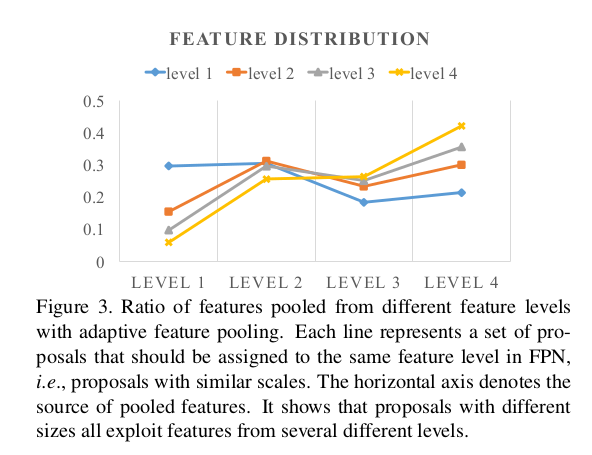
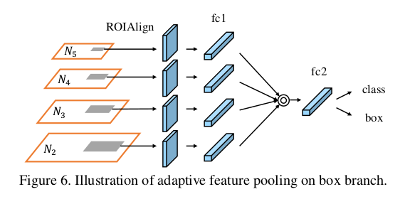
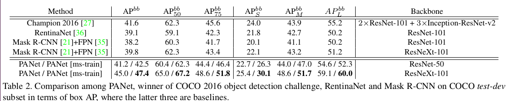
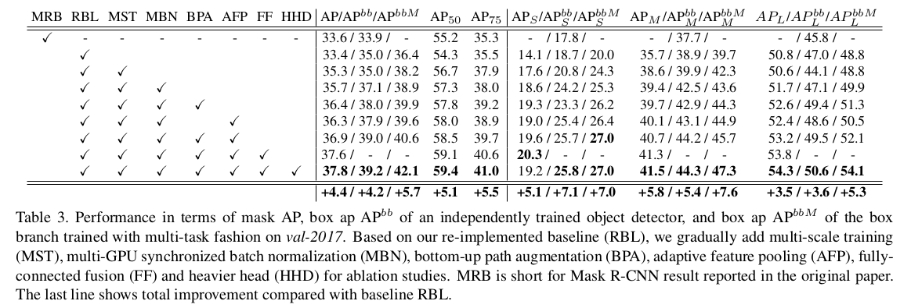
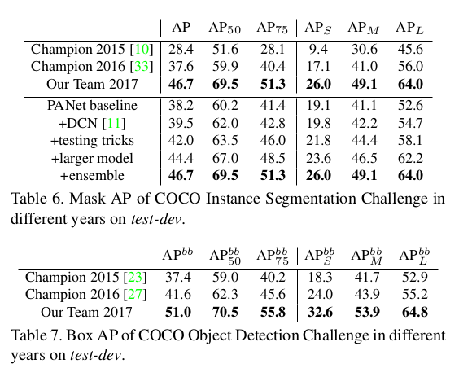
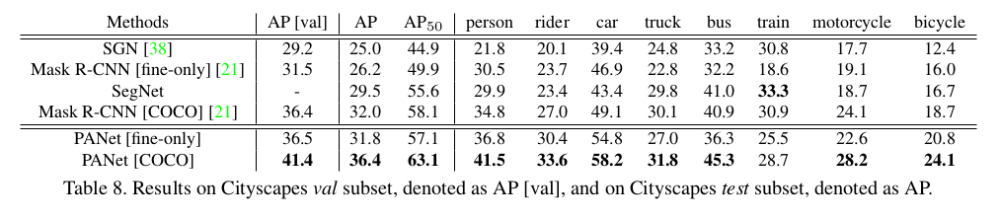
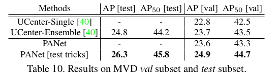

Path Aggregation Network for Instance Segmentation
=

# 1. Introduction
在图像分类中提出几种设计网络的原则，这些原则也影响对象识别。例如，通过清晰的残差连接[23,24]和密集连接[26]缩短信息路径和简化信息传播是有用的。通过在拆分变换合并（split-transform-merge）策略[61,6]（ResNeXt、Dual Path Network）之后创建并行路径来增加信息路径的灵活性和多样性也是有益的。

**我们的发现**  我们的研究表明，Mask R-CNN中的信息传播可以进一步提高。具体地，低层特征有利于大型实例的识别。但是，从低层结构到最高层特征有一个很长的路径，所以增加了获得准确定位信息的难度。此外，基于从一个特征级别池化的特征网格来预测每个提议，该特征级别是启发式分配的。由于在其它层丢弃的信息可能有助于最终的预测，所以这一过程可以进行升级。最后，掩模预测在一个单一的感受野进行，这失去了聚合更多样信息的机会。

**我们的贡献**
- 第一，为了缩短信息路径和加强特征金字塔准确定位存在于低层的信号，创建了bottom-up路径。实际上，低层特征在[44,42,13,46,35,5,31,14]的系统中使用低层特征。_但是没有探索传播低级特征来增强整个特征层次结构以进行实例识别。_

- 第二，为了恢复的每个建议和所有特征等级之间破碎的信息路径，我们开发了自适应特征池化（adaptive feature pooling）。它是为每个提议聚合所有特征层特征的简单组件。使用这个操作，创建了比[4,62]更清晰的路径。

- 第三，为了捕获每个提议的不同感受野，我们使用小型全连接层增强掩模预测，它与Mask R-CNN最初使用的FCN具有互补特性。通过融合这两种感受野的预测，信息的多样性得到增加，而更高质量的掩模得以产生。

# 3. Framework
我们的框架度图1所示。路径增强和聚合用于改善性能。bottom-up路径被增强以使得信息更容易传播。我们设计自适应特征层以允许每个提议可以从用于预测的所有层获得信息。一个补充路径被添加到掩模预测分支。

## 3.1. Bottom-up Path Augmentation
**Motivation** [63]深刻的之处，高层神经元强烈响应整个物体，而其他神经元更可能被局部纹理和模式激活，这表明需要扩充自上而下的路径来传播语义上强大的特征并增强FPN中的具有理想分类能力所有特征。

我们的框架通过传播低级模式的强响应来进一步增强整个特征层次结构的定位能力，这是基于对边缘或实例部分的高响应是准确定位实例的强有力指标这一事实。为此，我们建立了一条从低层到顶层的清晰横向连接路径。因此，在这些级别上存在“快捷方式（shortcut）”（图1中的绿色虚线），其包含少于10个层。相比之下，FPN中的CNN主干给出了一条长路径（图1中的红色虚线），从低层到最高层经过100多个层。

**Augmented Bottom-up Structure** 我们的框架首先完成自下而上的路径扩充。我们遵循FPN用于定义生成具有相同空间大小的特征映射的层在同一网络阶段（stage）。每个特征水平对应一个阶段。我们也使用ResNet作为基本结构，并使用 $\{P_2, P_3, P_4, P_5\}$ 表示FPN生成的特征水平。我们扩充轮径从最低水平 $P_2$ 开始并逐渐接近 $P_5$，如图1（b）所示。从 $P_2$ 到 $P_5$，空间尺寸以因子2逐渐进行下采样。我们使用 $\{N_2, N_3, N_4, N_5\}$ 表示与 $\{P_2, P_3, P_4, P_5\}$ 对应的新生成的特征图。注意， $N_2$ 直接为 $P_2$ ，没有任何处理。

如图2所示，每个构建块通过横向连接获取更高分辨率的特征映射 $N_i$ 和更粗略的映射 $P_{i + 1}$ ，并生成新的特征映射 $N_{i + 1}$ 。然后，融合的特征图通过另外一个 $3 \times 3$ 卷积层处理以为接下来的子网络生成 $N_{i+1}$ 。这是一个迭代过程，并在到达 $P_5$ 后终止。在这些构建块中，我们始终使用特征图的通道为256 。所有的卷积层后都有一个ReLU。每个提议的特征格从新特征图（即 $\{N_2, N_3, N_4, N_5\}$）上池化。

## 3.2. Adaptive Feature Pooling
**Motivation** 在FPN中，提议更具其大小分配到不同特征水平。它将小型提议分配到低级特征水平，而大型提议分配到更高级特征水平。虽然简单有效，但仍然可能产生非最优结果。例如，两个具有10个像素差异的意义可能分配到不同的级别。实际上，这两个提议非常相似。

此外，特征的重要性可能与它们所属的级别没有很强的相关性。高层特征生成时具有较大感受野，并且捕获更丰富的上下文信息。允许小型提议获取这些特征可以更好地利用有用的上下文信息进行预测。相似地，低层特征有许多精细的细节和高定位准确率。让大型提议获取它们是明显有益的。有了这些想法，我们提出总每个提议的所有层池化特征，并将它们融合以进行预测。我们称这一过程为 adaptive feature pooling 。

我们现在分析使用自适应特征池化从不同层池化的特征的比例。我们使用max操作融合来自不同级别的功能，这使得网络选择逐元素的有用信息。我们根据最初在FPN中分配的级别将提议分为四类。对于每个提议集合，我们计算从不同层选择的特征的比例。1到4级代表从低到高的水平。如图3所示，蓝线表示在FPN中，分配到level 1的小提议。令人吃惊的是，接近70%的特征来自其他的更高水平。我们也使用黄线表示FPN中分配到level 4的大型提议。又发现大于50%的特征来更底水平的池化。这个观察清楚的表明 _多个级别的特征一起有助于准确预测。_ 这也是对bottom-up路径扩展的强力支持。

**Adaptive Feature Pooling Structure** 自适应特征池化在实现上很简单，如图1（c）所示。首先，对于每个提议，我们将它们映射到不同特征水平，如图1（b）的灰黑色区域。遵循Mask R-CNN，使用RoIAlign从每个水平池化特征网格。然后，使用一个融合操作（element-wise max or sum）来融合不同水平的特征网格。

_在接下来的子网络中，池化特征网格在融合操作之后独立地通过一个参数层，以使网络能够适应特征。例如，在FPN的边界框分支中，有两个 $fc$层，我们将融合操作应用到第一层之后。由于Mask R-CNN中将四个连续的卷积层应用到掩模预测分支，因此，我们将融合操作应用到第一个和第二个卷积层之间。消融分析在4.2节给出_ 融合特征用作每个提议的特征网格以进一步预测，即分类、边界框回归和掩模预测。边界框分支如图6 。

我们的设计侧重于融合来自网络内特征层次结构的信息，而不是来自输入图像金字塔的不同特征图的信息[52]。与[4,62,31]的过程相比更简单，其中需要L-2归一化、concatenation和降维。

## 3.3. Fully-connected Fusion
**Motivation** 全连接层或者MLP广泛用于实例分割[10,41,34]中的和掩模提议生成[48,49]中的掩模预测。[8,33]的结果表明，FCN也能够预测逐像素的掩模。最近，Mask R-CNN将小型FCN用到池化特征网格以预测相应的掩模，从而避免类别之间的竞争。

我们注意到与FCN相比，$fc$ 层产生不同的属性，其中FCN基于局部感受野在每个像素处给出预测，并且参数在不同的空间位置处共享。相反，$fc$ 层是位置敏感的，因为通过改变参数组来实现不同空间位置处的预测。因此，他们有能力适应不同的空间位置。此外，使用整个提议的全局信息进行每个空间位置的预测，有助于区分实例和识别属于某个对象的单独部分。鉴于 $fc$ 和卷积层的特性彼此不同，我们融合了这两种类型的预测，以便更好地进行掩模预测。

**Mask Prediction Structure** 我们的掩模预测组件重量轻，易于实现。掩码分支对每个提议在池化特征网格上操作。如图4所示，主要路径是一个小型FCN，其由4个连续卷积层以及一个反卷积层组成。每个卷积层有256个 $3\times 3$的滤波器组成，反卷积以因子2上采样特征。它独立地预测每个类的二进制像素方掩码以解耦分割和分类，类似于Mask R-CNN。我们进一步从 $conv3$ 到 $fc$ 层创建一个短路径，它由两个卷积层组成，其中第二个卷积层将通道数缩小到输入的一半以减小计算开销。

$fc$ 层用于预测类别无关的前景/背景掩模。它不仅有效，而且允许 $fc$ 层的参数使用更多样本训练，导致更好的通用性。掩模的大小为 $28 \times 28$ 使得 $fc$ 层产生 $784 \times 1 \times 1$ 的向量。这个向量被调整到与FCN预测的掩模相同的空间尺寸。为了获得最终的掩模预测，来自FCN的每个类的掩模和来自 $fc$ 的前景/背景预测相加。仅使用一个 $fc$ 层而不是多个 $fc$ 层进行最终预测可以防止将隐藏的空间特征映射折叠成短特征向量的问题，这会丢失空间信息。

# 4. Experiments
## 4.1. Implementation Details
使用预训练模型初始化。我们采用图像中心训练[16]。对于每幅图像，我们以正负比 $1:3$ 采样512个RoI。weight decay 为0.0001，momentum为0.9 。其他超参数根据数据集有轻微的变化。遵循Mask R-CNN，提议来自独立训练的RPN [35,51]，以便于消融和公平比较，即骨干不与对象检测/实例分割共享。

## 4.2 Experiments on COCO
**Hyper-parameters** 一个图像batch包含16张图像。图像的短边和长边分别为800和1000。对于实例分割，以学习率0.02训练120K 次迭代，以0.002训练另一个40K次迭代。对于对象检测，我们训练没有掩模预测分支的对象检测器，以学习率0.02训练60K次迭代，以学习率0.002训练另一个20K迭代。

**Instance Segmentation Results**
使用与Mask R-CNN相同的图像尺度800进行训练和测试，我们的方法在相同的初始模型下优于单模型最先进的Mask R-CNN，具有近3个点。结果如表1 。

**Object Detection Results**

**Component Ablation Studies**

**Ablation Studies on Adaptive Feature Pooling**

**Ablation Studies on Fully-connected Fusion**

**COCO 2017 Challenge**

## 4.3. Experiments on Cityscapes
**Hyper-parameters**  我们使用与Mask R-CNN的相同的参数集合以进行公平比较。具体地，图像的短边从 $\{800, 1024\}$ 中随机采样以用于训练，使用短边为1024的图像进行推理。以学习率0.01训练18K次迭代，以学习率0.001训练另一个6K迭代。每个batch包含8张图像（每个GPU一张图像）。ResNet-50作为初始模型。

**Results and Ablation Study**

## 4.4. Experiments on MVD

