## Spatial As Deep: Spatial CNN for Traffic Scene Understanding

### 摘要

​		卷积神经网络 (CNN) 通常是通过逐层堆叠卷积操作来构建的。尽管CNN已显示出从原始像素中提取语义的强大能力，但其捕获图像跨行和列像素空间关系的能力尚未得到充分探索。这些关系对于学习具有强形状先验但弱外观连贯性的语义对象很重要，例如交通车道，它们通常被遮挡或甚至没有绘制在路面上，如图 1（a）所示。本文中，我们提出Spatial CNN（SCNN），它将传统的深层逐层卷积推广到特征图中的逐片卷积，从而实现跨层中跨行和列的像素之间的消息传递。如此的SCNN特别适合长而连续的形状结构或大型目标，空间关系强但外观线索较少，如车道、电线杆和墙壁。我们将 SCNN 应用于新发布的非常具有挑战性的交通车道检测数据集和 Cityscapse 数据集。结果表明SCNN可以学习结构输出的空间关系并显着提高性能。我们表明，在车道线检测数据集中，SCNN 的性能分别优于基于循环神经网络 (RNN) 的 ReNet 和 MRF+CNN (MRFNet) 8.7% 和 4.6%。此外，我们的SCNN在TuSimple Benchmark Lane Detection Challenge上赢得第1名，准确率为96.53%。代码见https://github.com/XingangPan/SCNN。

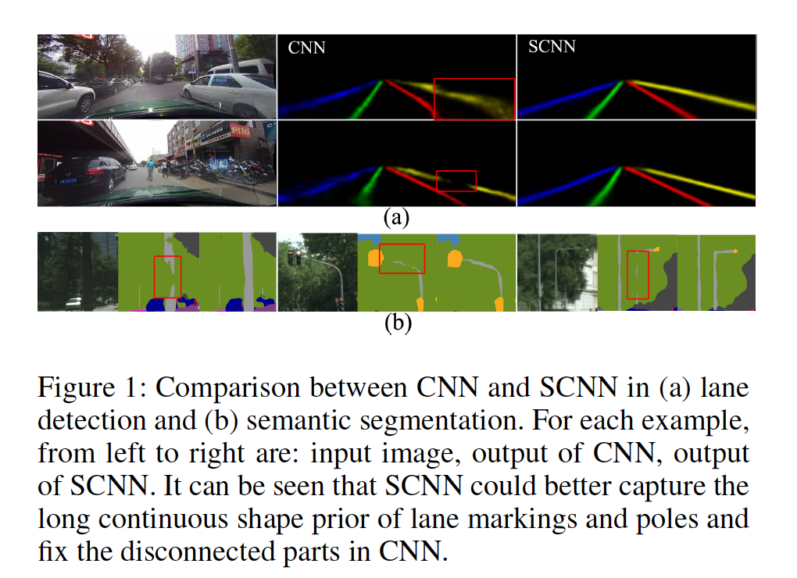

### 引言

​		最近几年，自动驾驶在学术界和工业界都受到非常多的关注。自动驾驶的最具挑战任务之一是交通场景理解，其中包括计算机视觉任务，如车道线检测和语义分割。车道线检测有助于引导汽车，并可可以用于驾驶辅助系统（Urmson等2008），而语义分割提供了关于周围物体（如车辆或行人）的更详细的位置。但是，在真实应用中，考虑到许多恶劣的场景，包括恶劣的天气条件、昏暗或眩光等，这些任务可能非常具有挑战性。交通场景理解的另一个挑战是，在很多情况下，特别是在车道检测中，我们需要处理具有强结构先验但外观线索较少的物体，例如车道标记和电线杆，这些物体具有较长的连续形状并且可能被遮挡。例如，在图1（a）的第一个例子中，右侧的汽车完全遮挡了最右边的车道线标记。

​		尽管基于 CNN 的方法（Krizhevsky、Sutskever 和 Hinton 2012；Long、Shelhamer 和 Darrell 2015）由于强大的表示学习能力将场景理解推向了一个新的水平。对于具有较长结构区域并且可能被遮挡的物体，它仍然表现不佳，例如图1中红色边界框中所示的车道标记和电线杆。然而，人类可以很容易地推断出他们的位置并从上下文中填充被遮挡的部分，即可见部分。

​		为了解决这个问题，我们提出Spatial CNN（SCNN），将深度卷积神经网络推广到丰富的空间级别。在逐层的CNN中，卷积层接收前一层的输入，并应用卷积操作和非线性激活，并将结果送入下一层。这一过程依次完成。相似地，SCNN将特征图的行或列视为层，并依次使用卷积、非线性和求和操作，其构成深度神经网络。以这种方式，信息可以在相同层的神经元之间传播。它对于具有遮挡的车道、杆或卡车等结构化对象特别有用，因为可以通过层间传播来增强空间信息。如图1所示，在 CNN 不连续或杂乱的情况下，SCN 可以很好地保持车道标线和电线杆的平滑性和连续性。在我们的实验中，SCNN模型好其他基于RNN或MRF/CRF的方法，并且比远远更深的ResNet-101还好。

​		**相关工作**	对于车道线检测，大多数现有算法都基于手工制作的低级特征（Aly 2008；Son et al. 2015；Jung、Youn 和 Sull 2016），限制了处理恶劣条件的能力。仅Huval等（2015）在车道检测中采用深度学习进行了首要尝试，但没有大型通用数据集。而对于语义分割，基于CNN的方法已成为主流，并获得极大成功。

​		在神经网络中还有利用空间信息的一些其他尝试。Visin等（2015）和Bell等（2016）使用RNN来沿着行或列传递信息，因此，在一个RNN层中，每个像素位置可以仅接受来自相同行或列的信息。Liang等（2016a、2016b）提出LSTM的变体来利用语义目标解析中的纹理信息，但是如此的模型在计算上昂贵的。研究人员也尝试将CNN和图模型（MRF或CRF）结合，其中利用具有大核的卷积实现信息传递。与前面提到的方法相比，SCNN有三种优势：（1）顺序消息传递方案比传统的密集 MRF/CRF 具有更高的计算效率，(2) 消息作为残差传播，使 SCNN 易于训练，以及 (3) SCNN 很灵活，可以应用于任何级别的深度神经网络。

### Spatial Convolutional Neural Network

#### Lane Detection Dataset

​		本文中，我们提出用于交通车道线检测的大规模挑战性数据集。尽管交通车道线检测的重要性和难度，已有的数据集要么太小，要么太简单，并且大型公开注释的基准测试需要比较不同方法。KITTI和CamVid包含车道/车道标记的像素级注释，但只有数百张图像，对于深度学习方法来说太小了。Caltech Lanes Dataset（Aly 2008）和最近释放的TuSimple Benchmark Dataset（TuSimple 2017）分别包含1224和6408张具有注释车道线标记的图像，而在交通受限的情况下，交通量较少且车道标记清晰。此外，这些数据集都没有注释由于磨损而被遮挡或看不见的车道标记，而这些车道标记可以被人类推断出来，并且在实际应用中具有很高的价值。

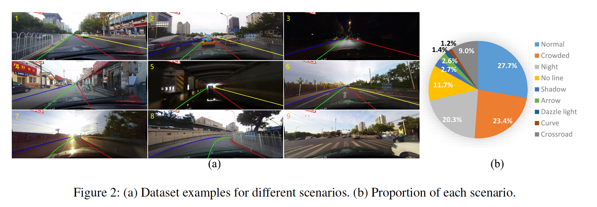

​		为了收集数据，我们在由不同司机驾驶的六辆不同车辆上安装了摄像头，并记录了不同日期在北京行驶的视频。收集了超过55小时的视频，并提取133235帧，其超过TuSimple Dataset的20倍。我们将数据集分为88880张图像的训练集、9675张图像的验证集和34680图像的测试集。这些图像使用 (Scaramuzza、Martinelli和Siegwart 2006) 中的工具未失真，分辨率为$1640\times590$。图2（a）展示了一些示例，其包含城市、郊区和高速场景。作为世界上最大和最拥挤的城市，北京为车道线检测提供许多挑战性交通场景。我们将测试集划分为正常和8中挑战性类别，其对于图2（a）中的9个例子。图2（b）给出每个场景的比例。可以看出，8个具有挑战性的场景占了数据集的大部分（72.3%）。

​		对于每帧，我们用三次样条手动注释交通车道线。如早期提到的，在许多情况下，车道线被汽车或遮挡或不可见。在实际应用中，即使在这些频繁发生的具有挑战性的场景中，车道检测算法也可以根据上下文估计车道位置，这一点很重要。因此，对于这些情况，我们仍然根据上下文注释车道线，如图2（a）（2）（4）。我们还希望我们的算法可以区分道路上的障碍，如图2（a）（1）中一个。因此，障碍另一侧的车道没有注释。 在本文中，我们将注意力集中在四个车道标记的检测上，这是在实际应用中最受关注的。 其他车道标记没有注释。

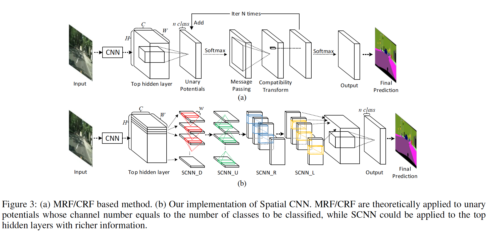

#### Spatial CNN		

​		传统方法基于Markov Random Fields（MRF）或Conditional Random Field（CRF）建模空间关系。最近将它们与 CNN 结合的工作（Zheng等2015; Liu等2015; Chen等2017）都遵循图 3（a）的流程，其中均值场算法可以用神经网络实现。具体而言，过程为（1）Normalize：将CNN的输出视为一元势，并通过 Softmax 操作进行归一化，（2）Message Passing，其家用通过具有大核的逐通道卷积（对于密集CRF，核大小可以覆盖整幅图像，核权重依赖输入图像）实现，（3）Compatibility Transform，其可以利用$1 \times 1$卷积层实现，（4）Adding unary potential。这一过程迭代N次以获得最终输出。

​		可以看出，在传统方法的消息传递（message passing）过程中，每个像素都接收来自所有其他像素的信息，计算量很大，并且很难像自动驾驶那样用于实时任务。对于MRF，大型卷积核难以学习，并且通常需要仔细初始化。此外，这些方法应用于 CNN 的输出，而包含更丰富信息的顶部隐藏层可能是建模空间关系的更好地方。

​		为了处理这些问题，并且为了更有效地学习空间关系和平滑、连续的车道线标记鲜艳，或驾驶场景中的其他结构化目标，我们提出Spatial CNN。值得注意的是，这里，“spatial”与“spatial convolution”不同，但是通过特殊设计的CNN结构传播空间信息。

​		如图3（b）中的“SCNN_D”模块，考虑在大小为$C \times H \times W$的3D张量上应用SCNN，其中$C$、$H$和$W$分别表示通道、行和列。将这个张量划分为$H$个切片，然后，将第一个切片传入大小为$C \times w$的$C$个核，其中$w$为核的宽度。在传统CNN中，然后，卷积层的输出被馈入下一层，而这里，将输出加到下一个切片以得到新的切片。然后，将新切片送入下一卷积层，这一过程持续到最后的切片被更新。

​		具体而言，假设我们有3D张量$\mathbf{K}$，其中元素$K_{i,j,k}$表示最后一个切片的通道$i$中的元素与当前切片的通道$j$中的元素之间的权重，两个元素之间的偏移量为$k$列 。输入的3D张量$\mathbf{X}$也表示为$X_{i,j,k}$，其中$i$、$j$和$k$分别表示通道、行和列的索引。然后，SCNN的前向计算为：

$$X_{i,j,k}' = \begin{cases}X_{i,j,k}, & j = 1 \\ X_{i,j,k} + f(\sum_m\sum_n X_{m,j-1,k+n-1}' \times K_{m,i,n}), & j = 2, 3, \cdots, H\end{cases}\tag{1}$$

其中$f$为非线性激活函数ReLU。具有上标$'$的$X$表示已更新的元素。值得注意的是，所有切片共享卷积核权重。还要注意的是，SCNN有方向。在图3（b）中，后缀“D”、“U”、“R”、“L”的四个“SCNN”模块分别表示向下、向上、向右核向左的SCNN。

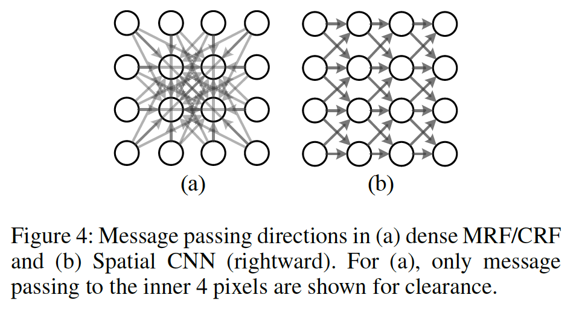

#### 分析

​		与传统方法相比，Spatial CNN有三个主要优势，总结如下：

​		（1）Computational efficiency。如图4所示，在密集MRF/CRF中，每个像素直接接收来自所有其他像素的信息，而在SCNN中，信息传递在顺序传播方案中实现。具体而言，假设具有$H$行和$W$列的张量，在密集MRF/CRF中，$WH$像素中的每两个像素之间存在信息传递。对$n_{iter}$次迭代，信息传递的数量为$n_{iter}W^2H^2$次。在SCNN中，每个像素仅接收来自$w$个像素的信息，因此信息传递的数量为$n_{dir}WHw$，其中$n_{dir}$和$w$分别表示SCNN中传播方向的数量和SCNN的核宽度。$n_{iter}$范围为10到100，而本文中，$n_{dir}$设置为4，对应4个防线，$w$通常不大于10（图4（b）的例子中$w=3$）。可以看出，对于上百行和列的图像，SCNN可以节约大量计算，同时每个像素仍然可以接收来自所有其他像素的消息，信息沿 4 个方向传播。

​		（2）Message as residual。在MRF/CRF中，通过所有像素的加权和获得信息传递，根据前一段介绍，这是在计算上是昂贵的。考虑到如此多行，基于循环神经网络的方法可能遭遇梯度下降。但是，深度残差学习已在简化非常深的神经网络方面表现出其能力。相似地，在我们的深度SCNN中，消息被传播为残差，其为式（1）中的ReLU的输出。这种残差也可以看作是对原始神经元的一种修改。 正如我们的实验将显示的那样，这种消息传递方案比基于 LSTM 的方法获得了更好的结果。

​		（3）Flexibility	由于SCNN的计算效率，它可以很容易地纳入到 CNN 的任何部分，而不仅仅是输出。通常，顶部隐藏层包含丰富且高语义的信息，因此是应用 SCNN 的理想场所。通常，图 3 显示了我们在 LargeFOV (Chen et al. 2017) 模型上的 SCNN 实现。 在顶部隐藏层（‘fc7’层）之后依次添加四个空间方向上的 SCNN，以引入空间消息传播。

### 实验

​		我们在我们的车道线检测数据集和Cityscapes上评估SCNN。在两个任务上，我们使用标准的SGD训练模型，批大小设置为12，学习率为0.01，动量为0.9，权重衰减为0.0001。学习率策略为指数为为0.9的“poly”，迭代次数为60K。我们的模型基于 (Chen et al. 2017) 中的 LargeFOV 模型进行了修改。前13层卷积的权重初始化自ImageNet训练的VGG16。所有实验利用Torch7实现。

#### Lane Detection

**车道线检测模型**	与仅需要边界框的通用目标检测任务不同，车道线需要精准的曲线预测。一种自然的想法是模型应当输出这些曲线的概率图（probmaps），因此我们生成像素级目标来训练网络，这与语义分割任务相似。与其将不同的车道标记视为一个类，并在之后进行聚类，我们希望神经网络来区分车道线标记自身，这可能会更加鲁棒。因此，这四种车道线可以视为不同的类。此外，将概率图送入小型网络以给出车道线标记存在性的预测。

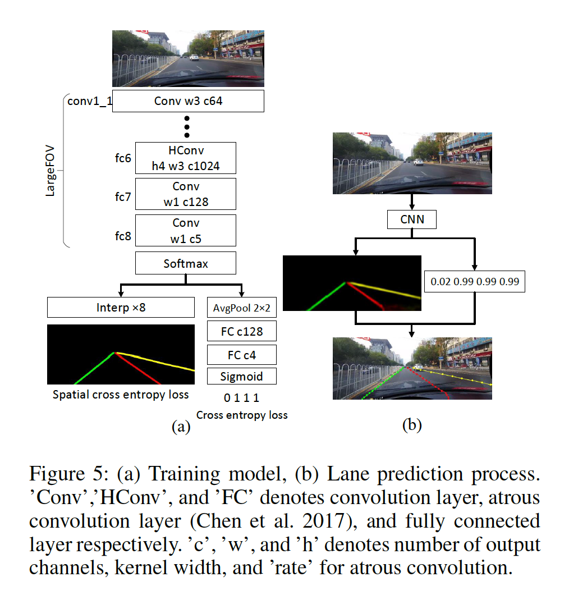

​		测试期间，我们仍需要从probmap到曲线。如图5（b）所示，对于每个存在性值大于 0.5 的车道标记，我们每 20 行搜索相应的 probmap 以寻找响应最高的位置。然后，通过三次样条连接这些位置，其为最终预测。

​		如图5（a）所示，我们的基线模型和LargeFOV的详细差异为：（1）将“fc7”的输出通道数设置为128，（2）“fc7”层的空洞卷积层的“rate”设置为4，（3）在ReLU层之前添加batch normalization，（4）添加一个小型网络来预测车道线标记的存在性。训练期间，目标的线宽度设置为16个像素，并且输入和目标图像缩放到$800 \times 288$。考虑到背景和车道线标记之间的不平衡，背景的损失乘以0.4。

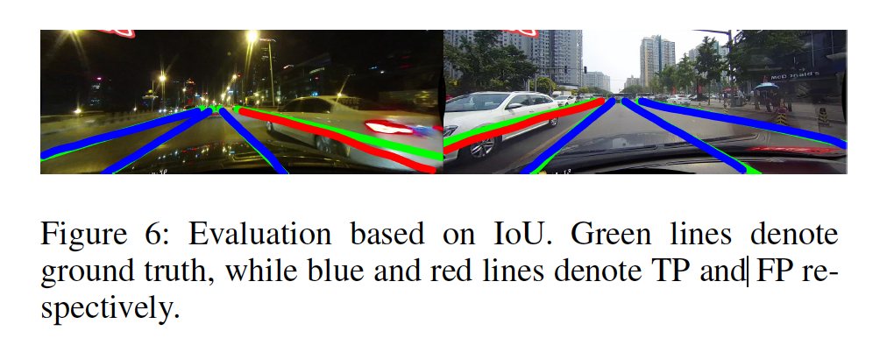

**Evaluation**	为了判断车道线是否被成功检测到，我们将车道线标记视为宽度等于30像素的线，并且计算ground-truth和预测之间的IoU。IoU大于某个阈值的预测视为true positive（TP），如图6所示。这里，我们考虑的阈值为0.3和0.5，分别对应宽松和严格阈值。然后，我们采用$\mbox{F-measure} = (1 + \beta^2)\frac{\mbox{Precision Recall}}{\beta^2 Precision + Recall}$作为最终的评估指标，其中$\mbox{Precision} = \frac{TP}{TP + FP}$以及$\mbox{Recall} = \frac{TP}{TP + FN}$。这里$\beta$设置为1，对应调和平均数（F1-measure）。

**消融研究**	在2.2节中，我们提出Spatial CNN来确保空间信息传播。为了验证我们的方法，在本节中，我们给出详细的消融研究。SCNN的实现如图3所示。

​		（1）多向 SCNN 的有效性。首先，我们研究SCNN中方向的有效性。我们尝试不同方向实现的SCNN，结果见表1。这里，SCNN的核宽度$w$设置为5。可以看出性能随方向的添加而增加。为了证明改进不是来自更多的参数，而是来自SCNN带来的消息传递方案，我们在基线模型的顶部隐藏层之后添加了一个$5\times5$核宽度的额外卷积层，并与我们的方法进行了比较。从结果可以看出，额外的卷积层只能带来很小的改进，这验证了SCNN的有效性。

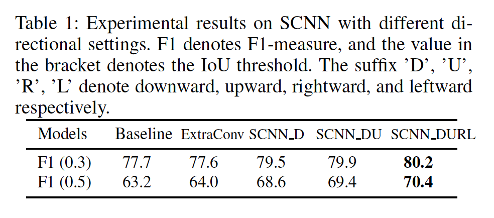

​		（2）核宽度$w$的影响。基于“SCNN_DURL”模型，我们进一步尝试具有不同核宽度的SCNN，如表2所示。这里，核宽度表示一个像素可以从中接收消息的像素数，$w = 1$ 的情况类似于 (Visin等2015; Bell等 2016) 中的方法。

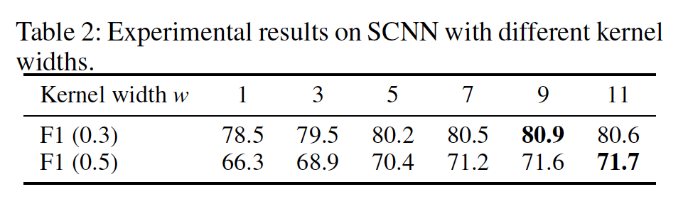

​		（3）不同位置的Spatial CNN。如前面提到的，SCNN可以添加到神经网络的任何位置。这里，我们考虑将SCNN_DURL模型用在（1）输出和（2）顶部隐藏层，其对应图3。表3中的结果表明，包含比输出更丰富的信息的顶部隐藏层是应用 SCNN 的更好位置。

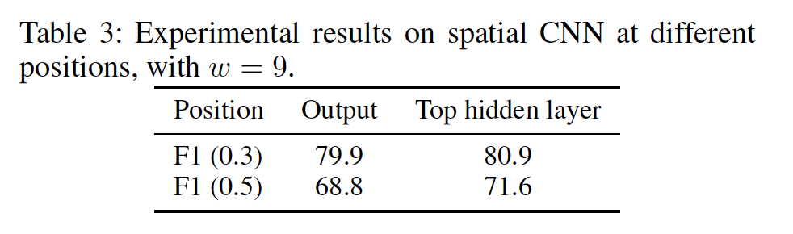

​		（4）顺序传播的有效性。在我们的SCNN中，信息以顺序方式传播，即一个切片在从前一个切片接收到信息之前不会将信息传递给下一个切片。为了验证该方案的有效性，我们将其与并行传播进行比较，即每个切片在更新之前同时将信息传递给下一个切片。 对于这种并行情况，方程（1）右侧的 $'$ 被删除。如表 4 所示，顺序消息传递方案明显优于并行方案。 这个结果表明，在 SCNN 中，一个像素不仅受到附近像素的影响，而且确实从更远的位置接收信息。

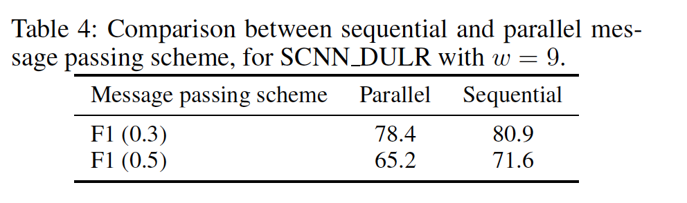

​		（5）与SOTA的比较。

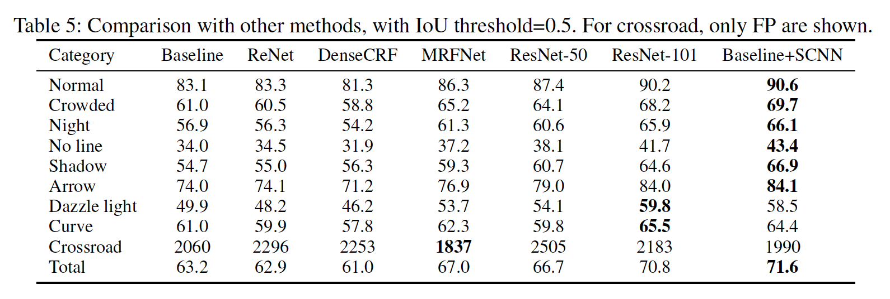

​		（6）其他方法的计算效率

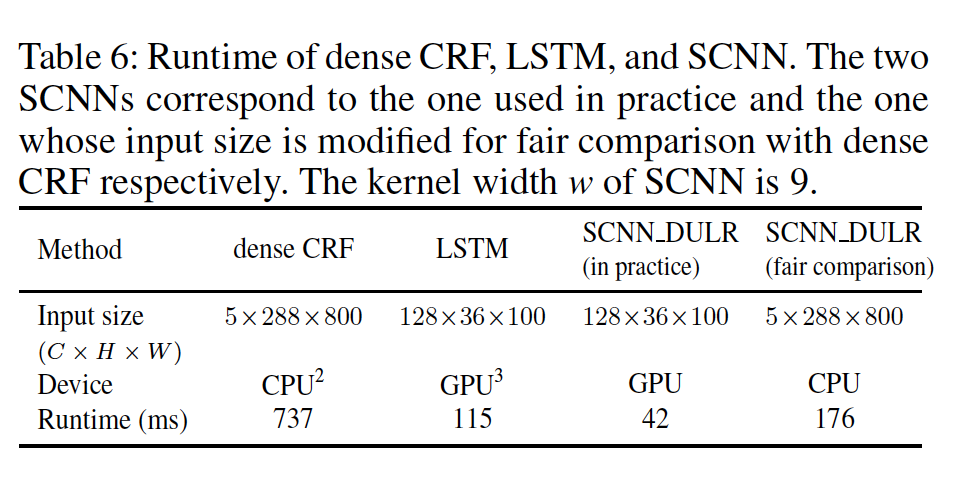

#### Cityscapes上的语义分割

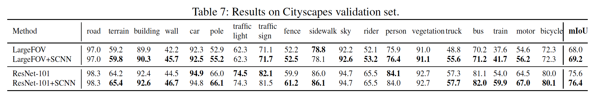

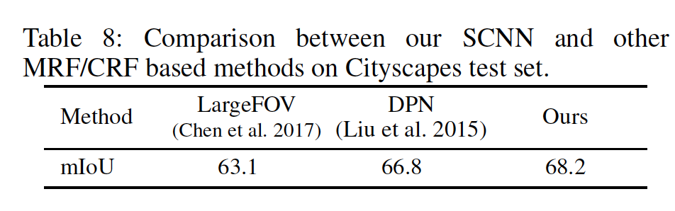

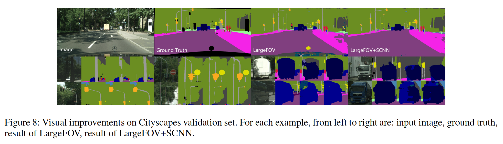

