## VPGNet: Vanishing Point Guided Network for Lane and Road Marking Detection and Recognition

### 摘要

​		在本文中，我们提出了一个统一的端到端可训练多任务网络，该网络联合处理在恶劣天气条件下由消失点引导的车道线和道路标记检测和识别。我们处理雨天和低光照条件，由于明显的挑战，这些条件直到现在还没有得到广泛研究。例如，在雨天拍摄的图像会受到低光照的影响，而潮湿的道路会导致反光并扭曲车道和道路标记的外观。在夜间，在有限的光照下引发色彩扭曲。因此，没有基准数据集，只有少数开发的算法可以在恶劣的天气条件下工作。为了处理这个缺点，我们构建车道线和道路标记基准测试，其包含具有17种车道线和道路标志类的约20000张图像，这些图像采集自不同的场景：非雨天、雨天、大雨和夜间。我们训练和评估几个版本的多任务网络，并且验证每个任务的重要性。产生的方法（VPGNet）可以检测和分类车道线和道路标志，并且利用单次前向传播预测vanishing point。实验结果表明，我们的方法在不同条件下以实时速度（20fps）获得高准确率和鲁棒性。基准测试和VPGNet见https://github.com/SeokjuLee/VPGNet。

### 1. 引言

​		自动驾驶是包含多个传感器和控制模块的大型系统。鲁棒性自动驾驶的关键步骤是识别和理解主体附近的环境。然而，简单地识别障碍物和理解车辆周围的几何形状是不够的。应遵守车道和道路标记等交通标志规定的交通法规。此外，对于适用于自动驾驶的算法，它应该在不同环境下具有鲁棒性并实时执行。

​		但是，迄今为止，对车道和道路标记检测的研究仅限于晴朗的天气条件。基于手工特征的方法利用边缘、颜色和纹理信息进行检测，当算法在具有挑战的天气和光照条件下测试时，会产生性能衰减。相似地，基于CNN和手工特征的组合方法面临挑战。最近，开发一些基于CNN的方法来以端到端的形式处理这个问题，包括基于学习的算法。 它们在基准测试和真实道路场景中表现出良好的性能，但仍局限于晴朗的天气和简单的路况。

​		公开车道线和道路标记数据集的缺乏自动驾驶进步的另一挑战。可用的数据集通常是有限的，并且不足以用于深度学习方法。例如，Caltech Lanes 数据集包含获取自四种不同地方的1225张图像。此外，Road Marking Dataset包含1443张图手工标注为11个道路标志类。现有数据集均在晴天下拍摄，场景清晰，不考虑恶劣天气场景。

​		随着深度学习的进步，挑战性场景中的鲁棒性识别的关键是包含不同环境中采集数据的大型数据集。由于车道和道路标志没有合适的数据集，我们收集并注释了在城市地区拍摄的具有挑战性的场景的车道和道路标记。此外，需要具有适当训练方案的更高网络能力来生成精细表示以应对不同的数据。 我们建议训练一个以类似于人类的方式识别全局上下文的网络。

​		有趣的是，即使很难发现，人类也可以沿着车道行驶。研究工作 [20、19、28] 经验表明，驾驶员注视方向与道路方向高度相关。这意味着几何上下文在车道定位中起着关键作用。受此启发，我们旨在利用消失点预测任务（vanishing point prediction task）来将几何上下文识别能力嵌入到提出的网络。此外，我们希望通过以下贡献推进自动驾驶研究：

- 我们建立了在各种天气和光照条件下获取的车道和道路标记检测和识别基准数据集。该数据集包含大约 20,000 张图像，其中包含 17 个手动注释的车道和道路标记类。 还提供了消失点注释。
- 我们设计了一个统一的端到端可训练多任务网络，共同处理由消失点引导的车道和道路标记检测和识别。我们根据创建的基准对我们的网络进行了广泛的评估。结果表明在不同天气条件下具有实时性能的鲁棒性。 此外，我们建议提出的消失点预测任务使网络能够检测未明确看到的车道。

### 2. 相关工作

​		本节中，我们介绍先前旨在处理道路场景检测的挑战。我们的设置以及相关工作基于单目视觉设置。

#### 2.1. Lane and Road Marking Detection

​		尽管车道和道路标记检测似乎是一个简单的问题，但该算法必须在各种环境中准确并具有快速的计算时间。基于手工特征的车道线检测方法[9、17、15、5、29、31、33]检测标记的一般形状，并尝试拟合一条线或一条样条来定位车道线。这类算法对于特定的场景表现很好，而在不熟悉的条件下表现很差。在道路标记检测算法的情况下，大部分作品都是基于手工制作的特征。Tao等[34]提取多个感兴趣区域作为Maximally Stable Extremal Regions（MSER），并且依赖FAST和HOG特征来为每个车道标记构建模板。相似地，Greenhalgh等利用HOG特征，并训练SVM来产生类标签。但是，如车道线检测的情况，这些方法在不熟悉的条件下表现出性能下降。

​		最近，深度学习方法在计算机视觉领域中表现出极大的成功，包括车道线检测。[18、16]提出一种基于CNN的车道线检测算法。Jun Li等[21]使用CNN和RNN来检测车道边界。在这项工作中，CNN提供车道结构的几何信息，并且通过检测车道线的RNN来利用这种信息。Bai He等[14]提出使用Dual-View CNN（DVCNN）框架进行车道线检测。在这种方法中，将前视角相机和顶视角相机馈入DVCNN。与车道线检测算法相似，一些工作已经研究了神经网络作为特征提取器和分类器的应用，以提高道路标记检测和识别的性能。Bailo等提出了一种方法，将多个感兴趣区域提取为 MSERs [25]，合并可能属于同一类的区域，最后利用 PCANet [6] 和神经网络对区域提议进行分类。

​		尽管上述方法提供了使用深度学习进行车道和道路标记检测的有希望的性能，但在恶劣条件下的检测问题仍未解决。在本文中，我们提出了一种在包括恶劣天气和低光照条件在内的任何情况下都表现良好的网络。

#### 2.2. 利用CNN进行目标检测

​		随着深度学习的进步，检测、分类和分割等识别任务已经在广泛的条件下得到解决，但还没有领先的解决方案。RCNN及其变体[12、11、27]在检测和分类方面取得了突破，优于以前的方法。Faster RCNN[27]用卷积网络替换了手工制作的提议方法，其方式是区域提议层与分类层共享提取的特征。Overfeat[30]表明可以有效地计算具有滑动窗口方法的卷积网络。还报告了其在使用多尺度图像目标识别和定位方面的性能。它的一些变体[23、26]在检测任务上获得SOTA性能。尽管这些方法在包含占据图像重要部分的目标的大规模基准测试 [8, 10, 22] 上表现出最前沿的结果，但对于更小和更薄的对象（例如车道或道路标记），性能会降低。

​		几种深度学习方法专门用于车道和小物体识别。例如，Huvald等介绍一种基于全卷积架构的车道和车辆检测方法。他们使用[30]的结构，并使用由七个卷积层组成的集成回归模块扩展该方法以进行特征共享。将网络划分为两个分支，分别进行二分类和回归任务。他们在没有复杂道路标记的高速公路上评估天气晴朗时的结果，但不执行多标签分类。此外，Zhu等提出多个任务进行交通信号（相对较小）检测和分类。在这项工作中，将分类层并行地添加到[16]以进行检测和分类。因此，这项工作报告了比 Fast RCNN [11] 更好的检测小物体的性能。

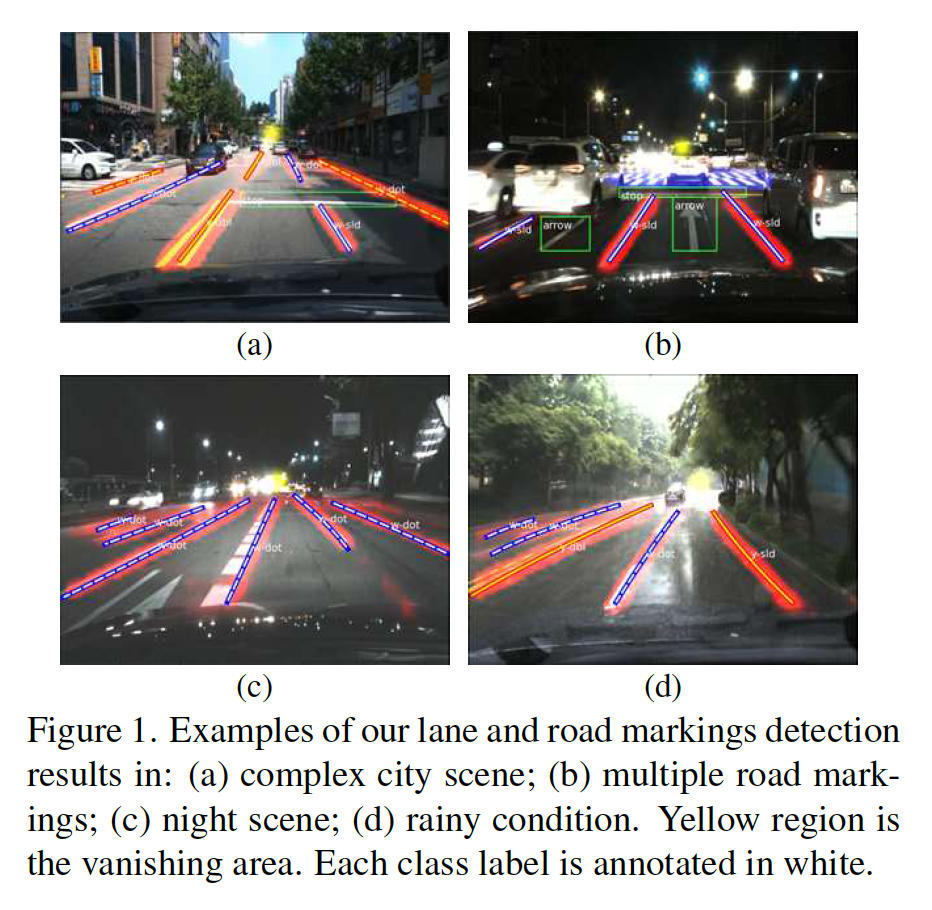

### 3. 基准测试

#### 3.1. Data Collection and Annotation

​		我们收集了各种情况下的数据集，并根据一天中的时间和天气条件对图像进行了分类。夜间图像不按天气条件细分，而是包括在具有挑战性的低光照情况下拍摄的一般图像。每个场景的图像数量见表1。由于我们的数据集是在恶劣天气条件下捕获的，因此我们在车辆内（中心）安装了一个摄像头。以这种方式，我们可以避免损害相机传感器，同时也可以防止水滴直接落在相机镜头上。但是，由于在大雨中录制了多个视频，因此偶尔会捕捉到雨刷器的一部分。摄像头对准汽车的前视角。图像分辨率为$1228 \times 728$。我们的数据是在韩国首尔市中心地区捕获的。车道和道路标记的形状和符号遵循韩国的规定。

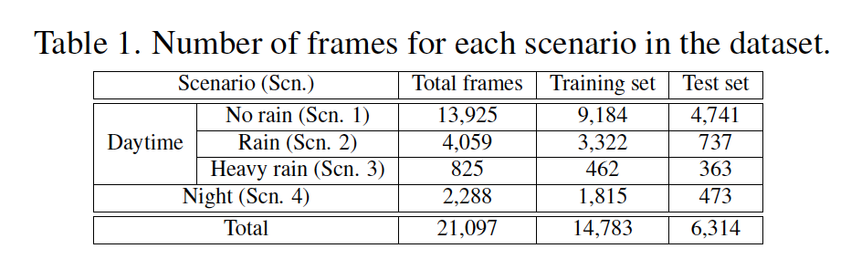

​		我们手工注释车道线的角点和道路标记。连接角点以构成多边形，其产生每个目标的像素级掩膜注释。以相似的方式，每个像素包含一个类标签。

​		但是，如果网络使用细车道注释进行训练，则信息往往会通过卷积和池化层消失。此外，由于大多数神经网络需要调整图像的大小（通常小于原始大小），细小的注释变得几乎不可见。因此，我们提出将像素级注释映射到网格级掩膜。将图像换分为$8 \times 8$的网格，并且如果原始注释中的任何像素位于网格单元内，则该网格单元将填充一个类标签。考虑到我们的网络的输入大小为$640 \times 480$，并且输出大小为$80 \times 60$，网格大小设置为与输入和输出图像之间的尺度因子 ($1/8$) 成正比。具体而言，将网格大小设置为$8 \times 8$。图2显示了一个注释示例。

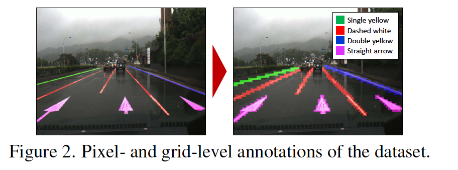

​		也提供了消失的点注释。我们在平行车道相交的道路场景中定位消失点。根据场景，为每个消失点分配一个难度级别（EASY、HARD、NONE）。EASY级包含清晰的场景（例如直接的道路）；HARD级包含杂乱场景（例如交通拥挤）；NONE为不存在消失点的地方（例如交叉点）。需要注意的是，直线和曲线车道都用于预测消失点。我们在第 4.2 节中详细描述了消失点的定义。 此外，补充材料中还提供了注释示例。

#### 3.2. Dataset Statistics

​		我们的数据集包含在首尔行驶三周期间拍摄的约 20,000 张图像。原始视频 (30 fps) 以1Hz的间隔采样以生成图像数据。复杂城市交通场景的图像包含一天中不同时间不同天气条件下的车道和道路标记。总共注释了 17 个类别，涵盖了道路上最常见的标记。尽管我们在各种情况下录制了视频，但观察到不同类型的车道和道路标记之间的数据不平衡。例如，在车道类别的情况下，白色虚线和双黄线比其他车道类型更常见。 关于道路标记类别，直箭头和人行横道最常出现。我们还定义了一个“其他标记”类，其中包含仅在韩国存在的道路标记，或者没有足够数量的实例作为单独的类进行训练。类的类型和实例的数量列在表2中。

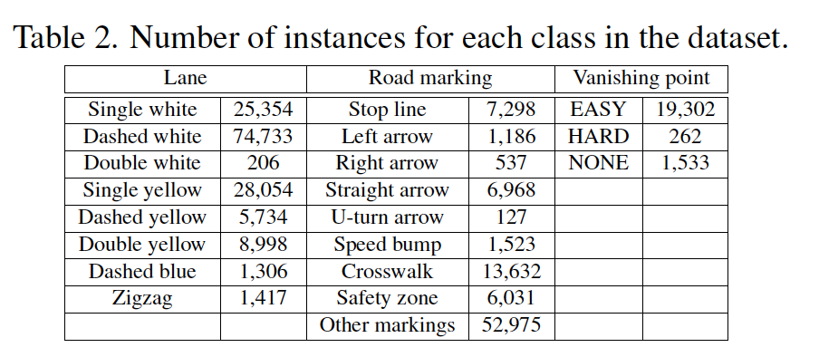

### 4. 神经网络

#### 4.1. 架构

​		我们的网络（VPGNet）受[16]和[35]的启发。我们网络的竞争优势在于它专门检测和识别车道和道路标记以及定位消失点。

​		我们提出了一个数据层来诱导网格级注释，从而能够同时训练车道和道路标记。最初，[16、35]中，边界框回归任务旨在将单个边界框拟合到特定的目标。这适用于具有斑点（blob）形状的目标（交通标志或车辆），但车道和道路标记不能由单个框表示。因此，我们提出一种替代回归，其利用网格级掩膜。网格上的点回归到最近的网格单元，并通过多标签分类任务组合来表示一个目标。这使我们能够整合两个独立的目标，车道线和道路标记，它们具有不同的特征和形状。对于后处理，车道线类仅使用多标签任务的输出，道路标记类同时使用网格框回归和多标签任务（参见第 4.4 节）。此外，我们添加了一个消失点检测任务，以在车道和道路标记模式的训练期间推断全局几何上下文（在第 4.2 节中解释）。

​		综合架构见表3和图3。网络有四个任务模块，每个任务进行互补协作：网格框回归、目标检测、多标签分类和消失点预测。这种结构允许我们检测和分类车道线和道路标记，并且在单次前向传播中同时预测消失的区域。

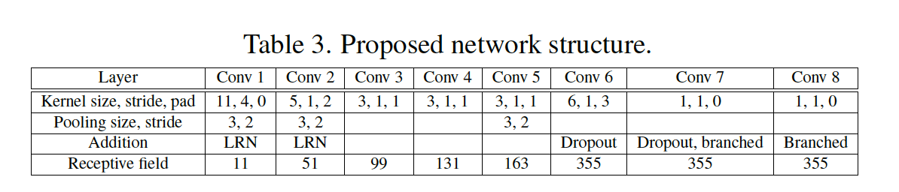

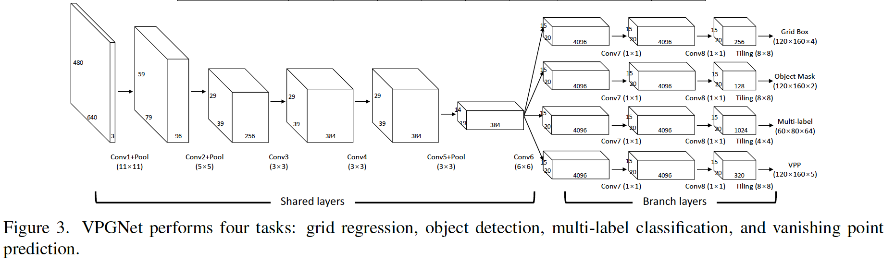

#### 4.2. Vanishing Point Prediction Task

​		由于恶劣的天气环境、照明条件和遮挡，车道的能见度降低。但是，在如此场景中，人类可以根据全局信息直观地预测车道线的位置，例如附近的道路结构或交通流量 [20、19、28]。受此启发，我们设计一种Vanishing Point Prediction（VPP）任务，其与人类视觉相似，指导鲁棒性车道线和道路标记检测。消失点是三维空间中的平行线通过图形透视会聚到二维平面的点。在大多数驾驶情况下，车道和道路标记会聚到一个点，无论道路是弯的还是直的。在本文中，“Vanishing Point（VP）”定义为地平线上最近的点，车道线在可见车道线的最远点周围会聚和消失。这个VP可以用于提供场景的全局几何上下文，其对于推理车道线和道路标记的位置非常重要。我们将 VPP 模块与多任务网络相结合，将车道收敛的几何图案训练到一点。

​		Borji[4]以证明CNN可以定位VP。作者通过使用softmax分类器向量化网络的空间输出以预测VP的确切位置。但是，在整个网络的输出大小上只选择一个点会导致定位不精确。为了提供更鲁棒的定位，我们进行几种实验来引导VP。

​		首先，对于VPP任务，我们尝试回归损失（即L1、L2、hinge损失），其直接从VP计算像素距离。不幸的是，因为由于损失规模的差异，很难平衡损失与其他任务（对象检测/多标签分类），结果并不理想。因此，我们采用交叉熵损失来平衡每个检测任务传播的梯度。通过使用交叉熵损失，首先，我们使用二分类方法，其直接分类背景和前景（例如消失区域，见图4a），这与目标检测任务相同。二值掩码是在数据层中通过绘制一个以我们注释的VP为中心的固定大小的圆来生成的。然而，在 VPP 任务上使用这种方法会导致训练损失的收敛速度极快。这是由背景和前景像素数量不平衡引起的。由于消失的区域远小于背景，网络最初将每个像素推理为背景类。这种现象与我们训练 VPP 以学习场景的全局上下文的初衷相矛盾。

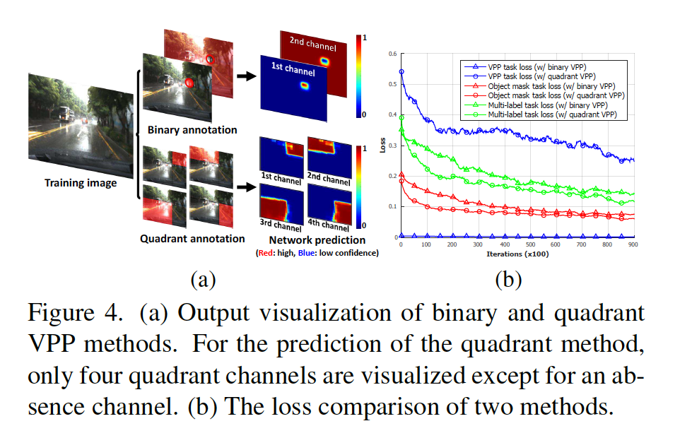

​		考虑到上述二值VPP方法不平衡带来的挑战，我们新设计了VPP模块。如前所述，附加 VPP 任务的目的是改进场景表示，该场景表示暗示全局上下文，以预测由于遮挡或极端照明条件导致的不可见车道线。应该考虑整个场景，以有效地反映推断车道位置的全局信息。我们使用象限掩膜将整个图像分成四个部分。这四个部分的交集是一个VP。 以这种方式，我们可以使用覆盖全局场景结构的四个象限部分来推断 VP。为了实现这一点，我们为 VPP 任务的输出定义了五个通道：一个是缺席（absence）通道和四个象限通道。输出图像中的每个像素都选择属于五个通道之一。缺席通道用于表示没有VP的像素，而四个象限通道表示图像的象限部分之一。例如，如果图像中存在VP，每个像素应当分配给象限通道之一，同时不会选择缺席通道。具体而言，第三个通道由道路场景的右上角边缘引导，第四个通道将提取道路场景的左上角边缘。另一方面，如果VP难以识别（例如交叉路口、遮挡），每个像素都倾向于被归类为缺失通道。 在这种情况下，缺失通道的平均置信度会很高。

​		与二分类方法不同，我们的象限方法丰富包含场景全局结构的梯度信息。图4b中损失的比较间接表明，与二元情况相比，网络在训练时没有过拟合。值得注意的是，我们仅使用象限VPP方法进行评估。引入二元VPP方法只是为了向读者表明，单纯的VPP训练方案无法产生令人满意的结果。整个多任务网络使我们能够检测和识别车道和道路标记，并在单个前向传播中同时预测VP。

#### 4.3. 训练

​		我们的网络包括涵盖不同上下文的四个任务。检测任务识别目标并覆盖局部上下文，而 VPP 任务涵盖全局上下文。如果这些任务在同一训练阶段一起训练，网络可能会受到某个主导任务的高度影响。我们注意到在训练阶段 VPP 任务变得依赖于车道检测任务。车道线和VP之间的依赖隐含一种强信息关系。在这种情况下，VP给网络提供冗余信息，导致边缘车道线检测的提高。为了防止副作用，我们在两个阶段中训练网络来容忍任务之间的平衡。

​		在第一阶段中，我们仅训练VPP任务。我们将除了VPP任务外的其他任务的学习率固定为0。以这种方式，我们可以训练学习图像全局上下文的核。这一个阶段的训练训练到VP检测任务收敛为止。尽管我们仅训练VPP任务，但由于相互共享层的权重更新，其他检测任务的损失也减少了约 20%。这表明车道和道路标记检测和 VPP 任务在特征表示层中具有一些共同特征。

​		在第二阶段中，我们进一步使用第一阶段训练的核初始化所有任务。由于所有任务在这一点上一起训练，平衡它们的学习率非常重要。如果某个任务的损失权重很小，那么它就会变得依赖于其他任务，反之亦然。式（1）给出来自每个任务的四个损失之和：

$$Loss = w_1 L_{reg} + w_2 L_{om} + w_3L_{ml} + w_4 L_{vp} \tag{1}$$

其中$L_{reg}$为网格回归L1损失，$L_{om}$、$L_{ml}$和$L_{vp}$为网络每个分支的交叉熵损失。我们以如下方式的权重项$w_1\sim w_4$来平衡任务。首先，$w_1 \sim w_4$设置为1，并开始观察损失。然后，我们将这些初始损失值的倒数设置为损失权重，以使损失均匀。在训练过程中，如果损失之间的尺度差异变大，则重复此过程以平衡损失值。 当验证精度收敛时，第二阶段停止。

#### 4.4. 后处理

​		每条车道和道路标记类别和VP都需要恰当地表示以用于现实世界的应用。因此，我们实现后处理技术以生成视觉上令人满意的结果。

​		**Lane**	在车道线类中，我们使用如下技术：点采样、聚类和车道线回归。首先，我们从多标签任务中车道通道概率高的区域对局部峰值进行子采样。采样到的点为可能成为车道线分割的候选。此外，通过逆透视映射（inverse perspective mapping：IPM）将采样到的点投影到鸟瞰视角。IPM用于分割VP附近的采样点。这不仅适用于笔直道路，也适用于弯曲道路。然后，我们通过我们改进的基于密度的聚类方法对点进行聚类。我们通过像素距离依次决定簇。在按垂直索引对点进行排序后，如果在现有bin的顶部之间有一个封闭点（close point），我们将这个点堆叠在一个bin中。否则，为新簇创建一个新的bin。通过这样做，我们可以降低聚类的时间复杂度。最后一步是利用VP的位置对来自获得的簇的线进行二次回归。如果每个车道簇的最远样本点接近VP，我们将其包含在簇中以估计多项式模型。 这使得车道结果在 VP 附近稳定。 类类型从网络的多标签输出分配给每个线段。

​		**车道标记**	对于车道标记类，使用网格采样和边界框聚类。首先，我们从网格回归任务中以高置信度从多标签输出中提取每个类别的网格单元。然后我们选择每个网格的角点并将它们与附近的网格单元迭代合并。如果没有属于相同类的更多相邻网格单元，融合终止。一些难以由单个框定义的道路标记，例如人行横道或安全区，通过网格采样进行定位，无需后续合并。

​		**消失点**	我们的VPP模块输出置信度图的五个通道：四个象限通道和一个缺席通道。通过这些象限，我们生成VP的位置。式（2）和式（3）描述每个象限的边界交点：

$$P_{avg} = \frac{1 - (\sum p_0(x,y))/(m \times n)}{4}\tag{2}$$

$$loc_{vp} = \arg\max_{(x,y)} \sum_{n=1}^4 |P_{avg} - p_n(x,y)|^2\tag{3}$$

其中$P_{avg}$为VP在图像中存在的概率，$p_n(x,y)$为第$n$个通道（$n=0$：absence channel）上$(x,y)$的置信度，$m \times n$为置信度图大小，$loc_{vp}$为VP的位置。

### 5. 结果

​		我们的实验包含6个部分。首先，我们介绍实验设置，例如数据集拆分和训练参数。 其次，我们提供对我们网络的分析。 我们探索多个任务如何共同协作并影响彼此的表现。 第三，介绍了我们对每个目标的评估指标。 最后，我们展示了车道、道路标记和 VPs 检测和分类结果。

#### 5.1. 实验设置

​		提供的数据集的总结见表1。训练期间，我们通过翻转原始图像将图像数量加倍。这反过来又使训练集加倍，并防止来自车道位置的位置偏差。更具体地说，数据集是在右侧驾驶国家获得的，通过翻转数据集我们可以模拟左侧环境。

​		在第一个训练阶段中，我们仅通过VPP任务初始化网络。在初始化之后，同时训练所有四个任务。对于每个任务，我们使用动量为0.9的SGD，并且mini-batch大小为20。由于多个任务必须按比例收敛，我们调整每个任务的学习率。

​		我们训练了三个按任务划分的网络模型：2-Task（修订版 [16]）、3-Task（修订版 [35]）和 4-Task（VPGNet）。2-Task网络包括回归和二分类任务。3-Task网络包括2-Task和多标签分类任务。4-Task网络包括3-Task和VPP任务，其为VPGNet。由于 [16] 中的车道检测不能完全重现，我们修改数据层以处理网格掩码，并将一个卷积层从共享层移动到分支层，就像在 3 和 4 任务网络中一样。 3-Task 网络类似于[35]，但我们修改了数据层来处理网格掩码。

​		我们在 NVIDIA GTX Titan X 上测试我们的模型，仅使用一次前向传递就达到了 20 Hz 的速度。 具体来说，单次前向传递大约需要 30 毫秒，后处理大约需要 20 毫秒或更短时间。

#### 5.2. 多任务学习分析

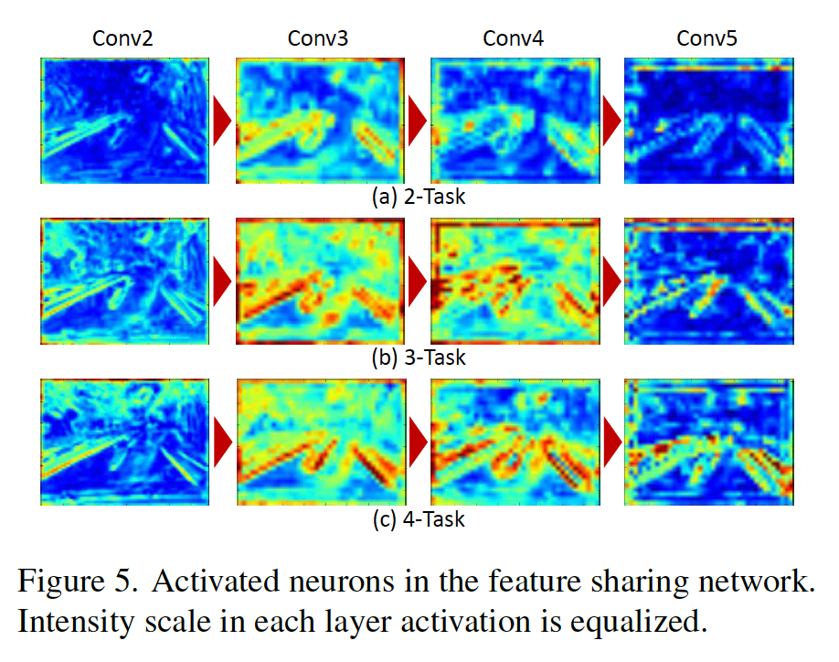

#### 5.3. 评估度量

​		本节中，我们介绍四种基准评估的评估标准。首先，我们为车道线引入我们的评估标准。由于我们的基准测试的ground-truth是用网格单元注释的，我们计算从每个单元的中心到每个单元的采样车道点的最小距离。如果最小的距离在边界$R$之内，我们将这个采样点标记为true positive，并且相应的网格单元作为检测到。通过测量每条车道线中的网格单元，我们可以严格评估车道线段的位置。此外，为了比较，我们测量F1得分。

​		在道路标记的情况下，我们使用简化的评估方法。由于我们在驾驶时唯一需要的信息是我们面前的道路标记而不是道路标记的确切边界，因此我们测量预测斑点的精度。具体而言，我们计算与ground-truth单元重叠的所有预测单元。将重叠单元标记为true positive单元。如果true positive单元的数量大于聚集 blob 上所有预测单元数量的一半，则覆盖的真实目标被定义为检测到。 此外，我们测量召回分数以进行比较。

​		对于VP的评估，我们ground-truth点和预测VP之间的欧式距离。通过改变与真实值 VP 的阈值距离 R 来评估召回分数。 图 6 显示了我们如何衡量网络的所有三个目标的摘要。

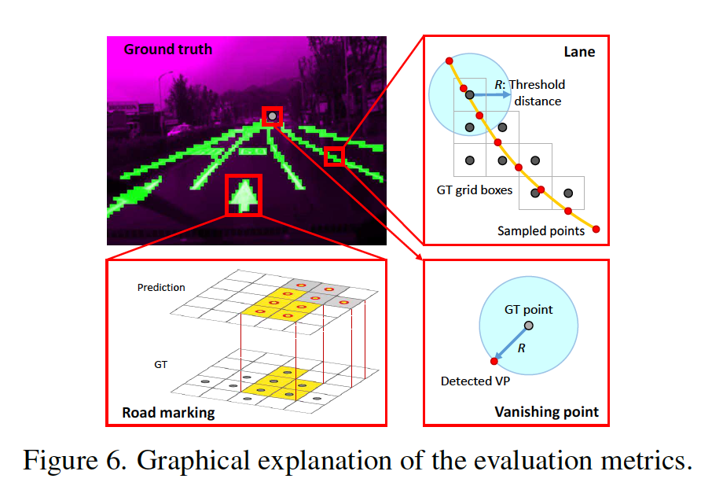

#### 5.4. Lane Detection and Recognition

​		对于车道线类，我们测量检测，以及同时检测和分类的性能。首先，我们将我们的多任务网络与Caltech Lanes Dataset中的基线方法进行比较（见图7）。我们将$R$设置为等于车道厚度的平均半值（20 像素）。 由于透视效果，相机前的双车道大约有70到80个像素厚度，在VP附近小到8个像素（单格大小）。由于该数据集包含白天相对简单的场景，因此 2-、3-和 4-Task 网络的整体性能非常相似。 尽管如此，我们的网络还是取得了最好的 F1 分数。

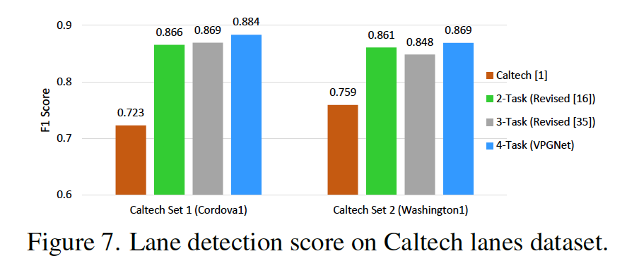

​		此外，我们在我们的基准数据集上对提出的三个版本的多任务网络和 FCN-8s [24] 分割方法进行了比较。 重要的是要注意，我们的网络使用网格级别的注释，而FCN-8则使用像素级别和网格级别的注释进行独立训练。出于测试目的，选择了 5.1 节中的四个场景，并在每个场景中比较了 F1 分数。 图 8 显示了实验结果。 值得注意的是，我们的方法在每种恶劣天气条件下都显示出明显更好的车道检测性能。 此外，VPGNet 的前向传递时间为 30 毫秒，而 FCN-8s [24] 需要 130 毫秒。

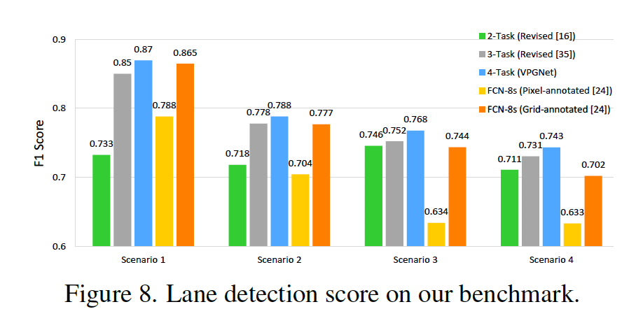

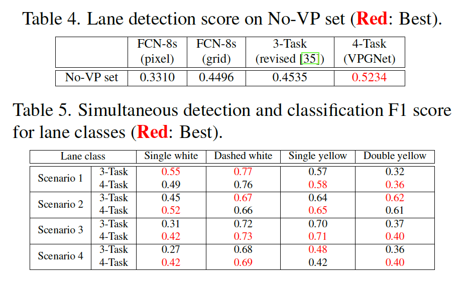

#### 5.5. 道路标记检测和识别

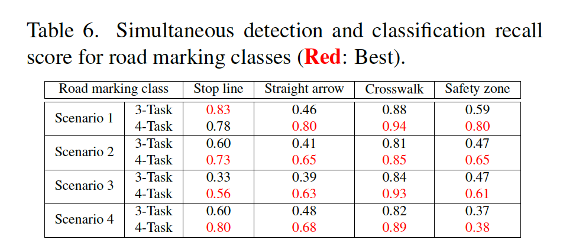

#### 5.6. Vanishing Point Prediction

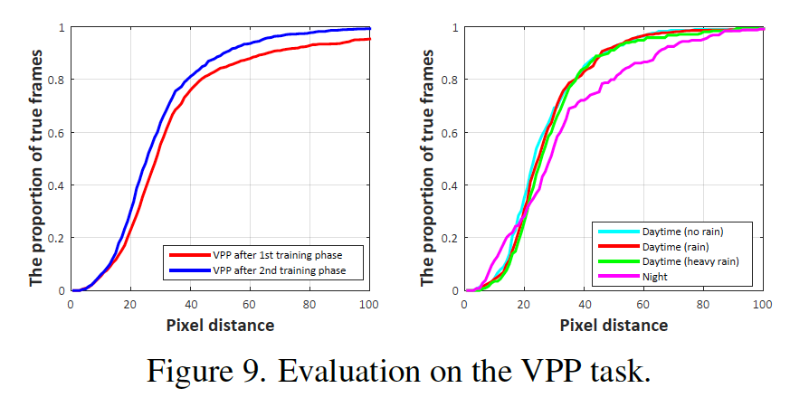

