## Equalization Loss for Long-Tailed Object Recognition

### 摘要

​		使用CNN的目标识别技术获得极大成功。但是，目前最先进的目标检测方法在大词汇量和长尾数据集（如LVIS）上的性能仍然很差。在这项工作中，我们从一个新颖的角度分析这个问题：一个类的每个正样本可以看作其他类的负样本，使得尾部类别接收到更多令人沮丧的梯度。在此基础上，我们提出了一个简单而有效的损失（称为均衡损失（equalization loss））通过简单地忽略稀有类别的梯度来解决长尾稀有类别的问题。均衡损失保护稀有类别的学习在网络参数更新过程中处于不利地位。因此，该模型能够更好地学习稀有类目标的判别特征。没有任何花里胡哨的操作，在LVIS基准测试的稀有和普遍类上，与Mask R-CNN相比，我们的方法分别获得4.1%和4.8%的性能增益。利用高效的均衡损失，在LVIS Challenge 2019上获得第一名。代码见 https://github.com/tztztztztz/eql.detectron2 。

### 1. 引言

​		最近，由于深度学习和卷积神经网络的出现，计算机视觉社区见证目标识别的巨大成功。目标检测，其为计算机视觉的基础任务，在诸如重识别、人体姿态估计和目标跟踪等的许多相关任务中起着中心作用。

​		今天，通用目标识别的大多数数据集（例如Pascal VOC和COCO）主要收集常见的类别，并且每个类具有大量标注。但是，当来到更实际的场景时，类频率具有长尾分布的大型词汇数据集（例如LVIS）是不可避免的。类别的长尾分布的问题对目标检测模型的学习来说是一个巨大挑战，特别是稀有类别（非常少量样本的类）。注意，对于一个类，包括背景在内的其他类别的所有样本都被视为负样本。因此，在训练过程中，少数类别很容易被大多数类别（具有大量样本的类别）压倒，并且倾向于被预测为负类。因此，在这样一个极不平衡的数据集上训练的传统目标检测器受到很大的影响。

​		以往的研究大多将长尾类分布问题的影响视为训练过程中的批量抽样不平衡，主要通过设计专门的抽样策略来解决[2、16、32、38]。其他工作引入专门的损失公式来处理正负样本不平衡问题[27、25]。但是，它们关注前景和背景样本之间不平衡，使得不同前景类之间的严重不平衡仍是一个挑战性问题。

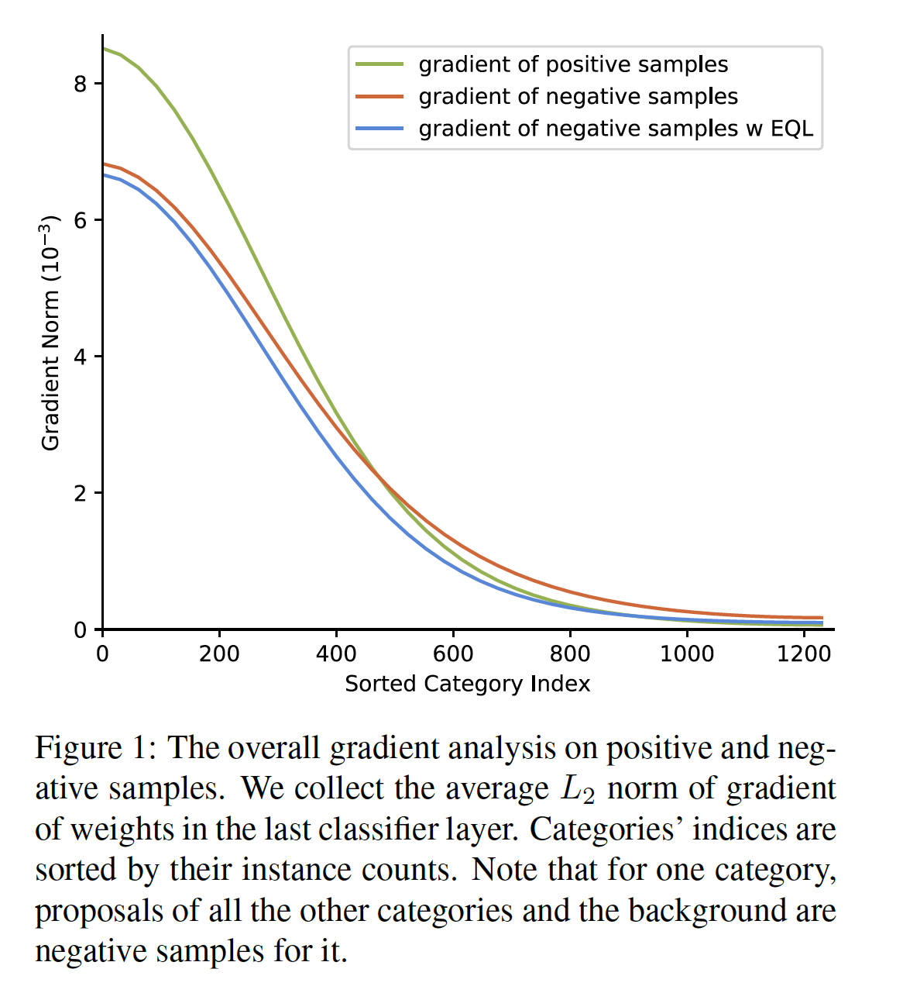

​		在这项工作中，我们关注不同前景类之间极端不平衡的频率，并提出一种新观点来分析它的影响。如图1所示，绿色和橙色的曲线分别表示正负样本贡献的梯度的平均范数。我们可以看到，对于频繁出现的类，平均上，正梯度的影响比负梯度大，但是对于稀有类，状态恰好相反。更进一步说，分类任务中常用的损失函数，如softmax交叉熵和sigmoid交叉熵，对非ground-truth类具有抑制作用。当某一类样本被用于训练时，其他类的预测参数将得到令人沮丧的梯度，从而导致它们预测低概率。由于稀有类别的对象很少出现，在网络参数更新过程中，这些类别的预测器被令人沮丧的梯度所淹没。

​		为了处理这个问题，我们提出新颖的损失函数——equalization loss（EQL）。一般来说，我们为每个样本的每个类引入一个权重项，其主要减小稀有类的负样本的影响。均衡损失的完整公式在第3节中介绍。利用均衡损失负样本的平均梯度范数会减小，如图1（蓝色曲线）所示。EQL的影响的简单可视化如图2所示，它说明每一类有（红色曲线）和无（蓝色曲线）均衡损失的正提议的平均预测概率。可以看出，EQL在不影响高频类别准确性的情况下，显著提高稀有类别的性能。利用所提出的EQL，网络参数更新期间，不同频率的类带来更均等的状态，并且训练得到的模型能够更准确地辨别稀有类的目标。

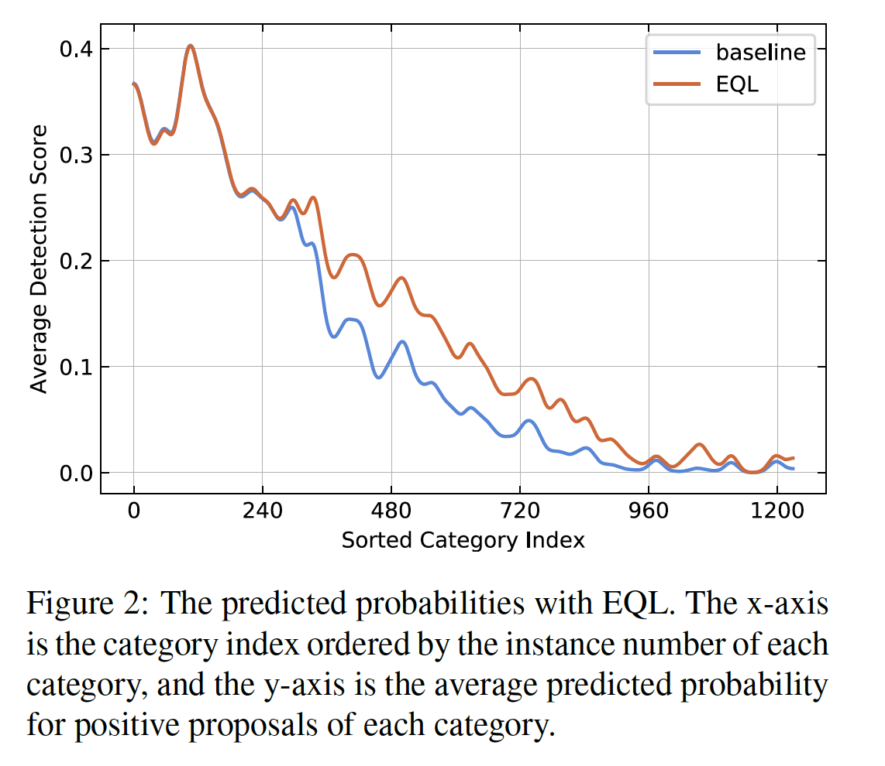

​		在不平衡数据集（例如Open Images和LVIS）上的大量实验证明我们方法的有效性。我们还在其他任务验证我们的方法，如图像分类。

​		我们的关键贡献如下：（1）我们提出分析长尾问题的新观点：类间竞争对学习过程中稀有类别的抑制，解释了稀有类别在长尾数据集上表现不佳的原因。基于这种观点，提出一种新颖的损失函数（equalization loss），通过引入忽略策略来减轻学习过程中抑制梯度过大的影响。（2）针对不同的数据集和任务，如目标检测、实例分割和图像分类，我们进行了大量的实验。实验证明该方法的有效性，与常用的分类损失函数相比，该方法具有较大的性能提升。配备均衡损失，在LVIS Challenge 2019上获得第1名。

### 2. 相关工作

​		我们首先回顾通用目标检测和实例分割。然后，我们介绍重采样、成本敏感重加权和特征处理方法，这些方法被广泛应用于缓解长尾数据集的类不平衡问题。

​		**目标检测和实例分割**	目标检测有两种主流框架：单阶段检测器和两阶段检测器。虽然单阶段检测器获得更高的速度，但大多数最先进的检测器都遵循两阶段体制以获得更好的性能。流行的Mask R-CNN[17]在典型的两阶段检测器中扩展掩膜头部，在许多实例分割基准上提供有希望的结果。Mask Scoring R-CNN引入额外的掩膜得分头部以对齐掩膜得分和质量。Cascade Mask R-CNN和HTC通过以级联的形式预测掩膜来进一步提高性能。

​		**Re-sampling Methods**	re-sampling中的常用方法之一是过采样，其从少数类中随机采样更多训练数据。类感知采样，也称为类平衡采样，是典型的过采样技术，其首先采样一个类别，然后均匀采样包含该类的图像。虽然过采样方法在欠表示的类上获得显著改进，但是面临高过拟合的风险。与过采样相反，欠采样的主要思想是从高频类中移除一些可用数据，从而使数据分布更加平衡。但是，欠采样在极端长尾数据集上是不可行的，因为头部类和尾部类之间的不平衡之比极大。最近，[22]提出解藕训练方案，其首先联合学校表示和分类器，然后通过重新训练具有类平衡采样的分类器获得平衡的分类器。我们的方法帮助模型学校更好的尾部类的表示，因此这可能是对解藕训练方案的补充。

​		**Re-weighting Methods**	重加权的基本思想是给不同训练样本分配权重。在不平衡数据集中，一种直觉上的策略是基于类频率的逆[41、20]对样本进行加权，或者使用平滑版本（类频率的逆平方根）[33]。基于上面提到的基于类水平调整权重的方法，也有关注样本水平重加权的研究。[27、25]通过增减困难样本的权重与减小容易样本的权重使神经网络为成本敏感的，其可以视为难样本挖掘技术的在线版本。最近，Meta-Weight-Net[40]学习用于样本重新加权的显式映射。与上述方法不同，我们关注不同前景类之间的不平衡问题。我们提出一种新的观点，其为来自高频类别的大量负梯度严重抑制稀有类别的学习。并且，我们提出新的损失函数来处理这个问题，其同时用于样本水平和类水平。

​		**Feature Manipulation**	还有一些工作直接操作特征表示。Range Loss[44]扩大类间距离，并减小类内变化。[43]通过迁移具有足够训练样本的常规类的特征方差，扩展尾部类的特征空间。[30]通过采用记忆模块，将语义特征表示从头部迁移到尾部。但是，设计这些模块或方法不是平凡任务，并且使模型更难以训练。相比之下，我们的方法更加简单，并且不直接访问表示。

### 3. Equalization Loss

​		均衡损失的中心目标是缓解长尾类分布中每个类的类数量分布不平衡问题。我们以回顾常用分类损失函数（即softmax 交叉熵和sigmoid交叉熵）开始。

#### 3.1. 交叉熵损失的回顾

​		**Softmax Cross-Entropy**从网络输出$\mathbf{z}$上推导出每个类别的多项式分布$\mathbf{p}$，然后计算估计分布$\mathbf{p}$和ground-truth分布$\mathbf{y}$之间交叉熵。softmax交叉熵损失$L_{SCE}$可以表示为：

$$L_{SCE}=-\sum_{j=1}^Cy_j\log(p_j)\tag{1}$$

并且$C$为类的数量。这里，$\mathbf{p}$由$Softmax(\mathbf{z})$计算。注意，$C$个类包含一个额外的背景类。事实上，$\mathbf{y}$使用one-hot表示，有$\sum_{j=1}^C y_j=1$。形式上，对于一个样本的ground-truth类$c$，

$$y_j =\begin{cases}1 &\mbox{if } j =c\\ 0 &\mbox{otherwise}\end{cases}\tag{2}$$

​		**Sigmoid Cross-Entropy**使用$C$sigmoid损失函数独立地估计每个类的概率。ground-truth标签$y_j$仅表示类$j$的二值分布。通常，不包含额外的背景类。相反，当一个提议属于背景时，将为所有类设置为$y_j=0$。因此sigmoid交叉熵可以表示为：

$$L_{BCE} =-\sum_j^C\log(\hat{p}_j)\tag{3}$$

其中

$$\hat{p}_j = \begin{cases}p_j &\mbox{if } y_j=1\\1-p_j &\mbox{otherwise}\end{cases}\tag{4}$$

其中$p_j$由$\sigma(z_j)$计算。在sigmoid交叉熵中，与网络输出$\mathbf{z}$对应的$L_{BCE}$和$L_{SCE}$的导数有相同的公式：

$$\frac{\partial L_{cls}}{\partial z_j} =\begin{cases}p_j-1 &\mbox{if } y_j=1 \\ p_j &\mbox{otherwise}\end{cases}\tag{5}$$

​		在softmax交叉熵和sigmoid交叉熵中，我们注意到，对于类$c$的前景样本，它可以视为任何其他类$j$的负样本。因此模型更新期间，类$j$会接受到令人沮丧的梯度$p_j$，其将导致网络为类$j$预测出低概率。如果$j$为稀有类，优化迭代期间，令人沮丧的梯度发生的频率远高于令人鼓舞的梯度。累积的梯度将对这一类别产生不可忽视的影响。最后，即使是$j$类的正样本也可能从网络中获得相对较低的概率。

#### 3.2.  均衡损失公式

​		当类别的数量分布相当不平衡时，例如在长尾数据集中，频繁类别的令人沮丧的梯度对标注稀少的类别有显著影响。利用常用的交叉熵损失，稀有类的学习容易被抑制。为了解决这个问题，我们提出均衡损失，其为稀有类别忽略来自频繁类别样本的梯度。这种损失函数的目的是使网络训练更公平，我们称之为均衡损失。

​		形式上，我们将权重项$w$引入原始的sigmoid交叉熵损失函数，均衡损失可以表示为：

$$L_{EQL} = -\sum_{j=1}^C w_j\log(\hat{p}_j) \tag{6}$$

对于区域提议$r$，我们将$w$设置为如下：

$$w_j = 1 - E(r)T_{\lambda}(f_j)(1-y_j) \tag{7}$$

在这个公式中，当$r$属于前景区域提议时，$E(r)$输出1，当$r$属于背景时，输出0。并且，$f_j$为数据集中类$j$的频率，其由类$j$的图像数除以整个数据集的图像数计算得到。$T_{\lambda}(x)$为阈值函数，当$x < \lambda$时，它输出1，否则输出0。$\lambda$用于区分尾部类别和所有其他类别，$\mbox{Tail Ratio}(TR)$用作设置其值（$\lambda$）的标准。形式上，我们通过如下公式定义$TR$：

$$TR(\lambda) = \frac{\sum_j^C T_\lambda(f_j)N_j}{\sum_{j}^C N_j} \tag{8}$$

其中$N_j$为类$j$的图像数量。在4.4节中研究公式（7）中每个部分的超参数。

​		总之，在均衡损失函数中有两种特别的设计：1）**对于量化频率低于阈值的稀有类别，我们忽略负样本的令人沮丧的梯度**。2）**我们没有忽略背景样本的梯度**。如果忽略稀有类别的所有负样本，则在训练过程中将不会出现负样本，所学习的模型将预测大量的假阳性。

#### 3.3. 扩展到图像分类

​		因为softmax损失函数广泛用于图像分类，我们也按照我们的主要思想设计了一种softmax均衡损失函数。Softmax equalization loss（SEQL）表示为：

$$L_{SEQL} = - \sum_{j=1}^C y_j \log(\tilde{p}_j) \tag{9}$$

其中

$$\tilde{p}_j = \frac{e^{z_j}}{\sum_{k=1}^C \tilde{w}_k e^{z_k}} \tag{10}$$

并且，通过下式计算权重项$w_k$：

$$\tilde{w}_k = 1-\beta T_{\lambda}(f_k)(1-y_k)\tag{11}$$

其中$\beta$为具有$\gamma$为1和$1-\gamma$为0的概率的随机变量。

​		注意，图像分类与目标检测中的分类不同：每幅图像属于特定的类，因此没有背景类。所以，权重项中没有公式（7）中的$E(r)$。所以，我们将引入$\beta$来随机保持负样本的梯度。并且，$\gamma$的影响在第6节中研究。

### 4.  LVIS上的实验

​		我们为均衡损失进行广泛实验。在本节中，我们首先结算实现细节，在4.2节和4.3节中介绍LVIS数据集上的主要结果。然后，在4.4节中，我们进行消融研究以分析均衡损失的不同组件。在4.5节中，我们比较均衡损失与其他方法。在4.6节中，介绍LVIS Challenge 2019的细节。

#### 4.1. LVIS Dataset

​		LVIS是用于实例分割大规模数据集，在当前的v0.5中，包含1230个类。在LVIS中，根据包含这些类的图像的数量将类分为三组：稀有（1-10张图像）、普通（11-100张图像）和高频（大于100张图像）。我们在57k训练图像上训练模型，并在5k验证集上评估模型。我们还在20k测试图像上报告我们的结果。评估标准是不同类从0.5到0.85 IoU 阈值上的AP。与COCO评估过程不同，因为LVIS是稀疏标注数据集，所以不评估图像级别标签中未列出的类别的检测结果。

#### 4.2.  实现细节

​		我们实现具有FPN的标准Mask R-CNN作为我们的基线模型。调整训练图像使得短边为800像素，同时长边不会超过1333像素。除了水平翻转，不再使用其他增强。在第一个阶段，RPN采样256个锚，前景背景样本之比为$1:1$，然后对于第二个阶段，每幅图像采样512个提议，前景背景样本之比为$1:3$。训练时，我们使用16个GPU，batch size为32。模型通过SGD训练，动量为0.9，权重衰减为0.0001，共训练25个周期，初始学习率为0.04，在16个周期和22个周期时，分别衰减到0.004和0.0004。尽管类特定的掩膜预测获得更好的性能，但是，由于大规模类产生的巨大内存和计算成本，我们采用类无关的掩膜预测。遵循[15]，预测得分的阈值从0.05减小至0.0，并且我们保留前300个边界框作为预测结果。当将EQL用于LVIS时，我们作出很小的修改。由于LVIS为每幅图像提供附加的图像级注释，说明哪些类别在该图像（正类别集）中，哪些类别不在其中（负类别集），因此如果EQL中的类别在该图像的正类别或负类集中，则它们不会被忽略，即对于这些类别，公式（7）的权重项，即使它们是稀有的，也应为1。

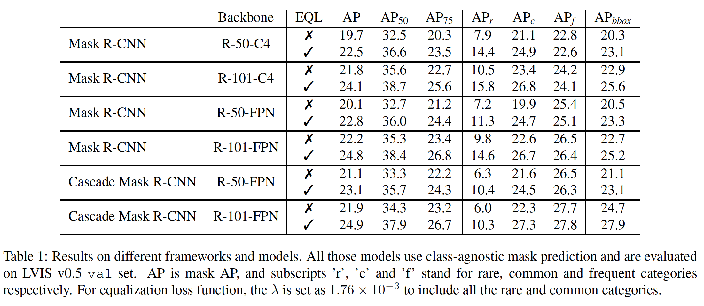

#### 4.3. 均衡损失的有效性

​		表1展示不同骨干和框架下均衡损失函数的有效性。除了Mask R-CNN外，我们还在Cascade R-CNN上使用均衡损失。在所有这些模型上，我们的方法获得一致改进。因为我们可以从表中看出，改进主要来自稀有和普通类，表明我们的方法在长尾分布的类上的有效性。

#### 4.4. 消融研究

​		为了分析均衡损失，我们进行几项研究。对于所有实验，我们使用 ResNet-50 Mask R-CNN。

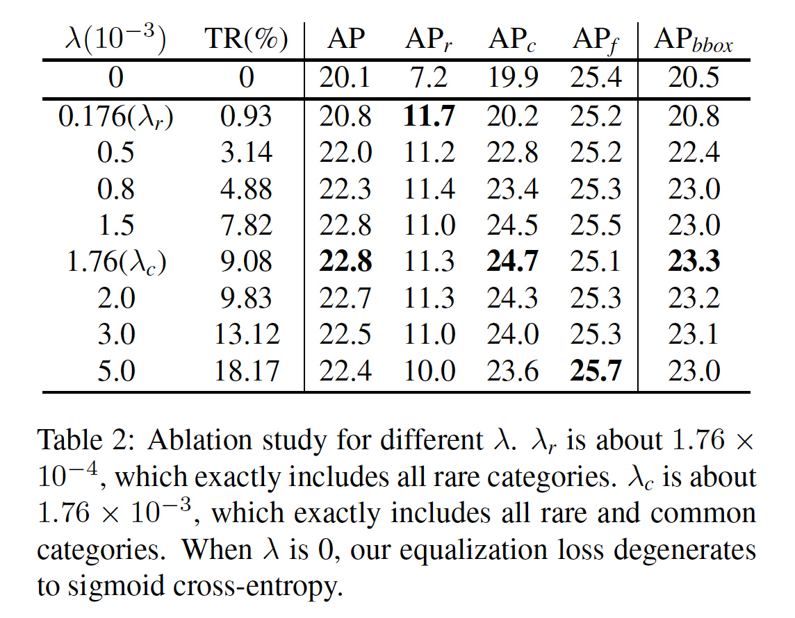

​		**Frequency Threshold $\lambda$ :**  不同$\lambda$的影响见表2。我们进行了将$r$从$1.76\times10^{-4}$（精确地将稀有类别从所有类别中分离出来）改为大范围的实验。当$TR(\lambda)$在2%到10%范围内时，我们经验地找到合适的$\lambda$在空间中的位置。表2中的结果表明，随着$\lambda$的增加，整体AP显著改善，包括更多的尾部类别。同时，当$\lambda$增加至包含频繁类时，性能趋向衰退。均衡损失的一种优势是，它忽略频率大于给定$\lambda$的类的影响。当$\lambda = \lambda_r$，$AP_r$和$AP_c$改进很多，同时$AP_f$仅有轻微地衰减。

​		**Threshold Function $T_{\lambda}(f)$ :**    在公式（7）中，对于给定的提议，我们使用$T_{\lambda}(f_j)$来计算类 $j$ 的权重。除了所提出的阈值函数外，$T_{\lambda}(f)$可以有其他形式来计算频率低于阈值的类别的权重。如图3所示，我们介绍并比较其他两种设计：（1）指数衰减函数$y = 1 - (af)^n$，其根据类频率的幂计算权重。（2）Gompertz衰减函数$y = 1 - ae^{-be^{-cf}}$，其开始时平滑衰减，然后陡峭衰减。我们对指数衰减函数和Gompertz衰减函数在不同超参数下进行了多次实验，得到了最好的结果。指数衰减函数的最佳超参数为$a=400$和$n=2$，对于Gompertz衰减函数为$a=1$、$b=80$、$c=3000$。表3显示，三种设计都取得相当相似的结果，而指数衰减和Gompertz衰减函数都引入更多的超参数来拟合设计。因此，我们在方法中使用阈值函数，因为它的格式更简单，超参数更少，性能更好。

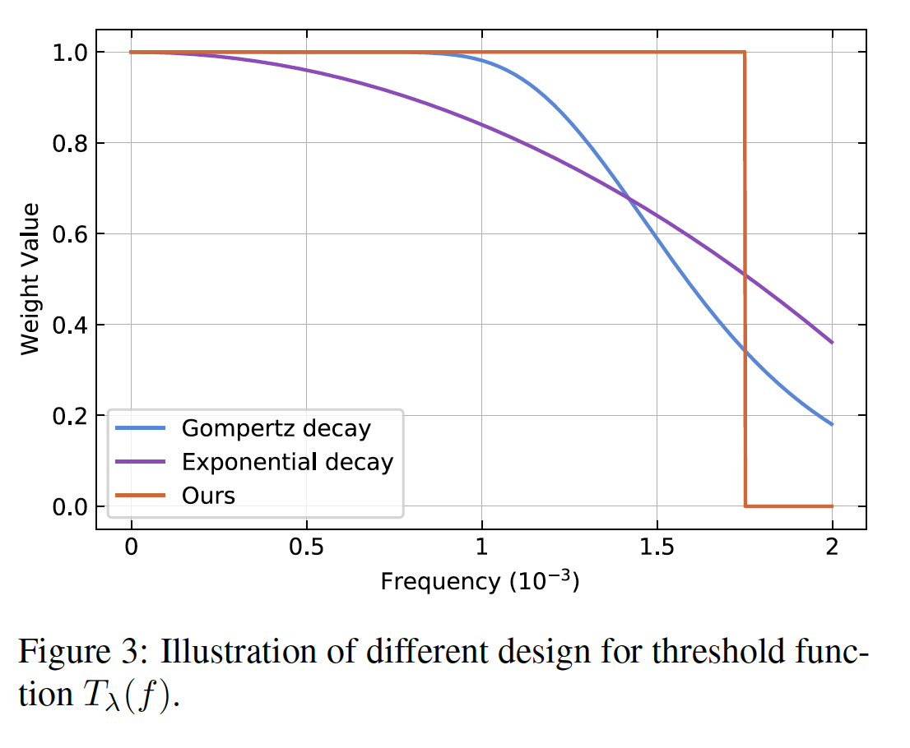

​		**Excluding Function $E(r)$:**  表4给出有和没有$E(r)$的EQL的实验结果。没有$E(r)$的EQL意味着从公式（7）中移除$E(r)$，其以相同的方式看待背景和前景。具有$E(r)$的EQL表示均衡损失仅影响前景提议，如公式（7）定义。实验结果证明$E(r)$的重要性。正如我们可以从表中看出，具有$E(r)$的EQL比没有$E(r)$的EQL高0.6 AP。如果丢弃$E(r)$，尽管$AP_r$增加，但是$AP_f$下降严重，其引起整体AP下降。

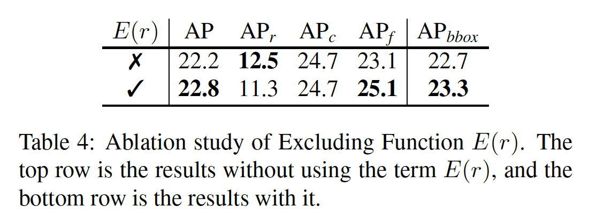

​		值得注意的是，如果我们不使用$E(r)$，大量的背景提议也会被少数和常见的类别所忽视，对背景提议的监督不足会造成大量的误报。我们可视化一个示例图像的检测结果，其如图4所示。没有$E(r)$，会引入更多的负样本，这些假阳性以红色显示。上述分析和说明表明，在没有$E(r)$的情况下，$AP_r$应该降低，这与表4中的实验结果相矛盾。理由是，根据LVIS评估协议，如果不确定图像$I$中是否有类$j$，图像$I$中类$j$的所有假阳性都被忽略。如果类$j$是稀有的，那么增加的假阳性大多被忽略，从而减轻它们的影响。但同时增加的真阳性率在$AP_r$直接增加。

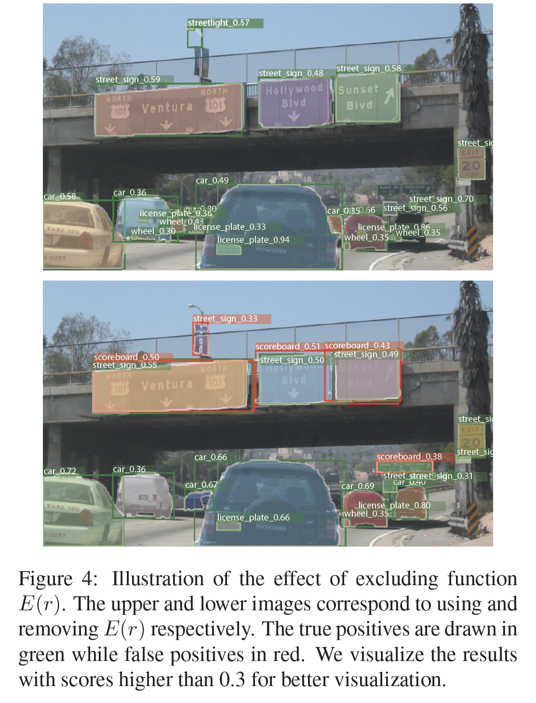

#### 4.5 与其他方法的比较

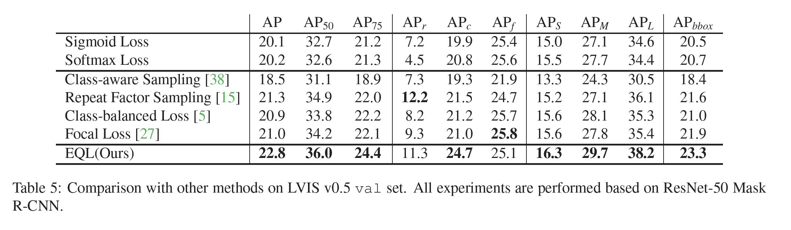

#### 4.6. LVIS Challenge 2019

### 5. Open Images Detection 上的实验

### 6.  图像分类上的实验

​		**实现细节**	对于CIFAR-100-LT，我们使用Nesterov SGD，动量为0.9，权重衰减为0.0001。我们是256的mini-batch，每张GPU包含128张图像。模型利用0.2的学习率训练12.8K次迭代，然后在6.4K和9.6K是乘以0.1。在前400次迭代中，学习率从0.1增加到0.2。对于数据增强，首先遵循[24、18]的设置，然是使用autoAugment和Cutout。在测试时，我们仅使用原始的$32 \times 32$ 图像。对于ImageNet-LT，我们使用1024的mini-batch，以及16个GPU。我们使用ResNet-101作为骨干。模型训练12K，学习率为0.4，并在2.4K、6.8K、10.2K是除以10。在前500次迭代中，学习率从0.1增加到0.4。我们使用random-resize-crop、color jitter和水平翻转作为数据增强。训练图像大小为$224 \times 224$。在测试时，我们将图像调整到$256 \times 256$，然后中心裁剪出$224\times224$ patch。

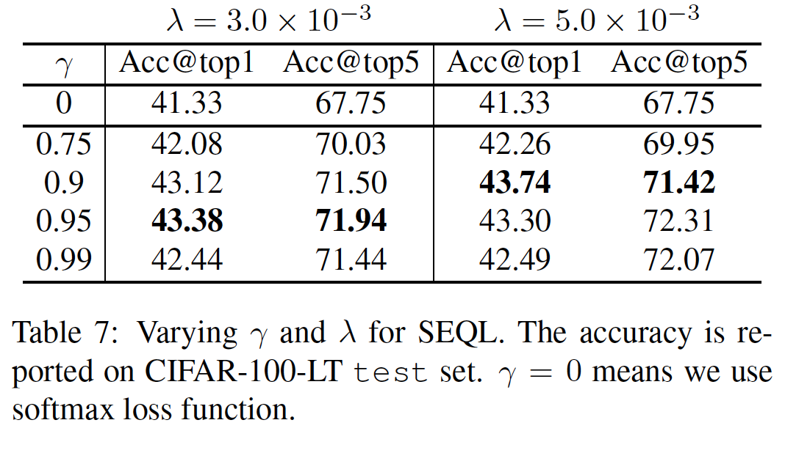

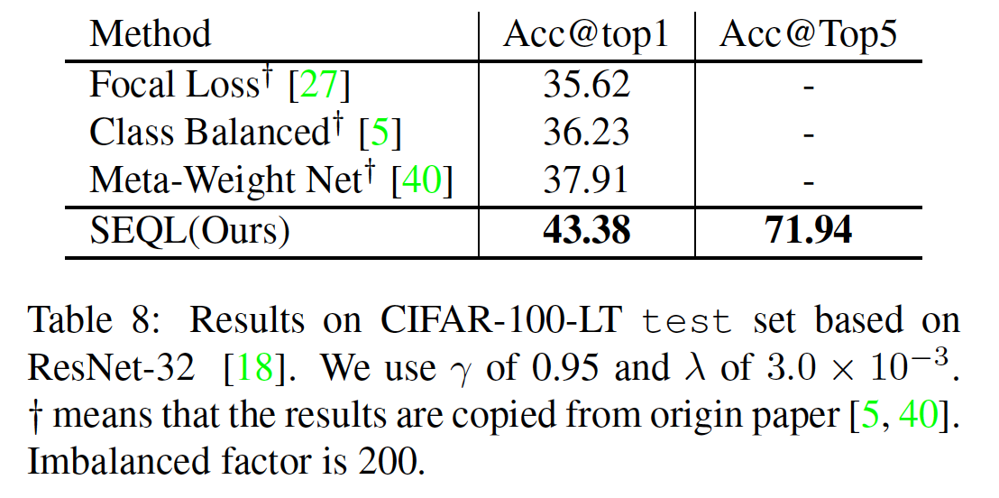

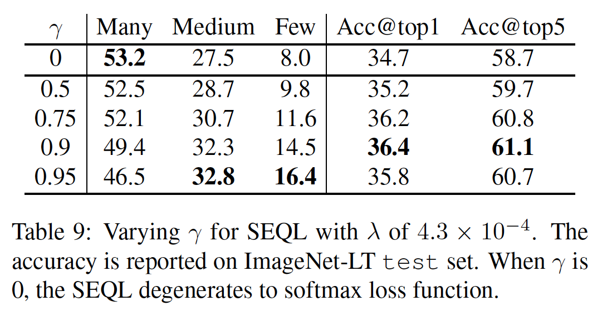

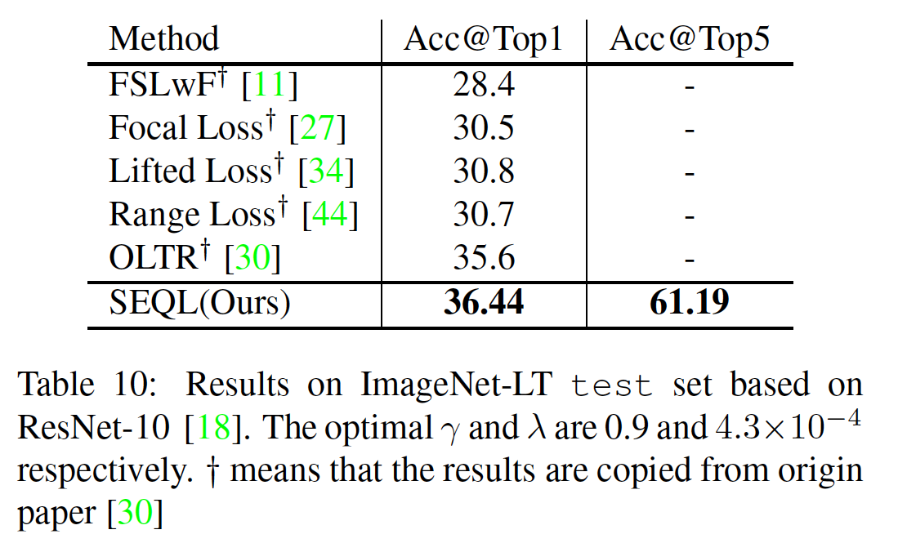

### Appendix A. LVIS Challenge 2019的细节

​		利用均衡损失，我们在LVIS Challenge 2019上获得第1名。本节中，我们介绍我们在挑战中使用的解决方案。

​		**External Data Exploiting**	由于LVIS并不是完全用所有类别进行标注，而且长尾类别的标注非常少，因此我们利用额外的公共数据集来丰富我们的训练集。首先，我们在COCO train2017上训练Mask R-CNN，然后利用均衡损失在LVIS上微调。微调期间，我们利用边界框的COCO标注作为忽略区域，在采样期间排除背景方案。此外，我们借用Open images V5中的20k个图像，其中包含与LVIS共享的110个类别，并使用边界框标注来训练模型。

​		**Model Enhancement**	我们通过训练利用可变形卷积和同步批归一化、均衡损失、重复因子采样、多尺度训练和COCO exploiting增强的ResNeXt-101-64x4d获得我们的挑战基线，其在LVIS v0.5 val集上产生30.1%的 AP。我们在边界框和分割结果上都是用多尺度测试，并且测试范围从600到1400，步长为200。我们分别在COCO 2017和Open Images V5的训练集上训练了两个专家模型，然后在LVIS val集上对它们进行评估，收集共享类别的检测结果。虽然我们的方法在很大程度上改善了长尾分类的性能，但由于缺乏正的训练样本，这些分类的预测分数往往小于频繁分类，从而导致集合中$AP_r$的退化。为了保留更多的稀有和常见类别的结果，我们通过提高这些类别的分数，采用了重新评分集成方法。

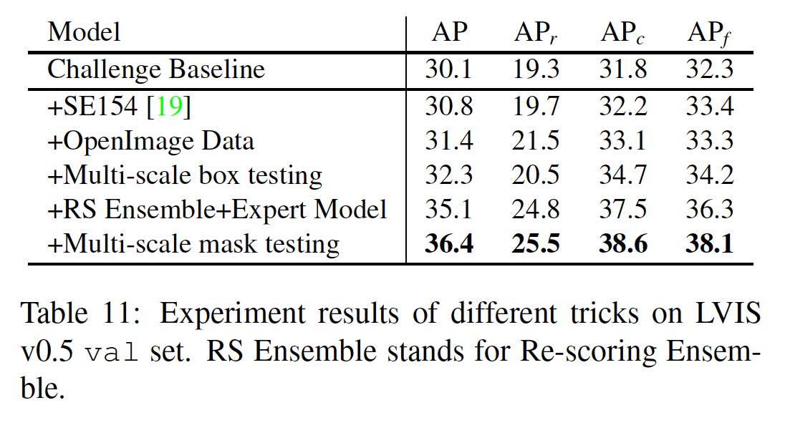

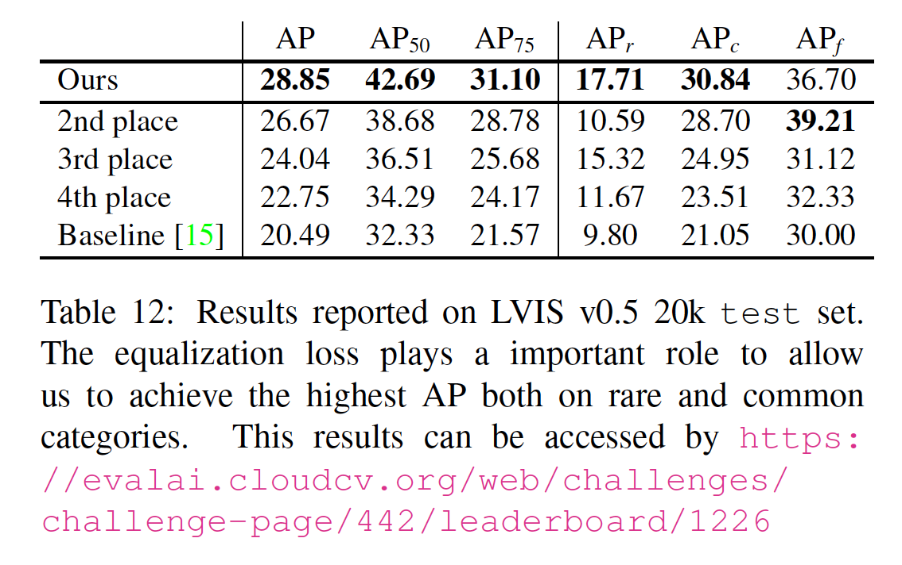