## Class-Balanced Loss Based on Effective Number of Samples

### 摘要

​		随着大尺度、真实世界数据的组件增加，处理长尾数据分布（即少数类别占据大多数数据，而大多数类别的代表性不足）越来越关键。已有的解决方案通常采用类重新平衡的策略，例如基于每个类的观察数量的重采样和重加权。在这项工作中，我们认为，随着样本量的增加，新添加的数据点的额外好处将减少。我们介绍了一种新颖的理论框架，通过将每个样本与一个较小的邻近区域而不是单个点相关联来测量数据重叠。样本的有效数量定义为样本的体量，并可以通过简单的公式$(1-\beta^n)/(1-\beta)$计算，其中样本的数量和$\beta \in [0, 1)$为超参数。我们设计一种重新加权方案，其为每个类使用样本的有效数量来重新平衡损失，因此产生类平衡的损失。在人工诱导的长尾CIFAR数据集和包括ImageNet和iNaturalist的大规模数据集上进行了综合实验。我们的结果证明，当利用所提出的类平衡损失训练时，网络能够在长尾数据集上获得明显的性能增益。

### 1. 引言

​		深度卷积神经网络（CNN）在视觉识别方面的最新成功[25、36、37、16]很大程度上归功于大规模、真实世界中带注释的数据集[7、27、48、40]。与常用的、表现出类标签大致均匀分布的视觉识别数据集（例如CIFAR[24、39]、ImageNet ILSVRAC 2012[7、33]和CUB-200 Birds）相比，现实世界的数据集偏向[21]的分布，并带有一个长尾：少数主导类占据大多数示例，而其他大多数类别则由相对较少的示例表示。在此类数据上训练过的CNN在弱表示的类中表现不佳[19、15、41、4]。

​		大量最近的研究旨在缓解长尾训练数据[3、31、17、41、43、12、47、44]的挑战。一般而言，有两种策略：重采样（re-sampling）和成本敏感的重加权（cost-sensitive re-weighting）。在重采样中，样本量通过对少数类进行过采样（添加重复数据）直接调整，获得对多数类进行欠采样（删除数据），或者两者都使用。在成本敏感重加权中，我们通过给少数类的样本分配相对较高的成本来影响损失函数。在使用CNN的深度特征表示学习的场景中，重采样可能要么引入大量重复样本，这会减慢训练速度，并使模型在过采样时容易过拟合，要么在欠采样时丢弃对于特征学习很重要的有价值样本。由于对CNN训练应用重采样的这些劣势，所提出的工作关注重加权方法，即如何设计更好的类平衡损失。

​		通常，类平衡的损失与类频率成反比地分配样本权重。这种简单的启发式方法已被广泛采用。但是，大规模、真实世界、长尾数据集[30、28]上训练的最近工作[30，28]显示，使用该策略时性能较差。取而代之的是，他们使用权重的“平滑”版本，根据经验将其设置为与类频率的平方根成反比。这些观察结果提出了一个有趣的问题：**我们如何设计一种适用于各种数据集的更好的类平衡损失**？

​		我们旨在从样本大小的角度回答这个问题。如图1所示，我们考虑训练一个模型来辨别长尾数据集中多数类和少数类。由于高度不平衡的数据，直接训练模型或者通过样本量的逆重新加权的损失不能产生令人满意的性能。直觉上，更多的数据，产生更好的效果。但是，由于这些信息在数据之中重叠，随着样本量的增加，模型可以从数据中提取的边际收益会减少。有鉴于此，我们提出一个新颖的理论框架来表征数据重叠并以模型与损失无关的方式计算有效样本数。将类平衡的重加权项（与样本的有效数成反比）添加到损失函数。大量实验结果表明，这种类平衡项显着提高常用损失函数的性能，从而可以在长尾数据集上训练CNN。

​		我们的关键贡献可以总结如下：（1）我们提供理论框架来研究样本的有效数量，并介绍如何设计类平衡项来处理长尾训练数据集。（2）我们证明通过将所提出的类平衡项添加到已有的常用损失函数（包括softmax 交叉熵、sigmoid交叉熵和focal损失）可以获得显著的性能增加。此外，我们证明，在ILSVRC 2012上，类平衡损失优于常规的softmax交叉熵损失，可以用作视觉识别的一般损失。我们相信我们关于量化样本有效数量和类平衡损失的研究可以为从事长尾类分布领域的研究人员提供有用的指导。

### 2. 相关工作

​		先前关于长尾不平衡数据的大多数工作可以分为两种模式：重采样[35、12、4、50]（包括过度采样和欠采样）和成本敏感型学习[38、49、17、22 ，34]。

​		**Re-Sampling**	过采样重复添加少数类的样本，其可以造成模型过拟合。为了解决这个问题，可以从相邻样本[5]插值或合成[14、50]少数类新样本。但是，由于新样本中的噪声，该模型仍然易于出错。有人认为，即使欠采样会导致删除重要样本带来风险，但欠采样仍然比过采样[9]更可取。

​		**Cost-Sensitive Learning**	成本敏感型学习可以追溯到统计中的一种经典方法，称为重要性抽样[20]，其中将权重分配给样本以匹配给定的数据分布。Elkan等[10]研究如何分配权重以调整决策边界，从而在二值分类的情况下批评给定的目标。对于不平衡数据集，通常采用通过类频率的逆加权[17、43]或类频率平方根的逆的加权的平滑版本[30、28]。作为具有理论基础的平滑加权的概括，我们关注（a）如何量化样本的有效数量以及（b）使用有效量来重新加权损失。另一类重要工作旨在研究损失项中样本难度，并分配更高的权重给困难样本[11、29、8、26]。少数类的样本倾向于有比多数了更高的损失，因为少数类的特征学习通常更糟糕。但是，样本难度和样本量见没有直接联系。将较高的权重分配给困难样本的副作用是关注有害样本（例如噪声的数据或标签错误的数据）[23、32]。本文中，我们没有在样本困难度和数据分布上没有任何假设。通过在实验中使用类平衡项改善焦点损失[26]，我们证明我们的方法是基于样本难度的重新加权的补充。

​		值得一提的是，先前的工作还探索解决数据不平衡的其他方法，包括将从多数累学习到的知识迁移到少数类[3、31、43、6、44]并通过度量学习设计更好的训练目标 [17、47、45]。

​		**Covering and Effective Sample Size**	我们的理论框架首随机覆盖问题（random covering problem）[18]的启发，随机覆盖问题的目的是使用一系列独立同分布的随机小型数据集覆盖大型数据集。在第3节中，我们通过合理的假设简化这个问题。注意，本文中所提出的样本的有效数量与统计中的有效样本大小的概念不同。当样本相关时，有效样本大小用于计算方差。

### 3. Effective Number of Samples

​		我们将数据采样过程表示为随机覆盖的简化版本。关键思想时将每个样本与小型相邻区域关联，而不是单个点关联。我们提出我们的理论框架，以及计算样本有效数量的公式。

#### 3.1. Data Sampling as Random Covering

​		给定一个类，将该类特征空间中所有可能数据的集合表示为$\mathcal{S}$。我们假设$\mathcal{S}$的容量为$N$，并且$N \ge 1$。将每个数据表示为$\mathcal{S}$的子集，该子集的单位容量为1，并且可能与其他数据重叠。将数据采样过程视为随机覆盖问题，其中每个数据（子集）从$\mathcal{S}$中随机采样以覆盖整个数据集$\mathcal{S}$。采样的数据越多，$\mathcal{S}$的覆盖率越好。采样数据的期望总容量随数据量的增加而增加，并且边界为$N$。因此，我们定义：

**Definition 1**（Effective Number）样本的有效数量为样本的期望容量。

​		样本期望容量的计算是非常困难的问题，其依赖样本的形状和特征空间的维度。为了使问题变得可处理，我们不考虑部分重叠的情况来简化问题。即，我们假设新采样的数据只能以两种方式与先前采样的数据交互：要么完全以概率为$p$先前采样的数据集合内，要么以概率为$1-p$先前采样的数据集合外，如图2所示。随着采样数据点的增加，概率$p$也会变得更高。

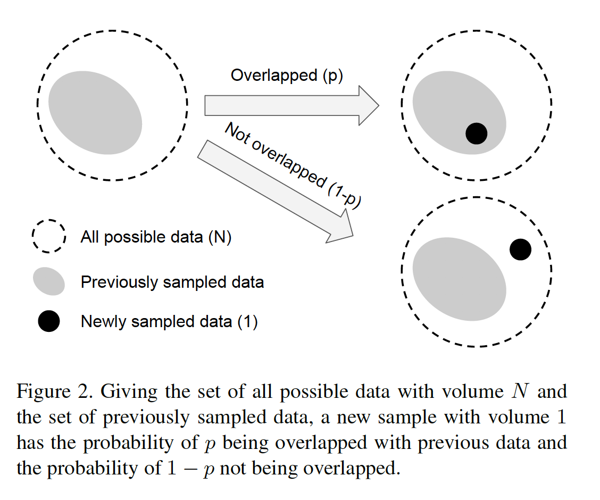

​		在我们深入研究数学公式之前，我们讨论了有效样本数的定义与真实世界的视觉数据之间的联系。我们的思想是通过使用一个类的更多数据点捕获递减的边界收益。由于真实数据之中的固有相似性，随遇样本数量的增加，很可能新添加的样本与现有样本几乎相同。此外，CNN使用大量的数据增强进行训练，其中简单的变换（如随机裁剪、重新缩放和水平翻转）将应用于输入数据。在这种情况下，所有数据增强的样本也要与原始样本相同的方式考虑。据推测，数据增长越强，N值就越小。样本的小邻域是一种捕获所有通过数据增强获得的近副本和实例的方法。对于一个类，$N$可以视为_unique prototypes_的数量。

#### 3.2. 数学公式

​		将样本的有效数量表示为$E_n$，其中$n \in \mathbb{Z}_{>0}$为样本数。

**命题1**（Effective Number）$E_n = (1- \beta^n)/(1-\beta)$，其中$\beta = (N-1)/N$。

_证明：_ 我们用归纳法证明这个命题。$n=1$时，因为没有重叠，所以$E_1=1$时显然的。因此，$E_1 = (1 - \beta^n)/(1-\beta)=1$成立。现在，考虑一般情况，我们之前已经对$n-1$个例子进行采样，并且即将对第$n$个样本进行采样。现在前一个样本的期望容量为$E_{n-1}$，先采样的数据点与前一个样本重叠的概率为$p=E_{n-1}/N$。因此，采样第$n$个样本之后的期望容量为：

$$E_n = pE_{n-1} + (1-p)(E_{n-1} + 1) = 1 + \frac{N-1}{N}E_{n-1}.\tag{1}$$

假设$E_{n-1}=(1-\beta^{n-1})/(1-\beta)$成立，那么有

$$E_n = 1+\beta\frac{1-\beta^{n-1}}{1-\beta} = \frac{1-\beta+\beta-\beta^n}{1-\beta}=\frac{1-\beta^n}{1-\beta}.\tag{2}$$

​		上述命题表明样本的有效数量为$n$的指数函数。超参数$\beta\in[0,1)$控制$E_n$随$n$增加的速度。

​		样本的有效数量$E_n$的另一种解释为：

$$E_n = (1-\beta^n)/(1-\beta)=\sum_{j=1}^n\beta^{j-1}.\tag{3}$$

这意味着第$j$个样本对有效数量的贡献为$\beta^{j-1}$。该类的所有可能数据的总容量$N$计算为：

$$N=\lim_{n\rarr\infin}\sum_{j=1}^n\beta^{j-1}=1/(1-\beta).\tag{4}$$

这与命题中$\beta$的定义一致。

**Implication 1**（Asymptotic Properties）如果$\beta=0(N=1)$，那么$E_n=1$。当$\beta\rarr1(N\rarr\infin)$时，$E_n \rarr n$。

_证明_：如果$\beta=0$，那么$E_n = (1-0^n)/(1-0)=1$。在$\beta \rarr 1$的情况下，$f(\beta)=1-\beta^n$，$g(\beta)=1-\beta$。因为$\lim_{\beta\rarr1}f(\beta)=\lim_{\beta\rarr1}g(\beta)$，$g'(\beta)=-1\ne0$以及$\lim_{\beta\rarr1}f'(\beta)/g'(\beta)=\lim_{\beta\rarr1}(-n\beta^{n-1})/(-1)=n$成立，使用洛必达法则，有：

$$\lim_{\beta\rarr1}E_n=\lim_{\beta\rarr1}\frac{f(\beta)}{g(\beta)}=\lim_{\beta\rarr1}\frac{f'(\beta)}{g'(\beta)}=n.\tag{5}$$

​		$E_n$的渐近性质（asymptotic property）表明，当$N$很大时，样本的有效数量与样本$n$的数量相同。在这种场景中，我们认为unique prototype $N$的数量很大，因此没有数据重叠，每个样本是唯一的。在其他极端情况下，如果$N=1$，这意味着，我们认为存在单一prototype，使得该类中的所有数据集可以由这个个通过数据增强、变换等的prototype表示。

### 4. 类平衡损失

​		通过引入一个与有效样本数成反比的加权因子，设计类平衡损失（Class-Balanced Loss），解决不平衡数据的训练问题。类平衡损失项可以用于广泛的深度网络和损失函数。

​		对于标签为$y\in\{1,2,\cdots,C\}$的输入样本$\mathbf{x}$，其中$C$为类的数量，假设模型的估计类概率为$\mathbf{p}=[p_1,p_2,\cdots,p_C]^\top$，其中$\forall i$，有$p_i\in[0,1]$，我们将损失表示为$\mathcal{L}(\mathbf{p},y)$。假设类$i$的样本量为$n_i$，基于等式（2），类$i$的有效样本量为$E_{n_i}=(1-\beta_i^{n_i})/(1-\beta_i)$，其中$\beta_i = (N_i - 1)/N_i$。如果没有每个类的数据的进一步信息，很难经验地为所有类找到一组好的超参数$N_i$。因此，实际上，我们假设$N_i$仅是数据依赖的，对于数据集中的所有类，设置$N_i=N$，$\beta_i = \beta=(N-1)/N$。

​		为了平衡损失，我们引入加权因子$\alpha_i$，其与类$i$的有效样本量成反比：$\alpha_i \propto 1/E_{n_i}$。当应用$\alpha_i$时，为了使总损失大致在相同的范围内，我们规范化$\alpha_i$，使得$\sum_{i=1}^C\alpha_i = C$。为了简单起见，在余下的论文中，我们使用$1/E_{n_i}$表示规范化的加权因子。

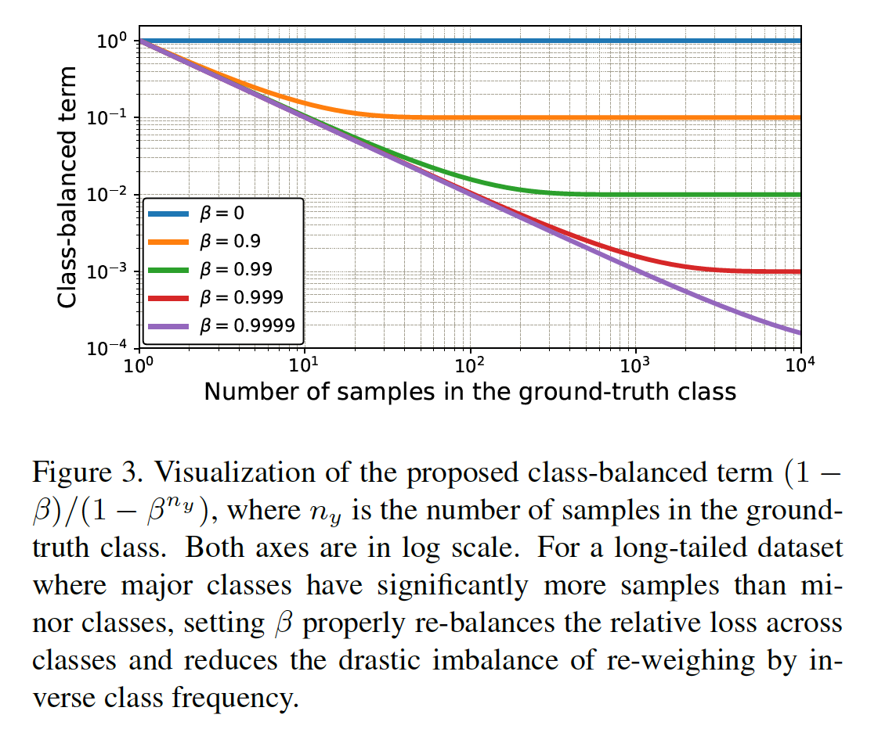

​		形式上说，给定类$i$（该类包含$n_i$个样本）的样本，我们提出将加权因子$(1-\beta)/(1-\beta^{n_i})$添加到损失韩式，超参数$\beta \in [0,1)$。类平衡（Class-Balanced：CB）损失可以写为：

$$\mbox{CB}(\mathbf{p}, y) = \frac{1}{E_{n_y}}\mathcal{L}(\mathbf{p},y)=\frac{1-\beta}{1-\beta^{n_y}}\mathcal{L}(\mathbf{p},y),\tag{6}$$

其中$n_y$为ground-truth类$y$的样本量。我们在图3中可视化不同$\beta$和$n_y$的类平衡损失。注意，$\beta=0$对应没有重加权，$\beta\rarr0$对应由类频率的逆的重加权。所提出的有效样本量的新概念保证我们使用超参数$\beta$来平滑地调整没有重加权和由类频率逆重加权之间类平衡项。

​		所提出的类平衡项是模型无关和损失无关的，因为它独立于损失函数$\mathcal{L}$和预测类概率$\mathbf{p}$选项。为了证明的所提出的类平衡损失是通用的，我们介绍如何将类平衡项用于三种常用的损失函数：softmax cross-entropy loss、 sigmoid cross-entropy loss 和 focal loss。

#### 4.1. Class-Balanced Softmax Cross-Entropy Loss

​		假设模型对所有类的预测输出是$z=[z_1,z_2,\cdots,z_C]^\top$，其中$C$是类的总数。softmax函数将每个类视为互斥类，并将所有类的概率分布计算为$p_i = \exp(z_i)/\sum_{j=1}^C\exp(z_j),\forall i \in \{1,2,\cdots,C\}$。给定具有类标签$y$的样本，该样本的softmax cross-etropy（CE）损失为：

$$\mbox{CE}_{\mbox{softmax}}(\mathbf{z},y) = -\log(\frac{\exp(z_y)}{\sum_{j=1}^C\exp(z_j)}).\tag{7}$$

假设类$y$有$n_y$个训练样本，类平衡（CB）softmax cross-entropy损失为：

$$\mbox{CB}_{\mbox{softmax}}(\mathbf{z},y) = -\frac{1-\beta}{1-\beta^{n_y}}\log(\frac{\exp(z_y)}{\sum_{j=1}^C\exp(z_j)}).\tag{8}$$

#### 4.2. Class-Balanced Sigmoid Cross-Entropy Loss

​		与softmax不同，sigmoid函数计算的类该类假设每个类是不独立的，并且不存在互斥。当使用sigmoid函数时，我们将多类视觉识别视为多个二值分类任务，其中网络的每个输出节点执行一对所有分类，以预测目标类相对于其他类的概率。与softmax相比，sigmoid对于现实世界的数据集可能有两个优势：（1）Sigmoid在类之间没有假设互斥，其与现实世界数据很好地对齐，其中少量类可能与其他类非常相似，特别是大量细粒度类的情况。（2）于每一类都被认为是独立的并且有自己的预测因子，sigmoid将单标签分类和多标签预测结合起来。这是一个很好的属性，因为现实世界中的数据通常有多个语义标签。

​		使用与softmax cross-entropy相同的符号，为了简单明了，我们将$z_i^t$定义为：

$$z_i^t = \begin{cases}z_i, & \mbox{if } i = y. \\ -z_i, & \mbox{otherwise}.\end{cases}\tag{9}$$

然后，sigmoid cross-entropy（CE）损失为：

$$\begin{align}\mbox{CE}_{\mbox{sigmoid}}(\mathbf{z},y)&=-\sum_{i=1}^C\log(\mbox{sigmoid}(z_i^t)) \\ &=-\sum_{i=1}^C\log(\frac{1}{1+\exp(-z_i^t)}).\end{align}\tag{10}$$

然后，sigmoid cross-entropy（CE）损失为：

$$\mbox{CB}_{\mbox{sigmoid}}(\mathbf{z},y)=-\frac{1-\beta}{1-\beta^{n_y}}\sum_{i=1}^C\log(\frac{1}{1+\exp(-z_i^t)}).\tag{11}$$

#### 4.3. Class-Balanced Focal Loss

​		最近提出的focal loss（FL）[26]将调节因子添加到sigmoid cross-entropy损失中增加一个调制因子，以减少分类好的样本的相对损失，并聚焦于困难样本。有$p_i^t = \mbox{sigmoid}(z_i^t)=1/(1+\exp(-zi^t))$，focal loss为：

$$\mbox{FL}(\mathbf{z}, y) = -\sum_{i=1}^C(1-p_i^t)^\gamma \log(p_i^t).\tag{12}$$

类平衡（CB）的focal loss为：

$$\mbox{CB}_{\mbox{focal}}(\mathbf{z}, y) = -\frac{1-\beta}{1-\beta^{n_y}}\sum_{i=1}^C(1-p_i^t)^\gamma \log(p_i^t).\tag{13}$$

​		原始的focal loss有一个$\alpha$平衡变量。当$\alpha_t = (1-\beta)/(1-\beta^{n_y})时，$class-balanced focal loss与$\alpha$平衡的focal loss相同。因此，类平衡项可以被看作是基于有效样本量来设置焦距损失中$\alpha_t$的一种显式方法。

### 5. 实验

​		所提出的类平衡损失是在人工创建的具有可控数据不平衡度的长尾CIFAR[24]数据集和实际的长尾数据集上进行评估的，这些数据集不符合《自然》杂志2017年[40]和2018年[1]。为了证明我们的损失对于视觉识别是通用的，我们还在ImageNet数据（ILSVRC 2012[33]）上进行实验。我们使用具有可变深度的ResNet，并从头训练所有网络。

#### 5.1. 数据集

​		**Long-Tailed CIFAR**	为了分析所提出的类平衡损失，通过根据指数函数$n=n_i\mu^i$减少每个类的训练样本量来创建长尾版的CIFAR，其中$i$为类索引（0-indexed），$n_i$为训练图像中原始数量，$\mu\in(0,1)$。测试集仍未改变。**我们将数据集的不平衡因子定义为最大类中的训练样本数除以最小类的训练样本数**。图4给出长尾CIFAR-100上 每个类的训练图像数量，不平衡系数从10到200不等。我们在长尾CIFAR-10和CIFAR-100上进行实验。

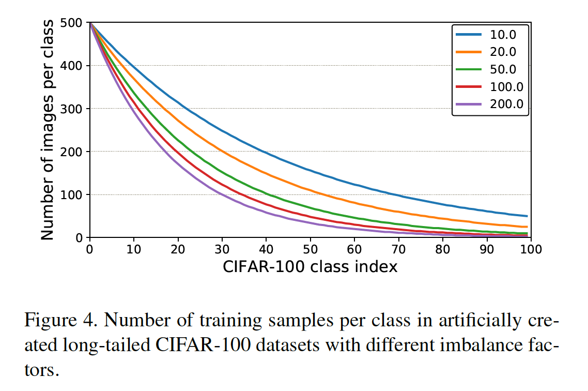

​		**iNaturalist**	最近引入的iNaturalist物种分类和检测数据集[40]是一个真实的长尾数据集，包含2017年版5089个类的579184张训练图像和2018年版8142个类的437513张训练图像[1]。我们使用官方的训练和验证划分。

​		**ImageNet**	我们使用ILSVRC2012，其包含1281167张训练图像和50000张验证图像。

​		表1总结了我们实验中的所有数据集，以及它们的类不平衡因子。

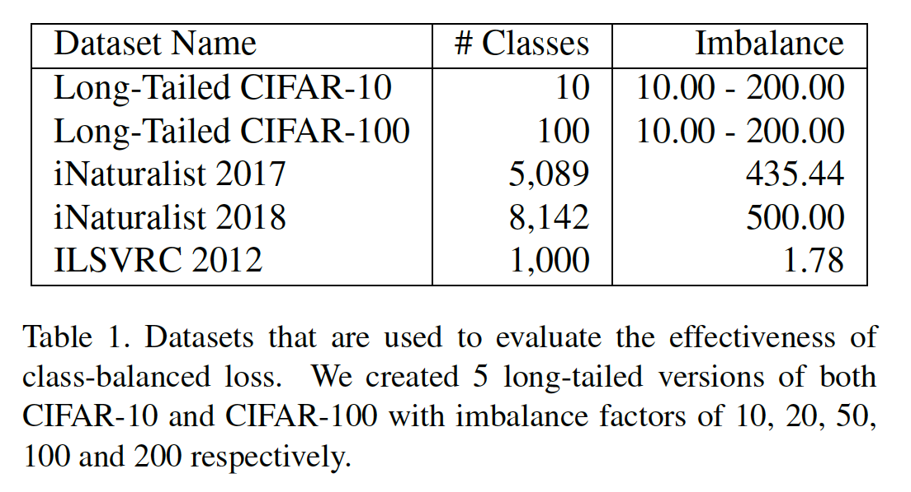

#### 5.2. 实现

​		**Training with sigmoid-based losses**	深度学习的常用初始化方案是将最后的线性分类层的偏置$b$初始化为0。正如Lin等[26]指出的，当使用sigmoid函数获取类概率时，这可能引起训练的不稳定。这是因为利用sigmoid函数时，在最后一层中使用$b=0$，会造成在训练的开始阶段每个类的概率接近0.5。因此，为了利用sigmoid cross-entropy loss和focal loss训练时，我们假设每个类鲜艳为$\pi = 1/C$，其中$C$为类的数量，最后层的偏置初始化为$b=-\log((1-\pi)/\pi)$。此外，我们移除最后层中$b$的$L_2$正则化项（weight decay）。

​		我们使用Tensorflow[2]实现，并用带动量的SGD训练所有模型。我们训练32层的残差网络（ResNet-32）以在CIFAR进行所有实验。与Zagoruyko等[46]相似，我们注意到在CIFAR上训练ResNets的一个令人不安的影响，即在学习率下降之后，损失和验证错误都逐渐增加，特别是在数据高度不平衡的情况下。我们发现将学习率衰减设置为0.01（而不是0.1）解决了这个问题。CIFAR上的模型在一个NVIDIA Titan X GPU上训练，批量大小为128，时间为200个周期。初始学习率设置为0.1，其然后在160个周期和180个周期时衰减0.01。我们还在前5个周期中使用线性warm-up学习率。在iNaturalist和ILSVRC 2012数据上，我们遵循Goyal等[13]使用的相同训练策略，并在单个cloud TPU上以1024的batch size训练残差网络。因为focal loss的尺度小于softmax和sigmoid交叉熵损失，当利用focal loss训练时，在ILSVRC 2012和iNaturalist上分别使用两倍和四倍学习率。

#### 5.2. Visual Recognition on Long-Tailed CIFAR

​		我们在具有不同不平衡因子的长尾CIFAR上进行大量研究。表2显示ResNet-32在测试集分类错误率方面的性能。我们给出softmax交叉熵损失、sigmoid交叉熵损失、不同$\gamma$ focal loss以及通过交叉验证选择最佳超参数的类平衡损失的计算结果。超参数的搜索空间中，损失类型为{softmax, sigmoid, focal}，$\beta \in \{0.9, 0.99,0.999,0.9999\}$，$\gamma \in \{0.5,1.0,2.0\}$。

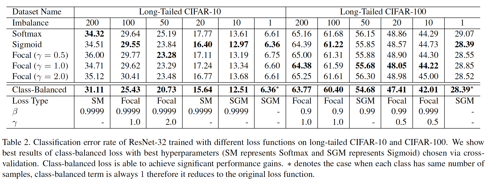

​		根据表2的结果，我们有如下观察：（1）通过选择适当的超参数，类平衡损失能够显著改善长尾数据集上常用损失函数的性能。（2）Softmax交叉熵被过度地用作视觉识别任务的损失函数。但是，依照5.2节的训练策略，在大多数情况下，sigmoid交叉熵和focal loss比softmax交叉熵好。（3）在CIFAR-10上最好的$\beta$一致性为0.9999。但是在CIFAR-100上，具有不同不平衡因子的数据倾向于有不同和更小的最优$\beta$。

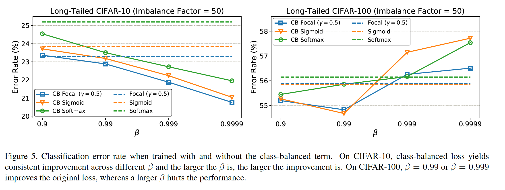

​		为了更好理解$\beta$和类平衡损失的作用，我们以不平衡因子为50的长尾数据集为例，展示在图5中使用和不使用类平衡项训练时模型的错误率。有趣的是，对于CIFAR-10，类平衡项始终提高原始损失的性能，并且更大的$\beta$可以获得更好的性能增益。但是，在CIFAR-100上，仅$\beta$的小值提高性能，而更大的值会衰减性能。图6展示不同$\beta$下的有效样本量。在CIFAR-100上，当基于$\beta=0.9999$重新加权时，有效样本量接近样本量。这意味着CIFAR-10上最好的重加权策略与类频率的逆重加权相似。在CIFAR-100上，使用较大的性能较差，这表明通过逆类频率重新加权不是明智的选择。相反，我们需要使用更小的$\beta$，其在类上有更平滑的权重。这是合理的，因为$\beta = (N-1)/N$，所以更大的$\beta$意味着更大的$N$。如第3节讨论的，$N$可以解释为unique prototype的数量。与粗粒度数据集相比，细粒度数据集的$N$应该更小。例如，特定的鸟种类的unique prototype的数量小于一般鸟类的unique prototype的数量。因为CIFAR-100中的类比CIFAR-10中的类更细粒度，CIFAR-100的$N$应当比CIFAR-10小。这解释$\beta$影响的观察。

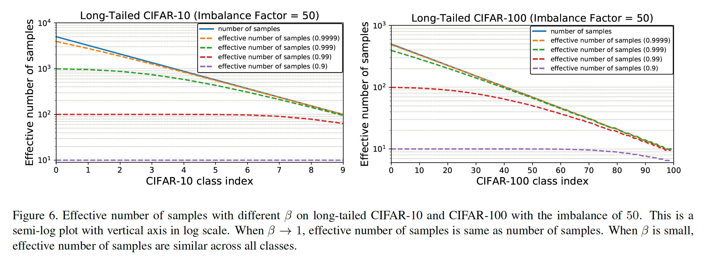

#### 5.4. Visual Recognition on Large-Scale Datasets

​		为了证明所提出的类平衡损失可以用在大尺度现实世界数据集上，我们在iNaturalist 2017、iNaturalist 2018和ILSVRC 2012上展示不同深度的训练结果。

​		表3总结了在所有数据上验证集的top-1和top-5错误率。我们使用类平衡 focal loss，因为它更可行，并发现$\beta=0.999$和$\gamma=0.5$在所有数据集上产生良好的性能。从结果中我们可以看出，我们能够在ILSVRC 2012上超过常用的softmax交叉熵损失，并且在iNaturalist上有很大的优势。值得注意的是，当使用类平衡focal loss 替换softmax 交叉熵损失时，在iNaturalist 上和ILSVRC 2012上，ResNet-50能够分别获得与ResNet152和ResNet101相当的性能。ILSVRC2012和iNaturalist2018上的训练曲线如图7所示。经过60个周期的训练，类平衡focal loss开始显示出它的优势。

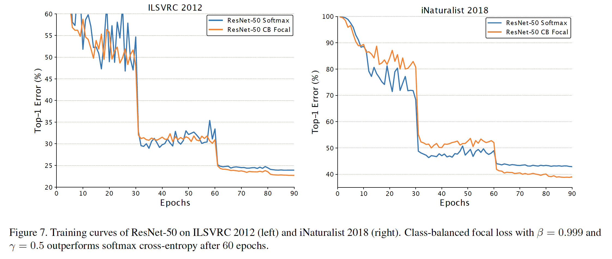

### Appendix A:  More Experimental Results

​		我们在本附录中给出了更全面的实验结果。

​		**Visual Recognition on Long-Tailed CIFAR**	在具有200、100、50、20和10的不平衡因子的长尾CIFAR数据上，我们使用softmax loss（SM）、sigmoid loss（SGM）和focal loss（原始focal loss和$\beta\in\{0.9,0.99,0.999,0.9999\}$的类平衡变体）。对于focal loss，我们使用$\gamma \in \{0.5,1.0,2.0\}$。除了本文第5.1节中提到的长尾CIFAR-10和CIFAR-100数据集外，我们还对CIFAR-20数据集进行了实验，该数据集与CIFAR-100数据集具有相同的图像，但使用20个粗粒度类标签进行了注释[24]。长尾CIFAR-10、CIFAR-20和CIFAR-100数据集的分类错误率分别如图8、图9和图10所示。图中的每一行与特定损失函数（形式为$\{\mbox{loss name}\}\_\{\gamma\}\_\{\beta\}$）训练的模型对应，并且每列与特定不平衡因子的长尾数据集对应。这些结果可以看出，在CIFAR-10上，更高的$\beta$产生更好的性能。然而，在CIFAR-20和CIFAR-100上，需要较低的来获得良好的性能，这表明我们不能直接通过逆类频率来重新加权损失，而是根据有效样本数来重新加权。

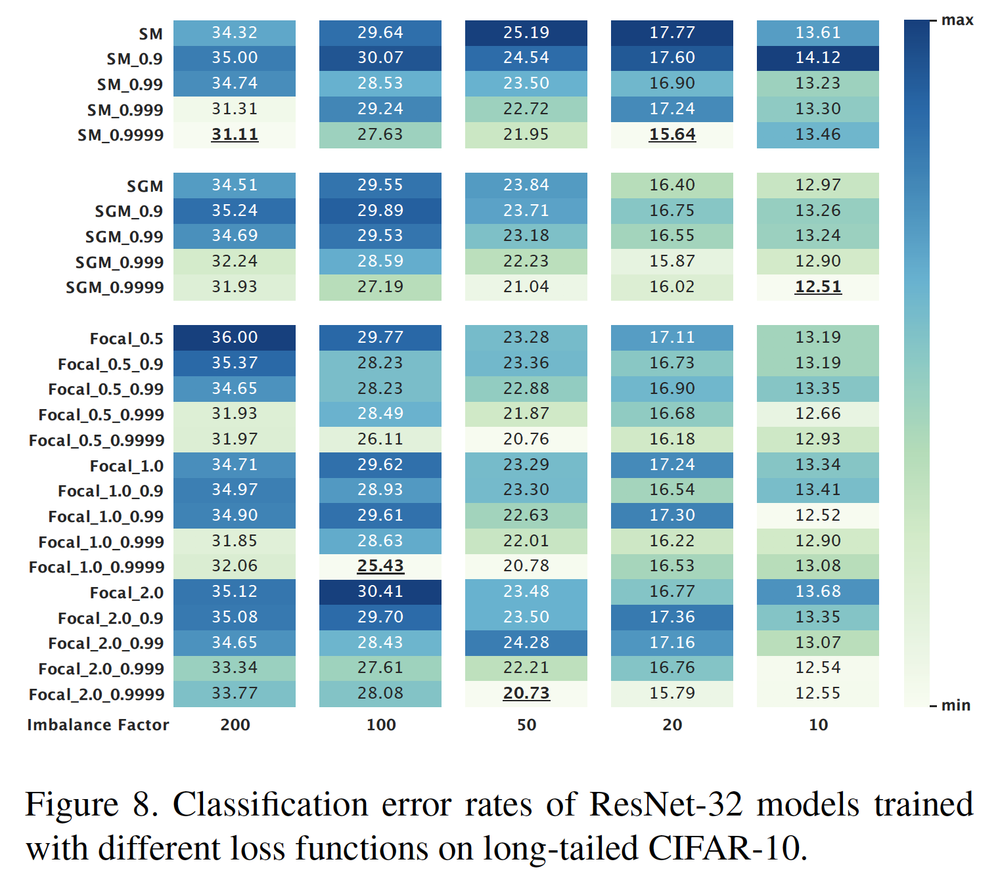

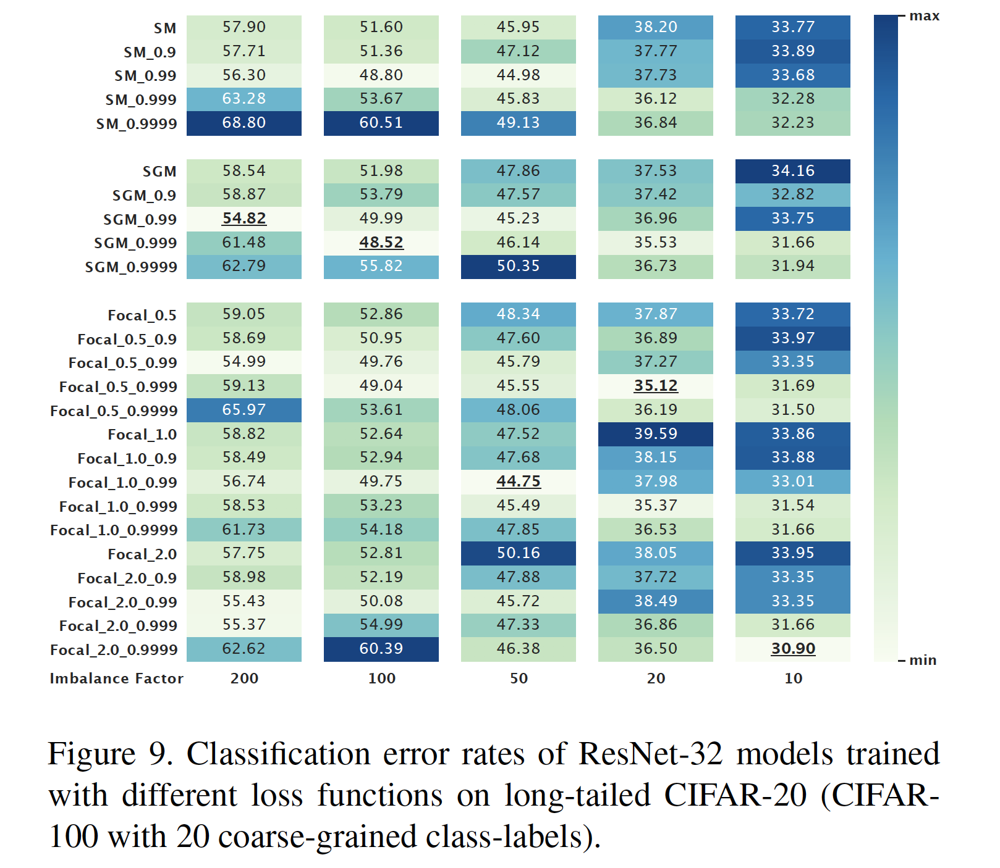

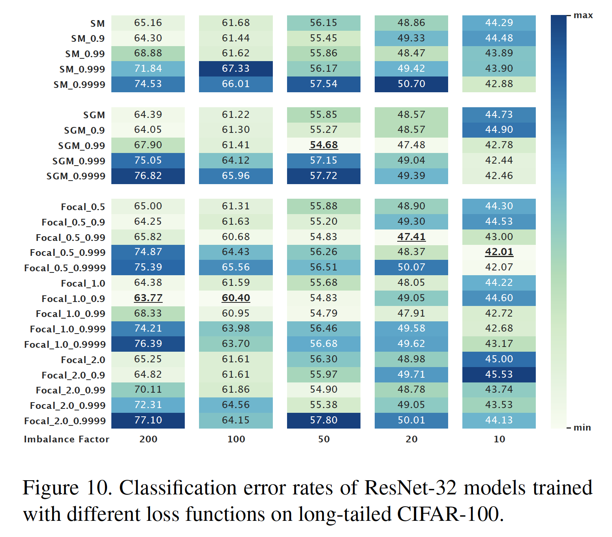

