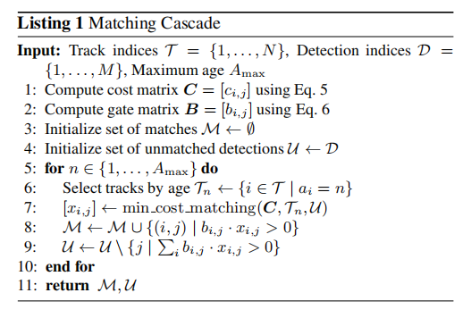
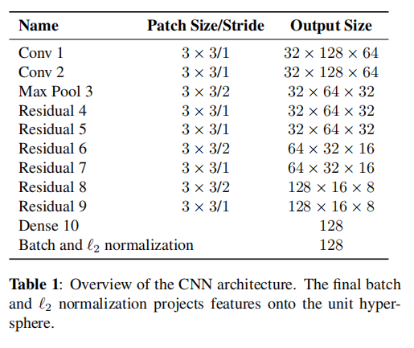
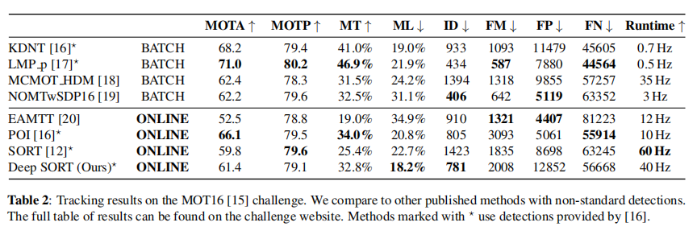

## Simple Online and Realtime Tracking with a Deep Association Metric

### 摘要

​		简单在线和实时跟踪(Simple Online and Realtime Tracking: SORT)是一种实用的多目标跟踪方法，其重点是简单、有效的算法。本文中，我们集成外观信息来改进SORT的性能。 由于这种扩展，我们能够跟踪更长的遮挡周期目标，有效地减少ID切换的次数。 本着原始框架的精神，我们将大量的计算复杂性放置到离线的预训练阶段，在大规模人员重新识别数据集上学习深度关联度量（deep association metric）。在线应用期间，我们在视觉外观空间中使用最近邻查询建立测量到跟踪（measurement-to-track）的关联。实验评估表明，我们的扩展将切换次数 降低45%，在高帧率下实现整体竞争性能。

### 1. 引言

​		由于目标检测的进步，通过检测进行跟踪已成为多目标跟踪的主导模式。 在这个范式中，目标轨迹通常在一个一次处理整个视频的批的全局优化问题中找到。例如，flow network formulations[1、2、3]和概率图模型[4、5、6、7]已成为这列的流行框架。但是，由于批处理，这些方法不适合目标Id在每个时间步都可用的在线场景。更传统的方法是Muiltple Hypothesis Tracking（MHT）和Joint Probabilistic Data Association Filter（JPDAF）。 这些方法在逐帧的基础上执行数据关联。在JPADF中，通过它们的关联似然来加权单个测量来生成单一的状态假设。在MHT中，跟踪所有可能的假设， 但剪枝方案必须应用于计算可处理性。 这两种方法最近都在tracking-by-detection方案中被重新讨论[10,11]并显示出有希望的结果。 然而，这些方法的性能增加了计算和实现的复杂性。

​		SORT[12]是一种更简单的框架，其在图像空间进行Kalman滤波，并使用具有关联度量（即边界框重叠）的Hungarian算法来进行逐帧数据关联。 这种简单的方法在高帧速率下获得良好的性能。在MOT挑战数据集上，具有最先进人体检测器的SORT在标准检测上的平均排名高于MHT。这不仅突出目标检测器性能对总体跟踪结果的影响，而且从实践者的角度来看也是一个重要的见解。

​		虽然在跟踪精度和准确率上获得整体上良好的性能，但是SORT返回较高数量的ID切换。 这是因为当状态估计不确定性较低时，所使用的关联度量才是准确的。 因此，SORT在通过遮挡跟踪方面有一个缺陷，因为它们通常出现在正面镜头中。我们通过将关联度量替换为结合运动和外观信息的度量来解决这个问题。特别地，我们使用CNN，该CNN训练用于辨别大尺度人员重识别数据上的行人。 通过该网络的集成，提高对遗漏和遮挡的鲁棒性，同时保持系统的易于实现、高效和适用于在线场景。

### 2. Sort with Deep Association Metric

​		我们采用传统的单假设跟踪方法，结合递归卡尔曼滤波和逐帧数据关联。在接下来的章节中，我们将更详细地描述这个系统的核心组件。

#### 2.1. Track Handling and State Estimation

​		 轨迹处理和卡尔曼滤波框架与[12]中的原始形式大多相同。我们假设一个非常通用的场景，其中相机是未标定的，并且没有可用的自我运动信息。 虽然这些情况对滤波框架提出了挑战，但它是最近多个目标跟踪基准[15]中考虑的最常见的设置。因此，我们的跟踪场景定义在8个维度的状态空间$(u,v,\gamma,h,\dot{x},\dot{y},\dot{\gamma},\dot{h})$，该空间包含边界框中心位置$(u,v)$、纵横比$\gamma$、高$g$和它在图像坐标中相应的速度。我们使用具有恒等速度的标准Kalman滤波，其中我们将边界框坐标$(u,v,\gamma,h)$作为目标状态的直接观测。

​		对于每个track $k$， 我们计数自上次成功的测量关联$a_k$以来的帧数。这个计数器在Kalman滤波预测期间是累计的，并在track与测量关联时，重置为0。 超过预定义的最大年龄$A_{max}$的track被认为已经离开场景，并从track集中删除。新的track假设初始化为不能与现有track关联的每个检测。在前三针中，这些新的track被归类为暂定。 在此期间，我们期望在每个时间步骤中成功地进行测量关联。 在前三帧中没有成功地与测量相关联的track被删除。

#### 2.2. Assignment Problem

​		解决预测Kalman状态和新到达测量指尖关联的常用方式时构建分配问题，该问题可以使用Hungarian算法解决。 在这种问题形式中，我们通过两个合适的度量组合来集成运动和外观信息。

​		为了纳入运动信息，我们使用预测Kalman状态和新到达测量之间的（平方）Mahalanobis距离：

$$d^{(1)}(i,j) = (d_j - y_i)^TS_i^{-1}(d_j-y_i),\tag{1}$$

其中我们用$(y_i,S_i)$表示第$i$个track分布到测量空间的投影，$d_j$表示第$j$个边界框检测。Mahalanobis距离通过测量检测偏离平均track位置的标准差来考虑状态估计的不确定性。此外，使用这种度量，可以通过在从逆$\chi^2$分布计算的95%置信区间上阈值化Mahalanobis距离来排除不可能的关联。我们利用指示器来表示这种决策：

$$b_{i,j}^{(1)} = \mathbb{1}[d^{(1)}(i,j)\le t^{(1)}], \tag{2}$$

如果第$i$轨道和第$j$检测之间的关联是可接受的，则计算为1。对于我们的四维测量空间，相应的Mahalanobis阈值为$t^{(1)}=9.4877$。

​		虽然，当不确定性较低时，Mahalanobis距离适合关联度量，但是在我们图像空间问题形式种，Kalman滤波框架预测的状态分布仅提供目标位置的大致估计。特别地， 不明原因的摄像机运动可以在图像平面上引入快速位移，，使得Mahalanobis距离成为跟踪遮挡物的未知的指标。因此，我们将第二个度量集成到分配问题。对于每个边界框检测$d_j$，我们计算外观描述子$r_j$（$||r_j||=1$）。此外，我们为每个track $k$ 保留最后$L_k = 100$ 个关联外观描述子的库$\mathcal{R}_k = \{r_k^{(i)}\}_{k=1}^{L_k}$ 。然后，我们的第二个度量衡量第$i$个track与第$j$个检测在外观空间种的最小cosine距离：

$$d^{(2)}(i,j)=\min\{1-r_j^Tr_k^{(i)} | r_k^{(i)} \in \mathcal{R}_i\}.\tag{3}$$

我们也引入二值变脸来指示根据这个度量，是否可以关联：

$$b_{i,j}^{(2)} = \mathbb{1}[d^{(2)}(i,j)\le t^{(2)}], \tag{4}$$

并且， 我们在一个单独的训练数据集上为这个指标找到一个合适的阈值。 在实践中，我们应用预训练的CNN来计算边界框外观描述符。该网络的架构在2.4节种描述。

​		在组合时，这两个度量通过服务于分配问题的不同方面而相互补充。一方面， Mahalanobis距离提供基于运动的可能物体位置的信息，这对于短期预测特别有用。 另一方面，当运动是较少区分时，余弦距离考虑的外观信息对于长期遮挡后的id恢复特别有用。为了构建关联问题，我们使用权重和组合两个度量：

$$c_{i,j} = \lambda d^{(1)}(i,j) + (1-\lambda)d^{(2)}(i,j),\tag{5}$$

其中，如果这个值在两个度量的的门控（gating）区域种，我们称关联式可接受的：

$$b_{i,j} = \prod_{m=1}^2 b_{i,j}^{(m)}.\tag{6}$$

 每个度量对组合关联成本的影响可以通过超参数$\lambda$来控制。 在我们的实验中，我们发现当有大量的摄像机运动时，设置$\lambda=0$是一个合理的选择。在这种设置种，仅外观信息用于关联成本。但是， Mahalanobis门仍然被用来忽略基于卡尔曼滤波器推断的可能目标位置的不可行分配。

#### 2.3. Matching Cascade

​		 在全局分配问题中，我们没有解决度量与跟踪关联问题，而是引入一个级联来解决一系列子问题。为了启发这一方法，考虑如下场景：当一个目标被长时间遮挡时，后续的Kalman滤波预测会增加与目标位置的不确定关联。因此，概率质量在状态空间中扩散，观测概率的峰值变小。直观地说，关联度量应该通过增加对measurement-to-track的距离来考虑这种概率质量的扩展。 相反，当两track争夺同一检测时， Mahalanobis距离倾向更大的不确定性，因为它有效地减少任何检测到投影track均值的标准差上的距离。 这是一个不想要的行为，因为它可能导致增加的track碎片和不稳定的track。 因此，我们引入匹配级联，它优先考虑更频繁见到的目标，以编码我们的概率扩散概念在关联似然中。

​		Listing 1概述了我们的匹配算法。我们输入track索引集$\mathcal{T}$、检测索引集$\mathcal{D}$以及最大age $A_{max}$。第1行和第2行计算关联成本矩阵和可接受关联矩阵。然后，我们对track age $n$进行迭代，以解决age递增的track的线性分配问题。 在第6行中，我们选择在最后$n$帧中没有与检测相关联的track $\mathcal{T}_n$的子集。在第7行种，我们解决$\mathcal{T}_n$中track与未匹配检测$\mathcal{U}$之间的线性分配问题。第8行和第9行更新匹配和未批检测。注意，这种匹配级联优先考虑更小age的track，即这些track时最近才见到的。

​		在最终的匹配阶段，我们按照原始SORT[12]中提出的方法，对age为$n = 1$的未确认和未匹配的track集运行交并比（IoU）关联。这有助于处理突然的外观变化，例如由于具有场景几何的部分遮挡，并增加抗错误初始化的鲁棒性。

#### 2.4. Deep Appearance Descriptor

​		通过使用简单的最近邻查询，不需要额外的度量学习，在实际的在线跟踪应用之前，要想成功地应用该方法，需要在离线进行辨别性好的特征嵌入训练。为此，我们采用大尺度行人重识别数据[21]（1261个行人的1100000张图像）上训练的CNN，使它很好的适用于人体跟踪场景的深度度量学习。

​		CNN的架构见表1。总之，我们采用wide residual network[22]，它开始时为两个卷积层，接着时6个残差块。全连接层10计算出维度为128的全局特征。最后的batch和$\mathcal{l}_2$归一化将特征映射到单位超平面以兼容余弦外观度量。总体上，网络有2800864个参数，32个边界框的前向传播在Nvidia GeForce GTX1050 mobile GPU上需要大约30ms。因此，只要有现代GPU，该网络非常适合在线跟踪。

### 3. 实现

​		我们在MOT16基准测试上评估跟踪器的性能。该基准测试在7个挑战性测试序列上评估跟踪性能，包括具有运动相机的正面视角以及自上而下的监控设置。 作为我们跟踪器的输入，我们依赖于Yu等人[16]提供的检测。 他们已经在的公共和私人数据集的集合上训练Faster RCNN，以提供出色的性能。 为了公平比较，我们在相同的检测上重新运行SORT。

​		 用$\lambda=0$和$A_{max}=30$帧对测试序列进行评价。如[16]，检测的置信度得分阈值设置为0.3。 我们的方法的其余参数已经在由基准提供的单独训练序列上找到。 评价按以下指标进行：

- Multi-object tracking accuracy (MOTA)： 从假阳性、假阴性和id切换[23]方面总结总体跟踪精度。
- Multi-object tracking precision (MOTP)： 从ground-truth和报告的位置[23]之间的边界框重叠方面总结总体跟踪精度。
- Mostly tracked（MT）： 至少80%的寿命周期中具有相同标签的ground-truth track的百分比。
- Identity switches（ID）：报告的ground-truth track变化的id次数。
- Fragmentation（FM）：跟踪被错误遗失检测打断的次数。

​		评估结果见表2。