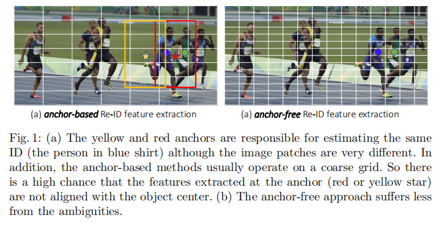
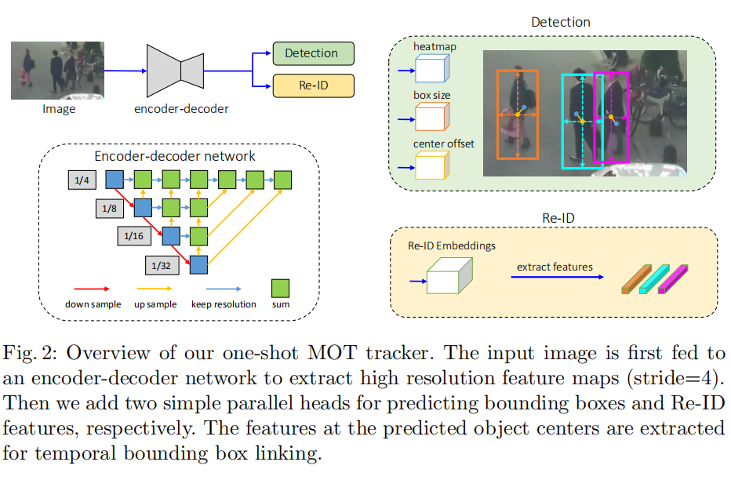
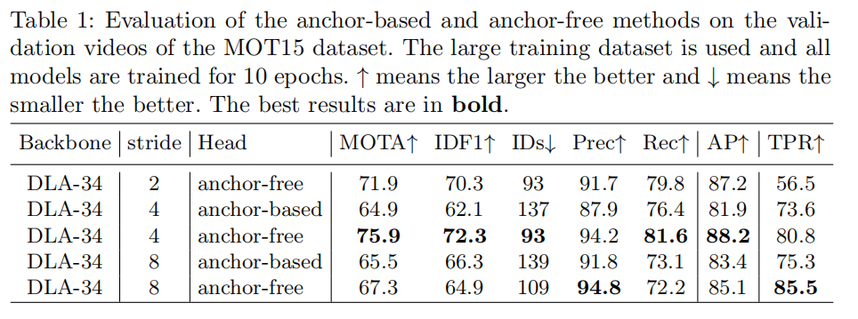
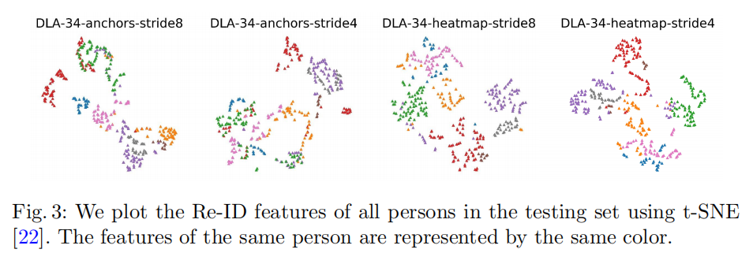
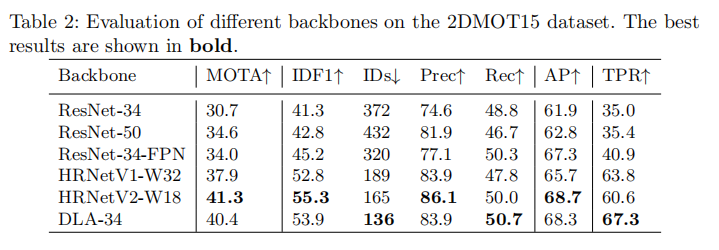
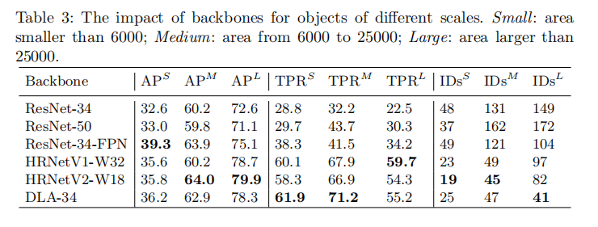
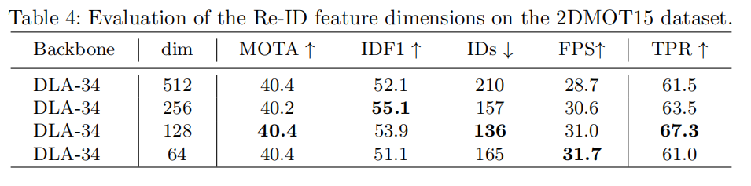
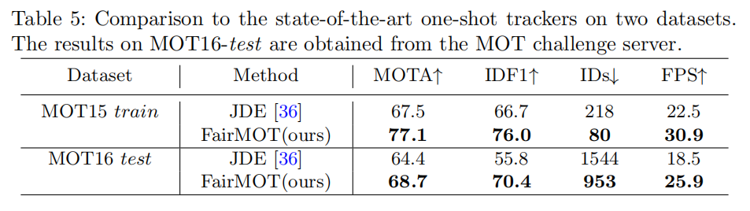
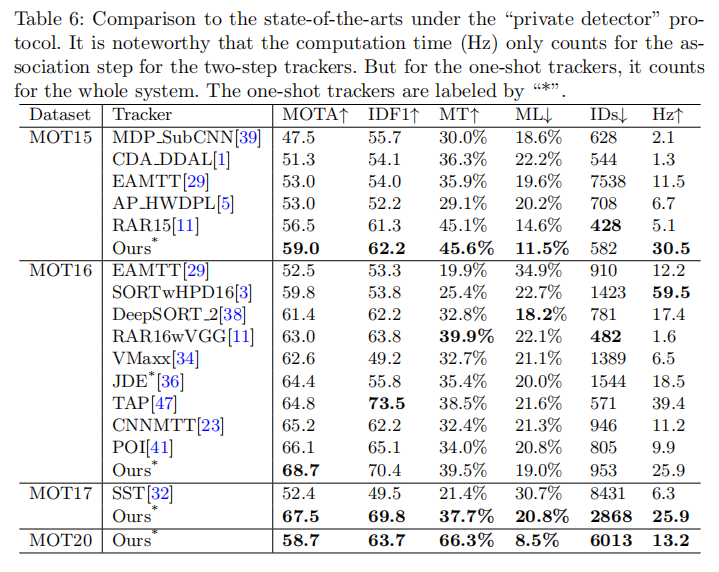

## A Simple Baseline for Multi-Object Tracking

### 摘要

​		近年来，作为多目标跟踪的核心部件的目标检测和重识别取得了显著进展。但是，很少关注在单个网络中这两项任务以提高推理速度。 沿着这条路径的最初尝试最终导致退化的结果，主要是因为重识别分支没有得到合适的学习。本文中，我们研究这种失败之后的关键原因，并根据提出的简单基线来处理这个问题。 在30fps的公共数据集上，它的性能明显优于最先进的。 我们希望这一基线能够激励和帮助评估这一领域的新想法。 代码和预训练的模型见https://github.com/ifzhang/FairMOT。

### 1. 引言

​		 多目标跟踪(MOT)一直是计算机视觉[3,38,6,41]的一个长期目标。该目标使估计视频中感兴趣的多个目标的轨迹。 任务的成功解决可以有益于许多应用，如动作识别、运动视频分析、老年人护理和人机交互。

​		最先进的方法[23,47,11,3,38,6,41] 利用两个单独的模型来处理这个问题：检测模型首先通过图像中的边界框定位感兴趣的目标，然后使用关联模型提取每个边界框的重识别特征，并根据定义在特征上的某种度量连接已有的跟踪中的一个。 近年来，在目标检测[27,12,45,26]和Re-ID[44,6]方面分别取得显著进展，这反过来又提高了跟踪性能。但是，这些方法不能以视频帧率进行推理，因为两个网络不共享特征。

​		随着多任务学习[15]的成熟，联合检测目标和学习Re-ID特征的_one-shot_ 方法吸引越来愈多的关注[36、33]。因为两个模型共享主要特征，所以它们有潜力减少推理时间。但是，与两步方法相比，当前的one-shot方法性能下降明显。特别地，ID切换次数大量增加，这在后面的实验章节介绍。结果表明，组合这两种任务不是平凡的，并应当仔细对待。

​		与其使用技巧来提高准确率，不如研究这种失败背后的原因，并提出本文中的简单基线。 确定了对准确性至关重要的三个因素：

**（1）Anchors don‘t fit Re-ID**	由于当前的one-shot跟踪器[36、33]修改自目标检测器，所以它们全是基于anchor的。但是，anchor不适合学习Re-ID特征，原因有两方面。第一，对应不同图像补丁的多个anchor可能负责估计相同的目标ID。这对网络产生严重的歧义。见图1所示。此外，特征图像通常被下采样8倍以平衡准确率和速度。这对于检测是可接受的，但是对于ReID，太过粗糙，因为目标中心与用于预测目标ID的粗糙anchor位置提取的特征是不能对齐的。我们通过将MOT问题视为逐像素的关节点（目标中心）估计以及在高分辨率的特征图上识别类问题来解决这个问题。

**（2）Multi-Layer Feature Aggregation**	这对于MOT特别重要，因为Re-ID特征需要利用低级和高级特征来促进小型和大型目标。在我们的实验中，我们观察到这有助于减小one-shot方法的ID切换，这是由于改进处理尺度变化的能力。注意，这种改进对两步法没有显著改善，因为在裁剪和缩放操作后，目标具有相似的尺度。

**(3) Dimensionality of the ReID Features**  之前的ReID方法通常学习高维特征，并在它们的基准测试上获得有前途的结果。但是，我们发现更低维的特征实际上对MOT更好，因为MOT的训练图像比ReID少（我们不能使用ReID数据，因为它仅提供裁剪的人体图像）。学习低维特征有助于减小小型数据集的过拟合风险，并改进跟踪鲁棒性。

​		我们提出一种简单的基线，其联合考虑上述三个因素。注意，我们没有声称比之前工作的算法新颖性。相反，我们的贡献是首先确立one-shot跟踪器背后的挑战，然后 将在计算机视觉的不同领域开发的一些技术和概念结合起来，以应对在以前的MOT工作中被忽视的挑战。

​		我们的方法的概览见图2。我们首先采用_anchor-free_目标检测方法来估计高分辨率特征图上目标中心[45、17、46、9]。锚的消除解决了模棱两可问题，高分辨率特征图的使用确保ReID特征能够更好地与目标中心对齐。然后，我们添加并行分支来估计逐像素Re-ID特征，该特征用于预测目标ID。特别地，我们学习低维ReID特征，其不仅减小计算时间，还提高特征匹配地鲁棒性。我们地骨干网络为Deep Layer Aggregation算子来融合不同层地特征以处理不同尺度地目标。

​		通过评估服务器在MOT Challenge基准测试上评估我们地方法。在2DMOT15、MOT16、MOT17和MOT20数据集上地所有在线跟踪器中，我们的方法排名第一。事实上，它还由于2DMOT15、MOT17和MOT20（MOT20是最新地数据集，前面的工作没有在上面报告结果）上地离线跟踪器。

### 2	相关工作

​		本节中，我们简要回顾MOT上的相关工作，将它们分为两步（two-step）和one-shot方法。 我们讨论了这些方法的利弊，并将它们与我们的方法进行比较。

#### 2.1	Two-Step MOT Methods

​		诸如[38、41、23、47、11]的最先进MOT方法通常将目标检测和Re-ID分为两个单独的任务。它们首先使用CNN检测器（例如[27、12、26]）并通过大量边界框来定位图像中感兴趣的所有目标。然后，在一个单独的步骤中，它们根据边界框裁剪图像，并将它们送入ID嵌入网络阿里提取ReID特征，并链接边界框以构成多个跟踪。 这些工作通常遵循边界框链接（box linking）的标准实践，它首先根据边界框的Re-ID特征和IoU计算成本矩阵，然是使用Kalman滤波和Hungarian算法来完成链接任务。诸如[23、47、11]的少量工作使用更复杂的关联策略，例如group model和RNN。

​		two-step方法的优势是，它们能为每个任务使用最合适的模型，而不需做出妥协。此外，在预测ReID特征之前，它们可以根据检测到的边界框裁剪图像补丁以及调整到相同的图像大小。这有助于处理目标的尺度变化。因此，这些方法[41]在公开数据集上获得最佳性能。但是，它们通常很慢，因为目标检测和ReID特征嵌入都需要大量计算。因此，这类方法难以获得视频帧率的推理，这种推理速度在许多应用都是需要的。

#### 2.2	One-Shot MOT Methods

​		随着深度学习中多任务学习的成熟，one-shot MOT开始吸引越来越多的关注。这种方法的核心思想是在单个网络中同时完成目标检测和ID嵌入（ReID特征）以通过共享主要的计算来减小推理时间。例如，Track-RCNN[33]在Mask-RCNN的头部田间Re-ID头部，并回归边界框以及每个提议的Re-ID特征。 在YOLOv3[26]框架的基础上引入JDE[36]，实现接近视频速率的推理。

​		但是，one-shot方法的跟踪准确率通常比two-step方法低。我们发现这是因为，学习到的Re-Id特征不是最优的，这导致大量的ID切换。我们深入研究原因，并发现anchor上提取ID嵌入特征不能与目标中心对齐，这引起模棱两可。为了处理这个问题，我们提出使用anchor-free的方法进行目标检测和ID嵌入，这明显改进所有基准测试上的跟踪准确率。

### 3	The Technical Approach

​		本节中，我们分别介绍骨干网络、目标检测分支和Re-ID特征嵌入分支的细节。

#### 3.1	Backbone Network

​		我们采用ResNet-34作为backbone以获得准确率和速度的良好平衡。 为了适应不同尺度的目标，使用深度层聚合(DLA)[45]的一个变体，如图2所示。与原始的DLA[42]不同，在低层和高层特征之家有更多的skip连接，这与FPN相似。此外，上采样模块中的所有卷积层替换为可变性卷积层，使其可以根据目标的尺度和姿态动态适应感受野。这些修改也有助于缓解对齐问题。产生的模型称为DLA-34。将输入图像的大小表示为$H_{image} \times W_{imag}$，然后输出特征的形状为$C \times \times H \times W$，其中$H = H_{image} / 4$，$W = W_{image} / 4$。

#### 3.2	Object Detection Branch

​		遵循[45]，我们将目标检测视为高分辨率特征图上的基于中心的边界框回归任务。特别地，将三个并行头部附加到骨干网络以分别估计_热图_、目标中心_偏移_和边界框_大小_。 每个头通过将$3 \times 3$卷积（具有256个通道）应用于骨干网络的输出特征映射来实现，然后是生成最终目标$1 \times 1$卷积层。

**Heatmap Head**	该头部负责估计目标中心的位置。这里采用基于热图的表示（其为标志点估计任务的标准）。特别地，热图的维度为$1 \times H \times W$。热图中一个位置如果位于ground-truth目标的中心，那么它的相应期望为1。这种响应随热图和目标中心位置之间的距离呈指数衰减。

**Center Offset Head**  这个头部负责更准确地定位目标。特征图中的步长为4，这将引入不可忽略的量化误差。注意，这对于目标检测性能的好处可能很小。但是，它对于跟踪是至关重要的，因为应当根据准确的目标中心提取Re-ID特征。 在我们的实验中，我们发现ReID特征与对象中心的仔细对齐对于性能至关重要。

**Box Size Head**	这个头部负责估计每个锚位置上的目标边界框的高和宽。它与Re-ID特征没有直接关联，但是定位的精度会影响目标检测性能的评估。

#### 3.3	Identity Embedding Branch

​		ID嵌入分支的目标是生成可以区别不同目标的特征。理想地，不同目标之间的距离应当大于相同目标之间的距离。为了达到这个目的，我们在骨干特征图上使用128核的卷积层来提取每个位置的ID特征。产生的特征图为$\mathbf{E} \in R^{128 \times W \times H}$。从特征图上提取$(x,y)$处目标的Re-ID特征$\mathbf{E}_{x,y} \in R^{128}$。

#### 3.4	Loss Fucntions

**Heatmap Loss**	对于图像中的每个GT框$\mathbf{b}^i = (x_1^i,y_1^i,x_2^i,y_2^i)$，我们计算目标的中心$(c_x^i,c_y^i)$为$c_x^i = \frac{x_1^i + x_2^i}{2}$和$c_y^i = \frac{y_1^i + y_2^i}{2}$。然后，它在特征图中的位置通过除以步长获得：$(\tilde{c}_x^i, \tilde{c}_y^i) = (\lfloor\frac{c_x^i}{4}\rfloor,\lfloor\frac{c_y^i}{4}\rfloor)$。然后位置$(x,y)$的热图响应计算为$M_{xy}=\sum_{i=1}^N \exp^{-\frac{(x - \tilde{c}_x^i)^2 + (y-\tilde{c}_y^i)^2}{2\sigma_c^2}}$，其中$N$表示图像中的目标数，$\sigma_c$表示标准差。损失函数为带focal loss的逐像素logistic回归：

$$L_{\mbox{heatmap}} = -\frac{1}{N} \sum_{xy}\begin{cases}(1 - \hat{M}_{xy})^\alpha\log(\hat{M}_{xy}), &\mbox{if  } M_{xy} = 1; \\ (1 - M_{xy})^\beta(\hat{M}_{xy})^\alpha\log(1 - \hat{M}_{xy}) &\mbox{otherwise},\end{cases}\tag{1}$$

其中$\hat{M}$为估计热图，$\alpha,\beta$为参数。

**Offset and Size Loss**	将_size_和_offset_头部的输出分别表示为$\hat{S} \in R^{W \times H \times 2}$ 和 $\hat{O} \in R^{W \times H \times 2}$。对于图像中的每个GT框$\mathbf{b}^i = (x_1^i, y_1^i, x_2^i, y_2^i)$，我们可以计算它的大小为$\mathbf{s}^i = (x_2^i - x_1^i, y_2^i - y_1^i)$。相似地，GT偏移计算为$\mbox{o}^i = (\frac{c_x^i}{4}, \frac{c_y^i}{4}) - (\lfloor\frac{c_x^i}{4}\rfloor, \lfloor\frac{c_y^i}{4}\rfloor)$。将相应位置地估计大小和偏移表示为$\hat{\mathbf{s}}$和$\hat{\mathbf{o}}$。 然后我们对这两个头执行$l_1$损失：

$$L_{box} = \sum_{i=1}^N ||\mathbf{o}^i - \hat{\mbox{o}}^i||_1 + ||\mathbf{s}^i - \hat{\mbox{s}}^i||_1.\tag{2}$$

**Identity Embedding Loss**	我们将目标Id嵌入视为分类任务。特别地，将训练集中相同id地所有目标视为一个类。对于图像中的每个GT框$\mathbf{b}^i = (x_1^i, y_1^i, x_2^i, y_2^i)$，我们在热图上获得目标中心$(\tilde{c}_x^i, \tilde{c}_y^i)$。在这个位置提取ID特征向量$\mathbf{E}_{x^i,y^i}$，并学习将其映射到一个类分布向量$\mathbf{p}(k)$。将GT类标签的one-hot表示表示为$\mathbf{L}^i(k)$。然后，我们计算softmax损失：

$$L_{\mbox{identity}} = - \sum_{i=1}^N\sum_{k=1}^K \mathbf{L}^i(k)\log(\mathbf{p}(k)), \tag{3}$$

其中$K$为类的数量。

#### 3.5	Online Tracking

​		本节中， 我们解释模型的推理，以及如何用检测结果和id嵌入来执行边界框跟踪。

**Network Inference**	网络采用大小为$1088 \times 608$的图像作为输入，这与JDE相同。在预测热图的顶部，我们进行基于热图得分的NMS来提取峰值关键点。我们保留热图得分大于阈值的关键点位置。然后，我们基于估计的偏移和边界框大小计算相应的边界框。我们还在估计的目标中心提取id嵌入。

**Online Box Linking**	我们使用标准的在线跟踪算法来获得box linking。在第一帧中，基于估计的边界框初始阿虎一组跟踪。在后续帧中，我们跟俊Re-ID特征和IoU测量的距离链接已有的跟踪。我们还是用Kalman 滤波来预测当前帧中跟踪的位置。如果kalman滤波与链接的检测太远， 我们将相应的成本设置为无穷大，有效地防止了检测与大运动的连接。我们在每个时间步更新跟踪器的外观特征以处理如[4、14]中的外观变化。

### 4	实验

#### 4.1	Datasets and Metrics

​		遵循以前的文献，如[36]，我们将来自六个公共数据集的训练图像来组成一个大型训练数据集，用于人体检测和搜索。特别地，ETH和CityPerson数据集仅提供边界框标注，因此我们仅在它们上面训练检测分支。CalTech、MOT17、CUHK-SYSU[40]和PRW数据集提供边界框和id标注，其中我们训练检测和id嵌入分支。因为ETH中的数据集还出现在MOT16数据集的测试集中，我们将这些视频从训练数据集中移除，从而进行公平比较。在一些消融实验中，我们提出在更小的数据集上训练模型以节约计算成本，这将清楚地描述。

​		 我们在四个基准的测试集上广泛地评估我们的方法的各种因素：2DMOT15、MOT16、MOT17和最近发布的MOT20。 与[36]一样，我们使用Average Precision (AP)来评估检测性能，错误接受率为0.1时地True Positive Rate (TPR) 来评估Re-ID特征。我们使用CLEAR metric[2]和IDF1[28]来评估跟踪准确率。

#### 4.2	实现细节

​		我们使用[45]中提出地DLA-34地变体作为默认骨干。在COCO检测数据上预训练地模型参数用于初始化我们地模型。我们利用Adam优化器训练模型30个周期，初始学习率为$1e-4$。学习率在20和27个周期时，分别衰减到$1e-5$和$1e-6$。batch size设置为12。我们使用标准地数据增强技术，包括旋转、缩放和颜色扰动。输入图像调整到$1088 \times 608$，特征图地分辨率为$272 \times 152$。在两张RTX 2080 GPU上训练花费30小时。

#### 4.3	消融研究

**Anchor-based vs. Anchor-free**	先前地one-shot跟踪器基于锚，其遭遇不对齐问题。本节中， 我们通过在我们的方法之上构建一个基于锚的基线来数值验证该参数，方法是用[36]中使用的基于锚的方法替换检测分支。我们保持两种方法的其余部分相同，以进行公平比较。注意，本节中的模型在大型训练数据集上训练，因为使用效性数据进行训练时，基于锚的方法获得非常差的结果。结果见表1。

​		 我们可以看到，基于锚的方法在不同步幅下获得的分数始终低于我们的无锚方法。例如，当步长为8时，无锚的方法的TPR明显好于基于锚的方法（85.5% vs. 75.4%），这意味着无锚方法的Re-ID特征有明显的优势。主要原因时，锚和目标中心的不对齐严重引起网络学习的模棱两可。

​		值得注意的时增加特征图的分辨率，基于锚的方法甚至会造成MOTA得分的衰退。这是因为，王使用高分辨特征图时，未对齐的正类锚会增加，这时网络更难训练。我们没有展示步长为2的结果，因为锚的数量急剧增加，GPU会超显存。

​		相比之下，无锚方法很少遇到不对齐问题，并获得比基于锚的方法更好的性能。特别地，对于步长4，ID切换的数量从137减少到93。更重要的是，当我们将步长从8减小到4时，我们的方法收益很大。进一步将步长减小到2，开始出现衰减，因为更底层特征的引入使表示对外观的变化缺少鲁棒性。

​		我们还可视化不同模型学习的Re-ID特征，见图3。我们可以看到，基于锚的方法混合了不同Id的特征，特别是当stride为4时。 相反，对于我们的无锚方法，它们是很好的分离的。

**Multi-Layer Feature Aggregation**	本节评估multi-layer feature aggregation的影响。特别地，我们评估几个骨干，例如ResNet、FPN、HRNet和DLA-34。 方法的其余因素被控制为相同的，以便进行公平的比较。最终的特征图的步长为4。在ResNet中添加三个上采样操作来获得步长为4的特征图。我们将2DMOT15划分为5个训练视频和6个验证视频。结果见表2和表3。

**The Re-ID Feature Dimension**	见表4。

#### 4.4	The State-of-the-arts

**One-Shot MOT Methods** 

**Two-Step MOT Methods** 

