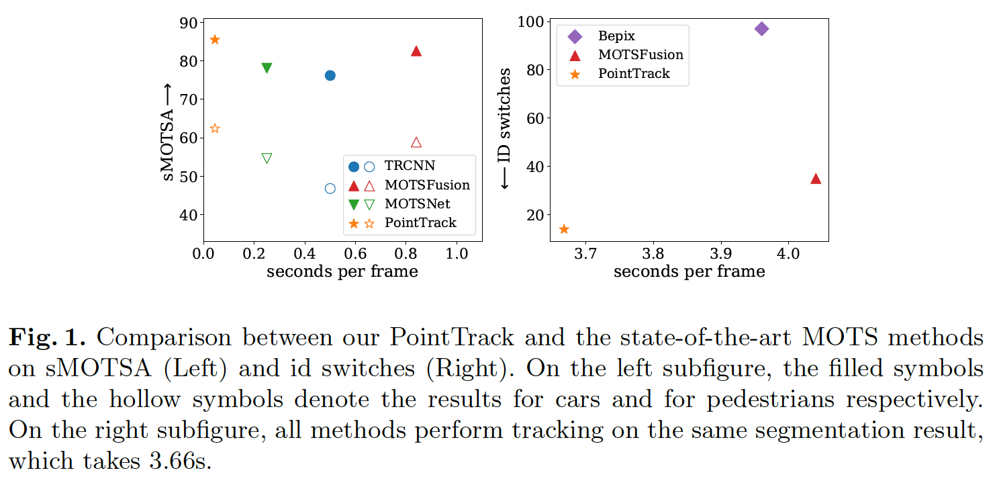

## Segment as Points for Efficient Online Multi-Object Tracking and Segmentation

### 摘要

​		当前的多目标跟踪和分割（Multi-Object Tracking and Segmentation：MOTS）方法遵循tracking-by-detection范式，并采用卷积进行特征提取。但是，由于固有感受野的影响，基于卷积的特征提取不可避免地将前景特征和背景特征混合在一起，从而在后续实例关联中产生歧义。在本文中，我们提出了一种高效的方法，通过将紧凑的图像表示转换为无序的2D点云表示，从而基于分割学习实例嵌入。我们的方法生成新的tracking-by-points范式，其中从随机选择的点学习辨别性实例嵌入，而不是图像。此外，多种信息数据模态被转换为逐点表示，以丰富逐点特征。产生的在线MOTS框架（称为PointTrack）以接近实时的速度（22 FPS）大大超越了所有最新技术，包括3D跟踪方法（比MOTSA高5.4％，比MOTSFusion快18倍）。 对三个数据集的评估显示了我们方法的有效性和效率。此外，基于当前MOTS数据集缺乏拥挤场景的观察，我们构建更具挑战性且更密集的MOTS数据集（称为APOLLO MOTS）。APOLLO MOTS和我们的代码都公开可用https://github.com/detectRecog/PointTrack。

### 1	引言

​		多目标跟踪（MOT）是具有广泛应用（例如自动驾驶和视频监控）的计算视觉的基础任务。最近的MOT方法[4、6、42]主要采用tracking-by-detection范式，其通过数据关联算法跨帧链接检测到的边界框。因为关联的性能高度依赖鲁棒性的相似性测量，由于目标之间的频繁遮挡，这一点广为人知，而MOT尤其是在拥挤的场景中仍然存在挑战[2]。最近，多目标跟踪和分割（MOTS）任务通过联合考虑实力分割和跟踪扩展MOT。由于实例掩膜精确地描绘了可见对象的边界并自然地分开了邻接关系，因此MOTS不仅提供像素级分析，而且更重要的是，与基于边界框（bbox）的方法相比，它鼓励学习更多的区分性实例特征以促进鲁棒的相似性测量。

​		不幸的是，当前的MOTS方法很少解决如何从分割中提取实例特征嵌入的问题。TRCNN [35]通过3D卷积扩展了Mask RCNN，并采用ROI Align来提取bbox提议中的实例嵌入。为了聚焦特征提取中的分割区域，Porzi等[28]提出mask pooling来替换ROI Align。然而，由于受卷积的感受野的影响，前景特征和背景特征仍然混淆，这对于学习辨别性特征有害。因此，尽管当前的MOTS方法采用高级分割网络来提取图像特征，但它们无法学习辨别性实例嵌入，这对于鲁棒实例关联至关重要，从而导致跟踪性能有限。

​		本文中，我们提出简单而高度有效的方法来学习分割上的实例嵌入。受PointNet [29]成功的启发，PointNet[29]可直接从不规则格式的3D点云中进行特征聚合，我们将2D图像像素视为无序2D点云，并以点云处理方式学习实例嵌入。具体而言，对于每种情况，我们分别为前景分割和周围区域构建两个单独的点云。在每个点云中，我们进一步提出组合逐点的不同模态来实现统一和场景感知的示例嵌入。以这种方式，可以组合将实例嵌入与任意实例分割方法来轻松实现tracking-by-points范式。通过与基于相同分割结果的当前MOTS方法进行比较，检验了我们提出的实例嵌入方法的有效性。 如图1右图所示，我们的方法可以显着减少ID切换。对不同数据集的评估（请参见表3,5中的PointTrack *）也证明了我们提出的实例嵌入的强大泛化能力。此外，为了使MOTS实用，我们增强了用于时间一致性的最新的一阶段实例分割方法SpatialEmbedding [24]，并建立了一个名为PointTrack的新颖的MOTS框架。我们提出的框架首先实现了近乎实时的性能，同时在性能上大大超过了所有最新技术，包括在KITTI MOTS上进行的3D跟踪方法（请参见图1左图）。

​		此外，为了促进更好的评估，我们基于公开的ApolloScape数据集[13]构建更拥挤、更具挑战性的MOTS数据集（称为APOLLO MOTS）。APOLLO MOTS与KITTI MOTS有相似数量的帧，但是是KITTI MOTS两倍的跟踪和汽车标注（见表1）。我们相信APOLLO MOTS可以进一步促进MOTS中的研究。

​		我们的贡献如下：

- 通过将紧凑的图像表示分解为无序的2D点云，从而提出高度有效的方法以在分割上学习辨别性实例嵌入。
- 引入新颖的在线MOTS框架（称为PointTrack），其比SOTA更有效。
- 我们构建APOLLO MOTS，它是实例密度比KITTI MOTS高68%的挑战性数据集。
- 在三个数据集上的评估表明，PointTrack大幅领先所有已有MOTS方法。同时，PointTrack明显减少ID切换，并在实例嵌入提取上具有很好的泛化能力。