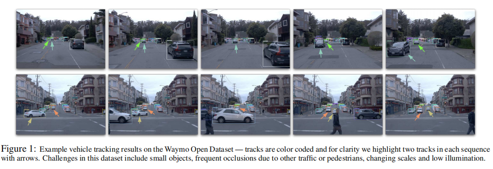
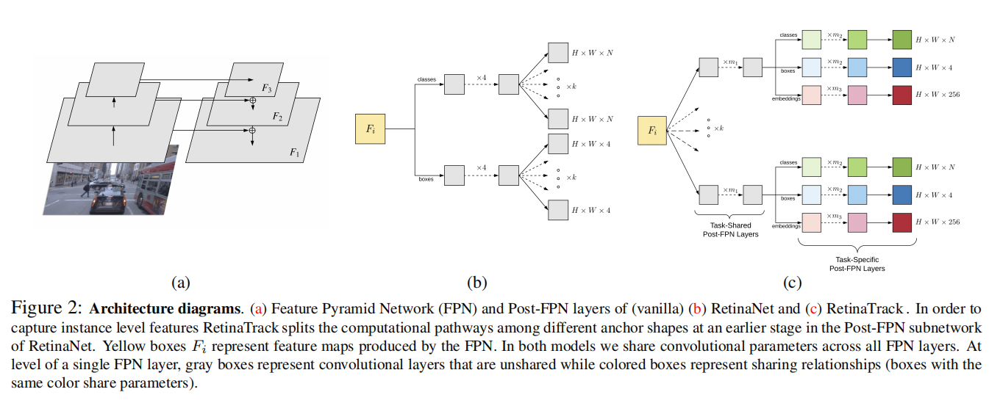
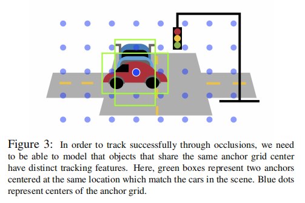
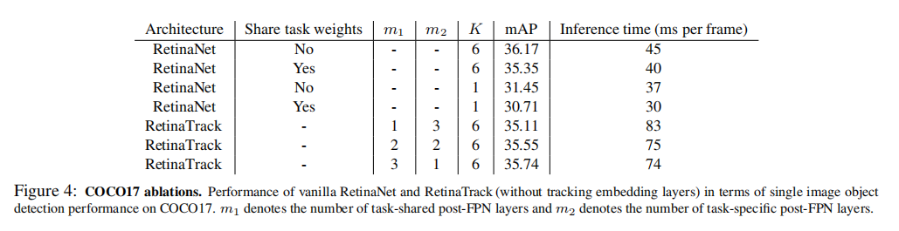
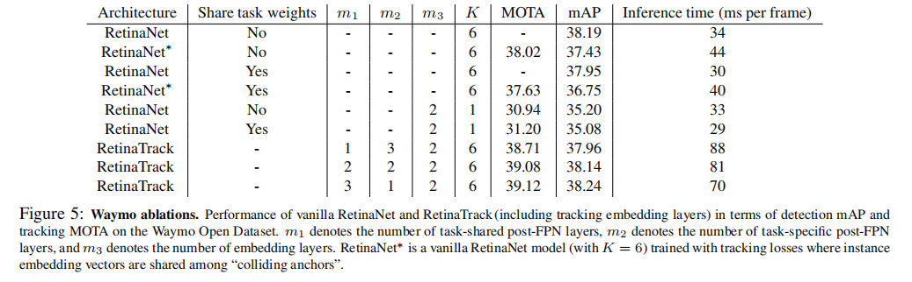
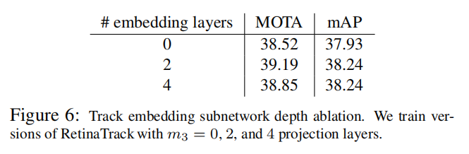
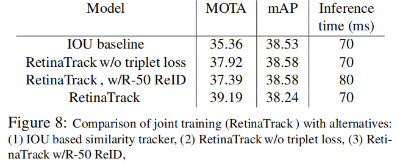
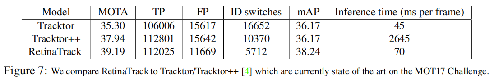
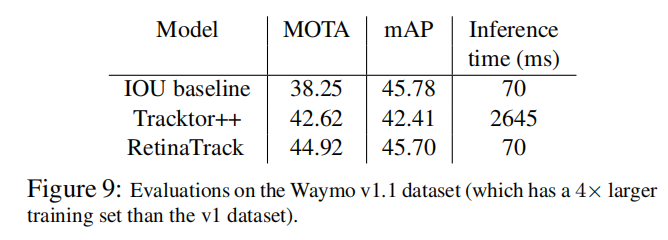

## RetinaTrack: Online Single Stage Joint Detection and Tracking

### 摘要

​		传统的多目标跟踪和目标检测使用单独的系统执行，大多数先前的工作值关注这些方面的一方面，而不管另一方面。跟踪系统显然得益于准确的检测，但是，也充足的文献证据认为检测也可从跟踪中受益，例如跟踪有助于随时间平滑预测。本文中，我们关注自动驾驶中的tracking-by-detection范式，其中两个任务都非常关键。我们提出概念上简单而高效的检测和跟踪的联合模型，称为RetinaTrack，其修改单阶段的RetinaNet使得它符合实例级嵌入训练。 我们通过对Waymo Open Dataset 的评估表明，我们的性能优于最先进的跟踪算法，同时需要计算更少。我们认为，我们简单而有效的方法可以作为这一领域今后工作的坚实基础。

### 1. 引言

​		今天，tracking-by-detection范式已成为多目标跟踪的主流方法，通过独立检测每帧中的目标，然后进行跨越视频帧的数据关联。最近几年，由于深度学习的应用，这种方法的两个方面（检测和数据关联）已取得显著的技术进步。

​		 尽管这两个任务往往是同时进行的，而且深度学习使模型易于接受多任务训练， 但是，即使在今天，将这两个方面分开比在一个模型中联合训练它们要常见得多，因为大多数论文通常侧重于检测度量或跟踪度量，很少两者兼而有之。 这种任务分离导致更复杂的模型和缺乏有效方法。 这表明，这一领域的旗舰基准(MOT挑战[42])假设模型将使用公开的检测，论文继续声称使用实时跟踪器，而不是测量执行检测所需的时间。

​		本文中，我们感兴趣的主要是自动驾驶领域，其中目标检测和多目标跟中都是关键技术。如果我们不能检测和跟踪，我们便不能预测汽车和行人将去往哪里（以及是什么速度），因此，例如，我们不知道是否在拐角处向行人让路，或是否在街道上全速行驶，尽管有汽车从对面的车道驶来。

​		 我们特别关注RGB输入，虽然通常不是现代自主车辆中使用的唯一传感方式，但它起着重要的作用；RGB相机如LiDAR的相同的范围限制，并且是相当便宜的，而且能够检测到更小的物体，这对于高速公路驾驶来说是非常重要的，因为高速公路的驾驶速度使它变得非常重要，需要能够对远处的车辆或行人作出反应。

​		在自动驾驶环境中，速度和准确率都至关重要，因为人们不能简单选择最终/最高性能的模型，或者最轻量但不准确的模型。我们的模型基于RetinaNet检测器[36]，它是实时检测器，同时达到最先进准确率，并且专门设计用于检测小型目标。 在这个基础检测器中，为了数据关联，我们添加实例级嵌入。但是，朴素的RetinaNet架构不是这些每实例嵌入——我们提出对RetinaNet的post-FPN预测自网络进行简单但有效修改以处理这些问题。我们通过消融分析正面RetinaTrack可以从跟踪器和检测器的联合训练中获益。 与基本RetinaNet相比，具有较小的计算开销，因此速度很快-由于它的简单性，它也很容易通过Google TPU进行训练。

​		总之，我们的主要贡献如下：

- 我们提出联合训练检测和跟踪模型——我们的模型简单、有效以及可以灵活地部署到自动驾驶汽车。
- 我们提出对单阶段检测架构进行简单修改，使其能够提取实例级特征；我们使用这些特征进行跟踪，但是它也可以用于其他目的。
-  我们建立了WaymoOpen数据集上的2d图像检测和跟踪的初始强基线[2]（图1），并表明我们的方法达到最先进的性能。

### 2. 相关工作

​		 传统上，多目标跟踪和检测已经在两个单独的文献中进行处理，跟踪器通常使用检测器作为黑盒模块，但不一定深入地结合它们。 最近几年，两个领域开始严重依赖深度学习，其使联合建模两个任务变得自然。 然而，除了少数例外情况，联合训练检测和跟踪仍然是例外，而不是规则。 很少有论文对跟踪和检测进行评估，论文通常只关注一种评估。

#### 2.1. 图像和视频中的目标检测

​		 近几年来，主要由社区基准（如COCO挑战[37]和Open Images[31]）驱动的目标检测领域的技术进步激增。 在检测特定的模型架构方面也取得了一些进展，包括基于锚的模型，包括单阶段(例如SSD[39]、Retina Net[36]、Yolo变体[44,45])和两阶段检测器(例如，Fast/Faster R-CNN[19、24、47]、R-FCN[13])，以及较新的无锚模型(例如CornerNet[32、33]、CenterNet[65]、FCOS[55])。

​		 在这些单帧架构的基础上，有一些方法结合时间上下文，以更好地检测视频（特别是对抗运动模糊、遮挡、目标的罕见姿态等）。包括使用3D卷积（例如I3D、S3D）或循环网络的方法来提取更好的序列特征。还有大量工作使用一些类似跟踪的概念来聚合，但是它们主要关注检测，而不是跟踪。例如，有工作利用光流（或者类似光流的量化）来聚合特征[6、66-68]。最近，也有论文提出基于注意力的目标级聚合方法[14、51、59、60]，它们可以视为沿跟踪聚合特征的方法。在许多这种情况下，还使用简单的启发式来“平滑”长时间的预测，包括tubelet平滑[20]或SeqNMS[22]。

#### 2.2. 跟踪

​		传统上，跟踪器起着几种不同的作用。在上述情况下，跟踪器的作用提高视频中的检测准确率（例如通过随时间平滑预测）。 在其他情况下，跟踪器也被用来增强（传统上慢得多）检测器，允许基于间歇性检测器更新(例如[3、7])。

​		最后，在如四栋驾驶和运动分析的应用中，跟踪输出本身是独立的兴趣点。例如，常用的行为预测模块采用目标轨迹作为输入，以预测未来的轨迹，（从而对）特定目标（如汽车或行人）的行为做出预测[9、54、56、63、64]。在这种角色中，tracking-by-detection范式已成为目标跟踪的主流方法，其中检测首先在输入序列的每帧上运行，然后链接跨帧的结果（第二步称为数据关联）。

​		在前深度学习时代，tracking-by-detection方法[11、21、61]倾向于使用任何可用的视觉特征，并寻找一种方法来对抗各种图优化问题的组合爆炸[12、17、46]，这些问题已经被制定来确定最优轨迹。最近几年，使用简单的匹配算法（例如Hungarian匹配）以及更好数据关联的学习特征（例如深度度量学习[4、34、48、50、52、53、58]），这种趋势得到扭转。例如DeepSort，他是一种简单而强壮的基线，其使用离线检测（由Faster RCNN产生），并使用离线训练的深度ReID特征和Kalman滤波运动模型链接它们。在这种场景中，与DeepSort相比，我们的工作可以视为简化的流水线，我们的工作依赖更轻量的检测网络，其与进行ReID的子网络统一。

#### 2.3. Detection meets Tracking

​		强壮的检测是强壮跟踪的关键。通过常用的CLEAR MOT度量（MOTA：multiple object tracking accuracy）可以看出，MOTA惩罚flase positive、false negative以及ID切换（前两项与检测相关）。最近的Tracktor论文[4]将这一观察推到极限，只使用一个单帧FasterR-CNN检测模型就能获得很强的结果。 跟踪本身是通过利用Faster RCNN的第二阶段的行为来完成的，该阶段允许一个不精确的特定提议(例如从前一帧中检测)被“捕捉”到图像中最近的物体上。 利用很小的修改（包含离线训练的ReID组件），Tracktor是MOT17挑战上的当前最先进跟踪器，在本文的实验中，我们会比较这个方法。

​		为了处理检测会对跟踪指标产生如此大影响的问题，诸如MOT Challenge的基准测试尝试通过让多个方法使用完全开箱即用地提供检测来使事情变得“公平”。然而，这种限制不必要地束缚了我们的手脚，因为它假设这两者将分别完成，从而排除联合训练的模型，比如我们自己的模型。 人们怀疑联合检测/跟踪文献的缺乏是否部分是由于这种强调使用黑盒检测。

​		在我们的工作之前，由几种方法尝试训练联合跟踪/检测的模型。Feichtenhofer等人[16]运行R-FCN([13])基础检测架构，同时计算连续帧的高级特征图之间的相关图，然后将其传递到二级预测塔，以预测帧到帧的实例运动。与[16]相同，我们联合训练者两个任务。但是， 其中，他们专门关注ImagenetVid的检测指标，由自动驾驶需求驱动，我们评估跟踪和检测指标。我们的架构相当简单、速度更快，并且基于强壮的单阶段检测器。

​		也有一些研究直接使用3d输入来预测3d tubelet[18,26]，通过使用2d锚网格，通过预测的空间偏移的时间序列允许其在时间上摆动。 然而，这些方法通常更重，需要一种机制来相互关联管，通常依赖于简单的启发式结合单帧分数和IOU重叠。我们直接学习以关联检测（并证明这是有用的）。

​		最后，与我们的方法最相关的工作使Wang等[57]，其也将基于FPN的模型（YOLOv3）与额外的嵌入层结合。相比之下，我们使用RetinaNet的修改，其有更强的性能，并且我们证明没有我们对FPN的修改，性能会变差。

### 3. The RetinaTrack Architecture

​		本节中，我们秒速RetinaNet的变体设计，其允许我们提取每实例（per-instance）级特征。与其他基于锚的检测器不同，RetinaNet产生的每个检测与一个锚关联。为了将者检测与其他帧的检测关联，我们需要能够确定一个与其相应锚关联的特征向量，并将其传入嵌入网络，该往利用度量学习损失训练。

#### 3.1. RetinaNet

​		首先，我们回顾流行的RetinaNet架构，并解释原始模型不适合实例级嵌入。现代卷积目标检测器从沿规则网格排列的滑动窗口位置提取特征图。在诸如RetinaNet的基于锚的方法中，我们每个网格点上放置$K$个不同形状（不同纵横比和大小）的锚框$\{A_1,\cdots,A_K\}$，并要求模型相对这些锚做出预测（例如分类咯git是、边界框回归偏移）。

​		在RetinaNet的案例中，我们使用基于FPN的特征提取器，其产生具有不同空间分辨率$W_i \times H_i$的多层特征图$F_i$（图2a）。然后将每个特征图传入两个post-FPN任务特定的卷积自网络来预测$K$个张量（每个可能的锚对应一个）$\{Y_{i,k}^{loc}\}_{k=1:K}$，每个形状$W_i \times H_i \times N$表示$N$维分类logits，以及$K$个张量$\{Y_{i,k}^{loc}\}_{1:K}$，每个形状$W_i \times H_i \times 4$表示边界框回归偏移（图2b）。注意，通常论文会将这些输出压缩成一个单独的组合张量，而不是$K$个张量，每个锚形状各有一个张量——然而，为了清晰起见，我们将这些预测分开(最终结果是等价的)。

​		更正式地，我们可以将RetinaNet分类和位置预测张量写成每个特征图$F_i$的函数，如下:

$$Y_{i,k}^{cls}(F_i) \equiv \mbox{Sigmoid}(\mbox{conv}(\mbox{conv}^{(4)}(F_i;\theta^{cls}); \phi_k^{cls})), \tag{1}$$

$$Y_{i,k}^{loc}(F_i) \equiv \mbox{Conv}(\mbox{Conv}^{(4)}(F_i;\theta^{loc}); \phi_{k}^{loc}), \tag{2}$$

其中$k \in \{1, \cdots, K\}$为$K$个锚的索引。我们使用$\mbox{Conv}^{(4)}$表示4个中间的$3 \times 3$卷积层（包含BatchNorm和ReLU层）。FPN之后的模型参数为$\theta^{cls}$、$\{\phi_k^{cls}\}_{k=1}^K$和$\{\phi_k^{loc}\}_{k=1}^K$。重要的是，对于给定的FPN层，虽然分类和边界框回归自网络有不同的参数，但参数是跨FPN层共享的，这使得我们可以将从不同层提取的特征向量当作属于兼容的嵌入空间来处理。

#### 3.2. Modifying task-prediction subnetworks to have anchor-level features

​		由式（1）、（2）可知，RetinaNet的所有卷积参数在所有$K$个锚点之间共享，直到分类回归子网的最终卷积。因此，因为，如果两个检测匹配到相同位置的不同形状的锚，便没有清楚的方式来提取per-instance特征，那么网络中唯一能够区分它们的点就是最终的类和边界回归预测。这在跟踪被遮挡的物体时尤其成问题，因为物体更有可能与共享相同位置的锚点对应（图3）。

​		我们的解决方案是，在post-FPN预测层中，强制锚更早地分离，从而允许我们访问中间层的特征，这些特性仍然可以唯一地与锚关联（从而实现最终的检测）。我们提出地修改时简单地——我们最终得到于RetinaNet相似地架构，但是，以不同地方式tie/untie权重。在RetinaTrack模型中，我们同如下参数预测：

$$F_{i,k} = \mbox{Conv}^{(m_1)}(F_i;\theta_k), \tag{3}$$

$$Y_{i,k}^{cls} \equiv \mbox{Sigmoid}(\mbox{Conv}(\mbox{Conv}^{(m_2)}(F_{i,k};\theta^{cls});\phi^{cls})),\tag{4}$$

$$Y_{i,k}^{loc} \equiv \mbox{Conv}(\mbox{Conv}^{(m_2)}(F_{i,k};\theta^{loc});\phi^{loc}).\tag{5}$$

​		因此，对于每个post-FPN层$F_i$，我们首先并行使用$K$个卷积序列（序列有$m_1$层）来预测$F_{i,k}$个张量，其我们称为_per-anchor instance-level features_，从这一点开始，有唯一的$F_{i,k}$于RetinaNet架构产生的每个检测关联（图2c）。我们模型的第一段称为_task-shared post-FPN layers_，其为$K$个锚中的每一个使用单独的参数$\theta_k$，但是跨FPN层（以及分类和定位任务）共享$\theta_k$。

​		$F_{i,k}$不是任务特定的特征，但是，接下来，我们将两个并行的_task-specific post-FPN layers_用于每个$F_{i,k}$。每个序列包含$m_2$个$3 \times 3$ 卷积，接着是$3 \times 3$的最终卷积（对于分类，输出为$N$，边界框定位输出$4$）。对于两个任务特定的自网络，在$K$个锚以及所有FPN层上共享参数$\theta^{cls}$、$\phi^{cls}$、$\theta^{loc}$和$\phi^{loc}$，使得在task-shared层后，所有特征可以视为属于兼容空间。

#### 3.3. Embedding architecture

​		现在，有实例级特征$F_{i,k}$在手，我们使用第3个任务特定的序列，其包含$m_3$个$1 \times 1$卷积层，其将实例级特征映射到最终的跟踪嵌入空间，每个卷积层映射到256个输出通道：

$$Y_{i,k}^{emb} \equiv \mbox{Conv}^{(3)}(F_{i,k};\theta^{emb}). \tag{6}$$

除最后的嵌入层外，我们在每个卷积层之后使用BatchNorm和ReLU，并在所有FPN层和所有$K$个锚上使用相同的共享参数（见图2c）。

​		总之，RetinaNet预测per-anchor instance-level特征$F_{i,k}$。给定检测$d$，有唯一的生成$d$的锚，并且特征图$F_{i,k}$给出于$d$关联的唯一特征向量。其中，RetinaNet模型为两个特定于任务的子网运行4个卷积层，在RetinaTrack中，每个输出张量是$m_1 +m_2 + 1$(或者跟踪嵌入情况下的$m_1 + m_3$)卷积层的结果，其中$m_1$、$m_2$和$m_3$是结构超参数。对于这些设置，我们在第4节中讨论。

#### 3.4. Training details

​		在训练时，我们最小化两个标准RetinaNet损失（Sigmoid Focal Loss和Huber Loss）以及嵌入损失的非加权和。具体地说，我们使用BatchHard策略采样triplet[25]来训练triplet损失[10、49]。

$$\mathcal{L}{BH}(\theta;X) = \sum_{j=1}^A\mbox{SoftPlus}\bigg(m + \max_{p=1,\cdots,A;t_j=t_p}D_{jp} - \min_{l=1,\cdots,A;t_j \neq t_l}D_{jl}\bigg),\tag{7}$$

其中$A$为匹配ground-truth边界框的锚的数量，$t_y$为分配给锚$y$的跟踪ID，$D_{ab}$为锚$a$和锚$b$嵌入之间的非平方欧式距离（$||a-b||_2^2$改为$||a-b||_2$），$m$为边界（本文设置$m=0.1$）。因此，通过找出每个锚难正类和难负类产生triplets。实践中，我们采样64个triplet计算损失。

​		对于检测损失，我们遵循[36]中相似的目标分配。具体而言，如果锚与ground-truth之间的IoU大于或等于0.5，那么这个锚就分配到一个ground-truth框，否则分配到背景。此外，对于每个ground-truth框，如果IoU小于阈值，我们将最近的anchor（相对IOU）匹配给它。对于triplet损失，我们采用类似的惯例为锚分配跟踪ID，对于正匹配使用IoU大于等于0.7——发现这个更严格的标准可以改进跟踪结果。仅匹配到跟踪ID的锚用于产生triplet。此外，triplet始终从一个clip中产生。

​		我们使用权重衰减为0.0004和动量为0.9的Momentum SGD在Google TPU（v3）上训练。我们使用128个clip构建每个batch，每个clip中以间隔8取两帧（Waymo序列为10Hz，因此这对应0.8的时序步长）。Batch放在32个TPU Core上，从相同clip上分离帧，产生每个核4个帧对的批大小。除非其他说明，图像调整到$1024 \times 1024$，为了使分辨率匹配TPU内存，我们使用bfloat16类型的混合精度训练。

​		使用COCO数据上预训练的RetinaTrack模型（移除嵌入映射）初始化模型。接着，（除非特别指出），我们在前1000步中使用线性学习率热启动，将学习率增加到0.001的初始学习率，但是使用余弦退火学习率迭代90K。遵循RetinaNet，我们使用随机水平翻转和随机裁剪。在训练期间，我们允许独立更新batchnorm，即使相邻的卷积层被共享，也不强迫它们被绑定。

#### 3.5. Inference and Tracking Logic

​		我们使用嵌入在一个简单的基于贪心bipartite匹配的单假设跟踪系统。在推理时，我们构造一个存储有状态跟踪信息的_跟踪存储器（track store）_。对应每个跟踪，我们保留前一帧的检测（包含边界框、类预测和得分）、嵌入向量以及指示跟踪是否存活或死亡的“track state”（为了简单起见，我们没有考虑处于“tentative”状态的跟踪[58]）。我们将跟踪存储器初始化为空，然后，对于clip中的每一帧，我们取RetinaTrack检测中得分最高的100个检测对应的嵌入向量。

​		这些检测通过得分阈值过滤，然后我们通过一些特定的相似度函数$S$，比较存活的嵌入向量与跟踪存储器中的嵌入向量，并运行greedy bipartite matching，当余弦距离超过阈值$1 - \epsilon$时不允许匹配。基于这种贪心匹配，然后我们将检测添加到跟踪存储器中已有的跟踪或者使用它初始化一个新的跟踪。在我们的实验中，我们的相似度函数$S$始终为IoU重叠（使用0.4的截断阈值）和嵌入间余弦距离的均匀加权和。

​		对于跟踪存储器中每个存活的跟踪，我们保存最多$H$个最近的（检测、嵌入向量、状态），因此允许新的检测匹配所有跟踪中的这些$H$个最近的观察。为了重识别的目的，跟踪保留到40帧。如果跟踪在40帧后没有还没有重识别到，那么将其标记为死亡。

### 4. 实验

​		在我们的实验中，我们关注最近释放的Waymo Open Dataset v1[2]（简称Waymo）。我们还在更大的v1.1上报告结果。这个数据集包含以10Hz收集 的200K帧，并覆盖多种地理位置和天气状况。帧来自5个相机（正面和侧面）。对于本文的目的，我们关注2D检测和跟踪，更具体地说，仅将“汽车”类作为数据集，有类不平衡，这不是我们主要关注的。除了Waymo，我们在COCO17数据集上报告消融实验。

​		 最后，我们评估了检测和跟踪指标，如标准平均AP[15、8、37]（MAP）和CLEARMOT跟踪指标[5、42]，特别是使用COCO AP（IoU阈值在0.5到0.95之间的平均AP)和py-motrics库。 我们还使用Nvidia V100 GPU报告推理时间（以毫秒为单位）。对于所有模型，我们仅测试“深度学习部分”， 忽略跟踪器所需的任何逻辑，这通常是非常轻量级的。

​		 同时评估用于检测和跟踪的模型需要一些注意。检测mAP模型在不需要硬操作点的情况下在精确率和召回率之间进行平衡的平均能力——因此检测mAP最好使用较低或为零的阈值。但是，CLEAR MOT跟踪度量（例如MOTA）需要选择一个操作点，因为它们直接引用真/假阳性，在实践中对这些超参数的选择相当敏感。 通常最好使用更高的分数阈值来报告跟踪度量，以避免引入太多的假阳性。在我们的实验中，我们简单使用单独的阈值进行评估：我们的模型作为检测器时，使用接近0的得分阈值，作为跟踪器时，使用更好得分的阈值。

#### 4.1. Evaluating RetinaTrack as a detector

​		作为最初的消融分析（图4），我们通过对COCO17的评估，研究对RetinaNet的修改对标准单个图像检测的影响。在这些实验中，我们丢弃RetinaTrack的嵌入层，因为COCO不是视频数据集。

​		 对于这些实验，我们训练的设置与我们后来的Waymo实验略有不同。我们使用ResNet-50作为基本特征提取器（ImageNet预训练的模型初始化），并利用bfloat16的混合精度在$896 \times 896$分辨率上训练。批大小为64，划分到8个TPU v3 core上，并进行每个core的批归一化。我们前前2K迭代中使用线性热启动学习率，将学习率增加到0.004，然后使用余弦学习率训练23K步。注意，我们可以使用更重的特征提取器或更高的图像分辨率来提高性能，但是这些消融分析的主要目的是揭示RetinaNet和RetinaTrack的post-FPN自网络的变化。

​		$m_1$和$m_2$分别为任务共享和任务特定的post-FPN自网络的卷积数。我们设置$m_1 + m_2 = 4$以与RetinaNet兼容。$K$为每个我i之的锚数，默认情况下，设置为6，但是为了证明每个位置有多个锚对于检测很重要，我们还与简化的RetinaNet进行比较，其中我们仅在每个位置使用1个锚。最后，我们试验了一个普通的RetinaNet版本，其中特定于任务的子网被迫共享它们的权值(图4中的“共享任务权重”列)，因为这更接近于任务共享的post-FPN RetinaTrack层。

​		我们首先注意到，每个位置使用$K = 6$个锚点对COCO上的强大性能非常重要，拥有独立的特定任务子网比共享子网更好，这证实[36]的观察。我们还注意到，通过使用RetinaTrack，我们能够根据设计提取每个实例的特性(我们接下来将使用它进行跟踪，但通常是有用的)，同时在COCO上实现类似的检测性能。如果不需要per-instance级特征，仍然可以通过RetinaNet的原始预测头部布局（类似于SSD[39]和许多文献[23,47]所使用的RPN）得到稍好的数字。在RetinaTrack的3个$(m_1,m_2)$设置中，我们发现使用3个任务共享层$(m_1 = 3)$和1个任务特定层$(m_2 = 1)$，比其他配置略微有优势。

​		我们在图4中报告了运行时间（500张COCO图像的平均时间）。我们修该增加了朴素RetinaNet的时间，因为post-FPN子网的成本被乘以$K$。在RetinaTrack变体中，$(m_1=3,m_2=1)$最快。

#### 4.2. Architectural ablations

#### 4.3. Joint vs Independent training

​		图8中比较的三种基线为：

- _IOU baseline_	仅通过IoU衡量检测相似性。
- _RetinaTrack w/o triplet loss_    忽略triplet损失（因此不专门训练模型进行跟踪），并通过per-instance特征向量$F_{i,k}$衡量嵌入相似性。
- _RetinaTrack w/R-50 ReID_    训练RetinaTrack时，再次忽略triplet loss，并将检测送入离线训练的ReID模型。对于ReID模型，我们许纳林基于TriNet的ResNet-50以在Waymo上进行ReID。

#### 4.4. Comparison against state of the art

​		我们重新实验了Tracktor和Tracktor++（其添加ReID组件和相机运动补偿）。为了验证我们复现的竞争力，我们提交基于ResNet101的Tracktor到MOT Challenge服务器，其获得与官方实现（使用FPN）几乎相同的MOTA（53.4 vs. 53.5）。我们还提交基于ResNet152的Tracktor的结果，其比公开排行榜上是所有方法好（56.7 MOTA）。

**Evaluation on the Waymo v1.1 dataset.**

