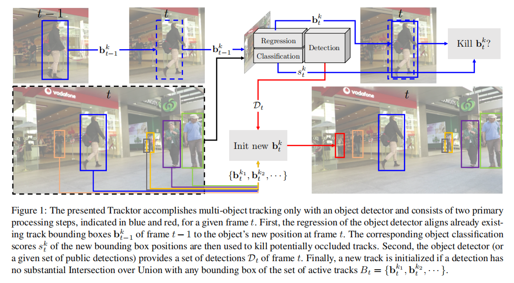
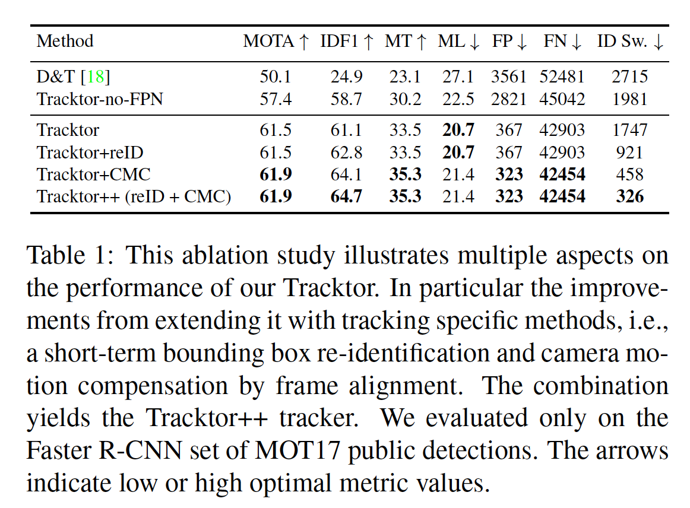
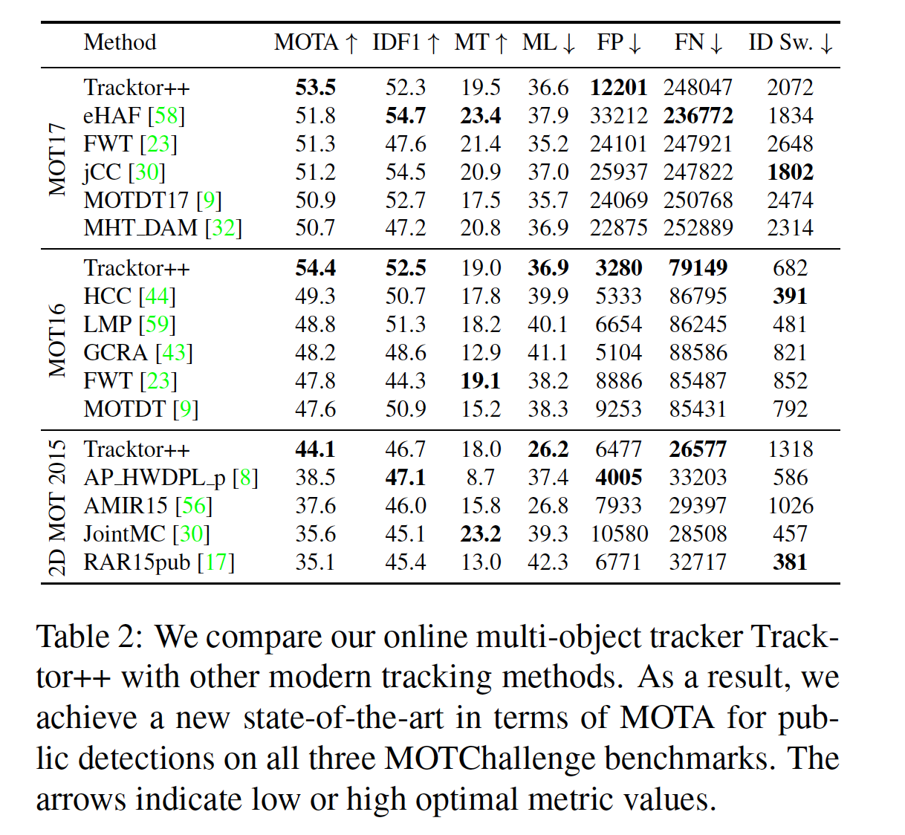
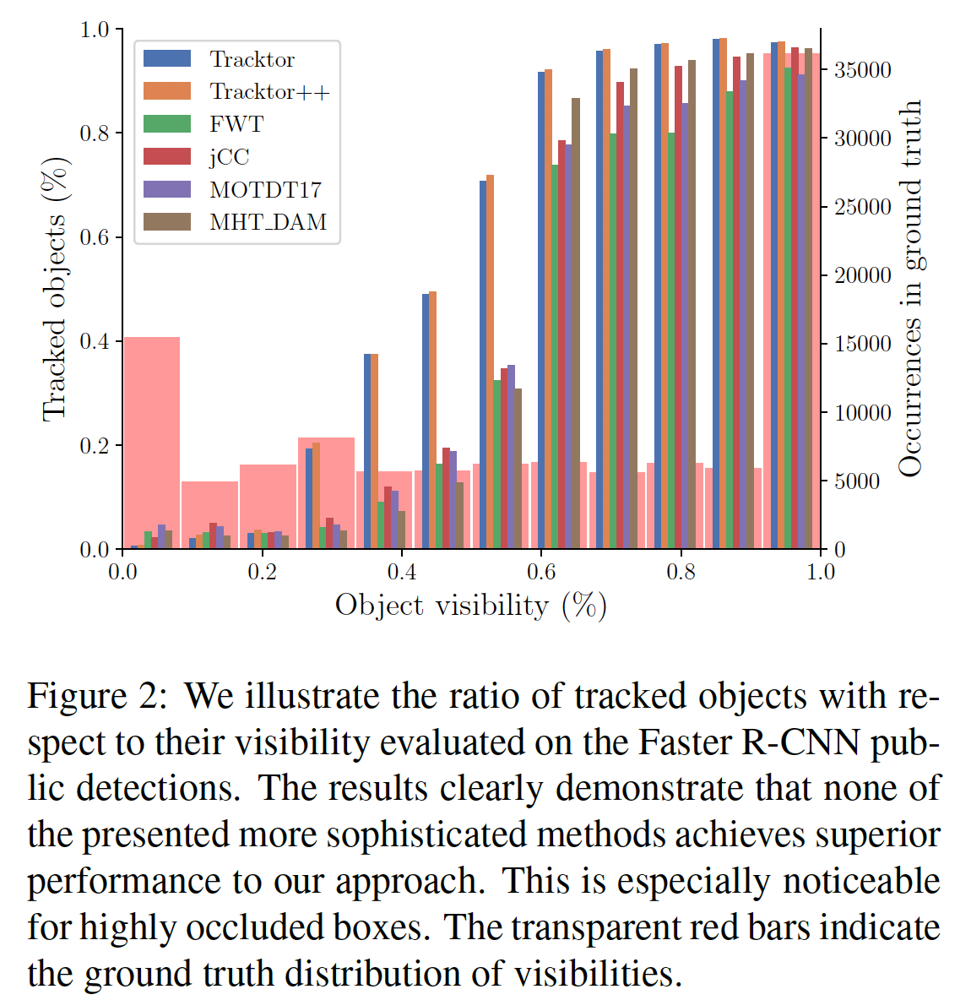
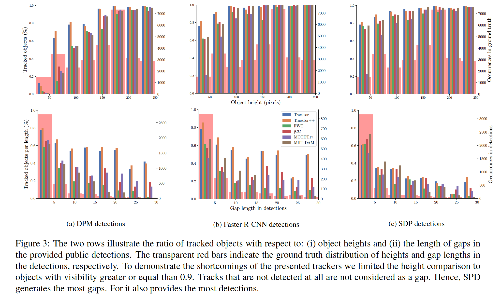
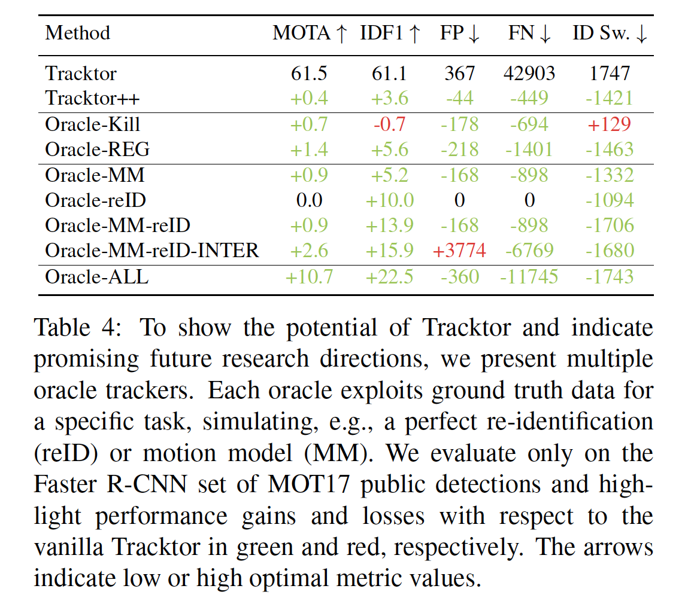

## Tracking without bells and whistles

### 摘要

​		跟踪视频序列中的多个目标引起几个挑战性任务。对于tracking-by-detection，这些挑战包括目标重识别、运动预测和处理遮挡。我们提出一种跟踪器（没有花里胡哨的操作），其完成跟踪，而不专门针对这些任务中的任何一个，特别地，我们没有在跟踪数据上进行训练或优化。为此，我们利用目标检测器的边界框回归来预测目标在下一帧中的位置，因此将检测器转换为Tracktor。我们展示Tracktor的潜力，并在三个多目标跟踪基准给出新的最先进性能，这时通过利用一个直接的重新识别和摄像机运动补偿来扩展它获得的。

​		然后对几种先进的跟踪方法的性能和故障情况进行了分析，并与我们的Tracktor进行比较。令人惊讶的是，对于复杂的跟踪场景，即被遮挡的小目标或遗漏的检测，这些专用的跟踪方法都不是很好。但是，我们的方法处理了大多数简单跟踪场景。因此，我们将我们的方法作为一种新的跟踪范式，并指出有前途的未来研究方向。整体上，Tracktor产生的跟踪性能比当前的任何跟踪方法都好，我们的分析揭示了剩余仍未未解决的跟踪挑战，以启发未来的研究方向。

### 1. 引言

​		视频中的场景理解仍是计算机视觉的重大挑战之一。人类通常是一个场景中注意力的中心，这导致了在视频中检测和跟踪它们的基础问题。Tracking-by-detection已称为解决多目标跟踪问题的优先范式，因为它通过将跟踪分为两步而简化这个任务：（1）在每帧中单独检测目标位置；（2）通过跨时间链接相应的检测形成跟踪。 由于缺失和虚假检测，遮挡和目标相互间拥挤的环境，链接步（linking step）或数据关联（data association）本身是一个挑战性任务。为了解决这些问题，这一领域的研究已经产生了越来越复杂的模型，但只取得了略微好的结果，例如，在过去两年里，以MOT16[45]为基准，多目标跟踪精度仅提高了2.4%。

​		在本文中，我们仅使用一种目标检测方法来进行跟踪，从而将tracking-by-detection推向极限。我们证明仅在检测任务上训练的神经网络可以获得最先进的跟踪结果。如图1中的蓝色箭头指出的，诸如Faster RCNN的目标检测器的回归器足以在众多具有挑战性的跟踪场景中构造目标轨迹。这引起一个有趣的问题。如果一个_检测器_可以解决主要的跟踪问题，那么在什么情况下需要一个专用的跟踪算法呢?我们希望我们的工作和提出的_Tracktor_允许研究人员关注多目标检测中仍未解决的关键挑战。

​		本文的四个主要贡献为：

- 我们引入Tracktor，其通过利用检测器的回归头部来处理多目标跟踪，从而进行目标边界框的时许对齐。
- 我们提出对Tracktor进行两项简单的扩展——重识别Siamese网络和运动建模。由此产生的跟踪器在三个挑战性的多目标跟踪基准测试上产生最先进性能。
- 我们在错误案例和挑战性跟踪场景上进行专门分析，并证明没有一种专用的跟踪方法比我们的回归方法执行得更好。
- 我们提出我们的方法作为一种新的跟踪范式，其利用检测器，并允许研究人员专注于其余复杂的跟踪挑战。这包括对未来有前途的研究方向的广泛研究。

#### 1.1. 相关工作

​		诸如监控、行为识别或自动驾驶等的几种计算机视觉任务都依赖目标轨迹作为输入。尽管有大量关于多目标跟踪的文献[42、38]，但它仍然是一个具有挑战性的问题，特别是在拥挤的环境中，遮挡和误检测是常见的。大多数最先进的工作遵循tracking-by-detection的范式，这种范式严重依赖潜在检测方法的性能。

​		最近，基于神经网络的检测器明显好于所有其他检测方法。进化为Faster-RCNN[52]的检测器家族，以及进一步的检测器如SDP[63]都依赖目标提议，这些提议被传递给一个目标分类和一个边界边界框回归网络。后者精炼边界框以紧凑地包围目标。本文中，我们证明人们可以重新思考使用这种回归器进行跟踪。

**Tracking as a graph problem**	

​		数据关联问题处理的是在现有检测条件下保持被跟踪目标的ID。对于在线应用程序或track-by-track，可以按帧执行 [5、15、48]。因为视频分析可以离线完成，优先考虑批方法，因为它们对于遮挡更鲁棒。一种常见的形式是将这个问题表示为一个图，其中每个检测是一个节点，边表示可能的链接。然后，数据关联可以被表述为最大flow[4]，或者，等价的，具有基于距离的固定成本的最小成本问题[26,49,66]，包括运动模型[39]或学习成本[36]。替代形式通常导致更复杂的优化问题，包括最小cliques[65]、如MCMC[64]或multi-cuts[59]等的通用求解器。最近倾向是涉及更复杂的模型，包括其他视觉输入，如多摄像机序列的重建[40,60]、活动识别[12]、分割[46]、关键点轨迹[10]或关节检测[59]。一般而言，明显更高的计算成本没有带来冥想更高的准确率。事实上，在这项工作中，我们证明，我们可以明显好于所有基于图的跟踪器，同时保持跟踪器是在线的。即使使用图模型优化，人们也需要定义确定两个边界框是否属于同一个人的测量标准。这可以通过分析行人的外观或它的运动来完成。

**Appearance models and re-identification**	在物-物遮挡较多的拥挤场景中，根据外观对目标进行识别和再识别是一个非常困难的问题。在使用外观模型或 reID 方法改进多目标跟踪的详尽文献中，基于颜色的模型很常见 [31]。但是，对于行人跟踪，这不是始终可信的，因为人可以穿着相似的衣服，并颜色统计量常受到背景像素和光照变化的影响。[34]的作者借鉴行人重识别的思想，并将它们用于跟踪中的“re-identify”。在[62]中，学习CRF来更好地区别具有相似外观地行人。 外观和以光流形式的短期运动都可以作为输入到Siamese神经网络中，以决定两个边界框是否属于同一跟踪[35]。最近，[4]证明学习到地ReID特征对于多目标跟踪地重要性。我们在我们的实验中确定这种观点。

**Motion models and trajectory prediction**	 有几项工程利用运动来区分行人，特别是在高度拥挤的场景中。最常见的假设是常速(constant velocity, CVA)[11,2]，但行人运动在拥挤场景中变得更加复杂，研究人员已经转向更具表达力的社会力模型（Social Force Model）[57,48,61,39]。如此地模型还可以从数据中学习[36]。深度学习被广泛用于学习拥挤场景中的社交礼仪，从而进行轨迹预测[39,1,55]。[67]使用单目标跟踪训练地网络来预测下一帧中目标地位置。而[7]关注弹幕跟踪，[51]地作者训练包含边界框预测器和决策网络的多目标跟踪器，以在跟踪的目标之间做出协同决策。

**Video object detection**	没有帧到帧ID预测的多目标跟踪通常被称为视频目标检测。为了改进检测，许多方法利用目标位置的时空一致性。[28]和[27]都生成多帧边界框tuplet提议，并利用CNN和LSTM提取检测得分和特征。最近，[47]的作者通过将光流用于帧之间的传播得分来改进检测。最终，[18]提出联合解决跟踪和检测问题。他们提出了一个网络，处理两个连续帧，并利用跟踪ground-truth数据来改善检测回归，从而生成两帧跟踪。利用后面的离线方法，这些将这些轨迹组合到多帧任务。但是，我们证明我们的跟踪器不仅是在线的，而且在处理目标遮挡时更好。特别地，我们不仅在时间上对齐检测，还保留它们的ID。

### 2. A detector is all you need

​		我们提出将_detector_转换为_Tracktor_以进行多目标跟踪。几个基于 CNN 的检测算法 [52， 63] 包含某种形式的边界框通过回归优化。 我们建议利用这种回归器来完成跟踪任务。这有两个重要好处：（i）我们不需要任何特定于跟踪的训练，（ii）在测试时，我们没有进行任何复杂的优化，因此我们的跟踪器是在线的。此外， 我们表明，我们的方法在几个具有挑战性的跟踪场景中达到最先进的性能。

#### 2.1. Object detector

​		我们的跟踪流水线的核心元素是基于回归的检测器。在我们的案例中，在MOT17Det[45]行人检测数据集上，我们训练具有ResNet-101和FPN的Faster R-CNN。

​		为了进行目标检测，Faster R-CNN使用RPN为每个潜在的目标生成大量边界框提议。通过RoI池化[21]提取每个提议的特征图，并将特征图传入分类和回归头。分类头部为提议分配一个目标得分，在我们的案例中，它评估提议表示的行人的似然。回归头部精炼紧凑包围目标的边界框位置。最后，检测器使用NMS产生目标检测集。 我们提出的方法利用上述能力回归和分类边界框以执行多目标跟踪。

#### 2.2. Tracktor

​		多目标跟踪的挑战是提取逐帧的视频序列给出的$k$个目标的空间和时间位置（即轨迹）。如此的轨迹定义为有序目标边界框列表$T_k = \{b_{t_1}^k, b_{t_2}^k, \cdots\}$，其中通过坐标$b_t^k=(x,y,w,h)$定义边界框，$t$表示视频中的帧。我们利用$B_t = \{b_t^{k_1}, b_t^{k_2}, \cdots\}$表示帧$t$中边界框的集合。注意，每个$T_k$或$B_t$包含的元素可以序列中帧或轨迹的数量少。在图1中，我们展示，对于给定帧$t$（$t>0$），两个连续的处理步骤，即边界框回归和跟踪初始化。

**边界框回归**	第一步（用蓝色箭头表示）利用边界框回归将活跃轨迹扩展到当前帧$t$。这通过将帧$t-1$的边界框$b_{t-1}^k$回归到帧$t$中的目标新位置$b_t^k$。在Faster R-CNN的案例中，这对应于在当前帧的特征上使用RoI池化，但是利用前面的边界框坐标。我们的假设是，目标在帧间的运动很小，这通常是由高帧速率来确保的（请参阅附录B.5中的Tracktor帧速率鲁棒性评估）。ID自动从前一帧迁移到回归边界框，从而高效地创建轨迹。这一过程在后续帧中重复。

​		在边界框回归之后，我们的跟踪器考虑两种情况以杀死（失活）轨迹：（i）离开框架或被非目标遮挡的物体，如果其新的分类得分$s_t^k$低于$\sigma_{active}$，则将其杀死；（ii）将NMS用于所有剩余的$B_t$，而它们对应的IoU阈值为$\lambda_{active}$。

**边界框初始化**	为了考虑新的目标，目标检测器还要提供帧$t$中的完整检测$\mathcal{D}_t$。第二步（图1中的红色箭头）类似帧$t=0$中的第一次初始化。但是。仅当$\mathcal{D}_t$中的检测与任何已激活的轨迹$b_t^k$的IoU小于$\lambda_{new}$，那么开始一个轨迹。也就是说，我们仅在检测到新轨迹覆盖任何轨迹无法解释的潜在新目标时，才考虑对其进行检测。应当在此注意，我们的Tracktor不需要任何特定的跟踪训练或优化，并仅依赖目标检测方法。这允许我们从改进的目标检测方法中直接受益，最重要的是，可以相对便宜地迁移到不同的跟踪数据集或场景，这些数据集或场景没有ground-truth跟踪，而只有检测数据可用。

#### 2.3. Tracking extensions

​		本节中，我介绍两种对普通Tracktor的直接扩展：运动模型和重识别算法。两者都旨在改进跨镇的ID维持，并且是用于增强例如基于图的跟踪方法的技术的常见示例[39、62、35]。

**Motion model**	我们先前的假设——帧到帧的目标位置仅略为改变在两种场景不成立：较大的相机运动和较低的帧率。在极端情况下，帧$t-1$的边界框可能不包含帧$t$中的跟踪目标。因此，我们使用两种类型的运动模型，其将在未来帧中改善边界框位置。对于具有移动相机的序列，我们使用[16]中介绍的增强型相关系数（Enhanced Correlation Coefficient：ECC）最大化的图像配准（registration）来对齐帧，从而应用了直接的相机运动补偿（Camera Motion Compensation：CMC）。对于相对较低的帧率，我们将恒定速度假设（Constant Velocity Assumption：CVA）用于所有目标，如[11、2]。

**Re-identification**	为了保持跟踪器是在线的，我们使用基于Siamese神经网络[6、25、54]生成的外观向量进行短期重新识别（reID）。为此，对于固定数量的$F_{reID}$帧，我们在其非回归版本$b^k{t-1}$中存储了终止（停用）的轨迹。然后，我们比较停用和新检测跟踪在嵌入空间的距离，并通过阈值重识别。嵌入空间距离通过Siamese CNN和美国边界框的外观特征向量计算。应当注意的是，ReID网络确实是在跟踪ground-truth上训练。为了最大程度地降低错误reID的风险，我们仅考虑IoU足够大的停用边界框和新边界框对。运动模型持续用于停用跟踪。

### 3. 实验

​		我们介绍我们提出的额Tracktor及其扩展Tracktor++在几种关注行人跟踪的基准测试上的跟踪性能。此外，我们对上述扩展进行了消融研究，并进一步表明，我们的跟踪器在跟踪准确性方面优于最新方法，并且在ID保持方面表现出色。

**MOTChallenge**	多目标跟踪基准测试MOTChallenge包含几个挑战行的行人跟踪序列，其中具有高频遮挡和拥挤场景。序列的视角，物体大小，摄像机运动和帧频各不相同。挑战包含三个单独的基准测试，即2D MOT2015[37]、MOT16和MOT17[45]。MOT17测试集包括总共7个序列，每个序列都提供三组公共检测。这些检测源自不同的目标检测器，每个检测器的性能均得到提高，即DPM [19]、Faster R-CNN [52]和SDP [63]。我们的目标检测器在MOT17Det[45]检测基准测试上训练，该基准测试包含与MOT17相同的序列。MOT16基准测试不仅提供DPM公开检测，还包含与MOT17相同的序列。2D MOT2015基准测试提供11个序列的ACF[14]检测。跟踪问题的复杂行需要几种度量来衡量跟踪器性能的不同方面。Multiple Object Tracking Accuracy（MOTA）[29]和ID F1 Score（IDF1）[53]量化这两个主要方面，即目标覆盖和ID。

**Public detections**	为了与其他检测器公平比较，我们利用MOTChallenge提供的公开检测进行所有实验。也就是说，本文中比较的所有方法，包括我们的方法及其扩展，处理相同的预计算的逐帧检测。对于我们的方法，仅从公共检测边界框初始化新轨迹，即，我们不使用目标检测器来检测新边界框。我们仅边界框回归器和分类器来获得新的$b_t^k$和$s_t^k$。MOTChallenge公开基准测试包含多种方法[30、9、13]，其利用训练好的神经网络分类给定的检测，因此，我们认为我们对给定检测的处理也是公开的。

#### 3.1. 消融研究

​		MOT17[45]训练集上的消融研究见表1，其展示3个方面：（i）当使用检测器进行跟踪时，我们的方法的优越性，（ii）改进目标检测方法的潜力以及（iii）通过使用跟踪特定的方法（即重新识别（reID）和摄像机运动补偿（CMC））扩展我们的普通 Tracktor进行改进。应当注意的是，尽管MOT17Det和MOT17包含相同的图像，我们避免对训练集进行交叉验证，因为我们的普通Tracktor从未接受过跟踪ground-truth数据的训练。视频目标检测器和跟踪器（D&T）[18]在跟踪ground-truth数据集上训练检测器，该数据集会生层两帧跟踪。但是，尽管随后进行离线动态规划轨迹生成，但基于检测器的跟踪器却不如我们在多个帧上基于在线回归的轨迹生成。此外，我们通过展示Tracktor-no-FPN的跟踪性能（即我们的方法和不带特征金字塔网络（FPN）的Faster R-CNN）来证明我们框架在改进检测方法方面的潜力[41]。尽管到Tracktor++的扩展本质很简单，但是它们的作用对于大幅减少ID切换和增加IDF1具有重要意义。在下一节中，我们将证明这种效果成功地迁移到与测试集上其他最新方法的比较。

#### 3.2. Benchmark evaluation

​		我们在各自基准测试集上评估Tracktor ++的性能，而无需对训练集进行任何训练或优化。表2列出了所有序列以及MOT17在所有三组公共检测中积累的总体结果。对于我们的比较，我们只考虑MOTChallenge基准测试中的正式发布和经过同行评审的提交。我们的补充材料详细列出了各个序列的所有结果。对于所有序列，使用相机运动补偿和ReID。唯一的低帧频序列是2D MOT 2015 AVG-TownCentre，我们对其应用上述恒等速度假设（CVA）。对于两个自动驾驶序列（源自KITTI[20]基准测试），我们使用旋转和评议相机运动补偿。注意，对于所有基准测试，我们使用相同的Tracktor++，其在MOT17Det目标检测上训练。正如我们介绍的，在所有三个基准测试上，它能够获得MOTA方面的最先进性能。

​		特别地，我们在MOT16上获得的结果证明我们的跟踪器能够应对性能相对较差的检测。由于我们的跟踪器的本质，以及逐帧边界框回归的鲁棒性，在MOT16上，我们的跟踪器大幅领先所有其他跟踪器，特别是在false negative（FN）和identity preserving（IDF1）方面。应当注意的是，尽管2D MOT2015的商机那个与MOT17完全不同，我们还是获得新的最先进结果。我们没有使用MOT15训练序列，其进一步展示我们的跟踪器的泛化强度。

### 4. 分析

​		我们的跟踪器的卓越性能，无需任何跟踪特定的训练或优化，就需要进行更彻底的分析。如果没有复杂的跟踪方法，就不会在拥挤和被遮挡的地方表现出色，而只能在普通跟踪场景中表现出色。这就引出了一个问题，即更常见的跟踪方法是否也无法专门解决这些复杂的情况。我们实验和后续分析证明我们的方法在容易跟踪场景中的优势，并激发未来的研究重点关注余下的复杂跟踪问题。特别地，我们对tracking-by-detection的常见执行方式提出了质疑，并提出了一种新的跟踪范式。随后的分析是针对MOT17训练数据进行的，我们将所有表现最佳的方法与公开共享的数据进行了比较。

#### 4.1. Tracking challenges

​		为了更好理解我们的跟踪器，我们想要分析挑战性跟踪场景，并与其他跟踪器比较它的优缺点。为此，我们在表3中总结了他们的基础特点。FWT[23]和jCC[30]都在给定序列的所有检测上使用密集离线图优化。相比之下，MTH_DAM[32]将其优化限制到假设轨迹的稀疏前向视图。

**Object visibility**	直观上，我们预计目标-目标或目标-非目标遮挡的跟踪性能会下降，即可见性下降的目标的跟踪性能会下降。在图2中，我们比较成功跟踪的边界框相对于可见性的比率。透明的红色条形图表示每个可见的ground-truth边界框，并说明对跟踪器总体性能的成比例影响。即使对于可见性低至0.3的部分遮挡边界框，我们的方法也能实现出色的性能。表2中的高MOTA值很大，主要由于ground-truth可见性的不平衡分布。正如预期的那样，我们的扩展版本仅比我们的朴素Tracktor取得了一些小的改进。

**Object size**	考虑到图2中大部分可见但未跟踪的目标，我们认为目标的可跟踪性不仅取决于其可见性，还取决于其大小。因此，与对可见性进行相同的比较，但是对目标的大小进行比较。在图3的第一行中，我们假设行人的高度与其大小成正比，并在所有三个MOT17公共检测设置上进行比较。对于大于250像素的物体高度，所有方法的效果均相似。为了证明它们甚至对于高度可见的目标的缺点，我们仅比较可见度大于0.9的目标。我们的跟踪器在补偿所有目标大小的不充分的DPM和Faster R-CNN检测方面显示出其优势。除MOTDT17之外的所有方法均得益于SDP提供的其他小型检测。对于我们的跟踪器，由于Faster R-CNN检测器的FPN扩展，这种受益是很大的。但是，在线MOTDT17方法学习的外观模型和reID似乎通常对于较小的检测是脆弱的。外观模型通常会遇到小的目标大小以及很少观察到的像素的问题。总之，除了我们对劣质检测的补偿外，没有任何一种跟踪器在变化的目标大学方面表现出明显更好的性能。

**Robustness to detections**	与可见性和大小对应的tracking-by-detection方法本质上受潜在的检测方法的鲁棒性的限制。但是，正如对目标大小的观察，跟踪器在应对或受益于变化的检测质量方面的能力有所不同。在图3的第二行中，我们根据跟踪器对其覆盖范围的检测间隙（gap）来量化此能力。我们将检测间隙（gap）定义为至少一次被检测到的ground-truth轨迹的一部分，并比较每个间隙的覆盖范围与差距长度。凭直觉，较长的间隙很难弥补，因为在线或离线跟踪器必须分别执行更长的hallucination或插值。我们用透明红色指示了在相应的检测组上出现的间隙长度。对于DPM和Faster R-CNN检测，两种解决方案可明显弥补间隙：（i）诸如jCC的离线插值，或（ii）利用如MOTDT中的Kalman滤波器和reID的运动预测。与基于图的jCC方法相比，在线MOTDT17方法擅长弥补特别长的间隙。但是，这些专用的跟踪方法都无法产生与我们逐帧回归跟踪器相似的鲁棒性，从而可以实现更好的覆盖范围。对于超过15帧的长检测间隙尤其如此。离线方法受益于改进的SDP检测，而我们和MOTDT17跟踪器都没有信服明显的间隙长度鲁棒性。

**Identity preservation**	表2中汇总的Tracktor ++结果表明，在IDF1和ID切换方面，ID维持性能可与专用跟踪方法相比。无需像jCC [30]或eHAF [58]中那样进行任何离线图优化，就可以实现这一点。特别地，采用复杂外观模型和reID的MOTDT17并没有明显优于我们的回归跟踪器及其相对简单的扩展。但是，我们的方法擅长减少MOT17和MOT16中的误报数。此外，我们已经证明我们的Tracktor能够合并其他保留ID的扩展。

#### 4.2. Oracle trackers

​		我们已经表明，没有一种专用的跟踪方法专门针对具有挑战性（即重度遮挡下的物体或小的物体）的跟踪方案。因此，我们希望激励Tracktor成为一种新的跟踪范式。为此，我们在两个方面分子我们的性能：（i）目标检测器对停用策略和边界框回归的影响，（ii）确定可能扩展Tracktor的性能上限。在表4中，通过用ground-truth信息替换我们的算法部分介绍几种Oracle跟踪器。除非另有说明，否则所有其他跟踪方面均由我们的朴素Tracktor处理。他们的分析应为研究人员提供有关Tracktor最有前途的研究方向和扩展范围的有用见解。

**Detector oracles**	为了模拟可能完美的对象检测器，我们引入了两个oracle：

- Oracle-Kill：与其利用NMS或分类得分停用，我们使用ground-truth信息。
- Oracle-REG：与其使用回归，我们将边界框置于其ground-truth位置。

两种oracle在MOTA和FP方面均取得了实质性的改进。但是，由于回归与其他看不见的边界框作斗争，因此用ground-truth而不是分数停用会破坏ID维持。结合的Oracle-MM-reID表示Tracktor++的扩展上界。

**Omniscient oracle**	Oracle-ALL执行ground-truth停用、回归和reID。我们认为它的最高MOTA为72.2％，结合较高的IDF1和几乎没有误报的情况，是使用Faster R-CNN和FPN目标检测器的Tracktor的绝对上限。

​		Oracle-MM所带来的显着性能提升表明使用复杂的运动模型扩展Tracktor的潜力。尤其是，Oracle-MM-reIDINTER提出一种预测运动模型，该模型通过长时间遮挡使物体的位置产生hallucinates。这样的运动模型避免了离线后期处理以及由于较长的检测间隙和相机移动而导致的错误线性遮挡路径带来的其他误报。

#### 4.3. Towards a new tracking paradigm

​		总结我们的分析，我们提出两种有关如何将Tracktor用作未来研究方向的起点的方法：

​		**Tracktor with extensions**	将Tracktor应用于给定的一组检测，并通过跟踪特定方法对其进行扩展。帧到帧的边界框回归将涵盖具有大型且高度可见的目标的场景。对于其余部分，考虑到目标的单次运动，实现hallucinating运动模型似乎是最有前途的。此外，如此的运动预测器减小先进停用策略的必要。

​		**Tracklet generation**	与tracking-by-detection类似，我们提出tracking-by-tracklet方法。确切的说，许多算法已使用tracklet作为输入[24、65]，因为它们在计算运动或外观模型方面的信息更为丰富。但是，通常使用特定的跟踪方法来创建这些Tracklet。我们主张利用检测器本身，不仅要创建稀疏检测，而且要建立帧到帧的轨迹。其余复杂的跟踪案例应通过后续的跟踪方法来解决。

​		在这项工作中，我们已经正式定义了那些困难的案例，分析不仅我们的方法而且其他专用跟踪解决方案失败的情况。通过这样做，我们质疑多目标跟踪的当前研究重点，尤其是与挑战性跟踪场景之间缺少的对抗。