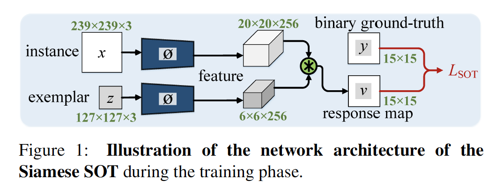
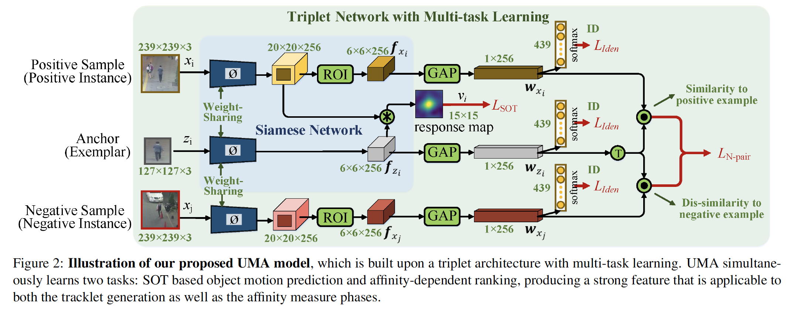

## A Unified Object Motion and Affinity Model for Online Multi-Object Tracking

### 摘要

​		当前流行的在线多目标跟踪（MOT）解决方法使用单目标跟踪器（SOT）来捕获目标运动，同时通常需要额外的相似性网络来关联目标，尤其是对于被遮挡的目标。由于SOT和相似性计算的重复特征提取，这带来了额外的计算开销。同时，复杂相似网络的模型大小通常是非平凡的。在本文中，我们提出新颖的MOT框架，其将目标运动和相似模型统一到单一网络（称为UMA）中，以学习一种对目标运动和相似性度量具有区分性的紧凑特征。特别地，UMA通过多任务学习将单个目标跟踪和度量学习集成到统一的三元组（triplet）网络中。这样的设计带来了提高计算效率、低存储需求和简化训练过程的优点。此外，我们为模型配备了特定于任务的注意力模块，该模块用于促进任务感知特征的学习。所提出的UMA可以轻松地端到端训练，并且是优雅的——仅需要一个训练阶段。实验结果表明，它在多个MOT Challenge基准测试中均取得了令人满意的性能。

### 1. 引言

​		在线多目标跟踪（MOT）的目的是精确定位每个目标的轨迹，同时使用截至当前帧的信息保持其身份（ID）。在最近十年，MOT吸引越来越多的注意力，因为它有广泛的应用，例如视频监控分析和自动驾驶[48、56、57]。

​		当前的MOT解决方案通常涉及目标运动模型和相似性模型。前者利用时序信息进行目标实例定位和轨迹生成，而后者通过测量数据关联中的目标相似性来处理干扰因素（例如具有相似外观的目标）或遮挡。具体而言，一些在线MOT算法基于tracking-by-detection范式[25、39、52、1、29]，即通过计算逐对相似性来关联跨帧的检测。因此，它们主要关注相似性模型的设计。但是，因为在目标检测器中没有探索时序线索，检测的质量通常有限，进一步降低了MOT的性能。MOT场景（例如MOT Challenge[32、38]中的视频序列）通常产生具有稀有姿态或不同大小的拥挤的人。在这样的情况中，甚至领先的检测器[43]也会产生许多False Positive（FP）和False Negative（FN）结果，从而对随后的数据关联阶段产生不利影响。

​		这要求更好地利用MOT中的运动提示。因此，在线MOT的另一种趋势是使用单目标跟踪器（Single Object Trackers：SOTs）。它们充分利用SOTs的优势来处理时序信息的值，并恢复对事的候选检测。这样的范式产生更自然的跟踪，并且根据FN指标，通常产生更好的跟踪结果。但是，拥挤的干扰物及其频繁的交互通常会导致遮挡情况，这对于这些解决方案而言是极具挑战性的。为了处理这个问题，续方法[44、11、68、9、10]将基于SOT的运动模型与相似性（affinity）估计集成在一起。特别地，特别是，它们首先根据SOT的置信度识别目标的状态，然后通过数据关联阶段中的tracklet-detection对的相似性度量更新跟踪的目标并维护被遮挡目标的身份。尽管受到启发，但它们仍然受到一些限制。首先，使用两个单独的模型提取用于SOTs和相似性测量的特征，其产生昂贵的计算成本。第二，因为在相似性计算中没有利用SOT特征，所以不得不训练额外的相似性网络（例如[68]中的ResNet50和[10]中的ResNet101）来补救这个问题。这进一步增加了它们的内存需求，从而严重限制了它们在源受限环境中的适用性。第三，SOT和相似性模型的独立特征提取，以及复杂的相似性网络设计，共同使训练程序复杂化，这往往需要多次轮换或级联训练策略。此外，它们没有探索SOTs和相似性模型的关系，即相似性模型可以帮助SOT访问身份信息，从而学习更多辨别特征以更好地处理遮挡。

​		为了缓解上述问题，我们提出一种基于多任务学习的在线MOT模型（UMA），其端到端地将基于SOT的运动模型和相似性网络集成到统一网络。提升了学习的特征，以捕获更多identity-discriminative信息，从而简化了训练和测试过程。特别地，它将Siamese SOT和排序网络统一到一个triplet架构中。triplet网络的两个分支（例如positive和anchor分支）考虑基于SOT的运动预测任务，而所有这三个分支都通过度量学习解决目标身份感知排名任务。 这提供了几个好处。第一，排名任务中的度量学习分配了学习到的特征的身份识别能力，从而有助于SOT模型更好地定位目标并处理遮挡。第二，这实现了基于SOT的轨迹生成阶段和相似依赖的数据关联阶段之间的特征共享，从而消除了设计额外的相似性网络并提高计算效率的需求。第三，它提供了更直接的一步式训练协议，而不是以前的复杂、多轮换或级联的训练策略。此外，我们的UMA模型配备了一个特定于任务的注意（Task-Specific Attention：TSA）模块，以解决多个任务的特定性质并促进更多特定于任务的特征学习。它对多任务网络提取的共享特征进行自适应的上下文利用，并且具有轻量化的预算成本，同时产生了更好的性能。总之，我们提出了一个三元组网络UMA，它统一了在线MOT中的目标运动预测和相似性测量任务。UMA通过细心设计的多任务学习机制解决了SOT适用以及关联辨别性特征学习的问题。这提供了一个优雅，有效而高效的MOT模型，具有较低的内存需求和简单的端到端训练协议。此外，通过精心设计的在线跟踪管道，我们的轻量级模型在多个MOT Challenge基准测试中，与大多数在线甚至离线算法相比均达到了最新的性能。

### 2. 相关工作

​		**MOT**	已有的MOT方法可以分为离线和在线模式。_离线_方法[41、14、51、54、52]可以同时利用过去和未来的帧进行批处理。它们通常将MOT视为不同形式（例如multi-cut [51、52]、k-partite graph [66、13]和network flow [67、14]）的全局优化问题。尽管在处理模糊的跟踪结果方面受到青睐，但它们不适用于因果应用，例如自动驾驶。

​		_在线_MOT方法只能访问直到当前帧为止的可用信息，因此很容易遭受目标遮挡或噪声检测。先前的大多数方法[1、2、25、39、63]都采用按tracking-by-detection的流水线，其性能在很大程度上受到检测结果的限制。其他一些人[68、44、11、9、10]则应用SOT [22、4、34、17、16]进行在线MOT，通常会获得更好的结果。

​		**Object Motion Models in Online MOT**	基本上，目标运动模型有助于处理噪声检测。例如，Xiang等[62]利用基于光流的SOT（TLD[27]）来跟踪单个目标。Sadeghian等[44]进一步利用多LSTM网络扩展这个流水线以利用不同的长期线索。之后，Zhu等[68]为他们的框架配备更高级的跟踪器：ECO [12]，并设计一个基于注意力的网络来处理遮挡。他们令人鼓舞的结果证明了将SOT用作运动模型的优势。但是，所有这些方法需要额外的相似性模型来处理遮挡，导致递增的计算成本、非平凡的内存需求和复杂的训练协议。Though[11]使用共享骨干来提取所有目标的特征，进一步添加多个在线更新子网络来专门处理每个目标。与之形成鲜明对比的是，我们尝试学习一种“通用”特征，该特征可以为运动和相似性模型保留足够的信息，从而从根本上简化了训练和测试过程。

​		**Object Affinity Models in Online MOT**	在数据关联阶段，目标相似性模型通常用于根据成对相似性链接轨迹或跨帧检测，这是处理在线MOT中遮挡的关键方法。为了产生可靠的相似性估计，目标外观线索是必不可少的，具有度量学习特征的Siamese或triplet网络[8、36、55]提供了强大的工具来获取具有辨别性和鲁棒性的特征嵌入。特别地，Leal-Taixe等[31]使用暹罗网络，通过汇总目标的外观和光流信息来估计所提供检测的相似性。Son等人[47] 提出四元组损失以强调目标外观及其时间邻接。在[52]中，Siamese网络被用来利用人体姿势信息进行长期目标关系建模。Voigtlaender等[53]利用3D卷积层扩展Mask R-CNN，并提出一个关联头，以使用批处理硬三元组损失来提取每个区域提议的嵌入矢量[24]。伯格曼等人[2] 还提出了基于Siamese网络的短期重识别模型。Xu等[63] 通过在空间和时间域中采用关系网络[58]，共同利用外观、位置和拓扑信息来计算相似性。值得注意的是，所有这些方法都适用于“tracking-by-detection”模式。不同的是，我们通过统一的三元组网络将度量学习深入注入SOT模型。它学习了目标运动预测和相似性度量子任务的判别特征，从而带来了有效而高效的解决方案。

### 3. 我们的算法

​		在本节中，我们首先简要介绍一下Siamese SOT [4]（§3.1），因为它被用作模型的骨干。然后，在3.2节中介绍UMA模型的细节。最后，在3.3节中，我们将详细介绍整个在线MOT管道。由于UMA将单个特征提取网络用于基于SOT的轨迹生成和目标相似性度量，因此它提供了一种更为有效的在线解决方案，并进行了许多重要的技术改进。

#### 3.1. Preliminary of Siamese SOT

​		我们的骨干模型是最近提出的深度跟踪器：SiamFC，其基于Siamese网络，并在单目标跟踪领域表现出有前途的性能。它基于轻量级的AlexNet [30]，在一个GPU上以120 fps的速度运行。

​		基本上，SiamFC将跟踪任务转移到嵌入空间中的补丁匹配。Siamese网络作为匹配函数来学习，该函数用于在新帧中查找与第一帧中的初始目标补丁相比最相似的补丁。具体而言，如图1所示，Siamese跟踪器包含两个参数共享的分子，其中每一个都是5层卷积网络$\phi$。一个分支将在第一帧给出的目标检测作为输入，称为exemplar。另一个分支分支输入实例，即包含候选补丁的每个后续帧中的搜索区域。给定示例（exemplar）$z$和实例$x$的特征嵌入：$\phi(z)$和$\phi(x)$，一个互相关层$\tau$用于比较它们的相似性，并获得响应图$v$：

$$v = \tau(x,z) = \phi(x) * \phi(z) + b, \tag{1}$$

其中“$\ast$”表示卷积算子，$b$为偏置项。然后，给定ground-truth图$y$，在$v$上使用logistic损失进行训练：

$$L_{SOT} = \sum_{p \in \mathcal{P}} \frac{1}{|\mathcal{P}|}\log(1 + e^{-v_py_p}),\tag{2}$$

其中$p$表示$x$的晶格$\mathcal{P}$中的候选位置。对于来自实例输入$x$的每个候选$x_p \in x$，$v_p$为示例-候选（exemplar-candidate）对的响应值$v_p$，即$v_p = f(x_p, z)$，并且$y_p \in \{+1,-1\}$为与$v_p$对应的ground-truth标签。

#### 3.2. Our UMA Model for Online MOT

​		**主要思想**	除了SOT网络之外，以前基于SOT的在线MOT方法通常还会设计一个用于亲和力度量的额外网络。相比之下，我们尝试将目标运动和相似性（affinity）网络集成到统一模型中。这带来几个优势，如第一节中提到的。核心思想是增强网络来同时学习两个任务：单目标跟踪和相似性（affinity）预测，其构成统一的多任务学习框架。有些人可能会担心，从性能最高的SOT获得的特征已经足够好进行相似性测量。实际上，尽管SOT特征强大，但它们的辨别性性不足以估计可靠的相似性。这是因为在训练期间SOT很少能访问身份信息，因此它们的特征通常能很好地从实质背景中区分目标，同时捕获相对较少的身份信息。从数据关联的角度来看，SOT特征已经对一些有用的信息进行了编码，因此使用这些特征而不是从头开始学习额外的“affinity features”更为理想和有效。这些考虑启发我们学习统一而强力的特征，其用于两个任务，产生优雅的在线MOT框架。

​		**Triplet-based MOT Framework**	为了获得我们的目标，我们的UMA模型设计为triplet网络架构，如图2所示，其中triplet网络包含三个权重共享分支：一个示例分支、一个正示例分支和一个负示例分支。我们将exemplar作为_anchor_。来自相同目标的实例用作_positive samples_，而来自不同目标的实例作为负样本。