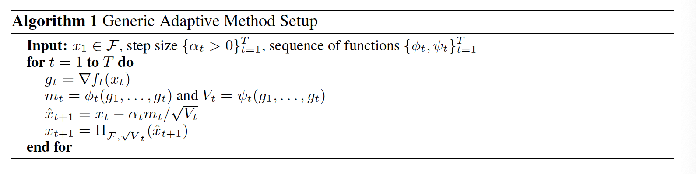
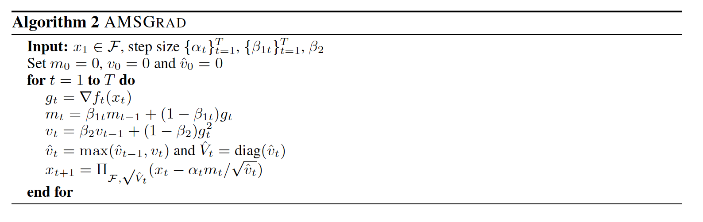
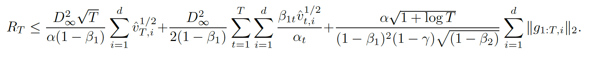
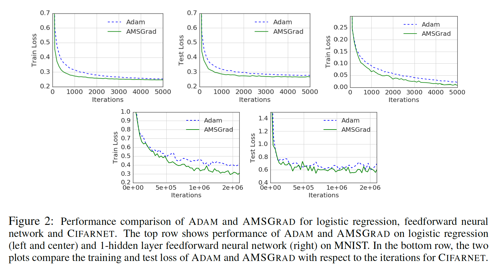

## On the Convergence of Adam and Beyond

### Abstract

​		几种最近提出的随机优化方法已成功用于训练深度网络，例如RMSProp、Adam、Adadelta、Nadam，它们是基于使用梯度更新的，该梯度更新由过去梯度的平方的指数滑动平均值的平方根缩放。在许多应用中（例如大型输出空间的学习），凭经验观察到这些算法难以收敛到最优解（或者非凸设置中的关键点）。我们证明这种失败的原因是算法中使用的指数滑动平均。我们提供了一个简单的凸优化设置的显式示例，其中ADAM不能收敛到最优解，并通过先前对ADAM算法的分析来描述精确的问题。我们的分析表明，可以通过将此类算法与过去的梯度进行“长期记忆”相结合来解决收敛问题，并提出ADAM算法的新变体，不仅可以解决收敛问题，而且通常还可以改善经验性能。

### 1	引言

​		SGD是是训练深度网络的主导方法。该方法通过将模型的参数沿小批量上评估的损失的负梯度方向移动来迭代更新模型的参数。尤其是，SGD的变体特别成功，它可以通过对过去梯度中的平方坐标进行某种形式的平均的平方根来缩放梯度的坐标，因为它们会根据每个特征自动调整学习率。该研究领域中第一个流行的算法是ADAGRAD（Duchi等人，2011； McMahan＆Streeter，2010），当梯度稀疏或通常较小时，与平凡SGD相比，它可以获得明显更好的性能。

​		尽管Adagrad对于稀疏设置表现很好，但是由于在这些设置中学习率的快速衰减，因此损失性能为非凸且梯度密集的设置中，其性能会下降，因为更新中它使用所有过去的梯度。在深度学习中出现的高维问题中，这一问题尤为严重。为了处理这个问题，提出几种Adagrad变体，例如RMSProp、Adam、Adadelta、Nadam等，其使用过去梯度的平方的指数滑动平均来缓解学习率的逐渐衰减，实质上将更新的依赖范围限制为仅过去的几个梯度。虽然这些算法已用于几种实际应用，但是它们还观察到在一些其他设置中没有收敛。通常已经观察到，在这些设置中，某些小批量提供了较大的梯度，但很少出现，并且尽管这些大梯度很有用，但由于指数平均，它们的影响很快消失了，因此导致收敛性较差。

​		本文中，我们详细分析这种场景。我们严格证明上段所说的直觉确实是正确的；即**将更新仅依赖于仅过去的几个梯度进行限制确实会导致严重的收敛性问题**。特别地，我们作出如下关键贡献：

- 我们通过提供一个简单的凸优化问题的例子来阐明RMSPROP和ADAM算法中的指数移动平均值如何导致不收敛，其中RMSPROP和ADAM不能证明收敛到最优解。我们的分析容易扩展到使用指数滑动平均的其他算法（例如Adadelta和Nadam），但是为了简单，我们忽略了这一点。实际上，这种分析具有足够的灵活性，可以扩展到其他算法，这些算法基本上对固定大小的窗口使用平方梯度进行平均（对于指数移动平均值，超过固定窗口大小的梯度的影响变得可以忽略不计）。
- 上述结果表明，为了保证收敛，优化算法必须具有过去梯度的“长期记忆”。特别的是，我们指出Kingma&Ba（2015）给出的Adam的收敛证明的问题。为了解决这个问题，我们提出Adam的新变体，其依赖过去梯度的长期记忆，但是可以在与原始Adam算法相同的时间和空间需求下实现。我们基于Kingma＆Ba（2015）的分析提供了凸设置中新变体的收敛性分析，并证明了与ADAGRAD类似的数据依赖regret bound。
- 我们对提出的一种变体进行了初步的实证研究，并表明它在机器学习中的一些常见问题上的表现相似或更好。

### 2     前提条件

**Notation**	使用$\mathcal{S}_d^+$表示所有正定$d \times d$矩阵的集合。对于向量$a \in \mathbb{R}^d$以及正定矩阵$M \in \mathbb{R}^d \times \mathbb{R}^d$，我们使用$a/M$表示$M^{-1}a$，$||M_i||_2$表示$M$的第$i$行的$l_2$范数，$\sqrt{M}$表示$M^{1/2}$。此外，对于任意向量$a,b\in \mathbb{R}^d$，我们使用$\sqrt{a}$表示逐元素平方根，$a^2$表示逐元素平方，$a/b$表示逐元素除法，$\max(a,b)$表示逐元素最大。对于任意向量$\theta_i\in\mathbb{R}^d$，$\theta_{i,j}$表示其第$j$个坐标，其中$j\in[d]$。对于$A \in \mathcal{S}_+^d$，映射操作$\prod_{\mathcal{F},A(y)}$定义为$\arg \min_{x\in\mathcal{F}}||A^{1/2}(x-y)||$，$y \in \mathbb{R}^d$。最后，对于所有$x,y\in\mathcal{F}$，如果$||x-y||_{\infin} \le D_{\infin}$，我们称$\mathcal{F}$的直径为$D_{\infin}$。

**优化设置**	分析迭代优化方法的灵活框架是完整信息反馈设置中的在线优化问题。在这种在线设置中，每个时间步$t$中，优化算法选择一个点（即模型学习的参数）$x_t \in \mathcal{F}$，其中$\mathcal{F} \in \mathbb{R}^d$是可行的点集。然后揭示损失函数$f_t$（将被解释为下一个小批量中具有所选参数的模型的损失），并且该算法产生损失$f_t(x_t)$。在此过程的$T$轮结束时，算法的regret由$R_T = \sum_{i=1}^Tf_t(x_t) - \min_{x\in\mathcal{F}}\sum_{i=1}^Tf_t(x)$给出。在整个本文中，我们假设可行集$\mathcal{F}$的直径是有界的，而$||\triangledown f_t(x)||_{\infin}$对于所有$t\in[T]$和$x\in \mathcal{F}$都是有界的。

​		我们的目的是设计一种确保$R_T = o(T)$ 的算法，这意味着平均而言，模型的性能会收敛到最佳。这种设置的最简单算法是标准的在线梯度下降算法，其在梯度$g_t =\triangledown f_t(x_t)$相反的方向移动点$x_t$，同时通过经由更新规则$x_{t + 1} = \prod _{\mathcal{F}}(x_t - \alpha_t g_t)$投影到集合$\mathcal{F}$上来维持可行性，其中$\prod_\mathcal{F}(y)$表示$y \in \mathbb{R}_d$在集合$\mathcal{F}$上的投影，即$\prod_{\mathcal{F}}= \min_{x \in \mathcal{F}} ||x - y||$，对于某些常数$\alpha$ ，$\alpha_t$通常设置为$\alpha / \sqrt{t}$。上述在线学习问题与随机优化问题（$\min_{x\in\mathcal{F}}\mathbb{E}_z[f(x,z)]$）密切相关，通常称为经验风险最小（empirical risk minimization：ERM），其中$z$是训练样本，通过该样本将学习具有参数$x$的模型，而$f(x; z)$是样本$z$上具有参数$x$的模型的损失。特别是，vanishing average regret 的在线优化算法产生了针对ERM问题的随机优化算法（Cesa-Bianchi等，2004）。因此，我们将在线梯度下降和随机梯度下降（SGD）用作同义词。

**Generic adaptive methods setup**	现在，我们提供了一种自适应方法的框架，该框架使我们能够洞悉不同自适应方法之间的差异，并且有助于理解几种流行的自适应方法中的缺陷。算法1提供了一种通用的自适应框架，该框架封装了许多流行的自适应方法。注意算法仍是抽象的，因为“averageing”函数$\phi_t$和$\psi_t$没有指出。这里，$\phi_t: \mathcal{F}^t \rarr \mathbb{R}^d$，$\psi_t: \mathcal{F}^t \rarr \mathcal{S}_+^d$。为了便于说明，我们称$\alpha_t$为步长，$\alpha_tV_t^{-1/2}$为算法的学习率，此外，将自己限制为算法1封装的自适应方法的对角变体，其中$V_t = \mbox{diag}(v_t)$。首先，我们观察到标准的随机梯度算法服从这种框架：

$$\phi_t(g_1,\cdots,g_t) \mbox{ 以及 } \psi(g_1, \cdots, g_t) = I, \tag{SGD}$$

并且对于所有$t \in [T]，$$\alpha_t = \alpha/\sqrt{t}$。尽管收敛需要减小步长，但学习率的这种急剧下降通常会转化为较差的经验性能。自适应方法的关键思想是选择合适的平均函数，以实现良好的收敛性。例如，推动自适应方法研究的第一个自适应方法Adagrad（Duchi等人，2011年）使用了以下平均函数：

$$\phi_t(g_1, \cdots, g_t) = g_t \mbox{ 以及 }\psi_t(g_1, \cdots, g_t) = \frac{\mbox{diag}(\sum_{i=1}^t g_i^2)}{t}, \tag{Adagrad}$$

并且对于$t \in [T]$，步长$\alpha_t = \alpha/\sqrt{t}$。与SGD中的学习率$\alpha/\sqrt{t}$相比，如此设置实际上意味着$\alpha/\sqrt{\sum_i g_{i,j}^2}, j \in [d]$的学习率衰减。当梯度稀疏时，这可能会导致融合方面的巨大收益（参见Duchi等人（2011年））。 在实践中，甚至在很少的非稀疏设置中也观察到了这些收益。

**Adaptive methods based Exponential Moving Averages**	Adagrad指数滑动平均的变体在深度学习社区非常流行。RMSProp、Adam、Nadam和Adadelta是属于此类方法的突出算法。关键差异是使用指数滑动平均作为函数$\psi_t$，而不是Adagrad中使用的简单平均函数。Adam（特别流行的变体）使用如下的平均函数：

$$\phi_t(g_1, \cdots, g_t) = (1 - \beta_1) \sum_{t=1}^t \beta_1^{t-i}g_i \mbox{ 以及 }\\ \psi_t(g_1, \cdots, g_t) = (1 - \beta_2)\mbox{diag}(\sum_{i=1}^t\beta_2^{t-i}g_i^2)), \tag{Adam}$$

$\beta_1, \beta_2 \in [0, 1)$。也可以通过以下简单的递归来声明此更新：

$$m_{t,i} = \beta_1m_{t-1,i} + (1 - \beta_1)g_{t,i} \mbox{ 以及 } \\ v_{t,i} = \beta_2 v_{t-1,i} + (1 - \beta_2)g_{t,i}^2\tag{1}$$

对于$i \in [d]$，$m_{o,i}=0, v_{o,i}=0$，并且有$t \in [T]$。实践中，通常推荐$\beta_1 = 0.9$，$\beta_2 = 0.999$。与ADAM相比，我们注意到算法1中的其他投影操作。当$\mathcal{F} = \mathbb{R}^d$时，投影操作是一个恒等操作，这与（Kingma＆Ba，2015）中的算法相对应。对于理论分析，对于$t \in [T]$，需要$\alpha_t = 1 / sqrt{t}$，尽管在实际中似乎更有效地选择了常量步长。RMSProp出现在更早的未出版作品中（Tieleman＆Hinton，2012），本质上是Aadam的变体，其值为$\beta_1 = 0$。在实践中，尤其是在深度学习应用中，由非零$\beta_1$引起的动量项似乎显着提高了性能。我们主要关注Adam算法，但我们的论点也适用于RMSPROP和其他算法，例如ADADELTA，NADAM。

### 3	The non-convergence of Adam

​		通过上一节中的问题设置，我们讨论了当前指数移动平均方法（如ADAM）的基本缺陷。我们证明，即使在简单的一维凸设置中，ADAM也可能无法收敛到最优解。这些非收敛的例子与（Kingma＆Ba，2015）中收敛的主张相矛盾，主要问题在于以下几个方面的利益：

$$\Gamma_{t+1} = \large(\frac{\sqrt{V_{t+1}}}{\alpha_{t+1}} - \frac{\sqrt{V_t}}{\alpha_t}\large).\tag{2}$$

该量实质上测量了自适应方法的学习率的逆相对于时间的变化。对于SGD和ADAGRAD，一个关键的观察结果是，对于所有$t\in[T]$，$\Gamma_t \succeq 0$。这仅遵循上一节中SGD和ADAGRAD的更新规则。特别是，这些算法的更新规则导致“非递增”的学习率。但是，对于像ADAM和RMSPROP这样的指数滑动平均变量，情况并非一定如此，即对于$t \in [T]$，$\Gamma_t$可能是不确定的。我们表明，这种违反正定性的行为可能导致ADAM和RMSPROP出现不良的收敛行为。考虑以下简单的线性函数序列，其中$\mathcal{F} = [-1, 1]$：

$$f_t(x) = \begin{cases}Cx, &\mbox{ for } t \mod 3 = 1 \\ -x & \mbox{ otherwise},\end{cases}$$

其中 $C > 2$。对于这个函数序列，容易看出点$x=-1$提供最小的regret。假设$\beta_1=0$和$\beta_2 = 1/(1+C^2)$。对于这种设置，我们证明ADAM收敛到$x = +1$的高度次优解。直观上，理由如下。该算法每3步获得一次大的梯度$C$，而其他2步则观察到梯度$-1$，从而使算法向错误的方向移动。对于给定的值2，大的梯度$C$不能抵消这种影响，因为它被一个几乎为$C$的因子缩小，因此算法收敛到1而不是 $-1$ 。我们在以下结果中将此直觉形式化。

​		**定理1**	*有一个在线凸优化问题，ADAM的平均regret非零，即当$T \rarr \infin$ 时，$R_T/T \nrightarrow 0$*。

​		证明见附录。请注意几点。 有人可能会想知道，是否在更新的分母中添加一个小的常数是否有助于解决此问题，即对于ADAM，算法1中的$\hat{x}_{t+1}$的更新进行了如下修改：

$$\hat{x}_{t+1} = x_t - \alpha_tm_t/\sqrt{V_t + \epsilon I}.\tag{3}$$

实践中，Kingma&Ba（2015）的算法使用如此的更新，尽管它们没有如此的分析。但是，我们证明，对于任何$\epsilon > 0$的常数，都存在一个在线优化设置，在该设置中，ADAM再次渐近地具有非零的平均regret（请参阅附录F部分中的定理6）。

​		上述不收敛的例子是灾难性的，以致Aadm和RMSProp收敛到集合$[-1, 1]$中所有点中最差的点。注意，上述例子对于所有常数步长$\alpha_t = \alpha$都成立。还注意到，经典的SGD和Adagrad不会遭遇这个问题，对于这些算法，平均regret逐渐接近0。在高维设置中以及当梯度相对于时间的变化较大时，此问题尤其严重。该示例还提供了直觉，为什么在使用Adam算法时建议使用大$\beta_2$，而实际上在实践中使用大 $\beta_2$是有帮助的。然而，如下的结果证明，对于任意的$\beta_1$和$\beta_2$（$\beta_1 < \sqrt{\beta_2}$），我们可以设计一个例子，其中Adam渐近地具有非零的平均学习率。

​		**定理2** _对于任意常量$\beta_1, \beta_2 \in [0,1)$，使得$\beta_1 <\sqrt{\beta_2}$，存在一种在线凸优化问题，其中Adam具有非零的平均regret，即当$T \rarr \infin$ 时，$R_T/T \nrightarrow 0$。_

​		上述结果证明，利用常量$\beta_1$和$\beta_2$，动量或通过$\epsilon$的正则化无法帮助算法收敛到最优解。请注意，条件$\beta_1 <\sqrt{\beta_2}$是良性的，通常在实践中使用的参数设置中可以满足。此外，这样的条件是Kingma&Ba（2015）中收敛证明的假设。即使在更简单的随机优化设置中，我们也可以通过提供类似的非收敛示例来增强此结果：

​		**定理3**	_对于任意常量$\beta_1, \beta_2 \in [0, 1)$，使得$\beta_2 < \sqrt{\beta_2}$，存在一个随机凸优化问题，ADAM不能将其收敛到最优解。_

​		这些结果具有重要的意义，以至于必须使用“问题相关的” $\epsilon$ 、$\beta_1$ 和$\beta_2$ 来避免不良的收敛行为。在高维问题中，与式（3）中的更新不同，这通常等于对每个维度使用不同的$\epsilon$ 、$\beta_1$ 和 $\beta_2$ 。这违反了自适应方法的目的，因为它需要调整大量参数。我们还要强调的是，尽管精心设计了非收敛的示例来演示Adam中的问题，但想象这样的问题至少会减慢收敛的场景并非不切实际。

​		我们以下述重要的评论结束本节。虽然呈现了上面使用常量$\beta_1$和$\beta_2$的结果，但是Kingma&Ba（2015）的分析实际上依赖随时间递增的$\beta_1$。很容易将我们的例子扩展到$\beta_1$ 随时间递增的情况，因为关键参数是$\beta_2$ 而不是$\beta_1$ ，并且只要$\beta_2$ 限制为1，我们的分析就会继续进行。因此，为清楚起见，在本文中，我们仅证明在保持$\beta_1$不变的情况下Adam不收敛。

### 4	A New Exponential Moving Average Variant: AMSGrad

​		本节中，我们开发了一种新的原则上的指数移动平均线变体并提供其收敛性分析。我们的目标是在保证ADAM和RMSPROP实际收益的同时，设计出一种具有收敛性的新策略。为了理解我们的算法的设计，我们回顾式（2）中quantity $\Gamma_t$。对于Adam和RMSProp，quantity可以是负的。Adam原始论文中的证明错误地假定$\Gamma_t$ 是正半定的，因此是不正确的（有关更多详细信息，请参阅附录D）。对于第一个部分，我们修改这些算法以满足这种附加约束。然后，我们还探索了另一种方法，可以通过使用随$t$改变的$\beta_1$ 和$\beta_2$ 的值，使$\Gamma_t$ 为正半定。

​		与Adam相比，AMSGrad使用的学习速率较小，但只要$\Gamma_t$ 为正半定，就可以逐渐减弱过去的梯度对学习速率的影响。算法2给出这个算法的伪代码。AMSGrad和Adam的主要区别是，AMSGrad会保持所有$v_t$ 的最大值直到当前时间步，并使用该最大值对梯度进行归一化，而不是Adam中的$v_t$ 。这样一来，AMSGRAD的步长就不会增加，并且避免了Adam和RMSProp的陷阱，即使具有常数 $\beta_2$ ，对于所有$t \in [T]$都有$\Gamma_t \succeq 0$。同时，算法2中，实践中，通常使用常数$\beta_{1t}$（尽管证明需要递减的时间表以证明算法的收敛性）。

​		为了对AMSGRAD的更新有更多的了解，将其更新与ADAM和ADAGRAD进行比较很有启发性。假设在某个时间步$t$及坐标$i \in [d]$，我们有$v_{t-1,i} > g_{t,i}^2 > 0$，那么ADAM会积极地提高学习率，但是，正如我们在上一节中所看到的那样，这可能会对算法的整体性能造成不利影响。另一方面，Adagrad略为增加学习率，ADAGRAD会稍微降低学习速度，这在实践中通常会导致性能不佳，因为这种在较长时间段内的梯度累积会显着降低学习速度。相比之下，AMSGrad既不增加学习率，也不减小学习率，此外，降低$v_t$，即使梯度在未来的迭代中变大，也不会减小学习率。在余下的篇幅中，我们使用$g_{1:t}=[g_1, \cdots, g_t]$来表示通过拼接梯度序列获得的矩阵。我们证明如下的AMSGrad的结果。

**定理4**	令$\{x_t\}$和$\{v_t\}$为算法2获得的序列，对于所有$t\in [T]$，$\alpha_t=\alpha/\sqrt{t}$，$\beta_1 = \beta_{11}$ ，$\beta_{1t}\le\beta_1$，以及$\gamma=\beta_1/\sqrt{\beta_2}<1$。对于$t\in [T]$，假设$\mathcal{F}$的直径$D_{\infin}$和$||\triangledown f_t(x)||_{\infin} < G_{\infin}$。对于使用AMSGrad（算法2）生成的$x_t$，在regret上有如下的边界：

​		以下结果是上述结果的直接推论。

​		**推论1**	假设定理4中的$\beta_{1t} = \beta_1\lambda^{t-1}$，那么，我们有

​		当$\sum_{i=1}^d \hat{v}_{T,i}^{1/2} \ll \sqrt{d}$及$\sum_{i=1}^d||g_{1:T,i}||_2$，上述边界远好于$O(\sqrt{dT})$。此外，在定理4中，可以使用更适度的动量衰减$\beta{1t} = \beta_{1} /t$，并且仍然可以保证$O(\sqrt{T})$。我们还想指出的是，可以考虑对所有以前的$v_t$值取简单的平均值而不是最大值。 除了使用平滑梯度而不是实际梯度进行归一化外，所得算法与ADAGRAD非常相似，并且可以证明它具有与ADAGRAD相似的收敛性。

### 5	实验

​		在本节中，我们将提供关于合成数据集和实际数据集的经验结果。 对于我们的实验，我们使用逻辑回归和神经网络（分别代表凸和非凸设置）研究多类分类问题。

**Synthetic Experiments:**	为了演示ADAM的收敛问题，我们首先考虑以下非凸示例带来的简单凸设置：

$$f_t(x) = \begin{cases}1010x, &\mbox{for } t\mod 101 = 1 \\ -10x, &\mbox{otherwise}\end{cases}$$

具有约束$\mathcal{F} =[-1, 1]$。我们首先观察到，与非收敛的例子相识，我们考虑到，最优解是$x=-1$；因此，对于收敛，我们期望算法收敛到$x=-1$。对于这个函数序列，我们研究Adam和AMSGrad的regret和迭代$x_t$的值。为了保证公平比较，对于Adam和AMSGrad，我们设置$\beta_1=0.9$，$\beta_2=0.99$。实际上，这通常是Adam的参数设置。表1给出了这个问题的平均regret（$R_t/t$）和迭代（$x_t$）的值。我们首先注意到，随着$t$的增加，Adam的平均regret不会收敛到0。此外，它的迭代$x_t$收敛到$x=1$，不幸的是，这是该领域所有问题中最大的遗憾。 另一方面，AMSGRAD的平均后悔收敛于0，其迭代收敛于最优解。 图1还显示了随机优化设置：

$$f_t(x) = \begin{cases}1010x, &\mbox{with probability 0.01} \\ -10x, &\mbox{otherwise}\end{cases}$$

与前面的在线设置相似，这个问题的的优化解为$x=-1$。我们还看到，Adam的迭代$x_t$收敛到高度次优解$x=1$。