## Gradient Centralization: A New Optimization Technique for Deep Neural Networks

### Abstract

​		优化技术对于有效地训练DNN至关重要。使用一阶和二阶统计量（例如均值和方差）在网络激活或权重向量上执行Z-score标准化（例如batch normalization（BN）和weight standardization（WS））可以提高训练性能。与这些主要通过激活或权重操作的现有方法不同，我们提出一种新的优化技术（即梯度中心化（gradient centralization：GC）），该技术通过将梯度向量中心化为零均值来直接对梯度进行操作。GC可以看作是具有受限损失函数的投影梯度下降法（projected gradient descent）。我们表明，GC可以规范权重空间和输出特征空间，从而可以提高DNN的泛化性能。此外，GC改善损失函数及其梯度的Lipschitzness，使得训练过程更加高效和稳定。GC非常易于实现，并且只需一行代码即可轻松嵌入到现有的基于梯度的DNN优化器中。它还可以直接用于微调预训练的DNN。在不同应用（包括通用图像分类、微调图像分类、检测和分割）上的实验证明GC可以一致性提高DNN学习性能。GC的代码见https://github.com/Yonghongwei/Gradient-Centralization。

**关键字：** 深度网络优化，梯度下降

### 1	Introduction

​		深度学习的广泛成功很大程度上归功于大规模数据集[43]、强大的计算资源（例如GPU和TPU）、复杂的网络体系结构[15,16]和优化算法[4,24]方面的最新进展。这些因素之中，有效的优化技术（具有momentum的SGD、Adagrad和Adam）使利用大尺度数据集训练非常深的网络称为可能，因此，在实践中提供了更强大、更具鲁棒性的DNN模型。训练得到的DNN模型的泛化性能以及训练过程的效率严重依赖采用的优化技术。

​		好的DNN优化器有两个主要目标：加速训练过程和提高模型繁华能力。第一个目标旨在花费更少的时间和成本以达到较好的局部最小，而第二个目标旨在确保学习到的DNN模型可以在测试数据上作出准确的预测。为了达到这三个目标，已提出多种优化算法。SGD及其带momentum的SGD扩展（SGDM）就是常用的优化器之二。在一个训练步骤中，它们沿着它们梯度的相反方向更新参数。大多数当前的DNN优化方法是基于SGD，并改进SGD以更好地克服梯度消失或爆炸问题。已经提出了一些成功的技术，例如权重初始化策略[11、14]、有效的激活函数（例如ReLU [35]）、梯度裁剪[36、37]、自适应学习率优化算法[10、24] 等等。

​		除了上述技术外，样本/特征统计量（例如均值和方差）也可以用于规范化网络激活或权重，从而使训练过程更加稳定。在激活上操作的代表性方法包括batch normalization（BN）、instance normalization（IN）、layer normalization（LN）和group normalization（GN）。它们之中，BN时最广泛使用的优化技术，对于训练，其在mini-batch中，沿样本维度规范化特征。BN方法平滑优化空间[45]，并且当使用适当的批量大小时，它可以加快训练过程并提高模型泛化性能[53、15]。但是，当训练批量较小时，BN不能很好地工作，这将其应用限制为消耗内存的任务，例如对象检测[13、42]、视频分类[21、2]等。

​		基于统计量的另一种方法在权重上运行。代表性方法包括weight normalization（WN）和weight standardization（WS）。这些方法在训练过程中重新设置权重以限制权重向量。例如，WN根据权重向量的方向解藕它们的长度以加速DNN的训练。WS使用权重向量的均值和方差，将它们标准化为零均值和单位方差。与BN相比，WS还可以平滑损失空间，并加速训练。然而，在权重向量上运行的方法不能直接采用预训练模型（例如ImageNet上），因为它们的权重可能不符合零均值和单位方差的条件。

​		与上述在激活或权重向量上运行的技术不同，我们提出非常简单而高效的DNN优化技术，称为梯度中心化（gradient centralization（GC）），其在权重向量的梯度上运行。如图1（a）所示，GC简单地将梯度向量中心化为零均值。仅使用一行代码，便可以轻松地嵌入当前基于梯度的优化算法（例如SGDM、Adam）。尽管很简单，GC还是展示了各种所需的属性，例如加速训练过程、提高泛化性能以及对预训练模型进行微调的兼容性。本文的贡献如下：

- 我们提出一种新的通用网络优化技术（即gradient centralization（GC）），其不仅能平滑及加速DNN的训练过程，还能提高模型的泛化能力。
- 我们分析GC的理论特性，并表明GC通过对权重向量引入新的约束来约束损失函数，该约束对权重空间和输出特征空间均进行了正则化，从而可以提高模型泛化性能。此外，约束损失函数的Lipschitzness比原始的损失函数更好，其时训练过程更加稳定和有效。

​    最后，我们在多种应用中执行广泛的实验，包括通用图像分类、微调图像分类、目标检测和实例分割。结果证明GC可以一致改善不同映红中学习到的DNN模型的性能。它是简单、通用和有效的网络优化方法。

### 2	Related Work

​		为了加速训练以及提高DNN泛化性能，已提出多种在激活、权重和梯度上的优化技术。本节中，我们从这三个方面简要地回顾相关工作。

​		**Activations：**激活规范化层已成为DNN中常用的设置，例如BN和GN。BN通过沿样本维度规范化激活来解决internal covariate shift。它允许更高的学习率、加速训练速度以及提高泛化准确率。但是，当训练批量较小时，BN不能很好地执行，而GN建议通过对每个输入样本的划分组中的激活或特征图进行归一化来解决此问题。此外，还为RNN和风格迁移学习分别提出layer normalization（LN）和instance normalization（IN）。

​		**Weight：**Weight Normalization（WN）重新参数化权重向量，并从权重向量的方向上解藕权重向量的长度。它一定程度上加速SGDM算法的收敛速度。Weight Standardization（WS）采用Z-score标准化来重新参数化权重向量。与BN相似，WS还可以平滑损失空间以及提高训练速度。此外，二值化DNN [40,9,8]将权重量化为二进制值，这可以提高某些DNN的泛化能力。但是，权重上运行的这些方法的一个缺点是，它们不能直接用于微调预训练模型，因为预训练的权重可能符合它们的限制。因此，为了微调模型，我们不得不为它们设计特定的预训练的模型。

​		**Gradient：**梯度上常用的操作是计算gradient的momentum。通过使用梯度的动量，SGDM会沿相关方向加速SGD并抑制振荡。此外，基于L2正则化的权重衰减将L2正则化引入权重梯度，一直是提高DNN泛化性能的标准技巧[27、54]。为了使DNN的训练更加稳定，以及避免梯度爆炸，提出梯度裁剪来训练非常深的DNN。此外，投影梯度方法（projected gradient method）和Riemannian approach将梯度投影到子空间或Riemannian manifold中以规范权重的学习。

### 3	Gradient Centralization

#### 3.1	Motivation

​		BN是一种强力的DNN优化技术，其使用一阶和二阶统计量以在激活上执行Z-score标准化。[45]证明BN减少损失函数的Lipschitz常量，并使梯度更加Lipschitz平滑，从而使得优化空间变得更加平滑。WS也减少了损失函数的Lipschitzness，并通过权重向量上的Z-score标准化来平滑优化空间。BN和WS分别在激活和权重向量上运行，并且它们隐式地限制权重的梯度，其为优化改进了损失的Lipschitz属性。

​		除了在激活和权重上运行，我们可以直接在梯度操作以使训练过程更加高效和稳定吗？一种直观的思想是使用Z-score标准化来规范梯度，就如BN和WS在激活和权重所做的。不幸的是，我们发现规范化梯度不能提高训练的稳定性。相反，我们提出计算梯度向量的均值，并将梯度中心化为零均值。正如我们将在后续开发中看到的那样，所谓的梯度中心化（GC）方法可以具有良好的Lipschitz属性，平滑DNN训练并提高模型泛化性能。

#### 3.2	Notations

​		我们定义一些基本的符号。对于全连接层（FC层），权重矩阵表示为$\mathbf{W}_{fc} \in \mathbb{R}^{C_{in} \times C_{out}}$，而对于全卷积层（Conv层），权重张量表示为$\mathbf{W}_{conv} \in \mathbb{R}^{C_{in} \times C_{out} \times (k_1 k_2)}$，其中$C_{in}$为输入通道数，$C_{out}$为输出通道数，$k_1,k_2$为卷积核的大小。为了表述方便，我们将Conv层的权重张量展开为matrix/tensor，并使用统一的符号$\mathbf{W}\in\mathbb{R}^{(C_{in}k_1k_2) \times C_{out}}$。$\mathbf{w}_i \in \mathbb{R}^M(i=1, 2, \cdots, N)$表权重矩阵$\mathbf{W}$的第$i$列，$\mathbf{\mathcal{L}}$为目标函数。$\mathbf{\triangledown_{\mathbf{W}}\mathcal{L}}$和$\mathbf{\triangledown_{w_i}\mathcal{L}}$ 分别表示权重矩阵$\mathbf{W}$和权重向量$\mathbf{w}_i$对应的$\mathbf{\mathcal{L}}$的梯度。权重矩阵$\mathbf{\triangledown_{\mathbf{W}}\mathcal{L}}$的大小与权重矩阵$\mathbf{W}$相同。令$\mathbf{X}$为该层的输入激活，$\mathbf{W}^T\mathbf{X}$为其输出激活。$\mathbf{e} = \frac{1}{\sqrt{M}}\mathbf{1}$表示一个$M$维的单位向量，$\mathbf{I} \in \mathbb{R}^{M \times M}$表示单位矩阵。

#### 3.3	Formulation of GC

​		对于FC层或Conv层，假设我们已经通过反向传播获得梯度，然后对于梯度为$\mathbf{\triangledown_{w_i}\mathcal{L}}(i = 1, 2, \cdots, N)$，GC算子（表示为$\Phi_{GC}$）定义如下：

$$\Phi_{GC}(\mathbf{\triangledown_{w_i} \mathcal{L}})=\triangledown_{w_i}\mathcal{L} - \mu_{\triangledown_{w_i}\mathcal{L}} \tag{1}$$

其中$\mu_{\mathbf{\triangledown_{wi}}\mathcal{L}} = \frac{1}{M}\sum_{j=1}^M\mathbf{\triangledown_{w_{i,j}}\mathcal{L}}$。GC的公式非常简单。如图1（b）所示，我们仅需计算权重矩阵列向量的均值，然后从每个列向量中减去均值。我们还可以有公式（1）的矩阵公式：

$$\Phi_{GC}(\triangledown_{\mathbf{W}}\mathcal{L}) = \mathbf{P\triangledown_{\mathbf{W}} \mathcal{L}}, \mathbf{P = I - ee}^T \tag{2}$$

​		$\mathbf{P}$的物理意义4.1节中解释。在实际实现方面，我们直接从每个权重向量中减去均值完成GC运算。计算简单而高效。

#### 3.4	Embedding of GC to SGDM/Adam

​		GC可以轻松地嵌入到当前的DNN优化算法（如SGDM和Adam）。在获得中心化的梯度$\Phi_{GC}(\mathbf{\triangledown_{w}\mathcal{L}})$，我们可以直接将其用于更新权重矩阵。算法1和算法2展示了如何将GC嵌入到两种流行的优化算法（SGDM和Adam）。此外，如果我们想要使用权重衰减，可以设置$\hat{\mathbf{g}}^t = \mathbf{P}(\mathbf{g}^t + \lambda\mathbf{w})$，其中$\lambda$为权重衰减因子。仅需向现有的DNN优化算法中添加一行代码便可执行，并且额外的计算成本可以忽略。例如，在我们的实验中，ResNet50在CIFAR100上一个周期的训练时间仅增加0.6秒（一个周期需要71秒）。

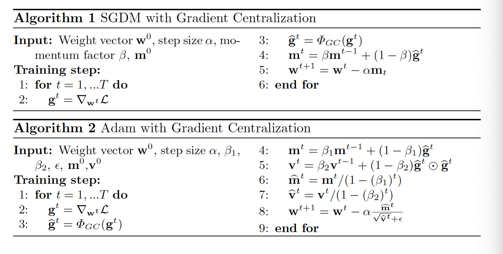

### 4	Properties of GC

​		因为我将在实验结果的章节中看到，GC可以加速训练过程，并提高DNN的泛化性能。本节中，我们进行理论分析以解释为什么GC有用。

#### 4.1	Improving Generalization Performance

​		GC的一个重要优势是，它可以提高DNN的泛化性能。我们从两个方面解释这种优势：权重空间正则化和输出特征空间正则化。

​		**Weight space regularization：**首先解释式（2）中$\mathbf{P}$的物理意义。事实上，容易证明：

$$\mathbf{P}^2 = \mathbf{P} = \mathbf{P}^T, \mathbf{e}^T\mathbf{P\triangledown_{W}\mathcal{L}} = 0.\tag{3}$$

上面的等式表明，$\mathbf{P}$是权重空间中具有法向量$\mathbf{e}$的超平面的投影矩阵，而$\mathbf{P}\triangledown_{\mathbf{W}}\mathcal{L}$是投影梯度。

​		投影梯度的性质在一些前面的工作已得到研究，他们指出投影权重的梯度将权重空间限制在一个超平面或黎曼流形中。相似地，GC的作用也可以视为投影梯度下降。我们在图2中给出具有GC的SGD几何展示。如图2所示，在具有GC的SGD中的第$t$步中，首先通过$\mathbf{e}^T(\mathbf{w} - \mathbf{w}^t) = 0$将梯度投影到超平面，其中$\mathbf{w}^t$是第$t$次迭代中的权重向量，然后沿着投影梯度$-\mathbf{P\triangledown_{w^t}\mathcal{L}}$的方向更新。由于$\mathbf{e}^T(\mathbf{w} - \mathbf{w}^t) = 0$，有$\mathbf{e}^T \mathbf{w}^{t+1} = \mathbf{e}^T \mathbf{w}^t = \cdots =\mathbf{e}^T\mathbf{w}^0$，即$\mathbf{e}^T\mathbf{w}$在训练中是一个常量。数学上，与权重向量$\mathbf{w}$对应的隐目标函数如下：

$$\min_\mathbf{w}\mathbf{\mathcal{L}(w)}, s.t. \mathbf{e}^T(\mathbf{w} - \mathbf{w}^0) = 0 \tag{4}$$

这明显是一个权重向量$\mathbf{w}$上的约束优化问题。它规范了$\mathbf{w}$的解空间，从而减少了覆盖训练数据的可能性。因此，GC可以提高训练的DNN模型的泛化能力，特别是当训练样本有限时。

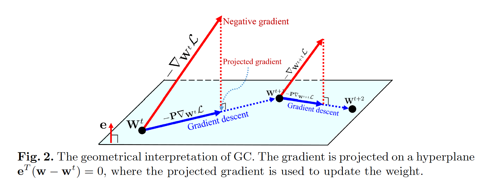

​		值得注意的是，WS[39]为权重优化使用限制$\mathbf{e}^T\mathbf{w} = 0$。重新参数化的权重符合这种约束。然而，这种约束极大限制其实际应用，因为初始化权重可能不满足这种约束。例如，ImageNet上预训练的DNN通常不符合$\mathbf{e}^T\mathbf{w}^0=0$。如果我使用WS来微调这个DNN，预训练模型将会失去其优势。因此，在微调DNN之前，我们不得不利用WS在ImageNet重新训练DNN。这是非常麻烦的。幸运的是，式（4）中的权重约束满足权重的任意初始化，例如ImageNet预训练的初始化，因为它将初始化权重$\mathbf{w}^0$涉及到约束，使得$\mathbf{e}^T(\mathbf{w}^0 - \mathbf{w}^0) = 0$始终为True。这极大扩展了GC的应用。

​		**Output feature space regularization：**对于基于SGD的算法，我们有$\mathbf{w}^{t+1} = \mathbf{w}^t - \alpha^t\mathbf{P}\triangledown_{\mathbf{w}^t}\mathbf{\mathcal{L}}$。可以推出$\mathbf{w}^t = \mathbf{w}^0 - \mathbf{P} \sum_{i=0}^{t-1}\alpha^{(i)}\triangledown_{\mathbf{w}^{(i)}}\mathbf{\mathcal{L}}$。对于任意输入特征向量$\mathbf{x}$，我们有如下定理：

**定理4.1：**假设使用具有$GC$的$SGD$（或$SGDM$）更新权重向量$\mathbf{w}$，对于任意输入特征向量$\mathbf{x}$和$\mathbf{x} + \gamma \mathbf{1}$，我们有

$$(\mathbf{w}^t)^T\mathbf{x} - (\mathbf{w}^t)^T(\mathbf{x} + \gamma \mathbf{1}) = \gamma\mathbf{1}^T\mathbf{w}^0 \tag{5}$$

其中$\mathbf{w}^0$为初始化权重向量，$\gamma$为标量。

​		证明参见附录。定理4.1指出输入特征的常量强度（intensity）变化（即$\gamma \mathbf{1}$）会引起输出激活的变化；有趣的是，这种变化仅与$\gamma$和$\mathbf{1}^T\mathbf{w}^0$有关，而与当前权重向量$\mathbf{w}^t$无关。$\mathbf{1}^T\mathbf{w}^0$是初始权重向量$\mathbf{w}^0$的缩放均值。特别地，如果$\mathbf{w}^0$的均值接近0，那么输出激活对输入特征的强度变化不敏感，并且输出特征空间对于训练样本的变化更加鲁棒。

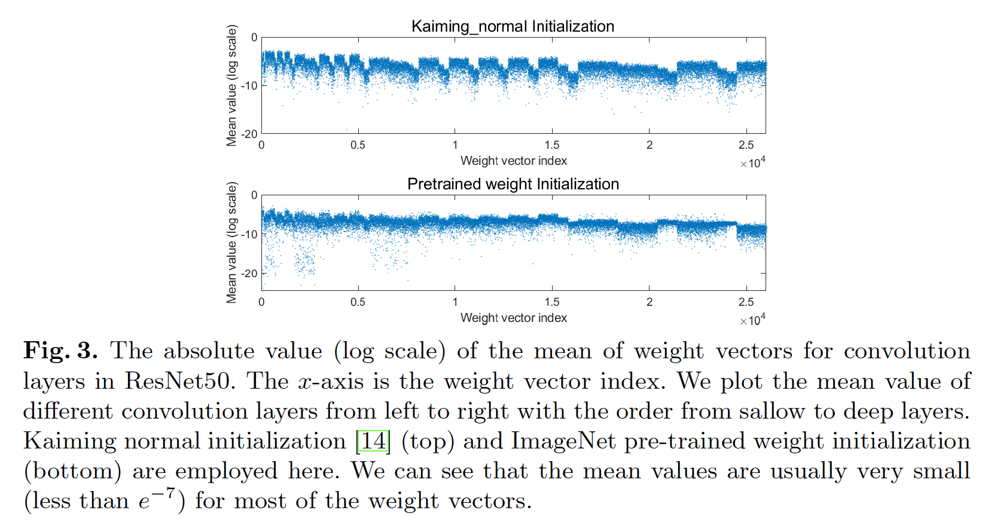

​		确切地说，常用的权重初始化策略初（例如Xavier初始化、Kaiming初始化，甚至ImageNet预训练的权重初始化）始化的$\mathbf{w}^0$的均值非常接近0。图3展示了使用Kaiming正态初始化和ImageNet预训练权重初始化的ResNet50中Conv层的权重向量均值的绝对值（对数尺度）。我们可以看出大多数权重向量的均值非常小，并且接近0（小于$e^{-7}$）。这确保，如果我们利用$GC$训练DNN模型，输出特征对于输入特征的强度变化不敏感。这个属性正则化输出特征空间，并提升DNN训练的泛化性能。

#### 4.2	Accelerating Training Process

**Optimization landscape smoothing：**[54、39]已证明，BN和WS都平滑优化空间。尽管BN和WS分别在激活和权重上运算，但是他们都隐式地约束权重的梯度，使权重梯度更具可预测性和稳定性，从而进行快速训练。具体而言，BN和WS使用梯度magnitude $||\triangledown f(\mathbf{x})||_2$来捕获函数$f(\mathbf{x})$的Lipschitzness。对于损失及其梯度，$f(\mathbf{x})$分别为$\mathcal{L}$和$\mathbf{\triangledown_{w}\mathcal{L}}$，$\mathbf{x}$为$\mathbf{w}$。 $|| \mathbf{\triangledown_{w} \mathcal{L}}||_2$和$||\mathbf{\triangledown_{w}^2 \mathcal{L}}||$（ $\mathbf{\triangledown_w^2}\mathcal{L}$为$\mathbf{w}$的Hessian矩阵 ）的上界在[45、39]中给出一证明BN和WS优化空间平滑的特性。通过比较原始损失函数$\mathbf{\mathcal{L}(w)}$与式（4）中约束损失函数的Lipschitzness，以及他们梯度的Lipschitzness，我们提出的GC可以作出相似的总结。得到如下定理：

**定理4.2：**假设$\mathbf{\triangledown_{w}\mathcal{L}}$ 为权重向量$\mathbf{w}$对应的损失函数$\mathcal{L}$的梯度。利用式（2）中定义的$\Phi_{GC}(\mathbf{\triangledown_w\mathcal{L}})$，我们为损失函数及其梯度分别作出如下总结：

$$\begin{cases}||\Phi_{GC}(\mathbf{\triangledown_w \mathcal{L}})||_2 \le ||\mathbf{\triangledown_w\mathcal{L}}||_2 \\ ||\mathbf{\triangledown_w} \Phi_{GC}(\mathbf{\triangledown_w\mathcal{L}})||_2 \le ||\mathbf{\triangledown_w^2}\mathcal{L}||_2\end{cases} \tag{2}$$

​		定理4.2的证明见附录。定理4.2证明，对于损失函数$\mathcal{L}$及其梯度$\mathbf{\triangledown_w \mathcal{L}}$，式（4）中的约束损失函数通过GC产生的Lipschitzness比原始损失函数更好，因此优化过程变得更加平滑。这意味着GC在加速训练方面有与BN和WS相似的优势。对梯度的良好Lipschitzness意味着训练中使用的梯度更具预测性和行为习惯，因此优化空间可以更平滑，从而可以进行更快、更有效的训练。

​		**Gradient explosion suppression：**GC用于DNN训练的另一个好处是GC可以避免梯度爆炸并使训练更加稳定。这种性质与梯度裁剪相似。梯度太大会导致训练过程中权重突然变化，从而使损失可能剧烈波动且难以收敛。 已经表明，梯度裁剪可以抑制大梯度，因此训练可以更稳定、更快速[36、37]。有两种流行的梯度剪切方法：逐元素值剪切[36、23]和范数裁剪[37、1]，它们分别将阈值应用于逐元素值和梯度范数应用于梯度矩阵。为了研究GC子啊梯度裁剪上的影响，图4中，我们绘制利用GC和没有GC训练的ResNet50的第一个卷积层和全连接层中梯度矩阵的最大值和$L_2$范数。可以看出，通过在训练中使用GC，梯度矩阵的最大值和$L_2$范数都变小。根据定理4.2中我们的结论，GC可以使训练过程更流畅、更快速。

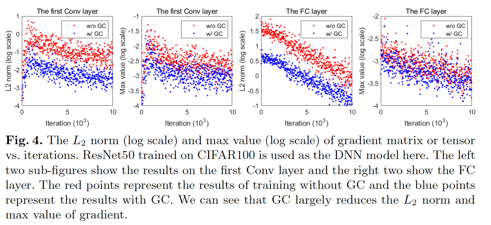

### 5	实验结果

#### 5.1.	实验设置

​		执行大量实验来验证$GC$的有效性。为了使结果尽可能全面和清晰，我们将实验安排如下：

- 从Mini-ImageNet数据集开始以证明GC可以加速DNN训练过程，并提高模型泛化性能。我们还评估GC与BN和WS的结合，以表明GC可以改善DNN优化。
- 接着，使用CIFAR100数据集来评估不同DNN优化器（例如SGDM、Adam、Adagrad）、不同架构（例如ResNet、DenseNet、VGG）以及不同超参数的GC。
- 然后，在ImageNet [43]上进行实验，以证明GC在大规模图像分类中也能很好地工作，并且表明GC还可以与BN以外的归一化方法（例如GN）一起很好地工作。
- 因此，我们对四个经过细化的图像分类数据集（FGVC飞机[34]，斯坦福汽车[25]，斯坦福狗[22]和CUB-200-2011 [50]）进行了实验，以证明GC可以只用用于微调预训练的DNN模型，并改进它们。
- 最后，我们在COCO数据集上进行实验以证明GC还可以在例如目标检测和分割等其他任务上很好的工作。

​         GC可以与卷积层或FC层。在下面的实验中，如果没有特别提到，我们始终将GC同时用于卷积层和全连接层。除5.3节将GC嵌入到不同的DNN优化器进行测试外，其他章节中，将GC嵌入到SGDM进行实验，并且动量设置为0.9。所有实验在Pytorch1.3和Teslat P100上进行。

​		我们想强调的是，我们的GC方法中没有引入任何其他超参数。 将GC嵌入到现有的优化器中只需要一行代码，而其他所有设置保持不变。 我们比较了使用和不使用GC训练的DNN模型的性能，以验证GC的有效性。

#### 5.2	Results on Mini-ImageNet

​		Mini-ImageNet[48]是ImageNet数据集[43]的子集，其最初为few shot学习提出。我们使用[41、20]提供的训练/测试划分。它包含100个类，每个类500正图像用于训练，100张图像用于测试。图像的分辨率为$840 \times 840$。我们将图像调整到$224 \times 224$，其是标准的训练输入尺寸。这里使用的DNN是ResNet50，在4个GPU上以128的皮大小进行训练。其他设置与训练ImageNet相同。我们重复实验10次，并且报告10次运行的平均结果。

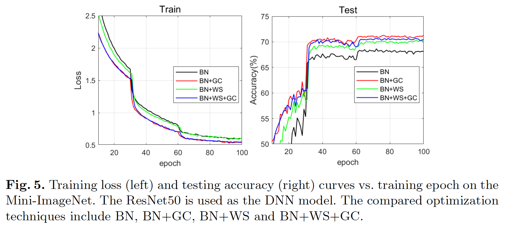

​		BN、WS和GC分别在激活、权重和梯度上运行，它们可以一起用于训练DNN。事实上，通过如BN的方法来规范化特征空间是必要的；否则，模型难以很好的训练。因此，这里，我们评估四种组合：BN、BN+GC、BN+WS和BN+WS+GC。动量为0.9的SGDM作为优化器。图5展示了这四种组合的训练损失和测试准确率。与BN相比，BN + GC的训练损失减少得更快，并且测试准确率增加得更快。对于BN和BN+WS，GC可以进一步加速它们的训练速度。此外，我们可以看出，BN+GC获得最高的测试准确率，证明GC可以加速训练，同时增强泛化性能。

#### 5.3	Experiments on CIFAR100

​		CIFAR100包含100个类的50K张训练图像以及10K测试图像。输入图像的大小为$32 \times 32$。因为图像的分辨率小，在这个数据集上，我们发现将GC用于卷积层足够好。所有DNN模型使用1张GPU及batchsize 8 训练200个epoch。重复实验10次，并报告$\mbox{mean } \pm \mbox{ std}$格式的结果。

​		**Different networks：**我们在不同的DNN架构上测试GC，DNN架构包括ResNet18（R18）、ResNet101（R101）、ResNeXt29 4x64d（X29）、VGG11（V11）和DenseNet121（D121）。SGDM用作网络优化器。权重衰减设置为0.0005。初始学习率设置为0.1，没60个周期乘以0.1。表1给出了这些DNN的测试准确率。可以看出，通过GC，所有DNN的性能得到提升，这验证了GC是不同DNN架构的通用优化技术。

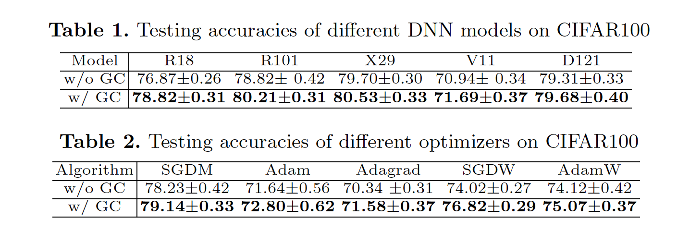

​		**Different optimizers：**我们将GC嵌入到不同的DNN优化器（包括SGDM、Adagrad、Adam、SGDW和AdamW）以测试它们的性能。SGDW和AdamW优化器直接直接在权重上应用权重衰减，而不是使用$L_2$权重衰减正则化。SGDW和AdamW的权重衰减设置为0.001，其他优化器设置为0.0005。SGDM/SGDW、Adagrad、Adam/AdamW的初始学习率分别设置为0.1、0.01、0.001，并且学习率每60个周期乘以0.1。其他超参数使用Pytorch的默认设置。这里使用的DNN模型是ResNet50。表2给出了测试准确率。可以看出GC提高所有五个优化器的泛化性能。还发现基于自适应学习率的算法（Adagrad和Adam）在CIFAR100上的泛化性能差，而GC可以将它们的性能提高$>0.9%$。

​		**Different hyper-parameter settings：为了说明GC可以使用不同的超参数实现持续的改进，我们在CIFAR100数据集上展示了具有不同权重衰减和学习率设置的GC结果。ResNet用作backbone。表3展示不同权重衰减（包括$0、1e^{-4}、2e^{-4}、5e^{-4}\mbox{和}1e^{-3}$）下的测试准确率。优化器是学习率为0.1的SGDM。可以看出权重衰减的性能可通过GC得到一致提高。表4展示了SGDM和Adam在不同学习率小的测试准确率。对于SGDM，学习率为0.05、0.1和0.2，对于AdaM，学习率设置为0.0005、0.001和0.0015。权重衰减设置为$5e^{-4}$。其他设置与原稿中的设置相同。 我们可以看到GC一直在提高性能。

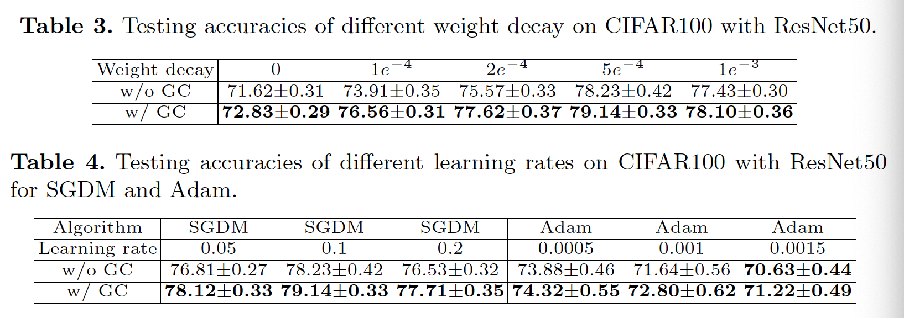

#### 5.4	Results on ImageNet

​		我们在大规模的ImageNet数据集上评估GC，ImageNet包含100个类的1.28M训练图像和50K验证图像。我们使用常用的训练设置，并在卷积层上将GC嵌入SGDM。ResNet50和ResNet101用作骨干网络。对于前者，使用过4张GPU、每张GPU的batch size为64；对于后者，使用8张GPU，每张GPU的batch size为32。

​		这里，我们评估4个模型：具有BN的ResNet50（R50BN）、具有GN的ResNet50（R50GN）、具有BN的ResNet101（R101BN）和具有GN的ResNet101（R101GN）。表5显示了使用和不使用GC训练的这四个DNN模型的最终Top-1错误。在ImageNet上，我们可以看出GC可以将性能提高0.5%到1.2%。图6绘制了ResNet50的训练和验证错误率曲线（GN用作特征归一化）。我们可以看出GC极大加速GN的训练。

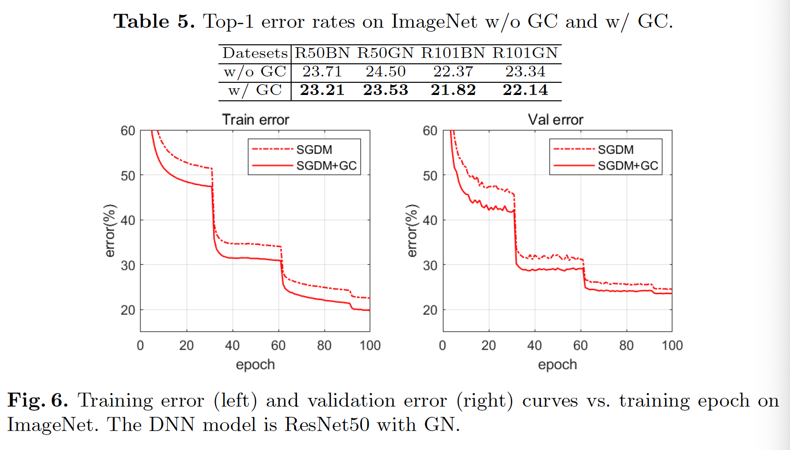

#### 5.5	Results on Fine-grained Image Classification

​		为了证明GC还可以与预训练模型一起工作，我们在四种具有挑战性的细粒度图像分类数据集（包括FGVC Aircraft、Stanford Cars、Stanford Dogs和CUB200-2011）上进行实验。这四个数据集的详细统计量如表6。我们使用Pytorch官方提供的预训练ResNet50作为这四个数据集的基线DNN。原始图像调整到$512 \times 512$，训练和测试时都从中心裁剪$448 \times 448$的区域作为输入。模型在ImageNet上预训练。我们在4张GPU上，以256的batch size，使用动量为0.9的SGDM微调ResNet50 100个周期。最后的FC层的初始学习率设置为0.1，所有预训练的Conv层的初始学习率设置为0.01。在第50和80个周期分别乘以0.1。注意，我们的目标是验证GC的有效性，而不是推进最新的结果，因此，我们仅使用简单的训练策略。我们重复10次实验，并报告$\mbox{mean }\pm \mbox{ std} $格式的结果。

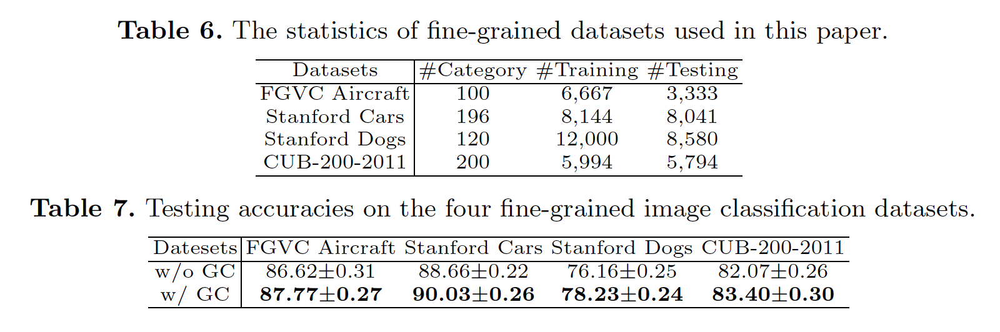

​		图7给出四种细粒度图像分类数据集上前40个周期中，SGDM和SGDM+GC的训练和测试准确率。表7给出了最终的测试准确率。

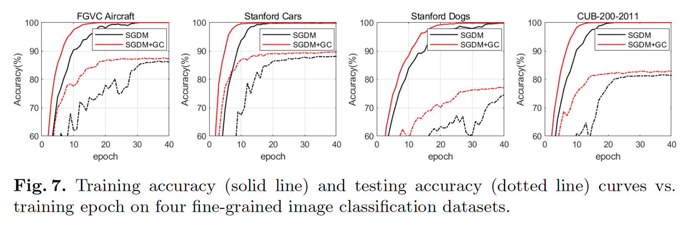

#### 5.6	Object Detection and Segmentation

​		最后，我们在目标检测和分割任务上评估GC，从而证明GC还可以用于除图像分类外的其他任务。模型在ImageNet上预训练。由于高分辨率的输入图像，目标检测和分割的训练批大小通常很小（例如1或2）。因此，通常会冻结BN层，在训练过程中无法享受BN带来的好处。一种替代方案是使用GN。墨西哥在COCO $train2017$ 数据集（118K图像）上训练，在COCO $val2017$数据集（40K图像）。COCO数据可以用于多个任务，包括图像分类、目标检测、语义分割和实例分割。

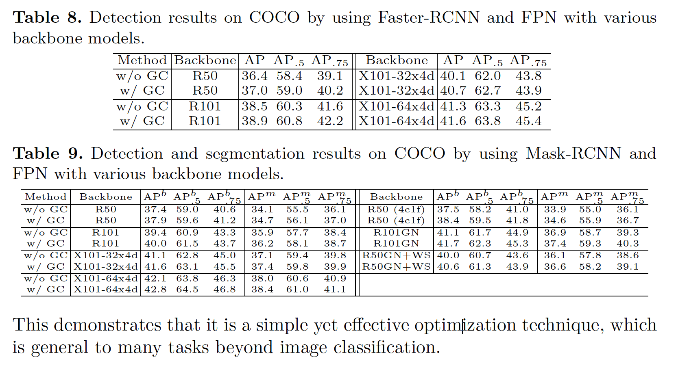

### 附录

#### A1.	定理4.1的证明

**定理4.1：**假设使用具有$GC$的$SGD$（或$SGDM$）更新权重向量$\mathbf{w}$，对于任意输入特征向量$\mathbf{x}$和$\mathbf{x} + \gamma \mathbf{1}$，我们有

$$(\mathbf{w}^t)^T\mathbf{x} - (\mathbf{w}^t)^T(\mathbf{x} + \gamma \mathbf{1}) = \gamma\mathbf{1}^T\mathbf{w}^0 \tag{5}$$

其中$\mathbf{w}^0$为初始化权重向量，$\gamma$为标量。

*证明：*首先证明$\mathbf{P}$的如下简单性质：

$$\mathbf{1}^T \mathbf{P} = \mathbf{1}^T(\mathbf{I} - \mathbf{ee}^T) = \mathbf{1}^T - \frac{1}{M}\mathbf{1}^T\mathbf{11}^T = \mathbf{1}^T, \tag{}$$

其中$M$为$\mathbf{e}$的维度。

​		对于具有$GC$的每个SGD步骤，我们有：

$$\mathbf{w}^{t+1} = \mathbf{w}^t - \alpha^t \mathbf{P} \triangledown_{\mathbf{w}^t}\mathcal{L}. \tag{}$$

可以轻松地推导出：

$$\mathbf{w}^t = \mathbf{w}^0 - \mathbf{P} \sum_{i=0}^{t-1} \alpha^{(i)}\triangledown_{\mathbf{w}^{(i)}}\mathcal{L}, \tag{}$$

其中$t$是迭代次数。然后，对于$\mathbf{x}$和$\mathbf{x} + \gamma\mathbf{1}$的输出激活，有

$$\begin{align}(\mathbf{w}^t)^T \mathbf{x} - (\mathbf{w}^t)^T(\mathbf{x} + \gamma\mathbf{1}) &=\gamma\mathbf{1}^T\mathbf{w}^t \\ &=\gamma\mathbf{1}^T(\mathbf{w}^0 - \mathbf{P} \sum_{i=0}^{t-1} \alpha^{(i)}\triangledown_{\mathbf{w}^{(i)}}\mathcal{L}) \\ &=\gamma \mathbf{1}^T\mathbf{w}^0 - \gamma \mathbf{1}^T\mathbf{P}\sum_{i=0}^{t-1}\alpha^{(i)}\triangledown_{\mathbf{w}^{(i)}}\mathcal{L} \\ &= \gamma\mathbf{1}^T\mathbf{w}^0.\end{align} \tag{7}$$

因此，

$$(\mathbf{w}^t)^T\mathbf{x} - (\mathbf{w}^t)^T(\mathbf{x} + \gamma\mathbf{1}) = \gamma\mathbf{1}^T\mathbf{w}^0. \tag{8}$$

​		对于具有动量的SGD，结论是相同的，因为，我们可以得到式（7）中的第三行中的$\gamma \mathbf{1}^T\mathbf{P}\sum_{i=0}^{t-1}\alpha^{(i)}\mathbf{m}^i$，其中$\mathbf{m}^i$式第$i$次迭代的动量，而并且该项也等于0。

​		证明结束。

#### A2. 定理4.2的证明

**定理4.2：**假设$\mathbf{\triangledown_{w}\mathcal{L}}$ 为权重向量$\mathbf{w}$对应的损失函数$\mathcal{L}$的梯度。利用式（2）中定义的$\Phi_{GC}(\mathbf{\triangledown_w\mathcal{L}})$，我们为损失函数及其梯度分别作出如下总结：

$$\begin{cases}||\Phi_{GC}(\mathbf{\triangledown_w \mathcal{L}})||_2 \le ||\mathbf{\triangledown_w\mathcal{L}}||_2 \\ ||\mathbf{\triangledown_w} \Phi_{GC}(\mathbf{\triangledown_w\mathcal{L}})||_2 \le ||\mathbf{\triangledown_w^2}\mathcal{L}||_2\end{cases} \tag{2}$$

证明：因为$\mathbf{e}$是单位向量，有$\mathbf{e}^T\mathbf{e}=1$。可以证明：

$$\begin{align}\mathbf{P}^T\mathbf{P} &= (I - \mathbf{ee}^T)^T(I - \mathbf{ee}^T) \\&= \mathbf{I} - 2\mathbf{ee}^T + \mathbf{ee}^T\mathbf{ee}^T \\ &=\mathbf{I} - \mathbf{ee}^T \\&=\mathbf{P}. \tag{9}\end{align}$$

然后，对于$\Phi_{GC}(\mathbf{\triangledown_{w}\mathcal{L}})$，有：

$$\begin{align}||\Phi_{GC}(\triangledown_{\mathbf{w}}\mathcal{L})||_2^2 &=\Phi_{GC}(\triangledown_{\mathbf{w}}\mathcal{L})^T\Phi_{GC}(\triangledown_{\mathbf{w}}\mathcal{L}) \\& =(\mathbf{P}\triangledown_{\mathbf{w}}\mathcal{L})^T(\mathbf{P}\triangledown_{\mathbf{w}}\mathcal{L})\\&=\triangledown_{\mathbf{w}}\mathcal{L}^T\mathbf{P}^T\mathbf{P}\triangledown_{\mathbf{w}}\mathcal{L} \\ &=\triangledown_{\mathbf{w}}\mathcal{L}^T\mathbf{P}\triangledown_{\mathbf{w}}\mathcal{L} \\&=\triangledown_{\mathbf{w}}\mathcal{L}^T(\mathbf{I} - \mathbf{ee}^T)\triangledown_{\mathbf{w}}\mathcal{L} \\ &=\triangledown_{\mathbf{w}}\mathcal{L}^T\triangledown_{\mathbf{w}}\mathcal{L}^T - \triangledown_{\mathbf{w}}\mathcal{L}^T\mathbf{ee}^T\triangledown_{\mathbf{w}}\mathcal{L} \\&= ||\triangledown_{\mathbf{2}}\mathcal{L}||_2^2 - ||\mathbf{e}^T\triangledown_{\mathbf{w}}\mathcal{L}||_2^2 \\ &\le||\triangledown_{\mathbf{w}}\mathcal{L}||_2^2.\end{align}\tag{10}$$

对于$\triangledown_{\mathbf{w}}\Phi_{GC}(\triangledown_{\mathbf{w}}\mathcal{L})$，我们还有：

$$\begin{align}||\triangledown\Phi_{GC}(\triangledown_{\mathbf{w}}\mathcal{L})||_2^2 &=||\mathbf{P}\triangledown_{\mathbf{w}}^2\mathcal{L}||_2^2\\&=\triangledown_{\mathbf{w}}^2\mathcal{L}^T\mathbf{P}^T\mathbf{P}\triangledown_{\mathbf{w}}^2\mathcal{L} \\&=\triangledown_{\mathbf{w}}^2\mathcal{L}^T\mathbf{P}\triangledown_{\mathbf{w}}^2\mathcal{L} \\&=||\triangledown_{\mathbf{w}}^2\mathcal{L}||_2^2 - ||\mathbf{e}^T\triangledown_{\mathbf{w}}^2\mathcal{L}||_2^2 \\&\le||\triangledown_{\mathbf{w}}^2\mathcal{L}||_2^2.\end{align}\tag{11}$$

证毕。