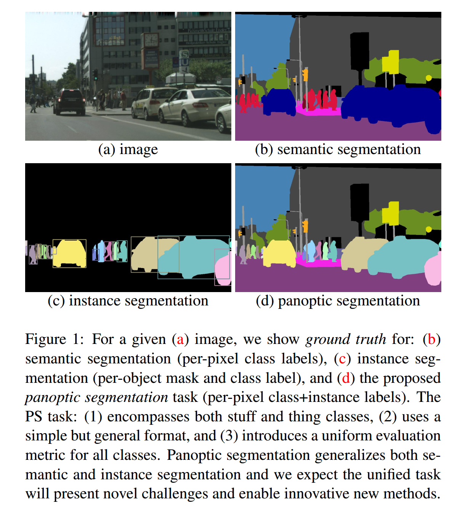
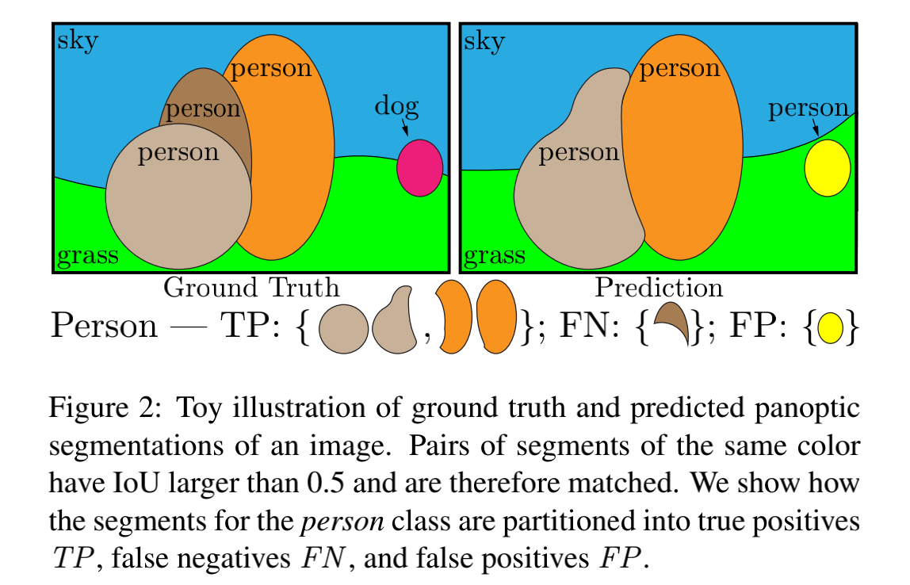
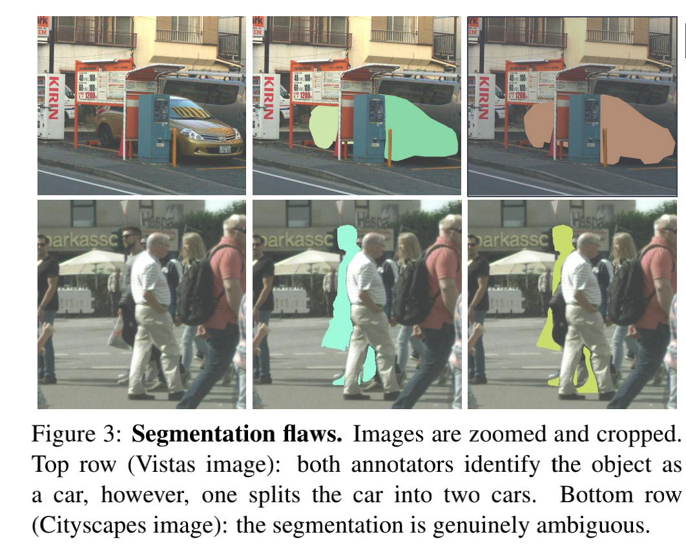
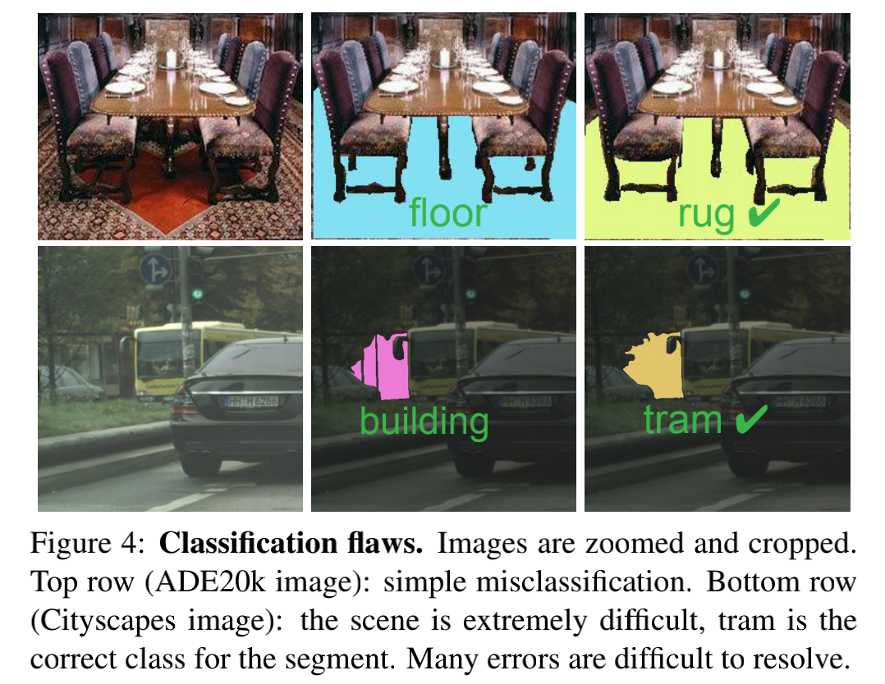
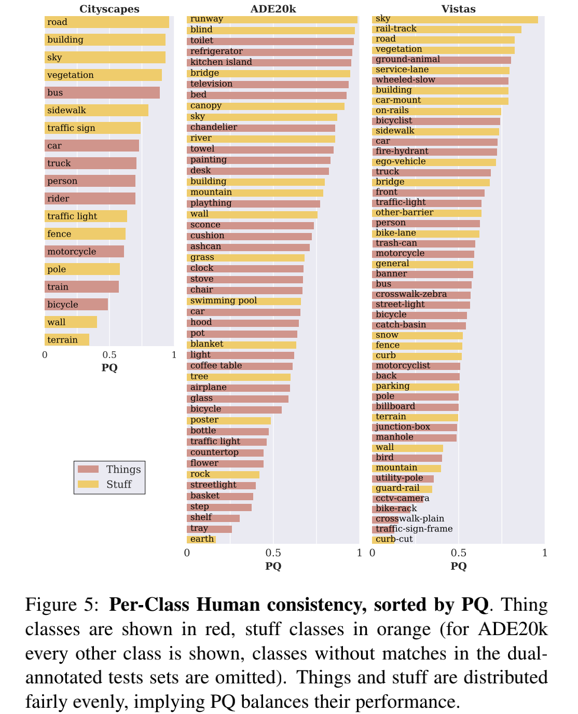
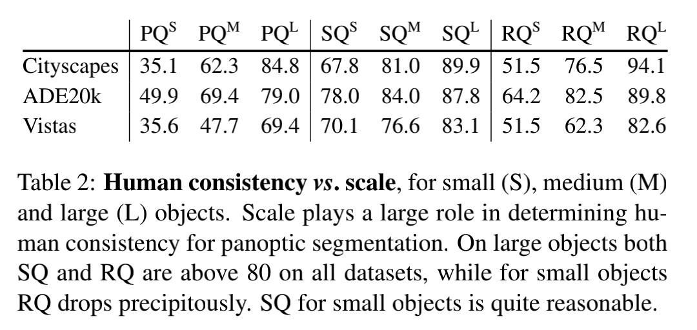
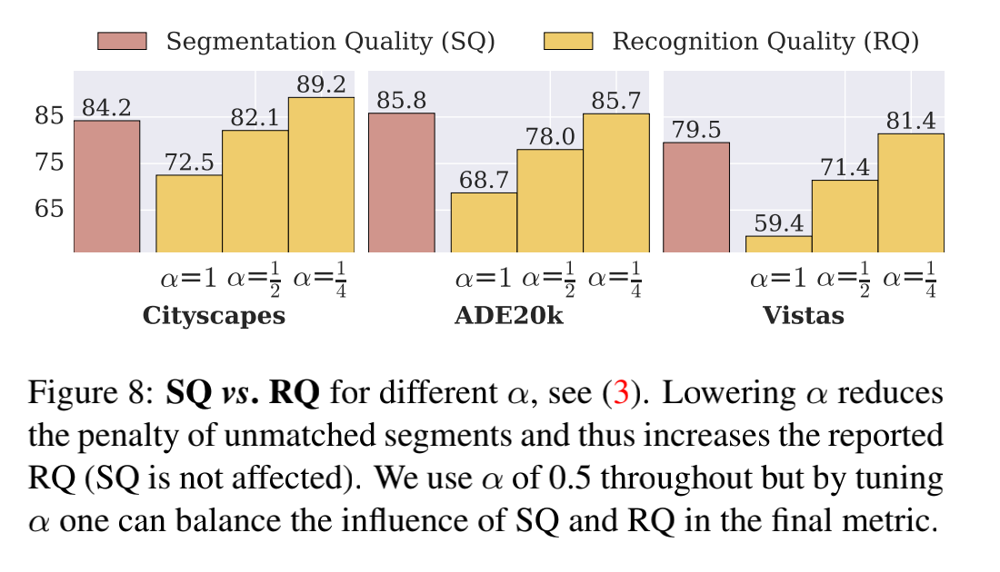
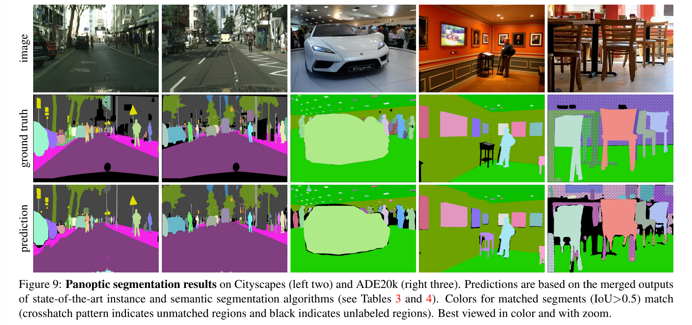

### Panoptic Segmentation

#### 摘要

​		我们提出并研究我们称为全景分割（Panoptic Segmentation: PS）的任务。全景分割将语义分割（为每个像素分配类标签）和实例分割（检测和分割每个目标实例）统一起来。所提出任务需要生成丰富且完整的连贯场景分割，这是迈向现实世界视觉系统的重要一步。尽管计算机视觉的早期工作解决了相关的图像/场景解析任务，但是由于缺乏适当的度量标准或相关的识别挑战，这些任务目前并不流行。为了解决这个问题，我们提出了一种新颖的全景质量（PQ）指标，该指标以可解释和统一的方式捕获了所有类别（东西）的性能。使用所提出的指标，我们在三个现有的数据集上对PS的人类和机器性能进行了严格的研究，揭示了有关任务的有趣见解。 我们的工作目的是在更统一的图像分割视图中激发社区的兴趣。

#### 1. 引言

​		在计算机视觉的早期，事物（things）-诸如人、动物、工具之类的可数对象-引起了人们的关注。质疑这种趋势是否明智，Adelson [1]提出了研究识别事物（stuff）的系统的重要性，这些事物是具有相似纹理或材料的无定形区域，例如草、天空、道路。things与stuff之间的这种分离一直持续到今天，这体现在视觉识别任务的划分以及为things与stuff任务开发的专用算法中。

​		研究资料通常被定义为一项任务，即语义分割，见图1b。由于stuff是无定形和不可数的，该任务简单地定义为激将类标签分配给图像中的每个像素（注意语义分割将thing类视为stuff）。相比之下，研究thing通常被定义为目标检测或实例分割的任务，目的是检测每个目标并分别用边界框或分割掩膜对其进行描绘，请参见图1c。虽然看似相关，但是这两个视觉识别任务的数据集、详细信息和指标却大不相同。

​		语义分割和实例分割之间的分裂导致了用于这些任务的方法中的平行裂痕。Stuff分类器通常建立在具有扩张[52、5]的全卷积网络[30]上，而目标检测器通常使用目标提议[15]并基于区域[37、14]。在过去的十年中，这些任务的总体算法进展令人难以置信，但是，孤立地专注于这些任务可能会忽略一些重要的事情。

​		一个自然的问题浮出水面：**thing和stuff之间是否存在和解？**并且产生丰富且连贯的场景分割的统一视觉系统最有效的设计是什么？考虑到它们与诸如自动驾驶或增强现实之类的现实应用相关性，这些问题尤其重要。

​		有趣的是，虽然语义和实例分割主导当前的工作，在深度学习之前，人们对使用各种名称描述的联合任务感兴趣，例如场景解析[42]、图像解析[43]或整体场景理解[51]。尽管具有实际意义，但可能由于缺乏适当的度量标准或识别挑战而导致该一般方向目前不受欢迎。

​		在我们的工作中，我们的目标是复兴这一方向。我们提出一项任务：（1）包含stuff和thing类，（2）使用简单而通用输出形式，以及（3）引入统一的评估指标。为了清楚地与先前的工作消除歧义，我们将产生的任务称为全景分割（PS）。**“全景”的定义是“包括在一个视图中可见的所有内容”，在我们的场景中，全景是指统一的全局分割视图。**

​		我们用于全景分割的**任务形式（task format）**很简单：图像中的每个像素必须分配一个语义标签和一个实例id。相同标签和id的像素属于同一目标；对于stuff标签，忽略实例id。

​		全景分割的基本点是用于评估的任务指标。尽管许多现有的度量标准都可以用于语义或实例分割，但是这些度量标准分别最适合于stuff或thing，但不适用于两者。我们认为使用不相交的度量标准是社区通常独立研究stuff和thing分割的主要原因之一。为了解决这个问题，我们在第4节中引入全景质量（panoptic quality：PQ）指标。PQ简单而信息丰富，最重要的是，PQ可用于以统一的方式衡量shuff和thing的性能。我们希望，所提出的联合指标将有助于更广泛地采用联合任务。

​		全景分割任务既包含语义分割又包括实例分割，但引入了新的算法挑战。与语义分割不同，需要区别单个目标实例；这对全卷积网络构成了挑战。与实例分割不同，目标分割一定是非重叠的（non-overlapping）； 这给在每个目标上独立运行的基于区域的方法提出了挑战。生成可解决stuff和thing之间不一致的连贯图像分割是迈向现实应用的重要一步。

​		由于PS的ground truth和算法必须采用相同的形式，因此我们可以对全景分割中的人类一致性进行详细的研究。这使我们可以更详细地了解PQ指标，包括识别与分割以及stuff与thing性能的详细分割。这很重要，因为它将使我们能够监视PS的各种数据集上的性能饱和。最后，我们对PS的机器性能进行了初步研究。为此，我们定义了一种简单且可能不太理想的启发式方法，该方法通过一系列合并其输出的后处理步骤（实质上是一种非最大抑制的复杂形式），将两个独立系统的输出进行语义和实例分割 。我们的启发式方法为PS确立了基线，并让我们深入了解了PS所带来的主要算法挑战。

​		我们在具有stuff和thing标注的三个流行数据集上掩膜人类和机器性能，数据集包括Cityscapes、ADE20K和Mapillary Vistas。对于每个这些数据集，我们直接从挑战组织者那里获得了最新方法的结果。将来，我们将把分析范围扩展到COCO [25]，其中将对这些stuff进行注释[4]。我们在这些数据集上的结果一起为研究人和机器在全景分割方面的性能奠定了坚实的基础。

#### 3. Panoptic Segmentation Format

**Task format.**  全景分割的格式易于定义。给定由$\mathcal{L}:=\{0,\cdots,L-1\}$编码的$L$个语义类的预定集合，该任务需要全景分割算法将图像中的每个像素$i$映射到$(l_i,z_i)\in\mathcal{L}\times \Bbb{N}$，其中$l_i$表示像素$i$的语义类，而$z_i$表示其实例id。相同类别的$z_i$ 的组像素分成不同的分割。ground truth标注的编码方式相同。可以为模糊或不合格的像素分配特殊的空白标签； 即，并非所有像素都必须具有语义标签。

**Stuff and thing labels.**  语义标签集包含子集$\mathcal{L}^{St}$和$\mathcal{L}^{Th}$，使得$\mathcal{L}=\mathcal{L}^{St}\cup\mathcal{L}^{Th}$和$\mathcal{L}^{St}\cap\mathcal{L}^{Th}=\emptyset$。这些子集分别对应_stuff_和_thing_。当利用$l_i\in\mathcal{L}^{St}$标记像素，其相应的实例id $z_i$是不相关的。即，对于stuff类，所有像素属于相同的实例（例如同一片天空）。否则，所有具有相同$(l_i,z_i)$分配的像素（其中$l_i\in\mathcal{L}^{Th}$）属于相同实例，相反，属于单一实例的所有像素一定有相同的$(l_i,z_i)$。像以前的数据集中一样，选择哪些类是stuff还是thing是由数据集创建者设计的选择。

**Relationship to semantic segmentation.**  PS任务形式是语义分割形式的严格概括。确切的说是，两个任务都需要将图像中的每个像素分配一个语义标签。如果ground truth没有指定实例，或者所有类都是stuff，然后任务的形式相同（尽管任务指标不同）。此外，包含thing类（每个图像可能具有多个实例）可以区分任务。

**Relationship to instance segmentation.**  实例分割任务需要一个方法来分割图像中的每个目标实例。然而，实例分割允许重叠的分割，而全景分割任务仅准许将一个语义标签和一个实例id分配给每个像素。因此，对于PS，通过构造不可能有任何重叠。接下来，我们证明这种差异在性能评估上起着重要作用。

**Confidence scores.**  与语义分割相似，但是与实例分割不同，**我们不需要与PS的每个分割相关的置信度得分**。这使全景任务相对于人和机器是对称的：**两者都必须生成相同类型的图像注释**。这也使评估PS与人类一致性变得简单。这与实例分割相反，实例分割不容易接受此类研究，因为人类注释者没有提供明确的置信度得分（尽管可以测量单个精度/召回率）。我们注意到，置信度得分为下游系统提供了更多信息，这可能是有用的，因此，仍然可能需要PS算法在某些设置下生成置信度得分。

#### 4. Panoptic Segmentation Metric

​		在本节中，我们介绍了一种用于全景分割的新指标。首先，我们注意到现有度量专用于语义或实例分割，不能用于评估涉及stuff和thing类的联合任务。以前有关联合分割的工作通过使用独立的指标（例如[51、41、42、40]）评估stuff和thing的性能来解决这个问题。然而，这给算法开发带来挑战，使得比较更困难，并妨碍交流。我们希望为stuff和thing引入一种统一的指标来鼓励统一任务的研究。

​		在进行进一步的详细介绍之前，我们首先要确定以下适合于PS的度量标准的需求：

​		**Completeness.**  这种指标应当以一种统一的方式看待stuff和thing，从而捕获该任务的所有方面。

​		**Interpretability.**  我们寻求一种具有可识别含义的度量标准，以促进沟通和理解。

​		**Simplicity.**  此外，这种指标应当很简单的定义和实现。这样可以提高透明度，并易于重新实现。与此相关的是，该度量应该有效地计算以实现快速评估。

​		受这些原则的引导，我们提出新的_panoptic quality（PQ）_指标。PQ衡量预测的与ground truth相关的全景分割的质量。它包含两个步骤：（1）分割匹配（segment matching）和（2）给定匹配项的PQ计算。

##### 4.1. Segment Matching

​		我们指定仅当预测分割和ground-truth分割的交并比（IoU）严格大于0.5时才能匹配。这项要求与全景分割的不重叠属性一起提供了_唯一的匹配_：每个ground-truth最多可与一个预测的分割匹配。

_定理1. 给定一幅图像的预测到的和ground-truth的全景分割，每个ground-truth分割最多可以有一个相应的预测分割，其IoU严格大于0.5，反之亦然。_

_证明._ 令$g$为ground truth分割，而$p_1$和$p_2$为两个预测分割。根据定义，$p_1\cap p_2 =\emptyset$（它们没有重叠）。由于$|p_i\cup g| \ge |g|$，有

$$\mbox{IoU}(p_i,g)=\frac{|p_i \cap g|}{|p_i \cup g|}\le \frac{|p_i \cap g|}{|g|} \mbox{ for } i \in \{1,2\}.$$

在$i$上求和，由于$|p_1\cap g| + |p_2 \cap g|$ 以及事实$p_1 \cap p_2 = \emptyset$，有

$$\mbox{IoU}(p_1,g)+\mbox{IoU}(p_2,g)\le\frac{|p_1 \cap g| + |p_2 \cap g|}{|g|} \le 1.$$

因此，如果$\mbox{IoU}(p_1,g)>0.5$，那么$\mbox{IoU}(p_2,g)$不得不小于0.5。翻转$p$和$g$可以用于证明仅有一个ground-truth分割与预测的分割的IoU严格大于0.5。$\Box$

​		匹配必须具有大于0.5的IoU，这又产生了唯一的匹配定理，实现了我们所需的两个属性。第一，它既_简单又高效_，因为对应关系是唯一且容易获得的。第二，它是_可解释的_并且易于理解（并且不需要解决复杂的匹配问题，而这些指标通常是这种情况[13，50]）。

​		注意，由于唯一性，对于$\mbox{IoU}>0.5$，任何合理的匹配策略（包括贪心和最优）都会产生相同的匹配。对于更小的IoU，需要其他匹配技术，然而，本文中我们证明更低的阈值时不必要的，因为$IoU\le 0.5$的匹配在实践中很少的。

##### 4.2. PQ Computation

​		我们分别计算每个类的PQ，然后平均计算每个类的PQ。这使得PQ对类不平衡不敏感。对于每个类，唯一匹配将预测的和ground-truth的分割分为三组：真阳性（TP）、假阳性（FP）和假阴性（FN），代表匹配的分割对，不匹配的预测分割和不匹配的ground-truth分割。如图2所示。给定这三个访民啊，PQ定义为：

$$\mbox{PQ}=\frac{\sum_{(p,g)\in TP}\mbox{IoU}(p,g)}{|TP|+\frac{1}{2}|FP|+\frac{1}{2}|FN|}.\tag{1}$$

PQ很直观：$\frac{1}{|TP|}\sum_{(p,g)\in TP}\mbox{IoU}(p,g)$仅是匹配的分割的平均IoU，而$\frac{1}{2}|FP|+\frac{1}{2}|FN|$加在分母上时为了惩罚没有匹配上的分割。请注意，无论其区域大小，所有部分都具有同等的重要性。此外，如果将PQ乘以并除以TP集的大小，则PQ可以看作是分割质量（SQ）项和识别质量（RQ）项的乘积：

$$\mbox{PQ}=\underbrace{\frac{\sum_{(p,g)\in TP}\mbox{IoU}(p,g)}{|TP|}}_{\mbox{segmentation quality(SQ)}} \times \underbrace{\frac{|TP|}{|TP|+\frac{1}{2}|FP|+\frac{1}{2}|FN|}}_{\mbox{recognition quality(RQ)}}.\tag{2}$$

写为这种方式，RQ与$F_1$得分相似，$F_1$在检测设置[33]中广泛用于质量估计。SQ只是匹配分割的平均IoU。我们发现$PQ = SQ \times RQ$的分解为分析提供了灵感。但是，我们注意到，这两个值不是独立的，因为SQ仅在匹配的分割上测量。

​		PQ的定义获得我们的期望。它使用一种简单而可解释的形式，以一种统一的方式衡量了所有类的性能。最后，我们讨论如何处理void区域和实例分组[25]。

​		**Void labels.**  ground-truth中，void标签有两个来运：（a）类像素之外和（b）模棱两可或未知的像素。因为我们通常不能区分这两种情况，所以我们不会评估void像素。具体而言：（1）匹配期间，预测分割中在ground-truth中被标记为void的所有像素均从预测中移除，并且不会影响IoU计算，（2）匹配之后，包含超过匹配阈值的一小部分void像素的不匹配预测分割将被删除，并且不算作假阳性。最后，输出可能也包含void像素；这些不会影响评估。

​		**Group labels.** 常见的标注实践[6，25]是，如果每个实例的精确描述都很困难，则在同一语义类的相邻实例上使用组标签代替实例ID。对于计算PQ：（1）匹配期间，不使用分组区域，（2）匹配之后，包含超过匹配阈值的来自一组相同类的小部分像素的为匹配的预测分割被移除，并且不算作假阳性。

##### 4.3. Comparison to Existing Metrics

​		**Semantic segmentation metrics.** 语义分割常用的指标包括像素准确率、平均准确率和IoU。这些度量标准仅基于输出/标签的计算，并完全忽略了目标级标签。例如，IoU为正确预测的像素和预测或ground-truth中全部像素之间的比例。因为这些度量标准忽略实例标签，所以它们不能很好地满足评估thing类。最后，注意语义分割的IoU与我们的分割质量（SQ）不同，其计算匹配到的分割上的平均IoU。

​		**Instance segmentation metrics.**  实例分割的标准指标是Average Precision（AP）。AP要求每个目标分割有一个置信度得分以估计精确率/召回率曲线。注意，尽管置信度分数对于目标检测来说是很自然的，但它们并不用于语义分割。因此，AP不能用于衡量语义分割或PS的输出（另请参见§3中对置信度的讨论）。

​		**Panoptic quality.**  PQ以一种统一的方式对待所有类（stuff和things）。我们注意到，尽管将PQ分解为SQ和RQ有助于解释结果，但PQ并不是语义和实例分割指标的组合。而针对每个类别（stuff和things）计算SQ和RQ，并分别测量分割和识别质量。因此，PQ统一了所有类别的评估。我们通过对第7节中的PQ进行严格的实验评估来支持这一主张，包括分别与IoU和AP进行语义和实例分割的比较。

#### 5. Panoptic Segmentation Datasets

​		**Cityscapes** 包含在城市环境中具有以自我为中心的驾驶场景的5000张图像（2975张训练图像、500张验证图像和1525张测试图像）。它具有19个类的密集像素标注（覆盖率达97％），其中8个具有实例级分割。

​		**AED20k** 包含超过25k图像（20k火车，2k val，3k测试），并使用开放词典标签集进行了密集标记。对于2017 Places Challenges，选择覆盖所有像素89%的100个thing和50个stuff类。我们在研究中使用这个封闭的词汇。

​		**Mapillary Vistas** 有25k的街景图像（18k火车，2k val，5k测试），且分辨率范围很广。数据集的“研究版”带有28种stuff和37种things的密集注释（98％像素覆盖率）。

#### 6. Human Consistency Study

​		全景分割的一个优势是能够衡量人类标注的一致性。除了这本身是有趣的目的之外，人类一致性研究还使我们能够详细了解任务，包括我们提出的度量标准的细节以及人类一致性沿各个轴的细分。这使我们能够洞悉任务所带来的内在挑战，而不会因算法选择而偏颇我们的分析。此外，人类研究有助于提高地面机器的性能（在§7中讨论），并使我们能够校准对任务的理解。

**Human annotations.**  为了实现人类一致性分析，数据集创建者慷慨地为我们提供了30张用于城市场景的双标注图像，64张用于ADE20k的图像和46张用于Vistas的图像。对于Cityscapes和Vistas，图像有不同的标准者独立标注。ADE20k由一位训练有素的标注者标注，该标注者以6个月的间隔标记同一组图像。为了衡量人类标注者的全景质量（PQ），我们将每个图像的一个标注视为ground truth，将另一个标注作为预测。注意，PQ相对ground truth和预测是对成的，因此顺序不重要。

**Human consistency.**  首先，表1呈现了在每个数据集上人类的一致性，以及将PQ分解为分割质量（SQ）和识别质量（RQ）的过程。如期望的，人类在这个任务上并不完美，这与[6、55、35]中标注质量的研究一致。人类分割和分类误差的可视化结果分别如图3和图4所示。

​		我们注意到，表1建立了每个数据集上注释者承认的度量，而不是人类一致性的上限。我们进一步强调，数字在数据集之间不具有可比性，不应用于评估数据集质量。类的数量、标注像素的百分比以及场景复杂性在数据集中会有所不同，每一个都会显着影响标注的难度。

**Stuff vs. things.**  PS需要stuff和thing的分割。表1中，我们还展示了$\mbox{PQ}^{\mbox{St}}$和$\mbox{PQ}^{\mbox{Th}}$，它们是stuff类和thing类上PQ的平均。对于Cityscapes和ADE20K，人类在stuff和thing接近，而在Vistas上，差距比较大。综上，这意味着stuff和thing有相同的难度，尽管thing类要难一些。表5中，我们在每个数据集上展示了每个类的PQ，并根据PQ排序。观察到stuff和thing类的分布相当均匀。这意味着所提出的度量标准达到了良好的平衡，并且确实可以成功地统一stuff和thing分割任务，而不会占据误差。

**Small vs.large objects.**  为了分析PQ如何随目标大小变化，我们考虑了每个数据集中最小的25％、中间的50％和最大的25％的目标，将数据集划分为小（S）、中（M）和大（L）目标。在表2中，我们看到对于大型目标，所有数据集的人类一致性都非常好。对于小型目标，RQ明显下降，这意味着人类标注者同很难找出小型目标。然而，如果找到小型目标，它会被分割得相对较好。

**IoU threshold.**  通过执行大于0.5 IoU的重叠，定理1赋予了我们唯一的匹配。然而，0.5的IoU阈值是否合理？一种替代策略是不使用阈值，并通过解决最大加权二分匹配问题来执行匹配[47]。优化将返回匹配项，该匹配项使匹配分割的IoU之和最大化。我们使用此优化执行匹配，并在图6中绘制匹配重叠的累积密度函数。少于16%的匹配有小于0.5的IoU重叠，表明松弛阈值应当产生最小的影响。

​		为了验证这种直觉，表7为不同IoU阈值下的PQ。值得注意的是，IoU为0.25和0.5时PQ的差异相对较小，尤其是与IoU介于0.5和0.75之间的差距相比，后者的PQ变化较大。此外，许多位于较低IoU的匹配都是错误的匹配。因此，考虑到0.5的IoU匹配不仅是唯一的，而且是简单直观的，我们认为0.5的默认选择是合理的。

**SQ vs. RQ balance.**  我们RQ的定义等价于$F_1$得分。然而，其他选项也是可能的。受通用的$F_{\beta}$启发，我们可引入参数$\alpha$，其可以为识别误差调整惩罚：

$$\mbox{RQ}^{\alpha}=\frac{|TP|}{|TP|+\alpha|FP|+\alpha|FN|}.\tag{3}$$

默认情况下$\alpha$为0.5。降低$\alpha$减小不匹配分割的的惩罚，因此增加RQ（SQ不受影响）。由于$PQ=SQ \times RQ$，所以这改变了$PS$与$RQ$在最终$PQ$指标上的相对影响。表8中，我们展示不同$\alpha$下的$SQ$和$RQ$。默认值$\alpha$在$SQ$和$RQ$之间达到了良好的平衡。原则上，更改$\alpha$可以用来平衡分割和识别误差对最终指标的影响。以类似的精神，也可以添加参数$\beta$来平衡$FP$与$FN$的影响。

#### 7. Machine Performance Baselines

​		现在，我们提出简单的全景分割的机器基线。我们对三个问题感兴趣：**（1）最佳实例和语义分割系统的启发式组合如何在全景分割中执行？（2）$PQ$与已有的如$AP$和$IoU$的指标是如何比较的？（3）机器结果与我们先前提出的人类结果如何比较？**  

​		**Algorithms and data.**  我们想根据现有的公认方法来了解全景分割。因此，我们通过将合理的启发式方法（简短描述）应用于现有顶级实例和语义分割系统的输出，来创建一个基础的$PS$系统。

​		我们在是那个数据集上获得算法输出。对于Cityscapes，我们使用当前领先算法（分别用于语义和实例分割的PSPNet [54]和Mask R-CNN [14]）生成的验证集输出。对于ADE20k，我们从2017 Places Challenge的1k张测试图像子集中收到了语义[12，11]和实例[31，10]分割赛道的获胜者的输出。对于Vistas，其用于LSUN‘17 Segmentation Challenge，赛事组织者提供了1k张测试图像，以及实例和语义分割赛道的获胜者的结果[29，53]。

​		使用这些数据，我们首先针对实例和语义分割任务分别分析PQ，然后检查完整的全景分割任务。注意，请注意，我们的“基准”功能非常强大，对于PS论文中的公平比较，更简单的基准可能更合理。

**Instance segmentation.**  实例分割算法产生重叠的分割。为了测量PQ，我们必须首先解决这些重叠问题。为此，我们开发了简单的类非极大值抑制方法。**首先根据预测到的分割的置信度得分对分割进行排序，并移除具有低的分的实例。然后，从最高置信度的实例开始迭代，对于每个实例，首先移除已被分配到前一个分割像素，然后如果余下的分割有充足的比例，那么我们接受这个非重叠部分，否则我们丢弃整个分割。通过网格搜索所有阈值以获取最优的PQ。**Cityscapes和ADE20k上的结果如表3所示（忽略Vistas，因为2017实例挑战上仅有一个提交结果）。最重要的是，AP和PQ很接近，并且我们期望检测器AP的增加也会提高它的PQ。

**Semantic segmentation.** 语义分割通过设计没有重叠分割，因此可以直接计算PQ。表4中，我们比较了平均IoU（语义分割的标准度量）和PQ。对于Cityscapes，方法之间的PQ差距对应于IoU差距。 对于ADE20k，差距要大得多这是因为，尽管IoU可以对正确预测的像素进行计数，但是PQ在实例级别上运行。 有关详细信息，请参见表4标题。

**Panoptic segmentation.**  为了产生PS的算法输出，我们从前面描述的类似NMS的过程的非重叠实例部分开始。然后，我们通过解决偏向于thing类的thing与stuff类之间的任何重叠，从而将这些片段与语义划分结果相结合（例如，为具有thing和stuff标签的像素分配thing标签及其实例ID）。这种启发式方法不完美，但足以作为基线。

​		表5将根据合并（“全景”）结果计算出的$PQ^{St}$和$PQ^{Th}$与上述讨论的单独预测所获得的性能进行了比较。对于这些结果，我们使用实例和语义分割任务的代表性竞赛上的获胜方法的结果。因为解决的重叠偏向于thing，是常量$PQ^{Th}$，而$PQ^{St}$略低于全景预测的结果。全景输出的可视化结果如图9所示。

**Human vs. machine panoptic segmenation.** 为了比较人类和机器的PQ，我们使用上面描述的机器全景预测。对于人类结果，我们使用第6节中描述的对偶标注图像，并使用bootstrapping来获得置信区间，因为这些图像集很小。这些比较是不完美的，因为它们使用不同的测试图像，并且在不同类别上进行平均（省略了在双注释测试集中没有匹配项的某些类别），但它们仍然可以提供一些有用的信号。

​		我们在表6中给出了这种比较。

