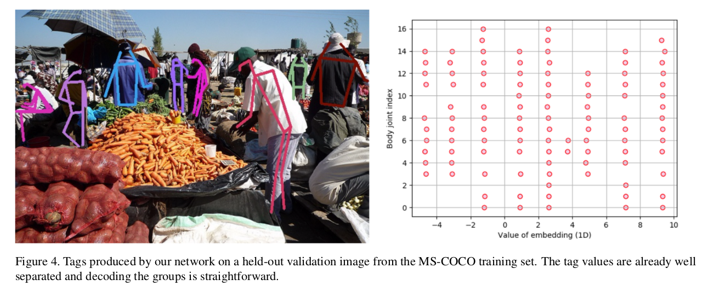
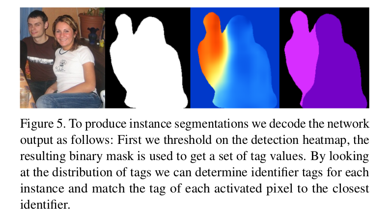
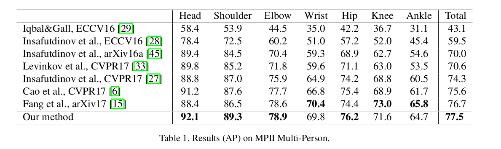
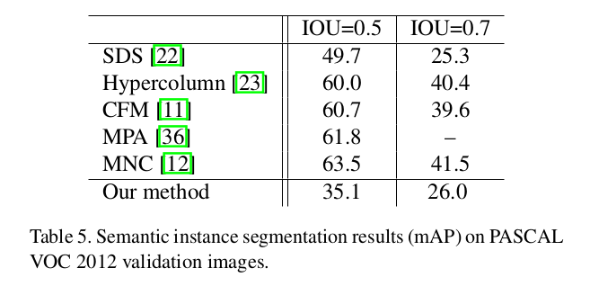

Associative Embedding: End-to-End Learning for Joint Detection and Grouping
=

# 1. Introduction
许多计算机视觉任务可以视为联合检测和分组： 检测更小的视觉单元和将它们分组到更大的结构。例如，多人姿态估计可以视为检测身体关节以及将它们分组到单个的人；实例分割可以视为检测相关像素以及将它们分组到对象是咧；多目标跟踪可视为检测目标实例以及将它们分组到踪迹（track）。在所有这些案例中，输出是一个可变数量的视觉单元，并且将它们分配到一个可变数量的视觉组。

如此的任务通常为两阶段的管道，第一个是检测，第二个是分组。如此的方法可能是次优的，因为检测和分组通常紧密耦合的：例如，在多人姿态估计中，如果在组附近检测到肘关节，那么腕关节的检测可能是假阳性。

在本文中，我们询问是否有可能使用一阶段深度网络训练的端到端联合执行检测和分组。我们提出了关联嵌入（associative embedding），一种表示联合检测和分组输出的新方法。对于每个检测，基本思想是引入一个实数作为确定检测输入某个组的“tag”。换句话说，标签将每个检测与同一组中的其他检测相关联。

考虑 2D 检测和 1D 嵌入（实数）的特殊案例。网络输出每个像素检测得分的热图和每个像素唯一标签的热图。然后，检测和分组从这两个热图中解码。

为了训练网络预测标签，如果对应的检测属于 ground-truth 中相同的组或者不同的值，那么我们使用一个损失函数鼓励标签对有相似的值。值得注意的是，我们没有网络预测的“ground-truth”标签，因为重要的不是特定的标签值，只是它们之间的差异。只要他们同意 ground-truth 分组，网络就可以自由决定标签值。

我们将我们的方法应用于多人姿态估计，它是理解图像中人类的重要任务。具体地，给定输入图像，多人姿势估计寻求检测每个人并定位他们的身体关节。不同于单人姿态，不存在人位置或大小的先验假设。多人自她系统必须扫描整幅图像以检测所有的人以及它们相应的关节。为了这个任务，我们研究具有堆叠沙漏网络的关联嵌入，其为每个身体关节产生一个检测热图和一个标签热图，然后根据相似的标签将身体关节分配给单个人。实验表明，我们的方法由于所有当前的方法，并在 MS-COCO 和 MPI Multiperson Pose 上获得最优结果。

我们通过将其应用于实例分割进一步证明了我们方法的实用性。表明将关联嵌入应用于拟合检测和分组的各种视觉任务是直截了当的。

我们的贡献有三个方面：（1）我们引入关联嵌入，一种新的单阶段、端到端检测和分组方法。这种方法简单而通用；它适用于任何产生像素预测的网络架构;（2）我们将关联嵌入应用到多人姿态估计，并在两个标准基准测试上获得最优结果。

# 2. Related Work
**Vector Embeddings** 我们的方法涉及许多使用矢量嵌入的现有工作。图像检索中的工作已使用向量嵌入来衡量图像之间的相似性[17,53]。图像分类、图像描述和短语定位方面的工作使用向量嵌入来将视觉特征和文本特征映射到相同的向量空间[16,20,30]。自然语言处理中的工作使用向量嵌入来表示单词、句子和段落的意义[39,32]。我们的工作与这些先前的工作的不同之处在于，我们在联合检测和分组的上下文中使用向量嵌入作为唯一标签。

**Perceptual Organization** 感知组织中的工作旨在将图像的像素分组为区域、部分和对象。感知组织包含各种复杂的任务，从图形——地面（figure-ground）分割[37]到分层图像解析[21]。先前的工作通常使用两阶段管道[38]，首先检测基本的视觉单元（块、超像素、部分等），然后将它们分组。通常的分组方法包括谱聚类[51,46]、条件随机场（如[31]）和生成概率模型（例如[21]）。这些分组方法都假设预先检测到的基本视觉单元和它们之间预先计算的亲和力（affinity）度量，但在将亲和力度量转换成组的过程中它们之间各不相同。相比之下，我们的方法使用通用网络在一个阶段中执行检测和分组，该网络不包括用于分组的特殊设计。

值得注意的是我们的方法和使用谱聚类的方法有紧密的联系。谱聚类（例如归一化切割[46]）技术将视觉单元之间的预先计算的亲和度（例如由深度网络预测）作为输入，并且解决广义特征问题以产生对于视觉单元类似的嵌入（每个视觉单元一个）具有高亲和力。Angular Embedding [37,47]通过嵌入深度排序和分组来扩展谱聚类。我们的方法不同与谱聚类之处在于，我们既没有亲和度的中间表征，也不同求解任何特征问题。相反，我们网络直接输出最终嵌入。我们的方法还涉及Harley等人在学习密集卷积嵌入[24]方面的工作，该工作训练深度网络以产生用于语义分割任务的像素嵌入。我们的工作不同于它们的地方在于，我们的方法不仅能产生逐像素的嵌入，还产生逐像素检测得分。我们的新颖之处在于将检测和分组集成到单个网络中； 据我们所知，这种整合尚未尝试用于多人人体姿势估计。

**Multiperson Pose Estimation** 最近的方法在改善图像中的人体姿态估计方面取得了很大进展，特别是对于单人姿势估计。对于多人姿态，可以分为 top-down 和 bottom-up 。Top-down 方法先检测单个人，然后估计每个人的姿态。Bottom-up 方法检测单个身体关节，然后将关节分组到个体。我们的方法更接近于 bottom-up 方法，但不同之处在于检测和分组阶段没有分离。整个预测使用一阶段、通用网络一次完成。这消除了对其他方法所需的复杂后处理步骤的需要[6,28]。

**Instance Segmentation** 大多数现有的实例分割方法采用多级流水线进行检测，然后进行分割[23,18,22,11]。Dai等[12]通过一个允许通过空间坐标进行反向传播的特殊层使这种管道可微分。

最近的两项研究使用全卷积网络寻求更紧密的检测和分割集成。DeepMask[43] 密集地扫描子窗口，并为每个子窗口输出一个检测得分和分割掩模（重塑为一个向量）。Instance-Sensitive FCN 将每个对象视为由规则网格中的一组对象部分组成，并输出每个对象部分的检测分数的每个像素热图。然后，Instance-Sensitive FCN（IS-FCN）检测部件检测得分在空间上是一致的对象实例，并从对象组件的热图组装对象掩模。相比 DeepMask 和 IS-FCN，我们的方法实质上更简单： 对于每个对象类别，我们在每个像素位置仅输出两个值，一个得分表示表示前景 vs. 背景，一个标签表示对象实例的身份，而 DeepMask 和 IS-FCN 产生更高维度的输出。

# 3. Approach
## 3.1. Overview
为了引入关节检测和分组的关联嵌入，我们首先回归视觉检测的基本形式。许多视觉任务涉及一系列视觉单元的检测。这些任务通常被制定为大量候选的得分。例如，单人姿态估计可以形式化为所有可能的像素位置候选身体关节检测评分。对象检测可以形式化为不同像素位置、尺度和纵横比的候选边界框评分。

关联嵌入的想法是除了检测得分之外还预测每个候选的嵌入。嵌入用作编码分组的标签： _具有相似标签的检测应该组合在一起。_ 多人姿态估计中，具有相似标签的身体关节应该被组合已形成单个的人。值得注意的是标签的绝对值无关紧要，只关注标签之间的距离。也就是说，只要属于同一组的检测值相同，网络就可以自由地为标签分配任意值。

注意嵌入的维度不是关键。如果网络能够成功预测高维嵌入以将检测分成组，则应该只要有足够的网络容量，也可以学习将这些高维嵌入映射到更低的维度。事实上，我们发现 1D 嵌入对于多人姿态估计是充分的，并且更高为不会导致显著的改进。因此，本文中，我们假设 1D 嵌入。

为了训练网络预测标签，我们强制执行损失，鼓励来自同一组的检测使用类似的标签，并针对不同组检测不同的标签。具体而言，这种标签损失是在与 ground-truth 一致的候选检测上强制执行的。我们比较检测对并根据标签的相对值以及检测是否应来自同一组来定义惩罚。

## 3.2. Stacked Hourglass Architecture

这些工作中，我们将关联嵌入与堆叠沙漏架构结合，这是一种用于密集像素预测的模型，由一系列模块组成，每个模块的形状像沙漏（图2）。每个“沙漏”都有一组标准的卷积和池化层，处理降到低分辨率的特征以捕获图像的完整上下文。然后，上采样这些特征，并逐渐与更高层的输出结合，指导分辨率达到最终输出的分辨率。堆叠多个沙漏可以重复自下而上和自上而下的推理，以产生更准确的最终预测。有关网络架构的更多详细信息，请参阅[40]。

堆叠沙漏模型最初是为单人人体姿态估计而开发的。模型输出目标人的每个身体关节的热图。然后，具有最高热图激活的像素用于关节的预测位置。该网络旨在整合全局和局部特征，用于捕获有关身体完整结构的信息，同时保留精细细节以实现精确定位。全局和局部特征之间的这种平衡在其他像素预测任务中同样重要，因此我们将相同的网络应用于多人姿势估计和实例分割。

我们对网络架构作出轻微地修改。我们在每次分辨率下增加输出特征的数量（ $256 \rightarrow 386 \rightarrow 512 \rightarrow 768$ ）。此外，单个层由 $3 \times 3$ 卷积组成，而不是残差块，从每个沙漏的残差连接以及每个分辨率的跳过连接仍然存在简化训练的快捷效果。

## 3.3. Multiperson Pose Estimation
为了将关联嵌入应用到多人姿态估计，我们训练网络检测关节，以在单人姿势估计中执行[40]。我们使用堆叠沙漏模型来预测每个关节（“左手腕”、“右肩”等）在每个像素位置的预测得分。与单人姿势的区别在于多人的理想热图应具有多个峰值（例如，识别属于不同人的多个左手腕），而不是单个目标人的单个峰值。

除了生成全套关键点检测之外，网络还会自动将检测分组为单个姿势。为此，网络为每个关节在每个像素位置产生一个标签。换句话说，每个关节热图有对应的“标签”热图。因此，如果有 $m$ 个身体关节进行预测，那么网络将输出总共 $2m$ 个通道， $m$ 个用于检测， $m$ 个用于分组。为了将检测解析到单个人，我们使用非极大值抑制来获得每个关节的峰值检测，并在相同的像素位置追溯其相应的标签（如图3所示）。然后，我们通过比较检测的标签值并匹配足够接近的标签值来将检测分组到身体部位。现在，一组检测形成一个人的姿势估计。

为了训练网络，我们在输出热图上施加检测损失和分组损失。检测损失计算每个预测检测热图和其“ground-truth”热图（由每个关节点位置的 2D 高斯激活组成）之间的均方误差（mean square error）。这种损失与 Newell等人[40]使用的损失相同。

组损失评估预测标签与 ground-truth 分组的一致程度。具体而言，我们检索所有人在其 ground-truth 位置的所有身体关节的预测标签; 然后，我们比较每个人的标签并跨越所有人。同一个人的标签应当相同，而不同人之间的标签应当不同。

我们不是在所有可能的关键点对之间强制执行损失，而是为每个人生成参考嵌入。这是通过获取人的关节的输出嵌入的平均值来完成的。在个体中，我们计算每个关节的参考嵌入和预测嵌入之间的平方距离。然后，在成对的人之间，我们将他们的参考嵌入彼此进行比较，并且当两个标签之间的距离增加时，惩罚指数下降到零。

形式上，令 $h_k \in R^{W \times H}$ 为第 $k$ 个身体关节的预测标签热图，其中 $h(x)$ 为像素位置 $x$ 的标签值。给定 $N$ 个人，令 ground-truth 关节位置为 $T = \{(x_{nk})\}, n=1, \cdots, N, k = 1, \cdots, K$ ，其中 $x_{nk}$ 为第 $n$ 个人的第 $k$ 个身体关节的 ground-truth 像素位置。

假设所有 $K$ 个关节都被标注，第 $n$ 个人的参考嵌入为
$$\bar{h}_n = \frac{1}{K}\sum_k h_k(x_{nk})$$

然后，分组损失 $L_g$ 定义为
$$
\begin{alignat}{2}
L_g(h,T)=&\frac{1}{N}\sum_n\sum_k(\bar{h}_k - h_k(x_{nk},)) ^ 2  \\
& + \frac{1}{N^2}\sum_n\sum_{n'}\exp{\{-\frac{1}{2\sigma^2}(\bar{h}_n - \bar{h}_{n'})^2\}}
\end{alignat}
$$

为了产生最终的预测集，我们逐个遍历每个关节。通过首先考虑头部和躯干周围的关节并逐渐移动到四肢来确定排序。我们从第一个关节开始，在非最大抑制之后所有激活超过某个阈值。这些构成了我们最初检测到的人群的基础。

然后，我们考虑后续关节的检测。我们将此关节中的标签与当前人群的标签进行比较，并尝试确定它们之间的最佳匹配。只有两个标签落在特定阈值范围内时才能匹配。此外，我们希望优先考虑高置信度检测的匹配。因此，我们执行最大匹配，其中权重由标签距离和检测分数确定。如果任何新的检测不匹配，则用于启动新的人体实例。这考虑了对于特定人可能只有腿或手可见的情况。

我们遍历身体的每个关节，直到每个检测分配给一个人。没有采取措施来确保关节对之间的解剖学正确性或合理的空间关系。为了给出网络产生的标签类型的印象，以及分组的微不足道性质，我们参考图4。

虽然训练网络为各种尺度的人做出姿势预测是可行的，但也存在一些缺点。网络需要额外的容量来学习必要的尺度不变性，以及由池化后低分辨率的问题造成的预测决策。考虑到这一点，我们在多个尺度的测试时评估图像。有许多潜在的方法可以使用每个尺度的输出来产生最终的姿态预测集。出于我们的目的，我们采用生成的热图并将它们平均在一起。然后，为了跨尺度组合标签，我们将像素位置处的标签集合连接到向量 $v \in R^m$ （假设 $m$ 个尺度）。解码过程不会改变标量标签值描述的方法，我们现在只是比较向量距离。

## 3.4. Instance Segmentation
实例分割的目的是检测和分类对象实例，同时为每个对象提供一个分割掩模。作为概念证明，我们将展示如何将我们的方法应用于此问题，并展示初步结果。如同多人姿态估计，实例分割是联合检测和分组的问题。属于一个对象类的像素被检测，然后将与单个对象相关联的那些组合在一起。为简单起见，我们的方法的以下描述仅假设一个对象类别。

给定一幅输入图像，我们使用堆叠沙漏网络以产生两个热图，一个用于检测，一个用于标签。检测热图在每个像素处给出指示像素是否属于对象类别的任何实例的检测得分，即，检测热图将前景从背景分割。同时，标签热图标记每个像素，使得属于同一对象实例的像素具有相似的标记。

为了训练网络，我们通过将预测的热图与 ground-truth 热图（所有实例掩模的并集）进行比较来监督检测热图。我们通过施加损失来监督标签热图，这种损失鼓励标记在对象实例中是相似的，并且跨实例不同。损失的形式与多人姿态的相似。无需对实例分割掩码中的每个像素进行比较。相反，我们从每个对象实例中随机采样一小组像素，并在整个采样像素组中进行成对比较。

形式上，令 $h \in R^{W \times H}$ 为预测的 $W \times H$ 的标签热图。令 $x$ 表示每个像素位置，$h(x)$ 为位置 $x$ 处的标签，并令 $S_n = x_{kn}, k = 1, \cdots, K$ 为第 $n$ 个对象实例中的随机采样的位置集合。分组损失 $L_g$ 我们定义为
$$
\begin{alignat}{2}
L_g(h,T) = & \sum_n \sum_{x\in S_n} \sum_{x'\in S_n} (h(x)-h(x'))^2 \\
& +  \sum_n \sum_{n'} \sum_{x\in S_n} \sum_{x'\in S_n} \exp{\{-\frac{1}{2\sigma^2}(h(x) - h(x'))^2\}}
\end{alignat}
$$

为了解码网络的输出，我们首先在检测通道热图上施加阈值以产生二值掩模。然后，我们来看看这个掩码中的标签分布。我们计算标签的直方图，并执行非极大值抑制以确定一组值，以用作每个对象实例的标识符。然后将来自检测掩模的每个像素分配给具有最接近标签值的对象。有关此过程的说明，请参见图5。

注意，从一个对象到多个对象的推广非常直接： 我们只需为每个对象类别输出检测热图和标记热图。与多人姿势一样，尺度不变性问题值得考虑。我们不是训练网络以每个可能的尺度识别对象实例的外观，而是在多个尺度上进行评估，并以与姿势估计相似的方式组合预测。

# 4. Experiments
## 4.1. Multiperson Pose Estimation
**Data** 我们在两个数据集上评估： MS-COCO 和 PMII Human Pose 。MPII Human Pose 包含大约 25k 图像，大约 40k 标注人（三分之一用于训练）。评估在 MPII Multi-Person 上执行，如[45]中所述，从测试集中取出一组1758组多人。MPII多人组通常是特定图像中总人数的子集，因此提供一些信息以确保对正确的目标进行预测。这包括用于指示占用区域的一般边界框和尺度项。没有提供有关人数或个人图像尺度的信息。我们使用Pishchulin等人[45]概述的评估度量来计算联合检测的平均精度。

MS-COCO包含大约 60K 训练图像，超过 100K 标注关键点的人。我们报告了两个测试集上性能，一个开发测试集（test-dev）和一个标准测试集（test-std）。我们使用官方评估度量，其为平均准确率（AP）和平均召回率（AR）。

**Implementation** 用于这项任务的网络有四个堆叠的沙漏网络组成，其输入大小为 $512 \times 512$ ，输出分辨率为 $128 \times 128$ 。我们使用 $2e-4$ 的学习率、32的批量训练网络，学习率在 100k 迭代后减小为 $1e-5$ 。关联嵌入损失有相对于检测热图的 MSE 损失的 $1e-3$ 的因子加权。掩模损失忽略具有稀疏注释的人群。在测试时，输入图像以多个尺度运行，并且跨越尺度的标签连接成更高维标签。由于 MPII 和 MS-COCO 的度量都对准确的关键点位置是敏感的，遵循先前的工作[6]，我们在相同数据集上应用单人姿态模型以细化预测。

**MPII Results** 平均精度结果可以在表1中看到，表明对整个 AP 中的现有技术方法的改进。关联嵌入被证明是教导网络将关键点检测分组到个人中的有效方法。它不需要对图像中存在的人数进行假设，也提供了一种网络表达联合任务融合的机制。例如，如果两个人的相同关节在完全相同的像素位置处重叠，则预测的关联嵌入将是每个人的相应标签之间某处的标签。

**MS-COCO Results**

## 4.2. Instance Segmentation
**Dataset** PASCAL VOC

**Implementation** 输入分辨率为 $256 \times 256$ ，输出分辨率 $64 \times 64$ 。关联嵌入损失的权重降低到 $1e-4$ 。在训练期间，考虑到尺度，仅当对象出现在某个特定尺度范围内才会被监督，并且有一个损失掩模用于忽略太大或太小的对象。在 PASCL VOC 中忽略的区域以在对象边界定义，并且我们在损失掩模中排除这些。在 MS-COCO 上进行三天从头训练，然后在 PASCAL VOC train 上微调 12 个小时。在测试时，图像在三个尺度（$\times 0.5$、 $\times 1.0$ 和 $\times 1.5$）上评估。我们不是通过平均热图来生成每个尺度的实例提议，而是进行非最大限制抑制，以便跨尺度删除重叠提案。

**Results**

