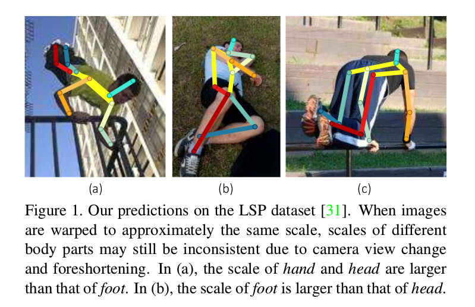
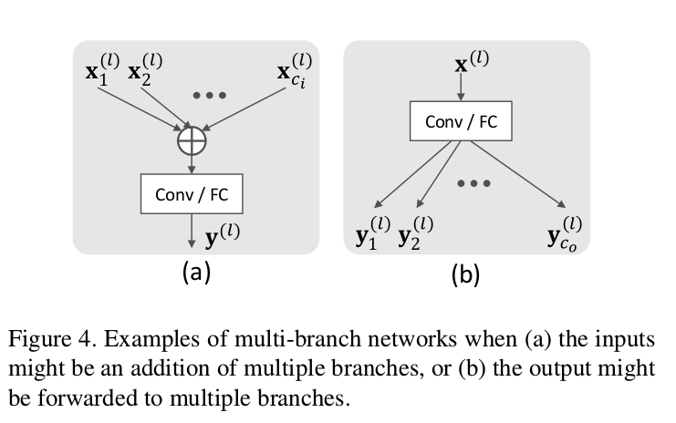
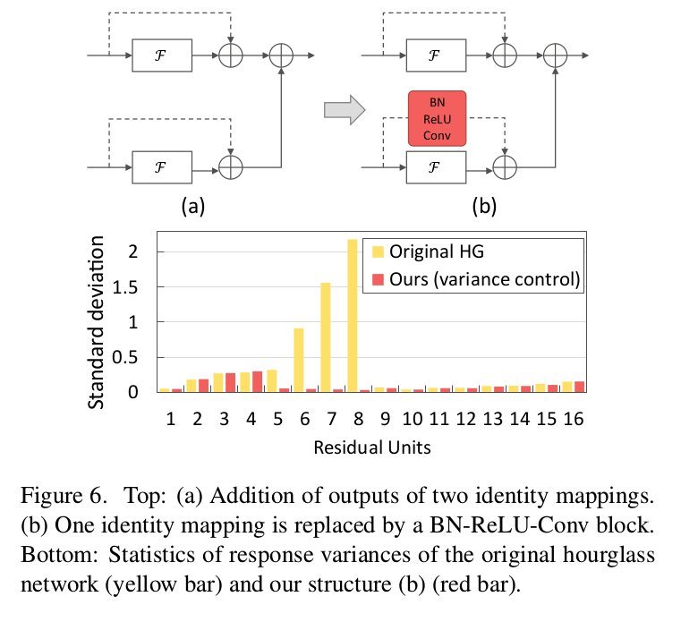
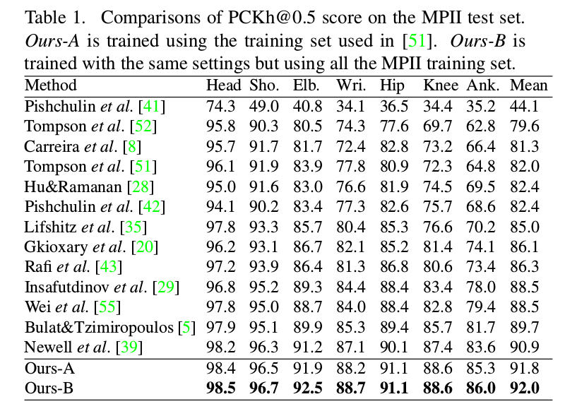
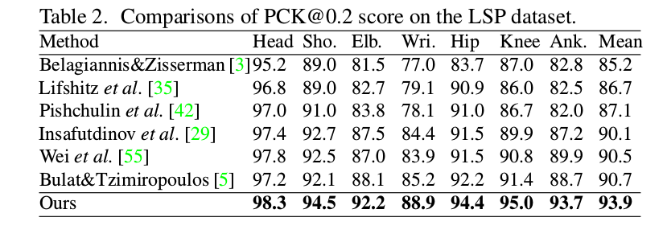
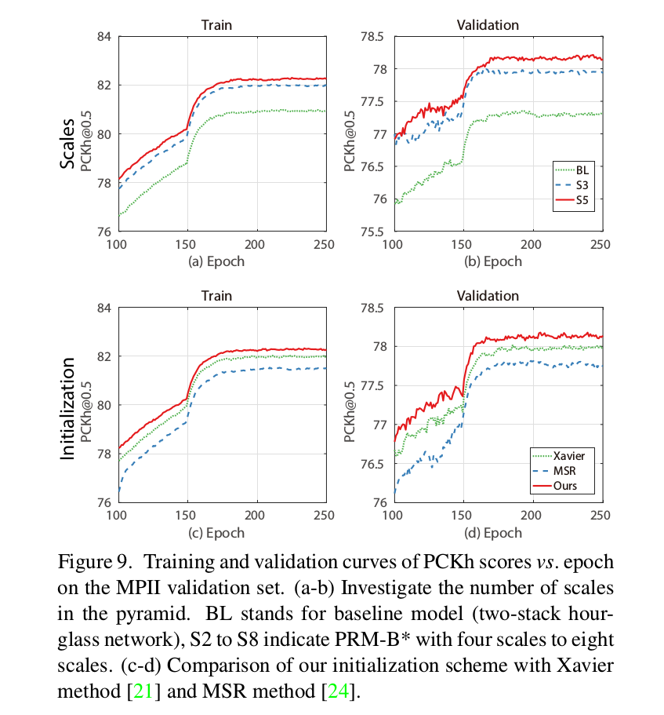
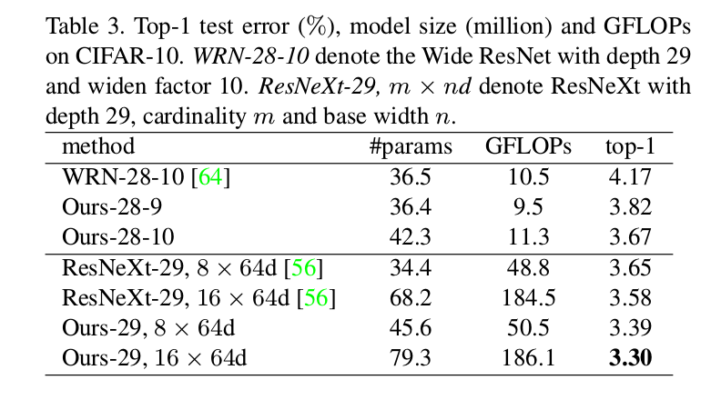

Learning Feature Pyramids for Human Pose Estimation
=

# 1. Introduction
定位人体的身体部位是计算机视觉中一项基本但具有挑战性的任务，它是高级视觉任务的重要基础，例如活动识别[60,54]、服装解析[57,58,36]、人类重新识别[65]以及人机交互。然而，由于高度关联的人体肢体、遮挡、视角变化和缩短，实现精确定位是困难的。

通过使用 DCNN[53,52,11,51,42,55,39] ，人体姿态估计获得显著进步。在这些方法中，DCNN从基于人体尺寸的扭曲到相似尺度的图像学习身体部位检测器。在推理期间，测试图像也要扭曲到与训练图像相同的尺度。

尽管提供了完整人体的正确尺度，但由于人与人之间体形变化和由视角改变和身体关节引起的缩短，身体部位的尺度可能仍然不一致。这导致身体部位检测器难以定位身体部位。例如，图1为严重的foreshortening 。当图像根据人体尺度缩放到相同的大小时，图1（a）的 hand 的尺度比图1（b）大。因此，hand 检测器可以检测图1（a）中的手，但可能不能可靠地检测图1（b）中的手。在DCNN中，这种尺度变化的问题不仅发生在较深层的高级语义中，而且也存在于较浅层的低级特征中。

为加强DCNN对抗视觉模式的尺度变化的鲁棒性，我们设计 _Pyramid Residual Module_ 通过特征金字塔显式地学习卷积滤波器。给定输入特征，Pyramid Residual Module 通过不同比例的子采样获得不同尺度的特征。过滤后的特征被上采样到相同的分辨率，然后一起求和以进行后续处理。这种 Pyramid Residual Module 可以用于DCNN中构建块以学习网络不同级别的特征金字塔。

存在设计具有分支的网络的趋势，例如，用于分类的 Inception 模型[47,30,48,46] 与 ResNets [25,26]、用于语义分割的ASPP网络[9]、用于人体姿势估计的卷积姿态机[55]和堆叠沙漏网络[39]，其中层的输入来自多个其他层，或者层的输出被许多其他层使用。我们的金字塔残差模块也有分支。我们观察到，已有的权重初始化方案，例如MSR[24]和Xavier[2]方法，对于有分支的层是不使用的。因此，我们扩展了当前的权重初始化策略，并提供了理论推导，以表明网络参数的初始化应该考虑分支的数量。我们也展示了残差单元[26]中的另一个问题，其为，随着深度增加，残差单元的输出方差累积。问题是由恒等映射引起的。

由于沙漏网络，也称为 conv-deconv结果，是用于姿态估计、对象检测和像素级任务的有效结构，我们在实验中将它作为基本的结构。我们观察到在沙漏中使用残差单元的问题：当两个残差单元相加时，输出方差几乎会加倍，这在优化中造成困难。我们提出了一种简单但有效的方法，可以忽略不计的附加参数来解决这个问题。

本文的主要贡献有三个方面：
- 我们提出 _Pyramid Residual Module_ ，其通过在DCNN中学习特征金字塔，只增加了很少的复杂性，从而增强了深度模型尺度的不变性。
- 我们确定了包含具有多个输入或输出分支的层的初始化DCNN带来的问题。然后，提供一种权重初始化方案，其可以用于许多网络结构，如Inception模型和ResNet。
- 我们观察到通过恒等映射映入的激活方差累计，在一些场景（如，在沙漏结构中将由恒等映射[26]实现的多个残差单元的输出相加）中可能有害。引入了一个简单而有效的方案来解决这个问题。

# 2. Related Work
**Human Pose Estimation.** 图解钩，例如 Pictorial Structure[19,17,61]和loopy 结构，广泛用于建模身体部位之间的空间关系。所有的这些方法都构建于例如HOG的手工特征，并且它们的性能严重依赖图像金字塔。最近，深度模型在人体姿态估计上获得最佳结果。起重工，DeepPose[53]用DCNN进行人体姿态估计的最先尝试之一，它直接回归身体部位的坐标，其遭遇图像到位置难以映射的问题。因此，后面的方法将部位位置建模为得分图中的高斯峰值（Gaussian Peak），并且使用全卷积网络预测得分图。为了获得更高的准确率，常使用图像金字塔上的多尺度测试，其产生多尺度特征表示。

另一方面，为了学习具有强尺度不变性的模型，在[51]中提出了在三个尺度的图像金字塔上训练的多分支网络。然而，当图像金字塔用于训练时，计算和内存随着尺度的数量线性增加。相比之下，我们的金字塔残差模块提供了学习多尺度特征的有效方式，其在计算和内存上要小得多。

**DCNNs combining multiple layers.** 相比于传统的平坦网络（例如，AlexNet、VGG-net），多分支网络在不同视觉任务上展现了不同的性能。在分类中，Inception模型是最成功的多分支网络之一，每个模块的输入，首先通过 $1 \times 1$ 卷积映射到低维，然后，通过一组不同尺寸的滤波器捕获多种上下文信息，并且通过concatenation组合。ResNet可以被视为具有恒等映射的两分支网络。ResNeXt是ResNet的扩展，其中所有分支共享相同的拓扑结构，这种隐式学习的变换通过加法聚合。在我们的工作中，我们使用多分支网络探索另一种可能：学习多尺度特征。

最近的姿态估计、对象检测和分割方法使用来自多层的特征进行预测。我们的方法是这些方法的互补。例如，我们采用Hourglass作为基本结构，并使用所提出的金字塔残差模块替换它的原始残差单元，其从一个尺度学习特征。

**Weight initialization.** 好的初始化对于训练深度模型只管至关重要。Hinton和Salakhutdinov[27]采用逐层预训练策略来训练深度自编码器。Krizhevsky等人[33]将每层的权重初始化为服从均值为0、标准差为0.01的高斯分布。然而，由于梯度的不稳定，很难训练非常深的网络。假设初始化的权重接近0，因此，如Sigmoid和Tanh的非线性激活被视为线性函数。这种假设对于修正线性单元不成立。因此，He等人提出基于[21]的修正网络的初始化方案。然而，所有上述的初始化方法是在仅有一个分支的情况下推导而来。

# 3. Framework

图2中说明了所提出的框架的概述。我们采样高度模块化的堆叠 Hourglass Network作为基本网络结构，以研究人体姿态估计的特征金字塔学习。我们的网络构件块是所提出的Pyramid Residual Module（PRM）。

## 3.1. Revisiting Stacked Hourglass Network
沙漏网络旨在以前馈的方式捕捉各种尺度的信息。首先，通过下采样特征执行bottom-up过程，通过上采样特征图与bottom层的更高分辨率的特征结合来执行top-down过程，如图图2（b）所示。这种bottom-up、top-down过程重复几次以构建“stacked hourglass”网络，并在每次堆叠的末端使用中间监督。

在[39]中，残差单元用作 hourglass 网络的构件块。然而，它仅能捕捉一个尺度的视觉模式或语义。在本文中，我们使用所提出的金字塔残差模块作为用于捕获多尺度视觉模式或语义测构件块。

## 3.2. Pyramid Residual Modules (RPMs)
目标是学习跨越DCNN多个级别的特征金字塔。它允许网络捕获从原始视觉模式到高级语义的特征金字塔。受残差学习的最新进展所驱动[25,26]，我们提出新颖的Pyramid Residual Module (PRM)，其能够学习多尺度特征金字塔。

PRM显式学习具有不同分辨率的输入特征的滤波器。令 $x^{(l)}$ 和 $W^{(l)}$ 分别为第 $l$ 层的输入和滤波器。PRM可以表示为：
$$x^{(l+1)} = x^{(l)} + P (x^{(l)}; W^{(l)}) \tag 1$$
其中 $P(x^{(l)}; W^{(l)})$ 为特征金字塔，可以分解为：
$$P(x^{(l)}; W^{(l)}) = g \left(\sum_{c=1}^C f_c(x^{(l)}; w_{f_c}^{(l)}); w_g^{(l)} \right) + f_0(x^{(l)}; w_{f_0}^{(l)}) \tag 2$$
在式（2）中， $C$ 表示金字塔级别数， $f_c(\cdot)$ 为第 $c$ 个金字塔级的变换， $W^{(l)} = \{w_{f_c}^{(l)}, w_g^{(l)}\}_{c=0}^C$ 是参数集合。变换 $f_c(\cdot)$ 的输出相加到一起，并进一步通过滤波器 $g(\cdot)$ 卷积。金字塔残差模块如图3 。为了减少计算量和空间复杂度，每个 $f_c(\cdot)$ 设计为瓶颈结构。例如，在图3中，特征维度通过 $1 \times 1$ 卷积降维，然后通过 $3 \times 3$ 卷积在一组子采样输入特征上计算新特征。最后，所有的新特征上采样到相同的大小，并加到一起。

**Generation of input feature pyramid.** 在DCNN中，Max-pooling 和 Average-pooling 广泛用于减少特征图的空间分辨率。但是，通过至少为2的整数因子的池化来减小分辨率，太快，太粗糙，其不能gently生成。为了获得不同分辨率的输入特征图，我们采用 fractional max-pooling 来近似用于生成传统图像金字塔的平滑和子采样过程。第 $c$ 级金字塔的子采样率计算为：
$$s_c = 2^{-M\frac{c}{C}}, c = 0, \cdots, C, M \ge 1 \tag 3$$
其中 $s_c \in [2^{-M}, 1]$ 表示与输入特征相比的相对分辨率。例如，当 $c=0$ 时，输出与输入有相同的分辨率。当 $M=1,c=C$ 时，特征图的分辨率为其输入的一半。在实验中，我们设置 $M=1$ 和 $C=4$ ，金字塔中共的最低尺度是其输入分辨率的一半。

## 3.3. Discussions
**PRM for general CNNs.** PRM是通用模块，并且能够用作不同CNN架构（如stacked hourglass network、wide residual net和ResNeXt）的基本构建块。

**Variants in pyramid structure.** 除了使用 fractional max-pooling、卷积和上采样来学习特征金字塔，如图3（a-b），也可以使用膨胀卷积来计算金字塔，如图3（c）（PRM-D）所示。金字塔中的特征加法也可以用 concatenation 替代，如图3（b）（PRM-C）。我们在实验中讨论了这些变体的性能，并且证明如图3（b）（PRM-B）的设计可以与其他方法相比，同时保持更少的参数和更少的计算复杂度。

**Weight sharing.** 为了生成特征金字塔，传统的方法在不同图像金字塔级别上通常应用相同的手工滤波器，例如HOG 。该过程对应于在不同级别的金字塔 $W_{f_c}^{(l)}$ 上共享权重 $W$ ，这能够大大减少参数的数量。

**Complexity.** [39]中使用的残差单元有 256 维的
输入和输出，其在残差单元内减少到128-d。我们对具有原始尺度的分支采用这种结构（即，方程（2）中的 $f_0$ ）。由于更小分辨率的特征包含相应更少的信息，因此，我们对较小尺度的分支使用较少的特征通道。例如，给定具有五个分支的PRM和具有较小尺度的分支的28个特征通道（即，方程（2）中的 $f_1$ 至 $f_4$ ），与参数和GFLOP的残差单元相比，增加的复杂度仅约10％ 。

# 4. Training and Inference
我们使用得分图表示身体关节位置。通过 $z = \{z_k\}_{k=1}^K$ 表示ground-truth 位置，其中 $z_k = (x_k, y_k)$ 表示图像中第 $k$ 个身体关节位置。然后， ground-truth得分度 $S_k$ 由均值 $z_k$ 和方差 $\sum$ 生成：
$$S_k(p) \sim \cal{N}(z_k, \sum) \tag 4$$
其中 $p \in R^2$ 表示位置， $\sum$ 是根据经验设置的单位矩阵 $I$ 。每个堆叠的hourglass网络为 $K$ 个身体关节预测 $K$ 个得分图，即 $\hat{S} = \{\hat{S}_k\}_{k=1}^K$ 。附加到每个堆叠hourglass的末端的损失定义为均方误差：
$$\cal{L} = \frac{1}{2} \sum_{n=1}^N \sum_{k=1}^K ||S_k - \hat{S}_k||^2  \tag 5$$
其中 $N$ 是样本数。

在推理期间，我们从最后一叠沙漏产生的预测得分图中获得预测的身体关节位置 $\hat{z}_k$ ，取最大得分的位置如下：
$$\hat{z}_k = \arg \max_p \hat{S}_k(p), k = 1, \cdots, K. \tag 6$$

## 4.1. Initialization Multi-Branch Networks
初始化对于训练非常深的网络非常重要，特别是对于密集预测任务，其中批归一化[30]由于全卷积网络的大内存消耗而导致小批量小的效果较差。现有的权重初始化方法[33,21,24]是在没有分支的普通网络的假设下设计的所提出的 PRM 有多个分支，不符合假设。最近开发的具有多个分支的架构，如Inception模型和ResNet，也不是普通网络。因此，我们讨论如何为添加多分支网络推导合适的初始化。

**Forward propagation.** 通常，多分支网络可以由分支的输入和输出数量特征化。图4（a）展示了第 $l$ 层有 $C_i^{(l)}$ 个输入和一个输出分支的例子。图4（b）展示了第 $l$ 层有一个输入分支和 $C_0^{(l)}$ 输出分支的例子。在前向传播期间， $C_i^{(l)}$ 影响第 $l$ 层输出的方差，$C_0^{(l)}$ 则不。在第 $l$ 层中，假设有 $C_i^{(l)}$ 个输入分支和 $C_0^{(l)}$ 个输出分支。有 $C_i^{(l)}$ 个输入向量 $\{x_c^{(l)} | c = 1, \cdots, C_i^{(l)}\}$ 。使用全连接层作为例子，一个响应计算为：
$$y^{(l)} = W^{(l)} \sum_{c=1}^{C_i^{(l)}}x_c^{(l)} + b^{(l)} \tag 7$$
$$x^{(l+1)} = f(y^{(l)}) \tag 8$$
其中 $f(\cdot)$ 为非线性激活函数。

与[21,24]相同，我们假设 $W^{(l)}$ 和 $x^{(l)}$ 是独立同分布的（i.i.d.），并且它们是相互独立的。因此，我们用 $y_i^{(l)}, x_i^{(l)}, w_i^{(l)}$ 分别表示 $y^{(l)}, x^{(l)}, w^{(l)}$ 中的元素。然后，有：
$$Var[y_i^{(l)}] = C_i^{(l)} n_i^{(l)} Var[w_i^{(l)}x_i^{(l)}], \tag 9$$
其中 $n_i^{(l)}$ 是 $x_c^{(l)}$ 中的元素数，其中 $c = 1, \cdots, C_i^{(l)}$ 。假设 $w_i^{(l)}$ 均值为 0 。上述自变量乘积的方差如下：
$$
\begin{alignat}{2}
Var[y_i^{(l)}] &= C_i^{(l)} n_i^{(l)} Var[w_i^{(l)}]E[(x_i^{(l)})^2] \\
&= \alpha C_i^{(l)} n_i^{(l)} Var[w^{(l)}] Var[y^{(l-1)}]
\end{alignat}
\tag 9
$$
其中 $\alpha$ 依赖式（8）中的激活函数 $f$ 。 对于ReLU，$\alpha = 0.5$ ，对于 Tanh 和 Sigmoid ， $\alpha = 1$ 。为了使输出 $y(l)$ 的方差对于不同的层 $l$ 大致相同，应满足以下满足条件：
$$\alpha C_i^{(l)} n_i^{(l)} Var[w^{(l)}] = 1. \tag {10}$$
因此，初始化时， $W^{(l)}$ 的合适方差应当为 $1/(\alpha C_i^{(l)} n_i^{(l)})$ 。

**Backward propagation.** 用 $\Delta x^{(l)}$ 和 $\Delta y^{(l)}$ 分别表示 $\frac{\partial{\cal{L}}}{\partial{x^{(l)}}}$ 和 $\frac{\partial{\cal{L}}}{\partial{y^{(l)}}}$ 。在反向传播期间，通过链式法则计算梯度：
$$\Delta x^{(l)} = \sum_{c=1}^{C_o^{(l)}} {W_{(l)}}^T \Delta y^{(l)} \tag {11}$$
$$\Delta y^{(l)} = f'(y^{(l)}) \Delta x^{(l+1)} \tag {11}$$
假设 $w^{(l)}$ 和 $\Delta y^{(l)}$ 是独立同分布的，并且它们也是相互独立的，然后，当 $w^{(l)}$ 初始化为零均值并且具有小幅度的对称时， $\Delta x^{(l)}$ 具有零均值。令 $n_o^{(l)}$ 表示输入神经元的数量。然后，有
$$Var[\Delta x^{(l)}] = C_o^{(l)} n_o^{(l)} Var[w^{(l)}] Var[\Delta y^{(l)}]  \tag {13}$$
令 $E(f'(y^{(l)})) = \alpha$ 。对于ReLU， $\alpha = 0.5$；对于Tanh 和 Sigmoid，$\alpha = 1$ 。我们进一步假设 $f'(y^{(l)})$ 和 $\Delta x^{(l)}$ 是相互独立的，然后由公式（12），我们有 $E[\Delta y^{(l)}] = \alpha E[\Delta x^{(l+1)}]$ 。然后，我们推导 $Var[\Delta y^{(l)}] = E[(\Delta y^{(l)})^2]=\alpha Var[x^{(l+1)}]$ 。因此，由式（3）有：
$$Var[\Delta x^{(l)}] = \alpha C_o^{(l)} n_o^{(l)} Var[w^{(l)}] Var[\Delta x^{(l+1)}] \tag {14}$$
为了确保 $Var[\Delta x^{(l)}] = Var[\Delta x^{(l+1)}]$ ，必须有 $Var[w^{(l)}] = 1 / (\alpha C_o^{l} n_o^{(l)})$ 。

在许多案例中， $C_i^{l} n_i^{(l)}) \ne C_o^{l} n_o^{(l)})$ 。如[21]，前向和后向约束之间的妥协是，
$$Var[w^{(l)}] = \frac{1}{\alpha^2 (C_i^{(l)} n_i^{(l)} + C_o^{(l)} n_o^{(l)})}, \forall l \tag {15}$$

**Special case.** 对于一个输入和一个输出分支的平坦网络，在式（15）中有 $C_i^{(l)} = C_o^{(l)} = 1$ 。在这种情况下，式（15）中的结果退化为[21]中Tanh和Sigmoid得到的结论以及[24]中ReLU的结论。

**General case.** 通常，对于一些 $l$ ， 具有分支的网络有 $C_i^{(l)} \ne 1$ 或者 $C_o^{(l)} \ne 1$ 。因此，输入分支和输出分支的数量在初始化参数被考虑。具体地，如果几个多分支层被堆叠在一起，而没有其他操作（如，批归一化、卷积、ReLU等），则通过Xavier或MSR初始化的输出方差将增加大约 $\prod_l C_i^{(l)}$ 倍。

## 4.2. Output Variance Accumulation
由于恒等映射，残差学习允许我们训练极深的神经网络。但是，它也有缺点： 当网络变得更深时，响应的方差将增加，其增加了优化的难度。

残差单元的响应计算如下：
$$x^{(l+1)} = x^{(l)} + \cal{F}(x^{(l)}; W{(l)}) \tag {16}$$
其中 $\cal{F}$ 表示残差函数，例如，具有三个卷积（ $1 \times 1 \rightarrow 3 \times 3 \rightarrow 1 \times 1$ ） 的瓶颈结构是不相关的，然后残差单元响应的方差为：
$$
\begin{alignat}{2}
Var[x^{(l+1)}] &= Var[x^{(l)}] + Var[\cal{F}(x^{(l+1)}; W^{(l)})]  \\
&>Var[x^{(l)}]
\end{alignat} \tag {17}
$$
其中 $Var[\cal{F}(x^{(l+1)}; W^{(l)})]$ 为正。

在[25,26]中，当特征图分辨率减小时，或者当特征通道数增加时，恒等映射被卷积层替换。这允许网络将响应的方差重置为较小的值，并避免响应具有非常大的方差，如图5所示。在如hourglass的结构中，这种增加方差的影响变得越来越明显，其中两个残差单元的响应相加到一起，如图6（a）所示。假设分支是不相关的，然后方差增加为：
$$
\begin{alignat}{2}
Var[x^{(l+1)}] &= \sum_{i=1}^2(Var[x_i^{(l)}] + Var[\cal{F_i}(x_i^{(l)}; W_i^{(l)})])  \\
&>\sum_{i=1}^2 Var[x_i^{(l)}]
\end{alignat}  \tag {18}
$$
因此，输出方差几乎是两倍。当网络变得更深时，方差将急剧增加。

在本文中，我们使用 $1 \times 1$ 卷积前面的批量归一化和ReLU来替换两个残差单位的输出相加时的身份映射，如图6（b）所示。这个简单的替换可以阻止方差爆炸，如图6（c）所示。在实验中，我们发现破坏方差爆炸也提供了更好的性能（第5.1.3节）。

# 5. Experiments
## 5.1. Experiments on Human Pose Estimation
我们对两个广泛使用的人体姿势估计基准进行了实验。（i）MPII 人体姿态数据集，其覆盖广泛的人类活动范围，包含 40k 个人的具有 25k 图像。（ii）Leeds Sports Poses（LSP），包含具有挑战性的 12K 运动中的图像。

### 5.1.1 Implementation Details
根据注释的身体位置和比例，从调整大小的图像中裁剪输入图像 $256 \times 256$ 。对于 LSP 测试集，我们只是使用图像中心作为身体位置，并根据图像大小估计身体尺度。训练数据集使用缩放、旋转、翻转和添加颜色噪声增强。使用 RMSProp在4个Titan X GPU上优化网络，mini-batch大小为16，训练200 个epoch 。初始学习率为 $7 \times 10^{-4}$ ，并在第150个epoch和170个epoch时减小10倍。测试在具有翻转的6个尺度的图像金字塔上执行。

## 5.1.2 Experimental Results
**Evaluation measure.** 在LSP数据集上使用 Percentage Correct Keypoints（PCK）度量，使用修改后的PCK度量，该度量使用匹配阈值作为MPII数据集上头部段长度（PCKh）[2]的50％。

**MPII Human Pose.**

**LSP dataset.**

### 5.1.3 Ablation Study

## 5.2. Experiments on CIFAR-10 Image Classification

