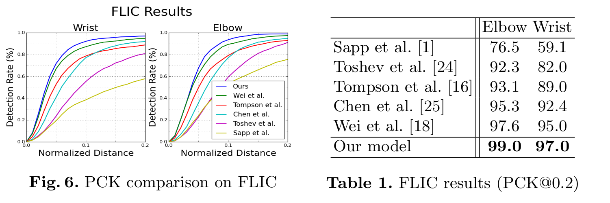
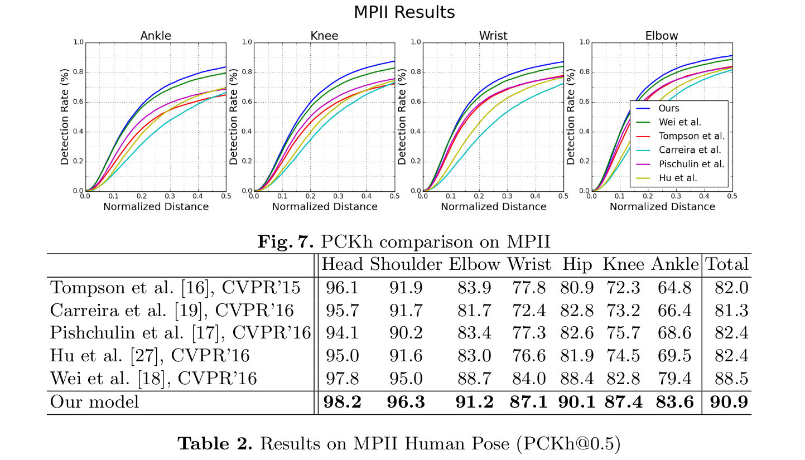
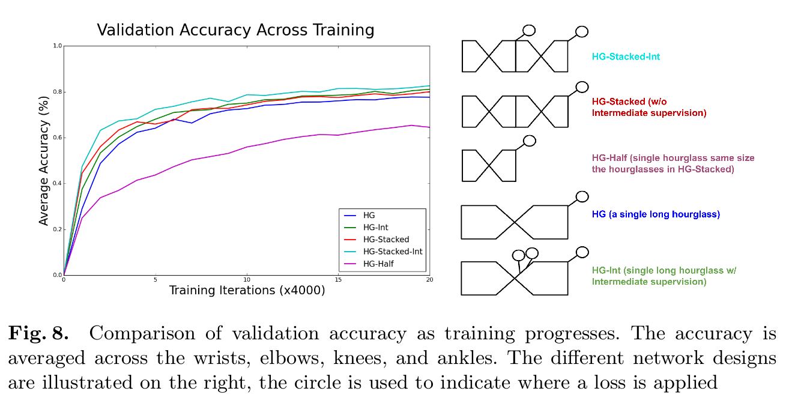

Stacked Hourglass Networks for
Human Pose Estimation
=

# 1 Introduction
理解图像和视频中的人的关键一步准确的姿态估计。给定单一的RGB图像，我们希望确定身体重要关键点的准确像素位置。获取人体姿势和肢体关节的理解对于如动作识别等更高级任务是有用的，并且还作为人机交互和动画等领域的基础工具。

作为一个公认的视觉问题，姿势估计多年来一直困扰着研究人员面临各种艰巨的挑战。良好的姿势估计系统必须对遮挡和严重变形具有鲁棒性，在罕见和新颖的姿势下成功，并且由于诸如衣服和照明之类的因素而对外观的变化保持不变。早期工作使用鲁棒性特征和复杂的结构预测[1-9]来处理如此困难： 前者用于产生局部解释，而后者用于推断全局抑制姿势。

然而，这种传统的管道已经被卷积神经网络（ConvNets）大大改变了[10-14]，这是许多计算机视觉任务中性能爆炸式增长的主要驱动力。最近的姿态估计系统[15-20]统一采用ConvNet作为它们的主要构建块，并替换了早期工作中的手工设计特征和图模型；这种策略在标准基准测试上产生急剧的性能提升。

我们继续沿着这种轨道，并引入一种设计用于预测人体姿势的新颖“stacked hourglass”网络。网络捕获并整合图像的所有尺度的信息。我们将设计称为沙漏，基于我们对池化步骤的可视化以及用于获得网络最终输出的后续上采样。如许多产生逐像素输出的卷积方法，沙漏网络池化到非常小的分辨率，然后上采样并组合多个分辨的特征[15,23]。另一方面，沙漏网络不同于之前主要设计之处是它在拓扑结构上更加对称。

我们将单个沙漏扩展为连续放置在一起的多个沙漏模块。这允许在所有尺度上重复的bottom-up、top-down推理。结合使用中间监督，重复的双向推断对网络的最终性能至关重要。

# 2 Related Work
自从Toshev等人[24]引入“DeepPose”，人体姿态估计的研究开始了从经典方法[1-9]到深度网络的转移。Toshev等人使用它们的网络直接回归关节的 $x, y$ 坐标。Tompson等人[15]的工作通过并行运行图像通过多个分辨率库来生成热图，以同时捕获各种尺度的特征。我们的网络设计主要基于他们的工作，探索如何跨尺度捕获信息，并调整他们的方法以组合跨越不同分辨率特征。

Tompson等人[15]所提出方法的关键特征是联合ConvNet和图模型，它们的图模型学习关节间典型的空间关系。其他最近以类似的方式解决了这个问题[17,20,25]，其中有关如何接近一元分数和相邻关节的成对比较的变化。chen等人[25]聚类检测到典型的方向，以便当它们的分类器进行预测时，可以获得指示相邻关节的可能位置的附加信息。我们在不使用图模型或任何人体显式建模的情况下实现卓越的性能。

有几种方法可以对姿势估计进行连续预测。Carreira等人[19]使用他们称为Iterative Error Feedback，输入中包含一组预测，每次通过网络进一步细化这些预测，它们的方法需要多个阶段训练，并且在每次迭代中共享权重。Wei等人[18]建立在多阶段姿势机器[26]的工作基础上，但现在使用ConvNets进行特征提取。鉴于我们使用中间监督，我们的工作在精神上与这些方法类似，但我们的构建块（沙漏模块）是不同的。Hu & Ramanand[27]的架构与我们的架构更相似，也可以用于多个预测阶段，但是它们的模型在自下而上和自上而下的计算部分以及迭代中都有权重。Tompson等人在[15]中以他们的工作为基础，通过级联来改进预测。 这有助于提高效率并减少其方法的内存使用，同时提高高精度范围内的定位性能[16]。一个考虑因素是，对于许多失败案例，局部窗口内的位置细化不会提供太大的改进，因为错误情况通常包括被遮挡或误分布的肢体。 对于这两种情况，任何进一步的局部评估都不会改善预测。

姿势估计问题存在变化，包括使用诸如深度或运动提示之类的附加特征。[28-30]此外，同时注释多人的挑战性任务[17,13]。此外，有类似于Oliveira等[32]的工作，它基于全卷积网络执行人体部分分割[23]。我们的工作专注于从RGB图像中关键点定位单个人姿势的任务。

我们在堆叠之前的沙漏模块与全卷积网络[23]和其他设计密切相关，这些设计处理多个尺度的空间信息以进行密集预测[15,33-41]。我们的沙漏模块与这些设计的不同之处主要在于其自下而上处理（从高分辨率到低分辨率）和自上而下处理（从低分辨率到高分辨率）之间更加对称的容量分配。例如，全卷积网络[23]和整体嵌套体系结构[33]在自下而上处理中都很重要，但在自上而下处理中很轻，这只包括跨多个尺度的（加权）预测合并。全卷积网络也在多个阶段训练。

堆叠之前的沙漏模块也与conv-deconv和encoder-decoder架构[42-45]有联系。Noh等人[42]使用conv-deconv架构进行语义分割，Rematas等人[44]使用它预测对象的反射图。Zhao等人[43]通过添加一种重构损失来开发一个统一的用于监督、非监督和半监督学习。Yang等人[46]采用没有skip连接的encoder-decoder架构进行图像生成。Rasmus等人[47]提出了一种去噪自动编码器，它具有用于无监督/半监督特征学习的特殊“调制”跳过连接。这些网络的对称拓扑结构相似，但操作的本质完全不同，因为我们不使用unpooling或deconv层。相反，我们依赖用于自上而下处理的简单的最近邻上采样和skip连接。另一个主要不同是，我们通过堆叠多个沙漏重复地执行自下而上和自上而下的推理。

# 3 Network Architecture
## 3.1 Hourglass Design
沙漏设计的动机是需要捕获每个尺度的信息。虽然局部证据对于识别面部和手部等特征至关重要，但最终的姿势估计需要对整个身体进行连贯的理解。人体的方向、他们肢体的排列以及相邻关节的关系是在图像中以不同尺度最佳识别的许多线索之一。沙漏是一种简单、最小的设计，能够捕获所有这些特征并将它们组合在一起以输出像素预测。

网络必须有一些机制来有效地处理和整合各种特征。一些方法通过使用单独的管道来解决这个问题，这些管道以多种分辨率独立处理图像，并在以后的网络中组合特征[15,18]。相反，我们选择使用具有skip层的单个管道来保留每个分辨率的空间信息。网络以 $4 \times 4$ 像素达到其最低分辨率，允许应用较小的空间滤波器，以比较整个图像空间的特征。

沙漏的设置如下：卷积层和最大池化层用于处理一直减小到非常低的分辨率的特征。在每个最大池化步骤中，网络分支并以原始池化之前的分辨率应用更多卷积。在到达最低分辨率之后，网络开始自上而下的系列上采样，并组合跨越尺度的特征。为了将两个相邻分辨率的信息汇集在一起，我们遵循Tompson等人[15]描述的过程，并对较低分辨率进行最近邻近上采样，然后逐元素地相加两组特征。沙漏的拓扑结构是对称的，因此对于下行路径上存在的每个层，都会出现相应的层。

在到达网络的输出分辨率之后，连续两轮 $1 \times 1$ 卷积用于产生最终的网络预测。网络的输出是一组热图，对于给定的热图，网络预测关节在每个像素处存在的概率。完整的模块（除最后的 $1\times1$层外）如图3所示。

## 3.2 Layer Implementation
在保持整体沙漏形状的同时，层的具体实现仍然具有一定的灵活性。不同的选择可以对网络的最终性能和培训产生轻微的影响。我们探索了几种我们网络的层设计。最近的工作已经显示了 $1 \times 1$ 卷积降维步骤的价值，以及使用连续的较小滤波器捕获更大空间背景的好处。[12,14]例如，可将 $5 \times 5$ 的滤波器替换为两个 $3 \times 3$ 滤波器。我们测试了我们的整体网络设计，根据这些见解交换不同的层模块。在从具有大型卷积滤波器的标准卷积层和没有降维步骤到更新的方法（如残差网络和Inception）后，经历了网络性能的提高。在使用这些类型的设计进行初始性能改进之后，对各层的各种额外探索和修改几乎没有进一步提高性能或训练时间。

我们最终的设计广泛使用了残差模块。不使用大于 $3 \times 3$ 的滤波器，并且瓶颈限制了每层的参数总数，减少了总内存使用量。在我们的网络中使用的模块如图4 。为了将其置于完整网络设计的上下文中，图3中的每个框表示单个残差模块。

在 $256 \times 256$ 的完整输入分辨上操作需要大量的GPU内存，因此，沙漏的最高分辨率（因此最终输出分辨率）为 $64 \times 64$ 。这不影响网络产生准确关节预测的能力。完整的网络从步长为2的 $7 \times 7$ 开始，接着是残差块和一轮最大池化，将分辨率从 256 降低到 64 。两个后续残留模块位于图3所示的沙漏之前。在整个沙漏中，所有残差模块都输出256个特征 。

## 3.3 Stacked Hourglass with Intermediate Supervision
我们通过端到端堆叠多个沙漏来进一步采用我们的网络架构，将一个输出作为输入馈送到下一个。这为网络提供了重复自下而上，自上而下推理的机制，允许重新评估整个图像的初始估计和特征。这种方法的关键是预测中间热图，我们可以在其上应用损失。预测在传递给每个沙漏模块后生成，其中网络有机会处理局部和全局上下文特征。随后的沙漏模块允许再次处理这些高级特征，以进一步评估和重新评估更高阶的空间关系。这与其他的姿态估计方法相似，这些方法在多个迭代阶段和中间监督中表现出强大的性能[18,19,30]。

考虑仅单个沙漏模块应用中间监督的限制。在管道中生成一组初始预测的合适位置是什么？多数高阶特征仅在较低分辨率下出现，除非在最后上采样中。如果在网络进行上采样后提供监督，则无法在更大的全局环境中相对于彼此重新评估这些特征。如果我们希望网络更好的细化预测，那么预测不能仅在局部尺度评估。与其他联合预测的关系以及对整个图像的一般上下文和理解是至关重要的。在池化之前管道的早期应用监督是可能的，但是在这一点上，给定像素处的特征是处理相对局部感受野的结果，因此忽略了关键的全局线索。

堆叠的沙漏模块的重复自下而上、自上而下推理避免了这种担忧。局部和全局线索集成到每个沙漏模块，并要求网络产生早期预测，这需要它对图像有一个高层次的理解，而只是在整个网络的中途。自下而上、自上而下处理的后续阶段允许更深入地重新考虑这些特征。

这种在尺度之间来回切换的方法特别重要，因为保留特征的空间位置对于进行最终的定位步骤是必不可少的。关节的精确位置是对于网络作出其他决策的必不可少的线索。对于像姿势估计这样的结构化问题，输出是许多不同特征的相互作用，这些特征应该结合在一起以形成对场景的连贯理解。相反的证据和解剖学上的不可靠性是沿着线路某处出现错误的重要赠品，并且通过来回传递网络可以保持精确的局部信息，同时考虑并重新考虑这些特征的整体一致性。

我们将中间预测重新集成到特征空间中，方法是将它们映射到更多的通道，并进行额外的 $ 1\times 1$ 卷积。这些是从沙漏与前一沙漏阶段（图4中可见）输出的特征一起加回到中间特征。输出结果直接作为接下来生成另一组预测的沙漏模块的输入。重要的是要注意，权重不是在沙漏模块之间共享，并且使用相同的ground-truth对所有沙漏的预测应用损失。

## 3.4 Training Details
我们在两个基准测试数据集上评估网络。在给定的输入图像中通常有多个人可见，但是没有图模型或其他后处理步骤，图像必须传达网络的所有必要信息以确定哪个人应该得到注释。我们用直接在中心注释的人来训练网络，从而解决这个问题。这是在FLIC中通过根据torsobox注释沿x轴居中来完成的 - 没有进行垂直调整或缩放标准化。对于MPII，使用所有图像提供的尺度和中心注释是标准的。对于每个样本，这些值用于裁剪目标人物周围的图像。然后，所有图像调整为 $256 \times 256$ 个像素。数据增强包括旋转(+/- 30度)，缩放（0.75-1.25）。我们避免图像的翻译增强，因为目标人物的位置是决定谁应该由网络注释的关键线索。

使用学习率为 $2.5e-4$ 的RMSProp优化。在准确率变得平稳时，将学习率减少5倍。使用批归一化以改善训练。与Tompson等人[15]使用相同技术进行监督。应用Mean-Squared-Error（MSE）损失比较预测热图和由2D高斯分布（标准差为1个像素）组成的ground-truth热图。为了提高高精度阈值的性能，在转换回图像的原始坐标空间之前，预测在其下一个最近邻的方向上偏移四分之一像素。在MPII人体姿态中，一些关节没有相应的ground-truth标注，在这些情况下，关节被截断或严重遮挡，因此为了监督，提供了全零的ground-truth热图。

# 4 Results
## 4.1 Evaluation
使用标准的正确关键点百分比 Percentage of Correct Keypoints（PCK）度量进行评估，该度量报告落在地面实况的标准化距离内的检测百分比。对于 FLIC，距离通过躯干大小标准化，对于 MPII，通过头部大小的一小部分（称为PCKh）标准化。

FLIC 结果：

MPII 结果：

## 4.2 Ablation Experiments
我们探索两种主要的设计选项： 堆叠沙漏模块在一起的影响，以及中间监督的影响。

