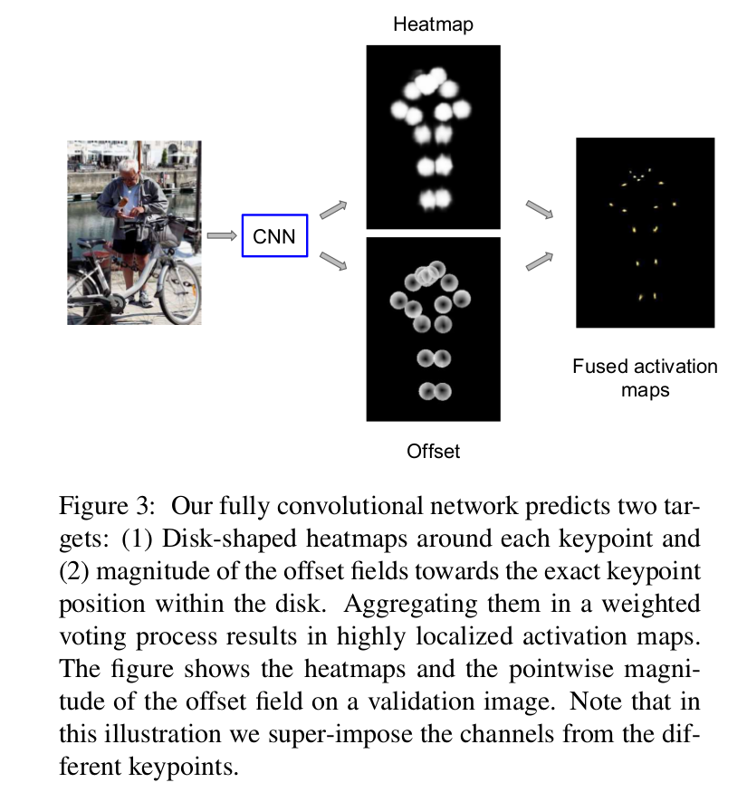
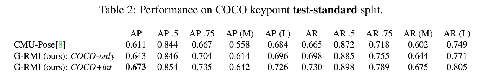
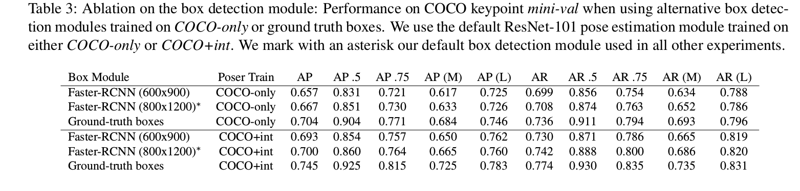

Towards Accurate Multi-person Pose Estimation in the Wild
=

# 1. Introduction
人的视觉解释在寻求全面的图像理解中起着核心作用。了解他们参与的活动，了解人们为了虚拟/增强现实而移动的方式，并从中学习如何指导自动化系统。实现这些目标的一个主要基石是人体姿势估计的问题，定义为人体手臂、腿部的关节，以及躯干和脸部的关键点上的二维定位。

由于CNN的发展，这项工作取得巨大进步。然而，大多数先前的工作集中于预测单个人的姿态的简单设置，假设人的位置和尺度以 ground-truth 边界框或躯干关键点位置的形式提供，如在流行的MPII中[2] ]和FLIC [40]数据集。

本文中，在本文中，我们解决了“野外（in the wild）”姿态检测的更具挑战性的设置，其中我们没有提供人物实例的 ground-truth 位置或尺度。由于这将人体检测和姿态估计问题结合，因此会更加困难。在拥挤的场景中，其中的人相互紧邻，很难解决确定哪个身体部位属于哪个人的相应问题。

最近发布的COCO人提关键点检测数据集和相关挑战[31]为鼓励研究、建立指标和衡量这项任务的进展提供了极好的工具。它通过关节 17 个关键点标注（12个身体关节和5个人脸 landmark）扩展了 COCO 数据集。数据集中的大量人体仅部分可见。在 COCO 关键点任务中 ground-truth 和预测姿态之间的匹配程度公国对象关键点相似度衡量（object keypoint similarity: OKS），其中范围从 0 （poor match）到 1 （完美匹配）。基准中的组合人检测和姿势估计系统的总体质量是根据OKS引起的平均精度（AP）度量来测量的。

用于处理多人姿态估计问题的方法有两种： _bottom-up_ ，其中将关键点提议组合成人体实例； _top-down_ ，其中将姿态估计器应用到边界框人体检测器的输出中。最近的工作 [35,25,8,24] 提出了自下而上的方法; 在他们的实验中，他们提出的自下而上的方法优于他们所比较的自上而下的基线。

相比之下，在这项工作中，我们重新审视了自上而下的方法，并表明它可以令人惊讶地有效。所提出的系统是一个两阶段的管道，其中最先进的组成部分精心适应我们的任务。为此，我们在ResNet-101 CNN [22]之上使用Faster-RCNN方法[37]，由[23]实现。为此，我们使用应用全卷积形式的ResNet[22]，以预测关键点的激活热图和偏移，接着使用一种新颖的热图偏移聚合形式来组合它们的预测。我们通过直接构建OKS指标（我们称之为OKS-NMS）的新型基于关键点的非最大值抑制（NMS）机制来避免重复的姿势检测，而不是更粗糙的边界框级的 IOU NMS。我们也提出一种新颖的基于关键点置信度图的估计器，与使用Faster-RCNN 边界框得分与我们的最终姿势提案议排名相比，我们显示导致AP大大改善。

# 2. Related Work
在其历史的大部分时间里，人体姿态估计的研究很大程度上基于基于部分模型的思想，这是由Fischler和Elschlager的Pictorial Structures（PS）模型开创的[16]。基于这一理念的第一个实用且性能良好的方法之一是Felzenswalb等[15]的可变形组件模型（DPM），它激发了大量关于二维人体姿态推理的概率图模型的研究[3， 12,39,47,11,28,34,40,18]。这些方法中的大多数侧重于为高度清晰的模型开发易处理的推理程序，同时捕获身体部位和属性之间的丰富依赖性。

**Single-Person Pose** 随着DCNN在视觉任务方面的进步，[45, 27, 44, 10, 33, 2, 7, 6, 20, 25, 8]使用 CNNN 在姿态估计上获得最佳性能。这些问题可以形式化为回归任务，如Toshev和Szegedy等的工作，使用一系列检测器从裁剪的输入块中进行自上而下的进行姿态细化。或者，Jain等人[27]在图像补丁上训练CNN，在推理时卷积地应用，以独立地推断每个关键点的热图（或活动图）。此外，他们使用“类似DPM”的图形模型后处理步骤来过滤热图电位并施加关节间一致性。遵循这个工作，Tompson等人[44]使用在整幅图像（而非图像剪裁）上训练的多尺度全卷积架构来推断热图，并更加[27]重构了一个图模型——将树结构简化为星图并重写信念传播消息——因此整个系统可以端到端训练。

。。。

# 3. Methods

我们的多人姿态估计系统是两步级联的，如图1所示。我们的方法受最近的最佳对象检测系统（如[17,43]）启发，其在第一阶段提议以类别无关的形式的对象，在第二阶段细化它们的标签和位置。我们的方法的第一阶段可以视为提议机制，然而其中仅包含一种形式的对象——人。我们的第二阶段视为精炼过程，其中（i）超越边界框并预测关键点，以及（ii）基于估计的关键点重新为检测评分。为了计算效率，我们只前向传动得分高于0.3的第二阶段人体边界框检测提议，平均每个图像仅提出3.5个提议。

## 3.1. Person Box Detection
我们的人体检测器是一个 Faster-RCNN系统[37]。本文使用 ResNet-101 网络骨干，通过 atrous 卷积修改以生成更密集的特征图，其输出步长等于 8 个像素而不是默认的32个像素。我们也尝试了 Inception-ResNet 骨干。

CNN 骨干在ImageNet上预训练。Faster-RCNN仅使用COCO数据集上的人训练。不使用多尺度验证或模型集成。

## 3.2. Person Pose Estimation
在给定由第一阶段提供的每个人边界框提议的情况下，我们系统的姿态估计组件预测所有 $K = 17$ 个人关键点的位置。

一种方法是每个关键点使用一个回归量，如[45]，但是当图像补丁中有多个人时（这种情况下关键点可能出现在多个地方），这是有问题的。解决这个问题的另一种方法是预测激活图，如[27]所示，它允许对同一关键点进行多次预测。然而，激活图的大小，并因此的定位精度，被网络输出特征图的大小限制，由于最大池化的使用，其仅是输入图像大小的一部分。

为了处理上述限制，我们采用结合分类和回归方法。对于每个空间位置，我们首先分类它是否在每个 $K$ 关键点附近（我们称之为“热图”），然后预测2-D位置偏移向量以获得对应关键点位置的更精确估计。注意，这种方法受到对象检测工作的启发，其中相似的设置用于预测边界框，例如[14,37]。图2展示了每个关键点的三个输出通道。

**Image Cropping** 我们首先通过延长人物检测器返回的边界框的高度或宽度来使所有盒子具有相同的固定纵横比，而不会扭曲图像纵横比。之后，我们进一步扩大框以包括额外的图像上下文： 我们在评估期间使用等于1.25的重新缩放因子，在训练期间使用1.0到1.5之间的随机重新缩放因子（用于数据增强）。然后，我们从结果框中裁剪图像并调整高度为353和高度为257像素的固定裁剪。我们将宽高比值设置为 $353/257 = 1.37$ 。

**Heatmap and Offset Prediction with CNN** 我们在剪裁图像上以全卷积的形式使用 101 层的ResNet 来产生热图（每个关键一个通道）和偏移（每个关键点两个通道，分别为 $x$ 和 $y$ 方向），共计 $3 \cdot K$ 个输出通道，其中 $K = 17$ 为关键点数。我们从[22]的公开可用的Imagenet预训练ResNet-101模型初始化我们的模型，用 $3 \cdot K$ 输出的 $1 \times 1$ 卷积替换其最后一层。我们遵循[9]个方法： 我们采用 atrous 卷积以生成具有输出步长为 8 个像素的 $3 \cdot K$ 个预测，并线性地将它们上采样到 $353 \times 257$ 剪裁大小。

更详细地，给定图像剪裁，如果第 $k$ 个关键点定位于位置 $x_i$ ，则令 $f_k(x_i) = 1$；否则，$f_k(x_i) = 0$ 。这里， $k \in \{1, \cdots, K\}$ 是关键点类型的索引， $i \in \{1, \cdots, N\}$ 是 $353 \times 257$ 的图像剪裁网络中像素位置的索引。训练CNN以在精细分辨率空间网格上直接产生高度局部化的激活 $f_k$ （理想地是delta函数）是困难的。

相反，我们将问题分解为两个阶段。第一，对于位置 $x_i$ 和每个关键点 $k$ ，如果 $||x_i - l_k|| < R$ ，则计算概率 $h_k(x_i) = 1$ ，即点 $x_i$ 在由第 $k$ 个关键点的位置 $l_k$ 确定的半径为 $R$ 的圆内。我们生成 $K$ 个这样的热图，独立地解决每个位置和关键点的二元分类问题。

除了热图外，我们还为每个位置 $i$ 和每个关键点 $k$ 独立地预测从像素到对应关键点的2-D偏移向量2-D偏移向量 $F_k(x_i) = l_k - x_i$ 。

在生成热图和偏移后，我们聚合它们以产生高度定位化的激活图 $f_k(x_i)$ 如下：
$$f_k(x_i) = \sum_j \frac{1}{\pi R^2} G(x_j + F_k(x_j) - x_i) h_k(x_j)  \tag 1$$
其中 $G(\cdot)$ 为双线性插值核。这是Hough投票的一种形式：图像裁剪网格中的每个点 $j$ 使用其对每个关键点的位置的估计进行投票，投票由它在相应关键点的影响范围中的概率加权。归一化因子等于圆的面积，并确保如果热图和偏移是完美的，那么 $f_k(x_i)$ 将是以第 $k$ 个关键点的位置为中心的单位质量delta函数。

这一过程如图3所示。我们看到，预测单独的热图和偏移通道并通过建议的投票过程融合它们会产生高度定位的激活图，其精确地确定关键点的位置。

**Model Training** 我们使用具有两个卷积输出头部的单一ResNet模型。第一个头部的输出传入 sigmoid 函数以为每个位置 $x_i$ 和每个关键点 $k$ 产生热图概率 $h_k(x_i)$ 。训练目标 $\bar{h}_k(x_i)$ 为0和1的映射，即，如果 $||x_i - l_k|| \le R$ ，则 $\bar{h}_k(x_i) = 1$ ; 否则 $\bar{h}_k(x_i) = 0$ 。相应的损失函数 $L_h(\theta)$ 为每个像素位置和关键点的 logistic 损失之和。为了加速训练，我们遵循 [25]，并在ResNet的中间层50处添加额外的热图预测层，其贡献了相应的辅助损失项。

对于训练偏移回归头部，我们惩罚预测和 ground-truth 偏移之间的差异。相应的损失为：
$$L_o(\theta) = \sum_{k=1:K, i:||l_k - x_i|| \le R} H(||F_k(x_i) - (l_k - x_i)||) \tag 2$$
其中 $H(u)$ 为 Huber robust 损失， $l_k$ 为第 $k$ 个关键的位置，并且我们只计算每个关键点半径为 $R$ 的圆内位置 $x_i$ 的损失[37]。

最终的损失函数为
$$L(\theta) = \lambda_h L_h(\theta) + \lambda_o L_o(\theta) \tag 3$$
其中 $\lambda_h = 4$ ， $\lambda_o = 1$ 。我们在每个mini-batch中对这个损失求和，然后应用随机梯度下降。

模型训练中的一个重要考量是如何在计算热图损失时处理图像裁剪中存在多个人的情况。当在中间层计算热图损失时，我们排除圆周围的背景人体的关键点的贡献。当最后层计算热图损失时，我们仅将前景人体关键点周围的圆视为正类，而其他的一切视为负类，迫使模型正确地预测边界框中心的人体关键点。

**Pose Rescoring** 在测试时，我们将模型应用到每个图像剪裁。我们不仅仅依靠人检测器的置信度，而是计算出精确的置信度估计值，该估计值考虑了每个关键点的置信度。特别地，我们最大化位置和平均关键点，产生我们的最终实例级姿态检测得分：
$$score(I) = \frac{1}{K} \sum_{k=1}^K \max_{x_i} f_k(x_i) \tag 4$$
我们发现， 与通过Faster-RCNN边界框检测器计算的得分相比，使用公式4排序我们系统的姿态估计提议显著提高了 AP 。

**OKS-Based Non Maximum Suppression** 遵循标准实践，我们使用非最大抑制（NMS）来消除人检测器阶段中的多个检测。衡量重叠的标准方式是使用边界框的 IoU 。我们提出一种更精细的变体，其考虑了关键点。特别地，我们使用两个候选姿态检测的对象关键点相似度（Object Keypoint Similarity: OKS）来衡量重叠。通常，我们使用相对较高的 IoU-NMS 阈值（我们的实验中使用0.6）来过滤高度重叠的边界框。在姿势估计器的输出处的更微妙的OKS-NMS更适合于确定两个候选检测是否对应于假阳性（对同一个人的双重检测）或者是真阳性（两个人彼此非常接近）。

# 4. Experimental Evaluation
# 4.1. Experimental Setup
对于人体检测器训练，我们使用 9 个GPU。使用SGD优化，momentum为0.9 。学习率从 0.0003 开始，在 800k 步时减小10倍。训练 1M 步。

对于姿态估计器训练，我们使用8个GPU训练，批大小为 24 ，每张GPU有三张图像。我们使用固定学习率 0.005 和 Polyak-Ruppert 参数平均，这相当于在评估期间使用训练期间参数的运行平均值。我们训练了800k步。

我们所有的网络都在Imagenet分类数据集上进行了预训练[38]。为了训练我们的系统，采用两种数据变体：一个是仅使用COCO数据（COCO-only），一个是从内部数据集俯角这个数据集的样本（COCO+int）。对于COCO-only数据集，我们使用COCO关键点标注： 来自COCO train+val划分的66808张图像（273469个人体实例），我们使用62174张图像（105698个人体实例）进行模型训练，余下的图像作为mini-val 验证集。COCO-int训练集为COCO-only和额外的从Flickr随机选择的 73024 图像的并集。这个室内数据集包含额外的227029个人体实例关键点标注，它与COCO数据集没有重叠。

## 4.2. COCO Keypoints Detection State-of-the-Art

## 4.3. Ablation Study: Box Detection Module

## 4.5. OKS-Based Non Maximum Suppression

