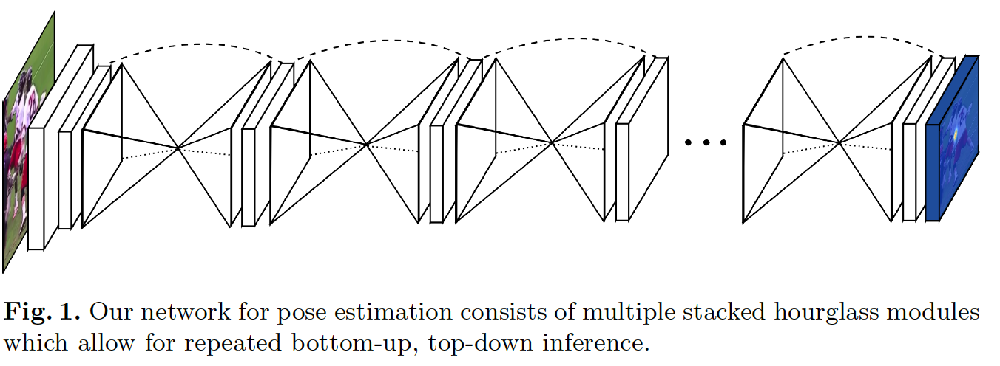
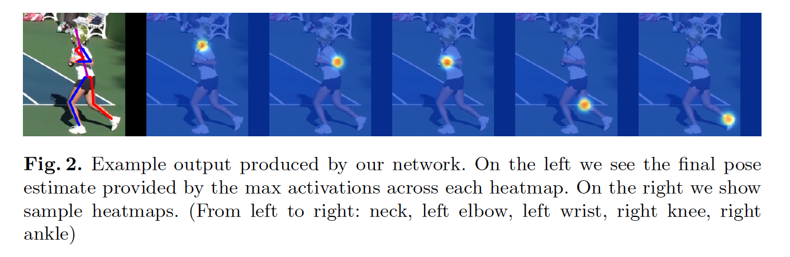
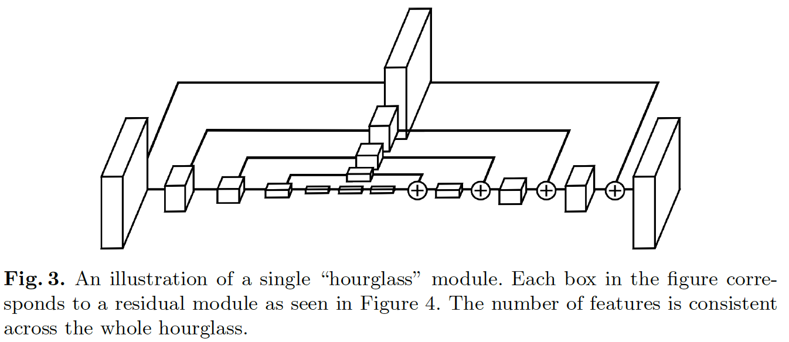
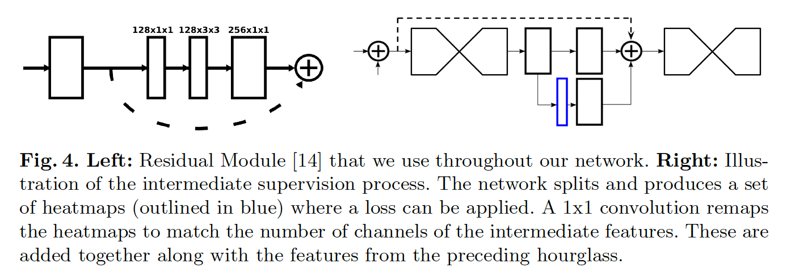
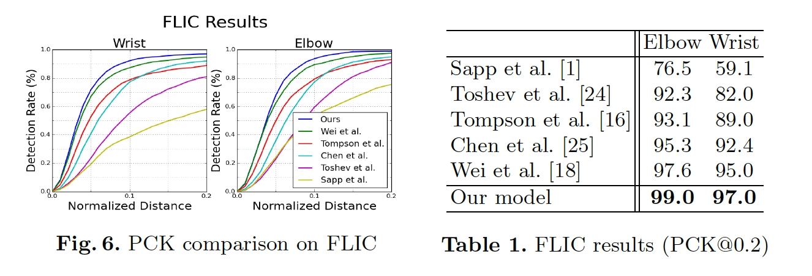
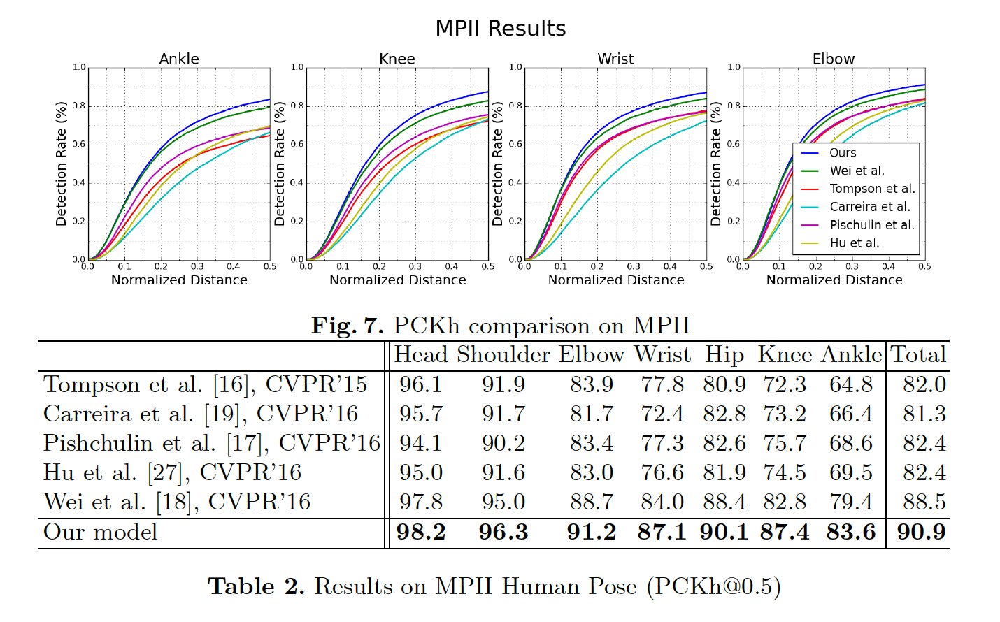
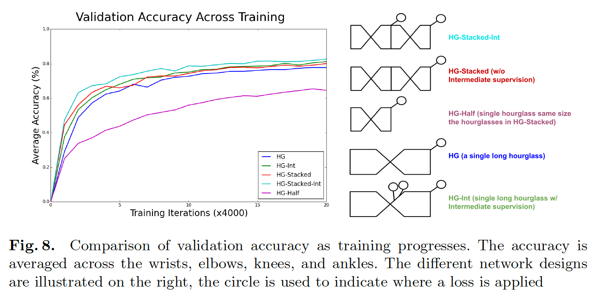

## Stacked Hourglass Networks for Human Pose Estimation

### 摘要

​		这项工作介绍了一种新颖的卷积网络体系结构，用于人体姿态估计任务。在所有尺度上处理特征并进行合并，以最好地捕获与身体相关的各种空间关系。我们展示了将重复的自下而上、自上而下的处理与中间监督结合使用对于提高网络性能至关重要。我们称这种架构为“stacked hourglass”网络，该网络基于池化和上采样的连续步骤而完成，以产生最终的一组预测。在FLIC和MPII基准测试上获得优于所有最近方法的最佳结果。

### 1	引言

​		理解图像和视频中的人的关键步骤是准确的姿态估计。给定单幅RGN图像，我们希望确定身体重要关键点的准确像素位置。对人的姿态和肢体关节的了解有助于动作识别等高级任务，也可作为人机交互和动画等领域的基本工具。

​		姿势估计作为视觉中公认的问题，多年来困扰着研究人员各种艰巨的挑战。一个好的姿势估计系统必须对遮挡和严重变形具有鲁棒性，在罕见和新颖的姿势上必须成功，并且由于诸如衣服和照明之类的因素造成的外观变化的不变。早期工作使用鲁棒性的图像特征和复杂的结构化预测[1-9]来处理如此的困难：前者用于产生局部解释，而后者用于推理全局一致姿态。

​		但是，卷积神经网络（ConvNets）[10-14]大大改变了这种传统流水线的方式，卷积神经网络是许多计算机视觉任务中性能爆炸性增长的主要推动力。最近的姿态估计系统[15-20]普遍采用了ConvNets作为其主要构建模块，在很大程度上取代了手工制作的特征和图形模型；该策略已大大改善了标准基准[1、21、22]。

​		我们继续沿着这种轨迹，并引入新颖的“stacked hourglass”网络设计用于预测人体姿态。网络捕获并整合了图像所有尺度的信息。我们基于池化步骤和随后用于获得网络最终输出的上采样步骤的可视化，将设计称为沙漏（hourglass）。与产生pixel-wise输出的许多卷积方法相似，沙漏网络池化成一个非常低的分辨率，然后对多个分辨率的特征进行上采样和整合[15、23]。另一方面，沙漏与以前的设计不同，主要是在其更对称的拓扑结构中。

​		通过将多个沙漏模块端到端连续放置在一起，我们可以扩展单个沙漏。这样可以在各个尺度之间重复进行自下而上、自上而下的推理。结合使用中间监督，重复的双向推理对于网络的最终性能至关重要。最终的网络架构在两个标准姿势估计基准（FLIC [1]和MPII Human Pose [21]）上取得了显着改善。在MPII上，所有关节的平均准确度提高了2％以上，而在较困难的关节（如膝盖和脚踝）上的平均准确率提高了4-5％。

### 2	相关工作

​		随着Toshev等[24]引入“DeepPose”，人体姿态估计上的研究从传统方法转移到深度网络。Toshev等使用它们的网络来直接回归关节的$x$、$y$坐标。相反，Tompson等人[15]的工作是通过并行运行多个分辨率中的图像来生成热图，以同时捕获各种尺度的特征。我们的网络设计主要建立在他们的工作基础上，探索如何跨尺度捕获信息并调整其方法以组合跨不同分辨率的功能。

​		Tompson等[15]提出的方法关键特点是ConvNet和图模型的联合使用。它们的图模型学习关节之间的典型空间关系。其他人最近以类似的方式[17、20、25]解决了这一问题，其中包括如何处理一元分数生成和相邻关节的成对比较的变化。Chen等[25] 将检测结果聚类为典型方向，以便当他们的分类器做出预测时，可以使用其他信息来指示相邻关节的可能位置。我们在不使用图模型或任何人体显式模型的情况下实现了卓越的性能。

​		有几个示例为姿势估计进行连续预测的方法。Carreira等[19]使用它们称为Iterative Error Feedback。输入中包含一组预测，并且每次通过网络都会进一步调整这些预测。它们的方法需要多阶段训练，并且每次迭代中共享权重。Wei等[18]基于多阶段姿势机的工作[26]，但现在使用ConvNets进行特征提取。考虑到我们使用中间监督，我们的工作在本质上与这些方法类似，但是我们的基本组成部分（沙漏模块）不同。Hu＆Ramanan [27]的架构与我们的架构更相似，也可以用于多个阶段的预测，但是它们的模型权重关系着计算的自下而上和自上而下的部分以及各个迭代之间的权重。

​		Tompson等在[15]中的工作基础上，进行了级联以做出正确的预测。这有助于提高效率并减少其方法的内存使用量，同时在高精度范围内提高定位性能[16]。一种考虑是，对于许多失败的案例，在局部窗口内的位置调整不会有太多改善，因为错误情况通常是由四肢遮挡或肢体不正确组成。 对于这两种情况，在局部范围内进行任何进一步的评估都不会改善预测。

​		姿势估计问题有所不同，包括使用其他特征（例如深度或运动提示）。[28-30]另外，同时注释多人还有一项更具挑战性的任务[17，31]。此外，像奥利维拉（Oliveira）等人的工作[32] 它基于全卷积网络执行人的关节分割[23]。我们的工作仅专注于从RGB图像对单人的姿态进行关键点定位的任务。

​		堆叠之前，我们的沙漏模块与全卷积网络[23]和其他设计紧密相关，这些设计在多个尺度上处理空间信息以进行密集预测[15，33-41]。Xie等[33]给出典型架构的总结。我们的沙漏模块与这些设计不同，主要在于其自下而上的处理（从高分辨率到低分辨率）和自上而下的处理（从低分辨率到高分辨率）之间容量的对称分布。例如，全卷积网络[23]和整体嵌套架构[33]在自下而上的过程中都很繁重，但在其自上而下的过程中却很轻便，它仅包含（加权）多个尺度的预测融合。 全卷积网络也分多个阶段进行训练。

​		堆叠之前的沙漏模块还与conv-deconv和编码器-解码器架构有关[42-45]。Noh等[42]使用conv-deconv架构来进行语义分割，Rematas等[44]使用它来预测目标的反射图。Zhao等[43]通过添加重建损失来开发一种统一的框架进行监督、无监督和半监督学习。Yang等[46]采用一种没有skip连接的encoder-decoder架构进行图像生成。Rasmus等人[47] 提出一种带有特殊“调制”跳过连接的降噪自动编码器，用于无监督/半监督特征学习。这些网络的对称拓扑结构相似，但是操作的性质非常不同，因为我们不使用非池化层或反卷积层。相反，我们依赖简单的最近邻上采样和skip连接进行自上而下的处理。我们的工作的另一种主要差异是，我们通过堆叠多个沙漏进行重复的自下而上、自上而下推理。

### 3	网络架构

#### 3.1	沙漏设计

​			沙漏的设计受需要捕获美中尺度信息的需要。虽然局部证据对于识别如人脸和手的特征至关重要，最终的姿态估计需要对整个身体有连贯的理解。人的方位、四肢的排列以及相邻关节的关系是在不同尺度下最好识别的许多线索之一。沙漏是一种简单、最小的设计，具有捕获所有这些特征并将其组合在一起以输出像素级预测的能力。

​		网络一定有一些机制来有效处理和整合不同尺度的特征。一些方法通过使用单独的流水线来解决此问题，这些流水线以多种分辨率独立处理图像，并随后在网络中组合特征[15、18]。相反，我们选择使用具有skip连接的单流水线来保留每个分辨率的空间信息。网络在$4 \times 4$像素时达到其最低分辨率，从而允许使用较小的空间滤波器，以比较图像整个空间的特征。

​		沙漏设置如下：卷积和最大池化层用于处理低至非常低的分辨率的特征。在每个最大池化步骤中，网络分支并在原始池化之前的分辨率上应用更多卷积。在达到最低分辨率之后，网络开始上采样的自上而下序列，以及跨尺度特征的组合。为了将两个相邻分辨率之间的信息汇总在一起，我们遵循Tompson等[15]描述的过程并以较低的分辨率进行最近邻上采样，然后对两组特征逐元素相加。沙漏的拓扑结构是对称的，因此对于下行中存在的每一层，都有一个对应的上层。

​		在达到网络的输出分辨率之后，应用两个连续的$1\times1$卷积回来生成最终的网络预测。网络的输出是一组热图，其中对于给定的热图，网络可预测每个像素处出现关节的概率。完整的模块（不包括最终的$1\times1$层）如图3所示。

### 3.2	Layer Implementation

​		虽然维持了整体沙漏形状，但是在层的特定实现中仍有一些灵活性。不同的选择可能会对网络的最终性能和训练产生适度的影响。在我们的网络中，我们探索几种层设计选项。最近工作已证明具有$1\times1$卷积的规约步骤的价值，以及使用连续的更小滤波器捕获更大空间上下文的好处。[12、14]，例如，人们可以用两个单独的$3 \times 3$滤波器替换$5 \times 5$滤波器。我们测试我们的整体网络设计，根据这些见解交换了不同的层模块。从具有较大滤波器且没有规约步骤的标准卷积层切换到更新的方法（如He等[14]和基于“ Inception”的设计[12]提出的残差学习模块）后，我们经历了网络性能的提高。在使用这些类型的设计进行初始性能改进之后，对层的各种其他探索和修改对进一步提高性能或训练时间几乎没有作用。

​		我们的最终设计广泛使用残差模块。不会使用大于$3 \times 3$的滤波器，并且瓶颈限制了每一层的参数总数，从而限制了总内存使用量。我们的网络中使用的模块如图4所示。为了将其纳入整个网络设计的范围内，图3中的每个方框代表一个单独的残差模块。

​		在$256 \times 256$的完整输入分辨率上运行需要大量的GPU内存，所以沙漏的最高分辨率（以及最终输出分辨率）为$64 \times 64$。这没有影响网络产生准确关节预测的网络能力。完整的网络以步长为2的$7 \times 7$卷积层开始，接着是残差块和最大池化以带来分辨率从256降到64。沙漏之前有两个后续的残差模块，如图3所示。在整个沙漏中，所有残差块都输出256个特征。

#### 3.3	Stacked Hourglass with Intermediate Supervision

​		通过端到端堆叠多个沙漏，将一个沙漏的输出作为下一个沙漏的输入，我们进一步完善了我们的网络架构。这为网络提供了一种自下到上、自上到下的重复推理的机制，从而可以重新评估整个图像的初始估计和特征。这种方法的关键是对中间热图的预测，我们可以对其施加损失。预测是在穿过每个沙漏之后生成的，在该沙漏中，网络有机会在局部和全局环境下处理特征。后续沙漏模块允许再次处理这些高级特征，从而进一步评估和重新评估更高阶的空间关系。这类似于其他姿态估计方法，这些方法在多个迭代阶段和中间监督下表现出出色的性能[18、19、30]。

​		考虑仅使用单个沙漏模块进行中间监督的局限性。在流水线中生成初始预测集的合适位置是什么？大多数高阶特征仅在较低的分辨率下存在，除非发生上采样时才出现。如果在网络进行上采样之后提供监督，则无法在较大的全局范围内相对于彼此重新评估这些特征。如果我们希望网络进行最好地预测，则不能仅在局部尺度内评估这些预测。与其他关节预测之间的关系以及整体语境和对完整图像的理解至关重要。有可能在池化之前在流水线中更早地应用监督，但是在这一点上，给定像素处的特征是处理相对局部的感受野的结果，因此不了解关键的全局信息。

​		堆叠沙漏的重复自下而上、自上而下推理缓解这些担忧。每个沙漏模块中都集成了局部和全局信息，想要网络产生早期预测要求它对图像有一个高层次的了解，而只是通过整个网络的一部分。自下而上、自上而下的处理的后续阶段允许更深入地考虑这些特征。

​		这种在尺度之间来回移动的方法尤为重要，因为保留特征的空间位置对于进行最终的定位步骤至关重要。关节的精确位置是网络做出其他决定所必不可少的提示。对于诸如姿态估计之类的结构化问题，输出是许多不同特征的相互作用，这些特征应放在一起形成对场景的连贯理解。矛盾的证据和解剖学上的不切实际之处是在沿线某处犯了一个错误的重大遗赠，并且通过来回移动网络可以在考虑并重新考虑特征的整体一致性的同时保持精确的局部信息。

​		我们将中间预测重新映射到特征空间，方法是将它们预测为具有额外的$1\times1$卷积的大量通道。这些将被添加到沙漏的中间特征以及上一沙漏阶段输出的特征中（如图4所示）。产生的输出直接作为后续沙漏模块的输入，其生成另一组预测。在最终的网络设计中，使用8个沙漏。重要的是要注意，沙漏模块之间没有共享权重，并且使用相同的ground-truth将损失应用于所有沙漏的预测。

#### 3.4	训练细节

​		我们在两种基准测试数据集（FLIC和MPII Human Pose）上评估我们的网络。FLIC包含收集自电影的5003张图像（3987张用于训练、1016张进行测试）。图像被标注在上半身，并且大多数饰物都直面向相机。MPII Human Pose由大约25k图像组成，并带有注释，可为多个人提供40k带注释的样本（28k训练、11k测试）。没有提供测试注释，因此在我们所有的实验中，我们在训练图像的子集上进行训练，同时对约3000个样本的验证集进行评估。MPII包括从一系列人类活动中拍摄的图像，这些图像具有一系列具有挑战性的广泛表达的全身姿势。

​		训练时，输入图像的大小为$256 \times 256$，数据增强包括旋转（+/- 30度）、缩放（0.75-1.25）。由于目标人的位置是决定谁应该由网络注释的关键提示，因此我们避免了图像的翻译增强。

​		使用Torch7新能力，使用学习率为$2.5e-4$的RMSprop。学习率在验证准确率饱和时除以5。使用BN来改善训练。网络的单次前向传播花费75ms。

### 4	结果

#### 4.1. 评估

#### 4.2	消融实验

