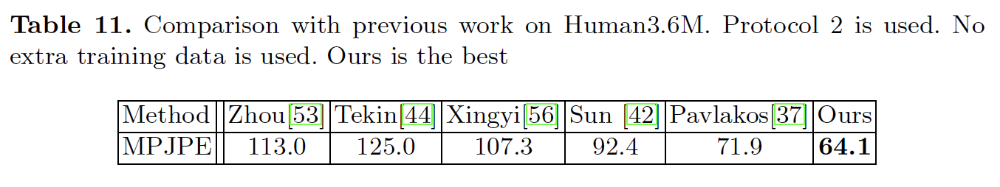

## Integral Human Pose Regression

### 摘要

​		最佳的姿态估计方法是基于热图表示。尽管表现良好，但表示形式实际上还是有一些问题，例如不可微分的后处理和量化误差。这项工作表明，一个简单的积分“integral”运算可以关联并统一热图表示，并联合回归，从而避免了上述问题。这种操作是可微的、有效的、并且兼容任何基于热图的方法。首次通过各种设置（特别是3D姿态估计）下的综合消融实验，令人信服地验证了其有效性。

### 1	引言

​		人体姿态估计已被广泛研究[24、3、28]。今年来，使用深度卷积神经网络（CNN），这个问题已取得明显进步。2D姿态估计上的最佳表现的方法是基于检测的[2]。它们为每个关节生成似然热图，并将关节定位为热图中具有最大似然的的点。热图也被扩展用于3D姿态估计，并显示出良好的前景[37]。

​		尽管它的良好性能，但是热图表示本质上具有一些缺点。“选取最大”操作不是可微的，并且妨碍端到端训练。由于深度神经网络中的下采样，热图的分辨率比输入图像的分辨率低。这引起不可避免的量化误差。使用更高分辨率的图像和热图有助于增加准确率，但是在计算和存储上有更高要求，特别是对于3D热图。

​		根据另一种观点，姿态估计本质上是一个回归问题。回归方法进行端到端的学习，并产生连续输出。它避免了上述问题。但是，对于2D人体姿态估计，回归方法不如基于检测的方法高效。在2D姿态基准测试的最佳表现的方法中，仅一种方法[7]是基于回归的。一种可能的理由是，回归学习比热图学习更难，因为后者受密集像素信息监督。尽管回归方法广泛用于3D姿态估计[42、55、56、31、32、30、35、43、21、14]，但是它的性能仍不能令人满意。

​		已有的方法要么基于检测，要么基于回归。两类方法之间有明显的差异，很少有研究它们的相关工作。这项工作表明，一种简单的操作可以关联和统一热图表示和关节回归。它将“taking-maximum”操作修改为“taking-expectation”。将关节估计为热图中所有位置的积分（integration），并按其概率（从似然率标准化）加权。我们称这种方法为“integral regression”。它共享热图表示和回归方法的精神，同时避免了它们的缺点。积分函数是可微的，并且允许端到端训练。它是简单的，并且几乎没有给计算和存储带来开销。此外，它可以轻松地与任何基于热图的方法结合。

​		积分操作本身并不新鲜。 它被称为_soft-argmax_，并在以前的工作中使用[27、52、45]。具体而言，两项当代工作[2、,34]也将其用于人体姿态估计。然而，这些工作仅限于消融实验。积分回归（integral regression）的有效性没有充分评估。具体而言，他们仅在性能接近饱和的MPII 2D基准上进行实验。尚不清楚该方法在其他设置（例如3D姿态估计）下是否有效。 有关更多讨论，请参见第3节。

​		因为积分回归是无参数的，并且仅将姿态表示从热图转换到关节，它没有影响其他算法设计选项，并可与他们中的任何方法结合，包括不同任务、热图与关节损失、网络架构、图像与热图分辨率。总结见图1。我们进行综合实验来研究积分回归在如此设置下的性能，并发现一致的改进。如此的结果验证积分表示的有效性。

​		我们的主要贡献是在不同实验设置下应用积分回归，并验证它的有效性。具体而言，我们首先证明积分回归明显提高3D姿态估计，确保3D和2D数据的混合使用，并在Human3.6M上获得最佳结果。2D姿态基准（MPII和COCO）上的结果也具竞争力。代码见https://github.com/JimmySuen/integral-human-pose。

### 2	Integral Pose Regression

​		给定学习到的第$k$个关节的热图$\mathbf{H}_k$，热图的每个位置表示该位置为关节的概率。获得最终关节位置坐标$\mathbf{J}_k$作为具有最大似然性的位置$\mathbf{p}$：

$$\mathbf{J}_k = \arg\max_{\mathbf{p}}\mathbf{H}_k(\mathbf{p}).\tag{1}$$

​		这种方法有两个主要缺点。首先，式（1）是不可微的，简化为后处理步骤，但是它不是学习的一部分。训练过程不是端到端的。监督仅施加到热图进行学习。

​		第二，热图将导致量化误差。由于深度神经网络的下采样步骤，热图的分辨率远低于输入图像的分辨。因此，关节定位的精度受量化因子的限制，其引起准确关节定位的挑战。使用更大的热图可以避免这个问题，但以额外的存储和计算为代价。

​		相比基于热图的方法，回归方法有两个清楚的优势。第一，学习是端到端的，并且受关节预测目标驱动，弥补了学习和推理之间的常见差距。第二，输出是连续的，原则上可以达到任意的定位准确率。这与热图中的量化问题相反。

​		我们提出了一种统一的方法，该方法将热图转换为联合位置坐标，并从根本上缩小了热图和基于回归的方法之间的差距。 它带来了原则性和实用性的好处。

​		我们的方法简单地修改式（1）中的_max_操作以获得期望：

$$\mathbf{J}_k = \int_{\mathbf{p}\in\Omega}\mathbf{p}\cdot\tilde{\mathbf{H}}_k(\mathbf{p}).\tag{2}$$

这里，$\mathbf{\tilde{H}}_k$为归一化的热图，$\Omega$为其作用域。在域中，估计的关节为所有位置$\mathbf{p}$的坐标，并通过它们的概率进行加权。

​		归一化使$\tilde{\mathbf{H}}_k(\mathbf{p})$的所有元素非负，并且相加为一。[34]已讨论了它，并且本文中我们使用softmax：

$$\tilde{\mathbf{H}}_{\mathbf{p}} = \frac{e^{\mathbf{H}_k(\mathbf{p})}}{\int_{\mathbf{q} \in \Omega}e^{\mathbf{H}_k(\mathbf{q})}}.\tag{3}$$

​		式（2）的离散形式为：

$$\mathbf{J}_k = \sum_{p_z=1}^D\sum_{p_y=1}^H\sum_{p_x=1}^W\mathbf{p}\cdot\tilde{\mathbf{H}}_k(\mathbf{p}),\tag{4}$$

默认情况下，热图为3D。它在深度、高度和宽度上的分辨率分别表示为D、H和W。对于2D热图，$D=1$。

​		以这种方式，通过将等式（4）中的积分函数附加到热图$\mathbf{H}_k$并采用$\mathbf{J}_k$的回归损失，可以增强任何基于热图的方法进行联合估计。我们称这种方法为$integral \mbox{ } pose \mbox{ } regression$。

​		积分姿态估计具有基于热图和回归方法的所有优点。式（4）中的积分函数是可微的，并且允许端到端训练。它们简单、快速和非参数化的。它可以与任何基于热图的方法结合，同时在计算和内存方面增加了可忽略的开销，无论是训练还是推理。其潜在的热图表示使其易于训练。 它具有连续的输出，并且没有量化问题。

#### 2.1	Joint 3D and 2D training

​		缺乏多样化的训练数据是3D人体姿势估计的严重问题。结合3D和2D训练已经做出了一些努力[55、31、43、51、41]。因为积分回归方法提供2D和3D姿态估计的统一设置，它是促进3D和2D联合训练的简单而通用的解决方案，并在3D人体姿态估计中处理数据问题。

​		最近，Sun等[42]介绍一种简单而高效的方法来混合2D和3D数据进行3D人体姿态估计，并表现出极大的改进。关键是将关节预测$\mathbf{J}_k$的2D部分$(xy)$从深度部分$(z)$总分离出来，使得$xy$部分可以受丰富2D数据监督。

​		由于式（4）中的积分操作的可微性，积分回归可以自然地采用这种混合技术。在我们的实验中，我们也从该技术中获得了巨大的改进，并且由于采用了整体配方，因此这种改进是可行的。

​		但是，潜在的3D热图仍不能受丰富的2D数据监督。为了处理这个问题，我们进一步将积分函数式（4）分解为两个步骤的版本，从而生成单独的$x$、$y$、$z$热图目标。例如，对于$x$目标，我们首先将3D热图集成到1D $x$热向量（heat vector），如式（5）：

$$\tilde{\mathbf{V}}_k^x = \sum_{p_z=1}^D\sum_{p_y = 1}^H \tilde{\mathbf{H}}_k(\mathbf{p}),\tag{5}$$

然后，进一步将1D $x$ heat vetor集成到$x$的关节坐标，如式（6）：

$$\mathbf{J}_k^x = \sum_{p_x=1}^W \mathbf{p}\cdot\tilde{\mathbf{V}}_k(\mathbf{p}).\tag{6}$$

对应的$y$和$z$的形式应该可以轻松推断。以这种方式，在第一步中分离$x$、$y$、$z$，其允许2D和3D混合数据训练策略。

### 3	Methodology for Comprehensive Experiments

​		这项工作的主要贡献是进行消融实验来评估不同条件下积分回归的性能的全面方法。图1展示框架和每个阶段决策选择的概览。

​		相关工作[29、34]尽在MPII基准的2D姿态估计上进行实验。也有有限的消融实验。具体而言，[29]仅提供系统级的比较结果，而没有任何消融实验。[34]研究热图归一化方法、热图正则化和骨干网络，其远不如我们的方法全面。

**Tasks**	我们的方法是通用的，可以毫无区别地用于2D和3D姿态估计任务。两个任务都获得一致的改进。特别地，2D和3D数据可以轻松地在训练中混合。3D任务得益于这种技术，并大幅领先先前的工作。

**Network Architecture**	我们使用简单的网络架构，其广泛用于诸如目标检测和分割的其他视觉任务。它包含用于从输入图像提取卷积特征的深度卷积骨干网络，以及一个浅层头部网络用来从特征估计目标输出（热图或关节）。

​		在实验中，我们证明我们的方法是一种灵活的组件，其可以轻松地嵌入到不同的骨干网络，并且结果对网络容量的影响小于对热图的影响。具体而言，我们研究网络设计（ResNet和Hourglass）、网络深度（ResNet18、50、101）、多个阶段设计。

**Heat Map Losses**	在文献中，有几种热图的损失函数的选择。最广泛采用的是预测热图和地热图之间的均方误差（或L2距离），热图都是以ground-truth关节位置为中心的二维高斯斑点[48、49、6、33、10、12、13、5]。在这项工作中，高斯斑点的标准差$\sigma=1$。具有这种损失的极限表示为$H1$（$H$为热图）/

​		Mask RCNN工作使用独热的$m \times m$的ground-truth掩膜，其中仅一个位置被标记为关节。他们使用$m^2$路softmax输出上的交叉熵损失。具有这种损失的基线表示为$H2$。

​		另一线工作[38、22、36]解决一个每像素的二值分类问题，因此使用二值交叉熵损失。每个热图中的每个位置被分类为是否为关节。遵循[38、22]，通过在ground-truth关节为中心的15个像素内的每个位置分配一个正标签1，否则为负标签0，构造每个关节的ground-truth热图。这种实现的基线表示为$H3$。

​		在这个实验中，我们证明了我们的方法可以很好地与所有这些热图损失一起工作。尽管，这项手工设计的热图损失可能在不同任务上有不同的性能，并且需要仔细的网络超参数调整，但是它们的积分版本（$I1$、$I2$、$I3$）将得到显著改进，并产生一致的结果。

**Heat Map and Joint Loss Combination**	对于关节坐标损失，我们利用预测关节和ground-truth关节之间的$L1$和$L2$距离作为损失函数。我们发现$L1$损失始终比$L2$损失好。因此，在我们的实验中，我们采用$L1$损失。

​		注意，我们的积分回归可以用或者不用中间热图损失。对于后一种情况，积分回归的变体定义为$I^\ast$。网络相同，但是热图上没有使用损失。训练监督信号仅在关节上，没有在热图上。在实验中，我们发现有货没有热图监督，积分回归都能起作用。最佳的性能依赖特定的任务。例如，对于2D任务$I1$，获得最佳性能，而对于3D任务$I^\ast$，获得最佳性。

**Image and Heat Map Resolutions**	由于热图的量化误差，高分辨率图像和热图通常需要高定位准确率。在实验中，我们证明，我们的方法对于图像和热图分辨率的变化更鲁棒。当计算能力受限时，这是更好的选择。

### 4	数据集和评估度量

...

### 5	实验

**Training**	采用ResNet和Hourglass（Human3.6M和MPII上为ResNet和Hourglass，COCO上为ResNet-101）作为骨干网络。在ImageNet分类数据集上预训练ResNet。从头训练Hourglass。

​		热图的头部网络是全卷积的。它首先使用反卷积（$4 \times 4$的核，步长为2）来将特征图上采样至需要的分辨率（默认为$64 \times 64$）。将输出通道数固定为256。然后，使用$1\times1$卷积层生成$K$个热图。两种热图基线核我们积分回归都是基于这个头部网络。

​		我们还实现最广泛使用的回归头部网络作为回归基线进行比较。遵循[7、42、55、56]，首先是一个平均池化层来降低卷积特征的维度。然后，使用一个全连接层来输出$3K(2K)$关节坐标。我们将规格基线表示为$R1$（$R$表示回归）。

​		我们使用基于ResNet-50的多阶段实现，conv3块的特征作为所有阶段的输入。然后，每个阶段将这个特征与前一阶段的热图拼接，并传过conv4和conv5块以生成它自己的深度特征。然后附加热图头部以输出特图，并使用ground-truth和损失监督。依靠在热图上使用损失函数，将这种多阶段基线表示为$MS-H1(2,3)$。

​		使用MxNet实现。采用Adam作为优化器。输入图像为$256 \times 256$。数据增强包括随机平移（图像大小的$\pm2%$）、缩放（$\pm25%$）、旋转（$\pm30$度）和翻转。在所有实验中，基线学习率为$1e-3$。当验证集上损失饱和时，将学习率衰减至$1e-5$。每个方法训练足够的迭代次数直到验证集性能饱和。批大小为128。使用四张GPU。

​		对于积分回归方法（$I1$、$I2$、$I3$和它们的多阶段版本），仅使用热图损失预训练网络，它们的$H$版，仅使用积分损失。我们发现这种训练策略略好于使用两种损失的从头训练。

#### 5.1	MPII上的实验

​		因为MPII测试集没有可用的标注，所有消融研究在大约3k验证集上进行，该数据集从训练集分离出，遵循[33]中的常用实践。在余下的训练数据上进行训练。

​		**Effect of integral regression** 	表1介绍了全面的比较。我们首先注意到，所有积分回归方法（$I1$、$I2$、$I3$）明显好于基于热图的副本（$H1$、$H2$、$H3$）。

**Effect of resolution**	表2比较使用两个输入图像大小和两种输出特征图大小的结果。

**Effect of network capacity**	表3给出两种方法上使用不同骨干的结果。

**Effect in multi-stage**	表4给出我们的有或没有使用积分回归的多阶段实现的结果。

**MPII测试基准上的结果**

#### 5.2	COCO上的实验

#### 5.3. Human3.6M上的实验

​		在文献中，有两种广泛使用的评估协议。它们有不同的训练和测试数据划分。

​		_Protocol 1_	训练中使用了六个科目（S1、S5、S6、S7、S8、S9）。在Subject 11的每个第64帧上进行评估。PA MPJPE用作度量。

​		_Protocol 2_	使用5个科目（S1、S5、S6、S7、S8）训练。在subject（S9、S11）上的第64帧进行评估。MPJPE用作评估。

​		关于是否使用额外的2D数据，使用了两种训练策略。策略1仅使用Human3.6M数据进行训练。对于积分回归，我使用式（4）。策略2混合Human3.6M和MPII数据进行训练，每个mini-batch包含一半2D和一半3D样本，其被随机采样和打乱。在这种策略中，我们使用两步积分函数式（5）（6）使得我们可以在热图和关节损失上添加2D数据进行训练，如2.1节解释的。

**积分回归的影响**	表7在两种训练策略下将积分回归（$I^\ast$、$I1$、$I2$）与对应的基线（R1、H1、H2）。使用协议2。骨干为ResNet50。我们观察到几个结论。

​	

**骨干网络的影响**	见表8。

**分辨率的影响**

**与SOTA的比较**

