## Fast Human Pose Estimation

### 摘要

​		已有人体姿态估计方法通常仅考虑如何改进模型的泛化性能，但是把明显的性能问题放在一边。这导致开发了在实际使用中具有较差的可伸缩性和成本效益的重型模型。在这项工作中，我们调查了未被充分研究但实际上很关键的姿态模型效率问题。为此，我们提出一种新的Fast Pose Distillation（FPD）的模型学习策略。具体而言，FPD训练了一种轻量级的姿态神经网络架构，该架构能够以较低的计算成本快速执行。它是通过有效地传递强大的教师网络的姿态结构知识来实现的。广泛的评估表明，就两个标准基准数据集MPII Human Pose和Leeds Sports Pose的模型成本效益而言，我们的FPD方法在广泛的最新姿态估计方法方面具有优势。

### 1. 引言

​		随着各种深度CNN模型的快速发展，人体姿势估计已取得了显着进展[30、8、10]。这是因为即使存在不受约束的人体外观、观看条件和背景噪音，深度神经网络也擅长估计从任意人的图像映射到关节位置的复杂和非线性映射函数。

​		然而，模型性能的优势是训练和部署深度和宽度较大的资源密集型网络的成本。这造成无效的模型推理，需要数十个浮点运算（FLOP）的每幅图像计算成本，因此可伸缩性较差，尤其是在资源受限的设备（例如智能电话和机器人）上。最近有尝试对网络参数进行二值化以加快模型执行速度[7]，但模型泛化能力却很弱。

​		在这项研究中，我们考虑在没有性能衰退下的提高姿态估计效率的问题。我们注意到，由于每层通道数量大且训练起来较困难，因此用于建立最新的人体姿态网络（例如Hourglass [19]）的基本CNN构建块在建立小型网络方面不具有成本效益。为了克服这些障碍，我们设计了Hourglass网络的轻量化变体，并提出一种以知识蒸馏形式的小型姿态网络的更有效的训练方法。我们称所提出的方法为Fast Pose Distillation（FPD）。与性能最高的替代姿态方法相比[32、10]，所提出的FPD方法能够以更快的速度和更具成本效益的模型推断，以极小的模型尺寸，同时达到相同的人体姿态预测性能水平。

​		我们的贡献如下：

（i）我们调查了未被充分研究的人体姿势模型效率问题，这与现有的尝试主要侧重于在部署时以高昂的模型推理成本提高准确性性能的尝试相反。对于将现有的深度姿势估计方法扩展到实际应用中，这是一个需要解决的关键问题。

（ii）我们提出Fast Pose Distillation（FDP）模型训练方法确保更有效地训练极小的人体姿态估计CNN网络。这是基于知识蒸馏的思想，其在目标分类深度模型中已得到成功探索。特别是，我们导出了姿态知识蒸馏学习目标，以将潜在知识从预先训练的较大的教师模型迁移到微小的目标姿势模型（将在测试时间内部署）。在计算预算非常有限的情况下，此方法旨在仅使用类似功能强大的替代方案所需成本的一小部分（少于20％）来追求最佳模型性能。

（iii）我们设计了一个轻量级的Hourglass网络，该网络能够构建更具成本效益的姿态估计CNN模型，同时保留足够的学习能力以实现令人满意的准确率。 这是通过广泛研究现有的最新技术CNN架构设计的冗余度来实现的。

​		在评估中，我们进行了广泛的实证比较，以验证所提出的FPD方法相对于各种最先进的人体姿势估计方法的有效性和优越性，在两个常用基准数据集MPII Human Pose [1]和Leeds Sports Pose [15]的模型推理效率和预测性能之间取得平衡。

### 3. Fast Human Pose Estimation

​		人体姿态估计旨在预测给定图像中的人体关节的坐标。为了以监督的方式训练模型，我们经常可以访问$N$个人图像的训练数据集$\{\mathbf{I}^i,\mathbf{G}^i\}_{i=1}^N$，每个图像都用在图像空间中定义的$K4个关节标签为：

$$\mathbf{G}^i = \{\mathbf{g}_1^i,\cdots,\mathbf{g}_K^i\} \in \mathbb{R}^{K \times 2},\tag{1}$$

其中$H$和$W$分别表示图像的高和宽。一般而言，这在图像像素级上是一个回归问题。

​		_Objective Loss Function_	对于姿态模型训练，我们通常使用Mean-Squared Error（MSE）损失函数。为了表示的ground-truth关节标签，为了表示地面真关节标签，我们通过将高斯核围绕标签位置$\mathbf{z}_k =(x_k, y_k)$居中，每个关节$k$生成置信度图$\mathbf{m}_k$（$k=\{1,\cdots,K\}$）。

​		更具体地说，第$k$个关节标签的高斯置信度图$\mathbf{m}_k$写为：

$$\mathbf{m}_k(x,y)=\frac{1}{2 \pi \sigma^2}\exp\Big(\frac{-[(x-x_k)^2 + (y-y_k)^2]}{2\sigma^2}\Big)\tag{2}$$

其中$(x,y)$制定像素位置，超参数$\sigma$表示预固定的空间方差。然后得到MSE损失函数：

$$\mathcal{L}_{\mbox{mse}} = \frac{1}{K}\sum_{k=1}^K \|\mathbf{m}_k, \hat{\mathbf{m}}_k\|_2^2 \tag{3}$$

其中$\hat{\mathbf{m}}_k$称为第$k$个关节的预测置信度图。可以使用标准的SGD算法优化深度模型。

​		已有的姿态方法严重依赖大型深度神经网络来最大化模型性能，而忽略推理效率。我们通过建立轻量级的CNN架构并提出以下详细介绍的有效模型学习策略来解决此限制，以实现更高的可伸缩性。

#### 3.1. Compact Pose Network Architecture

​		人体姿态CNN模型通常包含多个具有恒等结构的重复构建块。其中，Hourglass是最常用的构建块单元之一。但是，我们发现，由于在整个架构中部署了大量的通道和模块，因此现有设计并不具有成本效益，因此导致表示能力和计算成本之间的权衡取舍。例如，[19]建议使用8个Hourglass阶段（每个阶段有9个残差块、没层有256个通道）的CNN架构。

​		因此，我们希望最大程度地减少现有CNN架构的开销，以实现更快的模型推断。 通过仔细的经验检验，我们令人惊讶地发现，在大型MPII基准测试中，有一半的阶段（即4个沙漏模块）足以实现超过95％的模型泛化能力。此外，还发现每层通道具有很高的冗余度，减少一半的数目（128）仅会导致性能下降不到1％（表5）。 基于这些分析，我们构建了一个非常轻便的CNN架构用于姿势估计，而原始设计的计算成本仅为其六分之一。 有关目标CNN架构规范，请参见表1和图1。

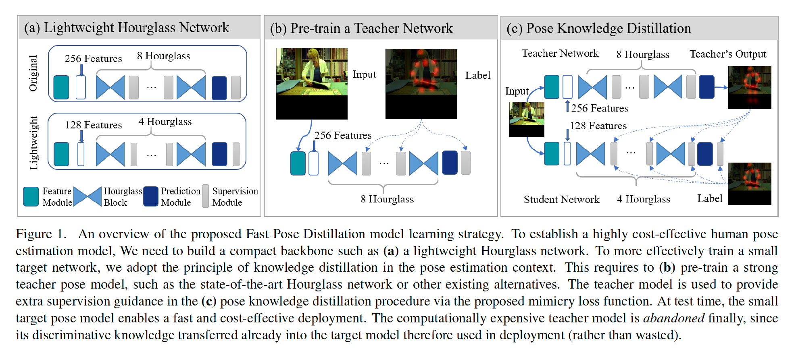

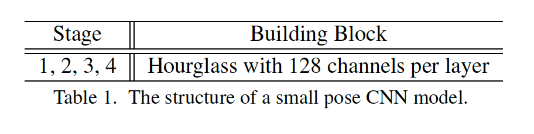

​		**Remarks**	部署廉价、快速运行的微小姿态网络虽然很有吸引力，但从经验上讲，训练它们并不是很简单的，尽管理论上浅层网络具有相似的表示能力，可以逼近较深的对等体[3、26]。通过知识蒸馏策略，在目标图像分类中也发生了类似的问题，并进行了研究，即让目标小型网络模仿大型教师模型的预测[13]。然而，目前尚不清楚这种类似方法在解决密集像素空间中的结构化人体姿态估计中将如何发挥作用。 为了回答这个问题，下面我们提出一种姿势结构知识蒸馏方法。

#### 3.2. Supervision Enhancement by Pose Distillation

​		_Model Training Pipeline_	我们采用知识蒸馏的通用模型训练策略：

1. 我们首先训练大型教师姿态模型。在我们的实验中，由于Hourglass的清晰设计和简单的模型训练，默认情况下，我们选择原始的Hourglass模型。其他更强的模型可以考虑，而没有任何限制。
2. 然后，我们借助教师模型学到的知识来训练目标学生模型。 知识蒸馏在此步骤中发生。 表1列出了学生模型的结构。

​    整个训练过程的概述如图1所示。蒸馏知识的关键是设计提取知识的关键是设计适当的模仿损失函数，该函数可以有效地提取教师的知识并将其转移到学生模型的训练中。先前的蒸馏函数设计用于目标分类场景下的基于单标签的softmax交叉熵，并且不适合迁移2D图像空间中的结构姿态知识。

​		为了处理前面提到的问题，我们设计专门用于关节置信度图的姿态蒸馏损失函数：

$$\mathcal{L}_{\mbox{pd}} = \frac{1}{K}\sum_{k=1}^K\|\mathbf{m}_k^s - \mathbf{m}_k^t\|_2^2 \tag{4}$$

其中$\mathbf{m}_k^s$和$\mathbf{m}_k^t$分别描述由预训练的教师模型预测的第$k$个关节的置信度度和训练的学生目标模型预测的第$k$个关节置信度图。我们选择MSE函数作为蒸馏量来测量学生模型与教师模型之间的差异，以最大程度地实现与姿势监督学习损失的可比性（等式（3））。

​		**Overall Loss Function**	我们将训练过程中姿态结构知识蒸馏的总体FPD损失函数表述为：

$$\mathcal{L}_{\mbox{fpd}} = \alpha\mathcal{L}_{\mbox{pd}} + (1-\alpha)\mathcal{L}_{\mbox{mse}}\tag{5}$$

其中$\alpha$为两个损失项之间的平衡权重，其通过交叉验证估计。这样，目标网络既学习通过$\mathcal{L}_\mbox{mse}$预测训练样本的带标签的ground-truth标注，又学习通过$\mathcal{L}_\mbox{pd}$匹配更强大的教师模型的预测结构。

​		**Further Remarks**	与仅使用标签数据训练的模型相比，为什么所提出的蒸馏损失函数可能有助于训练更具辨别性的目标模型？在姿态估计场景中，大量理由可以解释这一问题。

1. 由于手工标注过程中的定位真实位置的难度，身体关节标签可能是错误的。在这种情况下，教师模型可能能够通过统计学习和推理来减轻一些错误，从而减少标签错误的训练样本的误导作用（图3行（A））。
2. 给定困难的训练案例，例如背景混乱/杂乱，并且随机遮挡情况，教师预测可以通过用模型推断解释掉这些困难样本来提供软化（soft）的学习任务（图3行（B））。
3. 教师模型可能提供比原始的标准更完整的关节标签，因此不仅提供额外更准确的监督，还缓解缺失关节标签的误导（图3行（C））。
4. 与对齐的教师预测相比，学习匹配ground-truth置信度图可能更难。这是因为教师模型已经为每个训练样本难于或易于处理地散布了一些推理上的不确定性。
5. 另一方面，另一方面，教师的置信度图可以预先对从整个训练数据集中学习到的抽象知识进行编码，这可能有助于在知识提炼过程中学习每个单独的训练样本时加以考虑。

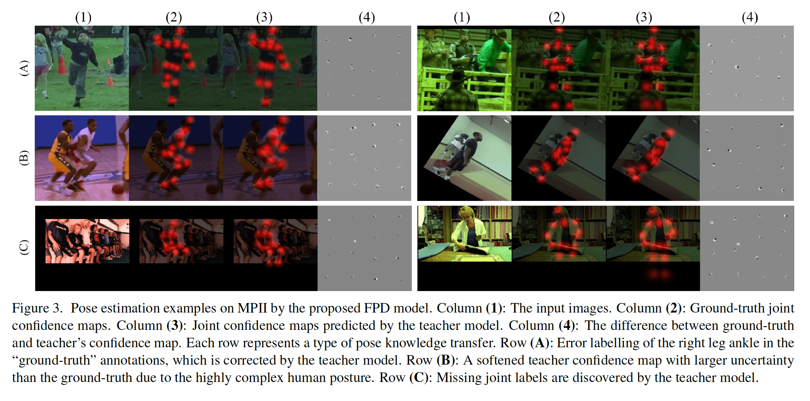

​		总之，所提出的模型能够处理错误的姿态关机标注，例如当预训练的教师比手工错误和缺失标签预测更准确的关节。由于结合使用了ground-truth标签和教师模型的预测，因此我们的模型可以容忍任何一个错误，但不能同时出现。与经常盲目地信任所有给定标签的现有方法相比，这减轻了训练数据中标签错误的危害。

#### 3.3. Model Training and Deployment

​		所提出的FPD模型训练方法包含两个阶段：（i）我们通过传统的MSE损失（式（3））训练教师姿态模型，（ii）通过所提出的损失（式（5））训练目标学生模型，并在每个小批量中以及在整个训练过程中进行从教师模型到目标模型的知识蒸馏。在测试时，我们仅使用小型的目标模型进行有效而成本高效的部署，而抛弃繁重的教师网络。目标模型已经提取教师的知识。

### 4. 实验

#### 4.1. 实现设置

​		**数据集**	MPII和Leed Sports Pose（LSP）。

​		**性能指标**	我们使用标准的Percentage of Correct Keypoints（PCK）测量，其在误差阈值$\tau$中正确预测的比例。具体而言，具体地，针对躯干（对于LSP，$\tau ＝ 0.2$，即PCK@0.2）或头部（对于MPII ，$\tau ＝ 0.5$，即PCKh@0.5）的大小对量$\tau$进行归一化。我们分别衡量每个单独的关节，并取它们的平均作为整体指标。使用不同的$\tau$值，我们生成PCK曲线。因此，可以获得Area Under Curve（AUC）作为不同决策阈值的整体衡量。为了在训练和测试中衡量模型效率，我们使用FLOP。

​		**训练细节**	我们在Torch中进行如下实验。根据提供的位置和尺度，裁剪所有的训练和测试图像，并将它们调整为$256 \times 256$像素。数据增强包括随机缩放（0.75-1.25）、旋转（$\pm30$度）和水平翻转。我们采用RMSProp优化算法。我们将学习率设置为$2.5 \times 10^{-4}$，批大小设置为4，对于MPII和LSP基准测试，epoch数量分别为130和70。对于网络架构，我们使用原始的Hourglass作为教师模型，并自定更少的深度和宽度的Hourglass作为目标模型。

#### 4.2. 与SOTA方法的比较

**Results on MPII**

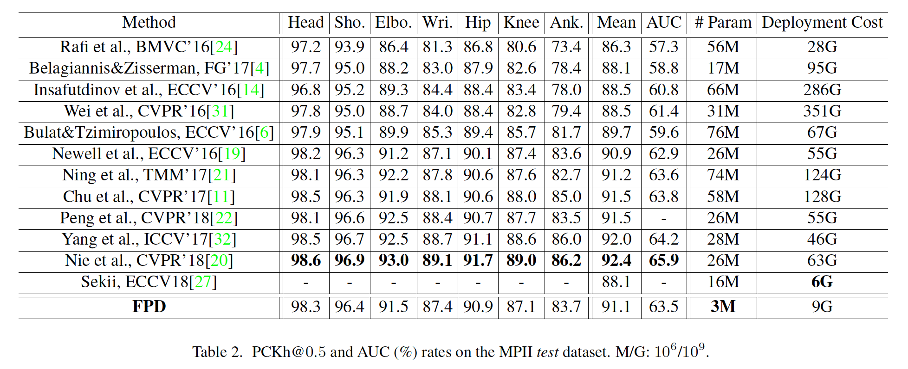

**Results on LSP**

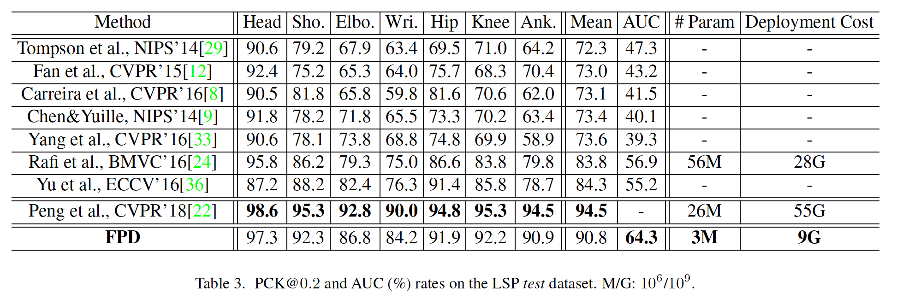

**Qualitative Examination**

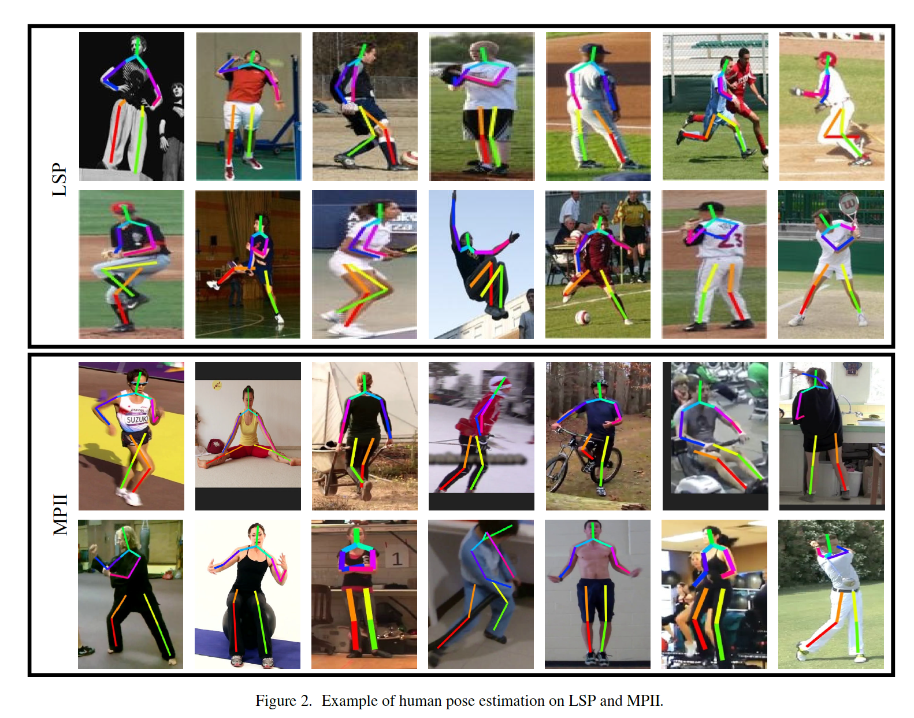

#### 4.3. 消融研究

**FPD generalisation evaluation**

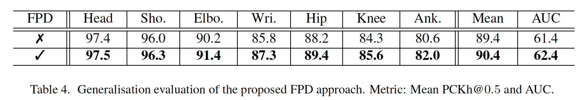

**Cost-effectiveness analysis of Hourglass**

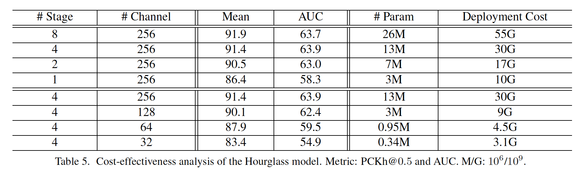

**Effect of pose knowledge distillation**

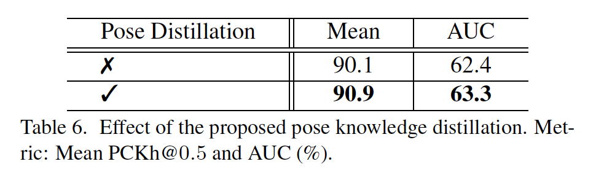

**Pose distillation loss function**

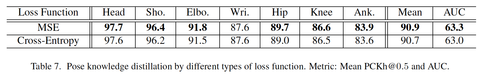

**Parameter analysis of loss balance**

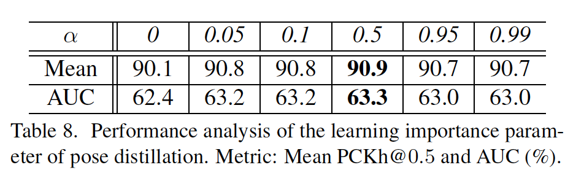

