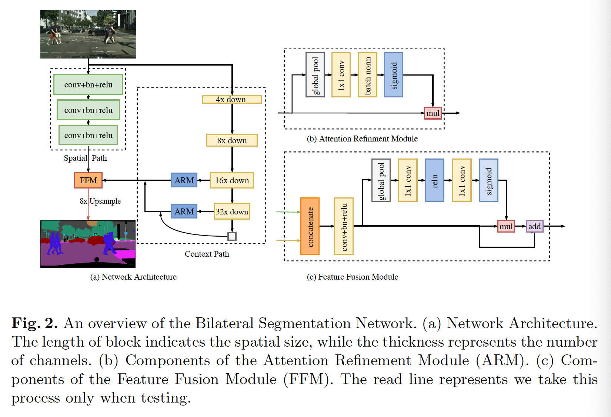
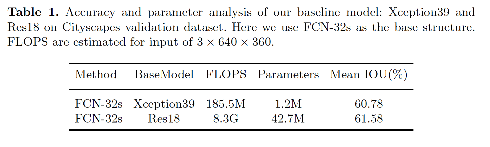
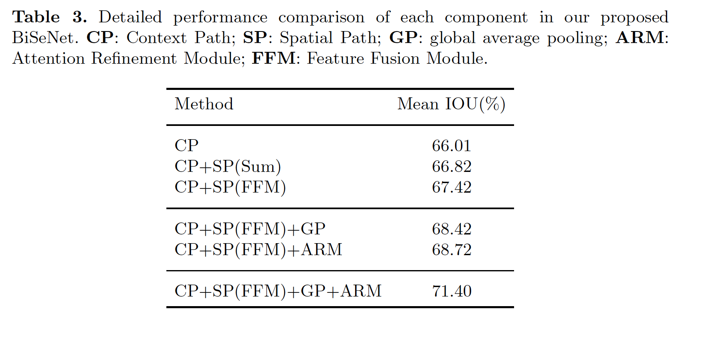
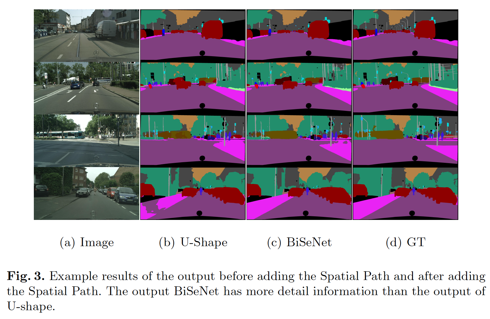
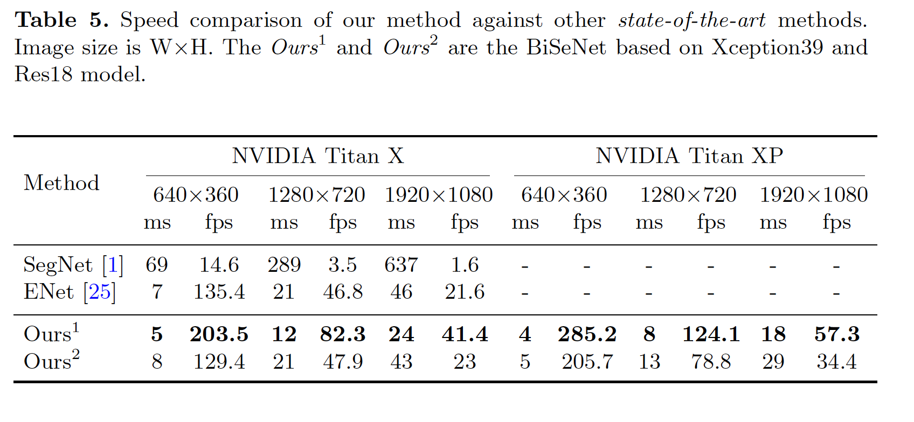
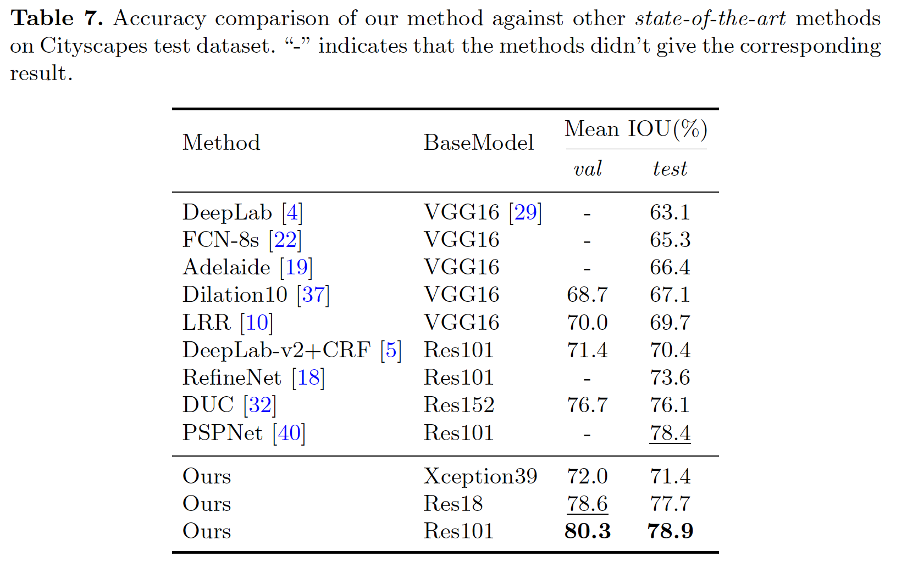

## BiSeNet: Bilateral Segmentation Network for Real-time Semantic Segmentation

### Abstract

​		语义分割需要丰富的空间信息和可观的感受野。但是，现代方法通常压缩空间分辨率以获得实时推理速度，这将产生很差的性能。本文中，我们使用新型的Bilateral Segmentation Network（BiSeNet）处理这个问题。首先，我们设计具有小步长的Spatial Path来维持空间信息，并生成高分辨率特征。同时，采用具有快速下采样策略的Context Path获得足够的感受野。在这两个路径之上，我们引入一种新的Feature Fusion Module来有效组合特征。所提出的架构在Cityscapes、CamVid和COCO-Stuff数据集的速度和分割性能之间取得了适当的平衡。具体而言，对于$2048\times2048$的输入，在NIVIDIA Titan XP卡上，Cityscapes测试数据集中以105FPS的速度获得68.4%的Mean IoU，这在相当的计算下，明显快于已有方法。

### 1	引言

​		语义分割的研究，即为每个像素分配语义标签，是计算机视觉中的一项基本任务。它广泛用于增强现实设备、自动驾驶和视频监控。这些应用对快速交互或响应的有效推理速度有很高的要求。

​		最近，实时语义分割算法[1、17、25、39]已证明有三种方法加速模型。1）[34、39]尝试通过裁剪和缩放限制输入大小以减小计算复杂度。尽管该方法简单有效，但空间细节的丢失尤其破坏了边界附近的预测，从而导致度量和可视化的准确性均下降。2）一些工作裁剪网络的通道（特别是网络早期阶段）来提升推理速度[1、8、25]，而不是调整输入图像，但是，它弱化空间能力。3）对于最后一种情况，ENet [25]建议放弃该模型的最后阶段，以追求一个非常紧凑的框架。不过，这个方法的缺点是明显的：由于ENet在最后阶段放弃了下采样操作，因此该模型的感受野范围不足以覆盖大型物体，从而导致判别能力较差。总体而言，上述所有方法都会损害速度、准确性，这在实践中是较差的。 图1（a）给出了说明。

​		为了弥补上述空间细节的损失，研究人员广泛使用了U形结构[1、25、35]。通过融合骨干网络的层次特征，U型结构逐渐增加空间分辨率，并填充一些丢失的细节。但是，这种技术有两个缺点。1）由于高分辨率特征图引入的额外计算，完整的U型结构减慢模型的速度。2）更重要地是，剪枝或裁剪过程中丢失的大多数空间信息都无法通过涉及的浅层来轻松恢复，如图1（b）所示。换句话说，U型技术最好被认为是一种慰藉，而不是关键解决方案。

​		基于上述观察，我们提出包含两部分的Bilateral Segmentation Network（BiSeNet）：Spatial Path（SP）和Context Path（CP）。正如它名字隐含的，设计这两个组件分别面对空间信息的损失和感受野的缩小。两条路径的设计理念很明确。对于Spatial Path，我们仅堆叠三层卷积以获得1/8的特征图，其保留了一个丰富的空间细节。关于Context Path，我们在Xception [8]的尾部附加一个全局平均池层，其中感受野是骨干网的最大值。图1（c）给出了这两个部分的结构。

​		为了在不损失速度的情况下追求更高的准确性，我们还研究两个路径的融合以及最终预测的精炼，并提出Feature Fusion Module（FFM）和Attention Refinement Module（ARM）。正如我们接下来实验所示，这两个额外的组件可以进一步提高Cityscapes、CamVid和COCO-Stuff基准测试上的语义分割准确率。

​		我们的主要贡献总结如下：

- 我们提出了一种新颖的方法来将空间信息保存和感受野的函数分离为两条路径。具体而言，我们提出具有Spatial Path（SP）和Context Path（CP）的Bilateral Segmentation Network（BiSeNet）。
- 我们设计两个特定的模块—Feature Fusion Module（FFM）和Attention Refinement Module（ARM）—以在可接受的成本下进一步提高准确率。
- 我们在Cityscapes、CamVid和COCO-Stuff上获得令人影响深刻的结果。更具体地说，我们在Cityscapes测试集上以105FPS的速度获得68.4%的结果。

### 2    Related Work

​		最近，许多基于FCN的方法在不同的语义分割任务的基准测试上获得最佳性能。这些方法中的大多数设计用于编码更多的空间信息或者扩大感受野。

​		**Spatial information：**CNN利用连续的下采样操作编码高级语义信息。然而，在语义分割任务中，图像的空间信息对于预测详细的输出至关重要。已有的现代方法致力于编码丰富的空间信息。DUC[32]、PSPNet[40]、DeepLabv2[5]和DeeplabV3[6]使用膨胀卷积来维持特征图感受野的大小。Global Convolution Network[26]利用“large kernel”来扩大感受野。

​		**U-Shape method：**U型结构[1、10、22、24、27]可以一定程度恢复空间信息。原始的FCN网络通过skip-connected network 结构编码不同层的特征。一些方法将其特定的结构运用到U形网络结构中。[1、24]使用反卷积层创建U型网络结构。U-net[27]为这个任务引入有用的skip connection 网络结构。Global Convolution Network[26]将U型结构与“large kernel”结合。LRR[10]采用Laplacian Pyramid Reconstruction Network。RefineNet[18]添加多路径精炼结构以细化预测。DFN[36]设计通道注意力块来获得特征选择。但是，在U型结构中，丢失的空间信息不能轻易恢复。

​		**Context information：**语义分割需要上下文信息来生成高质量结果。大多数常用方法扩大感受野或融合不同的上下文信息。[5、6、32、37]在卷积层采用不同的膨胀率，从而捕获多样的上下文信息。受图像金字塔影响，在语义分割网络结构中始终采用多尺度特征的集成。在[5]中，提出“ASPP”模块来捕获不同感受野的上下文信息。PSPNet[40]使用“PSP”模块，其包含几种不同尺度的平均池化层。[6]设计具有全局平均池化的“ASPP”来捕获图像的全局上下文。[38]通过尺度自适应卷积层改进神经网络，以获得自适应场上下文信息。DFN[36]在U型结构的顶部添加全局池化来编码全局上下文。

​		**Attention mechanism：**注意力机制可以使用高级信息来指导前馈网络[23、31]。在[7]中，CNN的注意力依赖输入图像的尺度。在[13]中，它们将通道注意力用于识别任务，并获得state-of-the-art。如DFN[36]，他们学习全局上下文作为注意力并修改特征。

​		**Real time segmentation：**实时语义分割算法需要快速的方式来生成高质量预测。SegNet[1]利用小型网络结构和skip-connected 方法获得很快的速度。E-Net[25]从头设计轻量网络，并提供极高的速度。ICNet[39]使用图像级联来加速语义分割方法。[17]采用级联的网络结构来减少“easy region”的计算。[34]设计一种新型的two-column网络和空间稀疏性以减少计算成本。不同的是，我们提出的方法采用轻量的模型以通过充足的感受野。此外，我们设置浅而宽的网络以捕获恰当的空间信息。

### 3	Bilateral Segmentation Network

​		本节中，我们首先详细介绍所提出的具有Spatial Path和Context PathBilateral Segmentation Network（BiSeNet）。此外，我们展示如何利用Feature Fusion Module组合这两个路径的特征，以及BiSeNet的整体架构。

#### 3.1	Spatial path

​		在语义分割任务中，一些已有的方法[5、6、32、40]尝试利用膨胀卷积维持输入图像的分辨率以编码足够的空间信息，而少数方法[5、6、26、40]尝试利用金字塔池化模块、ASPP或“large kernel”捕获充分的感受野。这些方法指出空间信息和感受野对于获得高准确至关重要。但是，它难以同时符合这两个要求。特别是，在实时语义分割的情况下，已有方法[1、25、39]利用小型输入图像或基于轻量的模型来加速。输入图像的小尺寸会丢失原始图像中的大部分空间信息，而轻量级模型会由于通道修剪而损坏空间信息。

​		基于上述观察，我们提出Spatial Path以维持原是输入图像的空间尺寸，并编码丰富的空间信息。Spatial Path包含三层。每层包含一个stride=2的卷积，后跟BN和ReLU。因此，这一路径提取输出特征图，其为原是图像的1/8。由于特征图的大空间尺寸，它编码了丰富的空间信息。图2（a）介绍了结构的详情。

#### 3.2	Context path

​		虽然Spatial Path编码丰富的空间信息，但是还设计Context Path来提供足够的感受野。在语义分割任务中，感受野对于性能有极大意义。为了扩大感受野，一些方法利用空间池化模块、ASPP或“large kernel”。但是，这些操作需要大量的计算和内存，这导致速度很慢。

​		考虑到较大的感受野和有效的计算，我们提出了Context Path。Context Path利用轻量模型和全局均值池化提供大型感受野。在这项工作中，轻量化模型（如Xception）可以快速下采样特征图以获得大型感受野，其编码高级语义上下文信息。然后，在清凉模型的尾部添加全局池化，其可以利用全局上下文信息提供最大感受野。最后，我们结合全局池化的上采样输出特征和轻量模型的特征。在清凉模型中，我们部署U型结构[1、25、35]以融合最后两个阶段的特征，这是不完全的U型风格。图2（c）展示了Context Path的整体结构。

​		$Attention \mbox{ } refinement \mbox{ } module$：在Context Path中，我们提出一种特定的Attention Refinement Module（ARM）来精炼每个阶段的特征，如图2（b）所示，ARM采用全局池化来捕获全局上下文，并计算注意力向量来指导特征学习。这种设计可以细化Context Path中每个阶段的输出特征。它可以轻松地集成全局上下文信息，而没有任何的上采样操作。因此，它的计算成本可以忽略。

#### 3.3	网络架构

​		利用Spatial Path和Context Path，我们提出实时语义分割的BiSeNet，如图2（a）所示。

​		我们使用预训练的Xception作为Context Path的主干，以及三层步长为2的卷积层作为Spatial Path作为主干。然后，我们融合这两个路径的输出特征以作出最后的预测。它可以同时获得实时性能和高准确率。首先，我们专注于实际计算方面。尽管Spatial Path有很大的空间尺寸，但是它仅有三个卷积层。因此，它并不是计算密集的。对于Context Path，我们使用轻量模型逐渐下采样。此外，这两个路径同时进行计算，从而大大提高了效率。其次，我们讨论这个网络的准确率方面。本文中，Spatial Path编码丰富的空间信息，同时Context Path提供大型感受野。为了更高的性能，它们相互补充。

​		$Feature \mbox{ } fusion \mbox{ }module$：两条路径的特征在特征表示级别上是不同的。因此，我们不能简单相加这些特征。Spatial Path捕获的空间信息主要对丰富的细节信息进行编码。此外，Context Path的输出特征主要编码上下文信息。换句话说，Spatial Path的输出特征是低级的，而Context Path的输出特征是高级的。因此，我们提出特定的Feature Fusion Module融合这些特征。

​		给定不同层的特征，我们首先concatenateSpatial Path和Context Path的特征。然后，我们利用BN来平衡特征的尺度。接着，我们将concatenated特征池化到一个特征向量，并计算权重向量，如SENet[13]。这种权重向量可以重新加权特征，这相当于特征选择和组合。图2（c）展示了这种设计的细节。

​		$Loss \mbox{ } function$：本文中，我们利用辅助损失函数来监督训练。我们使用principal损失函数来监督整个BiSeNet的输出。此外，我们添加两个辅助损失函数来监督Context Path，与深度监督[35]相似。所有损失函数为Softmax Loss，如式（1）所示。此外，我们使用超参数$\alpha$来平衡principal损失和辅助损失，如式（2）所示。本文$\alpha=1$。联合损失使优化器更轻松地优化模型。

$$loss = \frac{1}{N}\sum_i L_i = \frac{1}{N}\sum_i-\log(\frac{e^{p_i}}{\sum_je^{p_j}}) \tag{1}$$

其中$p$是网络的输出预测。

$$L(X;W)=l_p(X;W)+\alpha\sum_{i=2}^Kl_i(X_i;W)\tag{2}$$

其中$l_p$是concatenated输出的principal的损失。$X_i$是Xception模型的第$i$阶段的输出特征。$l_i$是阶段$i$的辅助损失。本文中，$K$等于3。$L$为联合损失函数。这里，我们仅在训练阶段使用辅助损失。

### 4	实验结果

​		我们采用修改的Exception[8]（Xception39）进行实时语义分割任务。我们在Cityscapes、CamVid和COCO-Stuff基准测试上评估BiSeNet。

​		Cityscapes：来自汽车视角的大型城市街景数据集。它包含2975张精细标注的图像用于训练，500张用于验证。在我们的实验中，我们仅使用精细标注的图像。对于测试，它提供没有gourd-truth的1525张图像用于公平比较。所有图像的分辨率为$2048 \times 1024$，其中每个像素标注为预定义的19个类。

​		CamVid：CamVid是另一个来自自动驾驶视角的街景数据集。它包含701张图像，其中367张图像用于训练，101张图像用于验证，223张图像用于测试。图像的分辨率为$960 \times 720$，$11$个语义类别。

​		COCO-Stuff：COCO-Stuff扩充流行的COCO [20]数据集的所有164,000张图像，其中118000张图像用于训练、5000张图像用于验证，2000张图像用于test-dev以及20000张图像用于测试挑战。它覆盖91的stuff类，以及1个类“unlabeld”。

#### 4.1	实现协议

​		Network：我们使用三个卷积作为Spatial Path，Xception模型用于Context Path。然后，我们使用Feature Fusion Module来组合这两个路径，从而预测最终结果。Spatial Path的输出分辨率和最终的预测为原始图像的$1/8$。

​		Training details：我们使用批大小为16、动量为0.9以及权重衰减为$1e^{-4}$的SGD。使用“poly”学习率策略，其中每次迭代学习率乘以$(1-\frac{iter}{max\_iter})^{power}$，其中$power$为0.9。初始学习率为$2.5e^{-2}$。

​		Data augmentation：我们在输入图像上使用mean subtraction、随机水平翻转和随机缩放来增强数据集。尺度包含$\{0.75,1.0,1.5,1.75,2.0\}$。最后，我们随机裁剪图像到固定的大小。

#### 4.2	Ablation study

基线：

U型的消融分析：

Spatial path、Feature Fusion Module Global Average Pooling 和 Attention Refinement Module的消融分析:

#### 4.2 	速度和准确率分析

