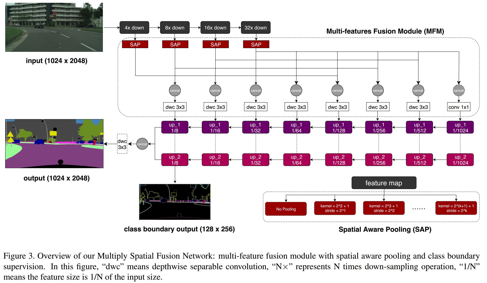
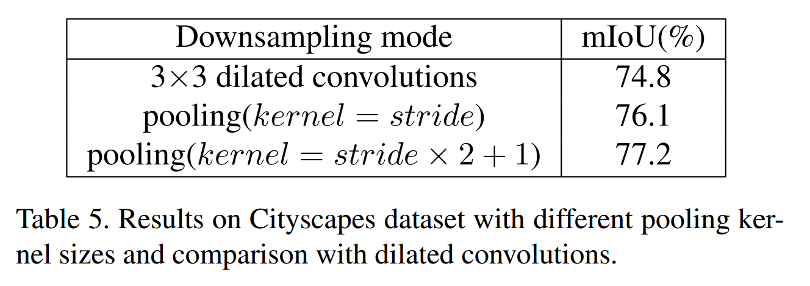
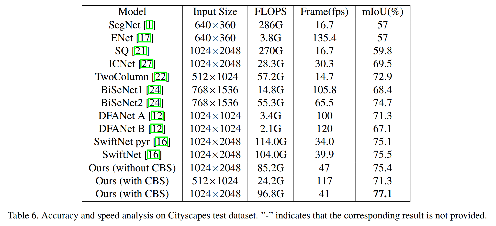
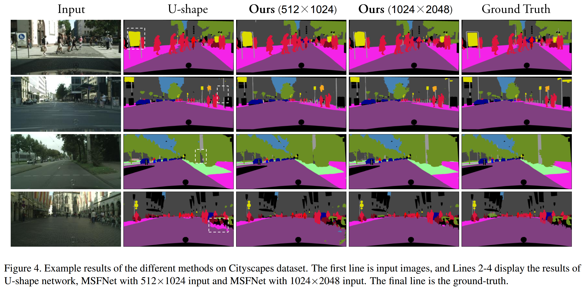

## Real-Time Semantic Segmentation via Multiply Spatial Fusion Network

### Abstract

​		实时语义分割在如自动驾驶、机器人等工业应用中扮演着重要角色。它是一个需要同时考虑效率和性能的挑战性任务。为了处理如此复杂的任务，本文提出一种称为 *Multiply Spatial Fusion Network（MSFNet）* 的高效 CNN 来获得快速而准确的感知。该算法基于多特征融合模块（Multi-features Fusion Module），利用类边界监督（Class Boundary Supervision）对相关边界信息进行处理，获取空间信息，扩大感受野。因此，对原始图像大小为 $1/8$ 的特征图进行最终上采样，可以在保持高速的同时获得令人印象深刻的结果。Cityscapes 和 Camvid 数据集上实验表明，与现有方法相比，该方法具有明显的优势。具体而言，在 Cityscapes 测试集上，对于 $1024 \times 2048$ 的输入，它以 41 FPS 的速度获得了 77.1% 的 Mean IoU，而才 Camvid 测试集上以 91 FPS 的速度获得 75.4% 的 Mean IoU 。

### 1. Introduction

​		语义分割旨在将密集标签分配给每个图像像素，并且它是计算机视觉的重要任务。提出不同的语义分割技术来支持不同的应用（例如自动驾驶、视频监控和增强现实）。现有的方法主要关注改善性能。然而，获得低延迟的实时性能是实际应用中最重要的考量。因此，如何维持高效推理和高准确率成为一个挑战性问题，特别是针对高分辨率的图像。

​		最近，越来越多的研究人员 [1、27、19] 关注实时语义分割。一些方法 [24、12] 通过减小输入图像分辨率来加速推理速度，这将严重丢失空间信息，特别是与边缘相关的空间信息。一些其他方法 [1、17] 裁剪特征通道数一减小计算成本。然而，这些解决方案减小了网络的特征提取能力，这将产生极大的性能衰减。

​		另一个实现实时语义分割的常用解决方案是使用浅层的轻量网络。然而，这些轻量级网络有明显的缺陷，因为它们通常太浅，无法达到足够的感受野。这些缺点使其难以维持目标的空间信息，并产生严重的性能衰退。此外，特征通道的数量还限制了特征表示空间。所有这些因素限制了现有的实时语义分割网络的性能。

​		为了处理实时语义分割困境，提出了许多网络架构，如图 2 所示。Spatial Pyramid Pooling（SPP）是广泛使用的扩大感受野的结构。然而，它严重增大了计算成本，并不能恢复空间的信息损失。U 形结构 [1、20] 似乎能一定程度缓解上述问题。然而，一个具有大型特征图的完整 U 形结构的需要大量计算成本。此外，通过融合特征图，它难以获得充足的感受野以及完美恢复空间信息的损失。另一个代表性结构（成为 Feature Reuse [12]）对提取特征有益，并且能扩大感受野。它具有更少参数和更快推理速度的优势。然而，与 SPP 相似，它无法恢复由于向下采样而造成的空间信息丢失。

​		通过分析已有的网络架构，我们发现关键之处是如何扩大感受野，以及恢复空间信息的损失，同时维持更小的计算成本。基于这种考量，我们提出高效的轻量网络（称为 Multiply Spatial Fusion Network：MSFNet），其可以解决上述问题。MSFNet 的核心组件是 Multi-features Fusion Module（MFM），如图 2 所示。它使所有不通过尺度的特征图与更大的特征图融合，从而扩大感受野，并恢复更多的空间信息。基于这一特殊的模块，最终的特征图（原始图像大小的 $1/8$）将包含充足的空间信息，并显著减小计算成本。此外，我们还提出 Class Boundary Supervision （CBS）来避免与边缘相关的空间信息的损失。

​		我们提出的 MSFNet 在 Cityscapes [9] 和 Camvid [3] 基准数据集上取得了令人印象深刻的结果。具体地说，我们在 Cityscapes 测试集上获得了 77.1% 的mIoU（41 FPS）和 71.3% 的 mIoU （117 FPS），在 Camvid 测试集上获得了 75.4% 的 mIoU（91 FPS）和 72.7%的 mIoU（160 FPS），优于大多数最先进的实时分割方法。

​		我们的主要贡献如下：

- 我们提出了一种新的多特征融合模块（Multi-features Fusion Mdoule: MFM），利用设计良好的空间感知池（Spatial Aware Pooling: SAP）来扩大感受野，在保持较小计算代价的同时恢复空间信息的损失。
- 我们提出一种新颖的类边界监督（Class Boundary Supervision:  CBS）来解决与边缘相关的空间信息的丢失。
- 在两个基准测试数据集上的实验表明，我们的方法在准确率和推理时间方面都比最佳的方法好。

### 2. Related Work

**Real-time Segmentation**	基于全卷积网络（FCN）的许多方法 [4、14] 已获得语义分割任务的高性能。然而，实时语义分割需要同时考虑准确率和推理速度。为了减小计算成本，SegNet [1] 提出具有 skip-connected 方法的小型网络。ENet [17] 提出更少下采样的网络来追求极端速率。ICNet [27] 使用多个输入尺寸来捕获不同大小的目标，从而提高实时语义分割的准确率。BiSeNet [24] 使用 Spatial Path 恢复空间信息，并实现实时计算。通过重新设计 Xception [8]，DFANet [12] 使用 Sub-network Aggregation 和 Sub-stage Aggregation 来获得极端速度，并维持高准确率。与现有网络架构不同，我们仔细设计了新颖的多空间融合网络来扩大感受野以及恢复空间信息的损失，同时维持较小的计算成本。因此，所提出的网络是现有实时语义分割网络架构的补充。

**Spatial Information**	下采样是语义分割的双刃剑。一方面，它扩大感受野并丰富高级特征。另一方面，它将产生严重的空间信息的损失。Paszke 等 [17] 没有使用下采样来避免空间信息的损失。Poude 等 [18] 设计了基于空间信息的轻量特征提取网络。尽管它的推理速度非常快，但是它提取的特征有限。许多网络使用 U 形结构来恢复空间信息。U-Net [20] 使用 skip connection 网络来提高基于 FCN 的准确率。然而，完整的 U 形需要大量计算成本，特别是针对高分辨率的图像。此外，仅通过融合特征图，它难以获得充足的感受野，并且完美恢复空间信息。考虑到这些缺陷，我们仔细设计了网络架构来扩大感受野，并且使轻量网络多空间信息更敏感。

**Feature Fusion**	特征融合广泛用于语义分割网络。随着网络深度增加，融合和特征重用表现出明显的优势。例如，U 形结构使用特征融合来恢复空间信息。RefineNet [13] 提出精炼网络模块来精细地融合特征。一些其他方法 [23、26、10] 使用密集连接来提高性能。DFANet [12] 提出两个特征融合方法（Sub-network Aggregation 和 Sub-stage Aggregation）来增强特征提取能力。模型广泛采用特征融合的方法，在空间信息和语义信息两方面改善了不同层次之间的交互，显著提高了网络的空间敏感性。

**Boundary Supervision**	许多使用边界监督的方法提高了分割网络的准确率。一些方法 [2、7、13] 同时训练多任务网络，其中之一是用于边界检测。大多数这些方法仅将边界框分类为一个类，并在损失函数中使用边界监督，这意味着它们仅使用边界进行辅助监督。与这些方法相比，我们使用从骨干网络提取的特征来实现具有类的边界监督。特别是，将边界特征图添加到网络以监督目标边界的空间信息。

### 3. The Proposed Method

​		在这一节中，我们将详细说明我们所提出的网络。我们首先详细介绍具有 Spatial Aware Pooling 的 Multi-features Fusion Module 。基于 Multi-features Fusion Module ，然后，我们介绍所提出的两个分支和突出 Class Boundary Supervision 。MSFNet 的整体架构如图 3 所示。

#### 3.1. Multi-features Fusion Module

​		现有的实时语义分割网络通常使用下采样来获得高级语义信息以及减小计算开销。然而，高级语义层的空间信息在多次下采样后将会严重丢失。高级特征图中的目标分辨率太小而不能准确地保留其形状。为了处理这个问题，一些方法利用 Spatial Pyramid Pooling（SPP）或者 Atrous Spatial Pyramid Pooling（ASPP）来捕获充足的感受野。然而，这些特殊的结果常常用于丰富高级语义信息，而不是低级空间信息。

​		**Spatial Aware Pooling**	基于上述分析，我们提出新颖的称为 Spatial Aware Pooling（SAP）的结构，其在骨干的每个残差块之后。为了提取丰富的特征，我们使用步长为 $s$ 、核大小为 $k=2s+1$ 的相同池化。对于高分辨率（ $1024 \times 2048$ ）的输入，我们将每个残差块的特征下采样五倍。更正式地，将残差块的输出表示为 $B_i \in R^{C \times \frac{H}{m_i} \times \frac{W}{m_i}}$ ，其中高 $H$ 和宽 $W$ 是输入尺寸，$C$ 是通道数，$m_i$ 表示步长。池化操作定义为具有步长 $s=2^j$ 和核大小为 $k=2^{j \times 2 + 1}$ 的 $\sigma^j$ ，我们设置 $j \in [1, 5]$ 。Spatial Aware Pooling 的输出可以定义为：

$$O_i^j = \begin{cases}B_i & j=0\\ \sigma^j(B_i) &\mbox{otherwise}\end{cases} \tag{1}$$

其中 $O_i^j \in R^{C \times \frac{H}{m_i \times 2^j}\times\frac{W}{m_i \times 2^j}}$ 是第 $i$ 个残差块中的 Spatial Aware Pooling  的第 $j$ 个输出。

​		特别地，$O_1^1$ 不用于上采样，因为 $O_1^1$ 的特征图的大小是原始图像大小的 $1/4$ ，而我们的网络结构直接同原始图像大小的 $1/8$ 上上采样。

​		大规模的感受野和空间信息的准确恢复是语义分割的关键。在我们的模型中，通过我们精心设计的结构，可以恢复空间信息的损失，并在一定程度上扩大感受野。此外，该方法在每个感受野都有较好的空间信息恢复能力，在不增加计算成本的前提下大大提高了性能。

​		**Feature Fusion**	我们聚合具有相同 Spatial Aware Pooling 分辨率的输出，然后使用核大小 $k=3$ 的深度可分离卷积层融合它们，这可以减少计算开销，因为聚合后通道数很大。使得，不仅骨干的不同层提取的特征可以融合以增加信息的流动性，还能增强语义层对空间信息的敏感度。

#### 3.2. Class Boundary Supervision

​		许多现有的网络上采样到原始图像大小的 $1/4$ ，然后使用双线性插值调整到原始图像大小。我们发现原始图像的 $1/4$ 比原始图像大小的 $1/8$ 大了四倍，其比原始图像的 $1/16$ 大了 16 倍。它意味着，在相同通道数的情况下，与使用 $1/u$ 的特征图大小相比，使用 $1/4$ 的特征图大小需要 4 倍的计算成本。基于我们所提出的 Multi-features Fusion Module ，我们的上采样分支可以对原始图像大小的1/8的特征图进行上采样，从而得到完美的分割结果。

​		我们注意到，编码器中浅层具有丰富的空间信息。但是，由于最终向上采样的特征图尺寸较小，无法完全恢复边缘相关信息。为了克服有上述问题引起准确率损失，我们提出一种相同而独立的多任务上采样编码器来获得类边界监督。

​		Multi-features Fusion Module 丰富了每个阶段的高质量特征，其利用一个上采样分支获得令人满意的分割结果。为了恢复边缘信息，并进一步提高分割结果，我们提出两个独立的上采样分支。在上采样过程中，两个上采样分支没有相互间的信息迁移。对于边界，我们使用ground-truth边界来监督分割任务，其更关注边缘轮廓。

​		每个上采样阶段有不同的分辨率。它有两个输入，其中之一是前一个阶段的双线性上采样特征，而另一个是与这一阶段有相同分辨率的 Multi-features Fusion Module 输出特征。最后，当分辨率为原始图像大小的 $1/8$ 时，使用深度可分离卷积融合两个上采样分支以获得最终输出，其可以略微提高速度。

#### 3.3. Network Architecture

​		综上所述，首先，多特征融合模块创新地考虑同时改善感受野信息和空间信息，且由于优化的网络结构，不增加额外的计算成本。它的密集连接架构更加有效，并且与 U 形结构完全不同。其次，我们为边缘相关的信息提取使用一个独立的分支，这可以有效地获得类边界监督，并且纠正最终的语义分割结果。

​		换句话说，我们的网络架构师典型的 encoder-decoder 架构。对于实时推理，我们不得不使用轻量架构作为 encoder 来提取特征。并且，我们使用 Multi-features Fusion Module 来支持快速上采样分支作为解码器来获得更好的结果。一个值得注意的事是，类边界监督是一个独立模块，其还可以轻松用于其他不同忘了结构。

​		**Backbone**	在我们的网络中，骨干是轻量的 ResNet-18 模型，其在 ImageNet 上预训练。如何高效地捕获语义上下文仍是语义分割的问题。相似地，我们的 Multi-features Fusion Module 还需要丰富的上下文信息。ResNet-18 模型有四个不同的残差块，每个块有两个 $3 \times 3$ 卷积和一个 skip connection。这种忘了设计可以更好地支持 Multi-features Fusion Module 的上下文需求。它可以获得实时性能和保证高质量的特征提取。

​		**Loss Function**	在我们的网络中，我们使用一个辅助的损失函数来监督一个上采样分支来提取边缘相关的空间信息。此外，我们使用一个主损失函数来监督整个网络的输出。所有损失函数都是标准的交叉熵损失，如公式（2）。此外，我们使用参数 $\lambda$ 来平衡两个损失组件之间的权重，使得网络可以更好地改善分割性能，如公式（3）。我们的网络中参数 $\lambda$ 设置为 1。

$$H_{y'}(y) = \frac{1}{N}\sum_iL_i = -\frac{1}{N}\sum_iy_i'\log(y_i) \tag{2}$$

其中 $y$ 表示网络的预测，$y'$ 表示 ground-truth 。

$$loss = H_{y_s'}(y_s) + \lambda H_{y_b'}(y_b) \tag{3}$$

其中 $y_s'$ 表示 ground-truth 语义标签，$y_b'$ 表示 ground-truth 边界。

### 4. Experiments

​		由于我们的模型为获得处理高分辨率图像的效率而设计，我们评估了两个具有挑战性和代表性的数据集（Cityscapes 和 Camvid）的性能。我们首先介绍两个数据集和实现细节。然后，我们分析所提出的网络及其组件的影响。最后，与现有的实时语义分割网络相比，我们给出了该网络的精度和速度的结果。

#### 4.1. Datasets

​		**Cityscapes** 是从 50 个不同场景收集的大型城市街景。它包含 5000 张精细标注的图像，以及 19998 粗糙标注图像，分辨率为 $1024 \times 2048$ 。根据 Cityscapes 的标准设置，将精细标注的图像划分为用于训练的 2975 张图像、用于验证的 500 张图像和用于测试的余下的 1525 张图像。此外，该数据集包含 30 个类，但仅 19 个类用于训练和评估。我们的实验仅使用精细标注的图像。

​		**Camvid** 是另一个著名的街景数据集，其从视频序列中提取。该数据集包含 701 张图像，根据通用方法，367 张图像用于训练、101 张图像用于验证、233张图像用于测试。该数据集包含 11 个类，分辨率为 $720 \times 960$ 。

#### 4.2. Implementation Details

​		使用 Adam 优化器训练我们的模型。具体而言，将 batch size 设置为12 ，weight decay 设置为 $2.5 \times 10^{-5}$ 。我们使用初始学习率为 $10^{-4}$ 的 cosine 衰减策略 [15]，最小学习为 $10^{-6}$ 。在 Cityscapes 上训练 350 个周期，Camvid 是 Cityscapes 的两倍。对于数据增强，我们使用 $[0.5, 2]$ 之间的参数来将图像变换到不同尺度，然后，在 Cityscapes 上，我们将分辨率随机裁剪到 $1024 \times 1024$ ，而在 Camvid 上，将图像裁剪到 $768 \times 1024$ 。

#### 4.3. Network Structure Analysis

​		在这一节的实验中，我们使用 Cityscapes 验证集进行评估。为了公平比较，我们没使用任何测试增强，例如多尺度预测或多模型融合。同时，为了更准确地分析实验，我们使用 mIoU 作为评估标准。

​		**Multi-features Fusion Module**	在这节中，我们探索所提出网络中的 Multi-features Fusion Module 的性能。在上采样分支中， Multi-features Fusion Module 为每个阶段提供必要的特征信息，表 1 给出了在不同阶段池化的 mIoU 。

​		表 5 为池化核的选择。

​		**Class Boundary Supervision**	表 4 给出了不同的尺寸的类边界监督带来的 mIoU 。

​		表 3 给出了 CBS 不同分支及其分支的不同组合带来的 mIoU 。

​		**The Whole Network** 图 7 为不同组件的组合的结果。

#### 4.4. Speed and Accuracy Comparison

​		表 6 为我们的模型的速度与准确率的比较，报告了 $1024 \times 1024$ 分辨率图像上 500 次预测的平均时间。

#### 4.5. Results on Other Dataset

