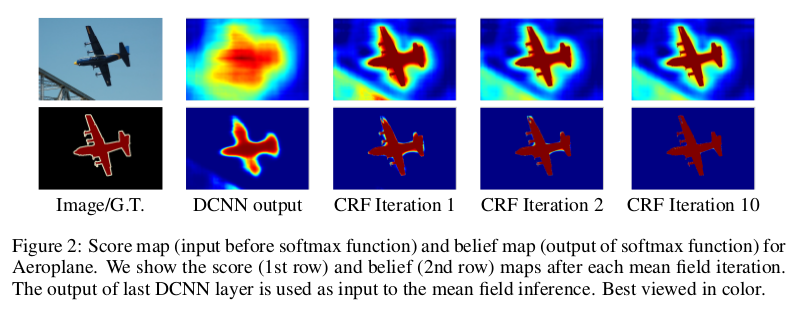
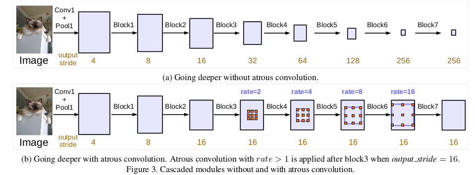
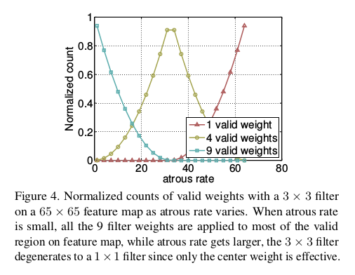
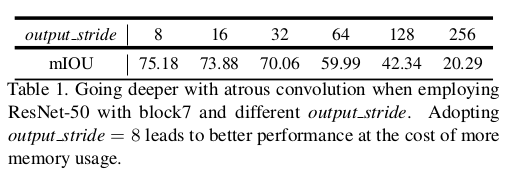
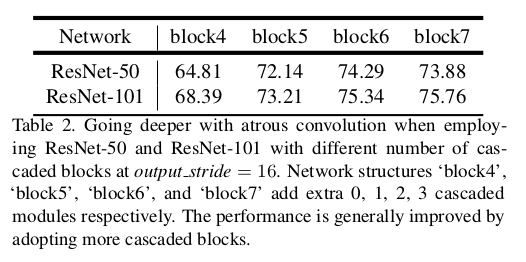
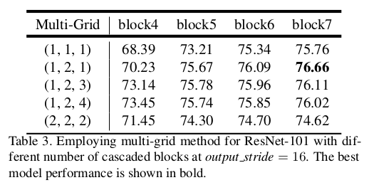
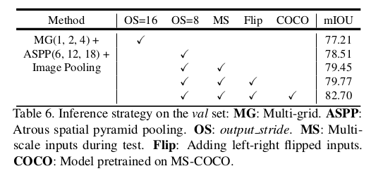
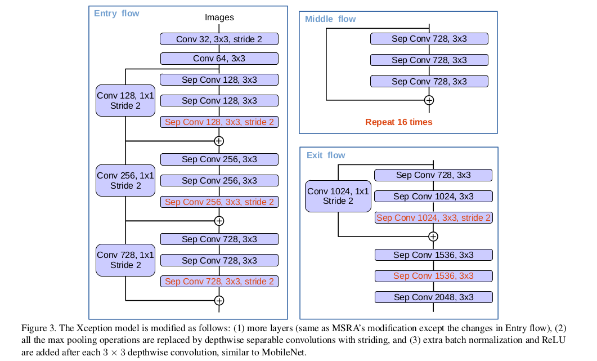
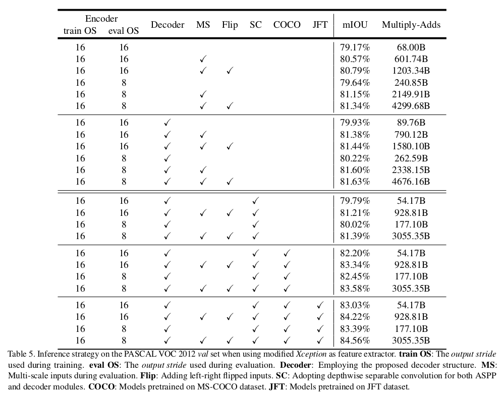

Deeplab
=

## 语义分割的要求：
- 语义分割是对图像做密集的分割任务，为每个像素指定类别。
- 将图像分割成几个有意义的目标
- 给对象分配指定类型标签

# 1 Deeplab v1 & Deeplab v2
使用CNN做密集的分类任务时，产生目标在预测图中的大概位置，但是很粗糙，而使用条件随机场可以细化分割结果。
## 1.1 核心解决思路
标准DCNN存在的问题：
- 分辨率：输出特征分辨率较小；
- 池化：对于输入变换具有内在不变性。  

针对上述问题Deeplab的解决方法：
- 使用空洞卷积；
- 使用CRF。

具体做法：
- 移除原网络中最后两个池化层；
- 使用 $rate = 2$ 的空洞卷积。

如上图，标准的卷积只能获取原图 $1/4$ 的内容，而新的带孔卷积可以在全图上获取信息。

## 2 Deeplab v1 到 Deeplab v2
### 2.1 DCCN 到 atrous

上图，由左边到右边，主要是在DCNN中应用了空洞卷积密集的提取特征，左边的输出步幅是16，需要上采样16倍得到预测结果，可以看到结果是比较模糊的；而右边是在DCNN中使用空洞卷积，保持步幅为8，只需要上采样8倍，结果清晰了很多。

### 2.2 CRF
DCNN存在分类和定位之间的折中问题，预测到目标的大概位置但比较模糊。CRF尝试找到图像像素之间的关系：相近且相似的像素大概率为同一标签；CRF考虑像素的概率分配标签；迭代细化结果。如下图。

### 2.3 Deeplab v1 结构
DeepLabv1是在VGG16的基础上做了修改：
- VGG16的全连接层转为卷积
- 最后的两个池化层去掉了下采样
- 后续卷积层的卷积核改为了空洞卷积
- 在ImageNet上预训练的VGG16权重上做finetune

### 2.4 Deeplab v2 结构
- 用多尺度获得更好的分割效果(使用ASPP)
- 基础层由VGG16转为ResNet
- 使用不同的学习策略(poly)

### 2.5 ASPP模块
为什么要提出ASPP？	语义分割挑战：在多尺度上存储目标；解决思路：在给定的特征层上使用不同采样率的卷积有效的重采样；实施办法：使用不同采样率的空洞卷积并行采样。

### 2.6 两种框架的优势
- 速度上： 使用空洞卷积的Dense DCNN达到8fps，全连接的CRF需要0.5s
- 精准度：在几个先进的数据集上达到了先进的结果
- 建议性：系统由两个成熟的模块组成，DCNNs和CRFs

# 3 Deeplab v3: Rethinking Atrous Convolution for Semantic Image Segmentation

## Methods
### Atrous Convolution for Dense Feature Extraction
全卷积网络有利于分割任务，但是由于重复的最大池化和步长操作，特征图的空间分辨率显著降低，通常最终的特征图分辨率是输入的 $1/32$ 。反卷积层也用于恢复空间分辨率。而本文使用“atrous convolution”。考虑二维信号，对于输出 $y$ 和 滤波器 $w$ 的每个位置，atrous 卷积在特征图 $s$ 上的应用为：
$$y[i] = \sum_k x[i + r \cdot k]w[k]  \tag 1$$
其中atrous率 $r$ 。

用 $output_strode$ 表示最终的输出步长。

### Going Deeper with Atrous Convolution

我们首先探索设计具有级联卷积的atrous卷积的模块。具体地，复制最后一个ResNet块的几个副本，在图3中表示为block4，并将它们级联排列。在这些块中有三个 $3 \times 3$ 卷积，并且除了最后一个块之外，其他的卷积块的最后一个卷积的歩幅为 2 。 这个模型背后的动机是引入的歩幅使得在更深的块中捕获长范围（long range）信息变得容易。例如，整个图像特征可以总结在最后的小分辨率特征图中，如图3（a）所示。然而，这种连续的步长操作会损害语义分割，因为细节信息损失，因此使用由期望的$output\_strode$值确定的比例来应用atrous卷积，如图3（b），其中 $output\_strode = 16$ 。

#### Multi-grid Method
在采用不同大小网格[4,81,5,67]和[84,18]的网格层次的多网格方法的推动下，在所提出的模型中在block4到block7内采用不同的atrous rate。定义 $Multi_Grid = (r_1, r_2, r_3)$ 作为block4到block7中三个卷积层的单元rate。卷积层的最终atrous率等于单元rate和相应rate的乘积。例如，当 $output\_strode = 16$ 以及 $Multi_Grid = (1, 2, 4)$ 时，在block4中的三个卷积有 $rates = 2 \cdot (1, 2, 4) = (2, 4, 8)$ 。

### Atrous Spatial Pyramid Pooling

在ASPP中引入batch normalization。不同atrous rate的ASPP有效地捕获多尺度信息。然而，发现随着采样率的变大，有效滤波器权重的数量（即应用于有效特征区域的权重，而不是填充0）变小。图4展示了这种影响，当将不同atrous rate的 $3 \times 3$ 的滤波器应用到 $65 \times 65$ 的特征图时，随着atrous rate的增加，滤波器的采样范围越接近特征图的分辨率，当采样范围超出特征图时，不是作用于整个特征图，而退化成 $1 \times 1$ 的滤波器。

为了克服这个问题，并处理全局上下文信息，采用了图像级特征（image-level feature），在最后的特征图上使用了全局平均池化，并将产生的图像级特征馈入一个 256个滤波器的 $1\times1$ 卷积（和批归一化），然后使用双线性上采样到期望的空间维度。最终，改善后的ASPP包含（a）一个 $1\times$ 卷积和3个atrous rate为 $rates = (6, 12, 18)$ 的 $3\times3$ 卷积（$output\_strode = 16$ ，所有卷积都有256个滤波器和批归一化）；（b）图像级特征（如图5）。注意，当 $output\_strode = 8$ 时，atrous rate要加倍。所有分支产生的特征图联结在一起，并传入另一个 $1\times1$ 卷积（有256个滤波器和批归一化），最后使用 $1\times1$ 卷积生成logits 。

## Experiments
采用在ImageNet上预训练的ResN作为骨干网络。回想一下， $output\_strode$ 被定义为输入图像空间分辨率与最终输出分辨率的比率。例如，当 $output\_strode = 8$ 时，最后两个块（block3和block4）包含 $rate=2$ 和 $rate = 4$ 的atrous卷积。

### Training Protocol
**Learning rate policy:** 使用 “poly” 学习率策略——初始学习率乘以 $(1 - \frac{iter}{max\_iter})^{power}$ ，其中 $power = 0.9$ 。  
**Crop size:** 训练期间，从图像上随机裁剪一个patch。采用crop size 为513（因为使用atrous卷积）。   
**Batch normalization:** 在ResNet顶部使用批归一化很重要。当 $output\_strode = 16$ 时，batch size = 16 ，批归一化的decay = 0.9997，在训练30K迭代，以及使用初始学习率 = 0.007后，固定batch normalization参数，采用 $output\_strode = 8$ ，在官方的VOC2012trainval集上训练30k，学习率=0.001 。   
**Upsampling logits:** 之前的工作[10,11]中，当训练输出stride = 8时，目标groundtruths在训练期间被下采样8次。发现重要的是保持ground-truth完整，而不是对最终的logits进行上采样，因为对地面真实性进行下采样会删除精细注释，从而导致细节无向后传播。   
**Data augmentation:** 从0.5到2.0的随机缩放，并随机左右翻转图像。

### Going Deeper with Atrous Convolution
  
表1是当 $output\_strode$ 变大时，对分割结果的影响。

  
表2是增加级联块对分割的影响。

  
表3是多格设置对分割结果的影响。

  
表4不同推断策略对分割的影响。

### Atrous Spatial Pyramid Pooling
   
表5是不同的Multi-Grid 、ASPP配置和Image-level feature对分割的影响。

# Deeplab v3+: Encoder-Decoder with Atrous Separable Convolution for Semantic Image Segmentation

