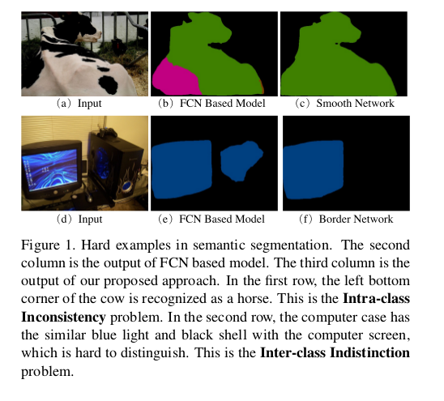
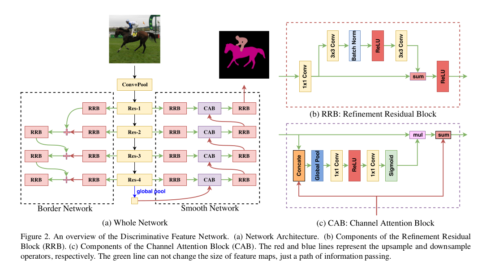
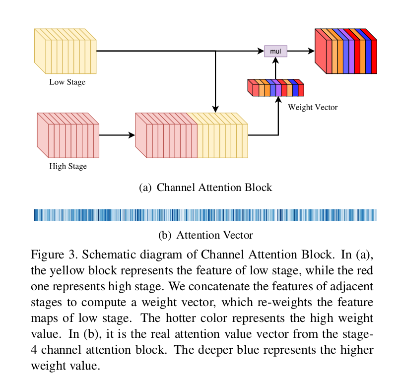
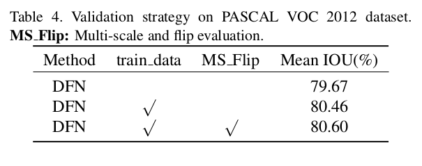

Learning a Discriminative Feature Network for Semantic Segmentation
=

# 1. Introduction
然而，这些方法学到的特征通常不能区分1）共享相同语义标签但外观不同的补丁，如图1第一行所示，称为类内不一致; 2）具有不同语义标签但具有相似外观的两个相邻贴片，如图1的第二行所示，称为类间模糊（Indistinction）。

为了解决这两个挑战，我们从更宏观的角度重新思考语义分割任务。通过这种方式，我们将语义分割视为一项任为一类事物而不是每一个像素分配一致的语义标签的任务。从这个宏观角度，将每个类的像素视为一个整体，本质上考虑了类内一致性和类间变化。意味着该任务需要具有辨别力的特征。为此，我们提出一种新颖的辨别性特征网络（Discriminative Feature Network： DFN）来学习特征表示，其考虑到“类内一致性”和“类间辨别性”。

我们的DFN包含两个部分：Smooth Network 和 Border Network，如图2所示。Smooth Network 被设计用于处理类内不一致问题。为了学习类内一致性的鲁棒性特征表示，我们通常考虑两个关键因素。一方面，我们需要多尺度和全局上下文特征，以编码局部和全局信息。例如，图1（a）中小型白色块，由于不充分的上下文信息，通常不能预测正确的类别。另一方面，由于多尺度上下文被引入，对于某个尺度的事物，特征据欧不同程度的辨别性，其中一些可能预测错误标签。因此，有必要选择具有辨别性和有效的特征。受这两方面的启发，提出基于“U”形结构的Smooth Network以捕获不同尺度的上下文信息，使用全局池化捕获全局上下文。同时，我们提出Channel Attention Block（CAB），其利用高级特征引导逐阶段的低级特征的选择。

Border Network，一方面，尝试区分具有相似外观、不同语义标签的相邻patch 。大多数已有的方法将语义分割任务视为一个密集识别问题，这通常忽略了对类间关系的明确建模。考虑图1（d）的例子，如果越来越多的全局上下文集成到分类过程，由于外观相似，显示器旁边的电脑机箱很容易被错误分类为显示器。因此，明确地涉及语义边界以指导特征的学习是重要的。它可以放大两侧特征的变化。在Border Network中，我们将语义边界损失集成到训练过程以学习辨别性特征，从而扩大“类间辨别性”。

总之，我们的论文有四个贡献：
- 我们从宏观角度重新思考语义分割任务。我们将语义分割视为给某类事物分配一致性语义标签的任务，而不仅在像素水平。
- 我们提出Discriminative Feature Network以同时处理“类内一致性”和“类间变化”问题。
- 我们提出Smooth Network 以使用全局上下文和Channel Attention Block加强类内一致性。
- 我们设计具有深度监督的Border Network以扩大语义边界两侧的特征变化。这也可以精炼预测语义边界。

# 3. Method
## 3.1. Smooth Network
在语义分割任务中，大多数现代方法将它视为密集预测问题。然而，有时，预测在某些部分有错误的结果，特别是较大区域和复杂场景的一部分，这称为类内不一致问题。

类内不一致问题主要是由于缺乏上下文。因此，我们通过全局均值池化引入全局上下文。然而，全局上下文仅有高语义信息，其对恢复空间信息没有帮助。因此，我们需要多尺度感受野和上下文来细化空间信息。尽管如此，存在一个问题，不同尺度的感受野产生具有不同程度的辨别特征，这产生不一致的结果。因此，我们需要选择更具辨别性的特征，以与某个特定类别的统一语义标签。

在我们所提出网络中，我们使用ResNet作为基本识别模型。这个模型根据特征图的大小分为5个阶段。根据我们的观察，不同阶段具有不同的识别能力，导致不同的一致性表现。在较低阶段，网络编码了更精细空间信息，然而，由于其很小的感受和不具备空间上文的指导，它的语义一致性较差。同时，在较高阶段，由于较大的感受野，有强壮的语义一致性，但是，预测在空间上粗糙的。_综合来说，更低阶段作出更准确的空间预测，而更高阶段给出更准确的语义预测。_ 基于这些观察，结合它们的优势，我们提出Smooth Network以利用更高阶段的一致性来指导较低极端进行最优预测。

我们观察到当前与语义分割相关的框架，主要为两种风格。第一种是“Backbone-Style”，例如PSPNet、DeepLab V3 ，它们嵌入不同尺度的语义信息，以提高具有SPP或ASPP模块的网络的一致性。另一种是“Encoder-Decoder-Style”，例如RefineNet、Global Convolutional Network，它们的网络使用不同阶段固有的多尺度上下文，但是缺乏具有最强一致性的全局上下文。此外，当网络集合相邻阶段的特征时，仅按通道将它们相加，这种操作忽略不同阶段的多种一致性。我们弥补这个缺点，首先，嵌入全局均值池化层以将“U”性架构扩展到“V”形架构。通过全局均值池化层，我们将最强一致性约束引入网络作为指导。此外，为了加强一致性，我们设计了Channel Attention Block，如图2（c）。这种设计结合相邻阶段特征以计算通道注意力向量（如图3（b））。较高阶段的特征提供了强壮的一致性指导，而较低阶段的特征给出了不同辨别性的特征信息。以这种方式，通道注意力可以选择辨别性特征。

**Channel Attention Block：** CAB设计用于改变每个阶段特征的权重，以加强一致性，如图3所示。在FCN架构中，卷积操作输出一个得分图，其给出每个像素属于每个类的概率。在公式（1）中，得分图的最终得分仅在特征图的所有通道上相加。
$$y_k = F(x;w) = \sum_{i=1,j=1}^D w_{i,j} x_{i,j} \tag 1$$
其中 $x$ 是网络的输出特征， $w$ 表示卷积核， $k \in \{1, 2, \cdots, K\}$ ，$K$ 是通道的数量。 $D$ 是像素位置集合。
$$\delta_i(y_k) = \frac{\exp(y_k)}{\sum_{j=1}^K\exp(y_j)} \tag 2$$
其中 $\delta$ 是预测概率， $y$ 是网络输出。

如公式（1）和公式（2）所示，最终的预测标签是具有最大概率的类别。因此，我们假设某个patch的预测结果是 $y_0$ ，而其真实标签是 $y_1$ 。因此，我们引入参数 $\alpha$ 来改变从 $y_0$ 到 $y_1$ 的最高概率值，如公式（3）：
$$\bar{y} = \alpha y = \left[
  \begin{array}{c}
  \alpha_1  \\
  \vdots  \\
  \alpha_K
  \end{array}
\right]
\cdot
\left[
  \begin{array}{c}
  y_1  \\
  \vdots  \\
  y_K
  \end{array}
\right]
=
\left[
  \begin{array}{c}
  \alpha_1 w_1 \\
  \vdots  \\
  \alpha_K w_K
  \end{array}
\right]
\times
\left[
  \begin{array}{c}
  x_1  \\
  \vdots  \\
  x_K
  \end{array}
\right]  \tag 3
$$
其中 $\bar{y}$ 是网络新的输出， $\alpha = Sigmoid(x; w)$ 。

基于CAB的公式，我们可以探索它的实际意义。在式（1）中，隐式地指出不同通道的权重是相等的。然而，如第一节提到的，不同阶段的特征有不同程度的辨别能力，这产生了不同的一致性预测。为了获得类内一致预测，我们应该提取辨别性特征，并抑制不具辨别性的特征。因此，式（3）中，$\alpha$ 值应用到特征图 $x$ ，其表示CAB的特征值选择。使用这种设计，我们能够是网络获得逐阶段的辨别性特征以作出类内一致性预测。

**Refinement Residual Block：** 特征网络中每个阶段的特征图全部通过Refinement Residual Block，如图2（b）。该模块的第一个部分是 $1 \times 1$ 卷积层，通道数统一使用256 。同时，它可以结合跨越所有通道的信息。接下来是基本的残差块，其可以细化特征图。此外，这个块加强了每个阶段的特征识别能力。

## 3.2. Border Network
在语义分割任务中，预测与具有相似外观的不同类别混淆，特别是当它们在空间上相邻时。因此，我们需要放大特征的区别。有了这个动机，我们采用语义边界来指导特征学习。为了提取准确的语义边界，我们应用语义边界的显式监督，使网络学习具有强大的类间区分能力的特征。因此，我们提出Border Network来扩大类间区分。它直接学习具有显示语义边界监督的语义边界，与语义边界检测任务相似。这使得语义边界两侧的特征可以区分。

如3.1节所述，特征网络有不同的阶段。较低阶段的特征有更详细的信息，而较高阶段特征有更高级的语义信息。本文中，需要更多语义意义的语义边界。因此，我们设计bottom-up的Border Network。_这个网络能够同时从较低阶段获得准确的边缘信息，从较高阶段获得语义信息。_ 以这种方式，较高阶段的语义信息可以逐阶段地细化较低阶段的详细边缘信息。网络的监督信号通过传统图像处理方法（如Canny）从语义分割的groud-truth上获得。

为了解决正类和负类样本之间的不平衡，我们使用focal loss来监督Border Network的输出，如式（4）所示。我们调整焦点损失的参数 $\alpha$ 和 $\gamma$ 以获得更好的性能。
$$FL(p_k) = -(1-p_k)^\gamma \log p_k  \tag 4$$
其中 $p_k$ 为类 $k$ 的估计概率， $k \in \{1, 2, \cdots, K\}$ ， $K$ 是类标签的最大值。Border Network主要关注语义边界，该边界将边界两侧的类分开。为了提取准确的语义边界，两侧的特征将变得更具区分性。这正是达到了我们的目标，即尽可能地使这些特征具有类间的区别。

## 3.3. Network Architecture
网络架构如图2（a）。使用预训练的ResNet作为基本网络。Smooth Network的损失函数为：
$$l_s = SoftmaxLoss(y;w) \tag 5$$
Border Network的损失函数为
$$l_b = FocalLoss(y;w)  \tag 6$$
最终，损失函数为
$$L = l_s + \lambda l_b  \tag 7$$

# 4. Experimental Results
## 4.1. Implementation Details
使用ImageNet上预训练的ResNet-101，使用FCN4作为基本分割框架。

**Training：** 使批大小为32、动量为0.9和权重衰减为0.0001的小批量随机梯度下降训练网络。采用“poly”学习率策略，其中学习率乘以 $(1 - \frac{iter}{max\_iter})^{power}$ ， power为0.9，初始学习率为 $4e{-3}$ 。将 $\lambda$ 设置为0.1 。

**Data Augmentation：** 使用mean subtraction，随机水平翻转。随机缩放，使用5个尺度 $\{0.5, 0.75, 1., 1.5, 1.75\}$ 。

## 4.2. Ablation Study
### 4.2.1 Smooth Network
首先评估基本的ResNet-101的性能，如表1所示。

Refinement Residual Block (RRB)的性能如表2 。

### 4.2.2 Border Network

### 4.2.3. Discriminative Feature network

