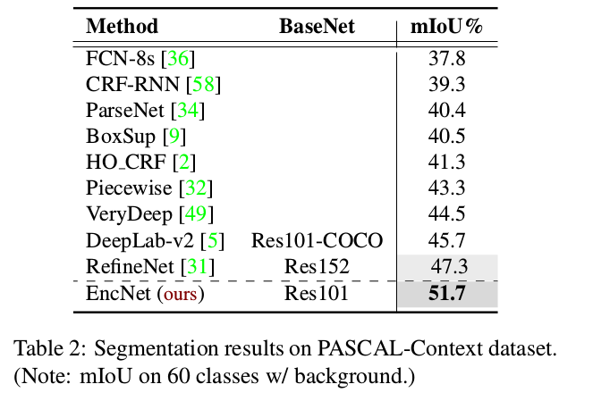
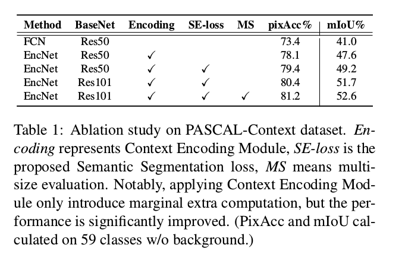
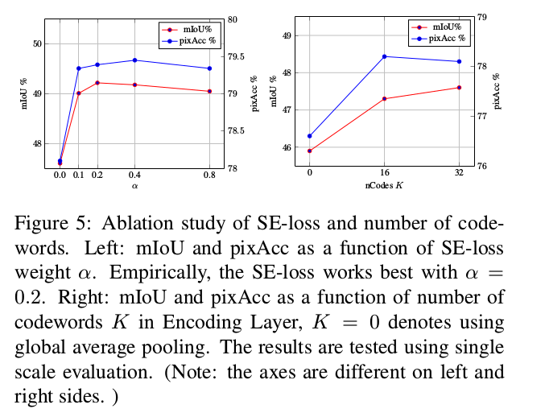
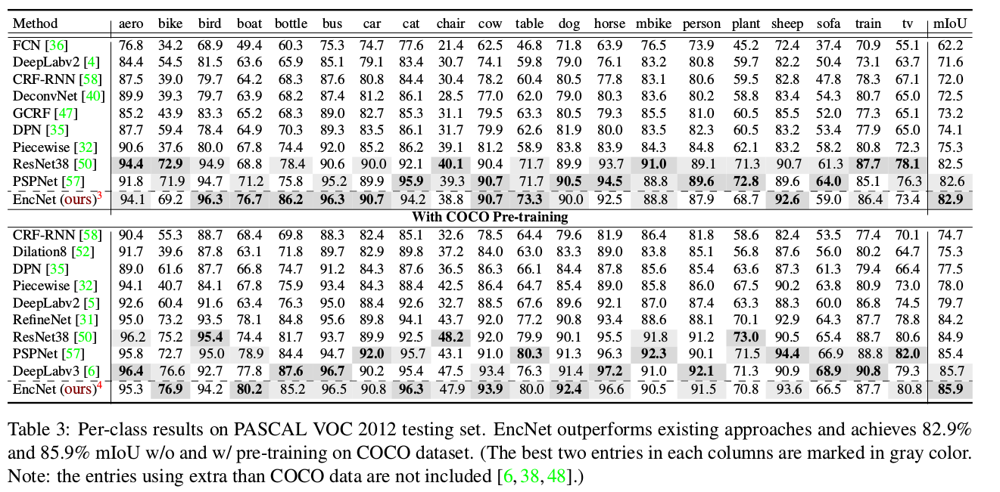

Context Encoding for Semantic Segmentation
=

# 1. Introduction

虽然如PSPNet和DeepLab等方法确实提高了性能，但上下文表示并不明确，导致了以下问题： _捕获的上下文信息是否与增加的感受野大小相同？_
考虑为大型数据集标注新图像（例如包含150个类别的ADE20K [59]），如图1所示。首先，我们假设有一种允许标注者选择图像（例如卧室）语义上下文的工具。然后，该工具可以提供更小的相关类别的子列表（例如床，椅子等），这将大大减少可能类别的搜索空间。相似地，如果我们能够设计一种完整利用场景上下文和类别概率之间强相关性的方法，那么网络的语义分割将变得更加容易。

传统的计算机视觉方法有捕获场景语义上下文的优势。对于给定的输入图像，使用SIFT或filter bank response密集提取手工特征。然后，常学习一个视觉词汇表（字典），以及例如Bag-of-Words（BoW）、VLAD或Fisher Vector等经典编码器描述的全局特征统计量。这些经典表征通过捕获特征统计量来编码全局上下文信息。虽然手工特征被CNN极大地改进，但是传统方法的综合编码过程方便而有力。_我们能否使用深度学习的力量利用经典方法的上下文编码？_ zhang等（deep ten）引入编码层（Encoding Layer），它将整个字典的学习和残差编码流水线集成到一个CNN层中，以捕获无序表征。本文中，我们扩展Encoding Layer以捕获理解语义上下文的全局特征统计量。

本文的贡献：
- 引入包含Semantic Encoding Loss（SE-Loss）的Context Encoding Module ，一种利用全局场景上下文信息的简单单元。Context Encoding Module集成Encoding Layer以捕获全局上下文，并选择性地突出类别依赖的特征图。直觉上，考虑我们想要强调汽车出现在室内场景的概率。标准训练过程仅采用逐像素的分割损失，其没有强力实现场景的全局上下文。我们引入Semantic Encoding Loss（SE-loss）来正则化训练，其通过让网络预测场景中对象类别的存在性来加强网络的语义上下文学习。不同与每个像素的损失，SE-loss为大小物体提供了相同的贡献，我们发现小物体的性能在实践中经常得到改善。
- 设计和实现一种新的语义分割框架——Context Encoding Network（EncNet）。EncNet通过引入Context Encoding Module来增强预训练的ResNet，如图2 。

# 2. Context Encoding Module
**Context Encoding** 理解和利用上下文信息对于语义分割非常重要。对于在多种图像数据集上预训练的网络，特征图编码了丰富的场景对象信息。我们采用Encoding Layer来捕获特征统计量作为全局语义上下文。我们称Encoding Layer的输出为encoded semantics 。为了利用上下文，预测了一组缩放因子，以选择性地突出类别依赖的特征图。Encoding Layer 学习携带数据集语义上下文的固有字典，并输出具有丰富上下文信息的残差编码器。

Encoding Layer将形状为 $C \times H \times W$ 的特征图视为 $C$ 维的输入特征 $X = \{x_1, \cdots, x_N\}$ 的集合，其中 $N$ 是由 $H \times W$ 给出的特征总数，其学习包含 $K$ 个码字（codewords，or visual centers）的固有码本（codebook）$D = \{d_1, \cdots, d_K\}$ ，以及视觉中心（visual center）的平滑因子集合 $S = \{s_1, \cdots, s_K\}$ 。Encoding Layer通过聚合具有软对齐权重 $e_k = \sum_{i=1}^N e_{ik}$ 的残差类输出残差编码器，其中
$$e_{ik} = \frac{\exp(-s_k ||r_{ik}||^2)}{\sum_{j=1}^K \exp(-s_j ||r_{ij}||^2)} r_{ik} \tag 1$$
并且残差由 $r_{ik} = x_i - d_k$ 给出。我们将聚合（aggregation）应用到编码器，而不是concatenation。即，$e = \sum_{k=1}^K\phi(e_k)$ ，其中 $\phi$ 表示具有ReLU激活的批归一化，避免了对 $K$ 个独立编码器进行排序，并且还降低了特征表示的维数。

**Featuremap Attention** 为了使用Encoding Layer捕获的编码语义，我们将特征图的缩放因子预测为反馈循环，以强调或不强调依赖于类的特征图。我们在Encoding Layer顶部使用全连接层，并sigmoid作为激活函数，其输出预测特征图的缩放因子 $\gamma = \delta(We)$ ，其中 $W$ 表示层的权重，$\delta$ 为sigmoid函数。然后，模块的输出由 $Y = X \otimes \gamma$ 给出， $\otimes$ 为逐通道乘法。作为该方法的实用性的直观示例，考虑强调飞机在天空场景中的概率，但是不再强调车辆的概率。

**Semantic Encoding Loss** 在标准的语义分割训练过程中，网络从孤立的像素中学习（给定输入图像和ground-truth标签的逐像素交叉熵损失）。网络可能难以理解没有全局信息的上下文。为了正则化Context Encoding Module的训练，我们引入Semantic Encoding Loss（SE-loss），其迫使网络在非常小的额外计算成本下理解全局语义信息。我们在Encoding Layer顶部构建了附加的全连接层，来为场景中对象类别的存在性作出单独的预测，并以二值交叉熵损失学习。
实际应用中，我们发现小对象的分割常常得到改善。总之，Context Encoding Module（如表2）捕获语义上下文以预测一组缩放因子，其选择性地突出类依赖的特征图。

## 2.1. Context Encoding Network（EncNet）

有了所提出的Context Encoding Module，我们构建具有预训练ResNet的Context Encoding Network（EncNet）。我们遵循先前工作使用的膨胀网络策略，即在预训练网的stage 3 和 stage4 使用膨胀卷积，如图3所示。我们在最终预测之前在卷积层之上构建我们提出的上下文编码模块，如图2所示。为了进一步提高性能并规范Context Encoding模块的训练，我们创建了一个单独的分支，以最小化将编码语义作为输入并预测对象类的存在的SE-loss。由于Context Encoding Module和SE-loss是非常轻量的，所以我们在stage 3的顶部构建另一个Context Encoding Module，以最小化SE-loss作为附加的正则化，与PSPNet的辅助损失相似，但是更轻。SE-loss的ground-truth从ground-truth分割掩模直接生成，而不需要额外标注。

Context Encoding Module是可微的，并且插入到已有的FCN流水线，而不没有任何额外的训练监督或框架修改。在计算方面，所提出的EncNet仅引入少量额外的计算到原始的膨胀FCN网络。

## 2.2. Relation to Other Approaches

# 3. Experimental Results
## 3.1. Implementation Details
我们将膨胀策略应用于预训练网络的第3阶段和第4阶段，输出大小为1/8 [4,52]。输出预测使用双线性插值上采样8倍以计算损失。使用学习率策略为 $lr = baselr * (1 - \frac{iter}{total\_iter})^{power}$ ，ADE20K数据集基学习率为 0.01，其他数据集为 0.001，power设置为 0.9 。动量设置为0.9，weight decay设置为 0.0001 。PASCAL-Context和PASCAL VOC 2012训练50 epoch，ADE20K训练120 epoch。对于数据增强，随机翻转、0.5到2之间的缩放图像以及-10到10的之间的随机旋转图像，并最终剪裁称固定尺寸的特征，如果需要使用零填充。对于验证，我们求多个尺度网络预测的均值。

在训练期间，使用批大小为16 ，在Encoding Layer中使用码字数量为32 。SE-loss的ground-truth标签通过“唯一（unique）”操作找到在ground-truth分割掩模中给出的类别。

## 3.2. Results on PASCAL-Context

最终选择，$\alpha = 2$ ，$K = 32$ 。

## 3.3. Results on PASCAL VOC 2012

## 3.4. Results on ADE20K
