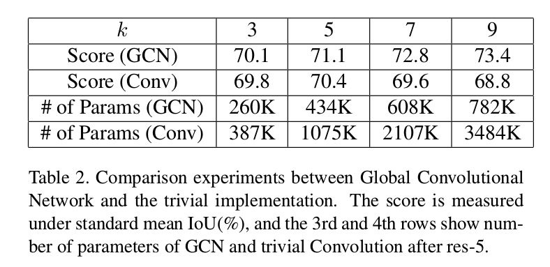
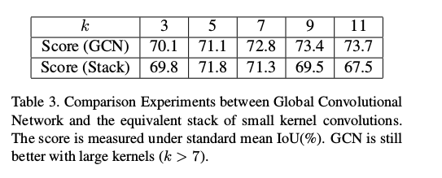
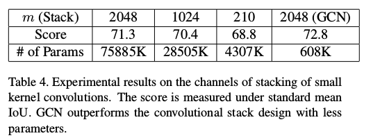
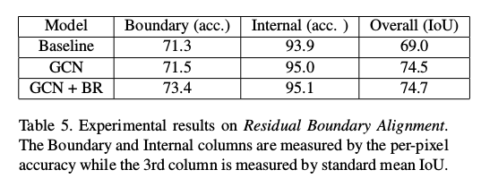
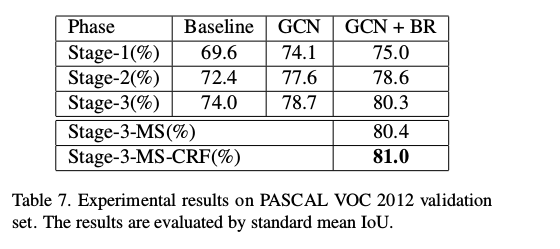

Large Kernel Matters —— Improve Semantic Segmentation by Global Convolutional Network
=

# 1. Introduction
语义分割可以视为逐像素的分类问题。这两个任务有两个挑战：1）**分类：** 一个对象对应一个应当正确标记的特定语义概念；2）**定位：** 一个像素的分类标签必须与输出得分图的合适坐标对齐。一个设计良好的分割模型应当同时处理这两个问题。

然而，这两个任务本质上是矛盾的。对于分类任务，模型需要对如平移和选择等不同变换是不变的。但是，对于定位任务，模型应该是变换敏感的，即精确地定位每个语义类别的每个像素。传统的语义分割算法主要针对定位问题，如图1B所示，但是可能降低分类性能。

在本文中，我们提出了一种改进的网络架构，称为全局卷积网络（GCN），以同时应对上述两个挑战。我们遵循两个实际原则：_1）从定位的角度看，模型的结构应当是全卷积网络，以维持定位性能，不应使用全连接或全局池层，因为这些层将丢弃位置信息; 2）从分类的角度看，应当在网络架构中采用大尺寸的核，以确保特征图和每个像素分类器之间的密集连接，这增强处理不同变换的能力。_ 这两个原则产生了我们的GCN，如图2 A 。采用FCN似的结构作为基本框架，并且使用GCN产生语义得分图。为了是全局卷积变得实用，我们采用对称、可分离滤波器以减少模型阐述和计算成本。为了进一步改善对象边界附近的定位能力，我们引入边界精炼（boundary refinement）块，以将边界对齐建模为残差结构，如图2 C所示。不同于CRF似的后处理，我们的边界精炼块集成到网络中，并能端到端训练。

我们的贡献如下：
- 1）我们为语义分割提出全局卷积网络，其能明确地处理“分类”和“定位” 问题。
- 2）引入Boundary Refinement block，其能进一步提高对象边界附近的定位性能。
- 3）获得state-of-art。

# 3. Approach
## 3.1 Global Convolutional Network
语义风有两个挑战：分类和定位。然而，我们发现分类和定位的需求本质上是矛盾的：（1）对于分类任务，模型需要对输入的变换是不变的，输入对象可能是经过平移、旋转或缩放，但是分类结果应保持不变；（2）然而，对于定位任务，模型应当是变换敏感的，因为定位结果依赖输入的位置。

在深度学习中，分类和定位的差异导致模型的不同风格。对于分类，大多数现代框架（如AlexNet、VGGNet、GoogLeNet或ResNet）采用“锥形（Cone-shape）”网络，如图1 A ：特征由相应的小型隐藏层提取，其在空间维度上是粗糙的，而分类器通过全连接层或全局池化层与整个特征图密集连接，这使得特征对局部扰动具有鲁棒性，并且允许分类器处理不同类型的输入变换。相反，对于定位，我们需要相应的大型特征图来编码更多的空间信息。这就是为什么大多数语义分割框架（如FCN、U-Net、DeepLab、DeconvNet）采用“Barrel-shape”网络，如图1 B 。使用例如 Deconvolution、Unpooling和Dilated-Convolution来生成高分辨率特征图，然后分类器局部连接特征图的每个空间位置，以生成逐像素语义标签。

我们注意到当前最先进的语义分割模型[25,6,27]主要遵循定位的设计原则，然而，这可能是次优的分类。由于分类器是局部连接而不是全局连接到特征图，因此分类器很难处理输入上的不同变换变体。例如，考虑图3的场景：分类器对齐到输入对象的中心，所以期望给出对象的语义标签。首先，有效感受野（valid receptive field： VRF）要足够大以容纳整个对象。然而，如果输入对象调整到较大尺度，然后VRF仅能覆盖对象的一个部分，这可能对分类有害。如果使用更大的特征图，情况可能变得更糟，因为分类和定位之间的差异变得更大。

基于上述观察，我尝试设计一种新的架构来克服这些缺点。首先，从定位的角度，结构必须是全卷积而没有用于分类网络的全连接层或全局池化层，因为后者可能丢弃位置信息。其次，同分类的角度，受分类模型的密集结构的启发，卷积结构的核尺寸应当尽可能的大。具体地，如果核的大小增加到特征图的空间尺寸（称为全局卷积（global convolution）），网络将与纯分类模型共享相同的好处。基于这两个原则，我们提出新颖的全局卷积网络（FCN），如图2 B 。不同与直接使用更大的核或者全局卷积，GCN模块采用 $1 \times k + k \times 1$ 和 $k \times 1 + 1 \times k$ 卷积的组合，这使得能够在特征图中的大 $k \times k$ 区域内进行密集连接。不同于[33]z中使用的可分离核，我们在卷积层后不使用任何非线性层。相比于普通的 $k \times k$ 卷积，GCN结构仅有 $O(\frac{2}{k})$ 的计算成本和参数量，这对于大核是更实用的。

## 3.2. Overall Framework
我们的整体分割模型如图2所示。我们使用预训练的ResNet作为特征网络，FCN作为分割框架。多尺度特征在特征网络的不同阶段提取。GCN结构用于为每个类生成多尺度语义得分图。与[25,36]相似，更低分辨率的得分图使用反卷积上采样，然后与更高分辨的特征图相加以生成新的得分图。最后的语义得分图在最后一次上采样后生成，其用于输出预测结果。

此外，我们采用图2 C中的Boundary Refinement lock 。这里，我们将边界对齐建模为一个残差结构。更具体地，我们定义 $\tilde{S}$ 为精炼的得分图： $\tilde{S} = S + \cal{R} (S)$ ，其中 $S$ 是粗糙的分区，$\cal{R}(\cdot)$ 是残差分支。

# 4. Experiment
我们在标准的基准测试PASCAL VOC 2012 和 Cityscapes中评估我们的方法。我们也使用Semantic Boundaries Dataset作为辅助数据集，10582张图像用于训练。我们选择ResNet-152（ImageNet上预训练）作为基本模型用于微调。在训练期间，我们使用标准的SGD，批大小为1，momentum为0.99，weight decay为0.0005 。数据增强为均值剪发和水平翻转。

## 4.1. Ablation Experiments
对于所有后续实验，我们将每个输入图像填充为 $512 \times 512$，以使最顶部的特征图为 $16 \times 16$ 。

### 4.1.1. Global Convolutional Network -- Large Kernel Matters
GCN的核大小由 $k$ 控制。我们评估不同 $k$ ，并测试其性能。GCN整体架构如图2 B 。我们比较了如图4中不同的基线。结构如图1 。

**Further Discussion:** 在表1中的实验中，由于基线和不同版本的GCN之间存在其他差异，因此似乎没有将这些改进归因于大型内核或GCN。 例如，有人可能会争辩说，较大的 $k$ 带来的额外参数会导致性能提升。 或者有人可能会考虑使用另一个简单的结构而不是GCN来实现大的相等的内核尺寸。 因此，我们将提供更多证据以便更好地理解。

（1）更多参数是否有帮助？在GCN中，参数量随着核的大小 $k$ 线性增加，因此一个自然的假设是，表1中的改善主要由增加的参数带来。为了处理这个问题，我们将GCN与普通的大核设计进行比较，并用图4C 中所示的简单 $k \times k$ 卷积进行比较。结果如表2所示。

（2） GCN vs. Stack of small convolutions.

（3）How GCN contributes to the segmentation results?

### 4.1.2 Global Convolutional Network for Pre-trained Model

## 4.2. PASCAL VOC 2012
采用COCO预训练的GCN。训练分为两个阶段：（1）在Stage-1，我们混合所有的COCO、SBD和PASCAL VOC 2012数据，产生109892张图像用于训练。（2）在Stage-2，我们使用SBD和标准的PASCAL VOC 2012图像训练。（3）在Stage-3，我们仅使用标准的PASCAL VOC 2012 数据集训练。在Stage-1，输入图像为 $640 \times 640$ ，Stage-2和Stage-3的输入图像为 $512 \times 512$ 。

