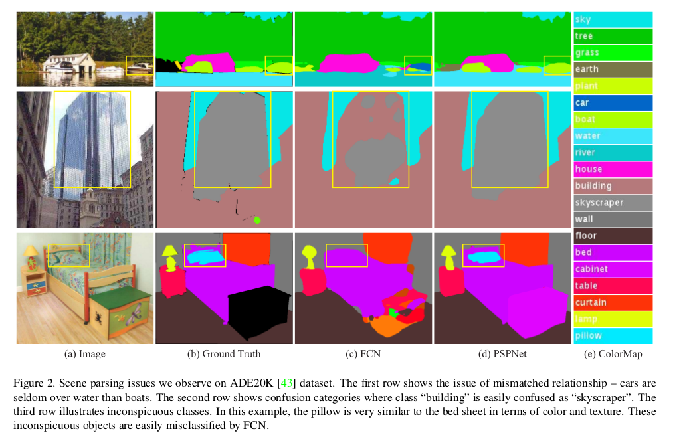
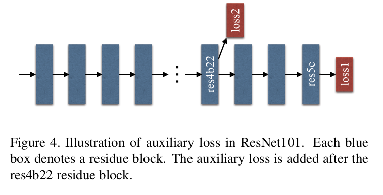
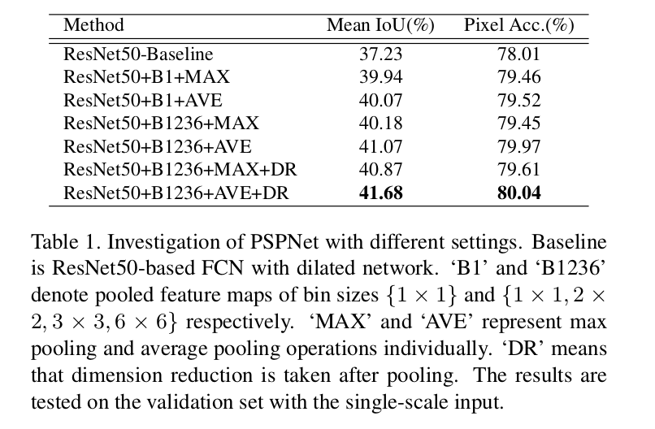
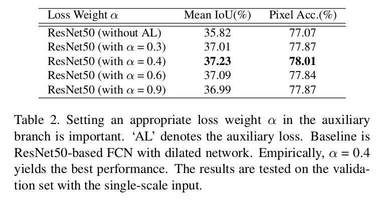
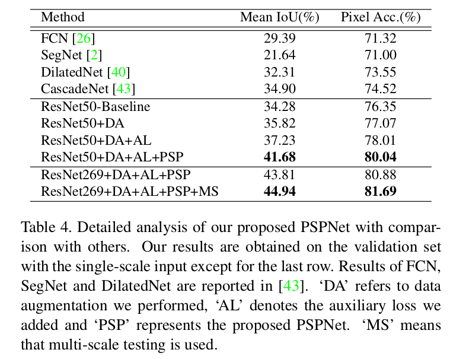
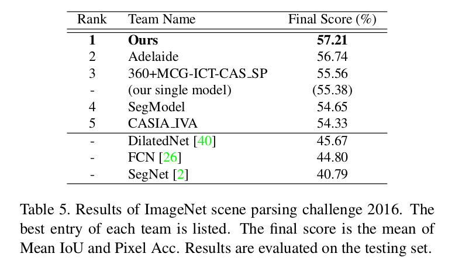
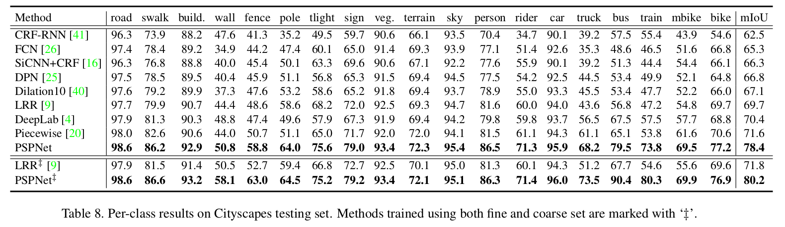

Pyramid Scene Parsing Network
=

# 1 Introduction
场景解析（scene parsing），基于语义分割，是计算机视觉中主要的主题。其目标是为图像中的每个像素分配一个类别标签。场景解析提供了对图像的完整理解。它预测每个元素的标签、位置和形状。该主题对于自动驾驶，机器人传感的潜在应用具有广泛的兴趣，仅举几例。

基于CNN的方法仍然面临不同场景和非限制词汇的条件。一个如图2的第一行所示的例子，将boat无分为car。这种错误是由于对象相似的外观，但是当考虑场景被描述为靠近过河流的boathouse这一上下文先验时，正确的预测便可能产生。

不同SPP类方法，为了处理合适的全局特征，本文所提出金字塔场景解析网络（pyramid scene parsing network: PSPNet）。除了传统的彭正FCN用于像素预测外，还将像素级特征扩展到专门设计的全局金字塔池化中。同时也提出深度监督损失的优化策略。

本文的贡献：
- 提出金字塔场景解析网络以在基于FCN的像素预测框架中嵌入困难的场景上下文特征。
- 基于深度监督损失为深度ResNet开发一种有效的优化策略。
- 最先进的场景解析和语义分割构建了一个实用的系统，其中包含了所有关键的实现细节。

# 2 Related Work

# 3 Pyramid Scene Parsing Network

图3为pyramid scene parsing network 的结构。

## 3.1 Important Observation
检查[43]中提供的FCN基线的预测结果，我们总结了复杂场景解析的几个常见问题。

**Mismatched Relationship** 上下文关系是普遍的，并且对于复杂场景理解非常重要。存在共同的视觉模式。例如，飞机出现在跑道上或在天空中飞行而不可能在路上。对于图2的第一行例子，基于外观，FCN预测黄色边界框中的船为“汽车”。但是常识是汽车很少在河上。缺乏收集上下文信息的能力增加了错误分类的可能性。

**Confusion Categories** ADE20K数据集中的许多类标签对在分类中是混淆的。例如，field 和 earth ； mountain 和 hill ； wall 、 house、 building 和 skyscraper 。它们有相似的外观。数据中仍然有17.60%的像素误差[43] 。在图2的第二行，FCN预测边界框中的对象为skyscraper的部分和building的部分。应排除这些结果，使得对象要么是skyscraper，要么是building，但不能同时包含两者。可以通过利用类别之间的关系来解决该问题。

**Inconspicuous Classes** 场景包含任意尺寸的objects/stuff 。几个小尺寸事物，想streetlight和signboard，难以发现，同时也可能非常重要。相反，大objects或者stuff可能超出FCN的感受野，因此，造成不连续（discontinuous）的预测。如图2第三行所示，枕头和床单有相似的外观。轻视全局场景类别可能无法解析枕头。为了提高非常小或大的对象的性能，应该注意包含不显眼类别的不同子区域。

综合这些观察，许多错误部分或者全部与上下文关系和不同感受野的全局信息相关。因此，具有合适全局场景级（global-scene-level）先验能够极大地改善场景解析的性能。

## 3.2 Pyramid Pooling Module
在深度神经网络中，感受野的大小能够大致表示使用的上下文信息的多少。尽管理论上ResNet的感受野已经大于输入图像，《Object detectors emerge in deep scene cnn》证明CNN实际感受野远小于理论感受野，特别是在高层中。这使得许多网络不能充分地处理之前的重要全局场景。通过提出有效的全局先验表征来解决这个问题。

全局平均池化是一个很好的基线模型，作为全局上下文先验，通常用于图像分类任务[34,13]。Parsenet成功地将其应用到语义分割。但是对于ADE20K中的复杂场景图像[43]，这种策略还不足以涵盖必要的信息。这些场景图像中的像素是关于许多stuff和object的标准。直接融合它们以形成单个向量可能会失去空间关系并导致模糊。_全局背景信息以及子区域上下文有助于区分各种类别。_ 更强大的表示可以是来自不同子区域的信息与这些感受野的融合。SPPNet中，通过金字塔池化的不同层的特征图最终被铺平（flatten），并联结在一起，然后输入到全连接层用于分类。这种全局先验设计用于移除图像分类中CNN固定尺寸的限制。为了进一步减少不同子区域之间的上下文信息，提出中层次全局先验，包含不同尺度的信息，并且在不同子区域之间变化。将其称为金字塔池化模块，用于深度神经网络的最终层特征图上的全局场景先验构建，如图3的部分（c）所示。

金字塔池化模块融合4个不同金字塔尺度的特征。使用红色突出的最粗糙级是全局池化生成的单一bin输出。接下来的金字塔级将特征图分割成不同的子区域，并组成不同位置的池化表征。金字塔池化模块的不同级输出包含不同大小的特征图。如果金字塔层的大小为 $N$ ，为了保持全局特征的权重，在每个特征级之后使用 $1 \times 1$ 卷积层以将上下文表征的维度减少到原始维度的 $1/N$ 。然后直接通过双线性插值将低维特征图直接上采样到与输入相同的大小。最后，特征的不同级联结在一起作为最终的池化全局特征。

注意，金字塔级的数量和每层的大小可以被修改。它们与馈入金字塔池化层的特征图的大小有关。该结构通过以几种歩幅采用不同大小的池化核来抽象不同的子区域。因此，多阶段的核应该在表征中维持合理的间隔。本文的金字塔池化模块为4级，大小为 $1 \times 1$ 、 $2 \times 2$ 、 $3 \times 3$ 和 $6 \times 6$ 。对于max和average之间池化操作类型，在5.2节中执行扩展实验以展示它们的不同之处。

## 3.3 Network Architecture
PSPNet的结构如图3 。使用带膨胀策略的预训练ResNet提取特征图。最终的特征图大小是输入图像的 $1/8$ 。在特征图的顶部使用金字塔池化模块。

# 4 Deep Supervision for ResNet-Based FCN

本文通过监督产生额外损失的初始结果，然后在最终损失后学习残差。如图4，除了使用softmax损失训练最终的分类器外，还在第4个stage（即res4b22）后使用另外一个分类器，并直接将两个损失传到前面的所有层。在测试阶段，移除辅助分支，并仅使用优化号的主分支用于最终预测。

# 5 Experiments
## 5.1 Implementation Details
使用“poly”学习率策略，基学习率乘以 $(1 - \frac{iter}{max\_iter})^{power}$ 。设置基学习率为0.01，power为0.9 。ImageNet迭代150K，PASCAL VOC迭代30K，Cityscapes迭代90K 。momentum = 0.9 ，weight decay = 0.0001 。数据增强策略为随机镜像、在0.5和2.0之间随机缩放图像、随机旋转图像-10到10度和随机高斯模糊。batch size = 16 ，辅助损失的权重为 0.4 。

## 5.2 ImageNet Scene Parsing Challenge
**Dataset and Evalutaion Metrics** ADE20K数据集用于2016ImageNet场景解析挑战。其包含150个类，以及总共1038个图像级标签的不同场景。数据被分为20K/2K/3K的图像用于训练、验证和测试。评估时，使用像素级准确率（pixel-wise accuracy: Pixel  Acc.）和 mean of class-wise intersection over union（Mean IoU）。

**Ablation Study for PSPNet**

表1给出了几种设置，发现平均池化和池化后降维获得最佳结果。

**Ablation Study for Auxiliary Loss**

**Ablation Study for Pre-trained Model**

**More Detailed Performance Analysis**

**Results in Challenge**

## 5.3 PASCAL VOC 2012

## 5.4 Cityscapes

