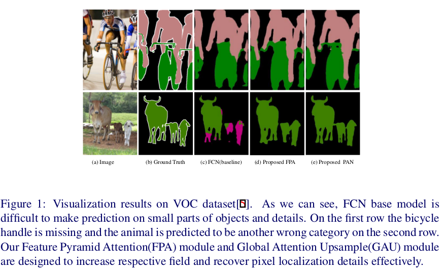
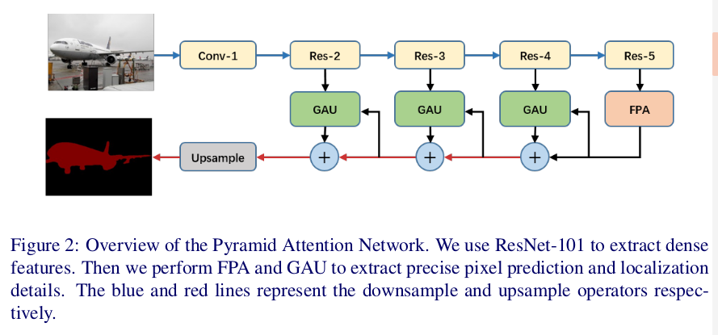
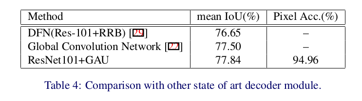
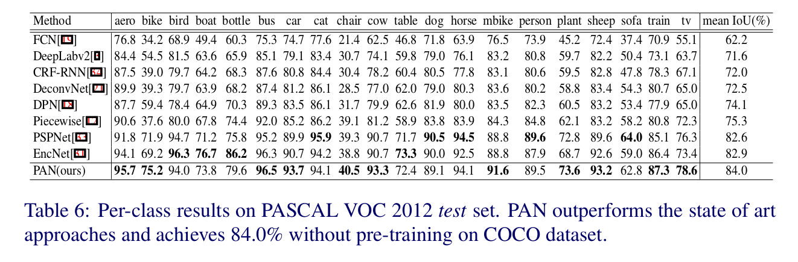

Pyramid Attention Network for Semantic Segmentation
=

# 1. Introduction

如图1所示，我们的FCN基线缺乏在对象的小部分（small parts）作出预测的能力。图1第二列，将牛旁边的羊预测为另一个错误的类别。而，在第一行中，自行车的把手丢失了。我们将两个主要挑战作为考虑因素。

第一问题是，_多尺度物体的存在导致类别分类困难。_ 为了解决这个问题PSPNet或者DeepLab系统执行不同网格尺度或膨胀率的空间金字塔池化。在ASPP模块中，膨胀卷积是一种稀疏计算，可能导致网格伪影（artifact）[28]。而，PSPNet提出金字塔池化模块可能丢失像素级位置信息。受SENet和ParseNet启发，我们尝试为CNN提取的高级特征提取准确的像素级注意力。图1表明我们提出的Feature Pyramid Attention（FPA）模块有能力增加感受野，并且有效地分类小对象。

第二个问题是，_高级特征在类别分类方面很擅长，而在重构原始分辨率的二进制预测方面则很弱。_ 一些U形网络，如SegNet、 RefineNet和Large Kernel Matters执行复杂的解码器模块，其使用低级信息以帮助高级特征恢复图像细节。然而，它们很耗时。为了解决这个问题，我们提出一种称为Global Attention Upsample（GAU）的有效解码器，其能够提取高级特征的全局上下文，以作为加权低级特征信息的指导，而不引起太多的计算负担。

本文的贡献：
- 我们提出了一个特征金字塔注意模块，用于在基于FCN的像素预测框架中嵌入不同尺度的上下文特征。
- 我们开发全局注意力上采样（Global Attention Upsample），它是用于语义分割的高效解码器模块。
- 结合FPA和GAU，我们的Pyramid Attention Network框架在VOC2012和cityscapes上获得最佳准确率。

# 2. Related Work
**Encoder-decoder：** 历史最优分割框架大多基于encoder-decoder网络，它也成功应用到学习计算机视觉任务，包括人体姿态估计、对象检测、图像风格、portrait matting、图像超分辨率等。然而，大多数方法尝试结合相邻阶段的特征以增强低层特征，并考虑它们的多种功能表征和全局上下文信息。

**Global Context Attention：** 受ParseNet启发，几种方法[33,29]都采用全局分支来使用全局上下文。全局上下文能轻松扩大感受野，并增强逐像素分类的一致性。DFN将全局均值池化分支嵌入到网络顶部，已将“U”形架构扩展到“V”性架构。EncNet引入类似SENet模块的编码层以捕获编码语义，并预测在这些编码语义条件下的缩放因子。所有这些都在不同的基准测试中表现出色。本文中，我们应用全局池操作作为附属模块添加到解码器分支以选择有区别的多分辨率特征表示，这被证明是有效的。

**Spatial Pyramid：** 这种类型的模型使用并行的金字塔池化以利用多种尺度的上下文信息。空间金字塔池化[7] [30]已被广泛用于为整体场景解释提供良好的描述，特别是对于多尺度的各种对象。基于此，PSPNet和DeepLab系列分别将全局池化模块扩展到SPP和ASPP。然而，这些模型表明，在几种基准测试上产生高质量分割结果，但是通常需要大量计算资源。

# 3. Method
## 3.1. Feature Pyramid Attention
最近的模型，如PSPNet或DeepLab，在几个网格尺度或应用ASPP模块执行空间金字塔池化。膨胀卷积可能会产生局部信息丢失，而“网格（grid）”可能对特征图的局部一致性有害。PSPNet中提出的金字塔池化模块，在不同尺度池化操作期间，丢失了像素位置。

受注意力机制的启发，我们考虑如何为CNN提取的高层特征提供精确的像素级注意力。在当前的语义分割架构中，金字塔结构可以提取不同尺度的特征信息，并有效增加感受野，同时这类结构缺乏全局上下文先验注意力以逐通道的选择特征，如SENet和EncNet一样。另一方面，使用逐通道注意力向量不足以有效地提取多尺度特征，并缺乏逐像素信息。

根据上述观察，我们提出特征金字塔（FPA）模块。_金字塔注意力模块通过实现如特征金字塔网络的“U”形结构，来融合三个不同金字塔尺度下的特征。_ 为了更好地提取来自不同金字塔尺度的上下文，我们在金字塔结构中分别使用 $3 \times 3$ 、 $5 \times 5$ 、 $7 \times 7$ 卷积。由于高水平特征图的分辨率很小，使用大尺寸的核不会带来过多的计算负担。然后，金字塔结构逐步集成不同尺度的信息，其能更精确地处理相邻尺度的上下文特征。然后，来自CNN的原始特征在经过1×1卷积之后与金字塔注意力特征逐像素相乘。我们也引入全局池化分支与输出特征联结（concatenated），其进一步提高我们的FPA模块的性能。最终的模块结构如图3所示。

受益于空间金字塔结构，特征金字塔注意力模块可以融合不同尺度的上下文信息，同时，为高级特征图产生更好的像素级注意力。不同PSPNet或ASPP，其在通道减少卷积层之前联结不同金字塔尺度的特征图，我们的上下文信息与原始特征图逐像素相乘，其不会引入过多的计算。

## 3.2. Global Attention Upsample
在当前的语义分割网络中设计了几种解码器结构。PSPNet或DeepLab直接使用双线性上采样，其被视为朴素（naive）解码器。DUC[28]使用大通道卷积与重塑（reshape）相结合作为一步解码器模块。朴素解码器和一步解码器都缺乏不同尺度的低层特征图信息，并且将空间位置恢复到原始分辨率可能是有害的。此外，大多数这种类型的方法通常使用复杂的解码器块，其花费大量计算资源。

最近的研究表明，将CNN和设计良好的金字塔模块结合可以会的客观的性能，以及获取类别信息的能力。我们考虑到解码器模块的主要特点是修复类别像素位置。此外，具有丰富类别信息的高级特征可用于加权低级信息以选择精确的分辨率细节。

我们的Global Attention Upsample模块执行全局池化以提供全局上下文作为低级特征的指导，用以选择类别位置细节。细节上，我们在低级特征上执行 $3 \times 3$ 卷积以减小特征图的通道数。从高级特征生成的全局上下文通过具有批归一化和非线性的 $1 \times 1$ 卷积，然后乘以低级特征。最后，将高级特征与加权的低级特征相加，并逐步上采样。该模块更有效地部署不同尺度的特征图，并使用高级特征以简单的方式向低级特征图提供引导信息。

## 3.3. Network Architecture

通过提出的特征金字塔注意力（FPA）和全局注意力上采样（GAU），我们建议我们的金字塔注意力网络（PAN）如图2所示。我们使用在ImageNet上预训练的具有膨胀卷积策略的ResNet-101提取特征图。详细地，具有比率为2的膨胀卷积应用到 $res5b$ 块，因此，来自ResNet的特征图的输出尺寸是输入图像的 $1/16$ （如DeepLabV3+）。我们也将ResNet-101的 $7 \times 7$ 卷积层替换为三个 $3 \times 3$ 卷积层，如PSPNet和DUC。我们使用FPA模块从ResNet的输出中聚合密集的像素级注意力信息。结合全局上下文，GAU模块后跟最终的logits来生成最终的预测图。

我们将特征金字塔注意力模型视为Encoder和Decoder结构之间的中心块。没有全局注意力上采样模块，特征金字塔注意力模块也能提供足够准确的逐像素预测和类别识别，如第4节。在实现金字塔注意力模块之后，我们将Global Attention Module作为一种快速有效的解码器结构，其使用高级特征来指导低级信息，并准确地结合它们。

# 4. Experimental Results
我们在两个主要的分割数据集上评估我们的方法，这两个数据集为：PASCAL VOC 2012语义分割和城市场景数据集Cityscapes。

我们使用“poly”学习率策略，其为初始学习率乘以 $(1 - \frac{iter}{max\_iter})^{power}$ ， $power = 0.9$ ，初始学习率为 $4e-3$ ，使用批大小为16、momentum为0.9和weight decay为0.0001的随机梯度下降训练。应用类别上每个像素的交叉熵误差作为我们的损失函数。我们在训练期间，对所有数据集采用左右翻转以及0.5与2.0之间的随机缩放。

## 4.1. Ablation Experiments
PASCAL VOC 2012包含20个前景对象类，以及一个背景类。原始数据集包含1464张图像用于训练，1449张图像用于验证，1456张图像用于测试。数据集通过Semantic Boundaries Dataset增强缠上10582张图像用于训练。在本节中，我们使用PASCAL VOC 2012验证集用于评估，并且剪裁大小为 $512 \times 512$ 。性能是根据21个类别中使用单比例输入平均的像素IOU来衡量的。

### 4.1.1. Feature Pyramid Attention

### 4.1.2 Global Attention Upsample

## 4.2. PASCAL VOC 2012
将FPA和GAU结合以评估PAN在VOC2012上的性能。在评估时，我们使用多尺度输入 $scales =\{0.5, 0.75, 1.0, 1.25, 1.5, 1.75\}$ ，也有左右翻转。结果如表 5 。

## 4.3. Cityscapes
Cityscapes包含30个类，其中19个用于训练和验证。数据集包含5000个精细标注的图像和19998张粗糙标准的图像。具体地，精细标注的图像被分为训练、验证和测试，分别有2979、500和1525张图像。在训练期间，我们不使用粗糙标注的数据集。裁剪大小为 $768 \times 768$ 。也使用4.1节的ResNet-101 。结果如表7 。

